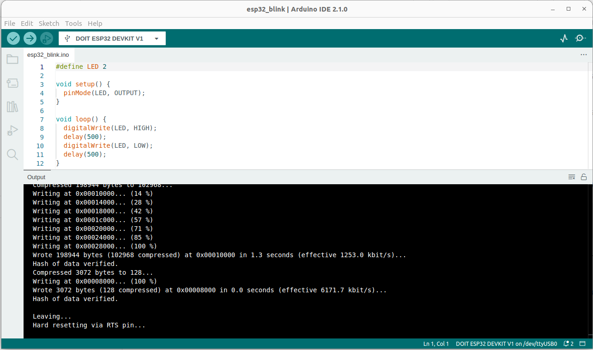

# It is time to Work with a real device

!!! fact

    Exactly the same code you wrote in the simulator, works on the real device, **but in the real device you can do even more!**

* You can easily download the code from Wokwi in the form of a zip project file. 


* One convenient possibility is to use [Arduino IDE](https://support.arduino.cc/hc/en-us/articles/360019833020-Download-and-install-Arduino-IDE) 
* Since we are using the ESP32, you have to follow these [intructions](https://randomnerdtutorials.com/installing-the-esp32-board-in-arduino-ide-windows-instructions/)
* Select the DOIT ESP32 DEVKIT V1 as in the picture below and upload the code



* Another option is to use [PlatformIO](https://platformio.org/). In particular I like the [vscode extension](https://docs.platformio.org/en/latest/integration/ide/vscode.html). 
* To work with the ESP32, this is the minimal setup for the platformio.ini file

```
[env:esp32dev]
platform = espressif32
board = esp32dev
framework = arduino

; Custom Serial Monitor port
monitor_port = /dev/ttyUSB0

; Custom Serial Monitor speed (baud rate)
monitor_speed = 115200
```

## From [Wokwi](https://wokwi.com/) to a real device

1. Compile the code and on the code editor press F1 to download the firmware. It is a .bin file, let's name it sketch.bin file 
2. ```
   esptool.py --chip esp32 --port "/dev/ttyUSB0" --baud 921600  --before default_reset --after hard_reset write_flash  -z --flash_mode keep --flash_freq keep --flash_size keep 0x1000 "bootloader.bin" 0x8000 "partitions.bin" 0xe000 "boot_app0.bin" 0x10000 "sketch.bin"
   ```
Once partitions and bootloader are uploaded, you can simply upload the sketch. To upload for the first time the partitions and the bootloader you can simply used arduino IDE 

3. ```
   esptool.py --chip esp32 --port "/dev/ttyUSB0" --baud 921600  --before default_reset --after hard_reset write_flash  -z --flash_mode keep --flash_freq keep --flash_size keep 0x10000 ./sketch.bin 
   ```

In principle you can even use a [Web tool](https://learn.adafruit.com/adafruit-metro-esp32-s2/web-serial-esptool)

### [Partition Table](https://docs.espressif.com/projects/esp-idf/en/stable/esp32/api-guides/partition-tables.html)

| # Name   |    Type    |  SubType  |  Offset     |   Size    |  Flags |
|----------|------------|-----------|-------------|-----------|--------|
| nvs      |       data |  nvs      |      0x9000 |   0x5000  |        |
| otadata  |   data     |  ota      |      0xe000 |   0x2000  |        |
| app0     |      app   |   ota_0   |    **0x10000**  |  0x140000 |        |
| app1     |      app   |   ota_1   |    0x150000 | 0x140000  |        |
| spiffs   |    data    |  spiffs   |   0x290000  | 0x160000  |        |
| coredump |  data      |  coredump | 0x3F0000    | 0x10000   |        |

## A virtual signal

We consider two ESP32 connected as in the following picture


The node on the left works as a **virtual signal**, it generates a signal using the [DAC](https://www.electronicwings.com/esp32/dac-digital-to-analog-converter-esp32) on PIN 25. 
The node on the right sample the generated signal by the [ADC](https://www.electronicwings.com/esp32/adc-of-esp32) and print the [FFT](). 

```c

#include <Arduino.h>

// Define the DAC and ADC pins
const int dacPin = 25;   // DAC1 (GPIO 25) for sinusoid output

// Parameters for the sine wave
const int amplitude = 100;   // Amplitude of the sine wave (max 255 for 8-bit DAC)
const int offset = 128;      // DC offset (middle of the DAC range)
const float signalFrequency = 5.0;  // Frequency of the sine wave in Hz
int samplingFrequencyDAC = 1000; // sampling theorem should be at least 2*frequency

void setup() {
  Serial.begin(115200);

  // Initialize DAC pin (GPIO 25)
  dacWrite(dacPin, 0);  // Initialize DAC with a low value

}

void loop() {
      for (int i = 0; i < samplingFrequencyDAC; i++) {
      int sineValue = (int)(amplitude * sin(2.0 * PI * signalFrequency * i / samplingFrequencyDAC) + offset);
      dacWrite(dacPin, sineValue);  // Write to DAC (8-bit value)
      Serial.print(">");
      Serial.print("dac:");    
      Serial.println(sineValue);
      delay(round(1.0/samplingFrequencyDAC*1000));
      } 
    
}

```


```c

#include <Arduino.h>

const int adcPin = 34;   // ADC1 (GPIO 34) for reading the sinusoid
int samplingFrequencyADC = 500; // sampling theorem should be at least 2*frequency
const uint16_t samples = 512; 

void setup() {
  Serial.begin(115200);
  analogReadResolution(10); 
  analogSetAttenuation(ADC_11db);  // Set ADC attenuation (default 0dB)
}

void loop() {

  for(int i=0; i<samples; i++)
   {
      Serial.print(">");
      Serial.print("adc:");    
      Serial.println(analogRead(adcPin)-512);
      delay(round(1.0/samplingFrequencyADC*1000));
  }
}

```


### A possible alternative use the PC


[ref](https://forum.arduino.cc/t/how-to-read-data-from-audio-jack/458301/3)

``` python3 -m pip install sounddevice ```

```python

# Use the sounddevice module
# http://python-sounddevice.readthedocs.io/en/0.3.10/

import numpy as np
import sounddevice as sd
import time

# Samples per second
sps = 44100

# Frequency / pitch
freq_hz = 2

# Duration
duration_s = 5.0

# Attenuation so the sound is reasonable
atten = 1.0 # 0.3

# NumpPy magic to calculate the waveform
each_sample_number = np.arange(duration_s * sps)
waveform = np.sin(2 * np.pi * each_sample_number * freq_hz / sps)
waveform_quiet = waveform * atten

# Play the waveform out the speakers
sd.play(waveform_quiet, sps)
time.sleep(duration_s)
sd.stop()

```

[Online Tone Generator](https://onlinetonegenerator.com/)

## Fast Fourier Transform (FFT)


[Colab Notebook on FFT](https://colab.research.google.com/drive/1nuZx095lzt2d9h42N7yNu13crGg9eS9A
)

[arduinoFFT library](https://github.com/kosme/arduinoFFT)

```c

#include <Arduino.h>
#include "arduinoFFT.h"


// Define the DAC and ADC pins
const int adcPin = 36;   // ADC1 (GPIO 34) for reading the sinusoid
int samplingFrequencyADC = 27; // sampling theorem should be at least 2*frequency
const uint16_t samples = 64; 

double vReal[samples];
double vImag[samples];


/* Create FFT object */
ArduinoFFT<double> FFTADC = ArduinoFFT<double>(vReal, vImag, samples, samplingFrequencyADC);

void setup() {
  Serial.begin(115200);
  analogReadResolution(10); 
  analogSetAttenuation(ADC_11db);  // Set ADC attenuation (default 0dB)
}

void loop() {

  for(int i=0; i<samples; i++)
   {
      vReal[i] = analogRead(adcPin)-512;
      vImag[i] = 0;
      /*
      Serial.print(">");
      Serial.print("adc:");    
      Serial.println(analogRead(adcPin)-512);
      */
      delay(round(1.0/samplingFrequencyADC*1000));
  }

  FFTADC.windowing(FFTWindow::Hamming, FFTDirection::Forward);	
  FFTADC.compute(FFTDirection::Forward); 
  FFTADC.complexToMagnitude();
  double x = FFTADC.majorPeak();
  Serial.print("ADC FFT: ");
  Serial.println(x, 6);

  }


```

[source code](https://github.com/andreavitaletti/documents/tree/main/PlatformIO/Projects/virtual%20sensor)