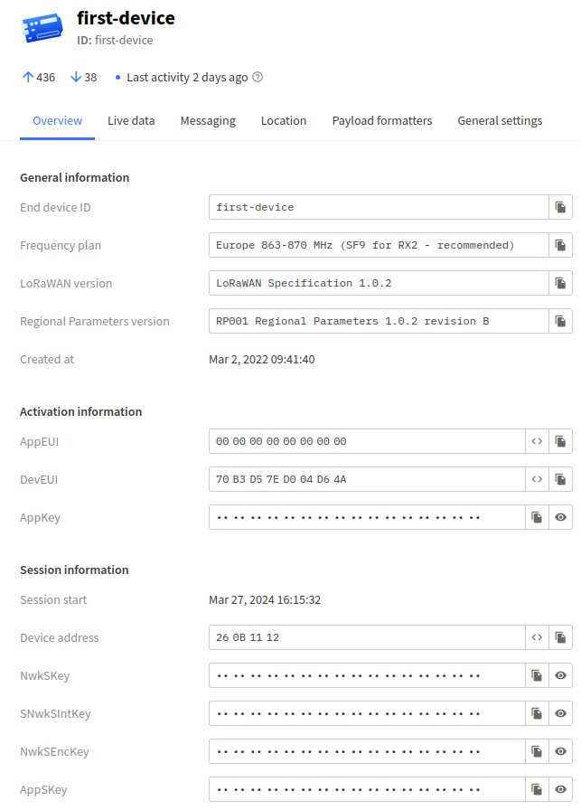

# Scale-up
**GOAL:** Scale-up in a realistic environment.

<iframe src="https://docs.google.com/presentation/d/e/2PACX-1vTdjWAh8Dm64rvoRK495iKx9mEy5vzzfqW9GGkNSl52pZBVC7xWf9y4OH5mMw_izKv9a8Uwsd8nj7PJ/embed?start=false&loop=false&delayms=3000" frameborder="0" width="1058" height="624" allowfullscreen="true" mozallowfullscreen="true" webkitallowfullscreen="true"></iframe>

<iframe src="https://docs.google.com/presentation/d/e/2PACX-1vS0gHE83u26mOIK1G9pPBi6r8Kbf-rV47VQ9u5f4BZ5AZ1z4sWMNZQBjDUTnNEvdyYJjmLtVZn5UJ9Q/embed?start=false&loop=false&delayms=3000" frameborder="0" width="1058" height="624" allowfullscreen="true" mozallowfullscreen="true" webkitallowfullscreen="true"></iframe>

[IoT-LAB](https://www.iot-lab.info/) provides a very large scale infrastructure suitable for testing small wireless sensor devices and heterogeneous communicating objects.

Even if the ESP32 is not currently among the [supported hardware](https://www.iot-lab.info/legacy/hardware/index.html), IoT-LAB [supports FreeRTOS](https://www.iot-lab.info/legacy/operating-systems/index.html).

* Once you have setup a user connect to a lab by ssh, as an example
  
```
ssh vitalett@grenoble.iot-lab.info
```

* Follow the instructions [here](https://iot-lab.github.io/docs/os/freertos/) to run FreeRTOS on IoT-LAB
* The reference code is available on [https://github.com/iot-lab/openlab](https://github.com/iot-lab/openlab) and in particular we are inetrested in the [tutorial](https://github.com/iot-lab/openlab/tree/master/appli/iotlab_examples/tutorial)
* Once the code has been compiled, it can run into an experiment as explained [here](https://www.iot-lab.info/legacy/tutorials/getting-started-tutorial/index.html)
* A quite unique feature, is the ability to perform consuption monitoring as explained [here](https://iot-lab.github.io/docs/tools/consumption-monitoring/). To plot the graphs, download the oml files and use the following [tools](https://github.com/iot-lab/oml-plot-tools/tree/master)

## IOT-LAB

### Run a Lorawan experiment

``` 
ssh vitalett@saclay.iot-lab.info 
```

```
git clone https://github.com/FreeRTOS/FreeRTOS-LTS.git
cd FreeRTOS-LTS/FreeRTOS
git clone https://github.com/Lora-net/LoRaMac-node.git
cd cd LoRaMac-node/
```

```
nano  src/boards/B-L072Z-LRWAN1/board.c

// change the baudrate to 115200 to be compatible with iot-lab serial 

UartConfig( &Uart2, RX_TX, 115200, UART_8_BIT, UART_1_STOP_BIT, NO_PARITY, NO_FLOW_CTRL );
```


```
nano src/peripherals/soft-se/se-identity.h

// update credentials to connect to TTN
#define STATIC_DEVICE_EUI       1
#define LORAWAN_DEVICE_EUI      LORAWAN_DEVICE_EUI_ON_TTN
#define LORAWAN_JOIN_EUI        LORAWAN_APP_EUI_ON_TTN
#define STATIC_DEVICE_ADDRESS   1
#define LORAWAN_DEVICE_ADDRESS  DEVICE_ADDRESS_TTN

.KeyID = NWK_KEY,           
.KeyValue = LORAWAN_APP_KEY_ON_TTN
```



```
mkdir build
cd build

cmake -DCMAKE_BUILD_TYPE=Release         -DTOOLCHAIN_PREFIX="/opt/gcc-arm-none-eabi-4_9-2015q1/"      -DCMAKE_TOOLCHAIN_FILE="../cmake/toolchain-arm-none-eabi.cmake"         -DAPPLICATION="LoRaMac"         -DSUB_PROJECT="periodic-uplink-lpp"         -DCLASSB_ENABLED="ON"         -DACTIVE_REGION="LORAMAC_REGION_EU868"         -DREGION_EU868="ON"         -DREGION_US915="OFF"         -DREGION_CN779="OFF"         -DREGION_EU433="OFF"         -DREGION_AU915="OFF"         -DREGION_AS923="OFF"         -DREGION_CN470="OFF"         -DREGION_KR920="OFF"         -DREGION_IN865="OFF"         -DREGION_RU864="OFF"         -DBOARD="B-L072Z-LRWAN1"       -DSECURE_ELEMENT="SOFT_SE"         -DSECURE_ELEMENT_PRE_PROVISIONED="OFF"         -DUSE_RADIO_DEBUG="ON" ..

make
```

```
cd src/apps/LoRaMac/

iotlab-experiment submit -n rtos_ttn -d 60 -l 1,archi=st-lrwan1:sx1276+site=saclay
{
    "id": 394774
}

iotlab-experiment get -i 394774 -s

iotlab-experiment get -i 394774 -r

iotlab-node --flash LoRaMac-periodic-uplink-lpp -l saclay,st-lrwan1,10

nc st-lrwan1-10 20000
```
