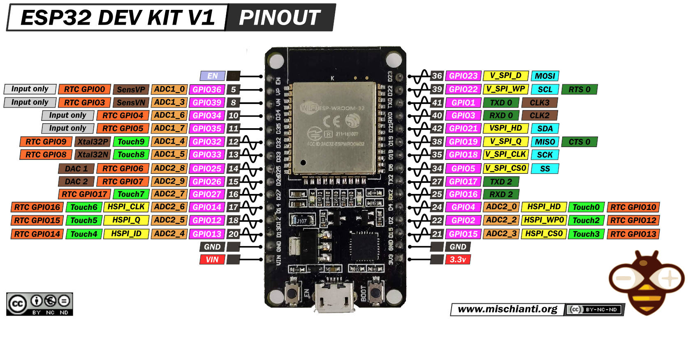
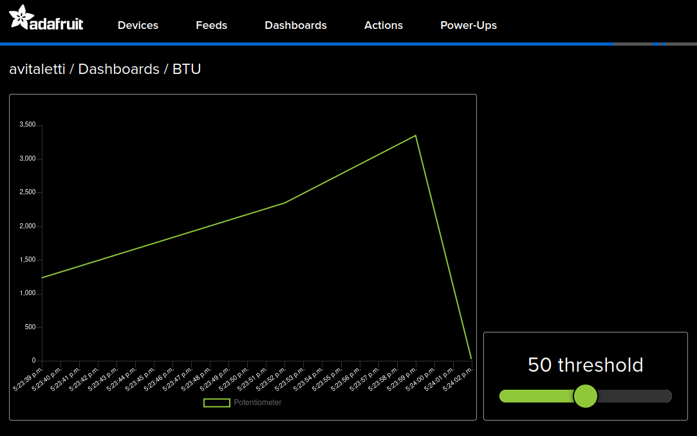
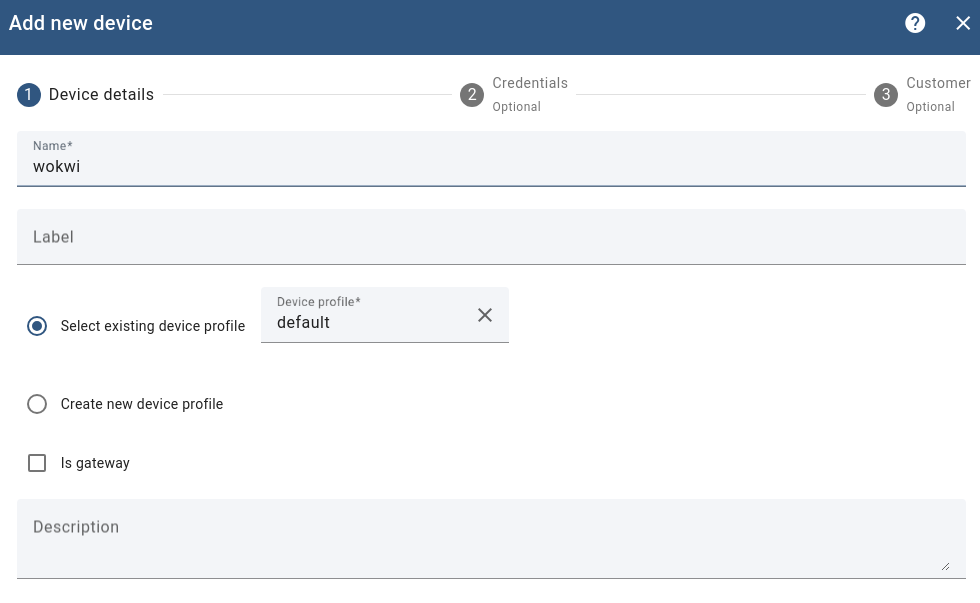

# Simulation of a node

[Wokwi](https://docs.wokwi.com/) is an online Electronics simulator. You can use it to simulate many popular development environment (e.g. Arduino, Esp-idf and RUST just to mention few) boards (e.g. Arduino, [ESP32](https://docs.wokwi.com/guides/esp32), STM32), parts and sensors. 

In this course we will focus on the ESP32-DevKit-V1 and initially on the Arduino environment. Working on this environment with the ESP32 allow us to take advantage from the rich availability of libraries, but also to access  advanced and fundamental features provided by FreeRTOS. However, experimenting with the more advanced ESP-idf is strongly encouraged. 



!!! note
    
    An excellent reference for all what concerns the ESP 32 is available at [electronic wings](https://www.electronicwings.com/esp32) 
    

## Let's start 

On [Wokwi](https://docs.wokwi.com/) open a new project, select ESP32 as the platform and the Arduino template. 

If you now open the diagram.json tab you have something like the following in the parts entry

```
"parts": [ { "type": "board-esp32-devkit-c-v4", "id": "esp", ...} ],
```

This implies that the pinout is the one in the [devkit v4](https://mischianti.org/esp32-devkitc-v4-high-resolution-pinout-and-specs/). 
To get the same pinout as the one in the picture above you need a V1 devkit, so you have to modify the entry as in the following

```
"parts": [ { "type": "board-esp32-devkit-v1", "id": "esp", ...} ],
```

To make running the serial interface be sure that under connection you have th following settings

```
"connections": [
    [ "esp:TX0", "$serialMonitor:RX", "", [] ],
    [ "esp:RX0", "$serialMonitor:TX", "", [] ],
    .....
```


* The simplest actuator, namely a [led](https://wokwi.com/projects/367336864678247425)

## Understanding the Breadboard


## The Simplest digital sensor, namely a [button](https://wokwi.com/projects/367336996835545089)
  


```C

#define LED 5
#define BUTTON 4

int buttonState = 0; 

void setup() {
  pinMode(LED, OUTPUT);
  pinMode(BUTTON, INPUT);
}

void loop() {

  buttonState = digitalRead(BUTTON);

  // check if the pushbutton is pressed. If it is, the buttonState is HIGH:
  if (buttonState == HIGH) {
    // turn LED on:
    digitalWrite(LED, HIGH);
  } else {
    // turn LED off:
    digitalWrite(LED, LOW);
  }
}

```

## A bit more interesting analog sensor, namely a [potentiometer](https://wokwi.com/projects/367338868313181185)


```c

int analogPin = 12; // potentiometer wiper (middle terminal) connected to analog pin
                    // outside leads to ground and +5V
int val = 0;  // variable to store the value read

void setup() {
  Serial.begin(9600);           //  setup serial
}

void loop() {
  val = analogRead(analogPin);  // read the input pin
  Serial.println(val);          // debug value
  delay(1000);
}

```
<!--
* A simple example with [SR04 Ultrasonic Sensor](https://wokwi.com/projects/367320442567677953). The width is measured by the function [pulseIn()](https://www.arduino.cc/reference/en/language/functions/advanced-io/pulsein/).


-->

## Quick overview of more advanced way to interact with sensors


## An I2C sensor, the [MPU6050 Accelerometer](https://wokwi.com/projects/417422405654800385)


```C

#include <Adafruit_MPU6050.h>
#include <Adafruit_Sensor.h>
#include <Wire.h>
Adafruit_MPU6050 m_p_u;
void setup() {
  // put your setup code here, to run once:
  Serial.begin(115200);
  while(!Serial)
  delay(20);
  if(!m_p_u.begin()){
    while(1){
      delay(20);
    }
  }
}

void loop() {
sensors_event_t acc, gcc, temp;
m_p_u.getEvent(&acc, &gcc, &temp);
Serial.println("Acceleration on x axes");
Serial.println(acc.acceleration.x);
  delay(1000); // this speeds up the simulation

Serial.println("Acceleration on y axes");
Serial.println(acc.acceleration.y);
  delay(1000);

Serial.println("Acceleration on z axes");
Serial.println(acc.acceleration.z);
  delay(1000);

Serial.println("Rotation of x axes: ");
Serial.println((gcc.gyro.x)*180/3.14);
  delay(1000);

}

```

Some more details on the [MPU6050](https://randomnerdtutorials.com/esp32-mpu-6050-accelerometer-gyroscope-arduino/) accelerometer and gyroscope. This device can be used for [Predictive Maintenance of Motors using Machine Learning](https://www.ijnrd.org/papers/IJNRD2404282.pdf) or [Ensemble Learning for Predictive Maintenance on Wafer Stick Machine Using IoT Sensor Data](https://doi.org/10.1109/ICOSICA4https://www.ijnrd.org/papers/IJNRD2404282.pdf9951.2020.9243180).


## A simple scenario


You want to transform a door into a **smart door**.

1. A sensor will tell you when the door is open or closed &rarr; button
2. A visual indicator will clearly show whether the door is open or closed &rarr; led
3. Instead of a simple binary condition open/close you also want to know to what extent the door is open &rarr; potentiometer
4. Finally all these information should be available online


## [MQTT](https://dev.to/hivemq_/series/18762)

MQTT is an example of Publish/Subscribe. 


TOPICS:

1.  myhome/groundfloor/livingroom/temperature
2.  myhome/groundfloor/bathroom/temperature
3.  myhome/groundfloor/bathroom/humidity
4.  myhome/firstfloor/bathroom/temperature
5.  myhome/groundfloor/+/temperature (1 and 2)
6.  myhome/groundfloor/# (1,2 and 3)
7.  myhome/# (1,2,3 and 4)


## It's time to be connected by [MQTT](https://wokwi.com/projects/367405831605855233). 

The most convenient way is to use your mobile an Access Point and configure SSID and password consequently.

Note that the topics names are assigned to be consistent with the adafruit dashboard (see example below), but you are free to use any name you like.

```
mosquitto_pub -h test.mosquitto.org -t "avitaletti/feeds/threshold" -m 2345
```

```
mosquitto_sub -h test.mosquitto.org -t "avitaletti/feeds/potentiometer"
```

!!! tip

    * A multi platform easy to use alternative is https://mqtt-explorer.com/
    * Another possible broker is mqtt://mqtt.eclipseprojects.io

###  Build a simple backend with [https://io.adafruit.com/](https://io.adafruit.com/)

* Create an account on io.adafruit.com, in my case the username is avitaletti.
* Click on the yellow key to get yor credentials to publish data

```
#define IO_USERNAME  "avitaletti"
#define IO_KEY       "xxxxxxxxxxxxxxxxxxxx"
```
* Create two feeds named threshold and potentiometer with the corresponding topics avitaletti/feeds/threshold  and avitaletti/feeds/potentiometer


The following code will publish the message 33 on the topic avitaletti/feeds/potentiometer and it is used by the IoT device to send the data acquired by the ADC

```
mosquitto_pub -h io.adafruit.com -u avitaletti -P xxxxxxxxxxxxxxxxxxxx -t avitaletti/feeds/potentiometer -m 33
```

The node can subscribe to avitaletti/feeds/threshold  to get the commands from the backend

```
mosquitto_sub -h io.adafruit.com -u avitaletti -P xxxxxxxxxxxxxxxxxxxx -t avitaletti/feeds/threshold
```

* The dashboard link the components to the feeds and corresponding topics
  


In other words when the device publishes on the avitaletti/feeds/potentiometer topic a new entry is created in the line chart, while when you move the slider the corresponding value is published on avitaletti/feeds/threshold

### Build a simple backend with thingsboard [https://demo.thingsboard.io/login](https://demo.thingsboard.io/login)




[https://thingsboard.io/docs/getting-started-guides/helloworld/?connectdevice=mqtt-linux](https://thingsboard.io/docs/getting-started-guides/helloworld/?connectdevice=mqtt-linux)

```
mosquitto_pub -d -q 1 -h "$THINGSBOARD_HOST_NAME" -p "1883" -t "v1/devices/me/telemetry" -u "$ACCESS_TOKEN" -m {"temperature":25}
```

**NOTE:** for the sake of convenience, we will use WiFi connectivity, however it should be now clear WiFi is usually not appropriate for IoT applications due to the excessive energy demand. 
