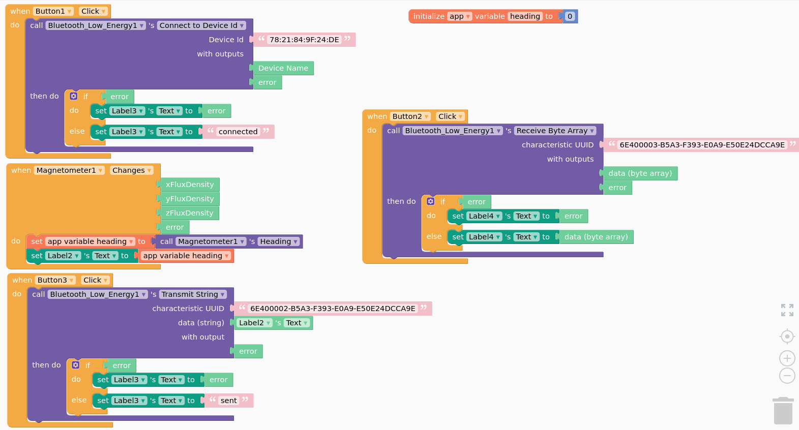

# Interact with a Mobile Phone via BLE

Nowadays, mobile devices, such as our smart phone or watch are plenty of sensors. There are many examples to collect data from such sensors by mobile apps. 

!!! warning

    In this course we are **NOT interested** in mobile applications using **ONLY** the sensors available in you mobile phone. 

Instead, we aim at developing solution where a node, in our case an ESP32, collects some sensor data and interact with the mobile phone (e.g. via BLE) to possibly enrich the observed data by the phone sensors and to deliver them to the backend.  

!!! warning

    Remember, this is a course on IoT, we are not interested in fancy mobile app, and as much work is done by the node (i.e. the ESP32), as better it is. There are plenty of useful resources on developing fancy mobile apps and backends, but we are mostly interested in the node  

For this reason, we will use fast prototyping mobile app tools. 

## [Remotexy](https://remotexy.com/) 

[Remotexy](https://remotexy.com/) it's probably the easiest way 

I nice tutorial by [Andreas Spiess](https://www.youtube.com/watch?v=dyEnOyQS1w8)

## [Thunkable](https://thunkable.com/)

[Thunkable](https://thunkable.com/) is more powerful, but slightly more complex



The arduino code, adapted from https://www.instructables.com/ESP32-BLE-Android-App-Arduino-IDE-AWESOME/ is the following

```
/*
    Video: https://www.youtube.com/watch?v=oCMOYS71NIU
    Based on Neil Kolban example for IDF: https://github.com/nkolban/esp32-snippets/blob/master/cpp_utils/tests/BLE%20Tests/SampleNotify.cpp
    Ported to Arduino ESP32 by Evandro Copercini

   Create a BLE server that, once we receive a connection, will send periodic notifications.
   The service advertises itself as: 6E400001-B5A3-F393-E0A9-E50E24DCCA9E
   Has a characteristic of: 6E400002-B5A3-F393-E0A9-E50E24DCCA9E - used for receiving data with "WRITE" 
   Has a characteristic of: 6E400003-B5A3-F393-E0A9-E50E24DCCA9E - used to send data with  "NOTIFY"

   The design of creating the BLE server is:
   1. Create a BLE Server
   2. Create a BLE Service
   3. Create a BLE Characteristic on the Service
   4. Create a BLE Descriptor on the characteristic
   5. Start the service.
   6. Start advertising.

   In this example rxValue is the data received (only accessible inside that function).
   And txValue is the data to be sent, in this example just a byte incremented every second. 
*/
#include <BLEDevice.h>
#include <BLEServer.h>
#include <BLEUtils.h>
#include <BLE2902.h>

// 78:21:84:9f:24:de

BLECharacteristic *pCharacteristic;
bool deviceConnected = false;
float txValue = 0;
const int readPin = 32; // Use GPIO number. See ESP32 board pinouts
//const int LED = 9; // Could be different depending on the dev board. I used the DOIT ESP32 dev board.

//std::string rxValue; // Could also make this a global var to access it in loop()

// See the following for generating UUIDs:
// https://www.uuidgenerator.net/

#define SERVICE_UUID           "6E400001-B5A3-F393-E0A9-E50E24DCCA9E" // UART service UUID
#define CHARACTERISTIC_UUID_RX "6E400002-B5A3-F393-E0A9-E50E24DCCA9E" // Qui ricevi da EPS32
#define CHARACTERISTIC_UUID_TX "6E400003-B5A3-F393-E0A9-E50E24DCCA9E" // Qui invii

class MyServerCallbacks: public BLEServerCallbacks {
    void onConnect(BLEServer* pServer) {
      deviceConnected = true;
    };

    void onDisconnect(BLEServer* pServer) {
      deviceConnected = false;
    }
};


class MyCallbacks: public BLECharacteristicCallbacks {
    void onWrite(BLECharacteristic *pCharacteristic) {
      std::string rxValue = pCharacteristic->getValue();

      char letto[] = "          ";

      if (rxValue.length() > 0) {
        Serial.println("*********");
        Serial.print("Received Value: ");

        for (int i = 0; i < rxValue.length(); i++) {
          Serial.print(rxValue[i]);
          letto[i]=rxValue[i];
        }

        Serial.println();

        String a = String(letto);

        Serial.print(a.toFloat());

        // Do stuff based on the command received from the app
        if (rxValue.find("A") != -1) { 
          Serial.print("Turning ON!");
          digitalWrite(LED, HIGH);
        }
        else if (rxValue.find("B") != -1) {
          Serial.print("Turning OFF!");
          digitalWrite(LED, LOW);
        }

        Serial.println();
        Serial.println("*********");
      }
    }
};

void setup() {
  Serial.begin(115200);

  pinMode(LED, OUTPUT);

  // Create the BLE Device
  BLEDevice::init("ESP32 UART Test"); // Give it a name

  Serial.print("local BLE Address is: ");
  Serial.println(BLEDevice::getAddress().toString().c_str());

  // Create the BLE Server
  BLEServer *pServer = BLEDevice::createServer();
  pServer->setCallbacks(new MyServerCallbacks());

  // Create the BLE Service
  BLEService *pService = pServer->createService(SERVICE_UUID);


  // BleCharacteristic deviceHealthCharacteristic("deviceHealth", BleCharacteristicProperty::READ, deviceHealthUuid, serviceUuid);
  // see https://community.thunkable.com/t/ble-hrm-reading-bpm/2441754/6


  // Create a BLE Characteristic
  pCharacteristic = pService->createCharacteristic(
                      CHARACTERISTIC_UUID_TX,
                      //BLECharacteristic::PROPERTY_NOTIFY
                      BLECharacteristic::PROPERTY_READ
                    );
                      
  pCharacteristic->addDescriptor(new BLE2902());

  BLECharacteristic *pCharacteristic = pService->createCharacteristic(
                                         CHARACTERISTIC_UUID_RX,
                                         BLECharacteristic::PROPERTY_WRITE
                                       );

  pCharacteristic->setCallbacks(new MyCallbacks());

  // Start the service
  pService->start();

  // Start advertising
  pServer->getAdvertising()->start();
  Serial.println("Waiting a client connection to notify...");
}

void loop() {

  if (deviceConnected) {
    // Fabricate some arbitrary junk for now...
    txValue = analogRead(readPin) / 3.456; // This could be an actual sensor reading!

    // Let's convert the value to a char array:
    char txString[8]; // make sure this is big enuffz
    dtostrf(txValue, 1, 2, txString); // float_val, min_width, digits_after_decimal, char_buffer
    
//    pCharacteristic->setValue(&txValue, 1); // To send the integer value
    pCharacteristic->setValue("Hello!"); // Sending a test message
    //pCharacteristic->setValue(txString);
    
    pCharacteristic->notify(); // Send the value to the app!
    Serial.print("*** Sent Value: ");
    Serial.print(txString);
    Serial.println(" ***");

    // You can add the rxValue checks down here instead
    // if you set "rxValue" as a global var at the top!
    // Note you will have to delete "std::string" declaration
    // of "rxValue" in the callback function.
//    if (rxValue.find("A") != -1) { 
//      Serial.println("Turning ON!");
//      digitalWrite(LED, HIGH);
//    }
//    else if (rxValue.find("B") != -1) {
//      Serial.println("Turning OFF!");
//      digitalWrite(LED, LOW);
//    }
  }

  delay(1000);
}

```

```
// Adapted from https://github.com/SIMS-IOT-Devices/FreeRTOS-ESP-IDF-BLE-Server

#include <stdio.h>
#include "freertos/FreeRTOS.h"
#include "freertos/task.h"
#include "freertos/event_groups.h"
#include "esp_event.h"
#include "nvs_flash.h"
#include "esp_log.h"
#include "esp_nimble_hci.h"
#include "nimble/nimble_port.h"
#include "nimble/nimble_port_freertos.h"
#include "host/ble_hs.h"
#include "services/gap/ble_svc_gap.h"
#include "services/gatt/ble_svc_gatt.h"
#include "sdkconfig.h"

char *TAG = "BLE-Server";
uint8_t ble_addr_type;
void ble_app_advertise(void);

//@_____________________Define UUIDs______________________________________
//!! b2bbc642-46da-11ed-b878-0242ac120002
//static const ble_uuid128_t gatt_svr_svc_uuid =
//    BLE_UUID128_INIT(0x02, 0x00, 0x12, 0xac, 0x42, 0x02, 0x78, 0xb8, 0xed, 0x11, 0xda, 0x46, 0x42, 0xc6, 0xbb, 0xb2);

static const ble_uuid128_t gatt_svr_svc_uuid =
    BLE_UUID128_INIT(0x9e, 0xca, 0xdc, 0x24, 0x0e, 0xe5, 0xa9, 0xe0, 0x93, 0xf3, 0xa3, 0xb5, 0x01, 0x00, 0x40, 0x6e);


//!! c9af9c76-46de-11ed-b878-0242ac120002
//static const ble_uuid128_t gatt_svr_chr_uuid =
//    BLE_UUID128_INIT(0x02, 0x00, 0x12, 0xac, 0x42, 0x02, 0x78, 0xb8, 0xed, 0x11, 0xde, 0x46, 0x76, 0x9c, 0xaf, 0xc9);
    
// 6E400002-B5A3-F393-E0A9-E50E24DCCA9E    

static const ble_uuid128_t gatt_svr_chr_read_uuid =
    BLE_UUID128_INIT(0x9e, 0xca, 0xdc, 0x24, 0x0e, 0xe5, 0xa9, 0xe0, 0x93, 0xf3, 0xa3, 0xb5, 0x02, 0x00, 0x40, 0x6e);
static const ble_uuid128_t gatt_svr_chr_write_uuid =
    BLE_UUID128_INIT(0x9e, 0xca, 0xdc, 0x24, 0x0e, 0xe5, 0xa9, 0xe0, 0x93, 0xf3, 0xa3, 0xb5, 0x03, 0x00, 0x40, 0x6e);


// Write data to ESP32 defined as server
static int device_write(uint16_t conn_handle, uint16_t attr_handle, struct ble_gatt_access_ctxt *ctxt, void *arg)
{
    printf("Data from the client: %.*s\n", ctxt->om->om_len, ctxt->om->om_data);
    return 0;
}

// Read data from ESP32 defined as server
static int device_read(uint16_t con_handle, uint16_t attr_handle, struct ble_gatt_access_ctxt *ctxt, void *arg)
{
    os_mbuf_append(ctxt->om, "Data from the server", strlen("Data from the server"));
    return 0;
}

static const struct ble_gatt_svc_def gatt_svcs[] = {
    {.type = BLE_GATT_SVC_TYPE_PRIMARY,
     .uuid = &gatt_svr_svc_uuid.u,                      // Define UUID for device type
     .characteristics = (struct ble_gatt_chr_def[]){
         {.uuid = &gatt_svr_chr_write_uuid.u,           // Define UUID for reading
          .flags = BLE_GATT_CHR_F_READ,
          .access_cb = device_read},
         {.uuid = &gatt_svr_chr_read_uuid.u,           // Define UUID for writing
          .flags = BLE_GATT_CHR_F_WRITE,
          .access_cb = device_write},
         {0}}},
    {0}};


// BLE event handling
static int ble_gap_event(struct ble_gap_event *event, void *arg)
{
    switch (event->type)
    {
    // Advertise if connected
    case BLE_GAP_EVENT_CONNECT:
        ESP_LOGI("GAP", "BLE GAP EVENT CONNECT %s", event->connect.status == 0 ? "OK!" : "FAILED!");
        if (event->connect.status != 0)
        {
            ble_app_advertise();
        }
        break;
    // Advertise again after completion of the event
    case BLE_GAP_EVENT_ADV_COMPLETE:
        ESP_LOGI("GAP", "BLE GAP EVENT");
        ble_app_advertise();
        break;
    default:
        break;
    }
    return 0;
}

// Define the BLE connection
void ble_app_advertise(void)
{
    // GAP - device name definition
    struct ble_hs_adv_fields fields;
    const char *device_name;
    memset(&fields, 0, sizeof(fields));
    device_name = ble_svc_gap_device_name(); // Read the BLE device name
    fields.name = (uint8_t *)device_name;
    fields.name_len = strlen(device_name);
    fields.name_is_complete = 1;
    ble_gap_adv_set_fields(&fields);

    // GAP - device connectivity definition
    struct ble_gap_adv_params adv_params;
    memset(&adv_params, 0, sizeof(adv_params));
    adv_params.conn_mode = BLE_GAP_CONN_MODE_UND; // connectable or non-connectable
    adv_params.disc_mode = BLE_GAP_DISC_MODE_GEN; // discoverable or non-discoverable
    ble_gap_adv_start(ble_addr_type, NULL, BLE_HS_FOREVER, &adv_params, ble_gap_event, NULL);
}

// The application
void ble_app_on_sync(void)
{
    ble_hs_id_infer_auto(0, &ble_addr_type); // Determines the best address type automatically
    ble_app_advertise();                     // Define the BLE connection
}

// The infinite task
void host_task(void *param)
{
    nimble_port_run(); // This function will return only when nimble_port_stop() is executed
}

void app_main()
{
    nvs_flash_init();                          // 1 - Initialize NVS flash using
    //esp_nimble_hci_and_controller_init();      // 2 - Initialize ESP controller
    nimble_port_init();                        // 3 - Initialize the host stack
    ble_svc_gap_device_name_set("BLE-Server"); // 4 - Initialize NimBLE configuration - server name
    ble_svc_gap_init();                        // 4 - Initialize NimBLE configuration - gap service
    ble_svc_gatt_init();                       // 4 - Initialize NimBLE configuration - gatt service
    ble_gatts_count_cfg(gatt_svcs);            // 4 - Initialize NimBLE configuration - config gatt services
    ble_gatts_add_svcs(gatt_svcs);             // 4 - Initialize NimBLE configuration - queues gatt services.
    ble_hs_cfg.sync_cb = ble_app_on_sync;      // 5 - Initialize application
    nimble_port_freertos_init(host_task);      // 6 - Run the thread
}
```

## Monitoring Coronavirus

A remarkable use of crowdsensing has been the use of mobile phones for contact tracing, during the COVID-19. Indeed smartphone apps, given accessibility in the time of physical distancing, were widely used for tracking, tracing and educating the public about COVID-19 as reported in [Smartphone apps in the COVID-19 pandemic](https://www.nature.com/articles/s41587-022-01350-x). 

!!! Note 

    Despite this use case is not consistent with the requirement of integrating external sensors with the mobile phone, we will consider it for its obvious relevance. 

Many efforts have been put in place to preserve tha anonymity in tracing, however the research community raised a number of issues, as discussed in [Anonymous tracing, a dangerous oxymoron](https://risques-tracage.fr/docs/tracing-risks.pdf) 

