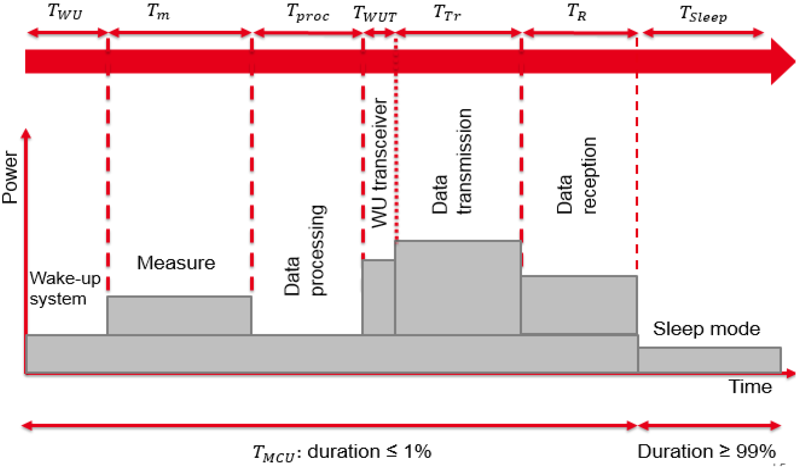
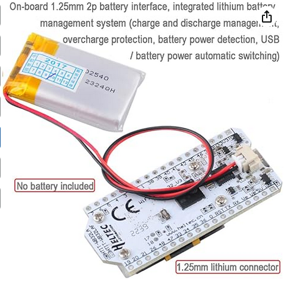
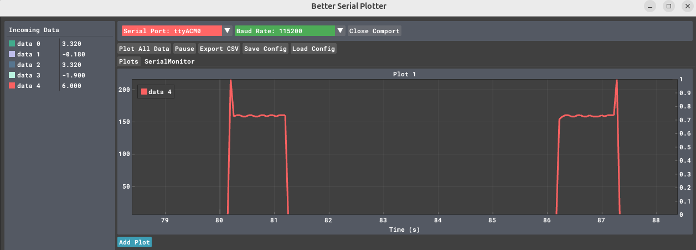

# Energy

The following picture from [https://doi.org/10.3390/s18072104 ](https://doi.org/10.3390/s18072104) depicts a typical sensor working scenario, where a node alternates different activities each with a different power consumption



## ESP32 Sleep Modes

[ESP32 supports two major power saving modes](https://docs.espressif.com/projects/esp-idf/en/stable/esp32/api-reference/system/sleep_modes.html): Light-sleep and Deep-sleep. There are several wakeup sources in the sleep modes. The following are excellent sources of information to understand how to ESP32 Sleep Modes and Their Power Consumption. 

* [Insight Into ESP32 Sleep Modes and Their Power Consumption](https://lastminuteengineers.com/esp32-sleep-modes-power-consumption/)
* [ESP32 Deep Sleep Mode](https://www.electronicwings.com/esp32/esp32-deep-sleep-mode)
* [ESP32 Deep Sleep with Arduino IDE and Wake Up Sources](https://randomnerdtutorials.com/esp32-deep-sleep-arduino-ide-wake-up-sources/)

## Deep Sleep wakeup example

1. **Deep Sleep:** The chip is off. Only the RTC controller watches the GPIO (button).
2. **Wake Up:** The button is pressed. The ESP32 boots.
3. **Setup:** We check _why_ we woke up. If it was the button, we start our tasks.
4. **Task 1:** Handles user interaction or logic.
5. **Task 2:** Performs the "Monitoring Activity" (e.g., reading a sensor).
6. **Back to Sleep:** Once the tasks finish their job, they call for deep sleep again.


```c++
#include <Arduino.h>

#define BUTTON_PIN GPIO_NUM_27 

// This variable survives deep sleep
RTC_DATA_ATTR bool should_monitor = false;

// Task 2: The Monitor
void taskMonitor(void *pvParameters) {
  if (should_monitor) {
    Serial.println("[Task 2] Monitoring activity started...");
    // Simulate sensor reading or WiFi upload
    delay(2000); 
    Serial.println("[Task 2] Monitoring complete.");
  }
  
  Serial.println("Mission accomplished. Going back to deep sleep in 1 second.");
  delay(1000);
  
  // Prepare for next sleep
  esp_sleep_enable_ext0_wakeup(BUTTON_PIN, 0); // Wake when button is LOW (pressed)
  esp_deep_sleep_start();
}

// Task 1: The Coordinator
void taskCoordinator(void *pvParameters) {
  Serial.println("[Task 1] Checking wake-up reason...");
  
  esp_sleep_wakeup_cause_t wakeup_reason = esp_sleep_get_wakeup_cause();

  if (wakeup_reason == ESP_SLEEP_WAKEUP_EXT0) {
    Serial.println("[Task 1] Woke up by Button! Signaling Task 2.");
    should_monitor = true;
  } else {
    Serial.println("[Task 1] Normal boot or other wake source.");
    should_monitor = false;
  }

  // Task 1 can now delete itself or wait
  vTaskDelete(NULL);
}

void setup() {
  Serial.begin(115200);
  pinMode(BUTTON_PIN, INPUT_PULLUP);

  // Create Task 1: Check why we woke up
  xTaskCreate(taskCoordinator, "Coordinator", 2048, NULL, 2, NULL);

  // Create Task 2: Perform monitoring if needed
  xTaskCreate(taskMonitor, "Monitor", 2048, NULL, 1, NULL);
}

void loop() {
  // Empty. Everything happens in tasks and then deep sleep.
}
```

### Ensuring Task Completion

If you put the sleep command in `setup()`, the ESP32 might go to sleep before the FreeRTOS scheduler even has a chance to start your tasks.

- **The Problem:** `setup()` runs, creates tasks, and then hits the "sleep" command immediately. The tasks never actually execute because the CPU powers down.
    
- **The Solution:** By putting the sleep command at the end of the **Monitoring Task**, we ensure that the "work" is actually finished before the lights go out.

### Key Components Explained

|**Feature**|**Function**|
|---|---|
|**`RTC_DATA_ATTR`**|Stores variables in the RTC slow memory. This is the only way Task 2 knows what Task 1 found out after a sleep cycle.|
|**`esp_sleep_enable_ext0_wakeup`**|Configures a specific GPIO to trigger the "wake up" signal while the rest of the chip is powered down.|
|**`esp_deep_sleep_start()`**|The "Off" switch. Execution stops here and the power draw drops to ~10µA.|
### Important Real-World Note

In a true FreeRTOS environment, if you want "Task 1" to trigger "Task 2" **while the chip is already awake**, you would use a **Semaphore** or **Event Group**. However, because Deep Sleep triggers a full reboot, the "trigger" here is actually the CPU reset and the shared RTC memory.

## Powering the ESP32

To power the ESP32 you can use [several methods](https://esp32io.com/tutorials/how-to-power-esp32) 

The ESP32 works at 3.3V. You can apply 5V to the Vin and an internal voltage regulator drops it down to 3.3V, but this costs energy because it is because a linear regulator that converts the excess voltage into heat.  

> [!TIP]
> if you don't need 5V in you project, use 3.3V, it will save energy. However, finding suitable batteries is not easy!
> if the battery does not exceed 3.6V as in the LiFePO4, you can connect the battery to the 3.3V and bypass the voltage regulator


<!--
!!! tip

    if you don't need 5V in you project, use 3.3V, it will save energy. However, finding suitable batteries is not easy!

    if the battery does not exceed 3.6V as in the LiFePO4, you can connect the battery to the 3.3V and bypass the voltage regulator
-->



## How to measure energy consumption

In the following example, the LOAD is our ESP32 and we use the [INA219](https://learn.adafruit.com/adafruit-ina219-current-sensor-breakout/wiring) connected to an Arduino UNO to measure the power consumption. The same can be obtained using another ESP32 instead of the UNO, but remember the correct pins for SDA (default is GPIO 21) SCL (default is GPIO 22) ([See the schematics](assets/images/esp32_dev_kit_pinout_v1_mischianti.jpg))

* Connect board VIN (red wire) to Arduino 5V if you are running a 5V board Arduino (Mega, etc.). If your board is 3V, connect to that instead.
* Connect board GND (black wire) to Arduino GND
* Connect board SCL (white wire) to Arduino SCL
* Connect board SDA (blue wire) to Arduino SDA
* Connect Vin+ to the positive terminal of the power supply for the circuit under test
* Connect Vin- to the positive terminal or lead of the load

[Note on Heltec V3](https://github.com/ShotokuTech/HeltecLoRa32v3_I2C/tree/main)


[source](https://learn.adafruit.com/adafruit-ina219-current-sensor-breakout/wiring "https://learn.adafruit.com/adafruit-ina219-current-sensor-breakout/wiring")

```c

// use https://github.com/nathandunk/BetterSerialPlotter to visualize the data

#include <Arduino.h>
#include <Wire.h>
#include <Adafruit_INA219.h>

Adafruit_INA219 ina219;

void setup(void) 
{
  Serial.begin(115200);
  while (!Serial) {
      // will pause Zero, Leonardo, etc until serial console opens
      delay(1);
  }

  uint32_t currentFrequency;
  Serial.println("Hello!");
  
  // Initialize the INA219.
  // By default the initialization will use the largest range (32V, 2A).  However
  // you can call a setCalibration function to change this range (see comments).
  if (! ina219.begin()) {
    Serial.println("Failed to find INA219 chip");
    while (1) { delay(10); }
  }
  // To use a slightly lower 32V, 1A range (higher precision on amps):
  //ina219.setCalibration_32V_1A();
  // Or to use a lower 16V, 400mA range (higher precision on volts and amps):
  //ina219.setCalibration_16V_400mA();
  Serial.println("Measuring voltage and current with INA219 ...");
}

void loop(void) 
{
  float shuntvoltage = 0;
  float busvoltage = 0;
  float current_mA = 0;
  float loadvoltage = 0;
  float power_mW = 0;

  shuntvoltage = ina219.getShuntVoltage_mV();
  busvoltage = ina219.getBusVoltage_V();
  current_mA = ina219.getCurrent_mA();
  power_mW = ina219.getPower_mW();
  loadvoltage = busvoltage + (shuntvoltage / 1000);

  Serial.print(busvoltage);
  //Serial.print(",");
  Serial.print("\t");
  Serial.print(shuntvoltage);
  //Serial.print(",");
  Serial.print("\t");
  Serial.print(loadvoltage);
  //Serial.print(",");
  Serial.print("\t");
  Serial.print(current_mA);
  //Serial.print(",");
  Serial.print("\t");
  Serial.println(power_mW);
  //Serial.println("");
  /*

  delay(50);
}


```

```c

/*
  ESP32 Deep Sleep Mode Timer Wake UP
 http:://www.electronicwings.com
*/ 


#define Time_To_Sleep 5   //Time ESP32 will go to sleep (in seconds)
#define S_To_uS_Factor 1000000ULL      //Conversion factor for micro seconds to seconds 

RTC_DATA_ATTR int bootCount= 0;

void setup() {
  Serial.begin(115200);
  delay(1000); //Take some time to open up the Serial Monitor

  //Increment boot number and print it every reboot
  ++bootCount;
  Serial.println("Boot number: " + String(bootCount));

  //Set timer to 5 seconds
 esp_sleep_enable_timer_wakeup(Time_To_Sleep * S_To_uS_Factor);
  Serial.println("Setup ESP32 to sleep for every " + String(Time_To_Sleep) +
  " Seconds");

  //Go to sleep now
  esp_deep_sleep_start();
 
  Serial.println("This will not print!!"); // This will not get print,as ESP32 goes in Sleep mode.
}

void loop() {} // We don't need loop as ESP32 will initilize each time.

```

We use [Better Serial Plotter](https://github.com/nathandunk/BetterSerialPlotter) to visualize the data.



[source code](https://github.com/andreavitaletti/PlatformIO/tree/main/Projects/power_simple)

A powerful alternative is [Serial-Studio](https://github.com/Serial-Studio/Serial-Studio?tab=readme-ov-file)

> [!EXERCISE]
>Write a simple code  that  mimics the diagram at the beginning of this section of a typical sensor working scenario and measure the consumption of each activity
## Energy Harvesting

[Power ESP32/ESP8266 with Solar Panels](https://randomnerdtutorials.com/power-esp32-esp8266-solar-panels-battery-level-monitoring/)

