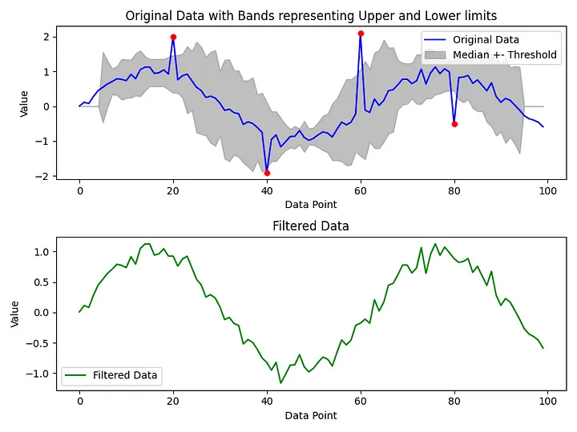
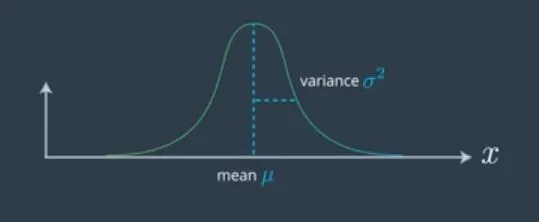
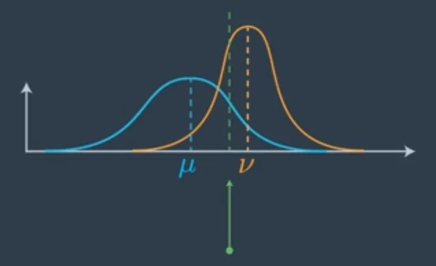
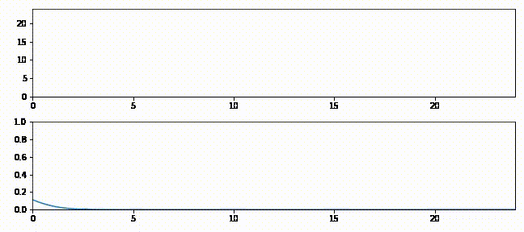

# Filters

## Hampel Filters

## Moving Average

## Kalman Filters

A very nice, rich an exhaustive source of documentation for Kalman filters is available [here](https://github.com/rlabbe/Kalman-and-Bayesian-Filters-in-Python)

The main idea is that both our prior knowledge and the measurements of our sensors are to some extent inaccurate. To model such inaccuracy we use a Gaussian with mean $\mu$ and variance $\rho$

At each iteration we have our prior knowledge (in blue) and a new measurement (in orange) and we account for both source of information computing an average (in green)

> The final mean gets shifted which is in between the two old means, the mean of the prior, and the mean of the measurement. It’s slightly further on the measurement side because the measurement was more certain as to where the vehicle is than prior. The more certain we are, the more we pull the mean on the direction of the certain answer. [source](https://medium.com/analytics-vidhya/kalman-filters-a-step-by-step-implementation-guide-in-python-91e7e123b968)

Iteration after iteration the variance decreases (the spread of the blue gaussian), providing a better estimation (in green) despite the noisy measurements (in red) [source](https://github.com/rlabbe/Kalman-and-Bayesian-Filters-in-Python)

A reference library is available [here](https://github.com/denyssene/SimpleKalmanFilter)

