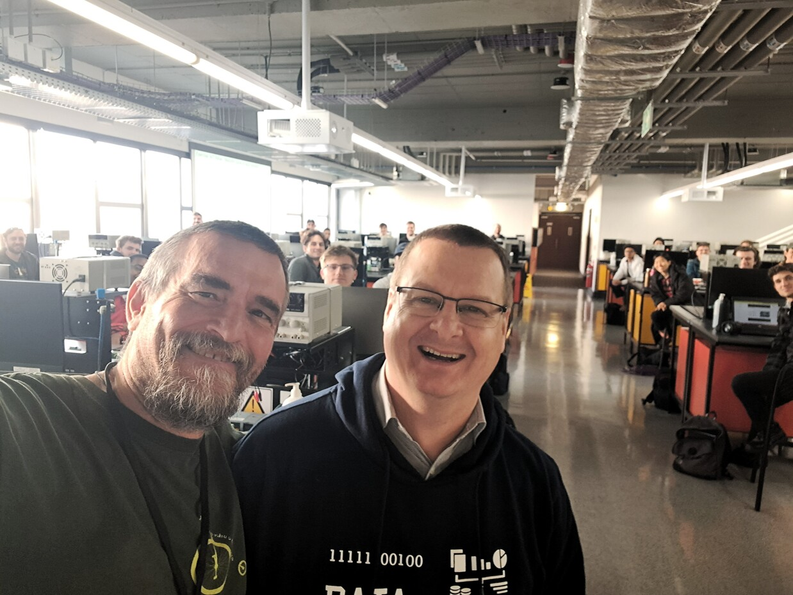

# GOAL
This short course on the Internet of Things is designed to give a first understanding of the main issues in developing IoT solutions. We do believe the most efficient way to learn this subject is experimenting, this is way the course encourage attendants to hands-on. No specific background is needed, even if a basic knowledge of electronics and computer science might help. 

# SESSION 1 (3 hours)

**GOAL:** Quick intro to the Internet of Things.

* Introduction to the IoT
* IoT and Big Data: we can quantitatively measure phenomena that up to yesterday we were only able to guess
* A network of Resource Constrained Devices: if computational power, memory, energy, bandwidth and costs are not constrained, it is likely Internet, not Internet of Things.

# SESSION 2 (3 hours)

**GOAL:** Small experiment (a single sensor). Prove you can integrate sensors suitable for you monitoring purpose.  Focus on effectiveness, namely doing the right things, i.e., the Maker approach.

* The reference hardware: [ESP32](http://esp32.net/)
* Hands on with the [Arduino Ide](https://support.arduino.cc/hc/en-us/articles/360019833020-Download-and-install-Arduino-IDE) and [Wokwi](https://wokwi.com/)
* A simple integration of sensor/actuator
* Communicating over WiFi

# SESSION 3 (3 hours)

**GOAL:** Small experiment (a single sensor). Focus on efficiency, namely doing the things right, i.e., the Engineers approach. Use metrics to measure to what extent your solution satisfies the user requirements.

* The need of an Operating System 
* Hands on [FREERTOS](https://www.freertos.org/)
* A simple integration of sensor/actuator
* Communicating over WiFi

# SESSION 4 (3 hours)

**GOAL:** Scale-up in a realistic environment.

* The Very Large Scale IoT Testbed [IoT-LAB](https://www.iot-lab.info/) 
* [FreeRTOS on IoT-lab](https://iot-lab.github.io/docs/os/freertos/)
* A simple Project

# Tools and Materials
 
I like [vscode](https://code.visualstudio.com/) with the [Remote-SSH extension](https://code.visualstudio.com/docs/remote/ssh) to interact with the virtual machine for FreeRTOS development. However, during the class there might be many issues due to different version of the OS and vscode. To further simplify the process I use [micro](https://micro-editor.github.io/index.html) a modern and intuitive terminal-based text editor. Give it a try, it is very convenient. I also suggest to install the [file manager plugin](https://github.com/NicolaiSoeborg/filemanager-plugin). The only annoying issue I'm currently facing with micro is that [copy/past does not work smoothly over SSH](https://github.com/zyedidia/micro/issues/958), you have to use ctr + shift + V

## Material

The list of material for each group 

* ESP32-DevKit [e.g. Available on Amazon](https://www.amazon.com/Teyleten-Robot-ESP-WROOM-32-Development-Microcontroller/dp/B08246MCL5/ref=sr_1_4?crid=ZQMHS3WU9BW9&keywords=ESP32-WROOM-32&qid=1686069281&sprefix=esp32-wroom-32%2Caps%2C234&sr=8-4)

* A breadboard [e.g. Available on Amazon](https://www.amazon.com/DEYUE-breadboard-Set-Prototype-Board/dp/B07LFD4LT6/ref=sr_1_8?crid=3R3TUY5L81TO1&keywords=breadboard&qid=1687250395&sprefix=breadboard%2Caps%2C249&sr=8-8)

* Wires [e.g. Available on Amazon](https://www.amazon.com/Elegoo-EL-CP-004-Multicolored-Breadboard-arduino/dp/B01EV70C78/ref=sr_1_3?crid=26K1OWIBE8P3T&keywords=arduino+cables&qid=1687250586&sprefix=arduino+cables%2Caps%2C172&sr=8-3)

* Minimal actuator, namely a led and resistors - resistor 330 Ohm [e.g. Available on Amazon](https://www.amazon.com/Resistor-Resistors-Assortment-Emitting-Projects/dp/B09XYRMF3V/ref=sr_1_2_sspa?crid=37V2OL06S6174&keywords=led+resistor&qid=1687250996&sprefix=led+resistor%2Caps%2C290&sr=8-2-spons&sp_csd=d2lkZ2V0TmFtZT1zcF9hdGY&psc=1)

* Minimal analog sensor, namely a potentiometer 10 KOhm [e.g. Available on Amazon](https://www.amazon.com/DGZZI-Potentiometer-Breadboard-Raspberry-3386MP-103/dp/B07ZYVS2W6/ref=sr_1_18?crid=3IYJPTJB18AST&keywords=arduino+potentiometer&qid=1687251254&sprefix=arduino+potentiometer%2Caps%2C181&sr=8-18)

* Minimal digital sensor, namely a button - resistor 1 KOhm [e.g. Available on Amazon](https://www.amazon.com/Gikfun-6x6x5mm-Switch-Button-Arduino/dp/B00R17XUFC/ref=sr_1_3?crid=363OIHN617YNQ&keywords=arduino+button&qid=1687251202&sprefix=arduino+button%2Caps%2C281&sr=8-3)

* A more interesting digital vibration sensor SW-420 [e.g. Available on Amazon](https://www.amazon.com/Hiletgo-SW-420-Vibration-Sensor-Arduino/dp/B00HJ6ACY2/ref=d_pd_day0_vft_none_sccl_3_6/144-2036444-0077312?pd_rd_w=6ZLDs&content-id=amzn1.sym.8ca997d7-1ea0-4c8f-9e14-a6d756b83e30&pf_rd_p=8ca997d7-1ea0-4c8f-9e14-a6d756b83e30&pf_rd_r=R67DPZBKK0Q1NSDSXPTR&pd_rd_wg=B8p9z&pd_rd_r=d4e20fea-fef2-4392-9e94-cb60781d285e&pd_rd_i=B00HJ6ACY2&psc=1)
   
## Useful links

* [Code and Slides](https://github.com/andreavitaletti/IoT_short_course)
* [The Espressif software development environment](https://docs.espressif.com/projects/esp-idf/en/latest/esp32/get-started/#)
* [Arduino Ide](https://support.arduino.cc/hc/en-us/articles/360019833020-Download-and-install-Arduino-IDE)
* [Wokwi](https://wokwi.com/)
* [FREERTOS](https://www.freertos.org/)
* [IoT-LAB](https://www.iot-lab.info/) 
* [Thingsboard](https://thingsboard.io/)
* [A short paper on this course](assets/ashotcouresoniot.pdf)

# Editions

First edition of the course 19th (Session 1 and 2) and 21st (Session 3 and 4) of July 2023 in the University of Stellenbosch (South Africa) during an [Erasmus+](https://erasmus-plus.ec.europa.eu/resources-and-tools/mobility-and-learning-agreements/mobility-agreements) staff mobility for teaching visit. About 40 participants selected among more the 100 candidates. Keep in touch on the [discord server](https://discord.gg/TZhMmbgq). A new version soon.

