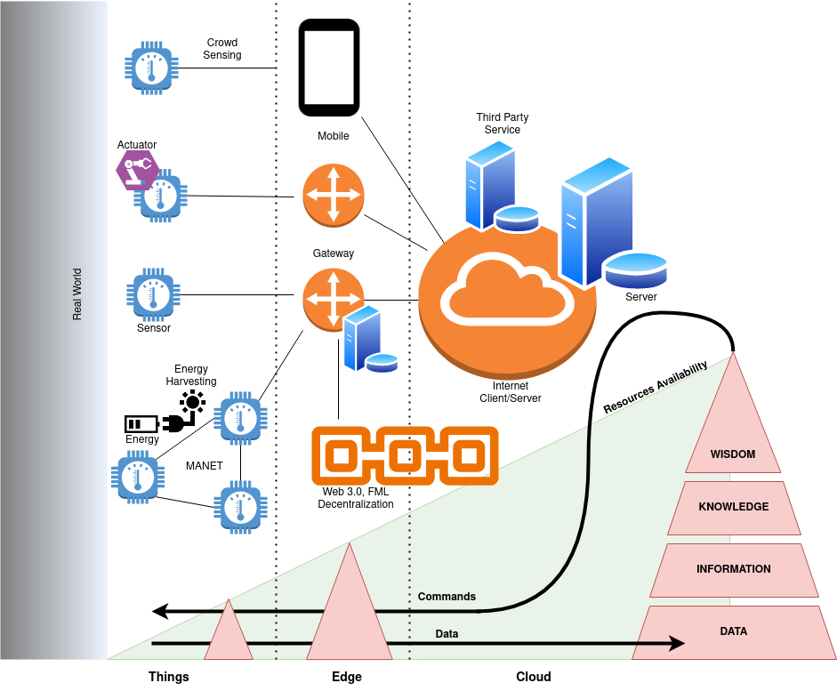

# A Reference Architecture

## Takeaway ONE

* IoT is fuel for Big Data Analytics
* > "When you can measure ... you know something". Lord Kelvin docet.
* IoT provide quantitative evidences on  phenomena that we used to investigate only qualitatively

<iframe src="https://docs.google.com/presentation/d/e/2PACX-1vR_rNDTgvAlQCMQ6fswBob4RKcnQQLulLTtUqhd5dUoxG0fGspWISYLF81SBeT3nDakgD1bA_O0cmEq/embed?start=false&loop=false&delayms=3000" frameborder="0" width="1058" height="624" allowfullscreen="true" mozallowfullscreen="true" webkitallowfullscreen="true"></iframe>

## Takeaway TWO

* IoT is a network of resource constrained devices
* Constraints require design choices
* Beyond the maker approach, namely when effectiveness meets efficiency

<iframe src="https://docs.google.com/presentation/d/e/2PACX-1vQX7_Dw2MVh3U_9_dEZrRo1Qytq7chYrYat4SgwKHPJu3xcs0korl9895zeg0kfLoyCyGznLyqESn5C/embed?start=false&loop=false&delayms=3000" frameborder="0" width="1058" height="624" allowfullscreen="true" mozallowfullscreen="true" webkitallowfullscreen="true"></iframe>