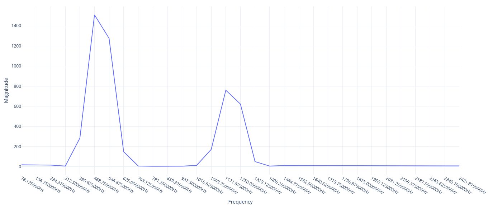
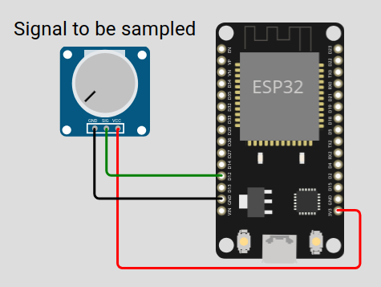
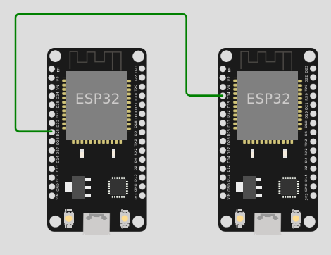
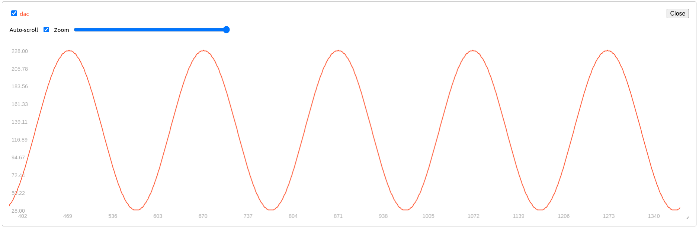

# Sample the environment

Usually IoT applications need to observe a physical phenomenon. This is done by sampling.

## Fast Fourier Transform (FFT)


[Colab Notebook on FFT](https://colab.research.google.com/drive/1nuZx095lzt2d9h42N7yNu13crGg9eS9A
)

[arduinoFFT library](https://github.com/kosme/arduinoFFT)

In the following [example](https://github.com/kosme/arduinoFFT/blob/master/Examples/FFT_01/FFT_01.ino) the signal is generated internally by the node.

[on wokwi](https://wokwi.com/projects/424775322523875329)

```c
#include <arduinoFFT.h>

/*
These values can be changed in order to evaluate the functions
*/
const uint16_t samples = 64; //This value MUST ALWAYS be a power of 2

const double samplingFrequency = 5000;


const double signalFrequency1 = 500;  // Prima frequenza (Hz)
const double signalFrequency2 = 1200; // Seconda frequenza (Hz)
const uint8_t amplitude1 = 100;       // Ampiezza della prima sinusoide
const uint8_t amplitude2 = 50;        // Ampiezza della seconda sinusoide

/*
These are the input and output vectors
Input vectors receive computed results from FFT
*/
double vReal[samples];
double vImag[samples];

/* Create FFT object */
ArduinoFFT<double> FFT = ArduinoFFT<double>(vReal, vImag, samples, samplingFrequency);

#define SCL_INDEX 0x00
#define SCL_TIME 0x01
#define SCL_FREQUENCY 0x02
#define SCL_PLOT 0x03

void setup()
{
  Serial.begin(115200);
  while(!Serial);
  Serial.println("Ready");
}

void loop()
{
  /* Build raw data */

 double ratio1 = twoPi * signalFrequency1 / samplingFrequency;
 double ratio2 = twoPi * signalFrequency2 / samplingFrequency;


  for (uint16_t i = 0; i < samples; i++)
  {
    vReal[i] = double(amplitude1 * sin(i * ratio1) + amplitude2 * sin(i * ratio2));/* Build data with positive and negative values*/
    vImag[i] = 0.0; //Imaginary part must be zeroed in case of looping to avoid wrong calculations and overflows
  }
  /* Print the results of the simulated sampling according to time */
  Serial.println("Data:");
  PrintVector(vReal, samples, SCL_TIME);
  FFT.windowing(FFTWindow::Hamming, FFTDirection::Forward);	/* Weigh data */
  Serial.println("Weighed data:");
  PrintVector(vReal, samples, SCL_TIME);
  FFT.compute(FFTDirection::Forward); /* Compute FFT */
  Serial.println("Computed Real values:");
  PrintVector(vReal, samples, SCL_INDEX);
  Serial.println("Computed Imaginary values:");
  PrintVector(vImag, samples, SCL_INDEX);
  FFT.complexToMagnitude(); /* Compute magnitudes */
  Serial.println("Computed magnitudes:");
  PrintVector(vReal, (samples >> 1), SCL_FREQUENCY);
  double x = FFT.majorPeak();
  Serial.println(x, 6);
  while(1); /* Run Once */
  // delay(2000); /* Repeat after delay */
}

void PrintVector(double *vData, uint16_t bufferSize, uint8_t scaleType)
{
  for (uint16_t i = 0; i < bufferSize; i++)
  {
    double abscissa;
    /* Print abscissa value */
    switch (scaleType)
    {
      case SCL_INDEX:
        abscissa = (i * 1.0);
	break;
      case SCL_TIME:
        abscissa = ((i * 1.0) / samplingFrequency);
	break;
      case SCL_FREQUENCY:
        abscissa = ((i * 1.0 * samplingFrequency) / samples);
	break;
    }
    Serial.print(abscissa, 6);
    if(scaleType==SCL_FREQUENCY)
      Serial.print("Hz");
    Serial.print(" ");
    Serial.println(vData[i], 4);
  }
  Serial.println();
}

```

Note that FFT.majorPeak() ``Returns an estimation of the dominant frequency according to the interpolation of the biggest peak found on the magnitude array.`` which is  503.166771 while the max frequency of the a peak is arodun 1200 as expected. Indeed the Computed magnitudes are:

```
0.000000Hz 19.3725
78.125000Hz 19.4808
156.250000Hz 19.4963
234.375000Hz 17.5681
312.500000Hz 7.6937
390.625000Hz 285.2706
468.750000Hz 1508.3488
546.875000Hz 1275.2104
625.000000Hz 149.1638
703.125000Hz 8.7482
781.250000Hz 5.8810
859.375000Hz 6.5036
937.500000Hz 6.7344
1015.625000Hz 14.6614
1093.750000Hz 173.3189
1171.875000Hz 760.4988
1250.000000Hz 623.6484
1328.125000Hz 52.2926
1406.250000Hz 7.5248
1484.375000Hz 12.7204
1562.500000Hz 13.0229
1640.625000Hz 12.5002
1718.750000Hz 11.8706
1796.875000Hz 11.2927
1875.000000Hz 10.7984
1953.125000Hz 10.3874
2031.250000Hz 10.0515
2109.375000Hz 9.7820
2187.500000Hz 9.5711
2265.625000Hz 9.4129
2343.750000Hz 9.3029
2421.875000Hz 9.2381
```


More realistically the signal is observed by the ADC, as in the following [example](https://github.com/kosme/arduinoFFT/blob/master/Examples/FFT_03/FFT_03.ino)



[on wokwi](https://wokwi.com/projects/425024705467787265)

```c

#include "arduinoFFT.h"

/*
These values can be changed in order to evaluate the functions
*/
#define CHANNEL 12
const uint16_t samples = 64; //This value MUST ALWAYS be a power of 2
const double samplingFrequency = 100; //Hz, must be less than 10000 due to ADC
unsigned int sampling_period_us;
unsigned long microseconds;

/*
These are the input and output vectors
Input vectors receive computed results from FFT
*/
double vReal[samples];
double vImag[samples];

/* Create FFT object */
ArduinoFFT<double> FFT = ArduinoFFT<double>(vReal, vImag, samples, samplingFrequency);

void setup()
{
  sampling_period_us = round(1000000*(1.0/samplingFrequency));
  Serial.begin(115200);
  while(!Serial);
  Serial.println("Ready");
}

void loop()
{
  /*SAMPLING*/
  microseconds = micros();
  for(int i=0; i<samples; i++)
  {
      vReal[i] = analogRead(CHANNEL);
      vImag[i] = 0;
      while(micros() - microseconds < sampling_period_us){
        //empty loop
      }
      microseconds += sampling_period_us;
  }
  // ... 
  double x = FFT.majorPeak();
  Serial.println(x, 6); //Print out what frequency is the most dominant.
  while(1); /* Run Once */
  // delay(2000); /* Repeat after delay */
}
```

## A virtual signal

A virtual signal is a practical approach to generate arbitrary signals using one EPS32 as the signal generator, and the other as the sampler. 

The two ESP32 are connected as in the following picture



The node on the left works as a **virtual signal**, it generates a signal using the [DAC](https://www.electronicwings.com/esp32/dac-digital-to-analog-converter-esp32) on PIN 25. 
The node on the right sample the generated signal by the [ADC](https://www.electronicwings.com/esp32/adc-of-esp32) and print the [FFT](). 

### The Signal Generator

```c

#include <Arduino.h>

// Define the DAC and ADC pins
const int dacPin = 25;   // DAC1 (GPIO 25) for sinusoid output

// Parameters for the sine wave
const int amplitude = 100;   // Amplitude of the sine wave (max 255 for 8-bit DAC)
const int offset = 128;      // DC offset (middle of the DAC range)
const float signalFrequency = 5.0;  // Frequency of the sine wave in Hz
int samplingFrequencyDAC = 1000; // sampling theorem should be at least 2*frequency

void setup() {
  Serial.begin(115200);

  // Initialize DAC pin (GPIO 25)
  dacWrite(dacPin, 0);  // Initialize DAC with a low value

}

void loop() {
      for (int i = 0; i < samplingFrequencyDAC; i++) {
      int sineValue = (int)(amplitude * sin(2.0 * PI * signalFrequency * i / samplingFrequencyDAC) + offset);
      dacWrite(dacPin, sineValue);  // Write to DAC (8-bit value)
      Serial.print(">");
      Serial.print("dac:");    
      Serial.println(sineValue);
      delay(round(1.0/samplingFrequencyDAC*1000));
      } 
    
}

```



### The Sampler

```c

#include <Arduino.h>

const int adcPin = 34;   // ADC1 (GPIO 34) for reading the sinusoid
int samplingFrequencyADC = 500; // sampling theorem should be at least 2*frequency
const uint16_t samples = 512; 

void setup() {
  Serial.begin(115200);
  analogReadResolution(10); 
  analogSetAttenuation(ADC_11db);  // Set ADC attenuation (default 0dB)
}

void loop() {

  for(int i=0; i<samples; i++)
   {
      Serial.print(">");
      Serial.print("adc:");    
      Serial.println(analogRead(adcPin)-512);
      delay(round(1.0/samplingFrequencyADC*1000));
  }
}

```


[source code](https://github.com/andreavitaletti/documents/tree/main/PlatformIO/Projects/virtual%20sensor)

## A possible alternative using the PC


[ref](https://forum.arduino.cc/t/how-to-read-data-from-audio-jack/458301/3)

``` python3 -m pip install sounddevice ```

```python

# Use the sounddevice module
# http://python-sounddevice.readthedocs.io/en/0.3.10/

import numpy as np
import sounddevice as sd
import time

# Samples per second
sps = 44100

# Frequency / pitch
freq_hz = 2

# Duration
duration_s = 5.0

# Attenuation so the sound is reasonable
atten = 1.0 # 0.3

# NumpPy magic to calculate the waveform
each_sample_number = np.arange(duration_s * sps)
waveform = np.sin(2 * np.pi * each_sample_number * freq_hz / sps)
waveform_quiet = waveform * atten

# Play the waveform out the speakers
sd.play(waveform_quiet, sps)
time.sleep(duration_s)
sd.stop()

```

[Online Tone Generator](https://onlinetonegenerator.com/)


### Wiring Diagram

| **ESP32 A (Sender)** | **Connection Type**   | **ESP32 B (Receiver)** | **Purpose**      |     |
| -------------------- | --------------------- | ---------------------- | ---------------- | --- |
| **GPIO25** (DAC1)    | $\rightarrow$         | **GPIO34** (ADC1)      | Signal Path      |     |
| **GND**              | $\longleftrightarrow$ | **GND**                | Common Reference |     |
| **USB Power**        |                       | **USB Power**          | Power Supply     |     |
### ESP32 A: The Generator (Sender)

This code uses a pre-calculated lookup table (LUT) to store sine values. This is much more efficient than calculating `sin()` on the fly, allowing for a smoother signal.

```C++
// ESP32 SENDER CODE
#include <Arduino.h>

#define DAC_PIN 25 // Uses DAC Channel 1
const int tableSize = 256;
uint8_t sineTable[tableSize];

void setup() {
  // Generate a sine lookup table (0 to 255)
  // We scale it slightly (20-230) to stay in the DAC's linear range
  for (int i = 0; i < tableSize; i++) {
    sineTable[i] = (uint8_t)(127 + 100 * sin(2 * PI * i / tableSize));
  }
}

void loop() {
  for (int i = 0; i < tableSize; i++) {
    dacWrite(DAC_PIN, sineTable[i]);
    delayMicroseconds(100); // Adjust this to change frequency
  }
}
```

### ESP32 B: The Receiver (Sampler)

This code reads the signal and prints it to the Serial Plotter. Note the use of `analogReadAttenuation`, which sets the voltage range to approximately 0V–3.1V to better match the DAC output.

```c++
// ESP32 RECEIVER CODE
#include <Arduino.h>

#define ADC_PIN 34 // ADC1_CH6

void setup() {
  Serial.begin(115200);
  // Set attenuation to 11dB (allows 0V - 3.1V range)
  analogSetAttenuation(ADC_11db); 
}

void loop() {
  int rawValue = analogRead(ADC_PIN);
  
  // Print to Serial Plotter
  // We include a "Floor" and "Ceiling" to keep the graph stable
  Serial.print("Min:0,Max:4095,Signal:");
  Serial.println(rawValue);
  
  delayMicroseconds(500); // Sample rate control
}
```

### A Quick Tip on Performance

The ESP32's `analogRead()` takes about **10µs to 20µs**. If you find the wave looks "steppy" or jagged, it’s usually due to electrical noise or the sampling interval. If you want to go faster (into the kHz range), the `dacWrite` method used here will eventually hit a bottleneck.

### Simple Analysis 

### 1. The Generator Frequency (ESP32 A)

In the code I provided, the frequency is calculated by how long it takes to step through all **256 points** of the lookup table.

- **Delay per step:** `100 microseconds` ($\mu s$)
    
- **Total steps:** 256
    
- **Time for 1 full wave ($T$):** $256 \times 100 \mu s = 25,600 \mu s$ (or **0.0256 seconds**)
    

To find the frequency ($f$), we use:

$$f = \frac{1}{T} = \frac{1}{0.0256} \approx 39 \text{ Hz}$$

> **Note:** The actual frequency will be slightly lower (closer to **37-38 Hz**) because the `dacWrite()` function and the `for` loop overhead add a few extra microseconds per step.

---

### 2. The Sampler Frequency (ESP32 B)

The sampling frequency ($f_s$) is how many times per second the ADC "looks" at the incoming voltage.

- **Delay per sample:** `500 microseconds` ($\mu s$)
    
- **ADC conversion time:** approx. `10-20 microseconds`
    
- **Serial print time:** approx. `50-100 microseconds` (at 115200 baud)
    

Total time per sample is roughly **600 $\mu s$**.

$$f_s = \frac{1}{600 \times 10^{-6}} \approx 1,666 \text{ Hz} \text{ (or 1.6 kHz)}$$

---

### 3. Is this a good match?

According to the **Nyquist-Shannon Sampling Theorem**, your sampling frequency must be at least **twice** the signal frequency to avoid "aliasing" (where the signal looks like a completely different wave).

- **Your Signal:** ~39 Hz
    
- **Your Sampler:** ~1,666 Hz
    
- **Oversampling Ratio:** ~42x
    

This is excellent! A 42x oversampling ratio means you will get a very high-fidelity reconstruction of the sine wave on your Serial Plotter.

### How to go faster

If you want to reach **Kilohertz** signal frequencies, the `delayMicroseconds()` approach becomes unreliable because the "background noise" of the code (the time it takes to process the loop) becomes a large percentage of the total time. That is when we switch to **I2S (Inter-IC Sound)**, which uses a hardware clock to "push" data to the DAC or "pull" it from the ADC at exact intervals, like a metronome.

Using **I2S (Inter-IC Sound)** is like moving from a manual gearbox to an automatic one. Instead of the CPU manually toggling the DAC or reading the ADC in a loop, the I2S hardware uses a dedicated clock to stream data in the background. This allows for frequencies in the **kilohertz (kHz)** range with perfect timing.

On the ESP32, the I2S peripheral can be "routed" directly to the internal DAC and ADC.

---

### 1. The High-Speed Generator (Sender)

This code configures I2S to "pump" a sine wave out of the DAC at a high sample rate. Note that for I2S to DAC, we use a 16-bit buffer even though the DAC is 8-bit (the hardware expects it this way).


```c++
#include "driver/i2s.h"
#include <math.h>

#define SAMPLE_RATE     44100 // 44.1 kHz (CD Quality)
#define SINE_FREQ       440.0 // Standard A4 note
#define I2S_NUM         I2S_NUM_0

void setup() {
  i2s_config_t i2s_config = {
    .mode = (i2s_mode_t)(I2S_MODE_MASTER | I2S_MODE_TX | I2S_MODE_DAC_BUILT_IN),
    .sample_rate = SAMPLE_RATE,
    .bits_per_sample = I2S_BITS_PER_SAMPLE_16BIT,
    .channel_format = I2S_CHANNEL_FMT_ONLY_RIGHT,
    .communication_format = I2S_COMM_FORMAT_STAND_I2S,
    .intr_alloc_flags = 0,
    .dma_buf_count = 8,
    .dma_buf_len = 64,
    .use_apll = false
  };

  i2s_driver_install(I2S_NUM, &i2s_config, 0, NULL);
  i2s_set_dac_mode(I2S_DAC_CHANNEL_BOTH_EN); // Enables GPIO25 and 26
}

void loop() {
  static float phase = 0;
  uint16_t sample;
  size_t bytes_written;

  // Generate 1 sample of sine wave
  float val = sin(phase);
  sample = (uint16_t)((val + 1.0) * 127); // Scale -1.0..1.0 to 0..254
  sample <<= 8; // I2S DAC expects high byte

  i2s_write(I2S_NUM, &sample, sizeof(sample), &bytes_written, portMAX_DELAY);

  phase += 2 * PI * SINE_FREQ / SAMPLE_RATE;
  if (phase >= 2 * PI) phase -= 2 * PI;
}
```

---

### 2. The High-Speed Sampler (Receiver)

The receiver uses I2S to read from the ADC. This is much faster than `analogRead()`.

```c++
#include "driver/i2s.h"

#define SAMPLE_RATE 44100
#define I2S_NUM     I2S_NUM_0

void setup() {
  Serial.begin(115200);

  i2s_config_t i2s_config = {
    .mode = (i2s_mode_t)(I2S_MODE_MASTER | I2S_MODE_RX | I2S_MODE_ADC_BUILT_IN),
    .sample_rate = SAMPLE_RATE,
    .bits_per_sample = I2S_BITS_PER_SAMPLE_16BIT,
    .channel_format = I2S_CHANNEL_FMT_ONLY_RIGHT,
    .communication_format = I2S_COMM_FORMAT_STAND_I2S,
    .intr_alloc_flags = 0,
    .dma_buf_count = 8,
    .dma_buf_len = 64,
    .use_apll = false
  };

  i2s_driver_install(I2S_NUM, &i2s_config, 0, NULL);
  i2s_set_adc_mode(ADC_UNIT_1, ADC1_CHANNEL_6); // GPIO34
  i2s_adc_enable(I2S_NUM);
}

void loop() {
  uint16_t buffer[64];
  size_t bytes_read;

  // Read a block of samples from the DMA buffer
  i2s_read(I2S_NUM, &buffer, sizeof(buffer), &bytes_read, portMAX_DELAY);

  // Print just the first sample of each block to Serial Plotter (to avoid flooding)
  Serial.println(buffer[0] & 0x0FFF); // Mask 12 bits for ADC
}
```

---

### Why this is better

1. **DMA (Direct Memory Access):** The I2S hardware uses DMA. This means it writes directly to a chunk of memory (the buffer) without the CPU having to intervene for every single bit.
    
2. **No Jitter:** In your previous code, if the CPU was busy doing a background Wi-Fi task, the sine wave would "hiccup." With I2S, the clock is generated by hardware, so the timing is rock-solid.
    
3. **Efficiency:** You can now generate or sample audio at **44,100 Hz** (or even higher) while the CPU is free to do other things, like processing a FFT (Fast Fourier Transform).
    

### One Final Caveat

At 44.1 kHz, the **Serial Plotter** will struggle to keep up if you print every single point. That's why the receiver code above only prints one sample from every buffer "chunk." If you want to see the full wave at high speed, you'd usually store a large buffer and then "dump" it to the serial port all at once.

### FFT (Fast Fourier Transform)

Performing an **FFT (Fast Fourier Transform)** is where the magic happens. It allows the Receiver ESP32 to "look" at the incoming sine wave and calculate its frequency mathematically, rather than just drawing a line on a screen.

To do this, we’ll use the `arduinoFFT` library. You will need to install it via the Arduino Library Manager (**Sketch > Include Library > Manage Libraries...** and search for "arduinoFFT").

### The Receiver FFT Code (ESP32 B)

This code collects a batch of samples (usually a power of 2, like 128 or 256) and converts that "Time Domain" data into "Frequency Domain" data.

C++

```
#include "driver/i2s.h"
#include "arduinoFFT.h"

#define SAMPLE_RATE 44100
#define SAMPLES 256             // Must be a power of 2
#define SAMPLING_FREQ 44100     // Match the Sender

double vReal[SAMPLES];
double vImag[SAMPLES];
ArduinoFFT<double> FFT = ArduinoFFT<double>(vReal, vImag, SAMPLES, SAMPLING_FREQ);

void setup() {
  Serial.begin(115200);
  
  // I2S Configuration (Same as previous Receiver code)
  i2s_config_t i2s_config = {
    .mode = (i2s_mode_t)(I2S_MODE_MASTER | I2S_MODE_RX | I2S_MODE_ADC_BUILT_IN),
    .sample_rate = SAMPLE_RATE,
    .bits_per_sample = I2S_BITS_PER_SAMPLE_16BIT,
    .channel_format = I2S_CHANNEL_FMT_ONLY_RIGHT,
    .communication_format = I2S_COMM_FORMAT_STAND_I2S,
    .dma_buf_count = 8,
    .dma_buf_len = 64,
    .use_apll = false
  };

  i2s_driver_install(I2S_NUM_0, &i2s_config, 0, NULL);
  i2s_set_adc_mode(ADC_UNIT_1, ADC1_CHANNEL_6); // GPIO34
  i2s_adc_enable(I2S_NUM_0);
}

void loop() {
  // 1. Collect SAMPLES from I2S
  for (int i = 0; i < SAMPLES; i++) {
    uint16_t sample;
    size_t bytes_read;
    i2s_read(I2S_NUM_0, &sample, sizeof(sample), &bytes_read, portMAX_DELAY);
    vReal[i] = (double)(sample & 0x0FFF); // Raw ADC value
    vImag[i] = 0.0;                       // Imaginary part is 0 for real signals
  }

  // 2. Process FFT
  FFT.windowing(FFT_WIN_TYP_HAMMING, FFT_FORWARD); // Smooth the data
  FFT.compute(FFT_FORWARD);
  FFT.complexToMagnitude();

  // 3. Find the Peak Frequency
  double peak = FFT.majorPeak();

  // 4. Output to Serial Plotter
  // This will show a spike at the frequency of your sine wave
  for (int i = 2; i < (SAMPLES / 2); i++) { // Skip DC offset at index 0-1
    Serial.println(vReal[i]); 
  }
  
  Serial.print("Detected Peak: ");
  Serial.print(peak);
  Serial.println(" Hz");

  delay(500); // Pause so we can read the text
}
```

---

### How to Interpret the Results

When you open the **Serial Plotter**, you will no longer see a "moving" wave. Instead, you will see a **Spectrum**:

- The **X-axis** represents Frequency (from 0 Hz to $Sampling Rate / 2$).
    
- The **Y-axis** represents Magnitude (how "strong" that frequency is).
    
- If your Sender is sending a 440 Hz tone, you will see a sharp vertical spike at the 440 Hz mark on the graph.
    

### Why use a "Window" (Hamming)?

In the code, you'll see `FFT_WIN_TYP_HAMMING`. If your sample starts or ends in the middle of a wave cycle, it creates "spectral leakage" (noise in the frequency graph). The Windowing function fades the beginning and end of your sample buffer to zero to make the math cleaner and the peak sharper.

---

### The Experiment "Final Boss"

Now that you have the infrastructure, you can try these variations:

1. **Change the Sender Frequency:** Change `SINE_FREQ` to 1000.0 and watch the peak move to the right on the receiver's plot.
    
2. **Add Noise:** Try touching the signal wire with your finger. You'll see the "noise floor" (the messy small bumps at the bottom of the graph) jump up.
    
3. **Square Wave:** Change the Sender to output a square wave instead of a sine wave. In the FFT, you will see the **fundamental frequency** plus a series of "harmonics" (smaller peaks at 3x, 5x, and 7x the frequency).