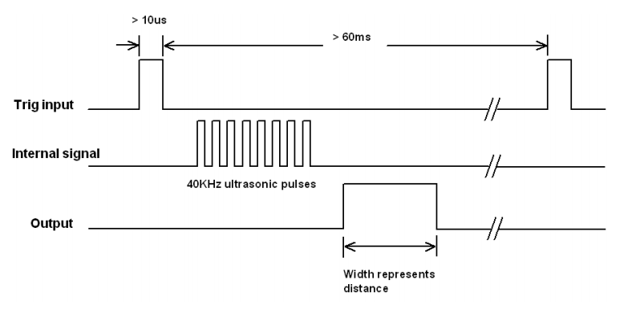

# SESSION 2

**GOAL:** Small experiment (a single sensor). Prove you can integrate sensors suitable for you monitoring purpose.  Focus on effectiveness, namely doing the right things, i.e., the Maker approach.

## The reference hardware: ESP32-DevKit


## Let's start by simulating it

[Wokwi](https://docs.wokwi.com/) is an online Electronics simulator. You can use it to simulate Arduino, ESP32, STM32, and many other popular boards, parts and sensors.

Open a new project and select ESP32 as the platform and the Arduino template. 

If you now open the diagram.json tab you have something like the following in the parts entry

```
"parts": [ { "type": "board-esp32-devkit-c-v4", "id": "esp", ...} ],
```

This implies that the pinout is the one in the [devkit v4](https://mischianti.org/esp32-devkitc-v4-high-resolution-pinout-and-specs/). 
To get the same pinout as the one in the picture above you need a V1 devkit, so you have to modify 
the entry as in the following

```
"parts": [ { "type": "board-esp32-devkit-v1", "id": "esp", ...} ],
```

* The simplest actuator, namely a [led](https://wokwi.com/projects/367336864678247425)
* The Simplest sensor, namely a [button](https://wokwi.com/projects/367336996835545089)
* A bit more interesting sensor, namely a [potentiometer](https://wokwi.com/projects/367338868313181185)
* A simple example with [SR04 Ultrasonic Sensor](https://wokwi.com/projects/367320442567677953). The width is measured by the function [pulseIn()](https://www.arduino.cc/reference/en/language/functions/advanced-io/pulsein/).




* A nice example with the [MPU6050](https://randomnerdtutorials.com/esp32-mpu-6050-accelerometer-gyroscope-arduino/) accelerometer and gyroscope. [Predictive Maintenance of Motors using Machine Learning](https://www.ijnrd.org/papers/IJNRD2404282.pdf). [Ensemble Learning for Predictive Maintenance on Wafer Stick Machine Using IoT Sensor Data](https://doi.org/10.1109/ICOSICA49951.2020.9243180)

## [MQTT](https://dev.to/hivemq_/series/18762)

Publish/Subscribe 


TOPICS:
1.  myhome/groundfloor/livingroom/temperature
2.  myhome/groundfloor/bathroom/temperature
3.  myhome/groundfloor/bathroom/humidity
4.  myhome/firstfloor/bathroom/temperature
5.  myhome/groundfloor/+/temperature (1 and 2)
6.  myhome/groundfloor/# (1,2 and 3)
7.  myhome/# (1,2,3 and 4)


* It's time to be connected by [MQTT](https://wokwi.com/projects/367405831605855233). The mosto convenient way is to use your mobile an Access Point and configure SSID and password consequently.

```
mosquitto_pub -h test.mosquitto.org -t "topicName/led" -m "on"
mosquitto_pub -h test.mosquitto.org -t "topicName/led" -m "off"
```

```
mosquitto_sub -h test.mosquitto.org -t "wokwi/temperature"
```

Another possible broker is mqtt://mqtt.eclipseprojects.io

* Build a simple backend with [https://io.adafruit.com/](https://io.adafruit.com/)
* Build a simple backend with thingsboard [https://demo.thingsboard.io/login](https://demo.thingsboard.io/login)


[https://thingsboard.io/docs/getting-started-guides/helloworld/?connectdevice=mqtt-linux](https://thingsboard.io/docs/getting-started-guides/helloworld/?connectdevice=mqtt-linux)

```
mosquitto_pub -d -q 1 -h "$THINGSBOARD_HOST_NAME" -p "1883" -t "v1/devices/me/telemetry" -u "$ACCESS_TOKEN" -m {"temperature":25}
```

**NOTE:** for the sake of convenience, we will use WiFi connectivity, however it should be now clear WiFi is usually not appropriate for IoT applications due to the excessive energy demand. 

## It is time to Work with a real device

* Download the code from Wokwi. It is also available on [https://github.com/andreavitaletti/IoT_short_course/tree/main/src/simulator](https://github.com/andreavitaletti/IoT_short_course/tree/main/src/simulator)
* The easiest way it to use the [Arduino IDE](https://support.arduino.cc/hc/en-us/articles/360019833020-Download-and-install-Arduino-IDE) 
* Since we are using the ESP32, you have to follow these [intructions](https://randomnerdtutorials.com/installing-the-esp32-board-in-arduino-ide-windows-instructions/)
* Select the DOIT ESP32 DEVKIT V1 as in the picture below and upload the code


* The only novelty is the vibration sensor SW-420 ... but please have a look to the [SR04 Ultrasonic Sensor](https://wokwi.com/projects/367320442567677953) and adapt it to make it working with the SW-420. 

This sketch could help

```
// Watch video here: https://www.youtube.com/watch?v=235BLk7vk00

/* Vibration sensor connected to Arduino pins as follows:
 
 ESP32 Arduino Vibration Sensor
 https://wolles-elektronikkiste.de/esp32-mit-arduino-code-programmieren
   D18 --> GPIO18 --> G18        DOut
   GND                           GND
   +5V --> 3.3V                  VCC      
*/

int EP = 18;

void setup(){
  pinMode(EP, INPUT); //set EP input for measurment
  Serial.begin(9600); //init serial 9600
}
void loop(){
  long measurement =TP_init();
  delay(50);
  Serial.println(measurement);
}

long TP_init(){
  delay(10);
  long measurement=pulseIn (EP, HIGH);  //wait for the pin to get HIGH and returns measurement
  return measurement;
}

```

Through pulseIn() we can measure the duration of a vibration event exceeding the threshold, not the frequency of the vibrations themselves. Indeed, the Arduino pulseIn() function waits for a change in the binary input (Low to High in this instance) and returns the duration that the detected pulse was active (time for it to go back High to Low after going High).

QUESTION: Can we use this function to help in anomaly detection? [see here for inspiration!](https://www.mdpi.com/1424-8220/22/16/6015)

