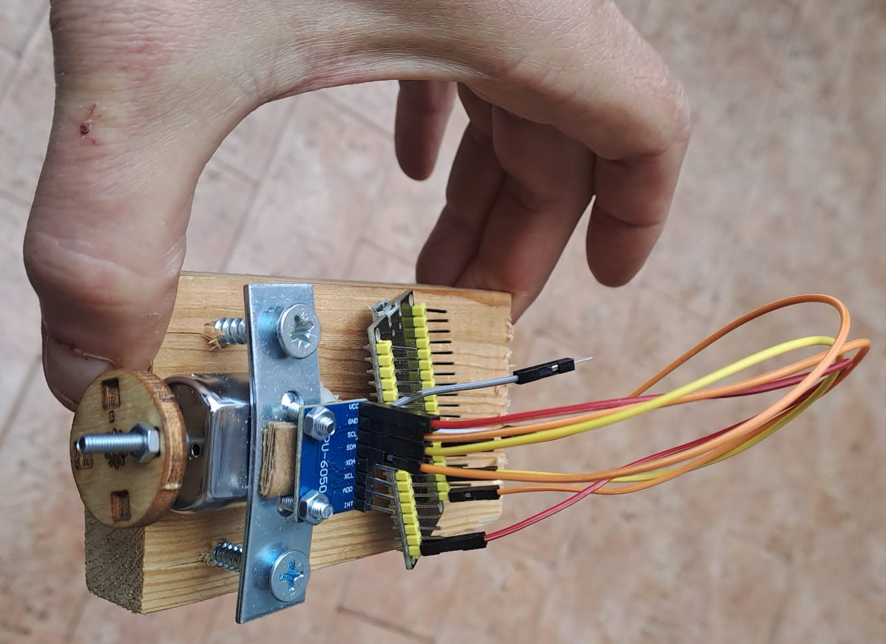
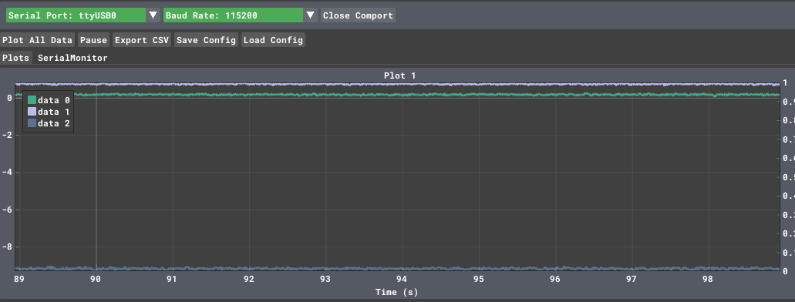

# Digital Twin

## Estimating clock drift 

ESP32 internal oscillators are cost-effective but notoriously sensitive to temperature, leading to a drift that can be several seconds a day.

By building a **Digital Twin**, we aren't just syncing the time; we are creating a mathematical model that lives on your PC, predicts how "wrong" the ESP32 is at any given moment, and feeds back a correction.

### The Architecture

To model the drift, the Twin needs to observe the relationship between the **Physical Clock** (ESP32) and the **Reference Clock** (PC).


---

### 1. The Mathematical Model

We assume the clock drift is linear over short-to-medium durations. The relationship between the ESP32 time ($t_{esp}$) and the PC time ($t_{ref}$) can be modeled as:

$$t_{esp} = (1 + R) \cdot t_{ref} + \phi$$


Where:

- **$R$**: The drift rate (the slope). If $R > 0$, the ESP32 is running fast.
    
- **$\phi$**: The initial phase offset.
    

The Digital Twin’s job is to continuously estimate $R$ and $\phi$ using **Linear Regression**.

---

### 2. Implementation Strategy

#### A. The Physical Asset (ESP32)

The ESP32 sends its internal `micros()` value to the PC via Serial or MQTT at regular intervals.


```
// ESP32 Snippet
void loop() {
  // Send local timestamp to the Digital Twin every 10 seconds
  unsigned long local_now = micros();
  Serial.println(local_now); 
  delay(10000);
}
```

#### B. The Digital Twin (Python on PC)

The Twin maintains a state of the ESP32's clock behavior. It uses the incoming data to update its internal model.

Python

```
import time
import numpy as np
from sklearn.linear_model import LinearRegression

class ESP32DigitalTwin:
    def __init__(self):
        self.esp_times = []
        self.ref_times = []
        self.model = LinearRegression()
        self.is_trained = False

    def update_model(self, esp_micros):
        # Record the reference time the moment the packet arrives
        ref_now = time.time() 
        
        self.esp_times.append([esp_micros])
        self.ref_times.append(ref_now)

        if len(self.esp_times) > 5:
            self.model.fit(self.esp_times, self.ref_times)
            self.is_trained = True
            
    def predict_real_time(self, current_esp_micros):
        if not self.is_trained:
            return "Insufficient data"
        # Predict what the PC time 'should' be based on ESP32 micros
        return self.model.predict([[current_esp_micros]])[0]

# Usage
twin = ESP32DigitalTwin()
# ... data collection loop ...
twin.update_model(1000050) # Example incoming microsecond value
```

---

### 3. Closing the Loop: Adjustment

Once the Twin calculates the drift rate $R$, it can send a **Correction Factor** back to the ESP32.

Instead of just resetting the time (which causes "time jumps"), the Digital Twin tells the ESP32 how much to "stretch" or "shrink" its perception of a second.

> **The Adjustment Logic:**
> 
> If the Twin calculates that the ESP32 is running **1%** fast, it sends a command: `SET_TICK_MULTIPLIER = 0.99`. The ESP32 then multiplies its internal delays or timestamps by this factor to stay in sync without jumping.

### Why this is a "Digital Twin" and not just NTP:

1. **Predictive:** If the ESP32 loses connection, the Twin can still predict its current time based on the historical drift model.
    
2. **Environmental Awareness:** Advanced twins can incorporate temperature data (since $R$ varies with heat) to create a multi-variable drift model.

### Phase Correction ($\phi$):

* ***What it is:** An absolute offset.
* **Action:** The PC tells the ESP32: _"Your current time is 100ms behind. Add 100ms to your current counter immediately."_
* **Problem:** This causes "time jumps," which can break applications that rely on smooth intervals (like sensor sampling).
        
### Frequency (Skew) Correction ($R$):

* ***What it is:** A rate multiplier (the "Tick Multiplier" mentioned earlier).
* **Action:** The PC tells the ESP32: _"Your hardware oscillator is 0.01% slow. For every 1,000,000 internal ticks, count them as 1,000,100 ticks."_
* **Benefit:** This keeps time smooth and continuous without jumps.

In a robust Digital Twin, you would ideally send **both**:

1. A **Phase Correction** at startup to get the clocks in the same ballpark.
    
2. A constant **Frequency Correction** ($R$) to keep them from drifting apart due to heat or hardware quality.

### ESP32 Smooth Clock Implementation

C++

```
#include <Arduino.h>

// Global variables for the Digital Twin state
double drift_multiplier = 1.0;    // The 'R' factor (1 + R)
uint64_t last_raw_micros = 0;     // Hardware time at last update
uint64_t base_synced_micros = 0;  // Virtual time at last update

/**
 * Returns the "Virtual Time" which is the hardware micros() 
 * adjusted by the Digital Twin's correction factor.
 */
uint64_t get_synced_micros() {
    uint64_t current_raw = micros();
    uint64_t elapsed_raw = current_raw - last_raw_micros;
    
    // Apply the multiplier only to the time elapsed since the last update
    return base_synced_micros + (uint64_t)(elapsed_raw * drift_multiplier);
}

void setup() {
    Serial.begin(115200);
    last_raw_micros = micros();
    base_synced_micros = last_raw_micros;
}

void loop() {
    // 1. Send data to the Digital Twin every 5 seconds
    static uint32_t last_report = 0;
    if (millis() - last_report > 5000) {
        last_report = millis();
        // Send raw hardware time so the Twin can calculate drift
        Serial.print("RAW_MICROS:");
        Serial.println(micros());
    }

    // 2. Listen for adjustments from the Digital Twin (the PC)
    if (Serial.available() > 0) {
        String data = Serial.readStringUntil('\n');
        if (data.startsWith("SET_MULT:")) {
            float new_multiplier = data.substring(9).toFloat();

            // ANCHORING: Update the base time before changing the multiplier
            // This prevents the clock from "jumping" backwards or forwards
            base_synced_micros = get_synced_micros();
            last_raw_micros = micros();
            
            drift_multiplier = new_multiplier;
            
            Serial.print("ACK: New Multiplier applied: ");
            Serial.println(drift_multiplier, 6);
        }
    }

    // Example of using the synced time for a local task
    // (e.g., a precise 1-second blink based on the Virtual Clock)
    static uint64_t next_blink = 0;
    if (get_synced_micros() >= next_blink) {
        next_blink += 1000000; // Schedule next blink in 1 "Virtual Second"
        // Toggle LED logic here...
    }
}
```

---

### Why the "Anchoring" Logic is Critical

If you simply did `micros() * multiplier`, the moment your Digital Twin sent a new multiplier (say, from `1.0001` to `0.9999`), your clock would instantly jump backwards by thousands of microseconds.

By using the **Anchor Method** ($base + elapsed \times mult$), we ensure that:

1. **Continuity:** The time at the exact moment of the update remains the same.
    
2. **Smoothness:** Only the _slope_ of the time progression changes after the update.

### The Digital Twin (Python)

You will need the `pyserial` and `scikit-learn` libraries:

`pip install pyserial scikit-learn`

Python

```
import serial
import time
import numpy as np
from sklearn.linear_model import LinearRegression

# Configuration
SERIAL_PORT = 'COM3'  # Change to your port (e.g., /dev/ttyUSB0 on Linux)
BAUD_RATE = 115200
WINDOW_SIZE = 10      # Number of samples to keep for the model

class ClockDigitalTwin:
    def __init__(self):
        self.esp_raw_micros = []
        self.pc_ref_seconds = []
        self.model = LinearRegression()

    def add_sample(self, esp_micros):
        # Record the "Gold Standard" time from the PC
        now_pc = time.time()
        
        self.esp_raw_micros.append([esp_micros])
        self.pc_ref_seconds.append(now_pc)
        
        # Keep only the most recent samples to adapt to temperature changes
        if len(self.esp_raw_micros) > WINDOW_SIZE:
            self.esp_raw_micros.pop(0)
            self.pc_ref_seconds.pop(0)

    def calculate_multiplier(self):
        if len(self.esp_raw_micros) < 5:
            return None # Not enough data yet
        
        # Fit model: PC_Time = (m * ESP_Micros) + c
        self.model.fit(self.esp_raw_micros, self.pc_ref_seconds)
        
        # The slope 'm' tells us how many PC seconds pass per 1 ESP32 microsecond
        # We multiply by 1,000,000 because the ESP32 works in microseconds
        multiplier = self.model.coef_[0] * 1_000_000
        return multiplier

def main():
    twin = ClockDigitalTwin()
    
    try:
        with serial.Serial(SERIAL_PORT, BAUD_RATE, timeout=1) as ser:
            print(f"Digital Twin active on {SERIAL_PORT}. Waiting for data...")
            
            while True:
                line = ser.readline().decode('utf-8').strip()
                
                if line.startswith("RAW_MICROS:"):
                    raw_val = int(line.split(":")[1])
                    twin.add_sample(raw_val)
                    
                    mult = twin.calculate_multiplier()
                    if mult:
                        print(f"Twin Model Updated. Predicted Multiplier: {mult:.6f}")
                        # Send the correction back to the physical asset
                        command = f"SET_MULT:{mult:.6f}\n"
                        ser.write(command.encode('utf-8'))
                
                elif line.startswith("ACK:"):
                    print(f"ESP32 Confirmation: {line}")

    except serial.SerialException as e:
        print(f"Error: {e}")

if __name__ == "__main__":
    main()
```

---

### How the Twin "Thinks"

The Python script is essentially looking at a scatter plot of **ESP32 Time** vs. **PC Time**.

- **If the points form a 45° line:** The ESP32 is perfectly in sync ($m = 1.0$).
    
- **If the line is steeper:** The ESP32 is running slow; the Twin sends a multiplier $> 1.0$ to speed it up.
    
- **If the line is flatter:** The ESP32 is running fast; the Twin sends a multiplier $< 1.0$ to slow it down.

### 2. Updated ESP32 Code (C++)

We add a `SET_PHASE` command to set the initial "Wall Clock" time.

C++

```
#include <Arduino.h>

double drift_multiplier = 1.0;
uint64_t last_raw_micros = 0;
double base_wall_time_s = 0; // The Wall Clock time in seconds (Epoch)

double get_wall_clock() {
    uint64_t current_raw = micros();
    uint64_t elapsed_raw = current_raw - last_raw_micros;
    
    // Convert elapsed microseconds to adjusted seconds
    double elapsed_adjusted_s = (elapsed_raw * drift_multiplier) / 1000000.0;
    return base_wall_time_s + elapsed_adjusted_s;
}

void setup() {
    Serial.begin(115200);
}

void loop() {
    // 1. Send heartbeat to Twin
    static uint32_t last_report = 0;
    if (millis() - last_report > 5000) {
        last_report = millis();
        Serial.print("RAW_MICROS:");
        Serial.print(micros());
        Serial.print(",CUR_WALL:");
        Serial.println(get_wall_clock(), 3); // Tell the twin what we THINK the time is
    }

    // 2. Handle Commands
    if (Serial.available() > 0) {
        String data = Serial.readStringUntil('\n');
        
        // Set the "Starting Line" (Phase)
        if (data.startsWith("SET_PHASE:")) {
            base_wall_time_s = data.substring(10).toDouble();
            last_raw_micros = micros();
            Serial.println("ACK: Phase (Wall Clock) Initialized.");
        }
        
        // Adjust the "Speed" (Frequency)
        if (data.startsWith("SET_MULT:")) {
            // Anchor the time before changing the rate
            base_wall_time_s = get_wall_clock();
            last_raw_micros = micros();
            drift_multiplier = data.substring(9).toDouble();
            Serial.println("ACK: Rate Adjusted.");
        }
    }
}
```

---

### 3. Updated Digital Twin (Python)

The Python script now performs two steps:

1. **Sync Phase:** Sends the current PC time immediately upon connection.
    
2. **Sync Frequency:** Continues to calculate and send the drift multiplier.
    

Python

```
import serial
import time
from sklearn.linear_model import LinearRegression

# ... (Previous Class Setup) ...

def main():
    twin = ClockDigitalTwin()
    phase_synced = False
    
    with serial.Serial('COM3', 115200, timeout=1) as ser:
        time.sleep(2) # Wait for ESP32 reboot
        
        while True:
            # 1. INITIAL PHASE SYNC
            if not phase_synced:
                now = time.time()
                ser.write(f"SET_PHASE:{now:.3f}\n".encode())
                phase_synced = True
                print(f"Sent initial Phase: {now}")

            line = ser.readline().decode('utf-8').strip()
            if "RAW_MICROS" in line:
                # Parse: RAW_MICROS:12345,CUR_WALL:17000.123
                parts = line.split(",")
                raw_micros = int(parts[0].split(":")[1])
                esp_thinks_wall = float(parts[1].split(":")[1])
                
                twin.add_sample(raw_micros)
                
                # 2. FREQUENCY ADJUSTMENT
                mult = twin.calculate_multiplier()
                if mult:
                    ser.write(f"SET_MULT:{mult:.8f}\n".encode())
                    error = time.time() - esp_thinks_wall
                    print(f"Correction sent. Current Error: {error*1000:.2f}ms")
```

---

### Summary of the "Twin" Logic

1. **The Phase Correction (`SET_PHASE`)**: This is like setting a watch. It happens once (or rarely) to align the two clocks to the same "zero" point.
    
2. **The Frequency Correction (`SET_MULT`)**: This is like adjusting the watch's internal gears. It happens continuously to ensure that as the ESP32 gets hot or cold, the Digital Twin keeps the "Virtual Clock" perfectly aligned with the PC.
    

This system is essentially a **Software-Defined Clock**. Your ESP32 hardware is doing the "ticking," but the Digital Twin is providing the "intelligence" to make those ticks meaningful.

Would you like to explore how to make the Digital Twin **predictive**, so it can estimate the clock drift based on the ESP32's **temperature**?

## Maintenance

* Periodic
* Preventive
* Predictive
* Reactive


## [The difference between Static and Dynamic Unbalance](https://www.youtube.com/watch?v=JB8i7LtY3mU)

<iframe width="560" height="315" src="https://www.youtube.com/embed/JB8i7LtY3mU?si=5j4mh8RmYGS-83ng" title="YouTube video player" frameborder="0" allow="accelerometer; autoplay; clipboard-write; encrypted-media; gyroscope; picture-in-picture; web-share" referrerpolicy="strict-origin-when-cross-origin" allowfullscreen></iframe>

## A simple experiment






[code](https://github.com/andreavitaletti/PlatformIO/tree/main/Projects/Digital_twin)

## A simple model 

Centrifugal force of a mass $m_e$ at distance $r$ from the center of rotation, with angular velocity $\omega$: $F​=m_e ​r \omega$

Using a lumped mass model, and assuming the damping coefficient and the stiffness of the support are negligible, if the mass or the rotor is $m$, we can write :


$m \ddot{x} = m_e ​r \omega^2 cos(\omega t)$

$m \ddot{y} = m_e ​r \omega^2 sin(\omega t)$

This allows us to estimate the accelerations under the simplistic assumptions we made. 
