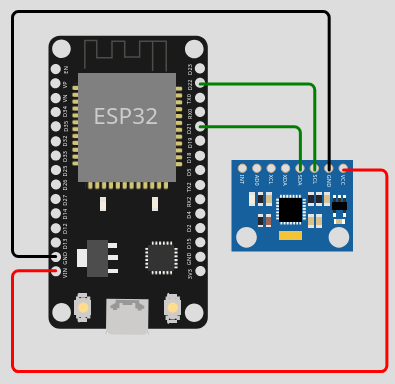

# Digital Twin

## Maintenance

* Periodic
* Preventive
* Predictive
* Reactive

## [The difference between Static and Dynamic Unbalance](https://www.youtube.com/watch?v=JB8i7LtY3mU)

<iframe width="560" height="315" src="https://www.youtube.com/embed/JB8i7LtY3mU?si=5j4mh8RmYGS-83ng" title="YouTube video player" frameborder="0" allow="accelerometer; autoplay; clipboard-write; encrypted-media; gyroscope; picture-in-picture; web-share" referrerpolicy="strict-origin-when-cross-origin" allowfullscreen></iframe>

## A simple experiment

[code](https://github.com/andreavitaletti/PlatformIO/tree/main/Projects/Digital_twin)

## A simple model 

Centrifugal force of a mass $m_e$ at distance $r$ from the center of rotation, with angular velocity $\omega$: $F​=m_e ​r \omega$

Using a lumped mass model, and assuming the damping coefficient and the stiffness of the support are negligible, if the mass or the rotor is $m$, we can write :

$m \ddot{x} = m_e ​r \omega^2 cos(\omega t)$

$m \ddot{y} = m_e ​r \omega^2 sin(\omega t)$

This allows us to estimate the accelerations under the simplistic assumptions we made. 
