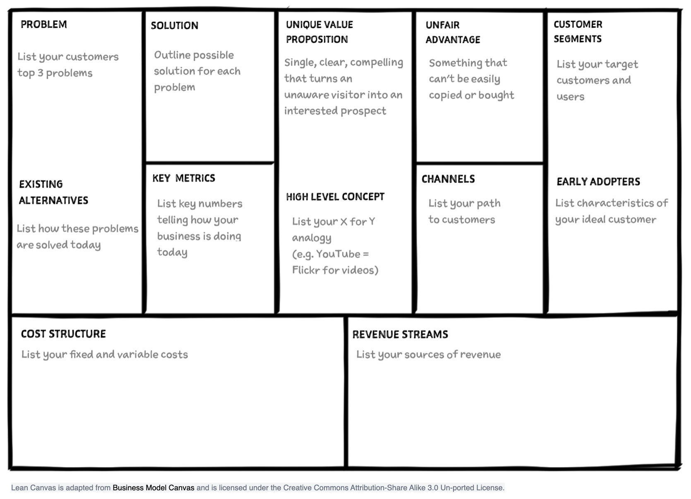
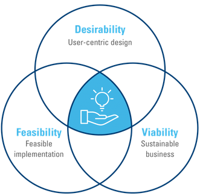

# 1. Deconstruct Your Idea on a Lean Canvas

!!! quote 

    A startup is a human institution designed to deliver a new product or service under conditions of extreme uncertainty. *Eric Ries*

There are no good reasons to invest money, time and more in general resources in a foggy situation

!!! tip 

    You need to be fast and learn!

* **fast:** resources are limited
* **learn** you are looking for a working plan

!!! tip 

    You need a process to quickly separate good ideas from bad ones!

But first of all: how do you plan to make money? Namely, what is your Business Model? What are the most fundamental assumptions you make?

## The Lean Canvas

You Business Model in a single page diagram that you can bring everywhere

[source](https://www.leanfoundry.com/articles/what-is-lean-canvas "https://www.leanfoundry.com/articles/what-is-lean-canvas")

To be successful you have to constantly balance three risks: customer, market and technical.

1. Do your customer want your product? Desirability
2. Can you monetize you product? Viability
3. Can you build your product (also beyond the technical aspects)? Feasibility   

[source](https://www.hyve.net/en/blog/design-thinking-mindset/ "https://www.hyve.net/en/blog/design-thinking-mindset/")

Let's first explore these three aspects and then we will ask to our customers to validate our assumptions. 