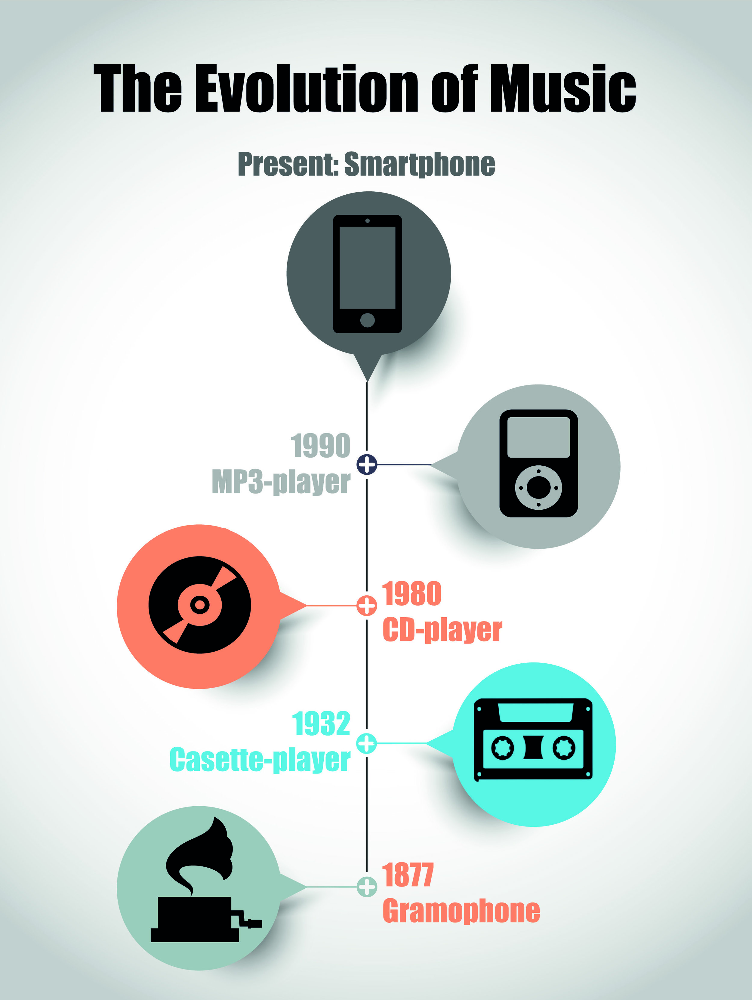
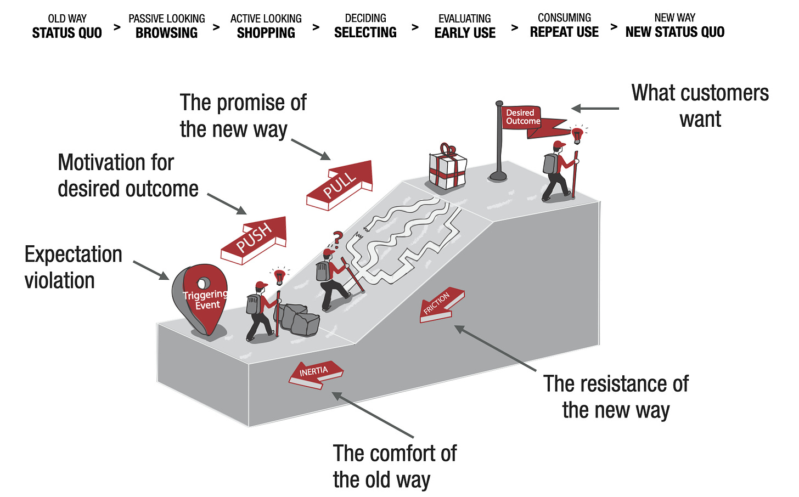
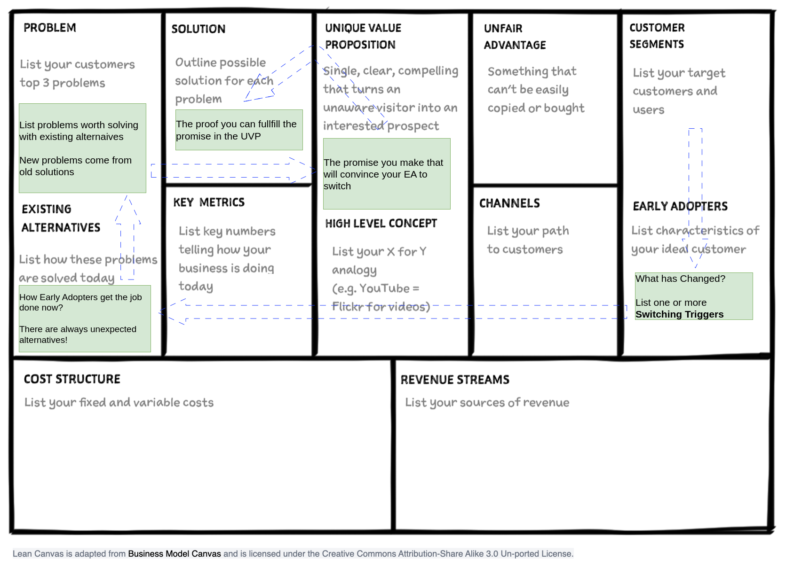

# 2. Stress Test You Idea for Desirability

!!! Question

    Are your customers willing to buy your solution?

!!! tip

    Customers don't care about solution, but about achieving desired outcomes

[source](https://www.algambenelux.be/blog/blog/the-evolution-in-the-music-industry "https://www.algambenelux.be/blog/blog/the-evolution-in-the-music-industry")

## The Customer Force Model

[source](https://www.leanfoundry.com/articles/the-backstory-behind-customer-forces-stories "https://www.leanfoundry.com/articles/the-backstory-behind-customer-forces-stories")

* Customers feel a problem so urgently that they are already acting to address it employing unsatisfactory existing alternatives (status quo)
* Customers experience a Trigger Event that makes them switching from the old way to the new one
* This triggering event is a violation of the expectations. Namely the old way (i.e. the existing alternatives)  is no longer good enough to get the job done
* The trigger event is a motivation to look for a better way (PUSH)
*  You promise a new better way (PULL) to give to your customer the desired outcome
*  Your customers will **choose** your new way, leaving the old consolidated one (INERTIA) if and only if, your new way is undisputedly better in getting the job done.   
*  Once chosen, your customers will **get** on the way if and only if, they will not perceive significant obstacles during the usage (FRICTION)

## Test your idea for desirability

[adapted from](https://www.leanfoundry.com/articles/what-is-lean-canvas "https://www.leanfoundry.com/articles/what-is-lean-canvas")