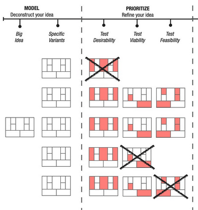

# 2. Stress Test You Idea for Desirability

!!! Question

    Are your customers willing to buy your solution?

!!! tip

    Customers don't care about solution, but about achieving desired outcomes

[source](https://www.algambenelux.be/blog/blog/the-evolution-in-the-music-industry "https://www.algambenelux.be/blog/blog/the-evolution-in-the-music-industry")

## The Customer Force Model

[source](https://www.leanfoundry.com/articles/the-backstory-behind-customer-forces-stories "https://www.leanfoundry.com/articles/the-backstory-behind-customer-forces-stories")

* Customers feel a problem so urgently that they are already acting to address it employing unsatisfactory existing alternatives (status quo)

> I love to listen music on my CD collection wherever I am 

* Customers experience a Trigger Event that makes them switching from the old way to the new one

> I went out for a trekking and I left home my favourite CD

* This triggering event is a violation of the expectations. Namely the old way (i.e. the existing alternatives)  is no longer good enough to get the job done
* The trigger event is a motivation to look for a better way (PUSH)

> I wish to have all my CDs with me in a compact space

*  You promise a new better way (PULL) to give to your customer the desired outcome
  
>  The MP3 seems to give me the opportunity to have all my CDs and even more in a tiny space

*  Your customers will **choose** your new way, leaving the old consolidated one (INERTIA) if and only if, your new way is undisputedly better in getting the job done.   

> I love my collection of CDs, and I spent a lot of money to buy all the CDs, but the MP3 is by far more convenient

*  Once chosen, your customers will **get** on the way if and only if, they will not perceive significant obstacles during the usage (FRICTION)

> However the quality of CD is much better in some cases, but still MP3 are good enough 

## Test your idea for desirability

[adapted from](https://www.leanfoundry.com/articles/what-is-lean-canvas "https://www.leanfoundry.com/articles/what-is-lean-canvas")

