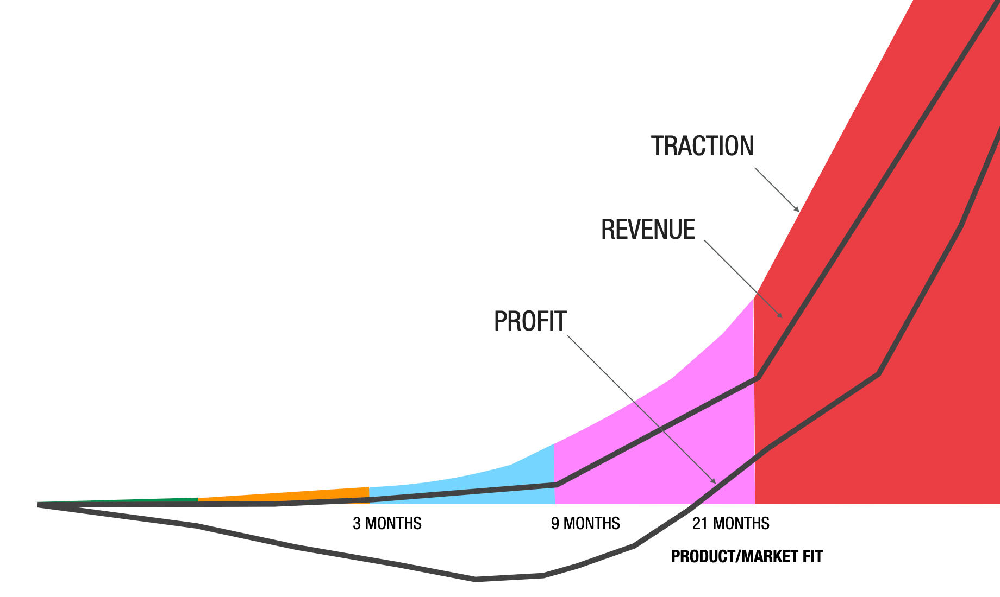
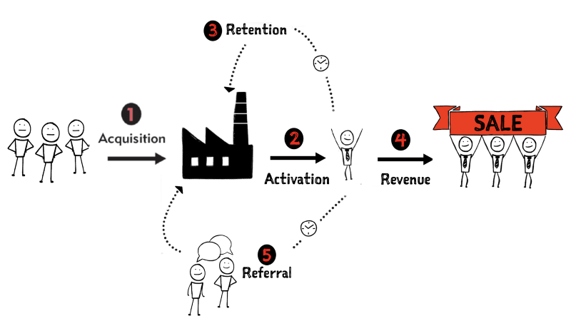

# Stress Test you Idea for Viability

!!! question

    If you don't have a **"big enough"** problem worth solving, why should you spend time on it?

**big enough** to first convince yourself (it can be subjective), but then also investors (it is objective). 

The situation is too foggy to make reliable financial forecast. It would be a pure exercise. Use [Fermi Estimation](https://en.wikipedia.org/wiki/Fermi_problem) instead.

**big enough** can be translated in **traction**: the rate at which a business model capture monetizable value from its customers (i.e. the capacity to generate money in the future, not revenue which represents what you actually get now) 

## The customer factory and traction

* **Acquisition**: an unaware visitor become an interested prospect, namely somebody you can interact with in the future to develop you business
* **Activation**: once a prospect "signs up", you have to full fill the promise in your UVP to activate him/her
* **Retention**: repeated use/engagement with your product  
* **Revenue**: your customers will eventually pay you
* **Referral**: happy customers helps you in acquire new prospects
* **Cancellation**: some customer will leave you!

!!! tip

    Traction is the output of your customer factory

## Use fermi estimation to test viability of your idea

!!! tip

    Define a target  throughput goal (Minimum Success Criteria - MSC) in terms of Annual Recurring Revenue (ARR)

We need a MSC target, namely the smallest outcome to make you deem your project, otherwise we easily illude ourself.

ARR is simple: # customers, price, frequency of purchase

!!! tip

    Test whether your customer factory can achieve the MSC

!!! tip

    If your customer factory cannot achieve the goal refine the model
