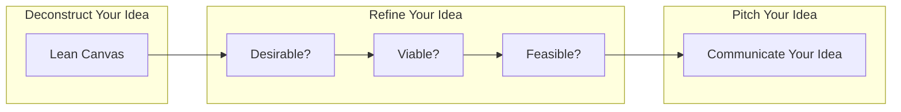

# Goal

<!--
[https://sites.google.com/diag.uniroma1.it/digital-entrepreneurship/home](https://sites.google.com/diag.uniroma1.it/digital-entrepreneurship/home)
 -->

The course is based on the book by Ash Maurya "[Running Lean: Iterate from plan A to a plan that works](https://www.leanfoundry.com/books/running-lean)" and [https://www.leanfoundry.com/](https://www.leanfoundry.com/)

In particular we will focus on PART I:DESIGN and PART II: VALIDATION. We will only marginally consider PART III: GROWTH.  

!!! danger
    
    **FACT:** [90% of startups fail!](https://www.upsilonit.com/blog/startup-success-and-failure-rate)

!!! info

    **FACT:** [65% of successful startups have drastically changed their initial plan (i.e. plan A)](https://www.upsilonit.com/blog/startup-success-and-failure-rate)

!!! info 

    **HYPOTHESIS:** Successful startups do not necessarily have a better plan A, but they find out a working plan without running out of resources. 

!!! tip
    The book describes a systematic process to go from the initial plan to a plan that works without running out of resources

