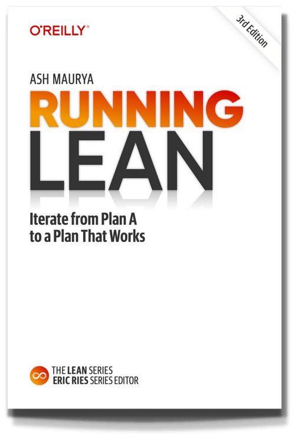

# Goal

<!--
[https://sites.google.com/diag.uniroma1.it/digital-entrepreneurship/home](https://sites.google.com/diag.uniroma1.it/digital-entrepreneurship/home)
 -->
 
The course is based on the book by Ash Maurya "[Running Lean: Iterate from plan A to a plan that works](https://www.leanfoundry.com/books/running-lean)" and [https://www.leanfoundry.com/](https://www.leanfoundry.com/)

In particular we will focus on PART I:DESIGN and PART II: VALIDATION. We will only marginally consider PART III: GROWTH.  

!!! info
    
    The book is an excellent guide. To provide an overview of the concepts I'm going to embed some of the Linkedin post of [Ash Maurya](https://www.linkedin.com/in/ashmaurya/)