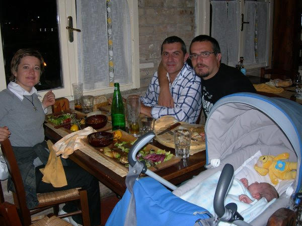
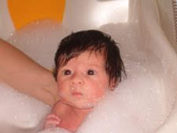
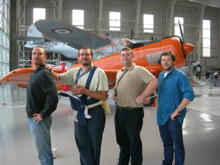
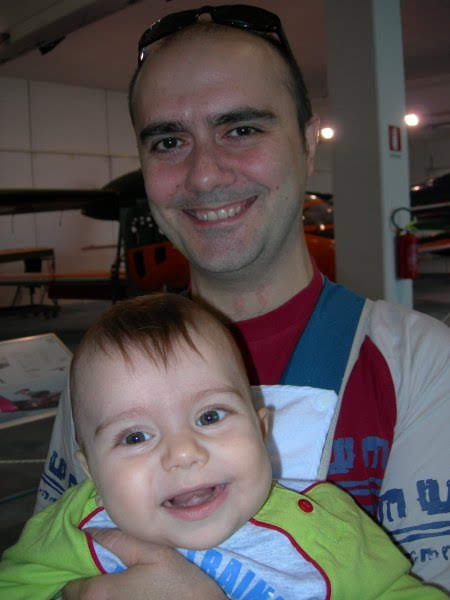
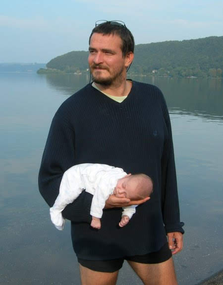
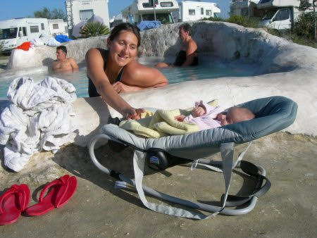
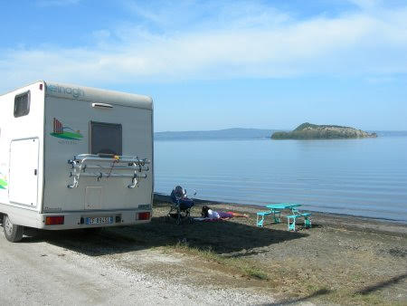
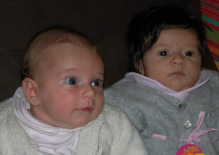
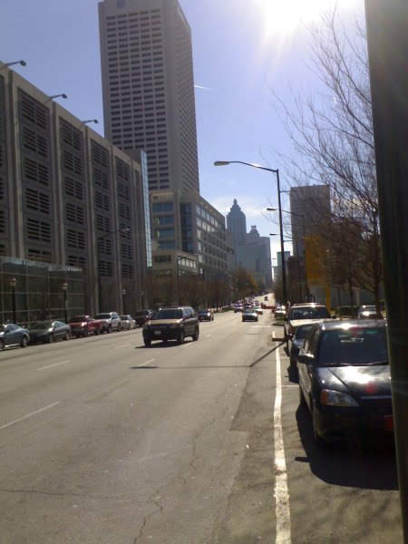
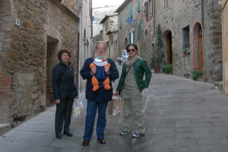

# 2006

## Chi è Pilde?
*20-09-2006*

  
   Ciao, mi chiamo Matilde. Quando MeP (Mamma e Papà )
  
  
   non sapevano ancora se sarei stata una femmina o un maschio, avevano in mente due nomi per me. Uno è Pietro, che per inciso è il nonno di Carlotta (M)
  
  
   e l'altro Matilde, che non è nessuno di famiglia ne tantomeno il personaggio di una fiction alla moda... semplicemente gli piaceva. Sicchè zia Betta ha coniato
   <strong>
    Pilde
   </strong>
   che sarebbe
   <strong>
    P
   </strong>
   ietro e Mat
   <strong>
    ilde
   </strong>
   messi insieme... e a me piace!
  
 

## Il REBUS di zio Angelo
*21-09-2006*

 
  
   
  
 

## Ciao da nonno Mario e nonna Franca
*22-09-2006*

 
  
   Ciao siamo nonno Mario e nonna Franca... un benvenuto a Matilde
  
 

## Eccoci ... 007...
*25-09-2006*

 
  
   
  
 

## Ho invitato Mara, Lorenzo e MeP a cena
*29-09-2006*

 
  
   Carissimi, ieri sono andata per la prima volta a cena fuori... ho pagato io! Il latte di M è buono però a giudicare da quello che si sono mangiati loro, mi sa che c'è qualcosa di meglio da mettere sotto i denti... Vabbè un po' di pazienza e arrivo pure io.
  
  
   
  
 

## Finalmente una foto con zia Giorgia!
*29-09-2006*

 
  
   
  
 

## E' lei o non è lei ... ceeerto che è lei
*30-09-2006*

 
  
   
  
 

## Matilde e il cuore
*30-09-2006*

 
  
   
  
  
   Questo è il mio simbolo.  La parte alta del cuore, quelle con le due gobbe per intenderci, sembra proprio una
   <strong>
    M
   </strong>
   . La parte bassa invece assomiglia ad una
   <strong>
    A
   </strong>
   rovesciata vero! Poi dovete sapere che nel linguaggio degli informatici (MeP lo sono!!!)
  
  
   la
   <strong>
    ~
   </strong>
   si chiama
   <strong>
    TILDE
   </strong>
   e dunque quel serpentello in mezzo al cuore è una tilde.
Se mettiamo tutto insieme otteniamo
   <strong>
    M-A-TILDE
   </strong>
   ... il fatto che poi si veda un cuore è del tutto casuale ;-)
  
 

## Prima volta in camper... e il mare.
*03-10-2006*

 
  
   Ragazzi, lo scorso fine settimana è stato fantastico... mille novità . La sera siamo arrivati a Sabaudia in camper... eravamo MeP ed io, Bruno e Noemi. Bello dormire col rumore delle onde.
   
  
  
   Poi l'indomani c'hanno raggiunto in tantissimi Nicole, Sophie, Nathalie, Enrico, Bruno, Noemi, Peppe, Luciana, Francesco, Alfonso, Mariapaola, Mauro, Annarita, Augh, Luca, Federica ...  insomma una tribù. Eravamo 16... abbiamo organizzato un pranzone a base di avanzi e pasta... a me ancora mi tocca il latte di mamma ;-)
  
  
   
  
  
   Abbiamo giocato, mangiato, scherzato, fatto il bagno, qualcuno ha anche volato, ma soprattutto ho visto il mare più da vicino. Che bello!!!
  
  
   
  
 

## Le sbinonne
*07-10-2006*

 
  
   Matilde ha due
   <strong>
    sbi
   </strong>
   -nonne, le Marie. Una
   <strong>
    sbi
   </strong>
   nonna è una
   <strong>
    bis
   </strong>
   nonna specialissima... la leggenda narra che in dialetto ligure sbinonna sia l'equivalente di bisnonna, ma è forte il dubbio che sia una delle irresistibili storpiature di una delle Marie.. comunque che importanza ha, nella nostra famiglia abbiamo due sbinonne... e che sbinonne!!!
  
  
   
  
 

## Auguri alle gemelline
*08-10-2006*

 
  
   Esattamente un mese fa, il 7 settembre, arrivavamo in ospedale alla Fabia Mater. Ci hanno accomodato in una stanza del secondo piano. Entrando ci aspettavano Cristina e la piccola Alessia, per gli amici Toporosa. Toporosa era nata quel mattino. Di li a pochissimo sarebbe nata anche Matilde e nei giorni successivi le due neo-mamme e le due piccine avrebbero condiviso dei momenti importanti... avrebbero imparato a conoscersi.
  
  
   
  
  
   
  
  
   Auguri piccolissime... anche se crescete a vista d'occhio! Mi raccomando però, prima di chiedere le chiavi della macchina ai P, aspettate un pochino :D
  
 

## Il mio primo museo
*15-10-2006*

 
  
   Oggi sono stata al mio primo museo... quello dell'aeronautica militare di Vigna di Valle.
  
  
   
  
  
   Stavo con un sacco di amici, ma il mio preferito è Paolo... il suo ciuffo è irresistibile.
  
  
   
  
  
   Alla fine ero un po' stanca e così mi sono fatta una pennica in riva al lago... RONF... RONF!
  
  
   
  
 

## Pranzo al mare
*15-10-2006*

 
  
   La mia amica Popi ed io, siamo andate a pranzo al mare. Volevamo andare da sole, ma le mamme non ci lasciano mai... si sa... mamme italiane. Splendida giornata.
  
  
   
  
 

## Bentornato zio Nic
*19-10-2006*

 
  
   Domani torna zio Nicola. Non vedo l'ora di conoscervi zia Annagloria e te... comunque la prossima volta che vai in "vacanza", porta pure la zia. Quetti uomini!!! :-D
  
  
   
  
 

## Vi presento i miei nonni
*25-10-2006*

 
  
   Secondo voi quale è il più felice? A me sembra di averli conquistati tutti e quattro :D
  
  
   
  
 

## Una gara di Limbo un po' speciale!
*25-10-2006*

 
  
   Oggi sono andata a vedere una gara di limbo! Hei ma che avete capito?? I concorrenti erano dei piccoli aereoplanini radiocomandati che dovevano passare sotto un filo di lana a 2 metri da terra!Si stava cosi' bene al sole e sul prato del decollo!Le cose che mi sono piaciute di piu' pero' sono state le salsicce alla brace con i fagioli (le ha mangiate mamma ovviamente...a me sono arrivate qualche ora dopo!)
  
  
   e soprattutto il sonno che mi sono fatta sulla pancia di papà !
  
  
   
  
  
   
  
 

## Un weekend di novità
*01-11-2006*

 
  
   Ciao, sono appena tornata da un we in camper con MeP ricco di nuove scoperte. Sono stata alle terme di Bagnaccio....ovviamente non ho fatto il bagno perchè ancora sono troppo piccola, ma ho guardato MeP che si godevano l'acqua calda e il sole del mattino!
  
  
   
  
  
   Verso l'ora di pranzo sono andata a Bolsena a rilassarmi in riva al lago vicino al mio camper.
  
  
   
  
  
   Infine al tramonto sono andata a visitare un bellissimo paesino arroccato sui calanchi, Civita di Bagnoregio.
  
  
   
  
 

## Sono arrivati
*04-11-2006*

 
  
   Finalmente ho conosciuto lo zio Nic e la zia Annagloria...mi stanno proprio simpatici, eppoi con loro ho fatto un sacco di cose nuove. Ho preso per la prima volta la metropolitana
  
  
   
  
  
   Alla fine ero un pochino stanca e dunque ci siamo rilassati in riva al Tevere.
  
  
   
  
  
   P.S. Zio Nic, mi ha raccontato che da bambino ha dato fuoco ai capelli del fratello ... che fico :-)
  
 

## Toporosa è qui!
*06-11-2006*

 
  
   Oggi siamo state insieme la mia gemellina ed io... siamo carine vero!
   
  
  
   Abbiamo giocato insieme e poi abbiamo badato ai nostri genitori... sapete sono piuttosto infantili, ma aspettate che cominciamo a parlare e ve ne diciamo quattro!
  
  
   
  
  
   Eccomi qui !!! Sono Toporosa !!! Oggi sono andata a trovare la mia amichetta Matilde. Ci siamo messe tutte e due sulla palestrina di Matilde e abbiamo scoperto che oltre ad essere amichette siamo anche un pò gelosotte l'una dell'altra .... insomma basta mettere il punto IL MIO PAPA' E LA MIA MAMMA SONO I MIEI E BASTA !!! ... i tuoi sono i tuoi... hihihi :-D
  
  
   Un bacione grande da Toporosa e i miei MeP
  
 

## Il mio primo saluto!
*07-11-2006*

 
  
   Ciao "zii", ciao Matilde, oggi scrivo il mio primo saluto sul tuo blog. Ieri finalmente dopo quasi 2 mesi ci siamo riviste... Mamma mia quanto sei cresciuta! Mi ha fatto un effetto strano vedere qualcuno della mia stessa "taglia" , di solito vedo solo dei grandi ! Allora esistono quelli piccolini come me ! Che bello !!! Presto giocheremo insieme e poi andremo anche in discoteca per la gioia di MeP :-P CIao Un bacione TOPOROSA
  
 

## Amici speciali
*19-11-2006*

 
  
   Oggi ho conosciuto degli amici speciali. Ormai da qualche tempo, i nostri amici e MeP, invece di scambiarsi regalini per il compleanno, raccolgono dei soldi in un salvadanaio per poi donarli in beneficenza. Oggi finalmente abbiamo portato il nostro salvadanaio a fra Benedetto per il progetto
   <strong>
    ridare la luce
   </strong>
   .
  
  
   
  
  
   Si tratta di un progetto congiunto tra l'aeronautica militare e il fatebenefratelli per operare di cataratta i bambini e gli adulti del  Mali. Con pochi soldi si può ridare la vista ad una persona... non vi pare eccezionale?  Per chi ne volesse sapere di più
   <a href="http://www.afmal.org">
    www.afmal.org
   </a>
  
  
   Poi abbiamo fatto un giretto per il fatebenefratelli di Genzano. In questa struttura sono ospitate delle persone speciali ed è stato un piacere conoscerle. Non ci sono parole per descriverle, sono uniche. Sono piccole ma grandi, semplici e complesse, sorridenti e tristi, illuse e consapevoli, ma soprattutto vere, una virtù che al giorno d'oggi non è proprio comune.
   
  
  
   In particolare saluto Marco che ci ha mostrato i suoi bellissimi quadri e anche bruschetta, un asinello con cui i ragazzi fanno onoterapia. Infine siamo stati a pranzo (e come te sbagli)
  
  
   con Bruno e Noemi. Al nostro ritorno per completare una giornata speciale abbiamo soccorso due ragazzi che erano rimasti senza benzina (l'incubo di M)
  
  
   e li abbiamo trainati fino al distributore più vicino.

## Mamma in palestra e papà  vola
*21-11-2006*

 
  
   Oggi mamma è tornata in palestra mentre papà ed io discorrevamo al bar in sua attesa. L'ho vista un po' affaticata, ma datele tempo e vedrete. Dai ma...
  
  
   Invece sabato scorso papà ha fatto  un voletto.
  
  
   
  
  
   Quando si aspetta un bambino/a ci si domanda spesso... come cambierà la mia vita? In fondo non molto, l'unica cosa è che se prima ci mettevi 5 minuti a fare le cose ore ne impieghi 10... ci vuole solo un pizzico di pazienza e organizzazione in più. In compenso si fanno un sacco di cose nuove insieme!
  
 

## Martufello 
*21-11-2006*

 
  
   
  
  
   Perplessa!
  
 

## L'estate di S.Martino
*22-11-2006*

 
  
   E' davvero incredibile, ancora giornate di sole e caldo!E allora io ne approfitto...
Sono andata al parco della caffarella con Aurora e la sua mamma Nathalia,
  
  
   
  
  
   al porto di ostia con MeP
  
  
   
  
  
   al mare con Popì e Tommy
  
  
   
  
 

## Auguri agli scorpioncini
*23-11-2006*

 
  
   Tanti auguri alla piccola NICOLE che compie 2 anni, e a Trota e Nathalia...che ne fanno qualcuno in piu'....
  
 

## Pensiero per mamma Carlotta
*23-11-2006*

 
  
   <em>
    Si è madre per capire l'inesplicabile
   </em>
  
  
   <em>
    Si è madre per illuminare le tenebre
   </em>
  
  
   <em>
    Si è madre per coccolare quando i lampi striano la notte, quando il tuono viola la terra, quando il fango inghiotte...
   </em>
  
  
   <em>
    Si è madre per amare senza inizio nè fine
   </em>
  
  
   Miriam Ba (Burkina Faso)

  
  
   <em>
    ti voglio bene
   </em>
  
  
   <em>
    Zia Giorgia
   </em>
  
 

## Chiacchierando con papà
*24-11-2006*

 
   
  
   Cosa ci saremo detti ...
  
 

## Fanatica!
*25-11-2006*

 
  
   La mia mamma, che è un pò fanatica, dice che sono bellissima....voi che dite? :)
  
  
   
  
  
   
  
  
   
  
 

## Zia Betta e ...
*29-11-2006*

 
  
   Lei è zia Betta, ma chi mi sta facendo la foto? ... è proprio brutto!!!
  
  
   
  
 

## Papà (Balù)

canta ... lo stretto indispensabile!
*30-11-2006*

 
  
   
  
  
   Ti bastan poche briciole lo stretto indispensabile
  
  
   E i tuoi malanni puoi dimenticar
  
  
   Infondo basta il minimo sapessi quanto è facile
  
  
   Trovare quel pò che occorre per campar
  
  <!-- more -->
  
   Mi piace vagare ma ovunque io sia
  
  
   Mi sento di stare a casa mia
  
  
   Ci son lassù le api che il loro miele fan per me
  
  
   Se sotto un sasso poi guarderai ci troverai
  
  
   Le formiche e un pò io me ne mangerò
  
  
   Vicino a te quel che ti occorre puoi trovar
  
  
   Ma quando?
  
  
   Lo puoi trovar
  
  
   Ti bastan poche briciole lo stretto indispensabile
  
  
   E i tuoi malanni puoi dimenticar
  
  
   Ti serve solo il minimo e poi trovarlo è facile
  
  
   Quel tanto che ti basta per campar
  
  
   Quando tu prendi un frutto non fidarti mai
  
  
   Ahi
  
  
   Se ti pungi è brutto ti fai male sai
  
  
   Attento ai fichi d'india perchè hanno tanto spine ma invece se
  
  
   Tu trovi un fico che è normal te lo prendi e nn ti farai del mal
  
  
   Hai capito si o no?
  
  
   Vicino a te quel che ti occorre troverai
  
  
   Lo troverai
  
  
   Lo troverai
  
  
   Mamma mia questa si che è vita! ti rilasci così già e vieni vieni qui fa come me perchè stammi a sentire ragazzino se farai come quel ape ti stancherai troppo e non perder tempo sempre a cercare le cose che vuoi e non puoi trovar.....
  
  
   E quando sai che puoi farne a meno e non ci stai pensando nemmeno
  
  
   Sai cosa accadrè quel che ti occorre ti arriverà
  
  
   Ti bastan poche briciole lo stretto indispensabile
  
  
   E i tuoi malanni puoi dimenticar
  
  
   Eh già
  
  
   Ti serve solo il minimo e poi trovarlo è facile
  
  
   Quel tanto che ti basta per campar
  
  
   Già
  
  
   Quel tanto che ti basta per campar.
  
  
   Come no
  
 

## L'altalena
*02-12-2006*

 
  
   L'altro giorno ho conosciuto un nuovo gioco... l'altalena! Non ho ancora capito se mi piace, ma pare che MeP non potessero fare a meno di farmela provare... di tanto in tanto tocca accontentarli, ma aspettate che abbia il dono della parola e gliene conto quattro ;-)
  
   
  
  
 

## Un bel regalino
*03-12-2006*

 
  
   Cristina, la mamma di Toporosa, mi ha fatto un bellissimo regalino... eccolo. Grazie Cri.
  
  
   
  
  
   P.S. Domenica dopo pranzo usciamo con Alessia, faccimo tardi, non ci aspettate alzati ;-)
  
 

## Matilde nella casina di Toporosa
*04-12-2006*

 
  
   
  
  
   Eccola qui !!! Matilde mi è venuta a trovare e le ho fatto vedere tutti i miei giochini !!! Poi lei si è addormentata .... spero tanto che si sia divertita !!!! Le ho fatto "tastare" anche tutti i miei Teletubbies !!! :-D :-P
  
 

## Calcata e le cascate di Monte Gelato
*04-12-2006*

 
  
   Ciao a tutti. Ieri gita fuoriporta con Nicole, Sophie e i loro MeP. Siamo stati a Calcata, un paesotto molto grazioso arroccato su uno sperone. Ci siamo accomodati sulle sedie di pietra all'ingresso, abbiamo fatto un giretto per il paese, giocato a 1,2,3 stella e poi l'immancabile panino con le salsicce. Nel tornare a Roma siamo passati alle cascate di Monte Gelato.
   
  
  
   Infine Mara e Lorenzo ci hanno invitato a cena. Abbiamo giocato tanto insieme e mi sono divertita, eppoi una grande novità ... ieri una 500 travestita da letto che girava per Grottaferrata è arrivata a casa ed ha portato il letto a Mara e Lorenzo... fate vobis :-D
  
 

## Papà in trasferta
*07-12-2006*

 
  
   Ciao Matilde. Sono all'aeroporto di Philadelphia in attesa di andare ad Atlanta. Oggi è il primo giorno che stiamo veramente lontani... addirittura oltreoceano. Ma torno prestissimo e la prossima volta ci veniamo insieme alla mamma. A proposito, mi raccomando, tieni d'occhio la mamma ;-)
  
  
   
  
 

## Terzo complemese
*08-12-2006*

 
  
   ciao oggi compio 3 mesi! sono grande ormai!
  
  
   invece di ricevere regali voglio fare un regalo speciale al mio papà che è lontano....una mia foto appena sveglia...così lo metto di buon umore!come farebbe altrimenti ad iniziare la giornata senza di me??? tvb P :)
  
  
   
  
 

## Io lavoro e voi in Toscana... ma che si fa così?!?
*09-12-2006*

 
  
   Mentre io lavoro in quel di Atlanta voi siete a Buonconvento con Ronzinante... vabbè, ma la prossima volta non mi fregate :-D
  
  
   
  
   
  
  
  
   Atlanta è "sciapetta", ma Georgia Tech is amazing!!! Ogni volta che vengo negli Stati Uniti mi entusiasma l'enorme valore che qui danno all'innovazione e alla ricerca e mi infastidisce il "nostro" essere assoultamente inconsistenti. Per contro il cibo fa schifo... pollo fritto e salsette... come si dice, ariconsolamoce co' l'aglietto!!!
  
  
   
  
 

## We con i nonni e la zia Giorgia
*11-12-2006*

 
  
   ciao papà, hai ragione noi ci siamo proprio divertiti!siamo stati ad inciuccarci di brunello a Montalcino e poi a fare shopping natalizio ad Orbetello.ma dai resisti ancora qualche ora che domani ci vediamo e mi strapazzi di coccole e io ti tiro i capelli e ti faccio tutti i versi che ho imparato!
  
  
   
  
 

## Io c'ho un segreto ...
*14-12-2006*

 
  
   ... ma ancora non ve lo posso dire ... stay tuned ;-)
  
  
   
  
 

## Auguri Budino
*17-12-2006*

 
  
   Oggi vi voglio raccontare di mio fratello Budino.
  
  
   
  
  
   Budino è un bambino Brasiliano, la cosa magica è che non è solo fratello mio, ma anche di Nicole, Sophie, Ascanio e Francesco eppoi non è solo figlio di Mep, ma anche di Mara, Lorenzo, Nospa, Simona, Nathalie, Enrico, Lampadina, Paperoga, Bravo Bravo, Noemi, Valvola, Trota, Valentina, Fracassa, Nep, Fenomeno, Geppa, Cipolla, Venturi, Cristina, Nonno, Peppe, Luciana, Tre Minuti, Follevento e .... bello vero.

   
  
  
   Budino e i nostri amici brasiliani ci fanno gli auguri:
  
  
   "que Jesus le retraga tudo bom para alegria saudes para vocè e toda a sua familia. Muito obrigado por seo ajudo. Te desejo um feliz Natal" 
  
  
   grazie a Bruno e Noemi abbiamo anche la traduzione ...
  
  
   "che Gesu riservi per te e la tua famiglia il meglio per allegria e salute. Molte grazie per il tuo aiuto. Ti auguro un felice Natale"
  
  
   ... e noi contraccambiamo ...
   <strong>
    AUGURI FRATELLINO
   </strong>
   .
  
 

## Benvenuto Ascanio... Lamperino!
*17-12-2006*

 
  
   Finalmente n'omo tra sto branco de femmine... è nato Ascanio, pesa 3.35Kg e mamma e bambino stanno benissimo. Il padre, Lampa, non trova l'interruttore ... HIHIHIHIHI, mica ce n'ha uno solo!!!!
  
  
   
  
  
   Un abbraccio da Matilde e MeP.
  
 

## Segreto svelato .... mica una, quattro novità  ... e che novità !!!!
*23-12-2006*

 
  
   Prima di tutto benvenuta Lucia... e si, l'epidemia dilaga impetuosa, un'altra amichetta à nata ieri. Ormai credevo la portasse Babbo Natale ed invece eccola qui. Un bacio alla mamma e pure al papà.
  
  
   Poi vi ricordate che avevo un segreto... pure Pinuzza e Gianluca aspettano. Evvai!
  
  
   Ieri sera sono stata per la prima volta in discoteca al 45 giri. Non è che abbia capito molto, un po' troppa confusione per i mie gusti, però... tutti mi salutavano, mi indicavano e "pucci pucci", "trilli trilli"... mica ho capito perchè parlano così strano. Comunque abbiamo salutato gli amici di Mep e siamo andati a casetta... lunga dormita stanotte.
  
  
   Infine oggi ho fatto il mio primo vaccino. L'infermiera è stata bravissima ed io non ho fiatato... sono una dura io ;-)
  
 

## Tanti auguri a tutti
*23-12-2006*

 
  
   
  
 

