# 2008

## Fine anno a Ovindoli
*01-01-2008*

 
  
   Oggi è il 31 dicembre, l'ultimo giorno di questo bel 2007! 
Abbiamo deciso di regalarci una giornata sulla neve a Ovindoli. 
Appena sono scesa dalla macchina ho visto gli alberi "grandi"...un bosco e tanta neve. E' buffa la neve, fredda e morbida.
  
  
   
  
  
   Con P abbiamo fatto una discesa sulla paletta!
  
  
   
  
  
   Poi con i fuoristrada, insieme a Noemi, Bruno, Selene, Ettore, Luca e Federica abbiamo percorso una strada innevata sperduta nel bosco e siamo arrivati ad una radura da cui si godeva un panorama bellissimo, sul Velino e la piana del Fucino. Abbiamo approfittato per fare un pic nic :)
  
  
   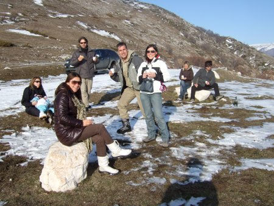
  
  
   e io ho mangiato tanto ghiaccio
  
  
   
  
  
   Bruno mi ha portata dai "cacalli" e sono anche salita sopra a quello bianco reggendomi alla criniera.Che bello!
  
  
   
  
 

## 1 Gennaio 2008
*02-01-2008*

 
  
   BUON 2008 a tutti!
  
  
   
  
  
   Oggi sono stata a pranzo dalla "bionna" e poi insieme abbiamo fatto una bella passeggiata al parco della Caffarella.
  
  
   
  
 

## Aggiungi un posto a tavola
*07-01-2008*

 
  
   E' proprio vero che mangiare in compagnia è più divertente!
  
  
   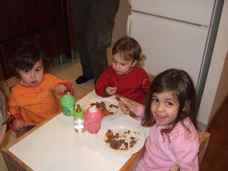
  
 

## Quante parole....
*09-01-2008*

 
  
   So dire tantissime cose adesso, ad esempio so i versi degli animali (anche il gallo)
  
  
   , e le parti del corpo (anche la pancia e la schiena)
  
  
   e so contare dui (come i miei piedini)
  
  
   , te, atto,cincu.
So dire scendo (dal seggiolone)
  
  
   , carne, pesce, maìno (mandarino)
  
  
   , kili (kiwi)
  
  
   e molti altri ...
Mi piace cantare canzoncine buffe e ripeto tutto quello che mi dicono.
  
  
   
  
 

## popì & 'col
*11-01-2008*

 
  
   Ieri sono venute a trovarmi popì e 'col (sophie e nicole)
  
  
   , abbiamo giocato un pò tutte insieme con i colori e l'altalena e un pò ognuna per conto suo :)
  
  
   ma ci siamo divertite!
  
  
   
  
  
   Poi M ha fatto degli ottimi gnocchetti al pesto che abbiamo divorato tutte e tre insieme!
  
  
   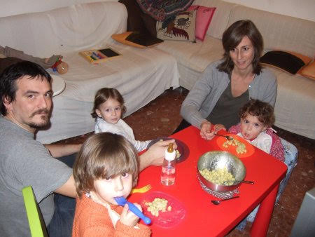
  
 

## Flavietto!
*13-01-2008*

 
  
   Ieri sera è venuto a trovarmi Flavietto, il figlio di quella simpaticona della zia Pina (la gemellina di M)
  
  
   e Gianluca.
E' proprio carino e sorridente. Abbiamo scoperto che gli piace la musica e suona benissimo il pianoforte!
  
  
   
  
  
   E poi l'ho portato in giro per casa col mio carrello della spesa (era un pò terrorizzato mi sa, per questo gli ho dato un bacino sulla fronte ;)
  
  
   )
  
  
   e l'ho anche fatto giocare con il mio struzzo preferito.
  
  
   
  
 

## Camilla
*15-01-2008*

 
  
   Questa bella bimba, Camilla, e la sua mamma Loredana sono due amiche della zia Giorgia che abitano in Liguria.
Quando zia si sente triste e le manco si consola con Camilla (io sono un pò gelosa però)
  
  
   . 
Spero tanto di conoscerla quest'estate!
  
  
   
  
 

## Che bello il mare agitato!
*16-01-2008*

 
  
   Domenica ho approfittato di un raggio di sole per andare a fare una passeggiata in bici e a vedere il mare. 
Era agitato e faceva tanta schiuma e con P l'abbiamo guardato a lungo.
  
  
   
  
  
   Che freddo che faceva!Però il mare d'inverno ha sempre il suo fascino!
  
  
   
  
 

## Architettando .... Santa Maura
*16-01-2008*

 
  
   Finalmente l'inaugurazione del locale di Roberto e Francesco che zia Betta ha 'architettato'.
E' proprio bello, complimenti zia!
  
  
   
  
  
   A proposito...è proprio vero che le donne incinta sono bellissime.....i papà meno....hahahahahah :)
  
  
   
  
 

## La febbre :(
*02-02-2008*

 
  
   Ciao amici, scusate la latitanza ma sono stata male, ho avuto la febbre altissima, quasi 41, e poi si è scoperto che avevo le tonsille gonfie e un piccolo focolaio di bronchite. Ho preso per la prima volta l'antibiotico...ma non è male, è dolcissimo!
Mi mancano tanto i miei amichetti della scuola, non vedo l'ora di tornare lunedì.
  
  
   
  
 

## Io ho un segreto...
*06-02-2008*

 
  
   ...ma non vedo (infatti ho messo gli occhiali hihihihi)
  
  
   , non sento e non parlo!
  
  
   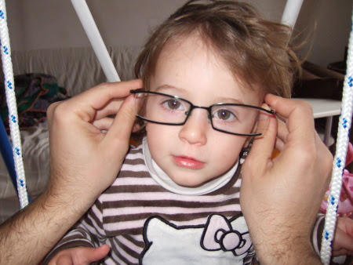
  
 

## Le fettuccine al pomodoro!
*07-02-2008*

 
  
   Sono proprio le mie preferite...e le mangio "da sola"... e si vede! :)
  
  
   
  
 

## Che bel sole!
*11-02-2008*

 
  
   Dopo una settimana di malattia finalmente esce il sole e ne approfitto! Sabato un buon pranzo in terrazza con relax...
  
  
   
  
  
   e mandarini (ho proprio una faccia buffa quando li mangio!)
  
  
   ...
  
  
   
  
  
   ..e gli zii che dipingevano il fasciatoio per Caterina mentre io ero attratta dal barattolo del colore...
  
  
   
  
  
   e domenica picnic al mare ai cancelli, era talmente bello che sono stata a piedini nudi tutto il tempo
  
  
   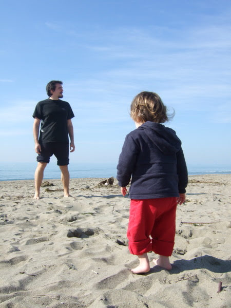
  
  
   poi ci hanno raggiunti anche Mara e Lorenzo e abbiamo giocato tanto insieme!
  
  
   
  
  
  
   
  
 

## Pomeriggio al mare
*21-02-2008*

 
  
   Oggi ho avuto a pranzo le mie amiche Sophie e Nicole. 
Ogni tanto sono un pò maldestra, infatti ho dato una pigna in testa a Sophie poverina!Fortuna che lei è buona, mica come me!
Nel pomeriggio siamo andate al porto di ostia insieme e abbiamo giocato sulla spiaggia con i sassolni
  
  
   
  
  
   e poi ci siamo divertite a fare il cavalluccio sulle spalle di nicole
  
  
   
  
  
   dei papà, e delle mamme! :)
  
  
   
  
 

## Gli animali
*21-02-2008*

 
  
   Mi piace imitare gli animali! La ranocchia
  
  
   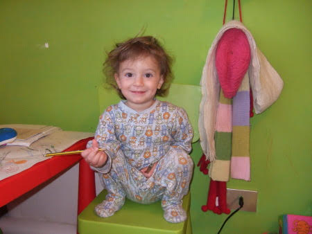
  
  
   e la farfallina
  
  
   
  
 

## La fattoria
*04-03-2008*

 
  
   Domenica sono stata alla fattoria di Silvana (per gli amici Fracassa)
  
  
   ! Che bello ho visto le mucche e ho anche provato ad accarezzargli il musone, ho portato da magiare ai coniglietti, una bietina appena raccolta con le mie manine, poi con Silvana sono entrata nel pollaio e ho raccolto un ovetto appena fatto.Le galline sono scappate tutte e io ho detto 'aiuto'! Ma non avevo paura!Ho portato l'ovetto a Raffaella, la mamma di Silvana
  
  
   
  
  
   che me l'ha cotto e l'ho mangiato con il pane fatto in casa da lei!Che bontà!
  
  
   
  
  
   Dopo pranzo siamo andati a fare una passeggiata al ruscello con Alessandro e il suo cagnone Barrichello. E' 'grosso grosso' e gli ho tirato tanti sassi che lui prendeva al volo!
   
  
  
   Alla fine esausta sono crollata in braccio a papà, però che giornata emozionante! :)
  
 

## I 'boccoletti'
*08-03-2008*

 
  
   Nonno Gianni sarà felice di sapere che vado matta per i suoi broccoletti e per i cavolfiori di nonno Mario!
Un pò d'acqua con il mio bellissimo biberon con le 'papeelle' ....
  
  
   
  
  
   ...e poi un morso al 'fiore' del broccoletto!
  
  
   
  
  
   Dovete allargare gli orti nonni! :)
  
 

## 1 anno e mezzo!
*08-03-2008*

 
  
   Oggi finalmente compio 18 mesi! Ormai sono proprio grande!
  
  
   
  
 

## L'Appia Antica
*12-03-2008*

 
  
   Oggi ho approfittato del bel sole e sono andata a fare due passi sull'Appia Antica! Certo sti romani la sapevano lunga....e amavano i 's. pietrini' ...le strade fatte da blocchetti di pietra incastrati perfettamente....
  
  
   
  
  
   Ho osservato molto attentamente la strada per non perdermi :)
  
  
   
  
  
   ma per fortuna avevo 4 nonni che mi guidavano, un pò sulla bici, un pò a cavalluccio un pò a piedi ...
  
  
   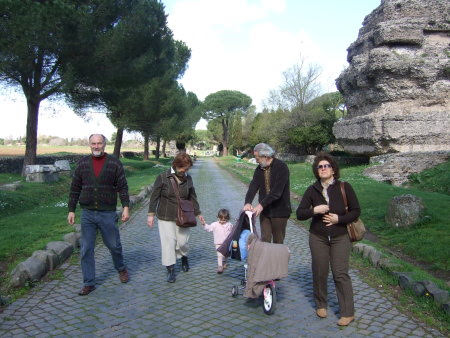
  
  
   Ho visto il cavallo ('monello' perchè non voleva avvicinarsi)
  
  
   e le pecorelle.
  
 

## sabbia e kite
*16-03-2008*

 
  
   Oggi sono stata al mare con i nonni
  
  
   
  
  
   Si stava benissimo. Con nonno Gianni ho fatto le buche nella sabbia e poi ci ho infilato i piedini
  
  
   
  
  
   e con nonna Lilli ho guardato i kite
  
  
   
  
 

## Poi arrivò il mattino ...
*17-03-2008*

 
  
   e col mattino un angelo
e quell'angelo eri tu.
Con due spalle da uccellino 
in un vestito troppo piccolo,
e con gli occhi ancora blu...
  
  
   Benvenuta Caterina, sei arrivata di pomeriggio, ma per il resto combacia tutto.
  
  
   Zio Andrea, zia Carlotta e la tua cuginetta Matilde
  
  
   
  
 

## Caterina a casa
*19-03-2008*

 
  
   Stasera è arrivata a casa Caterina, benvenuta cuginetta! Lei e zia Betta stanno benissimo.
Le ho dato tanti bacini sulla testolina....come è piccola...ma quanti capelli profumati che ha, e come se le ciuccia quelle manine!
  
  
   
  
  
   Per la gioia di zio Daniele sei arrivata proprio in tempo per il derby e la festa del papà! :)
  
  
   
  
 

## Poppiti papà ...
*26-03-2008*

 
  
   ... che voglio il cocciolato ...
Va bene mi sposto e scusa.
  
 

## Pasqua in Liguria
*29-03-2008*

 
  
   Abbiamo passato la Pasqua con zia Giorgia, nonno Gianni e nonna Lilli in liguria.
M che è un catorcio si è ammalata ma io sono stata a fare tante passeggiate al mare e in mezzo ai boschi.
Ho portato anche chicca al guinzaglio
  
  
   
  
 

## Ricominciano i we a Sabaudia
*01-04-2008*

 
  
   Evviva! Finalmente si ritorna al mare!
Sabato sono stata a Sabaudia con le mie amiche Sophie e Nicole e con i fratellini Flavio, Valerio e il piccolo Federico.Dato che al mare tirava tanto vento siamo stati al lago a fare un pic-nic e a giocare sulle barche
  
  
   
  
  
   Poi abbiamo mangiato un gelato enorme!
  
  
   
  
  
   Io dormivo e me lo sono perso...ma ho recuperato col chupachups!Che buono :)
  
  
   
  
  
   Domenica invece era una bellissima giornata e siamo stati in spiaggia. Ho giocato tanto con le formine e la sabbia insieme a Melissa
  
  
   
  
  
   e poi ho scoperto una vera passione....i racchettoni! Guardate un pò che posa da tennista!
  
  
   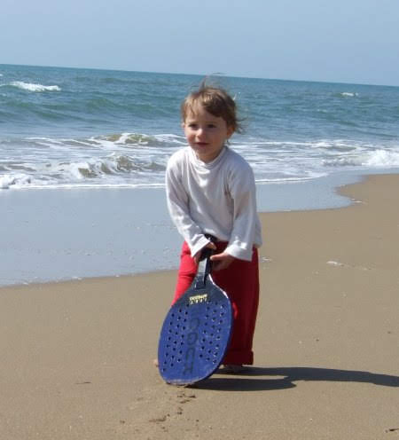
  
 

## Mamma mammina...
*02-04-2008*

 
  
   tanti auguri per il tuo compleanno!
  
  
   
  
 

## I miei 'balotti'
*05-04-2008*

 
  
   Oggi vi presento i miei bambolotti.
Stamattina li ho riuniti tutti insieme per cambiarli, visto che avevano fatto una 'cacca puzzulente'....
  
  
   
  
  
   il primo è Tori (me l'hanno regalato TOnio e RIta)
  
  
   , è morbidissimo e mi fa compagnia nel lettino, il secondo è Balotto (me l'ha regalato zio Gianluca)
  
  
   , mi piace spogliarlo e mettergli il ciuccio, la terza è Camilla (me l'ha regalata zia Betta)
  
  
   , ha i capelli ricci e un bel vestitino!
Dopo ho anche preparato il pranzo, un piattino di plastica ed una posata per ognuno!
Sono proprio una brava mamma! :)
  
 

## Mare e feste
*08-04-2008*

 
  
   Questo sabato sono stata al mare con i nonni e Caterina, ma lei è stata sempre a mangiare o a dormire UFFI, invece io ho giocato con la sabbia e il secchiello pieno d'acqua (ci sono anche finita dentro!)
  
  
   :)
  
  
   
  
  
   Tirava un pò di vento ma si stava bene
  
  
   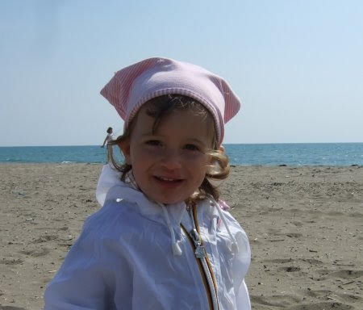
  
  
   Domenica invece sono stata ad Aprilia a casa di Pina, la gemellina della mia mamma (per l'occasione ho sfoggiato la mia nuova mise primaverile...ma poi faceva freddo e mi sono dovuta coprire meglio!)
  
  
   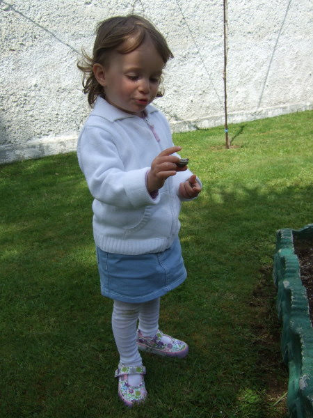
  
  
   C'è un bel prato dove ho giocato tanto insieme ad altri bimbi
  
  
   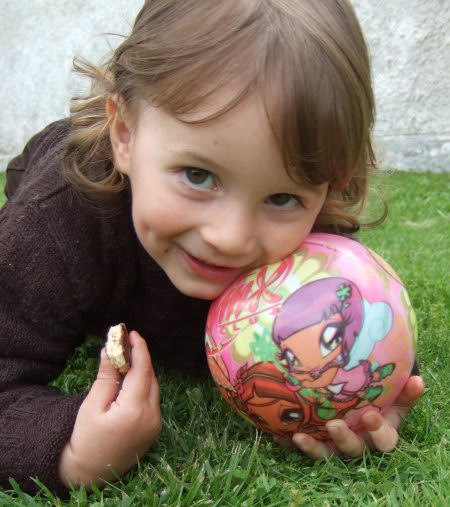
  
  
   ho mangiato le fragole con la panna...
  
  
   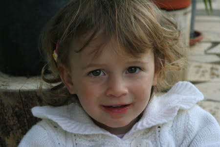
  
  
   e poi abbiamo anche spento le candeline su una bellissima torta di cocciolato!
  
  
   
  
  
   Alla fine esausta dalla giornata di giochi sono crollata in braccio al mio papà
  
  
   
  
 

## Orgoglio maschile ...
*09-04-2008*

 
  
   
  
  
  
   <strong>
    LE MIE DONNE !!!
   </strong>
  
 

## Un regalo davvero speciale
*09-04-2008*

 
  
   Oggi ho ricevuto un regalo unico, di quelli fatti con le mani e con la fantasia, quelli che nessuno può comprare ma si ricevono da chi ti vuole bene. Questo regalo mi accompagnerà la notte quando sogno...
   <a href="{{baseurl}}/uploads/2008/04/mat.mp3">
    ninnananna.mp3
   </a>
  
  
   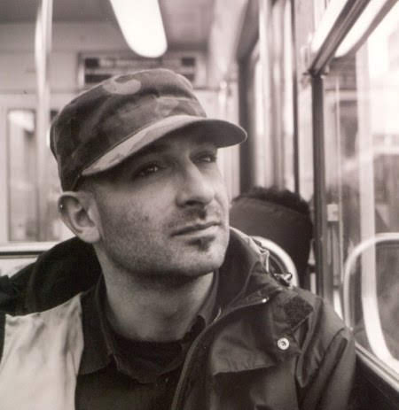
  
  
   Grazie Morris... davvero.
  
 

## ... ridono volentieri
*11-04-2008*

 
  
   "Secondo te, tutti i libri per bambini dovrebbero essere divertenti?" chiese la maestra. "Certo. I bambini non sono seri come gli adulti, e ridono volentieri"
  
  
   
  
 

## Ostia Antica
*14-04-2008*

 
  
   Oggi sono stata alla visita teatrale agli scavi archeologici di Ostia Antica.
  
  
   
  
  
  
   Un attore/guida ti porta in giro per gli scavi, te li spiega e poi ti legge alcuni brani di autori antichi e non... da Ovidio alla Yourcenar... io non so' chi siano, ma P m'ha detto che lo scoprirò
  
  
   
  
  
 

## Al ristorante cinese
*17-04-2008*

 
  
   Già è difficile usare il coltello e la forchetta... figuriamoci le bacchette!

  
  
  
   Però il mio nome è bello anche in cinese. 

  
  
 

## Lavo i piatti
*22-04-2008*

 
  
   P mi ha insegnato a lavare i piatti:
1)
  
  
   si insaponano
  
  
   
  
  
  
   2)
  
  
   si sciacquano
  
  
   
  
  
 

## Aerei e prati
*30-04-2008*

 
  
   Questo we di fine aprile siamo stati con Ronzinante (il camper)
  
  
   a fare una gita dalle parti del lago Trasimeno. Prima abbiamo visitato un piccolo paesino, Poiano

  
  
  
   che tra l'altro ha un parco giochi molto divertente!
  
  
   
  
  
  
   poi siamo arrivati all'ereoporto di Castiglione del Lago dove c'era una manifestazione di aerei. Ce ne erano tantissimi e di tutti i tipi

  
  
  
   ma a me interessava anche il bellissimo prato dove ho giocato a palla con Laura e altri bimbi (litigando con M perchè non volevo tenermi in testa il cappellino)
  
  
   
  
  
  
   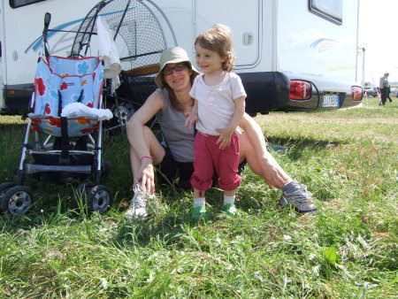
  
  
  
   Nel pomeriggio poi ha diluviato e sono rimasta in camper a giocare con Pedro (gli ho anche dato un bacino sulla testa e lui mi allungava dolcemente la zampa!)
  
  
   
  
  
  
   Il giorno dopo tirava un forte vento e mi sono rifugiata nell'elicottero dei militari: ho toccato tutti i pulsanti e la cloche!

  
  
  
   Domenica invece ho fatto una scappata in campagna dai nonni

  
  
 

## Cose di casa
*05-05-2008*

 
  
   Oggi vi faccio vedere alcune foto della mia vita quotidiana....
quando faccio il bagnetto P mi fa il ciuffo impazzito insaponato
  
  
   
  
  
  
   poi ogni tanto quando mi sveglio la mattina presto mi coccolo nel lettone... e mi ritrovo sempre a dividere il letto con P (che penniche e che russate che ci facciamo insieme)
  
  
   
  
  
  
   quando vado da zia Betta dò il latte a Caterina, cercando sempre di sbaciucchiarla
  
  
   
  
  
  
   e dulcis in fundo....adoro il gelato biscotto!
  
  
   
  
  
 

## Fave e pecorino
*06-05-2008*

 
  
   Domenica sono stata in campagna da nonno Mario a mangiare le fave e i piselli appena raccolti! Che magnata!
  
  
   
  
  
  
   Poi ho passeggiato tra le verdure con la bionna Maria e abbiamo raccolto i papaveri
  
  
   
  
  
  
   e ho giocato tanto con la mia bis-cugina Chiara che è molto simpatica
  
  
   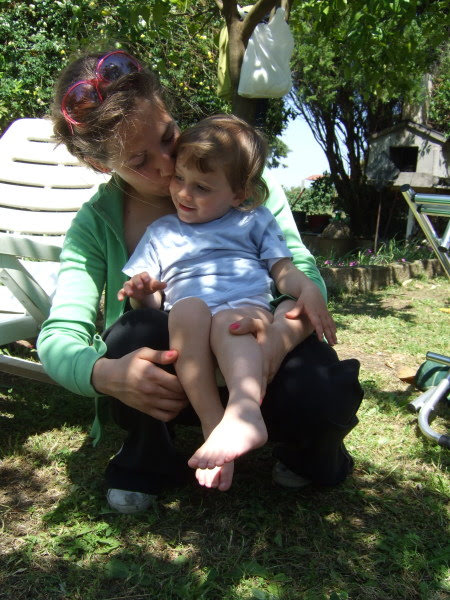
  
  
  
   
  
  
 

## MeP si sposano 
*10-05-2008*

 
  
   Ecco uno dei miei segreti... MeP si sposeranno in Sicilia il 31 Maggio.
Per l'occasione sarò la damigella d'onore e porterò le fedi! WOW che compito importante!Non vedo l'ora di partire!
  
  
   
  
  
  
   Stay tuned :)
  
 

## Angelo e Paola 
*16-05-2008*

 
  
   Oggi si sono sposati Angelo e Paola. Erano proprio belli e felici! Tanti auguri!!
  
  
   
  
  
  
   Io e M ci siamo vestite eleganti e siamo andate a vederli e a tirargli il riso!
  
  
   
  
  
  
   C'erano anche gli zii e Caterina!
  
  
   
  
  
 

## Fascetta
*18-05-2008*

 
  
   Sono carina con la fascetta? Peccato che non me la so tenere!
  
  
   
  
  
 

## Lo streptococco
*24-05-2008*

 
  
   Mi sono presa questo batterio  :( che mi ha fatto gonfiare una tonsilla come un palloncino, però ho oscultato il mio cuoricino ed era tutto OK!
  
  
   
  
  
  
   Ma adesso sto bene e sono pronta a partire per la Sicilia!
  
 

## Tanti augurissimi da tutti noi !!!!
*26-05-2008*

 
  
   
  
  
  
   
  
  
  
   Un bacione grande grande alla mia amichetta Matilde e tanti auguri ai suoi MeP anche dalla mia sorellina Sara !!! E ovviamente dai miei MeP. Baci Baci
Alessia
  
 

## Aspettando il matrimonio....
*28-05-2008*

 
  
   Abbiamo deciso con mamma e i nonni di scendere giù a catania per gli ultimi preparativi e come al solito la zia 'Maia' ci ospita nella sua bellissima casa
  
  
   
  
  
  
   poi viste le belle giornate siamo stati al mare a S. Maria la Scala, dove solo nonna Lilli ha fatto il bagno perchè l'acqua è gelata
  
  
   
  
  
   e al gelsomineto
  
  
   
  
  
   
  
  
   questo mare mi mette un sonno pazzesco....mi faccio certe ninne!
  
  
   
  
 

## 31 maggio 2008 - Rondè Lentini
*01-06-2008*

 
  
   Sono circa le 19, il sole basso e arancione crea un'atmosfera magica tra gli aranci ... gli amici prendono posto e finalmente arriva la sposa a braccetto del papà emozionatissimo....
  
  
   
  
  
   ... lo sposo tiene in braccio Matilde e sorride felice appena la vede....
  
  
   
  
  
   ... una bella musica di sottofondo e le parole del 'sindaco' Mara, toccanti e commosse...
  
  
   
  
  
   lo scambio degli anelli, il bacio e M&amp;P; sono marito e moglie!
  
  
   
  
  
   ...non so bene cosa vuol dire...ma sembrano felici!
  
  
   
  
  
   solo dopo M si è ricordata che aveva anche il bouquet :)
  
  
   
  
  
   Eccoci qui, tutta la famiglia al completo.....
  
  
   
  
  
   le 'fimmine' ...
  
  
   
  
  
   e i masculi
  
  
   
  
  
   abbiamo brindato nell'aia
  
  
   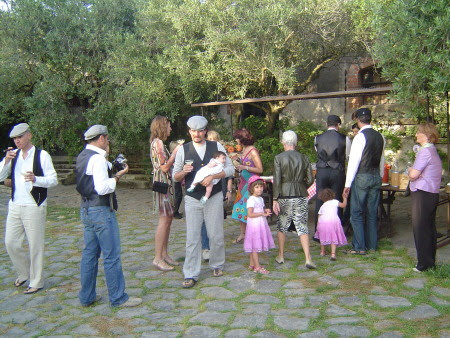
  
  
   suonato il 'marranzano'
  
  
   
  
  
   mangiato piatti tipici siciliani squisiti
  
  
   
  
  
   e tagliato la torta nuziale e la cassata
  
  
   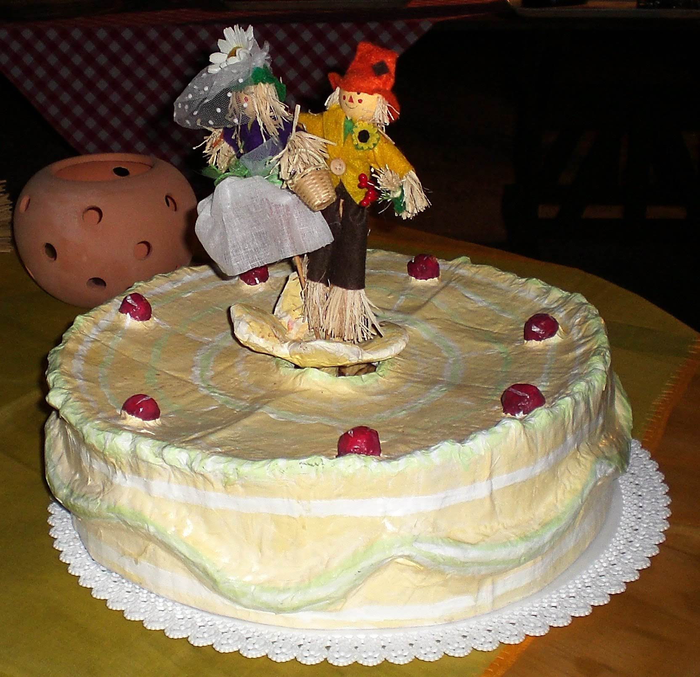
  
  
   
  
  
   poi siamo rimasti a chiaccherare fino a tardi seduti sulle balle di fieno
  
  
   
  
  
   e noi bimbe abbiamo anche disegnato
  
  
   
  
  
   insomma proprio una bella serata! Spero tanto di ricordare questo momento anche quando sarò grande! :)
  
 

## Viaggio di nozze con M&P
*10-06-2008*

 
  
   Dopo questo divertente matrimonio siamo partiti per il viaggio di nozze con ronzinante (il 'campere' come lo chiamo io!)
  
  
   . Da brava turista non mi mancava niente, cappellino, occhiali da sole e macchina fotografica
  
  
   
  
  
   La sicilia è davvero ricca di storia e ha un mare bellissimo!
Mi sono acculturata ad Agrigento nella valle dei templi, dove P mi ha raccontato la storia della Magna Grecia e io ho camminato a piedi nudi tra i ruderi e ho anche assistito ad una parata dei carabinieri ('che buffi')
  
  
   
  
  
   ho visitato Ragusa Ibla e il suo barocco
  
  
   
  
  
   poi ho giocato tanto sulla spiaggia di S. Vito lo Capo
  
  
   
  
  
   ho visitato il duomo di Monreale dove c'era un mosaico tutto fatto di 'tessirine' d'oro che rappresentava la 'cabetta' di Noè con tutti gli animali
  
  
   
  
  
   Siamo stati ad Erice che, quasi in un'atmosfera surreale, era avvolta dalla nebbia
  
  
   
  
  
   e poi a Selinunte e a Segesta
  
  
   
  
  
   e infine a Palermo da dove abbiamo ripreso la nave per tornare a casa
  
 

## Chi è Dio?
*12-06-2008*

 
  
   Nel duomo di Monreale abbiamo iniziato a parlare con Tilla di Dio. Alla mia domanda "allora chi è Dio?", la risposta  è stata meravigliosa e commovente "mamma"... e poi dicono che i bambini sono ingenui. Sfido chiunque a darmi una migliore definizione.
  
 

## M ha mangiato troppo oppure....
*12-06-2008*

 
  
   E' vero che la cucina siciliana è irresistibile e M non si è contenuta durante queste vacanze, ma non sembra anche a voi che le sia cresciuta un pò troppo la pancia? :)
  
  
   Lei dice che dentro c'è la mia sorellina e che nascerà a settembre....ma finchè non la vedo non ci credo! 
Che 2008 pieno di novità amici!
  
  
   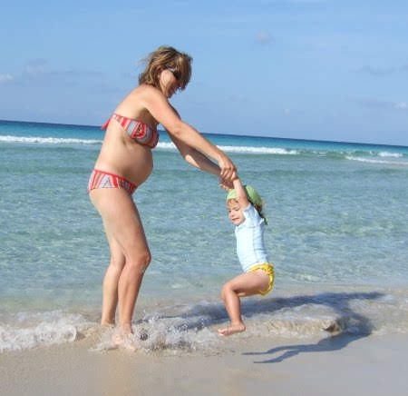
  
 

## Per P
*19-06-2008*

 
  
   ciao papone,
questo post lo dedico a te e a tutto il bene che ti voglio!
Sono un pò avara di baci, è vero, ma quanto mi piace coccolarmi con te!
  
  
   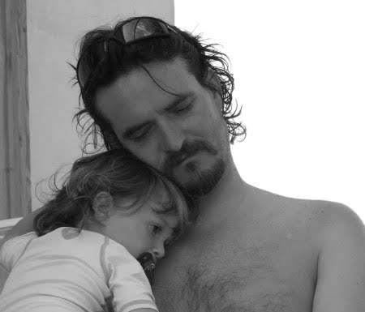
  
 

## We nelle marche
*24-06-2008*

 
  
   Questo we sono stata a trovare la bionna Maria nelle marche e mi sono portata anche la bionna Maria di Roma.
  
  
   
  
  
   sono stata sul monte Cucco
  
  
   
  
  
   dove ho fatto una bella passeggiata nella faggeta e ho visto le mucche (e anche le loro cacche...sono enormi!!)
  
  
   
  
  
   e ho mangiato il coniglio in porchetta che ha fatto nonna Franca...SLURP! :)
  
  
   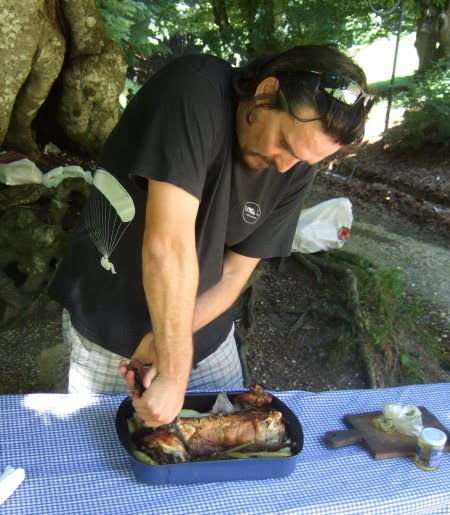
  
  
   Ho giocato con il rastrello, con la tenda canadese, ho visto gli animali di zia Iole nella stalla e poi ho aiutato nonno Mario a lavare la macchina! troppo divertente!
  
 

## Nicole e Sophie sono felici di....
*06-07-2008*

 
  
   
  
  
   
  
  
   annunciare il matrimonio di mamma e papà!!!
  
  
   Nathalie era bellissima, P ha detto che era elegante e soave come una vestale! (poi mi faccio spiegare cosa vuol dire)
  
  
   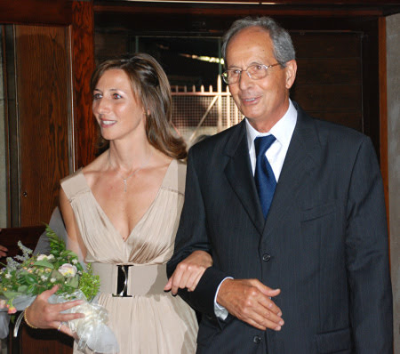
  
  
   e lo sposo era raggiante! Sophie invece era assonnata!
  
  
   
  
  
   Nel parco della 'Ziaccia' siamo arrivati insieme a Mara e Lory
  
  
   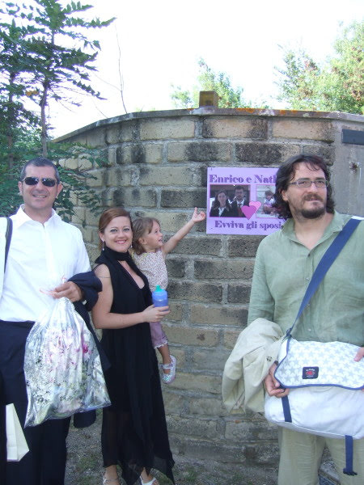
  
  
   e noi bimbi abbiamo giocato tantissimo perchè avevamo ben 3 animatrici tutte per noi, e a me hanno regalato un gatto
  
  
   
  
 

## Piccole principesse crescono
*08-07-2008*

 
  
   M dice che sembro una principessina con questo vestito....però c'è un particolare che indica la mia vera indole da zingarella, il rastrello!! :)
  
  
   
  
 

## In piscina
*08-07-2008*

 
  
   Questo we sono stata in piscina e ho imparato a fare tante cose:
i tuffi dal bordo della vasca
  
  
   
  
  
   a stare a galla, ma tenuta da M
  
  
   
  
  
   a battere i piedini e fare la schiuma
  
  
   
  
  
   
  
  
   poi sono venute anche zia Betta e Caterina
  
  
   
  
 

## Un regalo da Sonia
*09-07-2008*

 
  
   Sonia mi ha regalato questo bellissimo digital scrap! Sei bravissima,grazie! :)
  
  
   
  
 

## Vacanze estive: parte 1 - Liguria
*01-08-2008*

 
  
   Finalmente siamo in vacanza. M ha la panza e questo significa che posso stare in vacanza con lei per un bel pò di tempo!Così il 14 luglio sono partita per la liguria dove ho raggiunto i nonni Lilli e Gianni, zia Giorgia e la bionna Maria. Zia mi ha fatto trovare tanti regali...ma il più bello è stato rivederla dopo tanto tempo!
  
  
   
  
  
   con i nonni e M sono andata al mare...l'acqua era bellissima e la spiaggia era buffa...con tanti sassolini! Ho fatto tanti bagni con il salvagente
  
  
   
  
  
   poi sono anche andata a visitare genova
  
  
   
  
  
   e ho soffiato le candeline sulla torta di nonna Lilli ....auguri 'nonnetta'....
  
  
   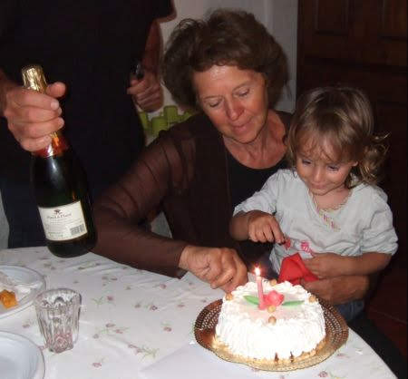
  
 

## Vacanze estive:parte 2 - trentino
*11-08-2008*

 
  
   Dopo un pò di mare ci voleva proprio la montagna . .
  
  
   
  
  
   e allora quale migliore occasione se non quella del matrimonio di Mara e Lorenzo per trascorrere una bellissima settimana nel verde dei boschi dell'altopiano di Pinè? 
Eravamo proprio un bel gruppone! E quante bimbe :)
  
  
   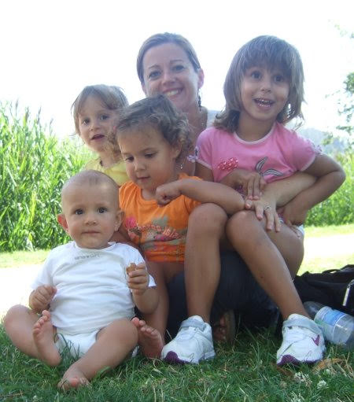
  
  
   Abbiamo fatto qualche passeggiata nei boschi, in riva ai laghetti e abbiamo visto tante mucche!
  
  
   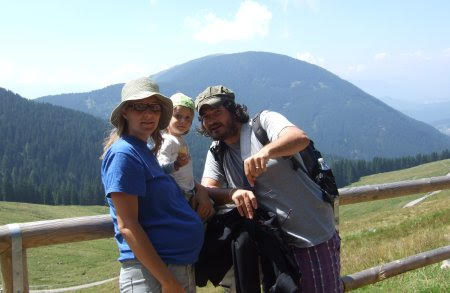
  
  
   
  
  
   ho scoperto che il paesaggio montano mi rilassa e mi incanata
  
  
   
  
  
   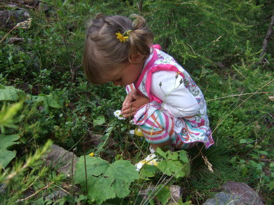
  
  
   Ho fatto anche una passeggiata nello zaino con papà....ma io ..ehmm...ho dormito!
  
  
   
  
  
   mi sono svegliata per bere in cima alla montagna!
  
  
   
  
  
   Poi è arrivato il giorno tanto atteso delle nozze in malga!
  
  
   
  
  
   ed eccoci qui a 2000 metri, immersi nel verde e con un sole splendente!La sposa è pronta, con bouquet e cappellino!
  
  
   
  
  
   e lo sposo e il sindaco la aspettano per la cerimonia nel bosco
  
  
   
  
  
   Bellissimi vero?
  
  
   
  
 

## Vacanze estive:parte 3 - liguria
*19-08-2008*

 
  
   Arieccomi al mare
  
  
   
  
  
   mentre M con la sua panzetta si gode la brezza di mare
  
  
   
  
  
   io faccio le mie prime nuotate da sola con i braccioli! Che bella sensazione!!So fare il morto a galla e so battere i piedini fino a fare la schiuma!
  
  
   
  
  
   Oltre a nuotare e giocare con i secchielli e i sassolini mi faccio coccolare da M
  
  
   
  
  
   e da P
  
  
   
  
  
   e mi piace osservare il mare quando ci sono i cavalloni
  
  
   
  
  
   Siamo anche andati alla sagra della lumaca e ho assaggiato il piatto tipico....strano!
  
  
   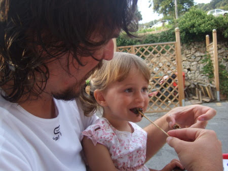
  
 

## Vacanze estive:parte 4 - marche
*05-09-2008*

 
  
   Non poteva mancare quest'estate una scappata dai nonni nelle Marche!
  
  
   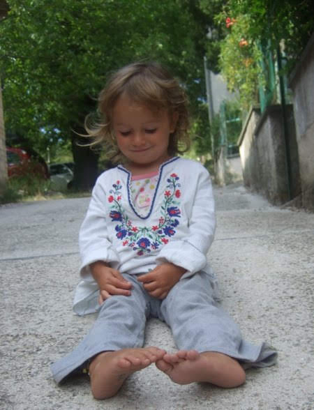
  
  
   Ho fatto le passeggiate nel bosco con nonno Mario e P
  
  
   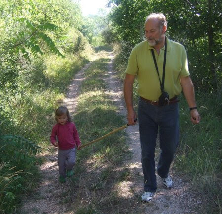
  
  
   ho mangiato le fettuccine al tartufo
  
  
   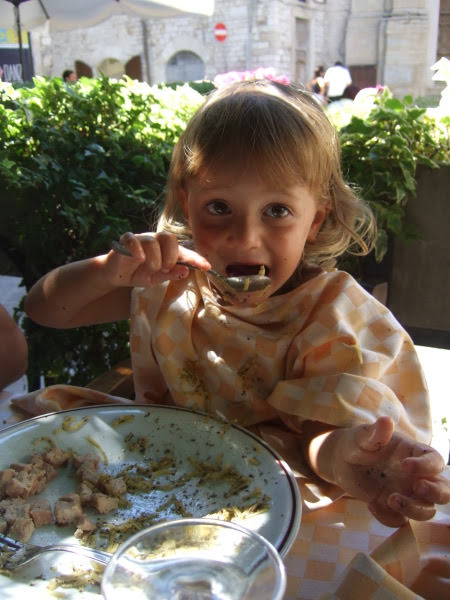
  
  
   e poi tantissimi giochi: lavoretti con la creta (richiedono molta concentrazione)
  
  
   
  
  
   collage
  
  
   
  
  
   collane e anelli con la pasta
  
  
   
  
  
   disegni, mentre il cagnetto delle mie cugine napoletane mi mangiava il braccio!!
  
  
   
  
  
   Poi è arrivata Caterina e sono stata sempre con lei
  
  
   
  
  
   
  
 

## La nostra famigliola vista da Nicole
*06-09-2008*

 
  
   
  
  
 

## Aspettando Margherita
*07-09-2008*

 
  
   Cari amici, in attesa che nasca la mia sorellina, P ha fatto il calco della pancia di M.

  
  
  
   ... Beh in effetti ieri mi hanno chiesto: "Chi e Margherita?", ed io ho risposto: " La pancia di mamma!"
P.S. Per chi fosse interessato a fare un calco del pancione
   <a href="http://www.babyart.eu">
    http://www.babyart.eu
   </a>
  
 

## Il mio secondo compleanno!!
*08-09-2008*

 
  
   
  
 

## Fiesta!
*09-09-2008*

 
  
   Sabato abbiamo festeggiato il mio compleanno e quello di Enea con tanti amici:abbiamo disegnato, incollato fiorellini, giocato con le bolle di sapone, gonfiato e scoppiato palloncini, raccolto le mele dall'albero.... le solite piccole canaglie!!
  
  
   
  
  
   e infine abbiamo mangiato la torta!
  
  
   
  
  
   è stata proprio una bella giornata!
  
 

## Incontro-scontro con Toporosa!
*10-09-2008*

 
  
   Ieri sera è venuta a trovarmi la mia gemellina Toporosa! Dopo qualche 'piccola' incomprensione siamo andate d'amore e d'accordo e abbiamo giocato insieme!
  
  
   
  
  
   E poi abbiamo anche spento le candeline della nostra torta di compleanno insieme!
  
 

## Auguri Caterina
*17-09-2008*

 
  
   Oggi la mia cuginetta compie mezzo anno! E guardate come ce ne andiamo già in giro in moto da sole!! :)
  
  
   
  
  
   (vi ricorda qualcosa la foto?
   <a href="http://pilde.net/blog/?p=217">
    guardate qui
   </a>
  
  
   )
  
 

## A chi somiglia? 
*18-09-2008*

 
  
   
  
  
   ](http://www.myheritage.com/meter)
  
  
   <a href="http://www.myheritage.com">
    MyHeritage
   </a>
  
  
   :
   <a href="http://www.myheritage.com/meter">
    Look-alike Meter
   </a>
  
  <ul>
   <li>
    
     <a href="http://www.myheritage.com/page/geneology">
      Geneology
     </a>
    
   </li>
   <li>
    
     <a href="http://www.myheritage.com/page/family-website">
      Family website
     </a>
    
   </li>
  </ul>
 

## Matilde e Margherita
*24-09-2008*

 
  
   Da oggi il blog è di Matilde e Margherita ... siamo sorelle ;-)
  
  
   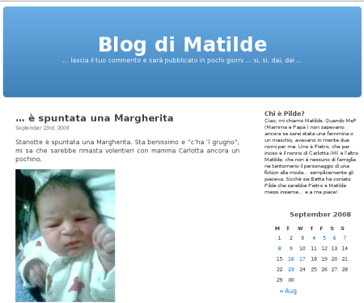
  
  
 

## ... è spuntata una Margherita
*24-09-2008*

 
  
   Stanotte è spuntata una Margherita. Sta benissimo e "c'ha 'l grugno", mi sa che sarebbe rimasta volentieri con mamma Carlotta ancora un pochino.
  
  
   
  
  
  
   ... nei miei "barlumi di coscienza" realizzo e sono felice, invece Matilde ci sta ancora pensando su ... "ma chi sarà 'sta Margherita" ... MUMBLE MUMBLE
  
 

## Buongiorno Margherita, buongiorno Margherita... 
*25-09-2008*

 
  
   Stamattina mi sono svegliata di ottimo umore, anche se stanotte ho avuto un incubo ... Boh, non ho ben capito cosa m'è successo. Comunque appena sveglia ho cantato con P:
   <em>
    "Buongirno Margherita, buongiorno Margherita, buongiorno Margherita ... buongiorno!"
   </em>
   ... beh a dire il vero il nome di mia sorella non è proprio semplicissimo, mi viene tipo Gamberita.
  
  
   
  
  
  
   ... forse domani tornano a casa, non vediamo l'ora.
  
  
   
  
  
 

## Margherita è a casa
*26-09-2008*

 
  
   Oggi sono tornate a casa mamma e Margherita! Ho aiutato P a portarla dentro..mi ha regalato una bellissima renna a dondolo....però guardando Margherita ho chiesto a P "quella cos'è?"
  
  
   
  

  
   L'ho presa in braccio...ha dei piedini minuscoli
  
  
   
  

  
   Ci siamo sedute con Caterina e Margherita sul mio letto...Margherita secondo me avrà pensato "ma chi sono ste due?"
  
  
   
  

 

## Prima uscita delle sorelline
*29-09-2008*

 
  
   Come nella migliore delle tradizioni della nostra piccola famiglia oggi siamo andati a fare colazione al bar e poi una bella passeggiata al porto di Ostia.
  
  
   
  

  
   Io ho corso e ho giocato con i sassolini, mentre Margherita dormiva beata
  
  
   
  

 

## Sono la margherita... di zia Betta
*30-09-2008*

 
  
   
  
  
  
   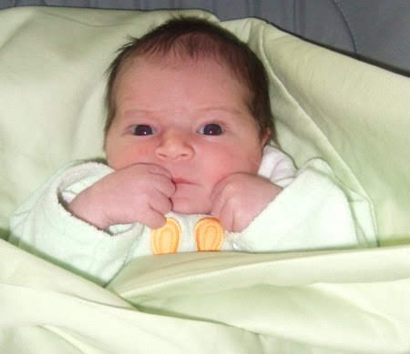
  

 

## ... è un pesciolino nel mare ...
*30-09-2008*

 
  
   
  
  
  
   Ciao Valter.
  
 

## Pitturando come Matisse ...
*05-10-2008*

 
  
   Beh! ...era ormai tempo di completare il regalo per la Barsotti's family (o sarebbe meglio dire la famille Barsotti con l'accento sulla i)
  
  
   e dunque stamattina ho aiutato quel pigrone di papà.
  
  
   
  
  
  
   Mi sono sentita molto matisse ... il gattino degli aristogatti !!!
  
  
   
  
  
 

## Puzzolenti conquiste
*06-10-2008*

 
  
   Sono una bimbetta piuttosto sveglia, ma su almeno tre cose sono una pigrona:
  
  <table border="0" style="height: 163px;" width="450">
   <tbody>
    <tr>
     <td>
      * I colori, per me il mondo è giallo .

  * I numeri... a dire il vero conto benino, ma il **7** proprio non mi va giù, per me si conta 1,2,3,4,5,6,8,9,10 ... e infine

  * ho una certa difficolta ad usare il vasino, sapete i pannolini sono comodi...
     </td>
     <td>
      
     </td>
     
     
    </tr>
   </tbody>
  </table>
  ma da stamattina qualcosa è cambiato, indovinate cosa?
 

## Ciao Pupo
*06-10-2008*

 
  
   Che bellissima giornata a Norma! Sono venuti tanti amici da tutta italia a far volare i loro parapendio in ricordo di una persona speciale! Hanno aspettato pazienti che ci fossero le condizioni giuste
  
  
   
  

  
   e poi sono volati tutti via! Che spettacolo il cielo così colorato
  
  
   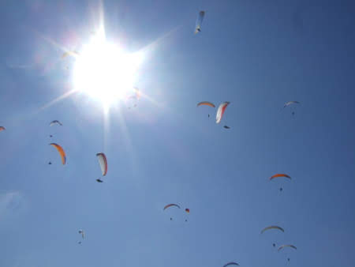
  

  
   ... ma alla fine della giornata le vincitrici siamo state noi :)
  
  
   
  

  
   Arriveduar
  
  
   
  

 

## Primo bagnetto ... e pure insieme!
*12-10-2008*

 
  
   Cari amici, oggi una giornata speciale. Finalemnte è caduto l'utlimo pezzetto di cordone ombelicale di Margherita e abbiamo deciso di farci il bagnetto insieme.
  
  
   
  
  
  
   Eravamo proprio tutti, M teneva Margherita, io giocavo e P ci fotografava.... ma non notate niente?
  
  
   P c'ha i calzini bucati! ... che tipo.
  
 

## Ultimo(?)

bagno al mare
*13-10-2008*

 
  
   Wow che bagnetto speciale che ho fatto a Sabaudia sabato! Io e P e pochi altri...ma l'acqua era caldissima!
  
  
   
  

  
   M e Margherita invece ci guardavano....non sono per niente temerarie!
  
  
   
  

  
   esauste per la giornata di mare io e Margherita ci siamo sdraiate e io le ho fatto le coccole!
  
  
   
  

  
   Poi quel romanticone di P ci ha portate tutte e 3 a vedere il tramonto sul mare! Evviva Ronzinante!
  
  
   
  

 

## Lucia e i carrelli!
*14-10-2008*

 
  
   Ho scoperto che anche Lucia ha la mia stessa passione per carrelli e passeggini!! Ciao amichetta alla prossima!
  
  
   
  

 

## Casa mia ... ore 20:53
*16-10-2008*

 
  
   
  
  
  
   ... e abbiamo tirato fino a tardi :-D
  
 

## Primo complemese
*24-10-2008*

 
  
   Oggi è il primo complemese di Margherita!E lei si sta chiedendo chi è questo capellone che la sbaciucchia!
  

  
   Ma è P!! Ti ci devi abituare ad essere strapazzata da lui, te lo dice la tua sorellina!! :)
  
 

## Explora
*29-10-2008*

 
  
   
  

  
   Oggi sono stata con Caterina e Sofia al museo Explora...è bellissimo, pieno di giochi e divertimenti. A Caterina è piaciuto... e tanto per cambiare rideva ....
  
  
   
  

  
   e Sofia ed io abbiamo partecipato all'installazione di Bruno Munari, dove c'erano delle scatole misteriose, dei libri strani, la foresta di libri...
  
  
   
  

  
   le tane degli animaletti da provare.... (P era un pò grosso ma è entrato in tutte insieme a me!)
  
  
   
  

  
   la più bella e comoda era quella rossa...moolto chic!!
  
  
   
  

  
   e le mattonelle 'buffe' per creare tanti disegni ... non so se sono piaciute più a Sofia o alla sua mamma appassionata di scrap!! :)
  
  
   
  
  
   "C'è sempre qualche vecchia signora che affronta i bambini facendo delle smorfie da far paura e dicendo delle stupidaggini con un linguaggio informale pieno di ciccì e di coccò e di piciupaciù. Di solito i bambini guardano con molta severità queste persone che sono invecchiate invano; non capiscono cosa vogliono e tornano ai loro giochi, giochi semplici e molto seri"     (Bruno Munari, Fantasia, 1977)
  
 

## Due buone forchette!
*07-11-2008*

 
  
   Col molazza (all'anagrafe Flavietto)
  
  
   ci siamo sbafati un piattone di pasta con le vongole...e con che gusto!!
  
  
   
  

 

## La fattoria
*09-11-2008*

 
  
   C'è un posto molto carino vicino casa nostra, una fattoria immersa nel verde con tantissimi animali. Abbiamo visto i cavalli e mi hanno detto che ancora sono piccola per montarci sopra, devo aspettare di avere 4 anni, ma volendo posso salire sul pony che è un cavallo piccolino. Poi ho fatto una passeggiata tra le verdure infangando per bene i miei stivaletti
  
  
   
  
  
   sono andata sul trattore
  
  
   
  

  
   e Margherita sull'altalena con P
  
  
   
  

  
   
  
 

## Mare a novembre!
*10-11-2008*

 
  
   Sempre più incredibile questo tempo....oggi siamo al mare ai cancelli...è vero non ho fatto il bagno...ma mi sono divertita con Sophie!
  
  
   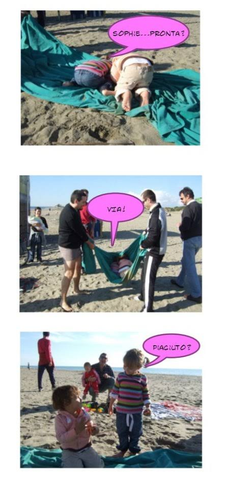
  

 

## Paciocchi
*18-11-2008*

 
  
   La mia sorellina è soprannominata Paciocchi perchè è una bella cicciona.....ma è bellissima, non trovate?
  
  
   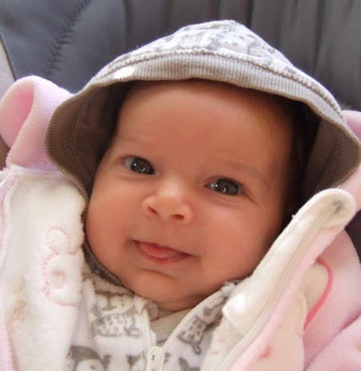
  

 

## Hobbies
*03-12-2008*

 
  
   Da quando sono piccola mi piace usare le mani per fare tanti lavoretti, dalle pizze
  
  
   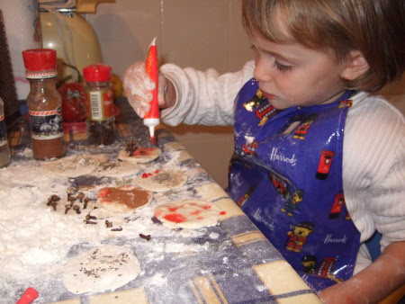
  
  
   al carteggio
  
  
   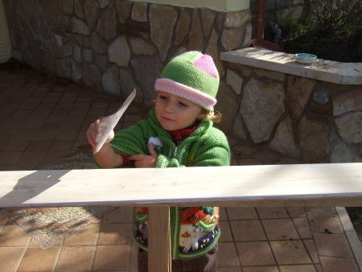
  

  
   mentre a Margherita piace dormire e ridere
  
  
   
  

 

## E' nato Matteo!
*05-12-2008*

 
  
   
  

  
   L'ultimo nato tra i miei nuovi amici è il piccolo Matteo! Presto andrò a conoscerlo nella bella terra di sicilia! Tanti auguri a mamma Anna Gloria e papà Nicola
  
 

## La neve immacolata
*10-12-2008*

 
  
   Per questo freddo ponte dell'8 dicembre siamo stati a Ovindoli! Come l'anno scorso ho passato molto tempo ad assaporare la neve....mi piace proprio mangiare quelle belle pallette soffici e gelate!
  
  
   
  

  
   Sulla neve si possono fare tante cose: i pupazzi
  
  
   
  
  
   si può prendere il sole (per i più pigri :)
  
  
   )
  
  
   
  

  
   si può andare a scivolare con lo slittino! Mi sono proprio divertita con Sofia
  
  
   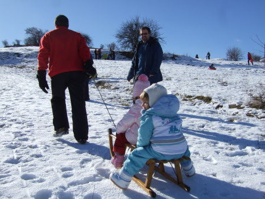
  

  
   e poi quando fa buio e freddo si sta a casa, si accende il camino e si gioca: con i timbri di Sonia
  
  
   
  

  
   si fa scuola di cucina ( abbiamo peparato la frittata e poi ce la siamo anche mangiata, era buonissima)
  
  
   
  

  
   si strapazza la cuginetta Caterina
  
  
   
  
  
   Mentre passeggiavo con zio Daniele sono iniziate a scendere tante 'briciole', ma lui mi ha spiegato che erano fiocchi di neve!
  
  
   Insomma questa neve mi piace proprio! :)
  
  
   
  

  
   
  
 

## La mia prima recita
*20-12-2008*

 
  
   In una bella confusione di canti delle maestre e urla dei bimbi più piccoli la mia capoccetta rossa con le trecce dondolava a ritmo di jingle bells!
  
  
   
  

 

## Navona, Campo dei Fiori e zia Giorgia
*22-12-2008*

 
  
   
  
  
   Siamo ormai alle porte del Natale e la passeggiata a Piazza Navona è di rito, poi se è insieme a zia Giorgia è tutto più bello! :)
  
  
   
  

  
   
  
  
   Mi ha incuriosito un signore che mangiava una spada
  
  
   
  
  
   E non poteva mancare anche la pizza bianca di Campo dei Fiori
  
  
   
  

  
   C'erano anche i nonni con Margherita
  
  
   
  

  
   e Atzuko
  
  
   
  
 

## Un papà bello e forte....
*24-12-2008*

 
  
   .... ha i suoi vantaggi
  
  
   
  

 

## Buon Natale e felice anno nuovo a tutti 
*25-12-2008*

 
  
   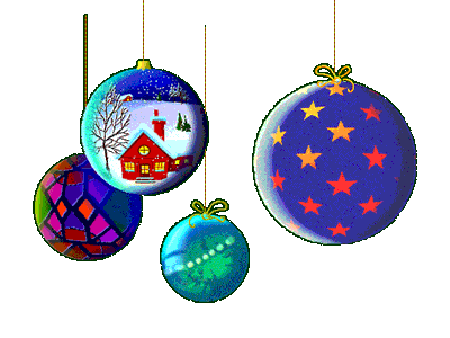
  

 

## Natale
*26-12-2008*

 
  
   
  

  
   Stasera a casa dei nonni è passato Babbo Natale e ha portato a Caterina e a me un pallone pieno di regali
  
  
   
  

  
   nel mio c'era il cellulare, l'orologio e le ciabatte di winnie!
  
  
   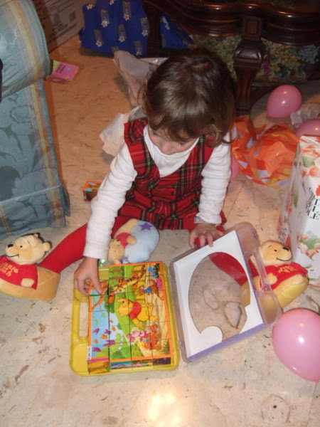
  

  
   Anche Marghe ha ricevuto tanti regalini, ma le piaceva il mio cellulare!
  
  
   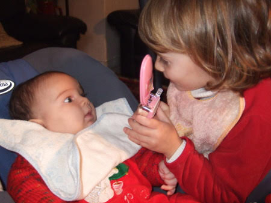
  

  
   Il pranzo di Natale l'abbiamo passato in compagnia di Atzuko e zio Alessandro
  
  
   
  

 

