# 2009

## Vacanze a casa
*04-01-2009*

 
  
  
   Queste vacanze di Natale purtroppo sono state un pò sfortunate....Margherita si è presa la bronchite poverina , papà l'influenza, io la febbre e mamma l'ascesso! Insomma speriamo solo che il nuovo anno sia un pò più ricco di salute! :)
  
  
   Però a casa ho fatto tanti lavoretti con papà..abbiamo ritagliato il cartone e fatto le maschere, abbiamo cucinato, fatto la carta pesta
  
  
   
  
  
   
   
  
  
  
   abbiamo suonato il piano
  
   
   
  
  
  
   e ci siamo coccolate con Marghe
  
   
   
  
  
  
   e ogni tanto lei ci guardava ciucciandosi le manine!
   
  
 

## La befana vien di notte....
*07-01-2009*

 
  
   ...è proprio vero! Sofia ed io ci stavamo preparando una bella cenetta, sugo di pomodoro,
  
   
   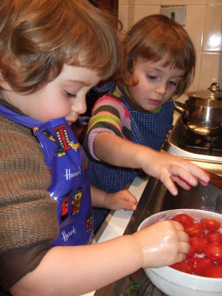
  
  
  
   quando abbiamo sentito un rumore provenire dal caminetto....allora siamo salite su e abbiamo trovato due calze appese e un grosso regalo....era passata la befana!!
  
   
   
  
  
  
   nelle calze c'erano un pò di dolcetti, e niente carbone, mentre il regalo erano i 'chiodini'![
   
  
  
 

## In arrivo...
*17-01-2009*

 
  
   una cicogna rosa per Mara e Lorenzo! Evviva!! una nuova amichetta! :)
  
   
   
  
  
 

## Dopo tanta pioggia...
*18-01-2009*

 
  
   ecco una giornata quasi primaverile, e ne approfitto per fare una bella passeggiata al lago con le mie amichette! Dopo affamate ci siamo sedute con i piedi sotto il tavolino e un bel sole caldo sulla schiena....
  
   
   
  
  
  
   e abbiamo mangiato...chi più e chi meno...
  
   
   
  
  
  
   e poi abbiamo fatto un pò di ginnastica con il maestro Enrico e la sua assistente Nicole!
  
   
   
  
  

## Ciao nonni :)
*19-01-2009*

 
  
   Màrghere non piangere che i nonni tornano presto....sono andati in India...dai che la prossima volta ci andiamo anche noi!
  
   
   
  
  
 

## Coccole e morsi
*19-01-2009*

 
  
   Paciocchi è una coccolona e le piacciono i baci di mamma
  
   
   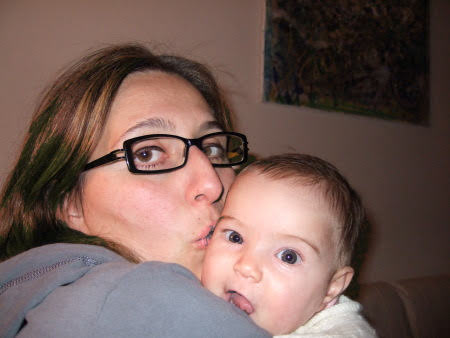
  
  
  
   ma poi ogni tanto quando ha fame se la mangia!
  
   
   
  
  
 

## La prima risata
*27-01-2009*

 
  
   Oggi Màrghere ha fatto la sua prima vera risata sonora....che carina!
  
  
   
  
   
   
  
  
  
 

## E' iniziato il carnevale
*02-02-2009*

 
  
   Stavamo facendo una bella passeggata al mare....bhè la novità è che Caterina inizia a fare i primi passi :)
  
  
   ...
  
   
   
  
  
  
   quando abbiamo visto tanti bambini vestiti in maschera! Ho tirato tanti coriandoli
  
   
   
  
  
  
   e poi frugando tra i miei giochi a casa ho trovato un bel vestitino da Trilli che ho subito sfoggiato!
  
   
   
  
  
  
   Come sto?Sono convincente come fatina?
  
   
   
  
  
 

## Scene di vita metropolitana
*02-02-2009*

 
   
   
  
  
 

## Un pensiero dal deserto indiano
*09-02-2009*

 
   
   
  
  
  
   nonna Lilli, nonno Gianni e zia Maria
  
   
   
  
  
 

## Ciao Chicca
*11-02-2009*

 
  
   Oggi Chicchina è andata nel paradiso dei cagnetti. In questo momento starà correndo felice tra i fiori. Addio cucciola e grazie per averci dato 17 anni di felicità!
  
   
   
  
  
 

## "Il cagnetto tuo?"
*12-02-2009*

 
  
   Lui è Morgan, il cagnetto di zia Giorgia!E' bellissimo vero?
  
   
   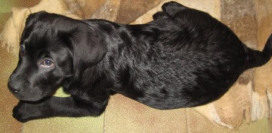
  
  
  
   e mordicchia sempre zia con quei dentini aguzzi!Non vedo l'ora di conoscerlo :)
  
   
   
  
  
 

## Carnevale: nonna Franca style
*15-02-2009*

 
  
  
  
   Il genio creativo-pratico di nonna Franca ha ideato e prodotto in poche ore queste bellissime mascherine:
  
  
   Cate-mela: rotonda e avventuriera
  
  
   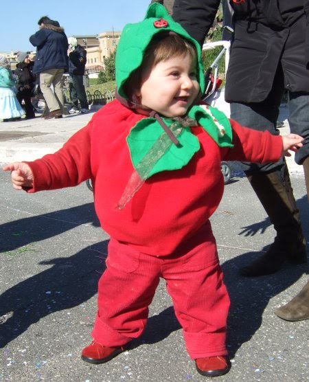
  
  
   Marghe-marghe: romantica ma un pò addormentata
  
   
   
  
  
  
   Mati-maia: classica e peperina
  
  
   
  
  
   Siamo andati al pontile di Ostia: c'erano tantissimi bimbi in maschera e abbiamo anche incontrato Alice che forse era vestita da fiocco di neve rosa :)
  
  
   (?)
  
   
   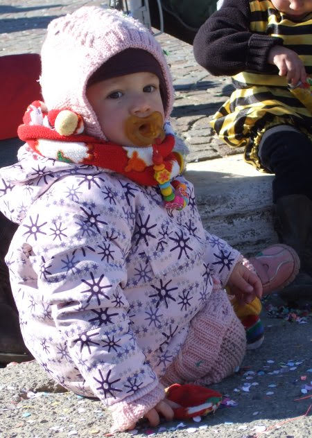
  
  
  
  
  
   Io mi sono divertita a spruzzare le stelle filanti spray....
  
   
   
  
  
  
   .....oooops forse devo perfezionare la mira!
  
  
   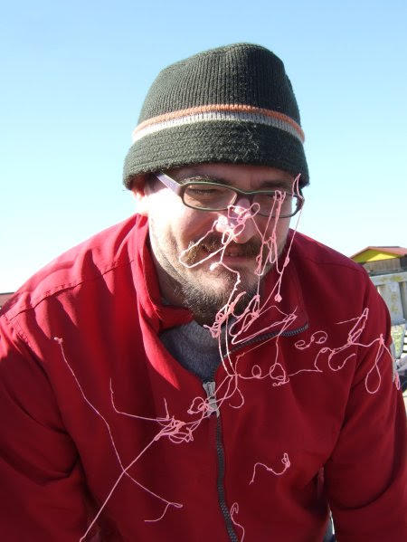
  
 

## Sabato grasso: tutti in maschera
*22-02-2009*

 
  
   Una bella festa in campagna a casa di don Vittorio con la mia amichetta Sofia....
  
   
   
  
  
  
  
   e anche M&amp;P si sono mascherati, da albero e da papavero
  
  
   
  
   
   
  
  
   
   
  
  
 

## Gita fuori porta: Ciciliano
*23-02-2009*

 
  
   In attesa della festicciola di compleanno di Giulia siamo stati a visitare un paesino molto carino alle porte di roma. Finalmente due passi al sole! Sia Marghe che io eravamo elegantissime! :)
  
  
   
   
  
  
  
   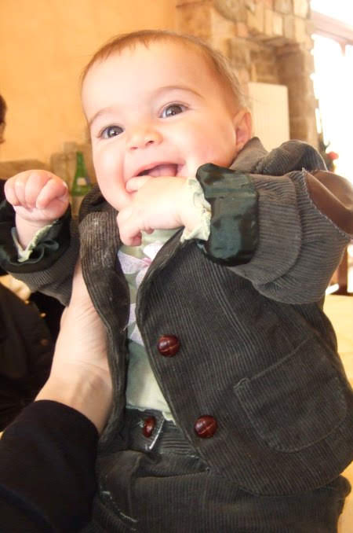
  
 

## Sabato bucolico e solforoso!
*01-03-2009*

 
  
   Ebbene si, sfruttando i rari sabati di sole, eccoci qui in campagna dai nonni.
  
  
   Marghe sperimenta il prato
  
  
   

   e le piace
  
   
   
  

  
   ma le piace anche stare sulla pancia di P :)
  
   
   
  
  
  
   mentre io girovago
  
  
   
   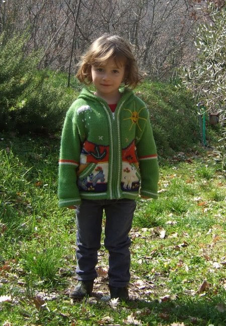
  
  
  
   e faccio l'altalena
  
   
   
  
  
  
   Poi siamo andati a fare un tuffo alle terme...a Marghe è piaciuta tanto l'acqua calda...non voleva più uscire
  
   
   
  
  
  
   ci siamo divertite insieme!
  
   
   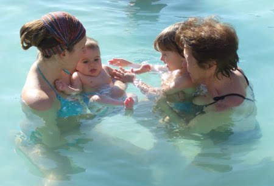
  
  
  
   ....e che pennica dopo il bagno nell'acqua calda! :)
  
   
   
  
  
 

## Primavera alla Caffarella
*09-03-2009*

 
  
  
  
  
  
  
   Che giornata primaverile oggi!Abbiamo fatto un bel pic nic al parco della Caffarella con tutti i nonni e la bionna.
  
  
   
  
  
   Si stava davvero bene, ad un certo punto mi sono anche levata le scarpe e sono andata a piedi nudi sul prato! La "solita selvaggia" dicono M&amp;P :)
  
  
   Ho fatto l'hula hoop con Sofia
  
  
   
  
  
   ho giocato alla corda con la bionna,che è più brava di me a saltare!
  
  
   
  
  
   poi ho fatto l'altalena con Marghe
  
  
   
  
  
   
  
   
   
  
  

## Buon Compleanno Caterina!!
*17-03-2009*

 
  
  
   Tanti auguri alla cuginetta Cate per il suo primo anno!!
  
  
   
  
 

## Come cresce!
*20-03-2009*

 
  
   Come cresce questa sorellina....adesso sta seduta da sola sul tappeto....
  
  
   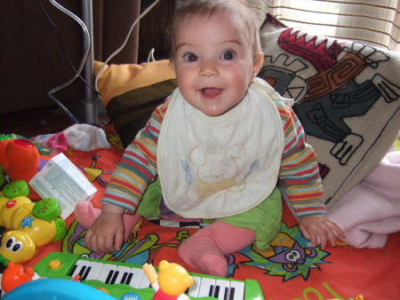
  
  
   sul seggiolone....
  
   
   
  
  
  
   e ha anche iniziato a fare le pappe! Non ama molto la sbobba che le da mamma ma se ci mette anche la frutta la mangia di gusto!
  
   
   
  
  
  
   ... e facciamo anche il bagnetto insieme! (anche se ancora lei è un pò perplessa :)
  
  
   )
  
   
   
  
  
  
 

## Auguri zia Betta e Cate
*22-03-2009*

 
  
   Buon compleanno zia e buona festa di Cate!
  
   
   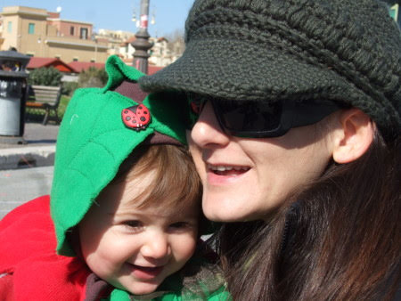
  
  
 

## 1/2 anno di Marghe!
*24-03-2009*

 
  
   Auguri sorellina per il tuo mezzo anno!!
  
   
   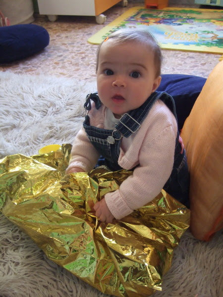
  
  
  
   ho colorato un bel fiore per te!
  
   
   
  
  
 

## Auguri papà mio
*28-03-2009*

 
  
   Buon compleanno dalle tue donne!
  
   
   
  
  
 

## Al campo di nonno Mario
*30-03-2009*

 
  
  
   Una bella giornata al campo di nonno insieme a Marghe
  
  
   
  
  
   nonna e nonno
   
  
  
   
  
  
   a M&amp;P
  
  
   
  
  
   e a quella birba di Martina con cui mi nascondevo nell'erba!
  
   
   
  
  
 

## A Viterbo da nonno Gianni
*01-04-2009*

 
  
   Oggi niente asilo, vado in campagna! Ho raccolto la legna per la stufa con nonno
  
  
   
  
  
   poi ho giocato con nonna e Marghe
  
  
   
  
  
   e ho messo in fila i cinghialetti (gli unici rimasti con tutte e 4 le zampe!)
  
  
   
   
  
  
 

## Buon compleanno pulce
*02-04-2009*

 
  
   Buon compleanno amore mio... da una "splendida" stanza d'albergo a Bruxelless... e non è un pesce d'aprile!
  
   
   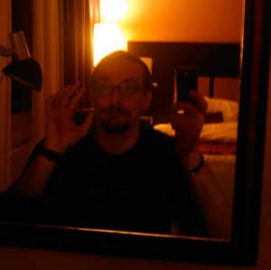
  
  
  
   e io a casa festeggio con le amiche e Matilde
  
  
   
  
 

## Prima volta sull'altalena
*04-04-2009*

 
  
   Oggi Marghe è andata per la prima volta da sola sull'altalena...e le è piaciuta!
  
   
   
  
  
 

## Coda o non coda ....
*05-04-2009*

 
  
  
   questo è il problema! Mamma dice che sembro una selvaggia con i capelli sciolti e disordinati
  
  
   
  
  
   mentre invece con la coda sono tanto bella! Voi che ne dite?
  
  
   
  
 

## Pasqua da zia Giorgia
*15-04-2009*

 
  
  
  
   Finalmente rivedo zia Giorgia!Appena arrivati a Verezzi andiamo subito a fare una bella passeggiata nel bosco insieme al 'cagnetto tuo Morgàn'
  
   
   
  
  
  
   Marghe ha raccolto gli asparagi con papà
  
   
   
  
  
  
   e mamma e zia mi hanno sbaciucchiata!
  
   
   
  
  
  
   Morgan, che tanto cagnetto non è, all'inizio mi faceva un pò paura con quel musone, ma poi ho imparato a giocarci insieme e a dirgli di stare a cuccia...e allora i nostri rapporti sono migliorati!Lui però è un pò monello....si è mangiato mezza torta di nocciole che aveva fatto nonna!
  
   
   
  
  
  
   A Pasqua abbiamo aperto le uova, sia io che Marghe
  
  
   
  
   
   
  
  
  
   e a Pasquetta siamo stati prima al mare
  
  
   
  
   
   
  
  
  
   poi a pranzo da Sem
  
   
   
  
  
  
   e poi nel bosco, dove zia Maria e Giorgia hanno fatto una prova di arrampicata insieme a Max! WOW che coraggiose...appena cresco un pò ci provo anche io!
  
   
   
  
  
 

## Benvenuta Maria Ginevra
*16-04-2009*

 
  
   Oggi pomeriggio è nata la mia cuginetta Maria Ginevra!
  
  
   
   
  
  
  
   Un bacio grande grande alla piccola (si fa per dire...4Kg)
  
  
   , a mamma Cinzia, papà Miko e ai fratellini Giorgio e Gabriele!
  
 

## -30 giorni!
*18-04-2009*

 
  
   "Mamma ma Alessia sta anche nella pancia di Lorenzo?" ... "No solo nella pancia di Mara"...e che pancia!! :)
  
  
   forza piccolina che siamo tutti curiosi di conoscerti!
  
   
   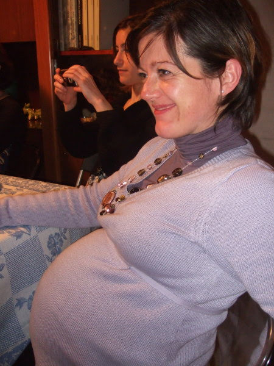
  
  
 

## Antonella e Alberto....oggi sposi!
*19-04-2009*

 
  
   Evviva gli sposi....e noi tutti eleganti per l'occasione!
  
   
   
  
  
 

## Vincere senza sconfitti ...
*29-04-2009*

 
  <table border="0">
   <tbody>
    <tr>
     <td>
      "Questa mania occidentale e aristotelica di distinguere il bianco dal nero, il buono dal brutto forse non è esattamente l'aspirazione profonda dell'anima umana. Sono contrario alle vittorie, cui corrispondono una o molteplici sconfitte..." F. De AndrèC'hai convinto!
     </td>
     <td>
     </td>
     <td>
      
     </td>
    </tr>
   </tbody>
  </table>
 

## Iniziamo a giocare insieme
*29-04-2009*

 
   
   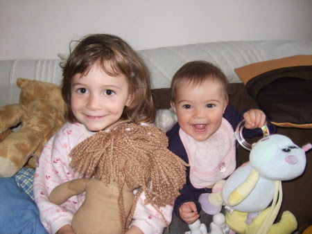
  
  
 

## Finalmente il mare
*05-05-2009*

 
  
   Accampamento al km 23 della litoranea di Sabaudia!
  
   
   
  
  
  
   la giornata inizia con una bella passeggiata in bici ...obiettivo la colazione!
  
   
   
  
  
  
   e mentre i grandi chiaccherano e si godono il cappuccino io mi diletto con una delle mie passioni, mettere tutto rigorosamente in fila!
  
   
   
  
  
  
   poi c'è chi vola sulle dune, chi fa amicizia con la sabbia e ne mangia anche un pò...
  
   
   
  
  
  
   chi gioca con quel cucciolone instancabile di Pedro
  
  
   
  
  
   e con quel mattacchione di P
  
   
   
  
  
  
   E poi per concludere la giornata una cena improvvisata nell'hangar di Giancarlo insieme al suo aereo....ha detto che quando voglio mi ci fa fare un giro! WOW
  
   
   
  
  
 

## Festa della mamma
*11-05-2009*

 
  
   " Ma tu perchè sei nonna? " " Perchè tu sei la mia nipotina! "
  
   
   
  
  
 

## Matilde mi fa sempre gli scherzi!
*15-05-2009*

 
  
   Ma dove è matilde?
  
   
   
  
  
  
   eccola!!!
  
   
   
  
  
 

## Sorelline con la tosse!
*17-05-2009*

 
  
   Marghe ed io ci siamo prese proprio una bella tosse! Però facciamo l'aerosol insieme :)
  
   
   
  
  
 

## Look estivo
*17-05-2009*

 
  
   Ciao a tutti, prima di un drastico cambio di look abbiamo fatto un rito propiziatorio... la piramide umana
  
   
   
  
  
  
   Manca solo mamma, magari ci proviamo la prossima volta!
  
  
   Poi però bando alle ciance... colpi di forbice di papà mentre mamma mi distraeva. All'inzio ero un po' perplessa
  
   
   
  
  
  
   ... ma poi mi sono convinta... sto freschissima
  
   
   
  
  
 

## Mamma e Matilde in bici!
*18-05-2009*

 
  
   Oggi io e mamma siamo state tutto il giorno insieme lasciando papà e Marghe a casa! (Marghe poverina ha la febbre!)
  
  
   Abbiamo preso la bici e siamo andate alla fermata del trenino! Quanto mi piace andare sul treno!
  
   
   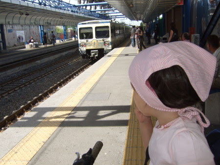
  
  
  
   siamo scese al capolinea, ma a me sarebbe piaciuto fare ancora qualche fermata! E ci siamo ritrovate in mezzo a tantissime persone che correvano, passeggiavano, andavano in bici a Caracalla per la Race for the Cure. Dentro lo stadio ho saltato sul tappetone del salto in alto
  
   
   
  
  
  
   e poi ho disegnato insieme a tanti altri bimbi
  
   
   
  
  
  
   Faceva proprio caldo oggi!
  
   
   
  
  
  
   Poi siamo state a pranzo da nonna Lilli, ho fatto un bel sonnetto e poi di nuovo a casa col treno!Che bella giornata!
  
 

## E' nata Alessia
*25-05-2009*

 
  
   Finalmente è nata la bellissima Alessia!
  
   
   
  
  
  
   Tanti tanti auguri a mamma Mara e al felicissimo papà Lorenzo!
  
 

## Tutti al mare!
*25-05-2009*

 
  
   Questo we a Sabaudia ho fatto il primo bagno della stagione!L'acqua era bella ma un pò fresca....
  
  
   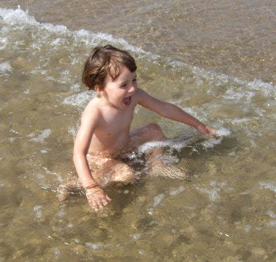
  
  
   a Pedro invece piaceva tantissimo
  
   
   
  
  
  
   Marghe ed io abbiamo giocato insieme con la sabbia
  
   
   
  
  
  
   poi abbiamo fatto tutti il bagno!
  
  
   
  
  
   A pranzo, mentre Marghe rosicchiava il finocchio
  
   
   
  
  
  
   abbiamo fatto una bella mangiata di telline appena pescate!
  
   
   
  
  
  
   ne vado proprio matta!
  
  
   
  
  
   Peccato che dopo questo bel we abbiamo avuto la disavventura di perdere le chiavi del camper...che poi io ho ritrovato nel seggiolino di Marghe!!
  
 

## Anniversario in sicilia
*08-06-2009*

 
  
  
   Per il primo anniversario di matrimonio di M&amp;P siamo tornati in sicilia.Abbiamo preso l'aereo tutti e 4, all'inizio mi faceva un pò paura andare nelle nuvole e sentire quei rumori forti ma dopo mi è piaciuto tanto!Siamo stati a casa di Annagloria e Nicola e finalmente abbiamo conosciuto il piccolo Matteo...che bello che è...dicono che assomiglia a Krusty il clown :)
  
  
   
  
  
   La loro casa ha tanti angoletti che mi piacciono....
  
   
   
  
  
  
   e una piscina grande, che ancora non è finita, dove però mi sono divertita a giocare! Mamma e Annagloria sono state sempre a chiaccherare...chissà quante cose avevano da raccontarsi!
  
   
   
  
  
  
   Una mattina sono andata con M alla pescheria e ho visto il pesce spada e poi ho conosciuto Manuela e la mia cuginetta triestina Maria Ginevra.
  
  
   Abbiamo avuto qualche imprevisto di salute, tra la tosse la febbre e il catarro dalle orecchie di Marghe e le mie tonsille gonfie, che ci hanno permesso di testare il pronto soccorso siculo....bhè potrebbe esserci di peggio!Alla fine tutto si è risolto con antibiotici, cortisone e areosol!Certo è buffo....noi bimbi ci ammaliamo sempre in vacanza!!
  
  
   Comunque la nostra vacanza è proseguita con nonna Lilli e nonno Gianni alla Masseria sul mare, dove si sta sempre bene e si dimentica tutto il resto!
  
   
   
  
  
  
  
   
   
  
  
  
   Siamo stati in spiaggia, ma l'acqua era fredda fredda...tanto che anche nonna ha esitato a fare il bagno!
  
  
   
  
   
   
  
  
  
   Marghe ed io ci siamo fatte delle belle passeggiate sulla spiaggia, abbiamo giocato con la sabbia e con le pallette di alghe
  
  
  
   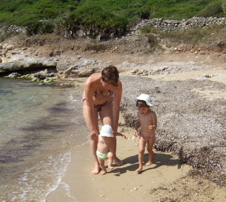
  
  
   
   
  
  
  
  
  
   abbiamo mangiato la granita, rigorosamente alla mandorla, con la brioches
  
   
   
  
  
  
   E poi, prima di partire, siamo stati a trovare Michela e Giovanni a Rondè (mmmm mi ricordava qualcosa quel posto)
  
   
   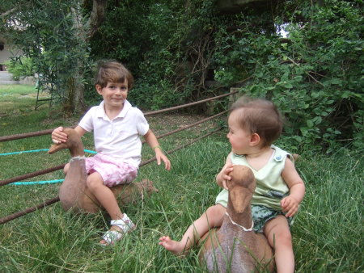
  
  
   
   
  
  
  
   ARRIVEDUAR all'anno prossimo sicilia :)
  
   
   
  
  
  
   
   

## Una settimana di progressi!
*16-06-2009*

 
  
   In questa settimana Marghe ha fatto tantissime cose nuove!
  
  
   <strong>
    Martedì 9
   </strong>
   ha iniziato a parlare...bhè dice BABABABABABA e poche altre variazioni sul tema
  
  
   <strong>
    Venerdì 12
   </strong>
   le è uscito il primo dentino
  
  
   <strong>
    Lunedì 15
   </strong>
   ha iniziato a gattonare seriamente
  
  
   Sarà stata la presenza di zia Giorgia? :)
  
   
   
  
  
  
   oppure la mia sorellina sta davvero diventando grande?
  
 

## Finalmente conosco Alessia
*20-06-2009*

 
  
   Dalla panciona di Mara è venuta fuori la piccola Alessia e a me piace tanto! Le ho dato tanti bacini....
  
   
   
  
  
  
   ...ma mai quanti gliene dà il suo papà Lorenzo!
  
   
   
  
  
 

## Settimana al Circeo
*21-06-2009*

 
  
   La settimana è iniziata con il matrimonio di Simone ed Eugenia, dove io e marghe sembravamo due principessine d'altri tempi
  
   
   
  
  
  
   
   
  
  
  
   poi ci siamo trasferiti a casa di zia Aldina a S.Felice, dove c'erano anche i nonni e Caterina!
  
  
   La mattina andiamo al mare in bicicletta con papà
  
   
   
  
  
  
   giochiamo con la sabbia con nonno Mario che fa delle buche grandissime!
  
   
   
  
  
  
   Cate ed io facciamo le smorfie a questo tempaccio che non è stato molto bello purtroppo
  
   
   
  
  
  
   poi torniamo a casa, ci riposiamo e dopo facciamo il bagno nella piscinetta tutte e tre insieme
  
   
   
  
  
  
   o andiamo al parco a giocare...e ci divertiamo tanto!
  
   
   
  
  
 

## 9 mesi di Marghe
*24-06-2009*

 
  
   Marghe ha scoperto che le piace tanto l'albicocca....anche se ha qualche piccolo effetto collaterale! :)
  
   
   
  
  
  
   per il suo complemese abbiamo organizzato un Pizza Party insieme agli amici 'australiani'
  
   
   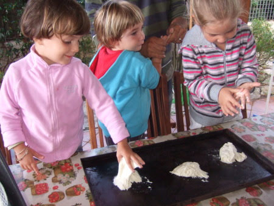
  
  
 

## Compleanno di Sophie
*28-06-2009*

 
  
   Sophie ha compiuto 3 anni e ha fatto una bella festa! AUGURI :)
  
  
   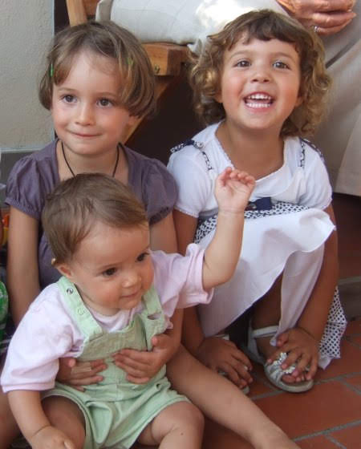
  
 

## In piscina con Simone
*04-07-2009*

 
  
   In piscina ho incontrato Simone e abbiamo fatto insieme tanti tuffi!
  
  
   
  
 

## A S. Nicola
*05-07-2009*

 
  
   Le mie amichette si sono trasferite a S.Nicola in vacanza e Marghe ed io siamo andate a trovarle....siamo proprio tre scimmiette
  
  <table border="0" style="width: 450px; height: 191px;">
   <tbody>
    <tr>
     <td>
      
     </td>
     <td>
      
     </td>
     <td>
      
     </td>
     
     
    </tr>
   </tbody>
  </table>
  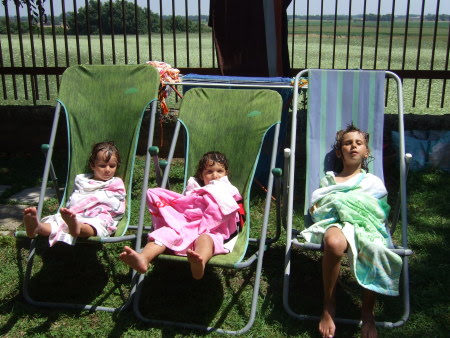
  
   
  
 

## In campeggio con Sofia
*13-07-2009*

 
  
   Questo we sono stata in campeggio con Sofia a Montalto Marina
  
  
   abbiamo fatto tante cose insieme: abbiamo giocato sulla spiaggia, siamo state in bicicletta in giro per il campeggio, abbiamo fatto il bagno in piscina
  
  
   
  
  
   siamo state a ballare la sera, e ci hanno anche scambiate per gemelline!
  
  
   
  
  
   Sofia è un pesciolino spericolato!
  
  
   
  
 

## I saldi!
*15-07-2009*

 
  
   Sono iniziati i saldi e Marghe non se li poteva perdere!! :)
  
  
   
  
 

## Il teatrino
*20-07-2009*

 
  
   Ho visto il teatrino di 'fagiolino' a villa Scipioni insieme a Sofia e Sonia... la trama era un pò complicata ma ci è piaciuto!
  
  
   
  
 

## Il vero sonno!!
*21-07-2009*

 
  
   
  
 

## 'mamma' e 'papà'
*23-07-2009*

 
  
   è ufficiale...Marghe sa dire consapevolmente sia mamma che papà, sa battere le manine, sa fare il leone e sa tirare la palla!!Brava sorellina!
  
  
   
  
 

## Campeggio alla Giannella
*03-08-2009*

 
  
   e rieccoci in campeggio insieme a Sofia ma stavolta vicino Talamone
  
  
   La giornata inizia con giochi d'acqua
  
  
   
  
  
   con gite in canoa alla ricerca di granchietti sugli scogli, abbiamo anche visto un paguro!
   
  
  
   con risate e nuotate
  
  
   
  
  
   con gita sul pattino
  
  
   
  
  
   mentre qualcuna se la dorme alla grande!!
  
  
   
  
  
   e si conclude con una bella braciolata!
  
  
   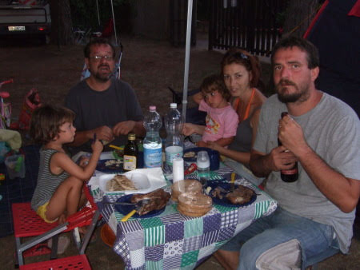
  
 

## Prima notte da sola
*10-08-2009*

 
  
   M&amp;P sono impegnati con il trasloco e io me ne vado in campagna dai nonni.Ho preso il treno con nonna Lilly e mi sono divertita, anche se le gallerie non mi sono piaciute perchè sono troppo rumorose.In campagna ho raccolto i lamponi e le more, ho aiutato a fare la salsa di pomodoro e a pulire i fagiolini e poi come premio sono anche andata alle terme!Certo mi è mancata un pò mamma ma ormai sono grande!
  
   
   
  
  
 

## Calura!
*13-08-2009*

 
  
  
   Nell'afa romana Margherita fa le prime nuotate con la ciambella
  
   
   
  
  
  
   e Matilde, che ormai è grande, si trucca insieme alla sua amichetta Emma
  
  
   
  
 

## Estate a Valdolmo
*26-08-2009*

 
  
   Quest'estate alla ricerca di un pò di fresco siamo stai dai nonni a Valdomo.
  
  
   Abbiamo fatto tante passeggiate
  
  
   
  
  
   tante mangiate
  
  
   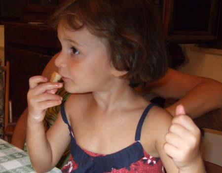
  
  
   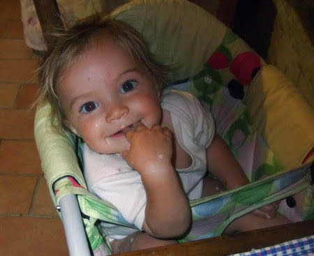
  
  
   tante risate
  
  
   
  
  
   
  
  
   tanta ginnastica con mamma
  
  
   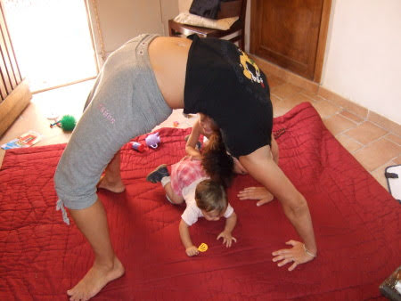
  
  
   
  
  
   giocato con tanti parenti
  
  
   
  
  
   e soprattutto tanti tanti bei sonni :)
  
  
   
  
  
   
  
  
   ciao casetta di Valdolmo
  
  
   
  
 

## Festa di Compleanno!
*08-09-2009*

 
  
   La mia prima festa di compleanno (perchè quest'anno il compleanno lo festeggerò diverse volte!)
  
  
   è stata molto bella!Eravamo pochi...ma buoni e ci siamo divertiti!
  
  
   Abbiamo gonfiato i palloncini
  
  
   
  
  
   abbiamo giocato in giardino con una macchinetta buffa che faceva le bolle
  
  
   
  
  
   poi abbiamo soffiato sulla candelina
  
  
   
  
  
   e aperto i regali...ma eravamo tutte interessate ad uno in particolare...una meravigliosa cucina!
  
  
   
  
  
   che è piaciuta tanto anche a Marghe!!
  
  
   
  
  
   A fine serata, un pò stanche, Sophie ed io ci siamo rifugiate in un posto tranquillo
  
  
   
  
 

## Buon compleanno amore mio!
*08-09-2009*

 
  
   Oggi compi 3 anni cucciola di mamma!Auguri per un nuovo anno meraviglioso ricco di avventure, di amici e di serenità!
  
  
   
  
 

## 7 settembre
*08-09-2009*

 
  
   Quest'anno è una giornata ancora più piena... oltre al compleanno di Matilde oggi è stato il primo giorno d'asilo di Margherita.
  
  
   
  
  
   
   </a>
  
  
   Auguri piccolette smorfiose!
  
   
   
  
  
 

## Primo giorno di scuola (materna)
*15-09-2009*

 
  
   Oggi inizio la scuola materna!
  
   
   
  
  
  
   mi piacciono sia le maestre, a cui stranamente ho anche dato un bacio, e anche i bimbi!
  
  
   e poi c'è una cucina bellissima nella mia classe! La sezione D
  
   
   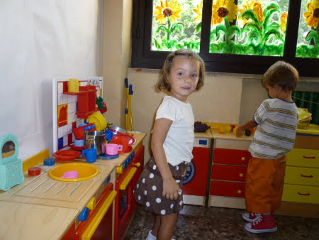
  
  
 

## la sesta malattia
*16-09-2009*

 
  
   ha colpito anche Marghe all'inizio dell'asilo!!
  
  
   Febbrone da cavallo e bollicine....ma ormai è quasi passata!
  
  
   
  
 

## Festa di compleanno bis
*24-09-2009*

 
  
   Margherita si era addormentata per la sua festa di compleanno ... ma si è svegliata giusto in tempo per la torta!
  
  
   
  
 

## Buon primo compleanno Margherita!!
*24-09-2009*

 
  
   Oggi la mia sorellina compie un anno...è proprio grande!
  
  
   
  
 

## La casa nuova!!
*27-09-2009*

 
  
   Dopo le lunghe peripezie che vi sto per raccontare finalmente abbiamo la casa nuova e a me e Marghe piace tantissimo :)
  
  <ul>
   <li>
    
     Marzo 2008: la vediamo e ce ne innamoriamo (anche se è tenuta un pò male)
    
   </li>
   <li>
    
     Aprile 2008: facciamo l'offerta ma ci fregano sul tempo....il nostro sogno si infrange
    
   </li>
   <li>
    
     Giugno 2008: la casa non viene più venduta (poi capiremo il perchè)
    
   </li>
  </ul>
  
   e ritorniamo all'assalto
  
  <ul>
   <li>
    
     Agosto-Novembre 2008: rimettiamo a posto tutta la disastrosa situazione della casa (condoni, agibilità,proprietà del terrazzo, e tante altre)
    
   </li>
   <li>
    
     27 Gennaio 2009: finalmente è tutta nostra!
    
   </li>
   <li>
    
     Aprile 2009: iniziano i lavori
    
   </li>
   <li>
    
     10 Agosto 2009: il primo trasloco
    
   </li>
   <li>
    
     26 Settempre 2009: finalmente la prima notte a casa!
    
   </li>
  </ul>
  
   Questa è la casa PRIMA dei lavori....
  
  
   
  
  
   
  
  
   per vedere il DOPO....veniteci a trovare! ;)
  
 

## Piccole mie!
*30-09-2009*

 
  
   Sembra ieri quando vi tenevo in braccio accucciate a me con quella testolina piccola piccola e quelle manine e piedini minuscoli, gli occhietti gonfi, blu e semi chiusi, la pelle rosata e quell'odore pazzesco che fanno solo i neonati!
  
  
   Ancora adesso ci coccoliamo nel lettone e quando dormite profondamente mi piace annusarvi e baciarvi, il vostro odore e il vostro sorriso sono la cosa più bella del mondo!
  
  
   
  
  
   
  
  
   
  
  
   
  
 

## nonni...se non ci fossero
*03-10-2009*

 
  
   .... bisognerebbe inventarli!!!
  
  
   Nella giornata della festa dei nonni ...un piccolo tributo alla loro pazienza, amore, dedizione...e molto molto altro!
  
  
   nonna Lilli
  
  
   
  
  
   nonna Franca
  
  
   
  
  
   bionna Maria
  
  
   
  
  
   nonno Mario
  
  
   
  
  
   nonno Gianni
  
  
   
  
 

## Pranzo ufficiale a casa nuova!
*06-10-2009*

 
  
   Questa domenica abbiamo fatto il primo pranzo ufficiale con brindisi nella casa nuova!
  
  
   
  
  
   Marghe ha mangiato gli spaghetti
  
  
   
  
  
   e io il mio tozzo di pane in tutto relax
  
  
   
  
  
   e ho anche dato da mangiare a Marghe
  
  
   
  
  
   poi abbiamo giocato con le grate...che sono divertenti sia aperte
  
  
   
  
  
   che chiuse
  
  
   
  
  
   e quando fa buio Marghe se ne va a zonzo col suo carrello
  
  
   
  
 

## Pesi e Misure
*13-10-2009*

 
  
   Bollettino del mese di ottobre:
  
  
   MATILDE: altezza 99cm e peso 13,5Kg
  
  
   MARGHERITA: altezza 75cm, peso 8,5Kg, 6 denti (3 sotto e 3 sopra)
  
 

## Un tè con Alessia
*18-10-2009*

 
  
   Ci è venuta a trovare Alessia per un tè in compagnia! Io e Marghe le abbiamo subito fatto provare il nostro mega cuscinone. Io mi buttavo sul cuscinone e lei rideva come una matta....e anche mamma Mara!
  
  
   
  
  
   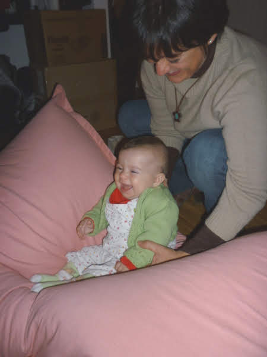
  
  
   Visto come è cresciuta la piccola? sono prorio belle le nostre amiche vero?
  
  
   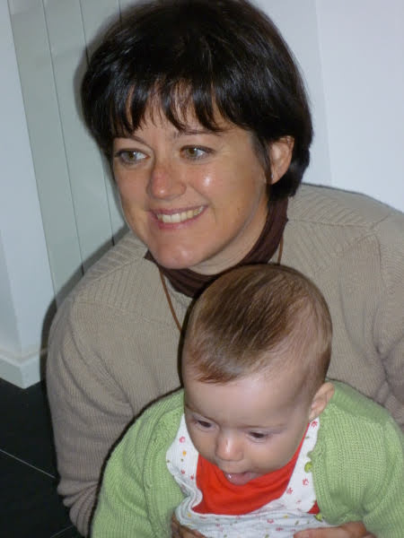
  
  
   E intanto anche Marghe inizia a tirarsi su in piedi da sola e a fare qualche passetto traballante!
  
  
   
  
 

## Vicine vicine
*23-10-2009*

 
  
   ... a colazione...
  
  
   
  
  
   .... e nel lettone ....
  
  
   
  
 

## Il mio angolino
*29-10-2009*

 
  
   questa casa nuova mi piace tanto e ho anche trovato un angolino per la lettura!
  
  
   
  
 

## La mia famiglia...
*03-11-2009*

 
  
   io la vedo così....
  
   
   
  
  
 

## A casa con la tosse
*08-11-2009*

 
  
   Marghe è stata a casa due settimane con la tosse poverina. Così per distrarla mentre fa l'aereosol abbiamo iniziato a guardare i cartoni dei Barbapapà.
  
  
   
  
  
   e Leda le ha insegnato a giocare con la fattoria e a battere le mani quando sente la musica
  
  
   
  
  
   ....ma ancora più importante ... in questi giorni ha imparato finalmente a
   <strong>
    cammiare da sola
   </strong>
   !! E dice anche qualche parolina: acqua, no, basta, e molte altre cose incomprensibili! :)
  
 

## Giochiamo con la bionna
*09-11-2009*

 
  
   In questa domenica grigia e piovosa è venuta la bionna a rallegrarci.
  
  
   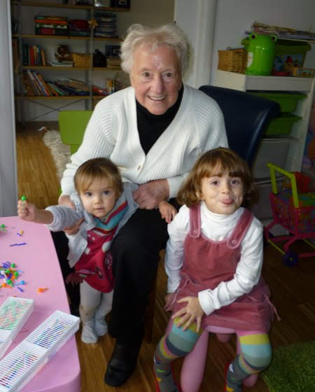
  
  
   Abbiamo giocato con i chiodini e colorato. La bionna disegna sempre i vasi di fiori e ha anche fatto il mio ritratto!
  
  
   Poi P ci ha preparato un'ottima polenta e sono venuti a pranzo anche zio Angelo e Leda...e quella mangiona di Marghe ha gradito!!
  
  
   
  
 

## Raccolta olive
*17-11-2009*

 
  
   Quest'anno per l'annuale raccolta delle olive è venuta anche zia Giorgia insieme a Max e Morgan
  
  
   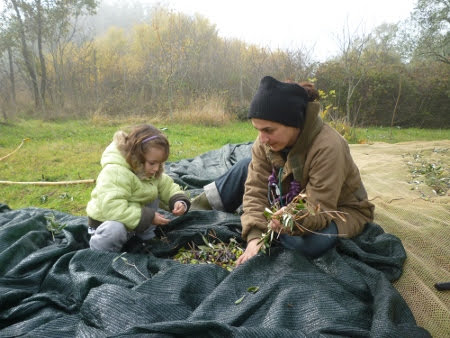
  
  
   ognuno con il suo rastrellino e al lavoro! Sofia è stata bravissima
  
  
   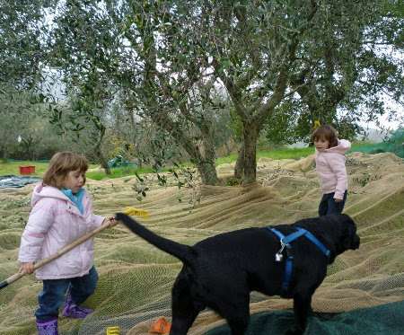
  
  
   mentre Morgan, nonostante il rastrello, le mangiava le olive!!
  
  
   
  
  
   poi stanche del lavoro io, Marghe e Morgan ci siamo riposati un pò
  
  
   
  
  
   in attesa del pranzo..ai fuochi c'è P.. e all'intrattenimento c'è Max!!
  
  
   
  
  
   e dopo pranzo ancora relax sull'amaca per i piccoli
  
  
   
  
  
   e il defogliatore anti-tress per i grandi!!
  
  
   
  
  
   Grazie a tutti gli amici che sono venuti ad aiutarci: Sofia, Alice, Ivan, Sophie,
  
  
   Nicole,Chiara, Davide, Ludvica ed Emilia e un arrivederci alla prossima raccolta!
  
  
   
  
 

## All'asilo in bici
*02-12-2009*

 
  
   Marghe, quando non è raffreddata, va a scuola in bici con P
  
  
   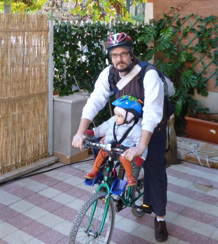
  
  
   e le piace, P dice che chiacchera e si guarda intorno tutto il tempo!
  
 

## We di pioggia
*02-12-2009*

 
  
   In questo grigio grigio we ho fatto tantissime cose:
  
  
   ho tagliato tutte le verdure per il minestrone
  
  
   
  
  
   ho aiutato M a preparare la torta
  
  
   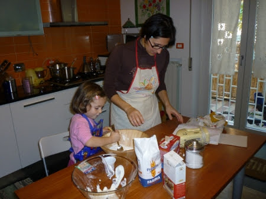
  
  
   sono stata in piscina con Caterina
  
  
   
  
  
   ho creato il calendario scrap con Sofia
  
  
   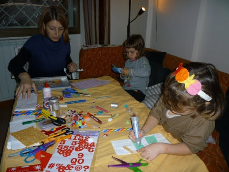
  
  
   e alla fine sono crollata esausta!!
  
  
   
  
 

## Vestito di drago!
*02-12-2009*

 
  
   
  
 

## Daniela e Giuseppe
*02-12-2009*

 
  
   Finalmente sono venuti a trovarci nella casa nuova!!!
  
  
   
  
 

## 8 dicembre nelle Marche
*09-12-2009*

 
  
   Siamo venuti a trovare la bionna Maria nelle Marche
   
  
  
   e ci siamo portati anche quei due sbaciucchioni di Sonia e Giulio
  
  
   
  
  
   e la mia amichetta Sofia con cui siamo andate a spasso per Fabriano e Frontone
  
  
   
  
  
   e abbiamo fatto tanti lavoretti e giochi a casa a Valdolmo davanti al camino
  
  
   
  
  
   
  
  
   Margherita si è abbuffata di tagliatelle fatte dalla bionna
  
  
   
  
  
   e poi si è divertita al parco giochi con l'altalena
  
  
   
  
  
   e pure mamma....anche se non ha ben capito come andava attraversato il ponte!!!
  
  
   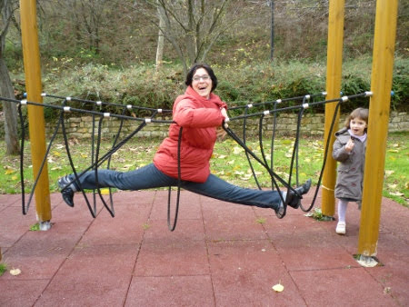
  
  
   Alla prossima vacanza!
  
  
   
  
 

## Festa di Natale all'asilo di Marghe
*19-12-2009*

 
  
   La prima festa di natale all'asilo di Margherita è stata divertente! Le maestre hanno preparato tante cose carine: un albero di natale con le palline.... ma chi c'è nella palla?
  
  
   
  
  
   una collezione di foto di tutti i bimbi della classe di Marghe... la mia sorellina è la più bella e sorridente!!!
  
  
   
  
  
   e infine le calze cucite dai papà e dalle mamme piene di cosine buone!!
  
  
   
  
  
   Marghe ed io abbiamo giocato un pò e poi ci siamo rilassate con M&amp;P
  
  
   
  
  
   
  
 

## Recita di Natale alla scuola di Matilde
*23-12-2009*

 
  
   Finalmente il gran giorno della recita (anche se non sono molto entusiasta, forse l'emozione!)
  
  
   ... ma alla fine ecco tutti i genitori seduti....si apre il sipario....
  
  
   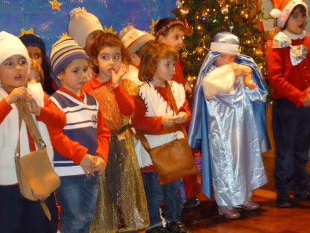
  
  
   ed eccoci qui a rappresentare la nascita di Gesù con tanto di capanna e pastorelli!
  
  
   (grazie nonna Franca per il bellissimo costume)
  
  
   
  
  
   poi un veloce cambio di scenografia e costumi, tra le lacrime emozionate dei genitori, e si riapre il sipario per i canti di natale!
  
  
   
  
 

## Buon Natale a tutti!
*24-12-2009*

 
  
   
  
 

## Giorni di festa
*29-12-2009*

 
  
   Ecco cosa abbiamo fatto in questi giorni di festa: il 24 sera abbiamo avuto tutta la famiglia a cena da noi
  
  
   c'era anche Caterina
  
  
   
  
  
   e la mia sorellina Marghe
  
  
   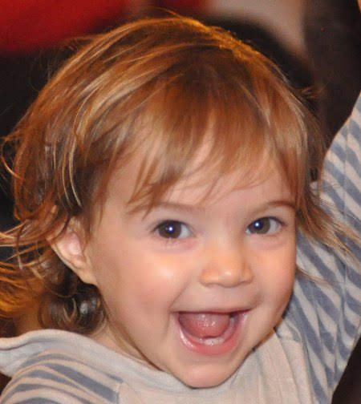
  
  
   e dopo abbiamo aperto i regali che ci ha portato babbo natale! il 25 mattina abbiamo fatto una passeggiata in bici al parco (per inaugurare il mio nuovo regalo: il seggiolino per la bici da grandi!)
  
  
   
  
  
   
  
  
   poi abbiamo tormentato Morgan (quella macchia nera sotto di noi è lui!)
  
  
   
  
  
   e infine il 27 al mare a Ostia dove abbiamo giocato con la sabbia e Morgan si è fatto il bagno!
  
  
   
  
  
   
  
 

