# 2010

## Capodanno a Ovindoli 
*05-01-2010*

 
  
   Eccoci ad Ovindoli....ma uffi non c'è nemmeno un pochino di neve! :(
  
  
   allora passeggiamo con la piccola Alessia
  
  
   
  
  
   e ci arrampichiamo in cima al paese con M e Mara
  
  
   
  
  
   ma tutto insieme il cielo si copre di nuvoloni, la temperatura scende e inizia a nevicare...evviva!!!
  
  
   
  
  
   proviamo anche a fare una discesa con gli slittini...ma che bufera di neve!
  
  
   
  
  
   e io mi diverto a mangiare la neve come quando ero piccola!
  
  
   
  
  
   arriva anche Morgan che è felice come un matto!
  
  
   
  
  
   e c'è anche Max che sostiene zia in versione Dr. House!
  
  
   
  
  
   Insomma nevica di brutto e noi ce ne stiamo al caldo in casa a giocare
  
  
   
  
  
   mentre Marghe dà il tormento a Morgan ribattezzato Ciucciu
  
  
   
  
  
   Alla fine smette di nevicare ed esce il sole! Margherita tocca la neve per la prima volta!
  
  
   
  
  
   e anche Raymond, Hubel e Ivan vengono a vedere per la prima volta la neve (in India, in Kerala, non c'è )
  
  
   e ad aiutarci a fare il pupazzo di neve
  
  
   
  
  
   ma Sofi ed io gli mangiamo le orecchie!
  
  
   
  
  
   andiamo anche in cima alla montagna con la cabinovia!
  
  
   
  
  
   poi domenica esce addirittura un bellissimo sole e Sofi ed io ci facciamo una corsa sulla neve con gli slittini
  
  
   
  
  
   BUON 2010 A TUTTI!
  
 

## Lo so, lo so ... non si dovrebbe, ma...
*19-01-2010*

 
  
   a papà piacerebbe tanto che fossi un'artista, e allora io faccio del mio meglio!
  
  
   
  
 

## Pic-nic in decollo
*25-01-2010*

 
  
   Oggi siamo stati a Norma a fare un pic-nic in decollo, ma non volava nessuno, anzi è arrivato pure un elicottero!Che bello l'abbiamo visto da vicino quando è atterrato!
  
  
   
  
  
   poi siamo stati a fare una passeggiata a Sermoneta e Marghe ha spiaccicato tutto il gelato sul giacchetto di P!
  
  
   
  
 

## Siamo due smorfiosette!!
*28-01-2010*

 
  
   
  
  
   
  
 

## Matrimonio di Frabizio e Sara
*01-02-2010*

 
  
   Oggi Marghe ed io ci siamo preparate per andare al matrimonio, ci siamo anche vestite uguali uguali, i vestiti li ho scelti io!!
  
  
   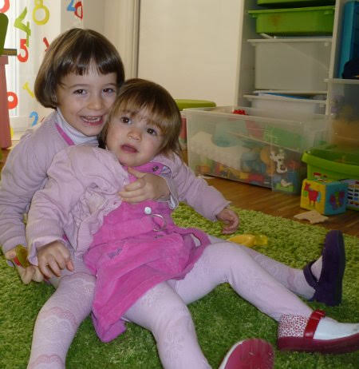
  
  
   La sposa era tutta vestita di bianco e molto bella! (e anche lo sposo)
  
  
   
  
  
   e dopo siamo stati tutti insieme al ristorante!
  
  
   
  
 

## Tutto bianco risveglio
*13-02-2010*

 
  
   Guardate un po' il nostro giardino ... [
   
  
  
  
   che bello tutto bianco!
  
  
   
  
  
   Speriamo che regga coì pomeriggio andiamo a fare scivolarella!!!
  
 

## Carnevale con la varicella
*17-02-2010*

 
  
   Niente festa di carnevale a scuola nè in giro per roma mascherata....ma in compenso un pò di bollicine di varicella! Però nonna Franca mi ha fatto un bellissimo vestito da principessa...tutto rosa!!!
  
  
   
  
  
   ...e poi stare a casa non mi dispiace per niente... gioco e gioco e faccio la buffona!!
  
  
   
  
 

## La festa di Carnevale
*17-02-2010*

 
  
   Oggi all'asilo di Marghe c'è stata la festa in maschera! Erano bellissimi tutti i bimbi!
  
  
   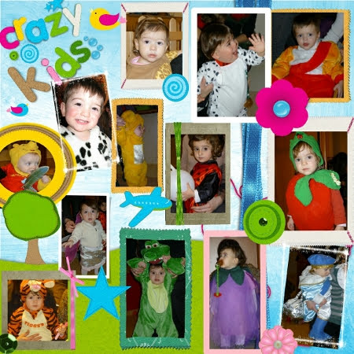
  
  
   e c'era anche il mago!
  
  
   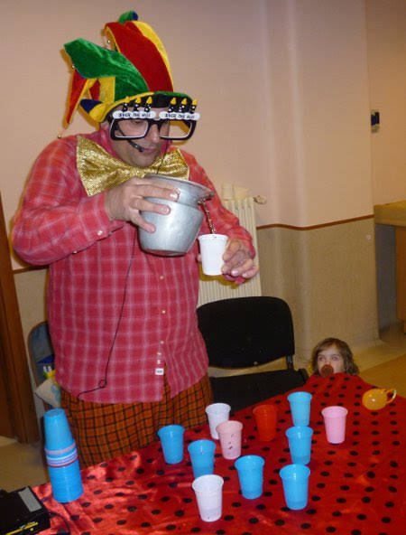
  
  
   con una micro assistente/curiosa nell'angolino!!! :)
  
 

## Giornata di sole e di...
*22-02-2010*

 
  
   .... biciclette
  
  
   
  
  
   ... succhi di frutta
  
  
   
  
  
   ... palle
  
  
   
  
  
   ... coccole di nonno
  
  
   
  
  
   ... adesivi sulle scarpe
  
  
   
  
  
   ... salti sul tappetone elastico
  
  
   
  
  
   e di mamme che esagerano!
  
  
   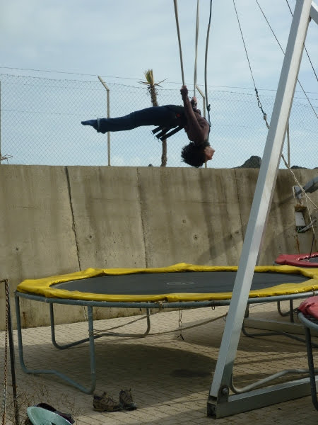
  
  
   ... insomma proprio una bella giornata!!!
  
 

## Anche Marghe con la varicella!! :(
*25-02-2010*

 
  
   Puntuale come un orologio ...dopo 15 giorni anche Marghe attaccata dal virus!
  
  
   
  
 

## .. me lo leggo da sola...
*05-03-2010*

 
  
   Matilde: 'Papy mi prendi il libro delle favole?'
  
  
   P: 'Si, vuoi che te ne leggo una?'
  
  
   Matilde: ' No, me lo leggo da sola...'
  
  
   3 minuti dopo.....
  
  
   
  
 
  
 

## Al mare
*08-03-2010*

 
  
   Finalmente il sole dopo giornate di pioggia e dunque... via al mare a goderci la giornata!
  
  
   Però per arrivare dobbiamo superare un ostacolo, ci fermerà? ... macchè, caterpillar è incontenibile.
  
  
   Però che faticaccia, ora ci riposiamo un po'!
  
  
   
  
  
 

## Compleanno di Caterina
*17-03-2010*

 
  
   Auguri cuginetta!!!
  
  
   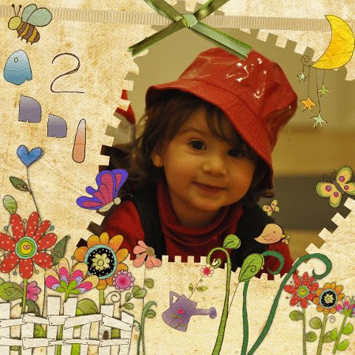
  
 

## Buon compleanno papy!
*28-03-2010*

 
  
   Le tue bimbe :)
  
  
   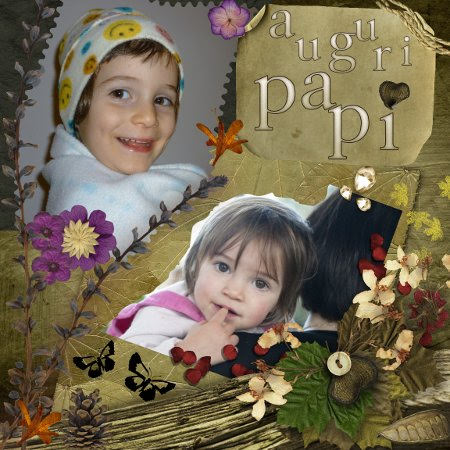
  
 

## Compleanni
*29-03-2010*

 
  
   Tra marzo e aprile si festeggiano tanti compleanni, e allora abbiamo deciso di fare un bel pizza party a casa di Mara e Lorenzo.
  
  
   Ecco tutti i festeggiati davanti alle torte
  
  
   
  
  
   mentre Margherita si dedica alle sue passioni: la bici e la pizza!
  
  
   
  
  
   e le bimbe grandi ...
  
  
   
  
  

## Macarone ....
*05-04-2010*

 
  
   ... m'hai provocato e io te distruggo ... io me te magno!
  
  
   Una Margherita a Roma!!!
  
 

## Colazione di Pasqua
*05-04-2010*

 
  
   Beh da buoni marchigiani a Pasqua si mangia... salame, pizza di formaggio, pizza dolce, colomba uova di Pasque e uova sode, magari benedette, eppoi si fa a scoccetta ...
  
  
   ... è un gioco che si fa durante la colazione di Pasqua. I due contendenti urtano le proprie uova. Quello che si rompe perde... P ha perso ;-)
  
 

## Pic-nic d'aprile
*26-04-2010*

 
  
   Nicole ci ha invitati a questo bel pic-nic al parco della Pace. Sono venuti anche Lara e Tommy.
  
  
   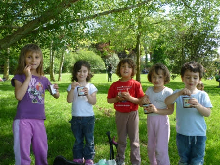
  
  
   Ci siamo divertiti moltissimo, con le biciclette, gli aquiloni
  
  
   
  
  
   Marghe era sempre in giro per i prati...
  
  
   
  
 

## Auguri mamma
*15-05-2010*

 
  
   
  
  
 

## Quando ci vediamo?
*20-05-2010*

 
  
   un saluto da zia Giorgia e Morgan alle due monellette...
  
  
   
  
 

## Battesimo!
*24-05-2010*

 
  
   una giornata speciale per la piccola alessia e i suoi genitori!
  
  
   
  
  
   e poi tutti a giocare!
  
  
   
  
  
   Margherita. 'mumble mumble .... anche io lo voglio questo tavolino...'
  
 

## pedalando pedalando....
*24-05-2010*

 
  
   ci siamo fatti mezzo giro del lago di castello!! :)
  
  
   forza bimbe che ci aspettano tante belle passeggiate in bici!
  
  
   
  
 

## Io e Pedro
*24-05-2010*

 
  
   è proprio vero.... quella per i cani è una vera passione!
  
  
   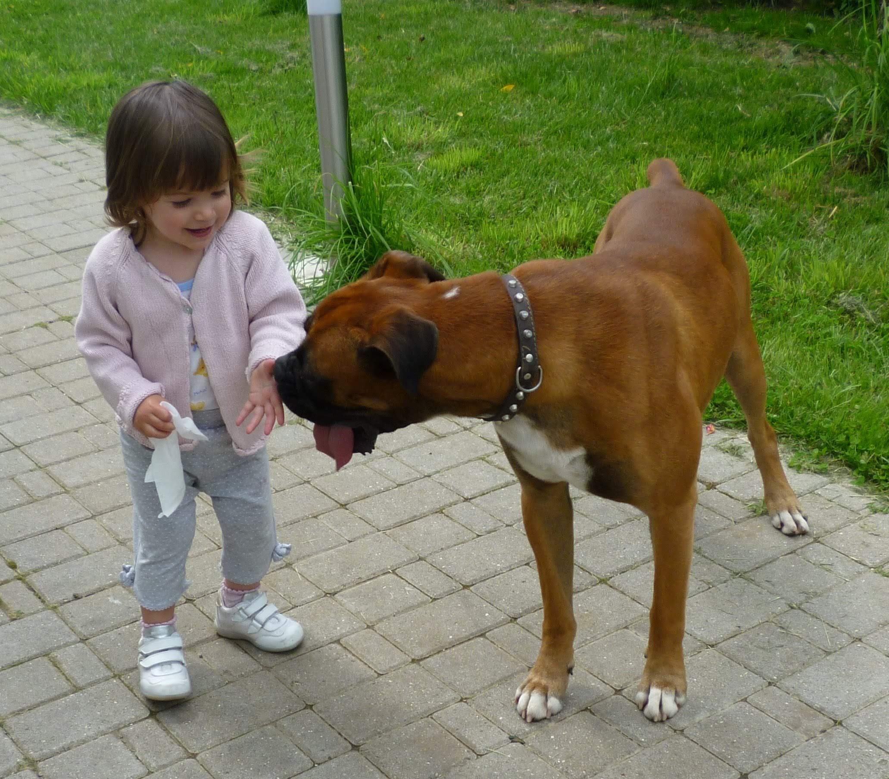
  
 

## Compleanno di Ivan
*25-05-2010*

 
  
   per i due anni di Ivan siamo stati ad un Indian Party!!
  
  
   
  
  
   abbiamo giocato e mangiato tante cose buone. marghe e il festeggiato sembrano molto affiatati!
  
  
   
  
  
   
  
 

## Auguri piccola Alessia
*25-05-2010*

 
  
   
  
 

## 2° anniversario
*01-06-2010*

 
  
   Auguri M&amp;P
  
  
   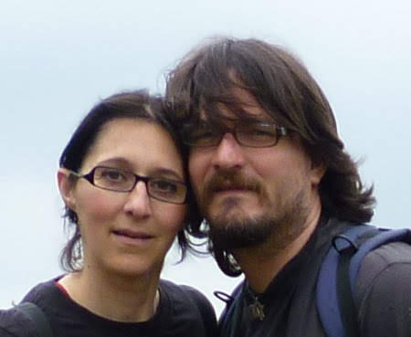
  
 

## Ponte lungo ...ligure!
*04-06-2010*

 
  
   Finalmente partiamo per andare da zia Giorgia e Morgan !! 'Evviva' come dice Margherita!!! Eccoli che ci aspettano..
  
  
   
  
  
   al povero Morgan noi piccoline abbiamo dato il tormento... portandolo a spasso
  
  
   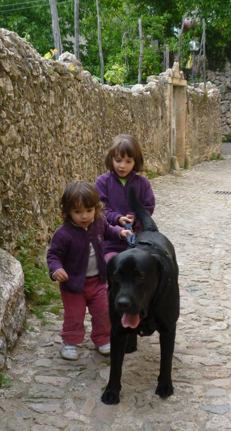
  
  
   abbracciandolo sempre...
  
  
   
  
  
   usandolo come cavallo... anche a colazione...
  
  
   
  
  
   ma lui si fa fare tutto.... senza lamentarsi, ma dando solo grandi leccate!!
  
  
   Matilde si è rivelata una fantastica dog sitter, ha portato anche Carmy a spasso nel bosco
  
  
   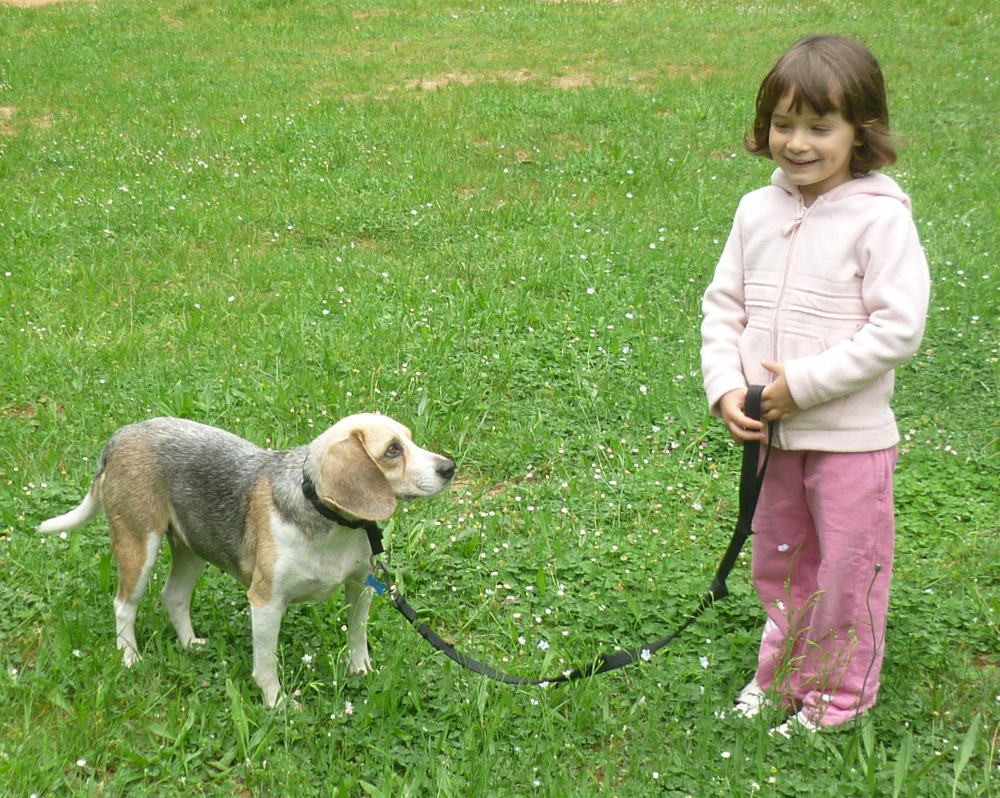
  
  
   ed è anche una brava camminatrice...mentre Marghe se la spassa nello zaino con papy!
  
  
   
  
  
   Poi è uscito il sole e ci siamo concessi i primi veri giorni di mare di quest'estate, con ADDIRITTURA un bagno!!
  
  
   
  
  
   e tanti secchielli di sabbia!
  
  
   
  
  
   Sulla via del ritorno siamo andati a fare un bagno caldo alle terme Calidario di Venturina...che bello!!!
  
  
   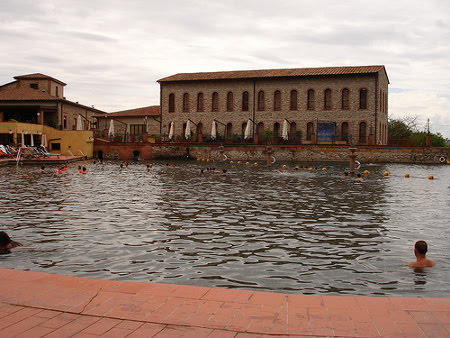
  
  
   insomma....finalmente è iniziata l'estate!!!
  
  
   
  
 

## Finalmente ... ronzi!!!
*07-06-2010*

 
  
   Dopo un lungo inverno (e primavera)
  
  
   di pioggia finalmente si riprende il camper!! Meta Sabaudia, dove splende il sole e Marghe ed io ci divertiamo sulla spiaggia.
  
  
   
  
  
   e nella piscinetta d'acqua calda!
  
  
   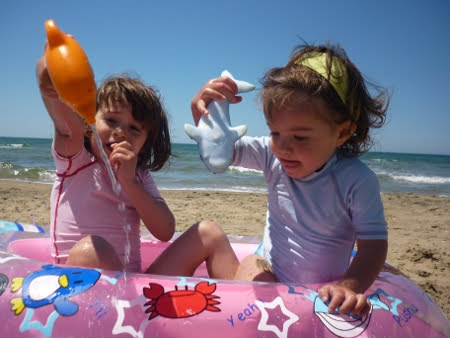
  
  
   Alla fine la sera siamo stanche e un pò bruciacchiate dal sole! Andiamo a cena da Mimì e Lulù.
  
  
   Domenica invece un altro pò di mare con le cuginette Ludovica e Lucrezia e poi tutti alla festa di Alessia!!
  
  
   Con tanto di bagno in piscina
  
  
   
  
  
   foto di gruppo sul prato
  
  
   
  
  
   relax e chiacchere con le amiche
  
  
   
  
  
   e torta della festeggiata!
  
  
   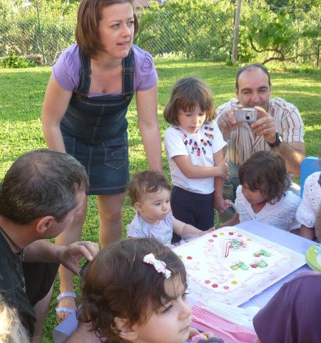
  
 

## Un papà importante!
*09-06-2010*

 
  
   Oggi papy è stato premiato per un suo progetto e ha anche incontrato il presidente Napolitano al Quirinale ... quando l'ho visto gli ho detto 'Papy ma come ti sei vestito?' ...non sono abituata a vederlo così elegante...ma era bellissimo!!
  
  
   
  
 

## La mia prima gita scolastica!
*10-06-2010*

 
  
   Che emozione (più per M&amp;P ovviamente)
  
  
   oggi la mia prima gita al mare con la scuola!
  
  
   Tutti per mano e via...
  
  
   
  
  
   sul pullman :)
  
  
   
  
 

## Festa della cultura a Garbatella
*14-06-2010*

 
  
   Dovevamo fare un bel we al mare e invece Marghe sta a casa con la tonsillite e le placche! Poverina! Così io e M andiamo alla festa della cultura che ha uno spazio bimbi in una delle piazzette più belle della Garbatella. Ci sono tantissimi giochi in legno ma a Sofia e a me piace tanto questo gioco da tavolo...
  
  
   
  
  
   i tappetoni per saltare, il teatro dei burattini, i mimi, e l'angolo creativo (strano eh? :)
  
  
   )
  
  
   dove abbiamo colorato un sole fatto con un bicchiere di plastica e un polipo fatto con la bottiglia.
  
  
   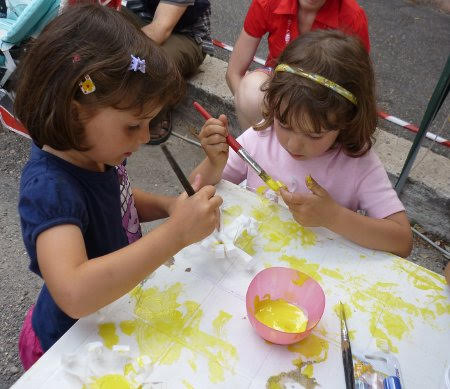
  
 

## Fine anno: festa all'asilo
*17-06-2010*

 
  
   All'asilo di Marghe hanno organizzato una bellissima festa di fine anno! Tutti i genitori e i bambini sono stati invitati a cena....
  
  
   
  
  
   ... nella terrazza festosamente addobbata.
  
  
   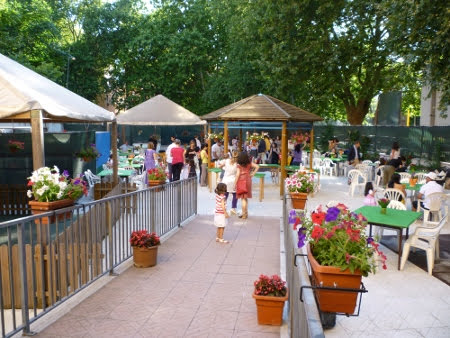
  
  
   Abbiamo gustato le prelibatezze del mitico cuoco Angelo e la magnifica organizzazione di tutte le maestre e lo staff insieme agli altri genitori
  
  
   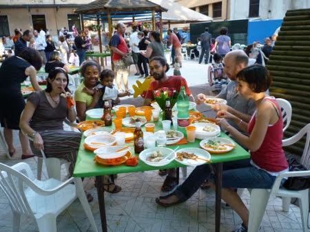
  
  
   Noi bimbi invece abbiamo giocato...chi sulle molle
  
  
   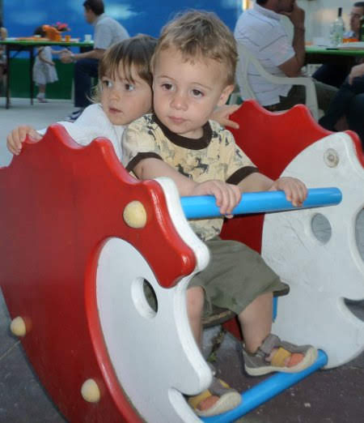
  
  
   chi arrampicandosi...
  
  
   
  
  
   E' stata proprio una bella serata. Le sorelline ringraziano!
  
  
   
  
 

## Festa di fine anno: Matilde e Stella
*18-06-2010*

 
  
   E questo primo anno di scuola materna è finito! Festeggiamo insieme a Stella al parco giochi, tra giostre
  
  
   
  
  
   piscina di palline
  
  
   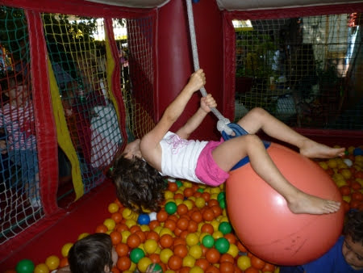
  
  
   auto scontri
  
  
   
  
  
   mongolfiere
  
  
   
  
  
   tazze di caffè ruotanti
  
  
   
  
  
   e infine la tortaaaaa
  
  
   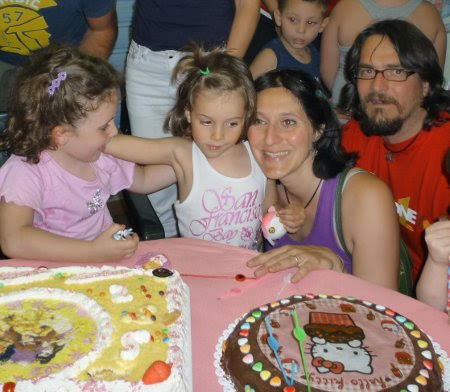
  
  
   "Buona la torta vero nonna?"
  
  
   
  
 

## Ponte di fine giugno
*03-07-2010*

 
  
   Non ci siamo fatti mancare niente! Un pò di mare a Pescia ... al Chiarone
  
  
   
  
  
   qualche gelato per rinfrescarsi
  
  
   
  
  
   un pò di lago di Bolsena con le amichette Anna e  Nina
  
  
   
  
  
   e allegri pranzetti
  
  
   
  
  
   e infine le terme con nonno Gianni
  
  
   
  
  
   proprio un bell'anticipo di vacanze!!!
  
 

## Al mare a san felice
*13-07-2010*

 
  
   ... in vacanza con i nonni, Caterina e Leda ...
  
  
   
  
  
   tanti giochi e pasticci
  
  
   
  
  
   
  
  
   e infine i lati B!
  
  
   
  
 

## Sicilia....
*01-09-2010*

 
  
   Mamma, Marghe ed io ci siamo tagliate i capelli corti corti e via... si parte per le vacanze!
  
  
   
  
  
   prendiamo la nave per la sicilia con Ronzinante! E finalmente siamo da Annagloria....subito a mollo nella loro piscina! Tutti insieme!!!
  
  
   
  
  
   
  
  
   
  
  
   Giochiamo e facciamo tante merende 'zozze'!
  
  
   
  
  
   
  
  
   
  
  
   Siamo andati sull'Etna, in cima al cratere
  
  
   
  
  
   e ad abbuffarci come al solito al Frutteto di Efesto! C'erano anche zia Nuccia, zio Nello e il cugino campione di rana Andrea!
  
  
   
  
  
   
  
  
   Poi ho fatto il bagno di notte ... era un pò freddino!!!
  
  
   
  
  
   E prima di lasciare questa bella terra siamo andati a Etnaland, un parco gioco acquatico dove mi sono divertita un mondo a nuotare, fare gli scivoli e girare con la ciambella nel fiume con la corrente insieme a mamma! Anche a Marghe piace moltissimo l'acqua!
  
  
   
  
 

## .... Calabria .... Campania.....Abruzzo....
*03-09-2010*

 
  
   Lasciati gli amici il nostro viaggio prosegue per il sud Italia con Ronzinante.
  
  
   Ci fermiamo a Capo Vaticano dove c'è un bel mare con i cavalloni e gli scogli!
  
  
   
  
  
   
  
  
   
  
  
   Poi un pò di relax e di fresco sulla Sila
  
  
   
  
  
   e un giro del lago di Cecita in bici
  
  
   
  
  
   abbiamo comprato i funghi e li ho puliti tutti io!!
  
  
   
  
  
   Poi siamo andati a Praia a Mare. Margherita ancora non ha capito che l'acqua di mare fa male...e la beve continuamente!
  
  
   
  
  
   A me invece piace nuotare come un pescetto, andare sott'acqua e fare il morto a galla!
  
  
   
  
  
   
  
  
   Ho proprio un fisico da spiaggia vero?? :)
  
  
   
  
  
   Marghe invece un pò più da panzerotto!!
  
  
   
  
  
   Abbiamo fatto amicizia con una simpaticissima famiglia di udine!
  
  
   Poi siamo stati a Capo Palinuro e a Marina di Camerota a trovare altri amici.
  
  
   
  
  
   ci piace giocare nelle pozze d'acqua che si formano sugli scogli e cercare i granchietti e le conchiglie
  
  
   
  
  
   Ultima tappa di mare sull'altra costa è stata Lido di Casalbordino .. spiaggione di sabbia e acqua bassa dove ci siamo divertite a correre nell'acqua a fare i tuffi e a giocare con il materassino con M!
  
  
   
  
  
   
  
  
   
  
 

## .... Marche!
*05-09-2010*

 
  
   Un pò esauste da questa vacanza itinierante, la nostra meta sono le Marche, dove ci aspettano zii, nonni, la bionna Maria, Cate e tantissimi amici!
  
  
   
  
  
   Abbiamo fatto tantissime cose: passeggiate al piscibetto
   
  
  
   con merende lungo il fiume e in cima al monte
  
  
   
  
  
   tante bolle di sapone
   
  
  
   tante risate con Cate e Saretta
  
  
   
  
  
   
  
  
   e poi è venuto a trovarci anche Raymond!
  
  
   
  
  
   Grazie papy che ci hai sopportate, come solo tu sai fare, mentre mamma era al lavoro!
  
  
   
  
 

## I miei primi 4 anni!!!
*08-09-2010*

 
  
   
  
 

## WE di settembre
*22-09-2010*

 
  
   Ancora fa caldo e si va al mare, a volare a Norma
   
  
  
   
  
  
   e in campagna
  
  
   
  
 

## I miei primi 2 anni!!!
*24-09-2010*

 
  
   
  
 

## Festa M&M 2&4 !!
*27-09-2010*

 
  
   M&amp;P hanno organizzato per me e Marghe una bellissima festa a casa! Per l'occasione il terrazzo è stato trasformato in un parco giochi dove tutti i bimbi si sono divertiti!
  
  
   
  
  
   P ci ha anche dato il permesso di infilare il dito nella torta!!!
  
  
   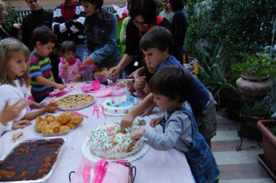
  
 

## P & friends for Africa
*04-10-2010*

 
  
   Ormai tanto tempo fa, Papà e i suoi amici hanno cominciato a raccogliere dei soldi per beneficienza... però per mille motivi ancora non li hanno donati.
  
  
   è ora di muoversi!
  
  
   Fino ad ora abbiamo raccolto 1241 euro, l'obiettivo è 3000 euro per donare attraverso il
   <a href="http://www.amref.it/locator.cfm?pageID=6124">
    progetto Acqua dell'AMRE
   </a>
  
  
   <a href="http://www.amref.it/locator.cfm?pageID=6124">
    F
   </a>
  
  
   un pozzo in Africa, che verrà intitolato al papà di Enrico .
  
  
   P raccoglierà fondi fino al giorno del suo compleanno (il 27 marzo del 2011)
  
  
   , quando diventerà uno splendido quarantenne, poi faremo immediatamente insieme la donazione. A proposito, nessun regalo per P, ma mettete da parte un po' di soldini per questa iniziativa che poi raccoglieremo alla festa.
  
 

## Al trucco
*05-10-2010*

 
  
   Oggi siamo stati da don Vittorio per un mercatino di beneficenza e c'erano anche i pagliacci che truccavano i bimbi.... non ho resistito....
  
  
   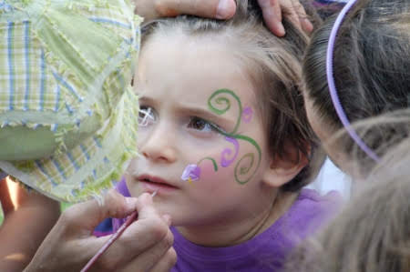
  
  
   e alla fine eccomi in versione fata dei fiori!!!
  
  
   
  
 

## Cavallerizza
*20-10-2010*

 
  
   Sono temeraria, spericolata ma romantica ....e mi piacciono gli animali...di qualunque dimensione!!
  
  
   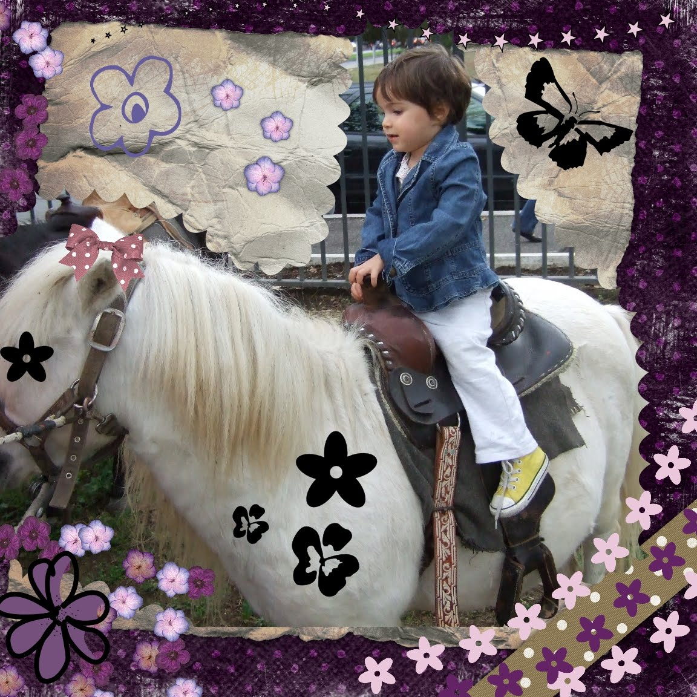
  
 

## Halloween a Valdolmo
*01-11-2010*

 
  
   Anche se a P non piace questa festa ci ha aiutati a fare una bellissima zucca!!
  
  
   
  
 

## Corso di acquarello!
*06-11-2010*

 
  
   Oggi sono andata al corso di acquarello insieme alle mie amiche! Cristina ci ha insegnato le tecniche dell'asciutto su bagnato e bagnato su bagnato e abbiamo fatto anche un cielo stellato!
  
  
   
  
  
   E infine un disegno con le casette con la nebbia e una piccola magia!
  
  
   
  
  
   (ops scusate ero truccata da gatto!!)
  
 

## Novembre e un bel sole!
*09-11-2010*

 
  
   Questo mese autunnale è iniziato con un bellissimo e caldo sole...e siamo andati a mangiare al mare!
  
  
   Che abbuffata di pescetto!
  
  
   
  
  
   Poi abbiamo giocato in spiaggia
  
  
   
  
  
   e Marghe si è pure fatta il bagno cadendo in acqua mentre correva sulla riva!
  
  
   
  
  
   abbiamo giocato tutto il giorno!
  
  
   
  
  
   Domenica è venuta anche a trovarci alessia e siamo andate ai giochini insieme
  
  
   
  
 

## In viaggio con mamma
*24-11-2010*

 
  
   Mamma aveva bisogno di una vacanza, io di stare un pò con lei e entrambe avevamo tanta voglia di rivedere zia Giorgia. Così abbiamo iniziato l'avventura, prima in treno (che M ha sbagliato...ma alla fine siamo arrivate in tempo lo stesso ;)
  
  
   )
  
  
   e poi in aereo! Mi è piaciuto tanto quando correva veloce veloce per decollare. E poi ho fatto il puzzle mentre volavamo nel cielo nero!
  
  
   
  
  
   Arrivati a Genova è vanuta zia a prenderci
  
  
   
  
  
   e Morgan mi ha dato il tormento, era felice di vedermi ... e anche io!!!
  
  
   
  
  
   Ci siamo proprio rilassate e riposate per 4 giorni, tra passeggiate nel bosco, in spiaggia, e lavoretti davanti alla stufa!
  
  
   
  
  
   
  
  
   
  
  
   
  
  
   Poi siamo anche state a Genova all'acquario! Che bello, quanti pesci! Mi ha fatto un pò paura il coccodrillo ma che belli i pinguini che nuotavano velocissimi e i delfini che giocavano!
  
  
   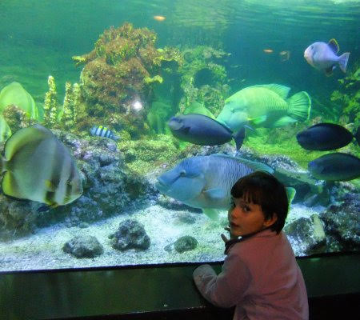
  
  
   E poi c'era anche una tartaruga enorme!
   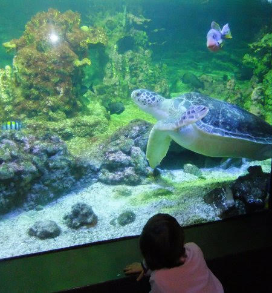
  
  
   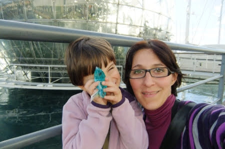
  
  
   Al prossimo viaggio!!!
  
  
   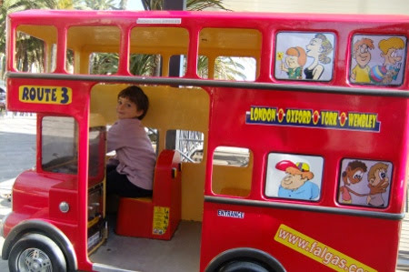
  
 

## Artiste
*29-11-2010*

 
  
   Nelle giornate di pioggia ci piace colorare...
   
  
  
   siamo proprio delle piccole artiste (un pò pasticcione ma moooolto creative!)
  
  
   
  
 

## Il lavoretto di Natale
*03-12-2010*

 
  
   All'asilo di Marghe tutte le mamme e i papà si sono impegnati a fare un bellissimo lavoretto per natale! Un guanto pazzerello che servirà a cantare insieme la filastrocca dei pirati del mar dei sargassi!
  
  
   
  
 

## Amiche
*20-12-2010*

 
  
   Che bello oggi siamo andate a costruire le torri insieme a Sofia
   
  
  
   e poi ci siamo anche mangiate un bel piattone di patatine fritte!
  
  
   
  
 

## A spasso per roma
*24-12-2010*

 
  
   stiamo scoprendo che la nostra città è proprio bella e ci piace girarla..
  
  
   
  
  
   fontana di trevi
  
  
   
  
  
   piazza s. pietro ...
  
  
   
  
  
   'mamma dov'è l'albero??'
  
  
   
  
  
   piazza navona ...che buona la mela caramellata
  
  
   
  
  
   e guarda come è pieno il fiume!
  
  
   
  
  
   lo sapete che Nospa è comodo da cavalcare!
  
  
   
  
 

## Buon Natale
*26-12-2010*

 
  
   
  
 

