# 2011
 
## Primo giorno dell'anno
*02-01-2011*

 
  
   ... siamo andati al porto di ostia con M&amp;P e abbiamo passato una bellissima giornata!
  
  
   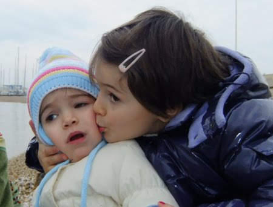
  
  
   
  
  
   "M come è grande grande questo mare!"
  
  
   
  
 

## Buon 2011
*02-01-2011*

 
  
   
  
  
   Un augurio a tutti di un nuovo e splendido anno!
  
 

## Buoni propositi
*03-01-2011*

 
  
   P si stava preparando per la maratona di Roma, ma è troppo ciccione... Dopo aver fatto una mezza dal lago di Castel Gandolfo a Roma ha capito che forse è meglio per il momento dedicarsi alla mezza. Allora mezza maratona Roma-Ostia il 27 Febbraio 2011. Per ogni Km percorso, P donerà 20 euro alla nostro progetto per il pozzo. A proposito, Ale, Laura, Chiara e Davide hanno fatto la loro donazione. Grazie ragazzi.
  

## Gite
*11-01-2011*

 
  
   Durante queste vacanze abbiamo fatto tante gite. Qui siamo a Napoli, buttate giù dal letto alle 9 e alle 10.20 sulla 'Freccia Rossa', il treno super veloce che ci porta a Napoli.
  
  
   
  
  
   Siamo stati a vedere i presepi di S. Gregorio Armeno
  
  
   
  
  
   in una piazza bellissima e poi a mangiare un'ottima pizza e un caffè ... come solo a napoli o sanno fa'!
  
  
   
  
  
   e poi c'era anche il mare!
  
  
   
  
  
   Poi siamo anche stati alla pineta di Ostia in bicicletta insieme a Flavio ...però era più divertente tirarle le bici che andarci sopra....e raccogliere le pigne e i tesori nel bosco!
  
  
   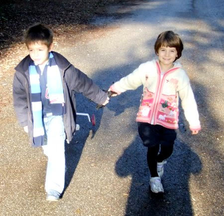
  
  
   poi abbiamo mangiato al porto di ostia
  
  
   
  
  
   e abbiamo giocato a ruba bandiera!
  
  
   
  
  
   Le feste sono finite....si ricomincia la scuola e il lavoro....BUON INIZIO a tutti!
  
  
   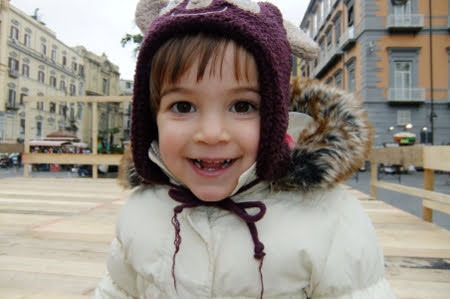
  
 

## Mari e monti!
*19-01-2011*

 
  
   In questo we di belle giornate abbiamo organizzato con la truppa una gita sulla neve a Campofelice sabato ...neve non ce ne era tantissima, ma con lo slittino si andava benissimo!!
  
  

   
  
 
  
   
  
  
   La reginetta della neve però è sempre lei!!! Alessietta!
  
  

   
  
 
  
   Stanchi e infreddoliti ci siamo scaldati con un'ottima polenta, vero Chiara??
  
  

   
  
 
  
   Poi con un'escursione termica di circa 15 gradi domenica la truppa si è spostata a Marina di San Nicola a fare un disordinato e sabbioso picnic in riva al mare!
  
  

   
  
 
  
   I bimbi hanno costruito il loro parco giochi
  
  

   
  
 
  
   Matilde ha fatto un pò la solitaria sul tronco
  
  

   
  
 
  
   e Marghe dopo aver magiato un bel pò di sabbia ed averla infilata nel body si è sdraiata e ha detto 'papy mi coccoli?'
  
  

   
  
 
 

## Ischia
*25-01-2011*

 
  
   Abbiamo avuto un'idea carina: fare un we ad ischia con i nonni, zia Betta e Caterina.
  
  

   
  
 
  
   Peccato il tempaccio ....
  
  

   
  
 
  
   che non ci ha permesso di fare molto... ma almeno siamo stati a mollo in piscina!
  
  

   
  
 
  
   e ci siamo bevuti una buona cioccolata calda!
  
  

   
  
 
  
   Ciao ISCHIA alla prossima..... magari in estate!!
  
  

   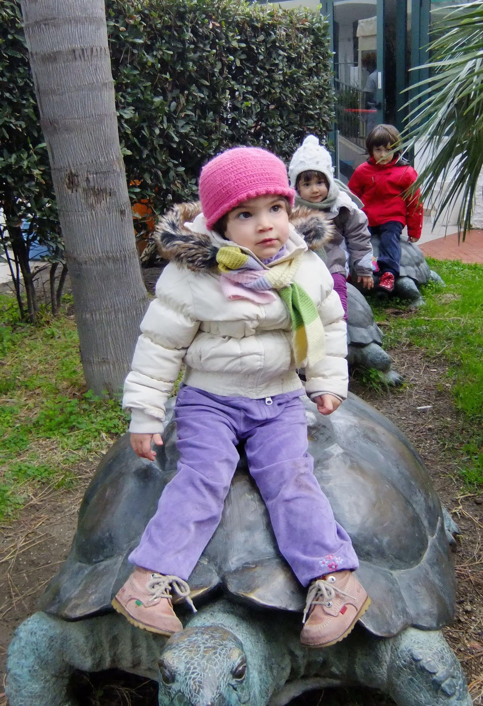
  
 
 

## Fotografi in erba...
*28-01-2011*

 
  
   Alcune prove...ben riuscite....(grazie Enrico!)
  
  

   
  
 
  

   
  
 
 

## Passioni 
*14-02-2011*

 
 
  
   I cavalli sono proprio la passione di Meggy! Veri...
  
  
   
  
  
   ... o finti che siano!
  
  
   
  
  
   ma anche i succhi di frutta!
  
  
   
  
 
 

## Carnevale
*15-02-2011*

 
  
   Siamo già a carnevale... e nonna Franca ci ha fatto i vestitini da Trilly! Così siamo andati a sfoggiarli al porto di Ostia insieme a Sofia, Marco, Flavio e Alessia.
  
  
   
  
  
   che bel tigrotto! (Margherita invece ha ancora i segni della brutta botta che ha preso al nasino)
  
 
  

   
  
 
  
   C'erano anche le giostrine...
  
  

   
  
 
  
   ma noi ci siamo divertiti di più a giocare con Monica!
  
  

   
  
 
 

## Mamma è tanto che non vediamo zia...
*21-02-2011*

 
  
   ...così ho disegnato lei e Morgan nel bosco...
  
  

   
  
 
 

## Ninne insieme
*28-02-2011*

 
  
   Ultimamente Marghe si sveglia la notte e mi chiama 'Vieni Mati', allora io le dico 'Meggy arrivo', scendo dal mio lettino a castello e la coccolo e poi ci riaddormentiamo insieme.
  
  

   
  
 
 

## Work in Progress
*14-03-2011*

 
  
   M ha portato P allo splendido concerto di Dalla e De Gregori, e conoscendo M l'ha fatto proprio per P!
  
  

   
  
  
  
   P ha cantato sempre, M ha pure ronficchiato, ma solo 5 minuti.
  
  
   Al prossimo concerto.
  
 

## Auguri Nat
*14-03-2011*

 
  
   Tanti auguri da Matilde e tutti noi
  
  

   
  
  
 

## zia giorgia, max e morgan ci vengono a trovare
*15-03-2011*

 
  
   ... e quante cose abbiamo fatto insieme!! Qui siamo in campagna!
  
  
   
  
  
   che mangiata di pescetti fritti!!
  
  

   
  
 
  
   poi una bella passeggiata al ruscello...hei Morgan che ne dici? ti tuffi?
  
  
   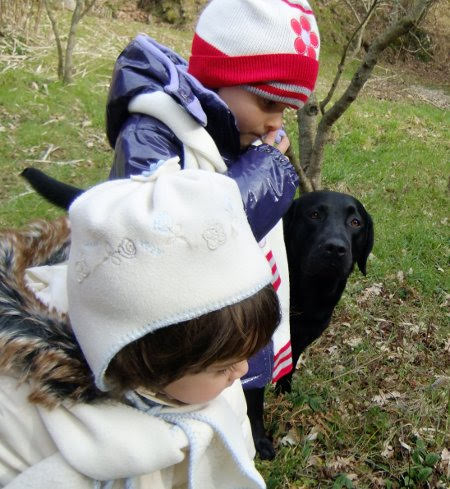
  
  
   eh si ...gli piace proprio l'acqua...
  
  

   
  
 
  
   e giocare con la palla!!
  
  

   
  
 
 

## AUGURI CATERINA!
*17-03-2011*

 
  

   
  
 
 

## 150 anni dell'Unità d'Italia!
*18-03-2011*

 
  
   Auguri ITALIA!!
  
  

   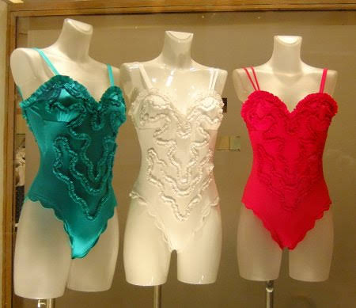
  
 
  
   Due gambette si aggirano sotto la pioggia...
  
  

   
  
 
  
   ... ma dove andranno?? ... alla mostra di Chagall!
  
  

   
  
 
  
   Matilde che è molto artista apprezza tutto
  
  

   
  
 
  
   .. a Margherita sono piaciute le mucche verdi e da buona 'lettrice' il libro di fiabe illustrate dal pittore...ma anche l'Ara Pacis in spalla a papy!
  
  

   
  
 
 

## Ponte verde (bianco e rosso)
*21-03-2011*

 
  
   Ci siamo presi 4 giorni di ponte e siamo stati in giro per prati! Qui da Alessia
  
  

   
  
 
  
   a giocare con la sua tartaruga
  
  

   
  
 
  
   e qui alla Caffarella con Anna
  
  

   
  
 
  
   che carina con le margherite sulle orecchie!!
  
  

   
  
 
 

## Auguri zia Betta!!
*22-03-2011*

 
  

   
  
 
 

## Villa Gregoriana a Tivoli
*28-03-2011*

 
 
 
  
   Per il compleanno di papy siamo andati a vedere questo posto bellissimo!
  
  
   Eravamo un mucchio di bimbi e grandi e ci siamo divertiti a correre tra grotte e cascate d'acqua !
  
  

   
  
 
 
  
   Ma cosa stavamo guardando tutti?
  
  

   
  
 
  
   l'arcobaleno!!
  
  

   
  
 
  
   Le piccoline, Margherita, Alessia e Caterina facevano a gara a chi stava più a cavalluccio!
  
  

   
  
 
  

   
  
 
  

   
  
 
  
   hei M&amp;P è stata proprio una bella giornata....
  
  

   
  
 
  
   e alla fine anche la tortina e la candelina !!
  
  

   
  
 
 

## Auguri papy 
*28-03-2011*

 
  
   .. o come ti chiamiamo adesso Mapi :)
  
  
   Un bacio grande ..... MMMMMA!!
  
  

   
  
 
 

## Ponte per il compleanno di mamy
*04-04-2011*

 
  
   Ci siamo presi venerdì di vacanza da scuole e lavoro e finalmente abbiamo ripreso Ronzinante!
  
  
   Meta Sabaudia, obiettivo mare e relax!
  
  
   Però SGRUNT .. c'è vento in riva al mare oggi ....
  
  

   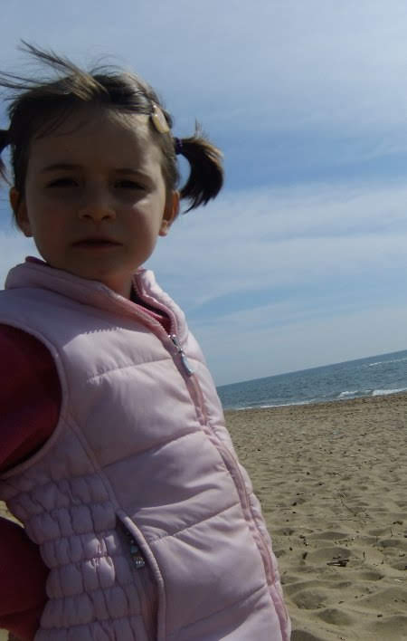
  
 
  
   ...ma almeno posso rotolare sulle dune lo stesso!! Guardate un pò!
  
  
   Poi una bella cenetta in camper e infine anche la torta! Auguri mamy!!!!
  
  

   
  
 
  
   E dopo una bella dormita coccolati dal rumore del mare la colazione ... e che vista!!!
  
  

   
  
 
  
   Oggi invece sembra proprio estate!
  
  

   
  
 
  
   e stiamo insieme ai nostri amici.... 'che vita de stenti' ... come direbbe mapy, in riva al mare, barbeque sulla spiaggia, mozzarelle di bufala e salsicce....vinello profumato... (grazie Ale per l'ombrellone!!)
  
  

   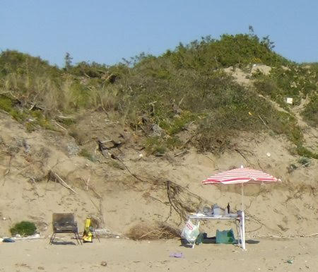
  
 
 
  
   e tanti giochi!!
  
  

   
  
 
  
   Insomma davvero un bel we!!! Ciao a tutti!
  
 

## Compleanno di nonno Gianni
*08-04-2011*

 
  
   Auguri nonno!
  
  

   
  
 
  
   e guarda che vallette a soffiare sulla tua torta!!
  
  

   
  
 
 

## Castello e principesse!
*11-04-2011*

 
  
   Questo we la principessa era Sophie! Gurdate che bella!
  
  

   
  
 
  
   Era pronta per la sua gara di ginnastica e io sono andata a vederla fino a Civitavecchia. Mi sono anche convinta che mi piace la ginnastica e voglio provare!
  
  
   Poi abbiamo dormito vicino al castello di Santa Severa. La mattina era tutto grigio... ma ci siamo fatte una bella partita a biliardino
  
  

   
  
 
  
   mentre Giorgio pescava .... e guardate un pò che cosa ha preso? 'Il pesce più grosso del mare' ha detto Marghe!
  
  

   
  
 
 

## Compleanno nonna Franca
*12-04-2011*

 
  
   Tanti auguri nonna!!!
  
  

   
  
 
 

## Alla fattoria con i miei compagni di scuola!
*18-04-2011*

 
 
  
   Oggi siamo andati nella fattoria dello zio di Stella a Trigoria. Che bel gruppone! Peccato che mancava Flavio che non stava bene (forse è allergico al posto .... essendo laziale! :D )
  
  
   
  
  
   'Che bel posto' ha detto Margherita, con tanti cavalli, capre, pulcini, cani! Abbiamo ingozzato di pane duro ed erba le caprette ....
  
  
   
  
  
   abbiamo mangiato tutti insieme ...
  
  

   
  
 
 
  
   e giocato sul prato!
  
  

   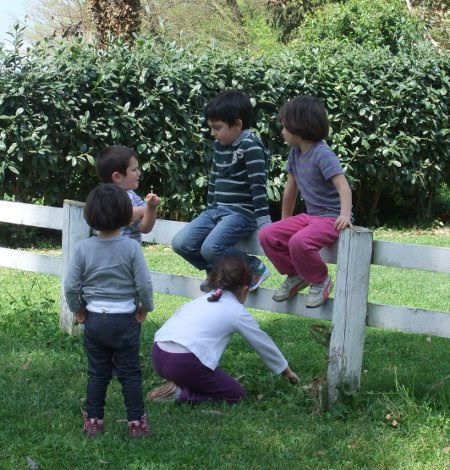
  
 
  
   Siamo stati proprio bene.... arrivederci alla prossima avventura!
  
  
   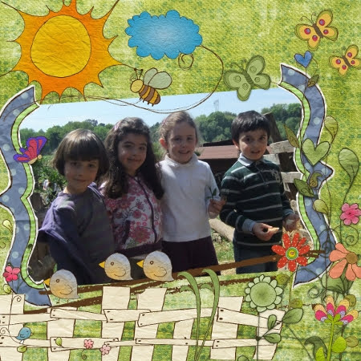
  
 
 

## Pasqua a Valdolmo
*25-04-2011*

 
 
  
   La mitica colazione di Pasqua alla marchigiana... uova, corallina, pizze dolci e salate, formaggi....
  
  
   
  
  
   e l'uovo di pasqua...che Marghe ancora non ha capito come si apre!!
   
  
  
   E per smaltire il tutto... grandi passeggiate al Piscibetto
  
  

   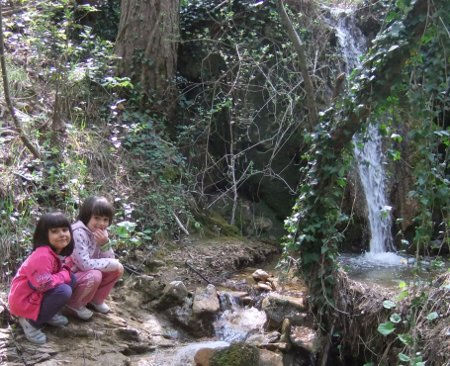
  
 
  
   con cugininetti e cuginoni
  
  

   
  
 
  
   Insomma eravamo proprio un bel gruppone!
  
  

   
  
 
  
   Ci siamo fatti tante risate
  
  

   
  
 
  

   
  
 
  
   e girotondi
  
  

   
  
 
  
   e ho anche imparato a fare il ponte! Guardate come sono brava??!!
  
  

   
  
 
 

## .. e M&P a Budapest
*08-05-2011*

 
  
   Ciao bimbe! Ce lo meritavamo proprio questo we soli soletti!
  
  
   Una bella passeggiata per la città in una giornata di sole...
  
  

   
  
 
  
   una serata mondana con cenetta romantica a base di gulash e a guardare le stelle sul ponte (c'era un ventoooo)
  
  

   
  
 
  
   Poi fontane strane e pioggia
  
  

   
  
 
  
   e un ottimo dolcetto per scaldarsi
  
  

   
  
 
  
   e infine tanto relax alle terme
  
  
   
  
  
   Ricaricati e pronti per ritornare dalle nostre meravigliose bimbe!
  
 

## Noi allo zoo(e)

....
*08-05-2011*

 
  
   Primo tentativo a buon fine! M&amp;P scappano a Budapest per un we romantico e noi ce ne stiamo con i nonni! Il programma è andare al bio parco ( o anche detto 'zoe' da Marghe)
  
  
   a vedere 'Gina' la giraffina nata da due mesi! Eccolaaaaa... sarà pure un cucciolo ma è alta 2 metri!
  
  
   
  
  
   ci sono anche la sua mamma e il suo papà!
  
  

   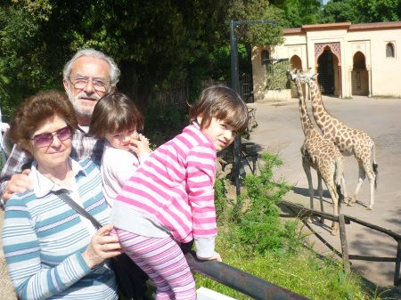
  
 
  
   Abbiamo visto tantissimi altri animali, elefanti, coccodrilli, scimpanzè, e tre buffi 'cosi'...li conoscete?
  
  

   
  
 
 
  
   Mentre facevamo merenda si è avvicinato un bellissimo BaBone (sempre come lo chiama Marghe)
  
  

   
  
 
  
   Peccato non aver visto i leoni che dormivano  :(
  
  
   Infine ce ne torniamo a casa felici e stanchissime dopo questa scorpacciata di animali! Arrampicate proprio come due scimmiette!
  
  

   
  
 
 

## Primo bagno
*16-05-2011*

 
  
   Il we promette bene così ce ne andiamo tutti al mare a Sabaudia.
  
  

   
  
 
  
   C'è molto vento ma anche un bel sole caldo, e anche se l'acqua è gelata facciamo tutti il bagno (tranne M che è freddolosa!)
  
  

   
  
 
  
   Abbiamo anche trovato dell'ottimo pesce fresco in cassetta!
  
  

   
  
 
 

## Prove di volo
*29-05-2011*

 
  
   Oggi andiamo a Tivoli a veder volare Francesco e Giusy.
  
  

   
  
 
  
   C'è chi è emozionato, chi scatta foto, chi si coccola ...
  
  

   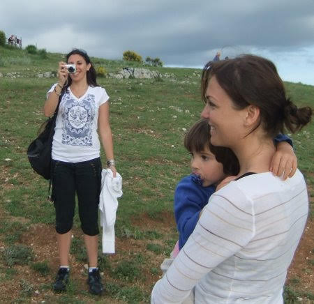
  
 
  
   ... chi volaaaa ...
  
  

   
  
 
  
   e chi si gode una bella giornata ...
  
  

   
  
 
 
 

## Compleanno di Alessia
*30-05-2011*

 
  
   La piccolina compie due anni !
  
  

   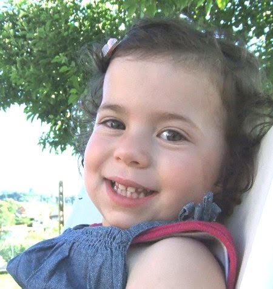
  
 
  
   e noi la festeggiamo proprio per bene, con un tuffo in piscina
  
  

   
  
 
  
   un pò di corse sul prato
  
  

   
  
 
  
   e una bellissima torta!
  
  

   
  
 
 

## Piccolo intoppo ... una clavicola rotta! 
*02-06-2011*

 
  
   Margherita la peste si è catapultata dal divanetto del camper (so' proprio pericolosi sti camper)
  
  
   e CRAC si è rotta la clavicola destra! :(
  
  

   
  
 
 

## Camperata!
*06-06-2011*

 
 
 
  
   L'armata Brancaleone dei camper è partita! Direzione nord alla ricerca del sole cercando di schivare i temporali!
  
  

   
  
 
  
   Eccoli tutti i bimbi finalmente al mare!
  
  

   
  
 
  
   Un pò di salti tra le onde
  
  

   
  
 
  
   tanti tanti giochi..
  
  
   
  
  
   la passione per le bocce ...
  
  

   
  
 
  
   un pò di relax alle terme di Venturina
  
  

   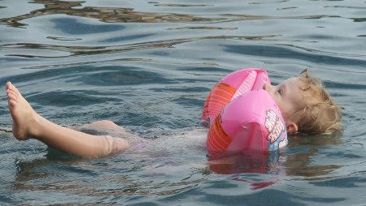
  
 
  
   qualche tuffo spettacolare
  
  

   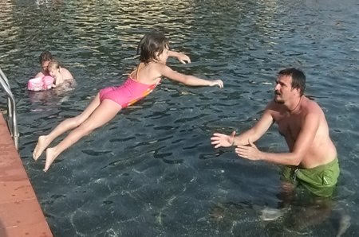
  
 
  
   un bel pezzo di pizza all'ombra ...
  
  
   
  
  
   e una foto di gruppo sul pattino!
  
  

   
  
 
  
   <strong>
    Nicole
   </strong>
   : la prossima vacanza vorrei che fosse uguale identica a questa!!
  
 

## Gita di fine anno con la classe di Marghe
*14-06-2011*

 
  
   alla fattoria degli animali! Una fetta di pane con l'olio e poi tutti a curiosare ... per mano con la maestra Assunta
  
  
   
  
  
   Ecco le gabbie dei coniglietti... sono morbidissimi e coccolosi...
  
  

   
  
 
  
   e anche un pò spaventati..
  
  

   
  
 
  
   Ma non lo mangia il pane la pecora??
  
  

   
  
 
  
   Mi pizzica con le unghiette la tartaruga!
  
  

   
  
 
 
  
   Marghe si scaccola...
  
  
   
  
  
   C'è un asinello di troppo nel recinto? Ma nooooo è la maetsra Adriana!
  
  

   
  
 
  
   C'è l'asinella con il suo cucciolo... e io le vado in groppa!
  
  
   
  
  
   Ciao a tutti! E' stata proprio una bella giornata!
  
  
   
  
 

## Il BBQ nuovo!
*14-06-2011*

 
  
   Comprato e subito inaugurato
  
  

   
  
 
  
   con un'ottima bruschetta e la carne della zia di Flavio...
  
  

   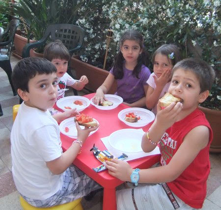
  
 
 

## Ultima festa di classe
*19-06-2011*

 
  
   La festa di compleanno di Stella è l'ultima occasione goliardica per vederci tutti insieme. E ci siamo divertiti tantissimo con autoscontri
  
  

   
  
 
  
   giostre
  
  

   
  
 
  
   gare di kart
  
  

   
  
 
  
   e torta tutti insime
  
  

   
  
 
  
   ... e poi tutti a mangiare la pizza!
  
  
   Marzia, Giova, Nicco, Flavio, Giulio, Genti, Valerio, che casino che abbiamo fatto al ristorante!!
  
  

   
  
 
 

## Motocicliste
*29-06-2011*

 
  
   Margheeeee non andare così veloce!!!
  
  

   
  
 
## Ultimo giorno di scuola
*29-06-2011*

 
  
   Ormai siamo proprio esausti!! Finalmente è finita la scuola!!
  
  
   Buone vacanze a tutti!
  
  

   
  
 
 

## Maggie !!!!!!!
*09-07-2011*

 
  
   Stiamo provando a togliere il pannolino, ma per il momento niente da fare.
  
  
   Ieri nonna Franca ha trovato Marghe con il pallocco di cacca ... mentre la portava al bagno per pulirla, magari pensando a come redarguirla "ma insomma Maggie ...", Margherita canticchiava tra se e se "Mamma mia, ho fatto cacca e non me ne sono accorta" ... ma quale redarguirla, la nonna ha ceduto in una fragorosa risata!
  
  
   Maggie, se vai avanti così il mondo è ai tuoi piedi, sei indistruttibile e ti vogliamo un mare di bene.
  
 

## Circeo
*16-07-2011*

 
  
   Anche quest'anno (grazie zia)
  
  
   passaimo un paio di settimane nella bellissima casa di zia Aldina al Circeo con nonno Mario, nonna Franca, Caterina e Raymond!!
  
  
   
  
  
   
  
  
   Ci divertiamo in giardino, al mare
  
  
   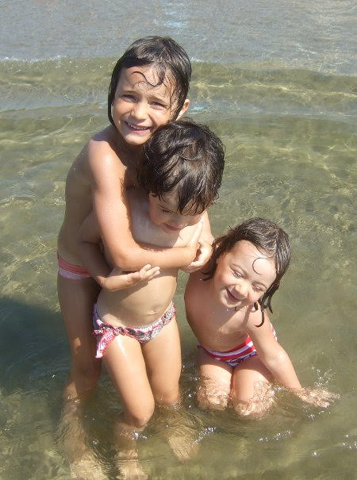
  
  
   
  
  
   
  
  
   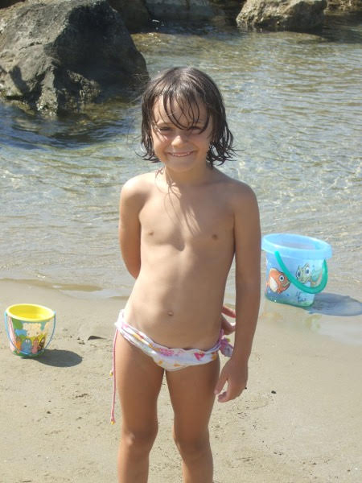
  
  
   al parco
  
  
   
  
  
   
  
  
   
  
  
   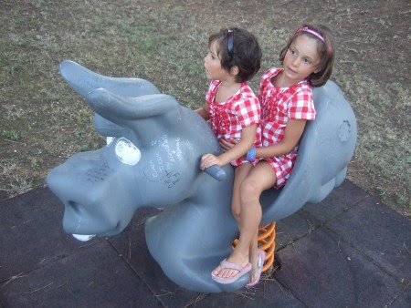
  
  
   al circo
  
  
   
  
  
   
  
 

## Primo scambio casa: Bretagna - Guidel
*15-08-2011*

 
  
   La nostra avventura dello scambio casa inizia con la Bretagna, precisamente a Guidel (Lorient)
  
  
   , con una famiglia di 5 persone, i Calloch.
  
  
   Partiamo dalla Liguria il 30 luglio e attraversiamo la francia del sud per poi risalire verso nord, percorrendo 1700 Km. Visitiamo dei bei posti come Avignon, dove margherita si unisce allo spettacolo degli artisti di strada, la costa da St. Pierre a Narbonne, Carcasson, la cittadina fortificata, Bordeaux. A Bordeaux troviamo una bellissima fontana notturna
  
  
   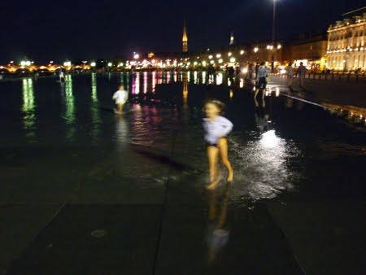
  
  
   Proseguiamo verso la costa e ci fermiamo vicino La Rochelle, a ChatèLaillon, uno spiaggione dove l'effetto della marea è molto forte. Arriviamo in tempo per vedere il prima...
  
  
   
  
  
   e il dopo... il un'ora il mare risale veloce, caldissimo e melmoso.... per la gioia dei bambini!!
  
  
   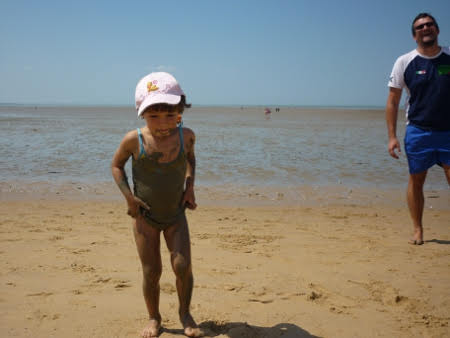
  
  
   .. meno male che papy reggeva il palo!!! Perchè man mano che saliva l'acqua lo spostavano!
  
  
   
  
  
   Poi abbiamo preseguito per Vannes, una cittadina di mare famosa per le mules frittes (cozze e patatine fritte)
  
  
   che ho molto apprezzato!
  
  
   
  
  
   e dei bei giochi
  
  
   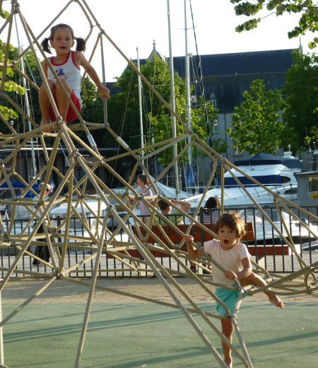
  
  
   Finalmente, intorno alla mezzanotte del 1 agosto, arriviamo a Guidel (soprannominato Frittole)
  
  
   , un gruppettino di tipiche case bretoni, con il tetto in ardesia, in cima ad una collina immersa nel buio. Niente male! Soprattutto le tre camerette dei bambini piene zeppe di giochi!
  
  
   <strong>
    2 agosto
   </strong>
   : colazione in giardino..
  
  
   
  
  
   spesa e passeggiata a Guidel plage, la spiaggia vicino casa, una piccola baia ventosa.
  
  
   
  
  
   <strong>
    3 agosto
   </strong>
   : ci svegliamo alle 10, qui c'è un silenzio e una tranquillità meravigliosi, si sente solo ogni tanto ragliare un asinello in lontananza! Oggi gita a Pont Aven, paesino pieno di gallerie d'arte (dubbia arte!)
  
  
   ,
  
  
   
  
  
   poi tappa al mare a Benodet e infine passeggiata, sotto una leggera e intermittente pioggerellina, a Concarneau.
  
  
   
  
  
   <strong>
    4 agosto
   </strong>
   : oggi piove (Matilde: non è giusto che qui piove sempre e i francesi a roma hanno sempre il sole!!!)
  
  
   e decidiamo di andare a Brest a visitare Oceanopolis.
  
  
   <strong>
    5 agosto
   </strong>
   : andiamo a trovare Sophie e Nicole che sono qui vicino a La Baule. Vediamo il terreno dove la zia ha la 'capanna'
  
  
   
  
  
   e poi giretto con crepes e artisti di strada nel bel paesino di Guerande (chi riesce a vedere dove siamo sedute?)
  
  
   
  
  
   <strong>
    6 agosto
   </strong>
   : relax a casa, chi legge, chi gioca, chi si diverte a fare acconciature buffe....
  
  
   
  
  
   
  
  
   e infine cena con granchio! Che buone le chele!
   <strong>
   </strong>
  
  
   
  
  
   <strong>
    7 agosto
   </strong>
   : andiamo al Festival Interceltico di Lorient. Ci sono tantissime persone con i costumi tradizionali e le cornamuse.
  
  
   
  
  
   poi prendiamo un'acquazzone fortissimo e corriamo alla macchina e poi a casa! Pomeriggio passeggiata alla spiaggia di Guidel a giocare con le alghe e a cercare conchiglie..
  
  
   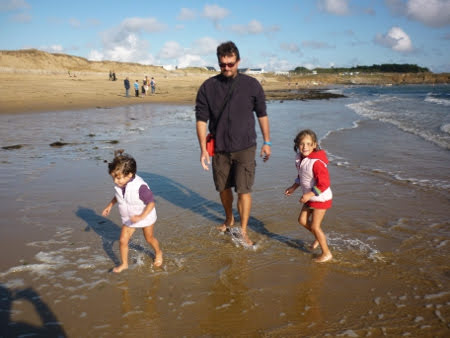
  
  
   <strong>
    8 agosto:
   </strong>
   gita alla penisola di Crozon, tappa a Morgat, dove facciamo un giretto in barca e poi relax su uno spiaggione, infine a Camaret, dove troviamo un albergo con jacuzzi all'aperto e stiamo a mollo noi 4 fino al tramonto.
   <strong>
   </strong>
   Cenetta in un posto molto chic dove mangiamo divinamente, ostriche, conchiglie di s. jaques ...
  
  
   <strong>
    9 agosto:
   </strong>
   colazione in camera con panorama sul porticciolo di Camaret e poi passeggiata bellissima sulla spiaggia
  
  
   
  
  
   .. dove lasciamo il segno del nostro passaggio ....
  
  
   
  
  
   ...e poi un'affaccio sulla scogliera ..
  
  
   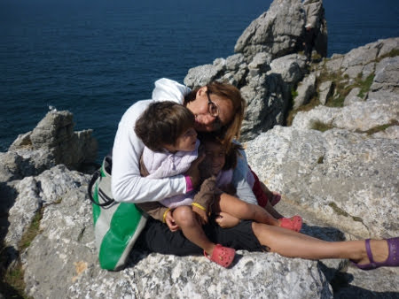
  
  
   a meditare ....
  
  
   
  
  
   <strong>
    10 agosto
   </strong>
   : oggi sole e caldo!! Dacidiamo di andare a Bell'Ile ... ma tutti i traghetti sono pieni, così ce ne andiamo al mare in uno spiaggione sull'istmo di Quiberon. Facciamo anche Gina di sabbia (una giraffa)
  
  
   
  
  
   <strong>
    11 agosto
   </strong>
   : pioviggina, prepariamo le lasagne al forno per i francesi e poi andiamo a vedere uno zoo bellissimo! Marghe ed io abbiamo dato da mangiare alle giraffe...
  
  
   
  
  
   accarezzato le tartarughe
  
  
   
  
  
   visto lo spettacolo delle otarie e del 'leone marino del mare'!
  
  
   <strong>
    12 agosto
   </strong>
   : si ritorna verso casa ... ciao Francia e ciao 'casa dei francesi' ci siamo davvero divertite!!
  
  
   
  
 

## Valdolmo
*30-08-2011*

 
  
   La seconda metà di agosto la passiamo a Valdolmo. Ci sono tantissimi amici e ci devertiamo tra passeggiate sul monte
  
  
   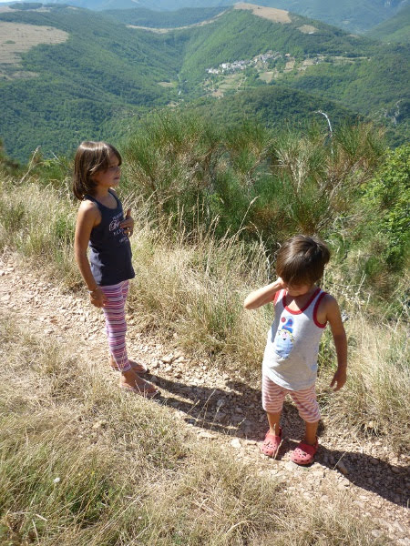
  
  
   con defaticamento
  
  
   
  
  
   bagni nei laghetti
  
  
   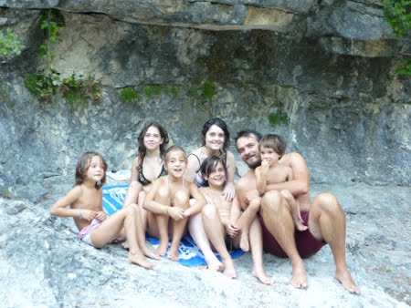
  
  
   pranzi e cene
  
  
   
  
  
   con amici e parenti
  
  
   
  
  
   e nottate a suon di musica e risate
  
  
   
  
 

## Zoomarine
*07-09-2011*

 
  
   Per il compleanno di Matilde andiamo tutti a Zoomarine con Flavio, Caterina, Marzia e Martina.
  
  
   
  
 

## 7 settembre: auguri MATILDE!!!!
*08-09-2011*

 
  
   
  
 

## Primo giorno di scuola
*13-09-2011*

 
  
   12 settembre ore 9: primo giorno di scuola materna per Margherita!
  
  
   
  
  
   all'inizio è un pò imbronciata, ma dopo entrata in classe trova un cassetto pieno di animali ed è felicissima!
  
  
   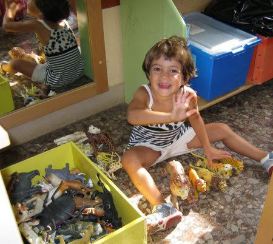
  
  
   Matilde, ormai veterana della materna, saluta con un pò di tristezza i compagni che quest'anno vanno in prima elementare
  
  
   
  
  
   e si coccola com mapi!
  
  
   
  
 

## 23 settembre: auguri Margherita!
*24-09-2011*

 
  
   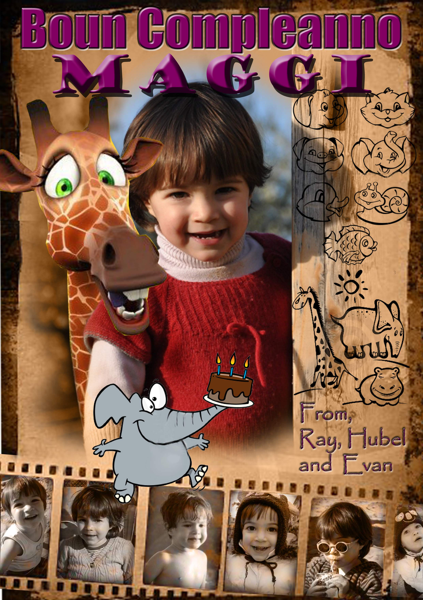
  
  
   Margherita __o_,
   <em>
    come
   </em>
   dicevan
   <em>
    tutti
   </em>
   ,_ Maggy ... (un bel regalo di raymond)
  
 

## Tre we a Sabaudia
*27-09-2011*

 
  
   Dato il poco mare di queste vacanze estive e l'insolito mese di settembre con temperature altissime ci prendiamo una bella abbronzatura a Sabaudia per ben tre we di fila!! Viene anche Flavio con la sua famiglia a passare una notte avventurosa in camper, e tanti amici di passaggio!
  
  
   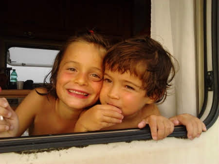
  
  
   
  
  
   
  
 

## FestE di compleanno
*02-10-2011*

 
  
   Festeggiamo insieme la nostra festa di compleanno al Parco del Canale dello Stagno, insieme a tanti amici.
  
  
   Si va in giro per il parco, sui giochi, sui tappetoni elastici
  
  
   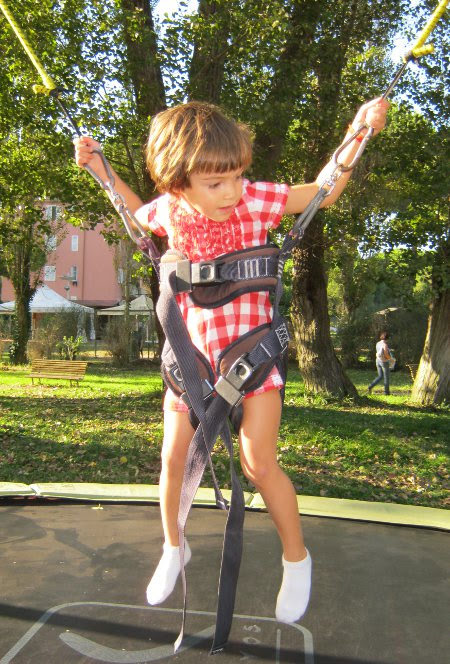
  
  
   sui pony
  
  
   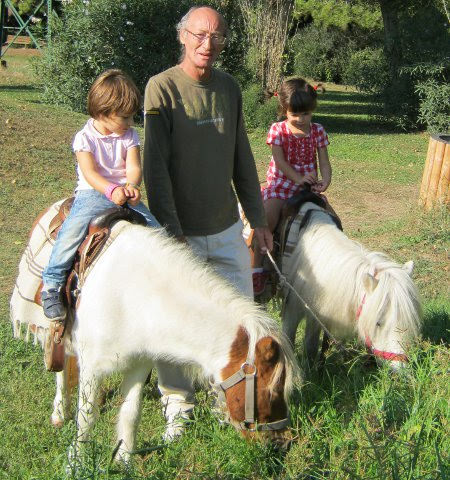
  
  
   e infine si soffiano le candeline ...
  
  
   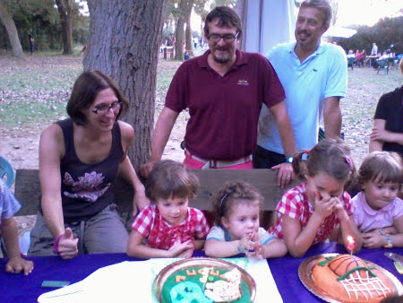
  
  
   ma aspettate un attimo ...avete notato che torte??
  
  
   La mia in onore del nuovo sport che ho iniziato a praticare, il basket
  
  
   
  
  
   e quella di margherita un tributo alla sua più grande passione, le giraffe
  
  
   
  
  
   grazie M&amp;P e Monica!
  
  
   E infine un confusionario 'scarta la carta' con tanti bellissimi regali
  
  
   
  
 

## In bici tutti e 4
*03-10-2011*

 
  
   E' arrivato finalmente il momento tanto atteso da M&amp;P ... andare in giro in bici tutti e 4 insieme!
  
  
   Usciamo da casa, gli ultimi ritocchi
  
  
   
  
  
   e via nel parco della caffarella
  
  
   
  
  
   
  
 

## Il matrimonio dell'anno: Cicia ed Emanuele
*09-10-2011*

 
  
   <strong>
    Come tutto ebbe inizio ...
   </strong>
  
  
   
  
  
   
  
  
   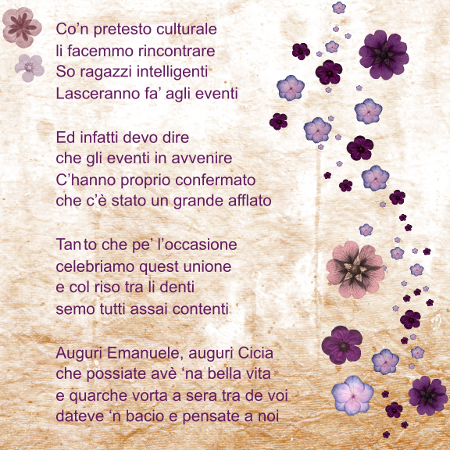
  
  
   ... e così arrivò il fatidico giorno...
  
  
   
  
  
   ... i preparativi iniziano all'alba ... la bellissima sposa nel suo migliore LATO A
  
  
   
  
  
   ... e LATO B (wow!!)
  
  
   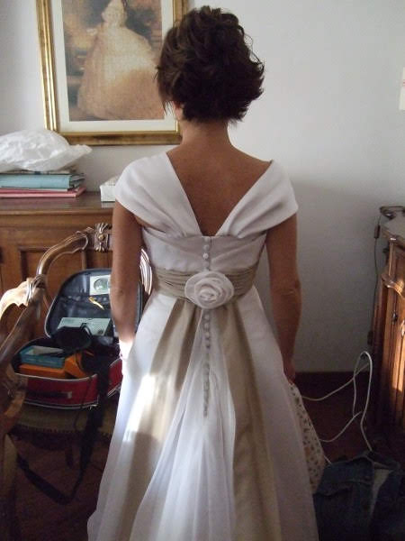
  
  
   ... tutti pronti, anche mamma Angela e papà Raffaele
  
  
   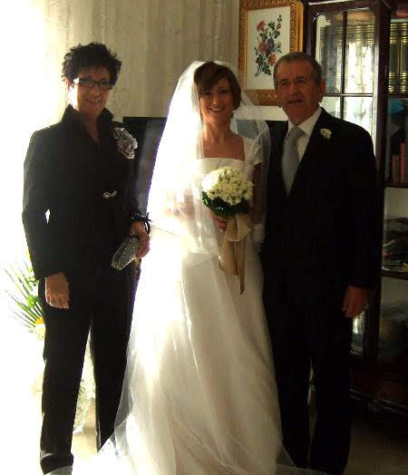
  
  
   ... il taglio del nastro sulla porta di casa ...
  
  
   
  
  
   e poi di corsa (troppo)
  
  
   in chiesa, dove la aspetta un trepidante ma sereno Emanuele e gli emozionatissimi mamma Aldina e papà Erino
  
  
   
  
  
   Eccola al suo ingresso in chiesa, accompagnata da quattro bellissime damigelle
  
  
   
  
  
   che hanno atteso
  
  
   
  
  
   il momento magico della promessa .... lo sposo tentava di infilare l'anello nel dito sbagliato e poi con una bella e spontanea risata ha ammesso di non saper fare due cose insieme!!!
  
  
   
  
  
   ... eccoli infine marito e moglie ... meravigliosamente felici ...
  
  
   
  
  
   .. e romantici
  
  
   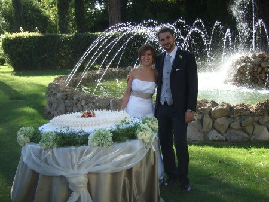
  
  
   Siamo tutti contenti per loro! Eleonora e Toni
  
  
   
  
  
   M&amp;P
  
  
   
  
  
   la nostra famiglia al completo
  
  
   
  
  
   e le piccole truccate da dinosauro
  
  
   
  
  
   farfallina
  
  
   
  
  
   e tigrotto
  
  
   
  
  
   Infine il nostro regalo .... con tutto il cuore e l'affetto possibile!!
  
  
   Un enorme augurio di una vita felice!
  
  
   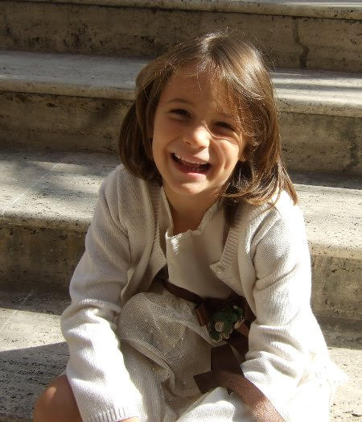
  
 

## Pittrici e cicliste
*17-10-2011*

 
  
   Sabato ci vediamo con Alessia e giochiamo alle pittrici! Prepariamo tutto per bene ....
  
  
   
  
  
   e dopo cinque minuti siamo ridotte così!!!
  
  
   
  
  
   Mati invece ha fatto un bellissimo disegno!
  
  
   
  
  
   E poi domenica tutti in bici alla Caffarella!!!
  
  
   
  
  
   Che buona la ricotta ancora calda ....
  
  
   
  
  
   e poi una bella partita a basket! Grazie Enrico che ci hai aiutato a montare il canestro e a fare le schiacciate!!
  
  
   
  
 

## Mapy fa il bagno con i delfini!
*30-10-2011*

 
  
   Eccoci qui, di nuovo a Zoomarine, ad accompagnare mapy a fare il bagno con i delfini! Che giornata bellissima e che caldo!
  
  
   
  
  
   Eccolo che si coccola con il delfino MARCO
  
  
   e poi si fa un giro sulla tavoletta spinto dai delfini
  
  
   BRAVO PAPY!!!!
  
  
   E noi ci godiamo il parco... girando fra gli amati dinosauri
  
  
   
  
  
   e l'atmosfera di Halloween!
  
  
   
  
  
   
  
 

## ... e anche qui è arrivato Halloween!
*01-11-2011*

 
  
   Le zucche non le abbiamo ma ce le facciamo da sole....
  
  
   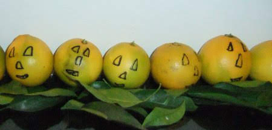
  
  
   poi Mapy mi trucca per la festa...
  
  
   
  
  
   eccomi sono la strega dei ragni!! Che paura!!
  
  
   
  
 

## Valdolmo 
*13-11-2011*

 
  
   Questo we siamo andati a Valdolmo che zia Iole ha pronti 70Kg di carne per noi!! Eccoci la sera davanti al caminetto! Che relax!
  
  
   
  
  
   Poi siamo andati a Fabriano ad aspettare Chiara e Davide alla mostra di funghi...
  
  
   
  
  
   ecco le nostre firme ...
  
  
   
  
  
   e poi tutti a mangiare le fettuccine ai funghi .. e nell'attesa si disegna ..
  
  
   
  
  
   Poi tutti nella stalla e a raccogliere i funghi
  
  
   
  
  
   E infine a casetta con una bella braciolata e un pò di coccole!
  
  
   
  
  
   E domenica passeggiata a Fonte Avellana, pranzo alle Cafanne (con annesso bagno nel fiume!!!)
  
  
   e altra puntata alla stalla con tanto di ovetto fresco (e un buon zabaione)
  
  
   per tutti i bimbi!!
  
  
   Alla prossima vacanza tutti insieme (sempre con i miei dinosauri)
  
  
   !!
  
  
   
  
 
s

## Coccole.... mamma fammi tante coccole!!
*26-11-2011*

 
  
   
  
 

## Cena a lume di candela
*04-12-2011*

 
  
   E' saltata la luce, ma in realtà ci piace proprio quest'atmosfera!
  
  
   
  
 

## Assisi, Fano e il caminetto di Valdolmo
*12-12-2011*

 
  
   Per il ponte dell'Immacolata ci prendiamo 4 giorni di vacanza e partiamo! Visitiamo Assisiin una giornata magnifica di sole
  
  
   
  
  
   
  
  
   dove c'è un presepe enorme
  
  
   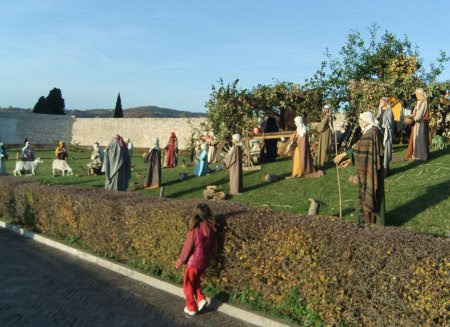
  
  
   e noi giochiamo con papy
  
  
   
  
  
   e ci coccoliamo con M
  
  
   
  
  
   Con M visitiamo anche la tomba di S.Francesco. C'è tanta gente in silenzio che prega e le candele .. quest'atmosfera mistica mi affascina!
  
  
   E poi all'uscita ...ma questa bambina la conosciamo vero Marghe?? Eh si! E' Sofia!!!
  
  
   
  
  
   Dopo Assisi andiamo a Valdolmo. Poi i giorni dopo una passeggiata a Fratterosa, a Fano al mare ... ma è tutto grigio ...
  
  
   
  
  
   .. però una bella mangiata di pesce ..
  
  
   
  
  
   e un pò di ginnastica!
  
  
   
  
 

## Che ninne!!
*19-12-2011*

 
  
   In questi giorni ci facciamo delle dormite ....
  
  
   
  
 

## BUONE FESTE A TUTTI!
*23-12-2011*

 
  
   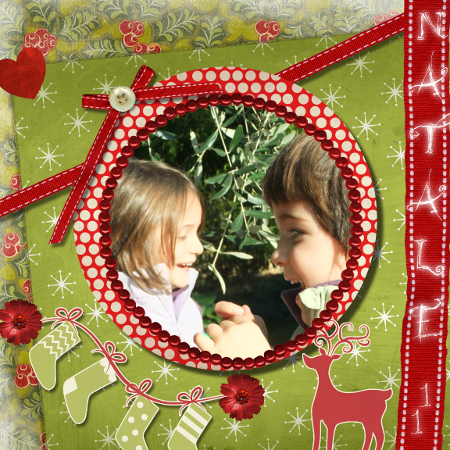
  
 

## Vacanze di Natale
*27-12-2011*

 
  
   Iniziano col cenone della vigilia a casa di zia Betta e Cate. Ci mascheriamo per non farci riconoscere da Babbo Natale....
  
  
   
  
  
   ma lui è entrato lo stesso di nascosto ... e ...sorpresa ...
  
  
   
  
  
   ci ha portato tanti regali!!
  
  
   Poi siamo state un pò con zia Giorgia e Morgan
  
  
   
  
  
   a spasso alla Caffarella e alla villa
  
  
   
  
  
   ci siamo coccolate morghi
  
  
   
  
  
   (o meglio Marghe gli ha dato il tormento!!)
  
  
   
  
  
   siamo state al circo con Raymond e ci sono piaciuti tanto i serpenti e i coccodrilli
  
  
   
  
  
   siamo andate al mare con Cate in una bellissima giornata di sole
  
  
   
  
  
   e abbiamo giocato a più non posso
  
  
   
  
  
   poi da Iacchelli in una grigia ed umida giornata
  
  
   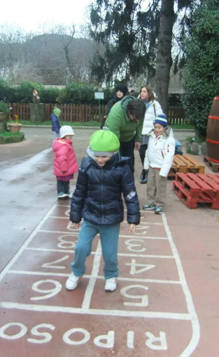
  
  
   che però a noi bimbi piace lo stesso
  
  
   
  
  
   perchè nelle nostre testoline tramiamo sempre qualcosa...
  
  
   
  
  
   Poi alla mostra dei Dinosauri
  
  
   
  
  
   dove abbiamo anche scavato nella sabbia per cercare le ossa, da brave mini-paleontologhe!
  
  
   
  
 

