# 2012

## Capodanno a Farnese
*03-01-2012*

 
  
   Eccoci qui tutti insieme a Farnese in un casale tutto per noi! E siamo tanti ...
  
  
   
  
  
   Dona, Edilio con Matteo, Chicca e Tato
  
  
   
  
  
   Nathalie, Enrico, Paola, Laura, Alessandro con Nicole, Sophie, Chiara e Davide
  
  
   
  
  
   
  
  
   Mara, Lorenzo e Alessia
  
  
   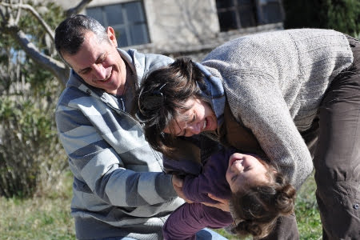
  
  
   Emanuela, Giorgio e Anna
  
  
   
  
  
   M&amp;P con Matilde e Margherita!
  
  
   
  
  
   Proprio un bel gruppone!! E che giornata di sole il 1 gennaio!
  
  
   
  
  
   Tutti i bimbi scartano gli ultimi regali di babbo natale
  
  
   
  
  
   e si gioca e si mangia al sole!
  
  
   
  
  
   Proprio un bell'inizio anno!
  
 

## Chi mangia pizza a capodanno ...
*06-01-2012*

 
  
   Si sa, la vita del pizzettaro è dura, mentre tutti si divertono e mangiano, lui lavora indefesso ...
  
  
   [
   
  
  
  
   e come vedete, Lorenzo, il nostro meglio pizzarolo de li castelli, non si risparmia. Infatti il risultato è eccellente
  
  
   [
   
  
  
  
   e allora, tramandiamo ai posteri l'infallibile ricettadi Lorenzo, in ben due versioni: alla teglia e al forno.
  
  
   <strong>
    Pizza in teglia
   </strong>
   30% farina 00
30% farina rimacinata di grano duro
40% farina di manitoba (in alternativa farina 0)
  
  
   25g di lievito di birra per kg di farina
1000 ml acqua tiepida ogni kg di farina
3/4 bicchiere acqua olio di oliva per kg di farina
2 cucchiai rasi di zucchero per kg di farina
2 cucchiai rasi di sale per kg di farina
  
  
   miscelare farina zucchero e sale in contenitore che contenga piu' del doppio della massa (lievita)
  
  
   scaldare l'acqua e scioglierci il lievito, successivamente aggiungere l'olio
girare il tutto nel contenitore con un cucchiaio fino a rendere l'impasto omogeneo (5 minuti)
  
  
   lasciare lievitare l'impasto per almeno un'ora e mezza coperto da un telo di stoffa in ambiente con tempertura non inferiore a 20 gradi
preparare la teglia unta abbondantemente di olio d'oliva
utilizzando abbondante farina 00 per rendere l'impasto lavorabile (sara' molto fluido)
  
  
   stenderlo nella teglia e lasciarlo riposare per un'altra ora e mezza
infornare alla temperatura piu' alta possibile del forno condita con solo pomodoro, olio d'oliva e sale
successivamente (15/20 minuti)
  
  
   aggiungere tutti gli altri condimenti
  
  
   <strong>
    Pizza in forno
   </strong>
   30% farina 00
30% farina rimacinata di grano duro
40% farina di manitoba (in alternativa farina 0)
  
  
   25g di lievito di birra per kg di farina
500 ml acqua tiepida ogni kg di farina
3/4 bicchiere acqua olio di oliva per kg di farina
2 cucchiari rasi di zucchero per kg di farina
2 cucchiai rasi di sale per kg di farina
  
  
   miscelare farina zucchero e sale in contenitore che contenga piu' del doppio della massa (lievita)
  
  
   scaldare l'acqua e scioglierci il lievito, successivamente aggiungere l'olio
impastare il tutto nel contenitore e lavorare il tutto per almeno 15 minuti con le mani
regolare la miscela di farina e acqua per ottenere la giusta consistenza attenzione se troppo dura e' complicato renderla soffice. conviene mantenere 2 pugni di miscela separati per aggiungerla successivamente.
lasciare lievitare l'impasto per almeno due ore coperto da un telo di stoffa in ambiente con tempertura non inferiore a 20 gradi
  
  
   [
   
  
  
  
   GRANDE LORENZO !!!!!!!!!!!!!!
  
 

## Befana in sella!
*08-01-2012*

 
  
   Mitica giornata! La prima vera passeggiata tutti e 4 in bici ... anche Margherita con le sue rotelle ...
  
  
   
  
  
   ... e non poteva che essere in una bellissima via dei fori imperiali chiusa al traffico!
  
 

## Perle di Maggie
*09-01-2012*

 
  
   [
   
  
  
  
   Di tanto in tanto, maggie elargisce perle di saggezza. Le due più recenti sono:
  
  
   Guadrando M con occhi languidi e naso moccioloso "soffro di allegria!" ... immagino si riferisse all'allergia, ma mi piace pensare che realmente "soffra" di allegria.
  
  
   La vigilia di Natale a casa di zia Betta, le bimbe giocavano in cameretta. Zia entra e le trova tutte abbracciate, chiede: "tutto apposto, sentite freddo?". Maggie: "no zia, è una valanga romantico!"
  
  
   Ve la immaginate adolescente? ... che paura!
  
  
   ndr: nel linguaggio di Maggie, le z si leggono s, le v si leggono b e le s hanno una lieve zeppola
  
 

## Il mare..
*22-01-2012*

 
  
   anche a gennaio è bellissimo! C'è chi si rilassa ..
  
  
   
  
  
   e c'è chi ne rimane affascinato!
  
  
   
  
 

## La neve a roma!
*05-02-2012*

 
  
   Stamattina ci siamo svegliati ed era tutto bianco! Ha fatto tantissima neve!
  
  
   Abbiamo indossato le tute da neve e subito in giardino a fare un bel pupazzo!
  
  
   
  
  
   
  
  
   
  
  
   fuori c'è un incredibile silenzio!
  
  
   Usciamo a piedi con il nostro slittino .. il motorino di mamma è tutto coperto di neve e anche le macchine!
  
  
   
  
  
   questa la situazione della nostra strada
  
  
   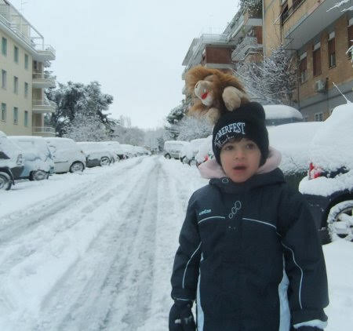
  
  
   e adesso tutti alla Caffarella a vedere l'incredibile spettacolo di questa straordinaria nevicata! Questo il nostro parco giochi ...
  
  
   
  
  
   e la vallata
  
  
   
  
  
   facciamo la farfallina nella neve
  
  
   e poi tutti a scivolare con lo slittino
  
  
   che risate!!
  
  
   
  
  
   sono venuti pure i nonni!
  
  
   
  
  
   e Flavio e Niccolò
  
  
   
  
  
   e abbiamo fatto un super pupazzo (anche se laziale!)
  
  
   
  
  
   eccoci qui tutto il gruppone!
  
  
   
  
  
   che bella giornata!!!
  
  
   
  
 

## Carnevale
*13-02-2012*

 
  
   Un pò di fantasia, due colpi di forbice ed eccoci qui con le nostre belle mascherine di carnevale!
  
  
   Margherita (Barbabella)
  
  
   , Matilde (fatina)
  
  
   , Caterina (gatto)
  
  
   , Lorenzo (robin hood smascherato)
  
  
   
  
  
   poi Flavio (Super-F)
  
  
   e Massimo (Super Barboz)
  
  
   
  
  
   e Martina (pirata)
  
  
   
  
  
   bye bye
  
  
   
  
 

## Lucca e Viareggio
*21-02-2012*

 
  
   M&amp;P avevano bisogno di un pò di evasione... o come ha detto Matilde alla sua maestra 'avevano bisogno di stare un pò da soli!' ...e così si parte alla volta di Lucca per festeggiare i nostri 10 anni insieme!
  
  
   Bellissima città e nonostante la pioggia l'abbiamo girata in lungo e in largo, la cattedrale, i vicoletti con le bancarelle dell'antiquariato, la passeggiata lungo le mura ....
  
  
   'Aspetta che sento cosa fanno le bimbe' ...
  
  
   
  
  
   'stanno benissimo, sono al Bio Parco' !!
  
  
   E così ce ne andiamo anche a Viareggio per vedere la famosa sfilata dei carri capitanata da Burlamacco.
  
  
   
  
  
   Ovviamente ogni cosa ci fa pensare a loro.... soprattutto il carro con il T-Rex e i Velociraptor... 'bimbe sareste impazzite'!!
  
  
   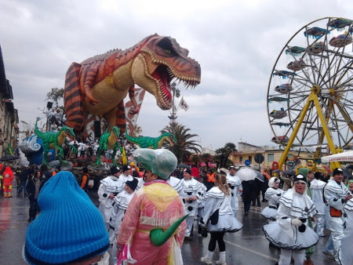
  
  
   Ma ci sono anche tanti spunti comico-amari sulla nostra povera italia ... la fuga di cervelli con il caro Leonardo che ci saluta
  
  
   
  
  
   la nave dell'europa che affonda e il Berlusca che si chiede 'ma dove è la crisi?'
  
  
   
  
  
   Insomma un bellissimo we di libertà! ;)
  
 

## Arriva la primavera?
*05-03-2012*

 
  
   Approfittiamo del bel we primaverile per fare un pic-nic e passeggiata a villa Borghese con Alessia ...ovviamente non poteva mancare un giro sul risciò
  
  
   
  
  
   Papy continuava a urlare che eravamo pericolosi...ed effettivamente guidava Matilde!!!
  
  
   
  
  
   Poi abbiamo fatto la scalinata di piazza di spagna
  
  
   
  
  
   e un pò di foto tutti insieme
  
  
   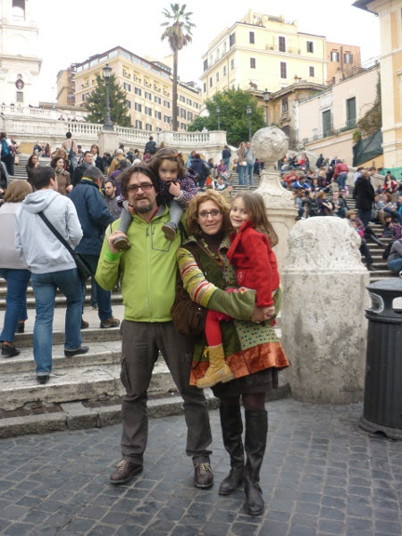
  
  
   anche mara e lorenzo
  
  
   
  
 

## Matrimonio di zio Angelo e Leda
*06-03-2012*

 
  
   Eccoci tutti emozionati ad aspettare il matrimonio a villa Lais, papy nonna e nonnanonna
  
  
   
  
  
   noi 4
  
  
   
  
  
   M&amp;M
  
  
   
  
  
   M&amp;M con Caterina e zia Betta
  
  
   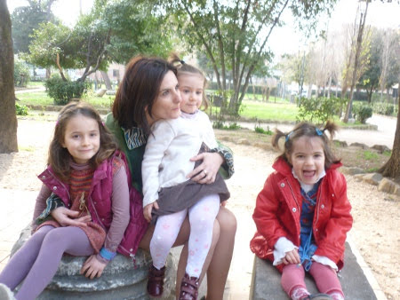
  
  
   e infine gli sposi!!!
  
  
   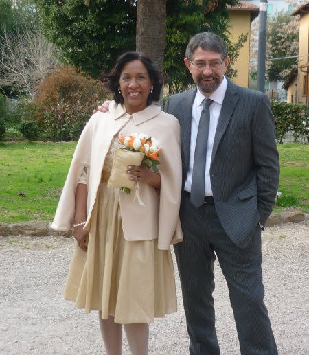
  
  
   
  
  
   Tanti auguri!!!! e poi tutte sullo scivoloooooo
  
  
   
  
 

## Settimana bianca 
*18-03-2012*

 
  
   Finalmente si parte per la tanto attesa settimana sulla neve! Il viaggio è un pò lungo, dobbiamo arrivare fino ad Alpe di Siusi (Bolzano)
  
  
   , ma sappiamo come passare il tempo!
  
  
   
  
  
   La mattina dopo tutti sull'ovovia per la nostra prima giornata sulle piste!
  
  
   
  
  
   Ci prepariamo e via ...
  
  
   
  
  
   Marghe inizia la scuola sci ma mangia la neve e fa quello che le pare...così la maestra (crucca)
  
  
   la spedisce al kinder garden!
  
  
   Mati invece inizia il suo corso di 1 livello con il maestro Andreas
  
  
   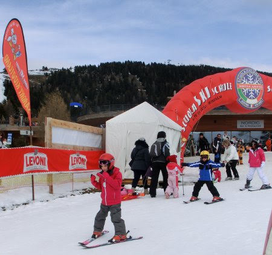
  
  
   ... e noi genitori ce ne andiamo in giro per le piste a goderci il sole, la neve e bellissimi paesaggi ... che vita faticosa!!!!
  
  
   
  
  
   
  
  
   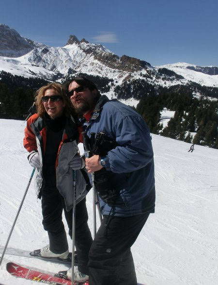
  
  
   Poi all'ora di pranzo ci ritroviamo tutti insieme al campo scuola
  
  
   
  
  
   e si va a mangiare
  
  
   
  
  
   e dopo relax, giochi
  
  
   
  
  
   un pò di peppa pig nel fango
  
  
   
  
  
   qualche altra sciata
  
  
   
  
  
   
  
  
   un pò di discese con gli slittini
  
  
   e a fine giornata una bella birretta!
  
  
   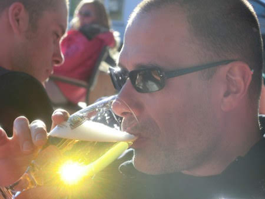
  
  
   Infine si torna a casa (che sonno sull'ovovia vero maggy?!)
  
  
   , si fa un tuffo in piscina, cena e a ninna che il giorno dopo si ritorna sugli sci!
  
  
   
  
  
   E che bei sonni profondi queste bimbe! Bhè ragazzi la montagna stanca!
  
  
   
  
  
   L'ultimo giorno della settimana gli gnometti Flavio (detto Flacio)
  
  
   , Matilde, Andrea e Matteo fanno anche la gara! Che grinta Falvietto!!
  
  
   
  
  
   e che stile Mati!!
  
  
   
  
  
   E poi la premiazione con il maestro e la tanto attesa medaglia!
  
  
   
  
  
   E' stata davvero una bellissima vacanza! Grazie Mapy che hai insistito per andare e Paola, Massimo, Flavio, Andrea, Riccardo, Laura, Enrico, Matteo, Andrea e Francesco per averci sopportati!
  
 

## Buon Compleanno Mapy!
*28-03-2012*

 
  
   Tanti aguri al nostro papone speciale, detto anche Mapy, col baffo alla panna e degli splendidi occhialini!
  
  
   
  
 

## Raccolta fondi e festa di primavera
*01-04-2012*

 
  
   Per la serie 'ogni occasione è bona pe magnà' .... ci vediamo tutti in campagna per un festone di raccolta fondi e per festeggiare un pò di compleanni primaverili ...
  
  
   Ci si rilassa prima dell'arrivo degli amici
  
  
   
  
  
   Si chiacchera
  
  
   
  
  
   si colora
  
  
   
  
  
   si gioca alla caccia al tesoro .... il primo indizio è nascosto vicino al camper ....
  
  
   
  
  
   e il prossimo?
  
  
   
  
  
   l'ha trovato Margherita!!!
  
  
   
  
  
   Poi la corsa nei sacchi
  
  
   
  
  
   la pentolaccia da rompere col bastone (in realtà era un canovaccio pieno di foglie secche)
  
  
   
  
  
   e infine la torta!!
  
  
   
  
  
   Ragazzi abbiamo raccolto anche un bel gruzzoletto...speriamo di riuscire ad arrivare alla quota per il pozzo in Africa!
  
 

## Auguri mamish
*02-04-2012*

 
  
   Per il tuo compleanno ti portiamo a spasso tra le peonie di Vitorchiano!
  
  
   
  
  
   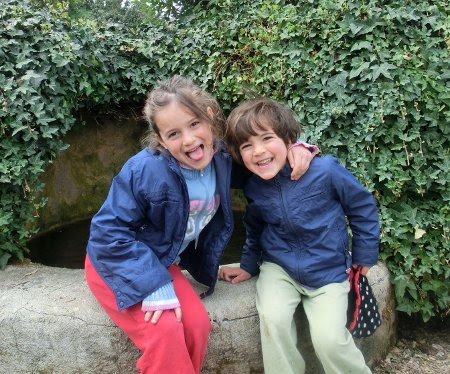
  
 

## Vacanze di pasqua
*10-04-2012*

 
  
   Le nostre vacanze itineranti iniziano con una tappa a Valdolmo per un saluto ai nonni e ad un pò di parenti e poi ci vediamo con Giorgio, Manu ed Anna al mare, in quel di Fano. Ci facciamo una bella passeggiata e una mangiata di pesce vicino al mercato
  
  
   
  
  
   e poi dritti in spiaggia a provare le nuove canoe gonfiabili! Certo c'è un pochino di vento e le valvole non sono dalla nostra parte....
  
  
   
  
  
   ma alla fine riusciamo a gonfiarle e via al varo in mare!
  
  
   
  
  
   mati e mapi
  
  
   
  
  
   g&amp;m&amp;a
  
  
   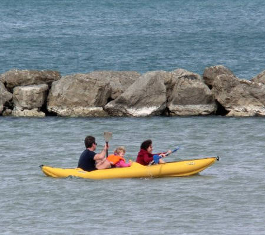
  
  
   intanto ai camper ...
  
  
   
  
  
   c'è chi se la dorme di gusto per nulla interessata all'avventura!
  
  
   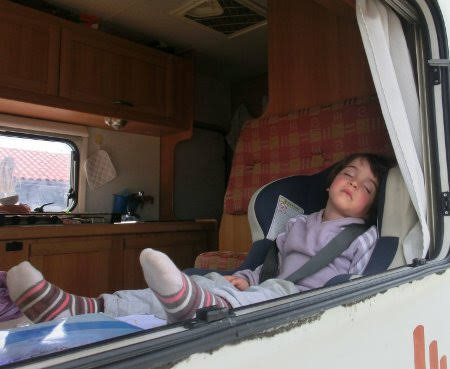
  
  
   La nostra giornata si conclude al castello di Gradara con una bella piadina! E la mattina dopo ... ops è Pasqua! Un'allegra colazione di pasqua nel camper di Anna con le uova di cioccolata, la colomba, il salame, la pizza al formaggio!
  
  
   
  
  
   Andiamo a visitare l'acquario di Cattolica nel bel mezzo di una tempesta di vento e pioggia .. ma ci divertiamo lo stesso!
  
  
   Poi si torna dai nonni e la mattina di pasquetta ci svegliamo con le cime delle montagne imbiancate dalla neve!! Che freddo!!!
  
 

## pedalando pedalando ..
*26-04-2012*

 
  
   Le piccolette si sono fatte casa-metro-villa borghese-centro storico-viale manzoni-metro-casa!
  
  
   Mitica matilde che non si è stancata!!!
  
  
   
  
  
   E brava marghe che non ha mai fatto la lagna!
  
  
   
  
  
   Ciao ciao!
  
  
   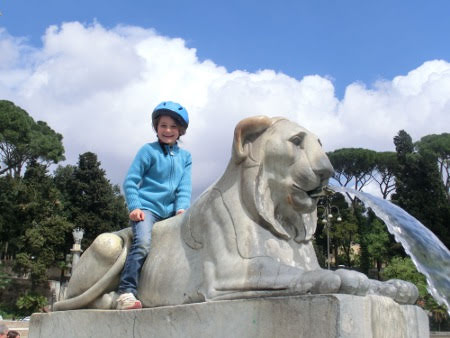
  
 

## Primo bagno dell'anno
*01-05-2012*

 
  
   Sabato è uscita fuori una giornata estiva e quindi tutti al mare ... e si fa anche il bagno!!!
  
  
   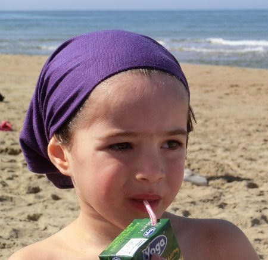
  
  
   
  
  
   i papà invece si fanno un bel giro del promontorio del circeo in canoa
  
  
   
  
  
   e poi al parco a giocare! Siamo proprio due scimmiette!
  
  
   
  
  
   e tre smorfiosette!!
  
  
   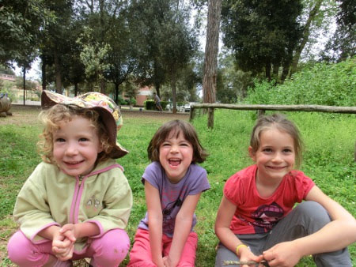
  
  
   ...  però bellissime!!!
  
  
   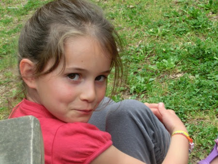
  
 

## Si ricomincia con le cene in terrazza!
*21-05-2012*

 
  
   Tra le varie piogge riusciamo a strappare una serata per cenare fuori con un pò di amici!
  
  
   
  
 

## Giorni di saggi, recite e gite
*31-05-2012*

 
  
   Si inizia con il saggio di ginnastica a scuola, dove i bimbi eseguono dei percorsi mooooolto difficili. Tranne Margherita che ovviamente non rispetta la fila e girovaga un pò dove vuole... ma il suo maestro ci aveva avvertiti che non garantiva nulla sulle sue prestazioni!!!
  
  
   Ed ecco le medaglie
  
  
   
  
  
   poi la recita a scuola: una bellissima storia in cui tutti i bimbi 'regrediscono e poi si evolvono' per trascorrere un giorno nella preistoria insieme al loro amico 'guance nere', al triceratopo squitty e al terribile t-rex 'denti aguzzi'! Tutto merito dello scenziato 'dottor tutto so' che ha costruito una fantastica macchina del tempo....
  
  
   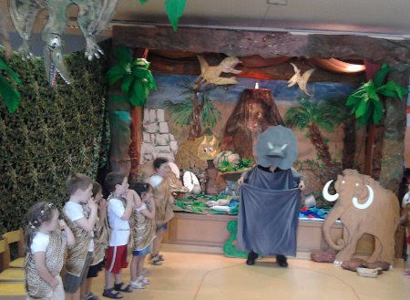
  
  
   che belle bimbe preistoriche!!
  
  
   
  
 

## L'amore è ..
*01-06-2012*

 
  
   .. una sorella che ti aiuta nei momenti difficili ...
  
  
   
  
  
   
  
  
   
  
 

## Il nostro primo concerto
*05-06-2012*

 
  
   Parco della Caffarella, ore 20.30 tutti in bici e pic-nic cinese. Poi ci sediamo a terra sul prato intorno agli
   <strong>
    Acustimantico
   </strong>
  
  
   
  
  
   per seguire il loro "concerto del silenzio", in mezzo alla natura e a  bassissimo impatto ambientale, senza amplificazione, né luci.
  
  
   Null'altro  se non la musica, la luce della luna e le stelle... e due cucciole che si sono addormentate!
  
 

## La mi porti un bacione a firenze
*10-06-2012*

 
  
   Venerdì raggiungiamo papy a Firenze col treno e ci facciamo una bella passeggiata notturna per la città. Poi dormiano in camper e la mattina dopo tutti in sella! Si va alla scoperta!
  
  
   Colazione vicino ponte vecchio
  
  
   
  
  
   e poi sul ponte
  
  
   
  
  
   a zonzo per la città
  
  
   
  
  
   accarezziamo anche il famoso cinghiale al mercato di s. lorenzo
  
  
   
  
  
   e ci proviamo degli occhiali molto fashion!
  
  
   
  
  
   E dopo una squisita fritturina di pesce al mercato andiamo alla tanto attesa mostra all'orto botanico
  
  
   
  
  
   iniziamo con un buffo Parasaurolofo (è più buffo lui o papy?)
  
  
   
  
  
   passeggiando nel verde troviamo un terribile t-rex che ha divorato un triceratopo ('mamma mi posso avvicinare?')
  
  
   
  
  
   un enorme Indricotherium
  
  
   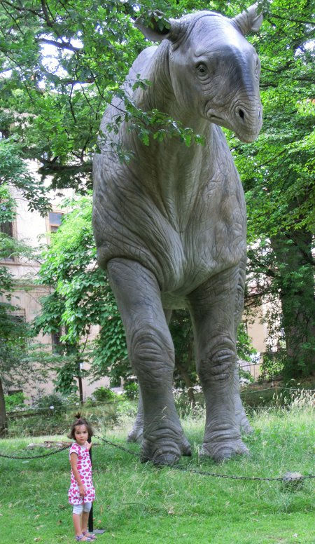
  
  
   un rugoso Pachyrhinosauro con cui Marghe ha fatto una bella chiaccherata
  
  
   
  
  
   e tanti altri.... diplodochi, smilodonti, cervi giganti, spinosauri ..... e un piccolino che doveva dire una cosa all'orecchio a mati
  
  
   
  
  
   facciamo anche il laboratorio sulle impronte e lo scavo come delle vere paleontologhe ... abbiamo trovato la mascella e il femore dell'elefante Pietro
  
  
   
  
  
   e visitiamo anche il museo che ha tantissime ossa di mammut scoperte qui in toscana
  
  
   
  
  
   Poi un pò di svago alle giostre
  
  
   
  
  
   e cena in un buon ristorantino a piazza della passera!
  
  
   Arriveduar!
  
  
   [
   
  
  
 

## Primi disegni e diario di viaggio
*16-06-2012*

 
  
   Evviva!!!! Finalmente Margherita inizia a fare i suoi primi disegni antropomorfi!
  
  
   
  
  
   anche se il tema preferito sono gli animali....
  
  
   
  
  
   E invece Matilde fa un disegno sul nostro viaggio a Firenze ... tutta la famiglia in bici (anche Margherita con le rotelle)
  
  
   !
  
  
   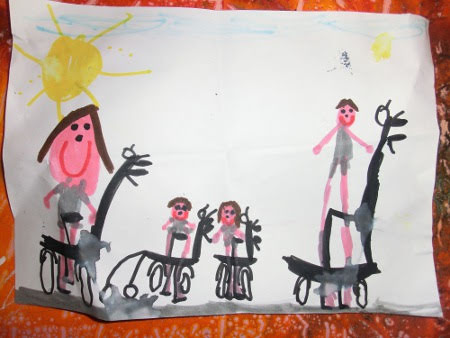
  
 

## Festa di fine anno di Stella e Matilde
*17-06-2012*

 
  
   In questa giornata di calura estiva festeggiamo la fine della scuola e il compleanno di Stella al parco giochi.
  
  
   Le bimbe si divertono a fare tante cose: il pallone nell'acqua
  
  
   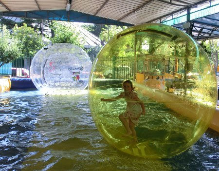
  
  
   il tappeto elastico
  
  
   
  
  
   ma dove si fanno davvero tante risate è l'autoscontro
  
  
   
  
  
   
  
  
   Poi infine le torte
  
  
   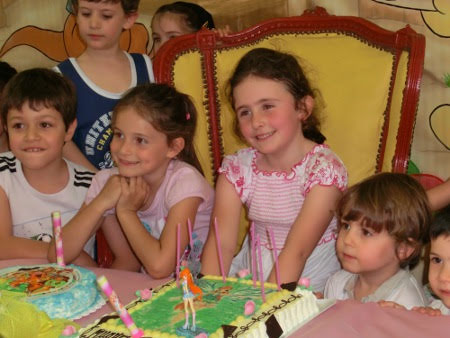
  
  
   e le nostre famiglie (con il solito Falvio imbucato!!!)
  
  
   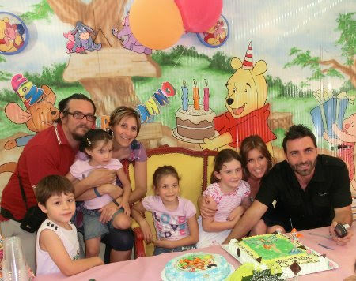
  
 

## Domenica di relax a casa
*18-06-2012*

 
  
   Queste povere figlie avevano proprio bisogno di una giornata di riposo a casa!
  
  
   E vista l'improvvisa calura tutto sommato si stava pure bene! Si dedicano ai loro lavoretti
  
  
   
  
  
   mentre papy si rilassa in terrazzo!
  
  
   
  
  
   Belle le mie piccole!
  
  
   
  
  
   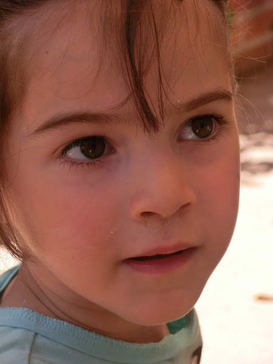
  
 

## Free afternoons!
*23-06-2012*

 
  
   Un pò di mare con Sofia e l'immancabile grattachecca all'arancia
  
  
   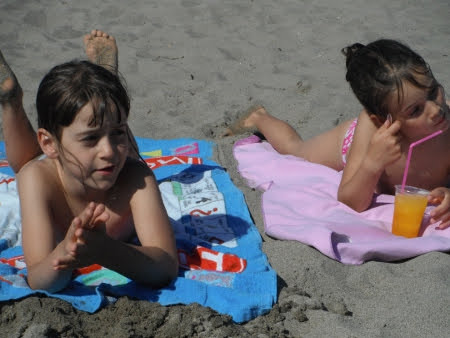
  
  
   e fragola e limone
  
  
   
  
  
   e anche un pò di lago che con 'Scipione' (l'ondata di caldo africano)
  
  
   va benissimo! Un tuffo a bomba dal molo
  
  
   
  
  
   e uno con Ray!
  
  
   
  
  
   e poi tutti sul pedalò
  
  
   
  
  
   ma Ray sa nuotare?? meglio stare sicuri con la ciambella!!!
  
  
   
  
  
   E infine non può mancare il mega piattone di spaghetti alle vongole!!
  
  
   
  
 

## Onde, tuffi e un buon BBQ 
*25-06-2012*

 
  
   Un bel weekend al castello di S. Severa. fa caldo e il mare è pieno di onde divertenti
  
  
   
  
  
   e facciamo anche dei bei tuffi con papy!! hahahaha
  
  
   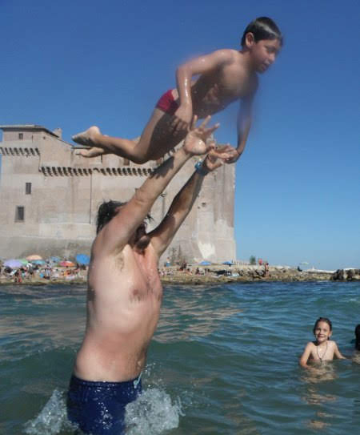
  
  
   e con la nuova macchinetta subacquea ... che smorfie!!
  
  
   
  
  
   Poi una panzanella al fresco degli alberi (con sorriso ammaliatore)
  
  
   
  
  
   e tre gnomi FLUO
  
  
   
  
  
   Un bel bacio fuxia
  
  
   
  
  
   e di nuovo in acqua!!
  
  
   Alla fine della giornata un bel BBQ al tramonto
  
  
   
  
  
   'Siamo nati per soffrire!' :)
  
 

## Con zia, nonna Lilly e Lillo (Morgan)
*16-07-2012*

 
  
   Le prime due settimane di luglio le passiamo a casa di zia in liguria.
Stiamo benissimo. Tra passeggiate nel bosco vicino casa
   
  
  
   gite al Melogno
  
  
   
  
  
   con pausa merenda
  
  
   
  
  
   e relax sul fiume
  
  
   
  
  
   con tanto di bagno sia noi che zia e Morgan!
  
  
   
  
  
   
  
  
   
  
  
   A Margherita abbiamo tagliato i capelli un pò da maschietto ma almeno sta bella fresca e non suda!
  
  
   
  
  
   Poi siamo state allo spettacolo dei burattini, al parco giochi e anche alla sagra dei Fugassin! Che buoni!
  
  
   
  
  
   E poi con nonna Lilly tanto mare!
  
  
   
  
  
   Alcuni giorni c'erano le onde altissime e mi divertivo a rotolare nella schiuma a riva! Che fatica!
  
  
   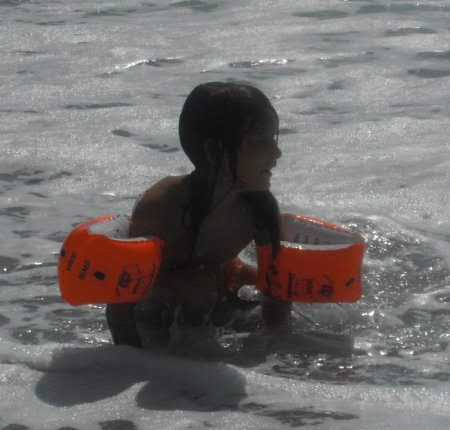
  
  
   E invece quando il mare era calmo nuotavo e andavo sott'acqua! Sono proprio bravina!
  
  
   
  
 

## Daniela&Giuseppe!
*21-07-2012*

 
  
   Finalmente! Ecco lo sposo molto fashion
  
  
   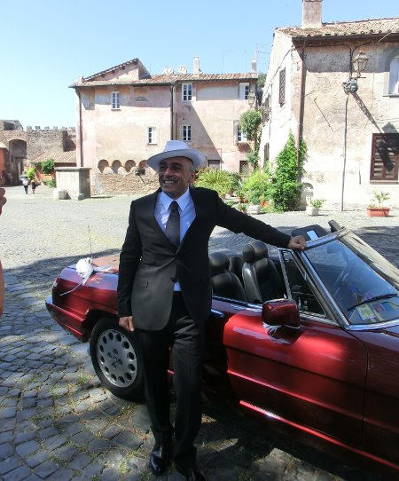
  
  
   e Danielina bellissima come sempre!
  
  
   
  
  
   E un nutrito gruppo di fan sfegatate, piccole e grandi!
  
  
   
  
  
   Auguri di tutto cuore per una bellissima vita insieme!
  
 

## Circeo
*24-07-2012*

 
  
   E anche quest'anno andiamo un pò al Circeo con Mapy, zia Betta, Ray e Caterina.
  
  
   Come sempre tanti giochi in acqua
  
  
   
  
  
   letture interessanti
  
  
   
  
  
   un pò di coccole da scimmietta (UH UH AH AH)
  
  
   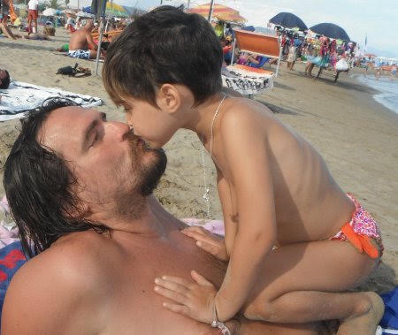
  
  
   e da scimmione (hihihihi)
  
  
   
  
  
   nuotate sopra l'acqua
  
  
   
  
  
   a pelo d'acqua
  
  
   
  
  
   e sotto!
  
  
   
  
  
   E poi anche le giostre!
  
  
   
  
  
   e la piscina di palline!
  
  
   
  
  
   E poi arriva anche mamish! Siamo propio belli vero??
  
  
   
  
  
   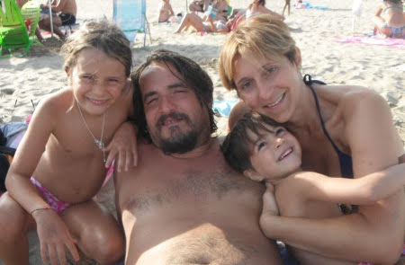
  
 

## Olimpiadi Londra 2012
*26-07-2012*

 
  
   A casa nostra si vedono solo tre canali in tv: Rai YOYO, Cartoonito e MTV. I primi due ovviamente per i cartoni animati e il terzo per vedere 'Ginnaste-Vite Parallele' di cui sia Marghe che Mati, ma anche M&amp;P, sono accaniti fan!
  
  
   
  
  
   Allora forza squadra azzurra e in bocca al lupo per le Olimpiadi!
  
 

## We in abruzzo
*31-07-2012*

 
  
   ... tutta da scoprire questa bellissima regione! Facciamo un pò di montagna fermandoci (e divertendoci tantissimo)
  
  
   al parco avventura Majella!
  
  
   Le bimbe si preparano per i percorsi tra gli alberi ..
  
  
   
  
  
   Matilde è precisissima e attenta che i suoi moschettoni siano sempre saldamente chiusi ...
  
  
   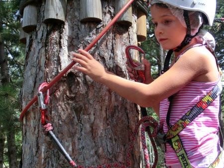
  
  
   e poi si lancia all'avventura
  
  
   
  
  
   ed è bravissima!
  
  
   
  
  
   anche Margherita si mette alla prova, certo con la su solita poca concentrazione e qualche lagna, ma alla fine anche lei fa il percorso
  
  
   
  
  
   e la carrucola a gabbia di uccello!
  
  
   
  
  
   E anche mamma si diverte tra i rami!
  
  
   
  
  
   
  
  
   E poi tutti al mare in una bella spiaggia di sassi a Fossacesia
  
  
   
  
  
   con ronzianante a bordo mare!
  
  
   
  
  
   e che mangiate
  
  
   
  
  
   ciao abruzzo torneremo presto!
  
  
   
  
 

## Happy birthday Ray!!!
*01-08-2012*

 
  
   
  
  
   WISH YOU ALL THE BEST! :)
  
 

## Relax a Valdolmo
*05-08-2012*

 
  
   Un pò di relax prima di partire per le vacanze con M&amp;P!
  
  
   Qui ci sono molti amici
  
  
   
  
  
   e si fanno tanti giochi e invenzioni. L'ultima è la gabbia per i grilli con legno colla e seghetto!
  
  
   
  
  
   
  
  
   Poi ci raggiunge anche Flavio e si fa merenda con l'ovetto sbattuto appena raccolto nel pollaio!
  
  
   
  
  
   e andiamo a visitare le grotte di Frasassi e il museo della carta a Fabriano (comodo il soggiorno di cartone!!)
  
  
   
  
  
   Un pò di rotolate sul prato, uno sguardo al fiume
  
  
   
  
  
   e poi ... ma siamo più ragazzini noi o i nostri figli???
  
  
   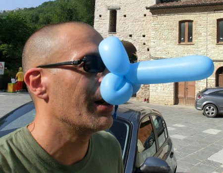
  
  
   
  
  
   
  
  
   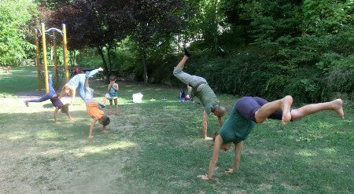
  
  
   Alla fine stanchi ed esausti cosa c'è di meglio di una bella dormita? :)
  
  
   
  
 

## Vive la france!
*01-09-2012*

 
  
   Si parteeee.... 2 camper, 7 mattacchioni, un pò di biciclette e via alla scoperta del sud della Francia!
  
  
   
  
  
   Iniziamo da una mega fila al confine che ci fa fermare a mangiare una pizza a Bordighera, poi dopo un pò di ore di viaggio e superato il confine ci fermiamo a
   <strong>
    S. Maxime.
   </strong>
   La mattina ci svegliamo su una bella scogliera! Purtroppo il nostro prode pescatore, Giorgio, ha mal d'orecchio e tra un piede sui ricci per Margherita (per cui non ha fatto una lacrima nemmeno quando le abbiamo torturato il piede per togliere le spine!)
  
  
   e la paura di Anna per le alghe (che si staccano dagli scogli e la attaccano)
  
  
   decidiamo di viaggiare un altro pò fino ad
   <strong>
    Aix en Provance
   </strong>
   . La mattina dopo attraversiamo il Rhone e siamo in Camargue! Passiamo le saline e ci troviamo in un posto incredibile,
   <strong>
    Saintes-Maries-de-la-Mer
   </strong>
   , una distesa di camper a bordo spiaggia che si estende per qualche Km! Ci piazziamo lì e costruiamo il nostro accampamento!
  
  
   
  
  
   Lo spiaggione è enorme e le bimbe giocano tantissimo!
  
  
   
  
  
   
  
  
   Con l'aiuto del tellinaro del legionario (una lunga storia..)
  
  
   Giorgio e P raccolgono un secchiello di telline che poi si trasformano in una fantastica spaghettata serale!!
  
  
   Al tramonto poi una romantica passeggiata in bici alla ricerca dei fenicotteri rosa!
  
  
   
  
  
   Poi l'indomani tipica passeggiata a cavallo...
  
  
   
  
  
   vi presentiamo 'Maniglia', Casa e Jules!
  
  
   
  
  
   che in verità avrebbero preferito passare la giornata a brucare l'erba ... ma si sono anche divertiti a pestare il piede a Giorgio .. hihihihi
  
  
   
  
  
   Compriamo le cartoline e Matilde le scrive disegnando la sua passeggiata a cavallo
  
  
   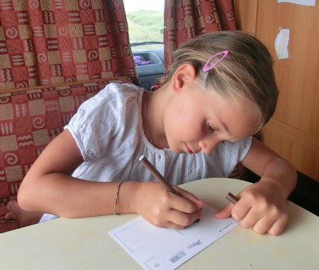
  
  
   La serata la passiamo ad
   <strong>
    Arles
   </strong>
   , che ha un colosseo proprio come il nostro!
  
  
   
  
  
   eccoci qui tutti insieme!
  
  
   
  
  
   La sera improvvisiamo un bbq nelle famose vigne de sable, vigneti nella sabbia!
  
  
   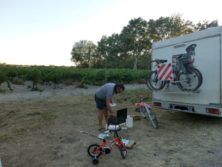
  
  
   e poi giro in bici in notturna
  
  
   
  
  
   ad Aigues-Mortes, un paesino fortificato molto caratteristico..dove le bimbe hanno giocato
   
  
  
   provato gli occhiali
  
  
   
  
  
   e osservato un buffo negozio in cui le persone immergono i piedi negli acquari e i pesciolini gli mangiano le pellicine ....
  
  
   Il giorno dopo ci fermiamo in spiaggia a
   <strong>
    Marseillan.
   </strong>
   Il nostro pescatore trova delle conchiglie enormi che fanno felicissime le bimbe.
  
  
   
  
  
   E per far felici i papà la sera andiamo a cena in un posto che fa solo 'mules&amp;frittes' in tutte le salse ... che abbuffata!
  
  
   
  
  
   
  
  
   e dopo tutti al luna park!
  
  
   
  
  
   Prossima tappa è la bellissima città delle principesse,
   <strong>
    Carcassonne
   </strong>
   
  
  
   dove Anna si sente perfettamente a suo agio!!!
  
  
   
  
  
   ... ma anche Meggy non scherza!
  
  
   
  
  
   Si OK OK .... siete tutte principesse ...Mati e Manu incluse!!!
  
  
   
  
  
   poi un giretto lungo le mura, con affaccio dalla feritoia
   
  
  
   un pò di musica madioevale...
  
  
   
  
  
   .. un pò di coccole ...
  
  
   
  
  
   e poi di nuovo direzione mare... ma a
   <strong>
    Narbonne plage
   </strong>
   , tira vento e fa fresco, così mentre le mamme passeggiano e chiaccherano lungo lo spiaggione
  
  
   
  
  
   le bimbe costruiscono una casetta
  
  
   
  
  
   
  
  
   Proviamo ad arrivare verso il confine con la spagna ma la zona è piuttosto ostile ai camper. Così ci diamo alla cultura e andiamo al museo del Centro Europeo della Preistoria a
   <strong>
    Tautavel,
   </strong>
   dove c'è l'Uomo di Tautavel, vecchio di 450.000 anni.
  
  
   A seguire il bellissimo zoo safari di
   <strong>
    Sigean
   </strong>
   , che attraversiamo prima in camper .... 'attenti allo struzzoooooo'
  
  
   
  
  
   ... agli orsi, che però più che feroci sembrano dei mega peluches accucciati a mangiare le mele, ..
  
  
   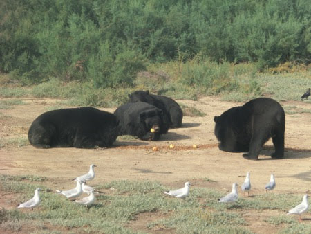
  
  
   ... e ai regali leoni spossati dal caldo!
  
  
   
  
  
   Poi il giro prosegue a piedi, e vediamo tantissimi animali da vicino ...soprattutto fenicotteri rosa!!
  
  
   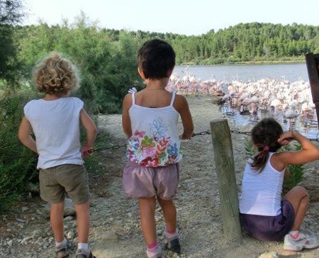
  
  
   che bello questo zoo... si può pure correre come pazzerelle ...
  
  
   
  
  
   e ci sono le caprette da accarezzare!!
  
  
   
  
  
   Tappa successiva
   <strong>
    Pont du Gard
   </strong>
   , uno spettacolare ponte romano sul fiume...dove finalmente ci tuffiamo per un pò di refrigerio....le temperature sono altissime ... ma l'acqua è fresca fresca ...vero Mati??
  
  
   
  
  
   
  
  
   e poi i mitici papà gonfiano le canoe e navighiamo un pò lungo il corso del fiume...
  
  
   
  
  
   La serata la passiamo nella bella
   <strong>
    Nimes ...
   </strong>
   tre gnome e un faretto
   <strong>
    ...
   </strong>
  
  
   
  
  
   La nostra ultima tappa insieme è
   <strong>
    Avignone
   </strong>
   , dove le bimbe rimangono affascinate dall'arpa nella grande piazza
  
  
   
  
  
   e dal ponte rotto ("
   <em>
    Sur le pont d'Avignon, L'on y danse, l'on y danse
   </em>
   ")
  
  
   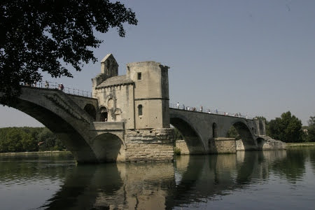
  
  
   Poi le strade dei due camper si separano, quello di Anna va al mare a rilassarsi un pò, mentre Ronzinante va a
   <strong>
    Draguignan
   </strong>
   e si ferma nel giardino della famiglia francese con cui abbiamo organizzato lo scambio casa.
  
  
   <strong>
    Tragedia: 2 macchinette fotografiche su 2 si rompono e non abbiamo più foto del viaggio!
   </strong>
  
  
   Comunque ci riposiamo un bel pò! Poi dopo esserci ripresi andiamo a visitare le bellissime
   <strong>
    gole del Verdon
   </strong>
   ; prima dall'alto, insieme alle maestose aquile che ci volano vicino e poi in canoa!
  
  
   Ci ricongiungiamo con Anna&amp;family per concludere il nostro bel viaggio visitando l'isola di
   <strong>
    Porquerolles
   </strong>
   , dove affittiamo le bici e ce la giriamo tutta, facendo anche dei bei bagni.
  
  
   France au revoir !!
  
  
   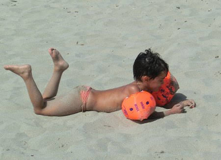
  
 

## Compleanno di Matilde!
*08-09-2012*

 
  
   Auguri cucciola! E che sia un anno pieno di novità e di avventure!
  
  
   
  
  
   Si festeggia con qualche amico, una cosa improvvisata, e per torta un tiramisù alle fragole
  
  
   
  
  
   e il giorno dopo con la famiglia e Ray a Magicland!
  
  
   
  
  
   
  
  
   Mapy e Ray fanno anche il pauroso gioco Mystica (eccoli nel cerchietto rosso)
  
  
   
  
  
   e le bimbe la versione light!
  
  
   
  
  
   
  
  
   Poi altri giochi
  
  
   
  
  
   e gli spettacoli di Gattobaleno, I Gladiatori, le Winxs e gli stuntman!
  
  
   
  
  
   
  
  
   Ray è riuscito anche a prenderci un mega winnie pooh!
  
  
   
  
  
   C'era tantissima gente ma alla fine ci siamo divertiti tutti lo stesso!
  
  
   
  
  
   Ciao ciao :)
  
  
   
  
 

## Primo giorno di scuola ... Matilde in 1 elementare ....
*14-09-2012*

 
  
   Oggi ricomincia la scuola! Margherita ritorna nella sua classe alla materna con gli amici che già conosce ed un pò di bimbi nuovi ...
  
  
   
  
  
   .. anche se è un pò perplessa .... mi sa che si stava meglio in vacanza!!!
  
  
   
  
  
   mentre Matilde affronta il suo primo giorno alle elementari!!!! Che emozione ... per M&amp;P!!!
  
  
   
  
  
   Prima si rivede con Stella che le comunica che non saranno nella stessa classe, peccato, ma tranquille, vi farete tanti nuovi amci
  
  
   
  
  
   e poi c'è l'accoglienza da parte dei grandi, che le mettono al collo un cavalluccio marino simbolo della sua classe (o class come dice lei!)
  
  
   e le regalano una bellissima matita
  
  
   
  
  
   
  
  
   e poi si sale tutti in classe! Sembra contenta ...
  
  
   
  
  
   Dai dai che inizia un nuovo anno ...imparerai tantissime cose!
  
 

## Domenica speciale!
*17-09-2012*

 
  
   Oggi festeggiamo due eventi importanti: l'arrivo della piccola (si fa per dire)
  
  
   Emma e il compleanno del suo mitico papà Bruno, per gli amici BravoBravo!
  
  
   
  
  
   e ovviamente la supermamy Noemi che li sopporta entrambi!
  
  
   
  
  
   Una bella festa in giardino
  
  
   
  
  
   con tanto relax
  
  
   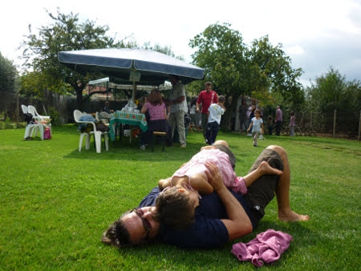
  
  
   e l'immancabile volo in elicottero!
  
  
   
  
 

## Principessa in bianco....
*17-09-2012*

 
  
   Mamish mi ha fatto questa foto domenica ...
  
  
   
  
  
   e si è ricordata di questa che risale a 4 anni fa ....stesso posto stesso periodo ....
  
  
   
  
  
   che dite ... sono cambiata un pò? :)
  
 

## Auguri Margherita!
*24-09-2012*

 
  
   Tanti auguri smorfiosetta!
  
  
   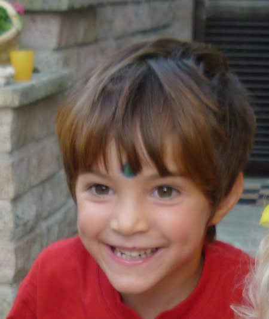
  
  
   Un pò di relax alle terme
  
  
   
  
  
   
  
  
   e poi dai nonni in campagna, in mezzo alle dalie!
  
  
   
  
  
   In attesa delle amichette ci dilettiamo a cucinare intrugli strani
  
  
   
  
  
   a giocare con l'altalena
  
  
   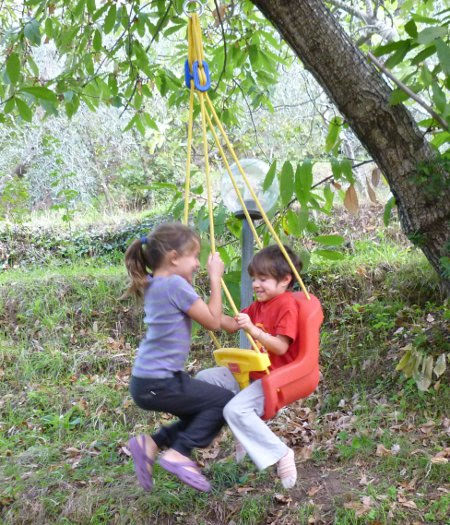
  
  
   mentre Ray prepara una bellissima cuccia per i nostri cagnolini
  
  
   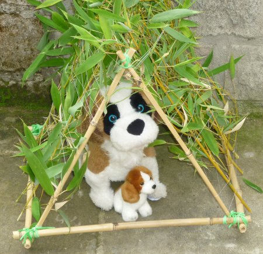
  
  
   e gioca con Mati con le nuove costruzioni!
  
  
   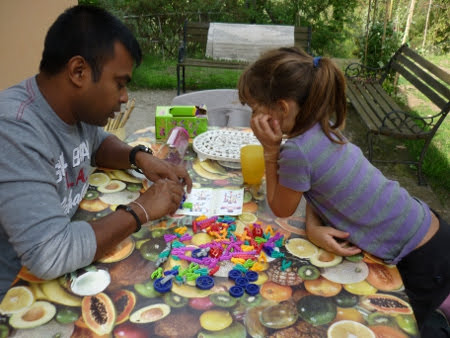
  
  
   Poi arrivano Nina ed Anna e giochiamo sull'amaca
  
  
   
  
  
   mangiamo i ghiaccioli.... fa proprio caldo oggi!!
  
  
   
  
  
   è venuta anche Cicetta a trovarci nella sua splendida forma 'rotonda' :)
  
  
   
  
  
   e alla fine la tortaaaaa ....
  
  
   
  
  
   'Auguri Mggie' ... SMAK!
  
  
   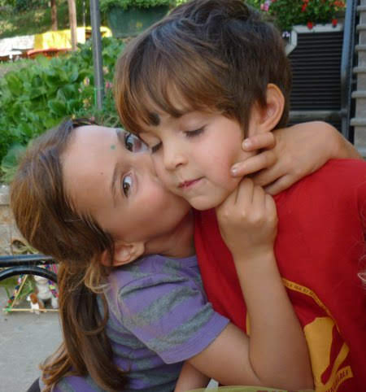
  
 

## Finalmente!
*29-09-2012*

 
  
   <a href="http://videos.arte.tv/de/videos/italien-legalisierung-illegaler-arbeitnehmer--6958978.html">
    Benvenuto Raymond
   </a>
  
  
   ... per noi lo eri da tempo!
  
 

## Raccolte
*08-10-2012*

 
  
   Questo we si fa la raccolta delle castagne
  
  
   
  
  
   dei cachi e soprattutto dei kiwi!
  
  
   Ci vengono ad aiutare un pò di amici... noi piccoli portiamo le cassette vuote
  
  
   
  
  
   e lungo la strada facciamo scorpacciata di corbezzoli (del vicino)
  
  
   
  
  
   poi aiutiamo nella raccolta, sotto il pergolato vicino al fiume
  
  
   
  
  
   e giochiamo
  
  
   
  
  
   Affamati torniamo su, dove nonno ha acceso il forno
  
  
   
  
  
   e cuociamo le pizze!! Buonissima quella al masala di Ray e quella con la nutella!!!
  
  
   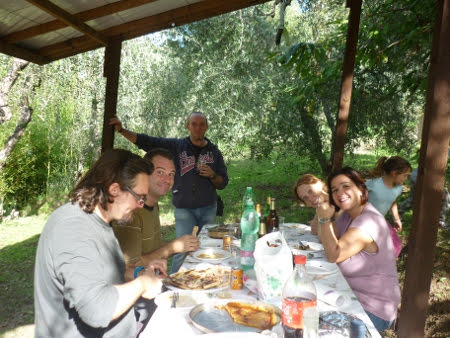
  
  
   Dopo pranzo ancora un pò di giochi
  
  
   
  
  
   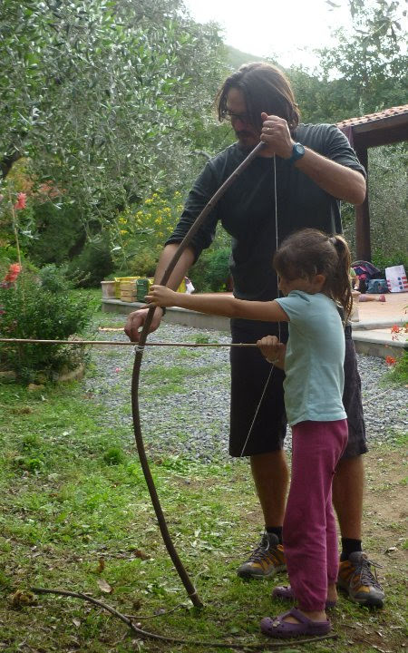
  
  
   e poi tutti a casa esausti ma felici!
  
 

## Benvenuto Adriano
*16-10-2012*

 
  
   L'aeroplano d'Adriano
  
  
   vola libero e lontano
  
  
   ed un giorno passerà
  
  
   per la terra dei chissà
  
  
   in quelo giorno sappi che
  
  
   c'è anche il cielo dei perchè
  
  
   e se in esso volerai
  
  
   di sicuro arriverai.
  
 

## E' nata Anita!
*26-10-2012*

 
  
   Eccola qui ..
  
  
   
  
  
   .. benvenuta piccola Anita e tanti auguri a mamma Mara, papà Lorenzo e alla neo sorellina Alessia!!
  
  
   Matilde dice che sei bellissima ... e ha proprio ragione!!
  
  
   
  
 

## Siamo stati sotto attacco!
*29-10-2012*

 
  
   Beh, chi l'avrebbe detto, ma il nostro blog è stato sotto attacco. Ora è tutto risolto grazie a Monica. Insomma PILDE is back! a presto.
  
 

## Ponte a ponente
*03-11-2012*

 
  
   Appena sveglia in macchina Margherita esordisce con 'sono felice che stiamo andando da zia e morgan'!
  
  
   Ed eccoci subito al mare a Finale a giocare, la giornata è bellissima!
  
  
   
  
  
   
  
  
   
  
  
   e troviamo anche un bel ceppo di ulivo portato dal mare...
  
  
   
  
  
   
  
  
   Poi su a casa a mangiare i ravioli!! E dopo passeggiata digestiva
  
  
   
  
  
   nel bosco ...corri Mati che Morgan è velocissimo con quel pallone!
  
  
   
  
  
   Un bel tramonto alle chiesette
  
  
   
  
  
   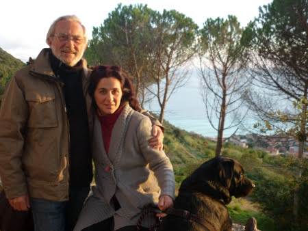
  
  
   
  
  
   Nei giorni seguenti passeggiata al mare a Loano
  
  
   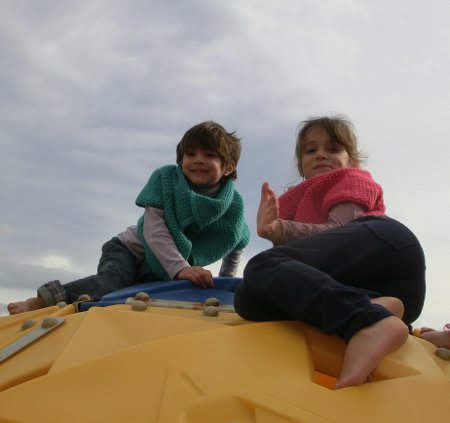
  
  
   
  
  
   shopping in centro
  
  
   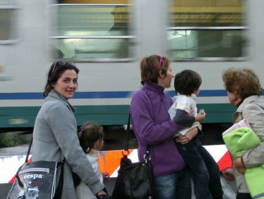
  
  
   e poi aperitivo tra le barche del porto con un pò di scatti ....
  
  
   
  
  
   
  
  
   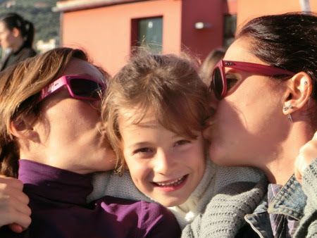
  
  
   
  
  
   
  
  
   mentre margherita se la ronfa ...
  
  
   
  
  
   ... avrà preso da nonno che appena può si abbraccia a Scrat e si appisola!
  
  
   
  
  
   Hei tornate a trovarmi presto (dice Morgan)
  
  
   !!!
  
  
   
  
 

## Ciao nonna Maria
*04-11-2012*

 
  
   ... amo ricordarti così, mentre cucini quelle cose buonissime che solo tu sapevi fare così bene, gli gnocchi, le verdure ripiene, le frittate, le polpette  ....
  
  
   
  
  
   riposa serena nella pace che meriti e dai un abbraccio al nonno appena lo rivedi!
  
  
   Carlotta
  
 

## Laboratorio di ceramica
*11-11-2012*

 
  
   e come al solito i creativi di famiglia si scatenano....
  
  
   
  
  
   P fa un vasetto a forma di elefante, Mati fa giulio coniglio e poi le palline per una collana
  
  
   
  
  
   mentre Marghe, dopo aver mangiato la pasta che serviva da decorazione, essersi sciacquata le mani nella ciotola e aver fatto un paio di macchie alla giraffa,
  
  
   
  
  
   decide di andarsi a leggere un libro ... ognuno ha le sue passioni!
  
 

## Fine novembre ...
*27-11-2012*

 
  
   .... e siamo al mare ??
  
  
   
  
  
   prima a goderci il sole caldo, un pò di biciclette e 'guarda c'è Melma' (che sarebbe la giraffa Melman)
  
  
   
  
  
   e poi direttamente in acqua a cercare granchietti e paguri
  
  
   
  
  
   a fare i salti
  
  
   
  
  
   e infine un bel pranzetto salutare!!
  
  
   
  
 

## .... inizio dicembre ...
*10-12-2012*

 
  
   Finalmente è arrivato il freddo e noi inauguriamo la stagione invernale con un bel we a Ussita! Appena arrivati saliamo a Frontignano e prendiamo la seggiovia. Margherita e Anna si divertono ad affondare nella neve
  
  
   
  
  
   e con lo slittino
  
  
   
  
  
   mentre M&amp;P e Mati sciano! E come va spedita la cucciola!!  Poi dato il 'freddo gelo' ci fermiamo al rifugio per una cioccolata calda
  
  
   
  
  
   e un bombardino ...
  
  
   [
   
  
  
  
   Un'ultima discesa perchè inizia a nevicare forte ed è calato un bel nebbione
  
  
   
  
  
   e poi a casa al calduccio a leggere
  
  
   
  
  
   e a fare un pò di lavoretti e collage
  
  
   
  
  
   prima di cena .... mitica macelleria vissana ;)
  
  
   Domenica invece usciamo di casa ed è tutto bianco, ha nevicato l'intera notte
  
  
   
  
  
   
  
  
   e si sprofonda ovunque!
  
  
   
  
  
   
  
  
   facciamo un bel pupazzo di neve
  
  
   
  
  
   buono il gelato al pupazzo di neve!!
  
  
   
  
  
   un giro sulla giraffa
  
  
   
  
  
   e una passeggiata con M!!
  
  
   
  
 

## Lezione aperta di ginnastica
*16-12-2012*

 
  
   Luci soffuse e natalizie, musica allegra ed entrano in campo le atlete Matilde e Margherita!!! Che emozione!!
  
  
   
  
  
   Seguiamo tutta la lezione .... tra passi saltellati, rotolini, ponti, trave e tappeto elastico... e guardate un pò che bella spaccata fa Matilde! Un pò scomposta ... ma come inizio è perfetto!!
  
  
   
  
 

## Tradizionale piazza navona
*17-12-2012*

 
  
   ... in metropolitana con Alessia
  
  
   
  
  
   a passeggio per il centro
  
  
   
  
  
   con le rose
  
  
   
  
  
   e poi le mele caramellate
  
  
   
  
  
   ma come si fa a mordere???
  
  
   
  
  
   babbo natale che fa le magie
  
  
   
  
  
   e la piccola Anita che, nel breve intervallo in cui non ha dormito, si guarda intorno incuriosita ( ...ma per le luci e i colori o per quel bruto che la tiene in braccio???)
  
  
   
  
  
   ... meglio in braccio a Mati!!
  
  
   
  
 

## Primo colloquio scolastico
*20-12-2012*

 
  
   Prima commozione...  poi orgoglio e soddisfazione insomma ... grazie Matilde e continua così! MeP
  
 

## Festa di natale a scuola
*22-12-2012*

 
  
   I bimbi ci accolgono in palestra e ci fanno ascoltare tante poesie e canti di natale!
  
  
   
  
  
   poi si va su in classe e .... sorpresa.... arriva Babbo Natale a portare i regali ai bambini e alle maestre!
  
  
   
  
  
   Ma questo Babbo Natale non vi ricorda qualcuno??
  
  
   
  
 

## A tutti .... ma proprio tutti
*23-12-2012*

 
  
   
  
 

## Natale a Valdolmo
*26-12-2012*

 
  
   Eccoci qui tutti insieme a festeggiare il natale! C'è chi si scalda davanti al camino, chi prepara dolci, chi li decora (indian style)
  
  
   
  
  
   ... e che bel risultato (povera zia Giorgia che quest'anno non ha potuto mangiarlo!!)
  
  
   
  
  
   c'è chi disegna
  
  
   
  
  
   chi se ne va in giro a passeggiare in montagna ...
  
  
   
  
  
   
  
  
   
  
  
   
  
  
   
  
  
   chi si coccola
  
  
   
  
  
   
  
  
   e alla fine tutti da zio Elio a cucinare per il cenone di natale!
  
  
   Si fanno i fritti
  
  
   
  
  
   i pescioni e i gamberoni al forno a legna
  
  
   
  
  
   e poi tutti a tavola .... sia il 24 sera che il 25 ...e anche il 26!!!
  
  
   
  
  
   Eccoci qui!
  
  
   Noi
  
  
   
  
  
   zia Betta e Caterina
  
  
   
  
  
   zia Francesca e Martina
  
  
   
  
  
   Ray e la bisnonna Maria
  
  
   
  
  
   e tutte le bimbe con zio Roby!
  
  
   
  
  
   La mattina di NATALE poi una bellissima sorpresa..... quanti regali sotto l'albero!!! Sono tutte stordite ...
  
  
   
  
  
   
  
  
   
  
  
   .... queste feste ci hanno proprio distrutti!!!!
  
  
   
  
  
   Au revoir!!
  
  
   
  
 

## E' nata MARTA!!
*28-12-2012*

 
  
   Benvenuta piccola e tanti auguri a mamma Francesca (Cicia)
  
  
   e papà Emanuele!!
  
  
   
  
 

##  ... e ancora ...
*31-12-2012*

 
  
   
  
 

