# 2013

## E' nato Edoardo!
*03-01-2013*

 
  
   Ciao piccolino benvenuto! Un abbraccio grande a mamma Anna Gloria, papà Nicola e al fratellino Matteo.
  
  
   
  
 

## Nouvel An à Paris!
*06-01-2013*

 
  
   <strong>
    Diario di viaggio
   </strong>
  
  
   <strong>
    29 dicembre
   </strong>
  
  
   sveglia alle 5 del mattino, le bimbe sono elettriche per la partenza. Prendiamo l'aereo, per Margherita è la prima volta! Sorvoliamo le alpi all'alba e atterriamo a Parigi.
  
  
   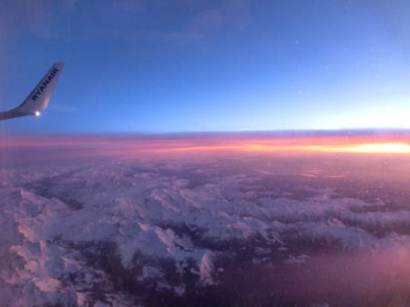
  
  
   Andiamo a casa della  famiglia francese dove la nostra amica Pascal (Pascala per Mati)
  
  
   ci prepara un ottimo pranzetto a base di patè di foigra e anatra arrosto e ci da un pò di consigli per girare la città. Dopo un riposino pomeridiano usciamo e andiamo a vedere la Tour Eiffel in notturna e poi ceniamo in un ristorantino greco con Flavio's family, i nostri compagni di viaggio (AUGURI MASSIMO)
  
  
   !
  
  
   
  
  
   <strong>
    30 dicembre
   </strong>
  
  
   Si inizia la giornata con una bella colazione a casa, due coccole al gattone Saxo
  
  
   
  
  
   che ha la buffissima abitudine di bere dal lavandino del bagno...
  
  
   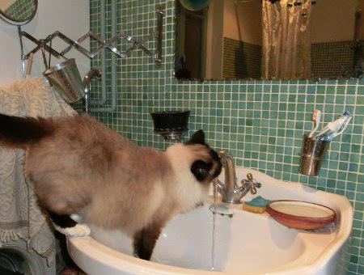
  
  
   e poi si esce. Appuntamento all'istituto del mondo arabo, con la sua bellissima facciata
  
  
   
  
  
   dove c'è una famiglia di elefanti....
  
  
   
  
  
   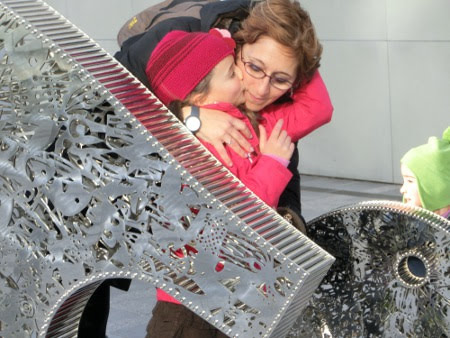
  
  
   un thè alla menta, un pò di corse per le scale metalliche e un affaccio dalla terrazza panoramica
  
  
   
  
  
   Passeggiata sul lungo Senna, che è in piena
  
  
   
  
  
   fino a Notre Dame dove ci incontriamo con l'altro gruppone romano, i Barsotti's con sorella e nipote e gli Zocca's!! Siamo davvero tanti ... tutti alle giostre!
  
  
   
  
  
   Cena a casa e relax .. ognuno a modo suo .. Marghe guarda un cartone con Saxo.
  
  
   
  
  
   <strong>
    31 dicembre
   </strong>
  
  
   Oggi prendiamo la metro
  
  
   
  
  
   
  
  
   e andiamo al Louvre!
  
  
   
  
  
   
  
  
   
  
  
   Siamo ben organizzati, con le guide interattive
  
  
   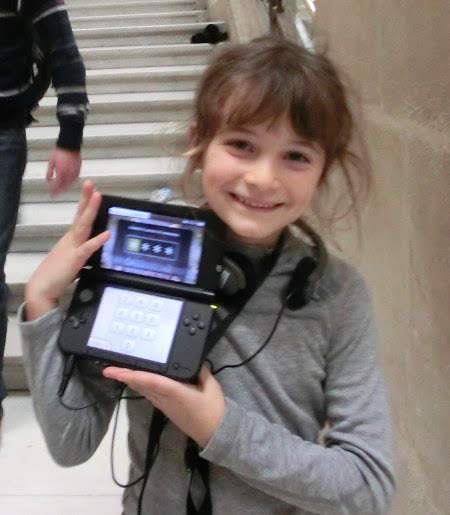
  
  
   e il passeggino per i momenti di stanchezza
  
  
   
  
  
   e infatti ci piace moltissimo!
  
  
   
  
 

   
  
  
  
   soprattutto le nostre interpretazioni della Nike
  
  
   
  
  
   e di amore e psiche
  
  
   
  
  
   che appetito che ci ha messo questo museo ... ripieghiamo sulla brasserie!
  
  
   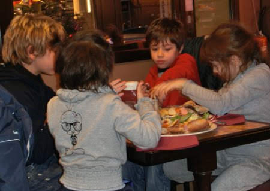
  
  
   E poi il cenone di capodanno tutti da noi!!! E alle 2 di mattina tutti a ninna!
  
 

   
  
  
 

   
  
  
  
   <strong>
    1 gennaio 2013
   </strong>
  
  
   Il nuovo anno si inizia con una bella passeggiata a Monmartre!
  
  
   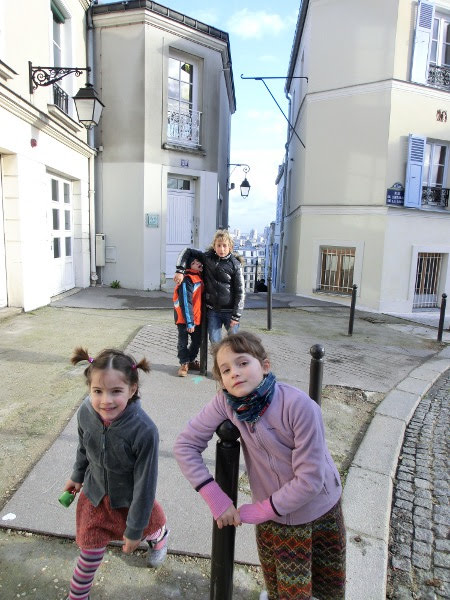
  
  
   tra i vicoletti, la vigna, i localini famosi, le cioccolaterie e i mercatini di natale
  
  
   
  
  
   per arrivare infine al Sacro Cuore
  
  
   
  
  
   a bere vino e cioccolato caldi
  
  
   
  
  
   
  
  
   <strong>
    2 gennaio
   </strong>
  
  
   Oggi si va a Disneyland!
  
  
   
  
  
   a divertirsi un pò nel mondo dei bambini, tra castelli da fiaba
  
  
   
  
  
   labirinti
  
  
   
  
  
   e castelli della regina di cuori
  
  
   
  
  
   cappellai matti
  
  
   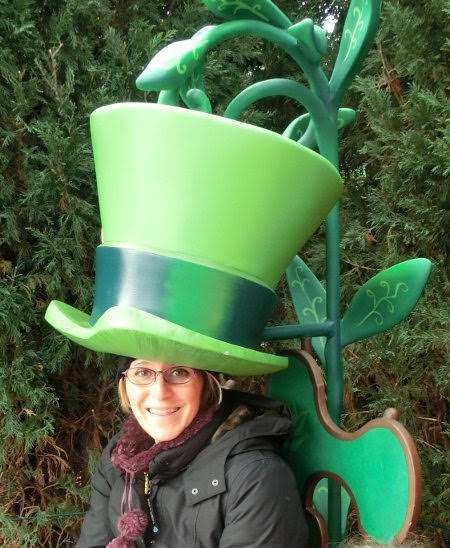
  
  
   CIP&amp;CIOP
  
  
   
  
  
   il cammello di Aladin
  
  
   
  
  
   la spada nella roccia
  
  
   
  
  
   le auto del futuro
  
  
   
  
  
   e infine tutta la serie di Monster&amp;Co., con l'estrattore di urla
  
  
   
  
  
   
  
  
   Mike
  
  
   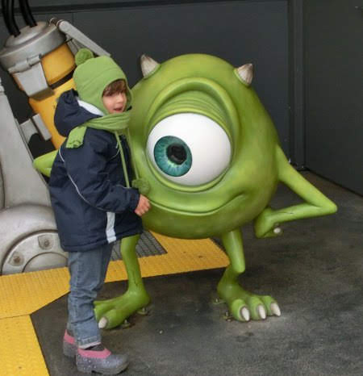
  
  
   e la porta di Boo
  
  
   
  
  
   <strong>
    3 gennaio
   </strong>
  
  
   Si va al Parc de la Villette, dove vediamo la mostra sul design
  
  
   
  
  
   l'area della matematica e la scienza, dove le bimbe provano a generare un pò di Watt
  
  
   
  
  
   e ad ascoltare musica
  
  
   
  
  
   il planetarium e un film sugli animali selvatici con lo schermo enorme del Geode. La sera cena al ristorante orientale, con cous-cous e tajine.
  
  
   <strong>
    4 gennaio
   </strong>
  
  
   Oggi saliamo sulla Tour Eiffel, al primo piano
  
  
   **
   
  
  
   **e poi su su in cima ... dove ovviamente siamo in nube ...
  
  
   
  
  
   ma molto molto in alto!!
  
  
   
  
  
   Poi un altro bellissimo museo, la gare d'Orsey
  
  
   <strong>
    5 gennaio
   </strong>
  
  
   il nostro ultimo giorno di vacanza andiamo a vedere il centre Pompidou
  
  
   
  
  
   e l'arco di trionfo
  
  
   
  
  
   e poi si riparte!  Paris je vous verrai la prochaine fois!!!
  
 

## E' proprio bella Marta!
*14-01-2013*

 
  
   A Matilde piacciono tanto le bimbe, e Marta è davvero una cucciola!!!
  
  
   
  
 

## P in TV!
*20-01-2013*

 
  
   ore 7.35 del mattino: 'Bimbe svegliatevi, correte a vedere che c'è papà in televisione!!'
  
  
   Assonnate si catapultano giù dal letto e con gli occhi semichiusi 'Ma come ha fatto papà ad entrare nella televisione??'
  
 

## Prima uscita in maschera
*28-01-2013*

 
  
   Oggi approfittando della bellissima giornata, indossiamo le maschere di carnevale (nonna franca style)
  
  
   e via al porto di ostia a tirarci coriandoli e stelle filanti!
  
  
   
  
  
   ci sono cowboys, coccodrilli, fragoline, pippi calze lunghe, fatine, spagnole, gattini, pirati, principesse, streghe e pagliacci ... e chi più ne ha più ne metta!
  
  
   Un pò di stretching
   
  
  
   e poi tutti a saltare sulle strisce con papy!
  
  
   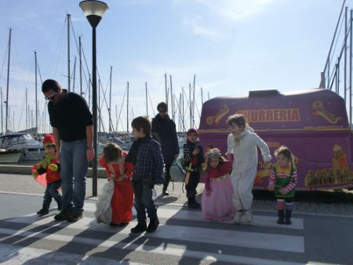
  
  
   
  
  
   Poi un pò di pizza con la 'mortazza' in riva al mare
  
  
   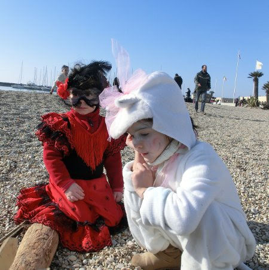
  
  
   e un altro pò di giochi...
  
  
   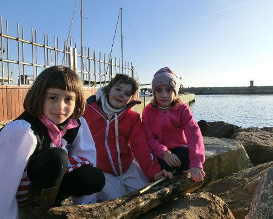
  
  
   e un fiorellino per mamish
  
  
   
  
 

## Maschere ...
*04-02-2013*

 
  
   Oggi andiamo al laboratorio di maschere di carnevale e facciamo gli animali dei boschi laziali
  
  
   
  
  
   uno scoiattolo e una volpe (forse)
  
  
   
  
  
   siamo state proprio brave, vero? Soprattutto Margherita perchè ultimamente si concentra a fare le cose manuali e che richiedono molta attenzione (ha imparato anche il ponte!!!!)
  
  
   Come sto?
  
  
   
  
  
   Ci fermiamo a pranzo al ristorante bio della Valle dei Casali e dopo tutti sul prato a correre e a giocare a ruba bandiera per smaltire l'abbuffata !!
  
  
   
  
  
   C'e anche chi si dedica ad attività più bucolico-contadine....
  
  
   
  
 

## We di freddo e sole
*11-02-2013*

 
  
   Biciclette in macchina e via in pineta a Ostia. La giornata è fredda ma c'è un bellissimo sole. Ci addentriamo tra i sentieri, anche la gnometta Meggy pedala con la sua mini bicicletta! Brava!
  
 

   
  
  
  
   i maschietti faticano a stare dietro a mati [
   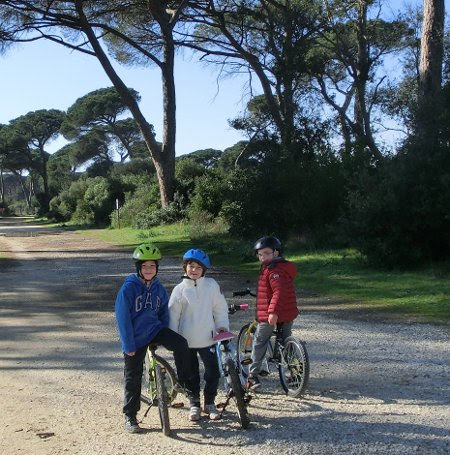
  
  
  
   e anche i grandi!
  
 

   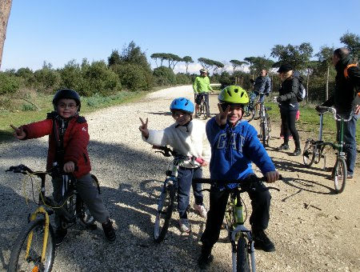
  
  
  
   ITALIA UNO!!!
  
 

   
  
  
  
   Poi tutti a mangiare la pizza nella radura
  
 

   
  
  
  
   e a fare i salti!
  
 

   
  
  
  
   E la sera un pò di compiti ....addolciti da patatine e carciofi fritti, che Matilde adora!
  
 

   
  
  
  
   E domenica pronti per un'altra giornata di sole al porto di Ostia per la festa di Carnevale. Ci trucchiamo tutti ...
  
 

   
  
  
 

   
  
  
   
  
  
 

   
  
  
 

   
  
  
   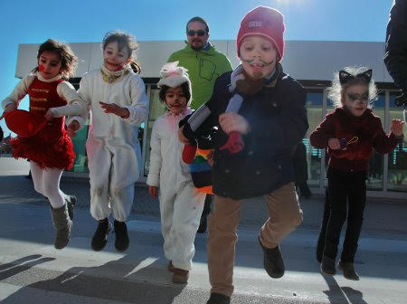
  
  
 

   
  
  
 

   
  
  
   
  
  
 

   
  
  
 

## La pagella!
*19-02-2013*

 
  
   Al concorso della class(e)
  
  
   1A  i giudici Claudia (italiano)
  
  
   , Simonetta (matematica)
  
  
   , Germana (inglese)
  
  
   eleggono all'unanimità, con ben
   <strong>
    TUTTI 9
   </strong>
   , la signorina Matilde con il titolo di 'Miss Bella Pagella'!
  
  
   Continua a leggere ....
  
  
   Inoltre:
  
  
   Attenzione verso le attività scolastiche: PRESENTE
  
  
   Partecipazione alle attività scolastiche: ASSIDUA
  
  
   Impegno nelle attività individuali: PROFICUO
  
  
   Organizzazione del lavoro individuale: AUTONOMA
  
  
   PS: 9 è il voto massimo assegnato!
  
  
   Brava MATI!!!!!!
  
 

## E sono 11
*21-02-2013*

 
  
   Nel linguaggio dei fiori la gerbera rossa indica l'amore passionale e la vittoria, la gerbera gialla è simbolo di gloria, la gerbera arancione è simbolo di allegria e soddisfazione! Auguri amore mio!
  
 

   
  
  
 

## Influenza!
*27-02-2013*

 
  
   Ha colpito proprio tutti .. la roccia Matilde, la disidratata Marghe, e il papone! :(
  
 

## M&P a Catania
*04-03-2013*

 
  
   Questo we M&amp;P ci hanno lasciate con i nonni e sono andati a Catania!
  
  
   Hanno fatto una bella sorpresa ad Annagloria per il suo compleanno e lei è stata contentissima! ('sono scioccata!')
  
 

   
  
  
  
   Abbiamo conosciuto il piccolo Edoardo e rivisto il suo dolcissimo fratellino Matteo
  
 

   
  
  
  
   .... e poi ammettiamolo ...tornare a Catania è sempre emozionante ... due passi in centro con il sole
  
 

   
  
  
  
   un giro per il porticciolo di ognina (dove una volta sono caduta in acqua in pieno inverno!)
  
 

   
  
  
  
   una puntata alla pescheria per comprare un pò di pesce fresco e qualche chilo di pepato dal nostro spacciatore di fiducia!
  
 

   
  
  
  
   farsi appositamente 'fregare' da un venditore ambulante che ti appioppa 25Kg di arance e una casseta di fragole ....quando volevi solo fare una macedonia!
  
 

   
  
  
  
   sorseggiare il fantastico 'mandarino al limone'
  
 

   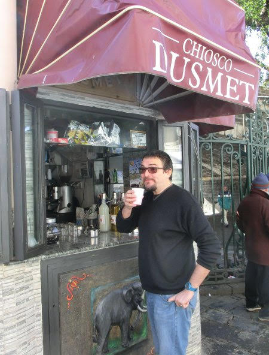
  
  
  
   camminare sul lungo mare mentre le onde alte si infrangono sugli scogli neri
  
 

   
  
  
  
   una puntata da 'Ernesto' con arancini, pizzette e cartocciate ... un'occhiata all'Etna innevata
  
 

   
  
  
  
   una chiacchera e un pranzo con parenti e amici, tra involtini di pesce spada fatti da Andrea, pasta alla norma fatta da zia Maria e dolci di ogni tipo offerti dai cugini!
  
  
   'Come si fa a non amare questa terra!!'
  
 

   
  
  
 

## Esempi!
*11-03-2013*

## Settimana bianca a Siusi
*25-03-2013*

 
  
   Eccoci di nuovo nel bellissimo paesaggio dell'Alpe di Siusi! Il gruppone si espande, quest'anno ci sono anche Sonia, Giulio e Sofia!
  
 

   
  
  
  
   Il tempo è perfetto, grande nevicata il secondo giorno e poi tanto sole e neve stupenda!
  
 

   
  
  
  
   I bimbi fanno tutti il corso di sci, anche Margherita![
   
  
  
  
   Impara a prendere lo skilift con il maestro Alex
  
 

   
  
  
  
   il tapis roulant
  
 

   
  
  
  
   la seggiovia
  
 

   
  
  
  
   e sciare le piace davvero...guardate che velocità tra quei tunnel!!!
  
  
   Matilde invece fa il corso di 2 livello col bravissimo maetsro Sigi che li porta ovunque,
  
 

   
  
  
 

   
  
  
  
   infatti la incrociamo spesso sulle piste col suo caschetto giallo!
  
  
   E' bravissima e fa anche la gara di fine corso ("ma che pista era quella della gara?" ... la competitività non è il suo forte!)
  
  
   E comunque è super felice quando può sciare con la sua sorellina e M&amp;P
  
 

   
  
  
 

   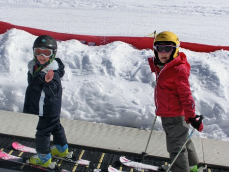
  
  
  
   e quando può correre con Sofia in mezzo alla neve fresca
  
 

   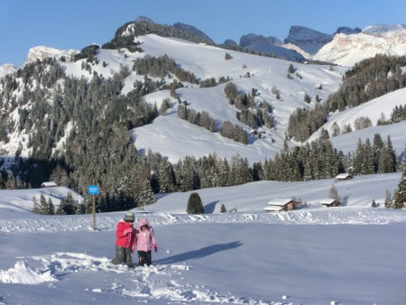
  
  
  
   Ma anche i grandi si divertono! La compagnia è fantastica, ci sono anche Enrico e Laura con Matteo e Andrea e i milanesi Matteo, Micaela, Jaime e Ruben!
  
 

   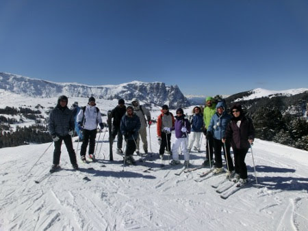
  
  
  
   I pranzetti nelle baite sono sempre degni di nota ... [
   
  
  
 

   
  
  
  
   come dimenticare la zuppa di fieno in crosta di pane e il canederlo dolce con le prugne!! [
   
  
  
  
   e anche la pausa caffè al sole sul sedile pecoroso...
  
 

   
  
  
  
   il presepe innevato.....
  
 

   
  
  
  
   e un pò di coccole che fanno tanto bene....
  
 

   
  
  
 

   
  
  
 

   
  
  
  
   ... e poi .... tutti insieme a sciare ... grandi e piccoli!
  
 

   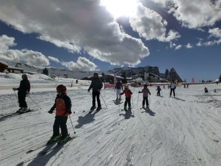
  
  
  
   Ciao Siusi alla prossima!!!!!
  
 

## Auguri Mapi
*28-03-2013*

 
 

   
  
  
 

## Pasqua in liguria
*03-04-2013*

 
  
   Finalmente da zia e Morgan!! Quanto avete aspettato questa pasqua!!!
  
  
   Il tempo non è il massimo ma ci consente di fare delle belle passeggiate nel bosco
  
 

   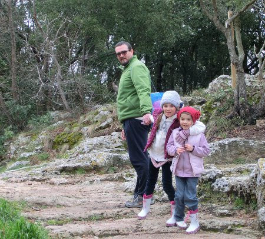
  
  
  
   raccogliendo asparagi
  
 

   
  
  
  
   e fossili di conchiglie!
  
 

   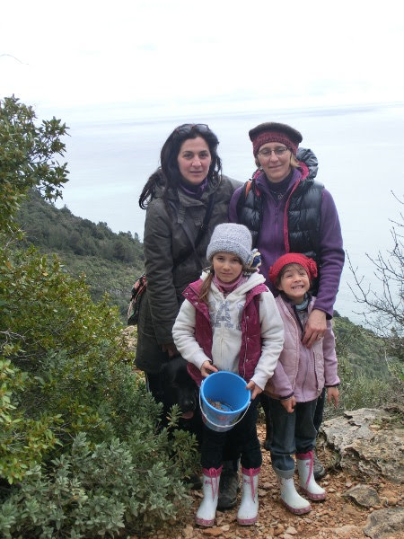
  
  
  
   Un pò di classico struscio a Finale con partita a palla in piazza per le bimbe e aperitivo per i grandi!
  
 

   
  
  
  
   Poi l'immancabile colazione di pasqua con la scoccetta
  
 

   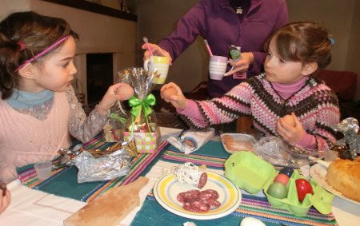
  
  
  
   e Marghe che ancora non ha capito come si apre l'uovo!
  
 

   
  
  
  
   Una passeggiata 'in piazza' .... questa foto uguale identica ce l'avevamo anche io e zia Giorgia!!!
  
 

   
  
  
 

   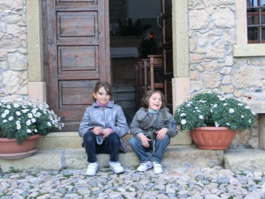
  
  
 

   
  
  
 

   
  
  
  
   Pasquetta è anche il mio compleanno!!! Facciamo un bel picnic con gli avanzi pasquali in spiaggia!
  
 

   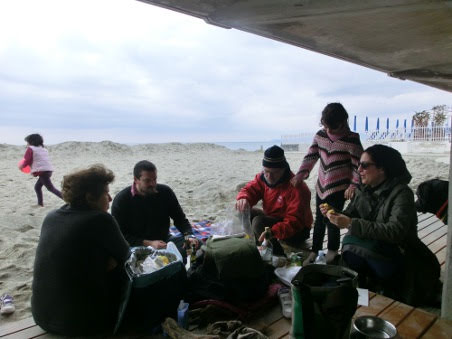
  
  
  
   Giochiamo
  
 

   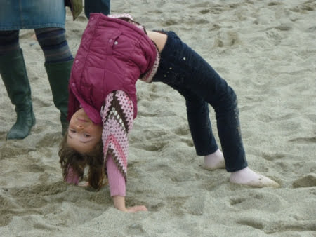
  
  
   
  
  
  
   e come corrono le bimbe e il ciccio!! Due passi sul molo
  
 

   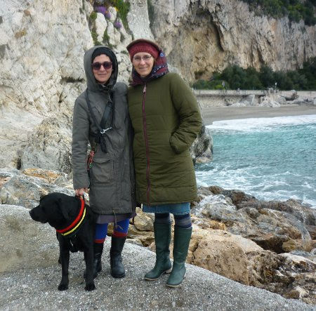
  
  
 

   
  
  
  
   acquistiamo anche dei bellissimi orecchini a forma di paperella per Matilde e fragola per Margherita[
   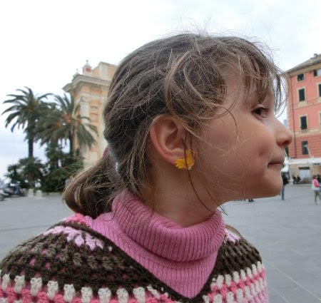
  
  
  
   PS: un grazie speciale a nonna Franca e nonna Maria che hanno fatto questo bellissimo collo di lana jamaicana per Morgan!!
  
 

   
  
  
  
   Arriveduar!!! [
   
  
  
 

 

## Primavera!!
*20-04-2013*

 
  
   Finalmente è arrivata la primavera! Nel nostro terrazzo sbocciano i primi fiori: le calle, le sterlizie, le primule, il glicine, la bellissima peonia, la camelia, il gelsomino, il caprifoglio e tanti altri!
  
 

   
  
  
 

   
  
  
   
  
  
 

   
  
  
 

   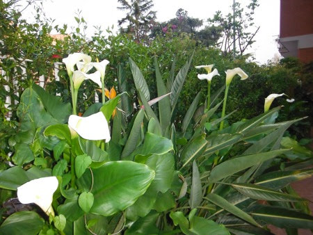
  
  
  
   E anche la caffarella si è riempita di margherite
  
 

   
  
  
 

## Come siamo fatti
*23-04-2013*

 
  
   "Mapi, da grande voglio fare la dottoressa degli animali in Africa" ... lo ripete spesso Margherita, e allora ieri abbiamo cominciato a capire qualcosina ... e i risultati su un cervo (così ha detto Marghe)
  
  
   sono questi
  
 

   
  
  
  
   Poi ha collaborato anche Mati ... ed anche l'elefante è stato messo sotto osservazione
  
 

   
  
  
  
   Beh, è solo l'inizio, ma sembra interessante!
  
 

## Eventi di Aprile
*01-05-2013*

 
  
   Questo mese sono successe tante cose:
  
  
   la festa di compleanno di Sara
  
 

   
  
  
  
   il battesimo di Marta
  
 

   
  
  
  
   dove Margherita e Matilde erano 'deliziose' (mhhh marghe non ama molto farsi fotografare e fa sempre tante smorfie)
  
 

   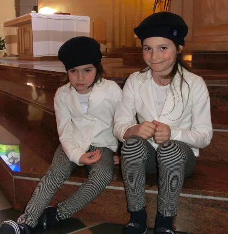
  
  
  
   e concentrate su questa nuova cerimonia!
  
 

   
  
  
  
   poi siamo usciti per la prima volta con il camper .... e abbiamo incontrato Giorgio e EDEMANUELA!! Miiiiii non ci posso credere....anche voi qui!!!! HAHAHAHA
  
 

   
  
  
  
   
  
  
   abbiamo fatto il primo bagno
  
 

   
  
  
  
   e la prima spaghettata con le vongole e i piedini nudi nella sabbia!
  
 

   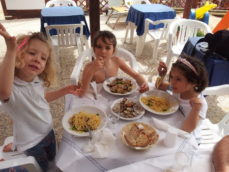
  
  
  
   certo che insieme ad Anna siamo proprio tre scimmiette smorfiose..
  
 

   
  
  
  
   e a volte coccolose...
  
 

   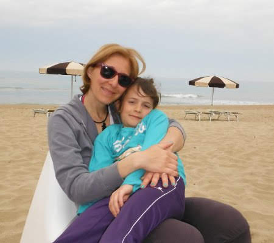
  
  
  
   ma sempre bellissime!!!
  
 

   
  
  
  
   Siamo andati al museo di Piana delle Orme dove c'era una manifestazione della LEGO. Le piccole hanno costruito varie cose con manciate e manciate di costruzioni
  
 

   
  
  
   
  
  
  
   mentre i grandi hanno contribuito alla costruzione di un puzzle gigante che rappresentava Fontana di Trevi!
  
 

   
  
  
  
   Queste belle giornate ci hanno fatto venire voglia di abbellire il nostro terrazzo facendo un pò di giardinaggio con nonno Gianni
   
   </a>
  
 

   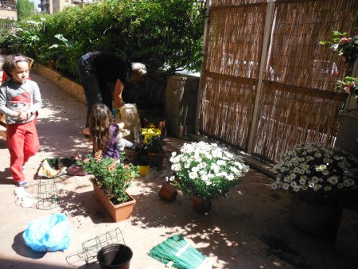
  
  
 

   
  
  
  
   e diverse biciclettate, corse e verticali alla caffarella!!
  
 

   
  
  
 

   
  
  
  
   Poi abbiamo salutato Raymond che parte per l'India
  
 

   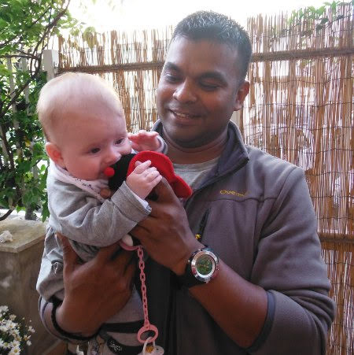
  
  
  
   con una bella cenetta! A presto Ray!!!
  
 

   
  
  
 

## Leviamo le rotelle?
*16-05-2013*

 
  
   Primi tentativi di Margherita senza rotelle...
  
 

## Greek friends!!!
*19-05-2013*

 
  
   Quest'anno abbiamo fatto amicizia con una bella famiglia greca: Ioannis, Georgia, Vassilis e Georgeos.
  
  
   Appena sono arrivati ci hanno portato dei bellissimi puzzle e gli stickers e abbiamo pranzato insieme!
  
 

   
  
  
  
   Abbiamo festeggiato insieme la loro pasqua ortodossa, mangiando le uova rosse e l'agnello con l'arancia
[
   
  
  
  
   e l'immancabile insalata greca!
  
 

   
  
  
  
   Poi abbiamo trascorso qualche bella giornata tutti insieme ....[
   
  
  
  
   e  mentre le mamme e i papà prendevano l'aperitivo a bordo piscina....
  
 

   
  
  
  
   noi abbiamo messo prima i piedi a mollo
  
 

   
  
  
  
   e poi abbiamo fatto il bagno!!
  
 

   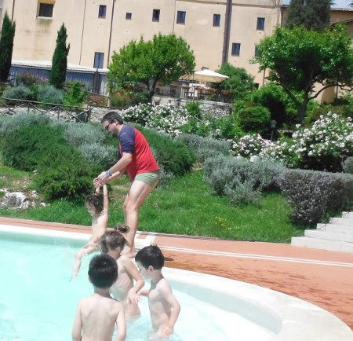
  
  
  
   e qualche ruota!
  
 

   
  
  
  
   Passeggiata per Lugnano in Teverina dove c'erano gli animatori e siamo diventati farfalle
  
 

   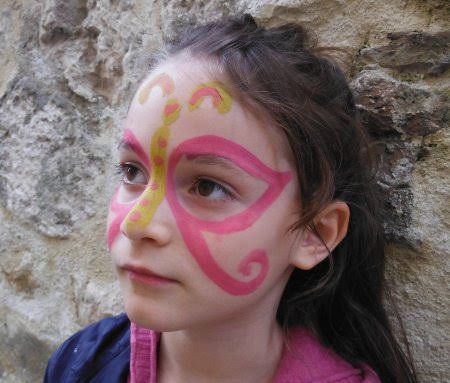
  
  
  
   principesse
  
 

   
  
  
  
   principi
  
 

   
  
  
  
   e pirati
  
 

   
  
  
  
   abbiamo fatto la battaglia con le spade  [
   
  
  
  
   ma poi ci siamo riappacificati!!!
  
 

   
  
  
  
   Ciao amici ...speriamo di rivederci presto! Dear friends hope to see you soon!!
  
 

   
  
  
 

   
  
  
 

## Buon compleanno Alessia!!!
*25-05-2013*

 
  
   Tanti auguri da tutti noi ... e un abbraccio forte forte da Margherita!
  
 

   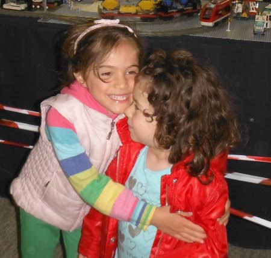
  
  
 

## Happy birthday Evan!!!!
*25-05-2013*

 
  
   From India .... a big kiss!
  
 

   
  
  
  
   Evan ... a very horse rider!!!
  
 

   
  
  
 

## Sdentata!
*31-05-2013*

 
  
   Sono caduti tutti e due!!
  
 

   
  
  
 

## Buon anniversario M&P!
*01-06-2013*

 
 

   
  
  
 

## Giorni di saggi, recite e teatri
*07-06-2013*

 
  
   Questo mese di giugno abbiamo avuto tante cose da fare!Margherita ha fatto la recita del corso di teatro a scuola raccontando la storia degli antichi  romani (con tanto di saluto in latino 'Ave mater, ave pater')
  
  
   : da romolo e remo che vengono abbandonati nella cesta lungo il fiume, alla lupa che li alleva, alla fondazione di Roma, al ratto delle sabine.
  
  
   poi il saggio di psicomotricità
  
 

   
  
  
  
   con diverse pause per abbracciare la maestra Annarita
  
 

   
  
  
  
   e l'amichetta Iolanda! [
   
  
  
  
   e poi infine una bella medaglia!
  
 

   
  
  
  
   e anche quello di Matilde
  
 

   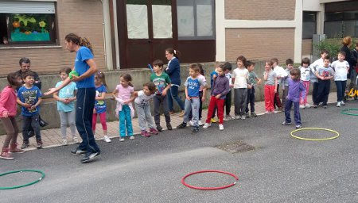
  
  
 

   
  
  
  
   e un pò di succo per dissetarci!
  
 

   
  
  
  
   Poi M&amp;P sono andati a vedere Matilde che faceva la cortigiana nel Rigoletto al teatro Valle!
  
 

   
  
  
  
   Che emozione sentire tutti i bambini cantare l'opera seduti in platea! Grazie maestra Claudia che hai realizzato questo bel progetto a scuola!
  
 

   
  
  
  
   La classe di Mati ha anche rappresentato l'Avaro nella recita finale.
  
  
   Matilde è stata bravissima, voce squillante e sicura sul palco!
  
 

## Festa di fine compleanno di Matilde e Maria Elena ....e infine anche Matteo!
*16-06-2013*

 
  
   Matilde, Maria Elena e Matteo fanno i compleanni quando la scuola è chiusa per le vacanze, così abbiamo fatto una festa anticipata al parco della Caffarella!
  
  
   I bimbi hanno giocato tantissimo con l'animatore Andrea
  
  
   
  
  
   che poi si è trasformato in mago e ha creato i papà volanti!
  
  
   
  
  
   ha fatto tante magie misteriose
  
  
   
  
  
   e poi ha anche fatto apparire un coniglio bellissimo!
  
  
   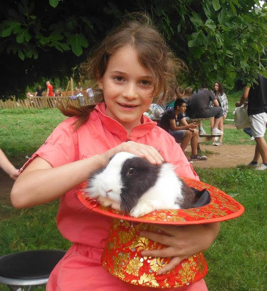
  
  
   
  
  
   Infine le torte
  
  
   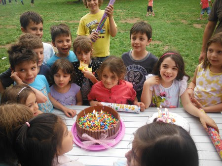
  
  
   e un bel pò di regali!
  
  
   Il povero Matteo, causa bronchite, ha dovuto fare un'altra festa che è andata benissimo lo stesso!
  
  
   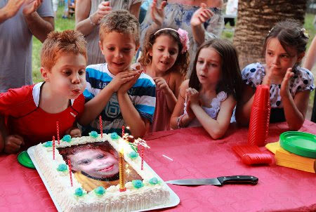
  
  
   E che belle principessine a questa festa!! Terribilmente eleganti....quasi irriconoscibili!!!
  
  
   
  
  
   
  
 

## Primo saggio di ginnastica artistica!
*17-06-2013*

 
  
   Le bimbe sono pronte per il saggio, serene e contente! (a parte l'occhio nero di Matilde che si è data una ginocchiata saltando sul trampolino!!!)
  
 

   
  
  
   
  
  
 

   
  
  
  
   e che mega acconciatura che vi ha fatto mamish!!
  
 

   
  
  
  
   Il tema del saggio sono le favole e loro sono i topolini di Cenerentola! Eccole alla prova generale al palazzetto con la loro dolcissima maestra Cristina.
  
 

   
  
  
  
   Inizia la musica e arrivano le piccole gnome! Che belle con le loro orecchie e le codine!
  
 

   
  
  
 

   
  
  
  
   Brave cucciole!
  
 

## Accampamento a Sperlonga
*24-06-2013*

 
  
   Finalmente inizia l'estate e ne approfittiamo per accamparci a Sperlonga, due camper e due tende! Che forza! Ci divertiamo al mare, chi con la 'canova'
  
 

   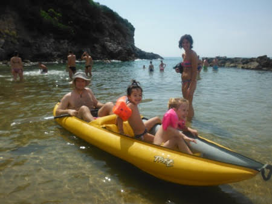
  
  
 

   
  
  
  
   chi a fare castelli di sabbia
  
 

   
  
  
 

   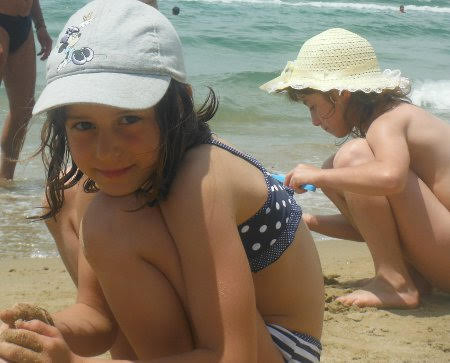
  
  
  
   chi a nuotare
  
 

   
  
  
  
   e poi stanchi e affamati tutti a tavola!!
  
  
   Grandi ....
  
 

   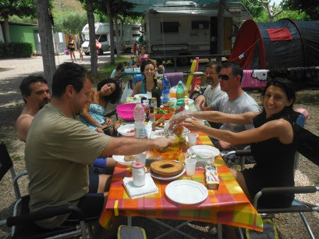
  
  
  
   e piccine!
  
 

   
  
  
 

## Mare ligure ... ma soprattutto zia e morgan!!
*16-07-2013*

 
  
   Finalmente è arrivata l'ora di andare da zia Giorgia e Morgan insieme ai nonni.
  
  
   'Hei ragazze vi stavo aspettando!! Dove vi porto??'
  
 

   
  
  
  
   'A fare tante passeggiate nei boschi....
  
 

   
  
  
  
   e quest'anno convinciamo anche zia a venire con noi al mare! Evviva!!!'[
   
  
  
  
   sempre sotto la tua stretta sorveglianza ovviamente....
  
 

   
  
  
  
   Poi andiamo a casa di Camilla, che sarebbe la fidanzata di Morgan ma lui non sembra essere molto interessato! Ci sono tanti animali con dei nomi divertenti
  
 

   
  
  
  
   e un cagnone buffissimo!!
  
 

   
  
  
  
   Andiamo sui pattini....
  
 

   
  
  
  
   ci stiracchiamo sui muretti
  
 

   
  
  
  
   e ci divertiamo alla fontana sul lungomare
  
 

   
  
  
 

   
  
  
  
   (PS: Per aggiornare il nostro storico malattie....Marghe si è presa la 5 malattia e una bella ferita infettata sul piedino!!)
  
  
   Insomma due belle settimane di relax .... e alla fine ogni scusa è buona per farsi coccolare un pò da zia!
  
 

   
  
  
  
   <strong>
    PS2: GRAZIE NONNI per la pazienza!!!
   </strong>
  
 

## Castiglione del Lago
*29-07-2013*

 
  
   Un we al lago per spezzare un pò questa lunga estate!
  
  
   Ci sono anche Caterina, zia Betta e Sara con Catia e Ale!
  
  
   Il campeggio è molto carino e silenzioso, certo l'acqua del lago non è il massimo ma ci divertiamo tutti lo stesso, tra nuotate, tuffi, relax sui materassini, giochi di carte, giri in canoa (con il nuovo prototipo di vela)
  
  
   ...[
   
  
  
 

   
  
  
 

   
  
  
 

   
  
  
 

   
  
  
 

## Happy Birthday RAY!!!
*01-08-2013*

 
  
   a big kiss from Italy
  
 

   
  
  
 

## Intermezzi Valdolmiani
*02-08-2013*

 
  
   E' qui che con Mapo (Papy, Vibo)
  
  
   ci riposiamo e ricarichiamo!
  
  
   Stiamo un pò con i nonni e con la bisnonna Maria
  
 

   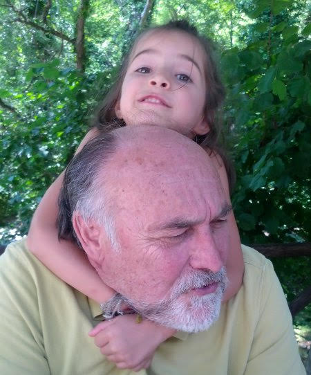
  
  
 

   
  
  
  
   con le cuginette Cate
  
 

   
  
  
  
   e Marti ( e il nuovo arrivo Chicco)
  
 

   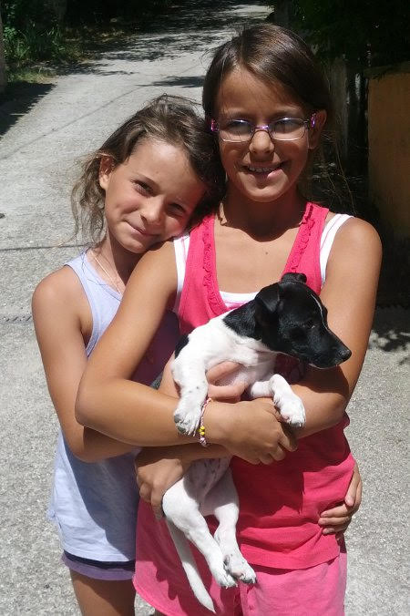
  
  
  
   e facciamo tante cose consolidate, come la passeggiata nel fiume alle Cafanne
  
 

   
  
  
  
   o le chiacchere sulla fonte
  
 

   
  
  
  
   e cose nuove, come marghe in bici senza rotelle[
   
  
  
  
   e il museo del pianoforte storico e del suono a Fabriano con M&amp;P e i nonni
  
 

   
  
  
 

   
  
  
 

## La truppa a Marotta
*07-08-2013*

 
  
   Siamo in trasferta al mare ... Marghe, Mati e i cugini Martina e Guido.
  
 

   
  
  
  
   Cenetta in camper
  
 

   
  
  
  
   Gelatino
  
 

   
  
  
  
   E dulcis in fundo ... Bagno di mezzanotte
  
 

   
  
  
 

## Calabria ionica
*24-08-2013*

 
  
   Quest'anno un itinerario poco turistico, la calabria ionica da Rossano Calabro a Roccella Ionica, sempre con i nostri fedeli compagni di viaggio Giorgio, Manu e Anna[
   
  
  
  
   e i due inossidabili camper Ronzinante e Nonno Tartarugo!
  
 

   
  
  
  
   Iniziamo con una visita al museo della liquirizia Amarelli a Rossano, dove troviamo una traccia dell'attività della nostra famiglia nel settore....e conosciamo il proprietario della fabbrica che ci racconta di Don Salvatore (il papà di nonna Lilly)
  
  
   ....che amozione!! [
   
  
  
  
   Poi tutti al mare!!! Primo campeggio a Punta Alice, vicino Cirò Marina.
  
  
   C'e tutto quello che 'le bimbe' desiderano: l'animazione, il parco giochi (in cui perdersi la sera)
  
  
   , una bella spiaggia di sassolini in cui si aggirano Miss sorriso furbetto
  
 

   
  
  
  
   e miss fucile ad acqua
  
 

   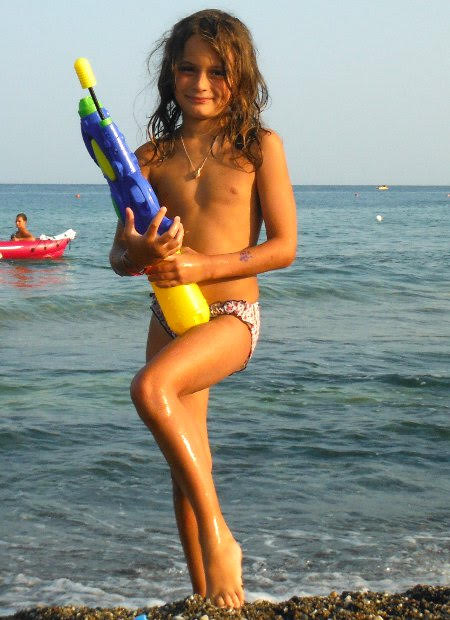
  
  
  
   e una mega piscina in cui fare i tuffi
  
 

   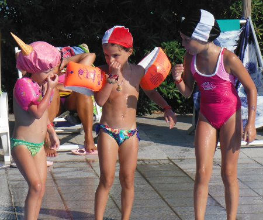
  
  
  
   Che soggette!!
  
 

   
  
  
 

   
  
  
 

   
  
  
  

  

  
   <strong>
    Scena sulla riva
   </strong>
   : nugolo di bagnanti intorno ad uno squalo di 2 metri spiaggiato, signore tremanti e preoccupate che i bambini possano essere traumatizzati da questa immagine e Marghe che supera la barriera di gente e va ad accarezzarlo!!!
  
  
   Giorgio, in risposta al grido di terrore di una signora: "Tranquilla signora, è lo squalo che deve avere paura di Margherita!!!"
  
  
   "Marghe come è la pelle dello squalo?" "mhhhh ... un pò ruvida e un pò morbida!!"
  
  

  
   In questa vacanza impariamo a pescare con la canna
  
 

   
  
  
 

   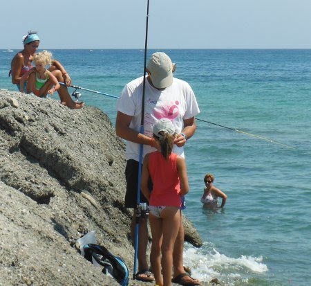
  
  
  
   a fare snorkeling con maschera e pinne
  
 

   
  
  
  
   e a nuotare al largo per vedere pesci e meduse
  
 

   
  
  
  
   Ma soprattutto questa vacanza è all'insegna del vero relax
  
 

   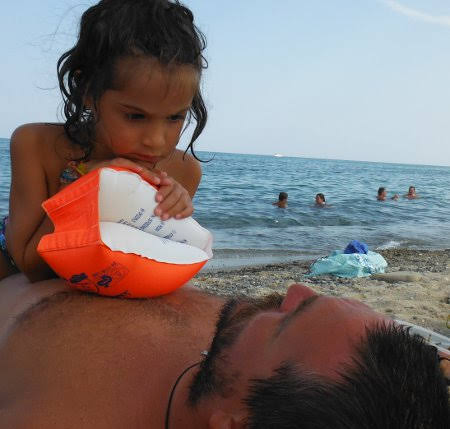
  
  
  
   e delle coccole
  
 

   
  
  
  
   Per ferragosto ci spostiamo al fresco sulla Sila. Ci divertiamo come scoiattoli a SilAvventura
  
 

   
  
  
  
   tra percorsi in mezzo agli alberi, moschettoni, carrucole e pareti attrezzate
  
 

   
  
  
 

   
  
  
 

   
  
  
   
  
  
  
   E poi tutti sul lago Arvo, prima a tirare sassi
  
 

   
  
  
  
   e dopo una bella cenetta
  
 

   
  
  
  
   con il nostro mitico Mr BBQ!!!! (e il Michele di turno che attacca bottone e ci regala qualche bottiglia di vino!)
  
 

   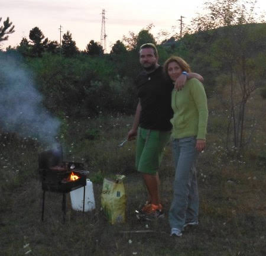
  
  
 

   
  
  
  
   Ovviamente non possono mancare i fuochi d'artificio a Lorica, la festa di paese a Lorica, il benzinaio a Lorica, etc...
  
 

   
  
  
  
   Andiamo a visitare la riserva del corpo forestale nel Parco nazionale della Sila
  
 

   
  
  
 

   
  
  
  
   dove troviamo i recinti con i lupi e i cerbiatti e passeggiando nel bosco
  
 

   
  
  
  
   cerchiamo del materiale per creare buffi cappelli!
  
 

   
  
  
 

   
  
  
  
   Pranziamo sul lago Ampollino, dove ci accampiamo e rimaniamo fermi fino alla sera ad aspettare il defluire del traffico! Sono tutti qui i calabresi a ferragosto!!!
  
 

   
  
  
  
   Concludiamo la tappa montana con una visita ai Giganti della Sila, una piccola foresta di alberi secolari altissimi
  
 

   
  
  
  
   e con tronchi enormi!
  
 

   
  
  
  
   E adesso di nuovo al mare ... tappa a Le Castella!
  
  
   Che bello il castello al tramonto!
  
 

   
  
  
 

   
  
  
 

   
  
  
  
   e che divertimento affittare il gommone!!!
  
 

   
  
  
  
   e fare i tuffi al largo!
  
 

   
  
  
 

   
  
  
  
   Poi ci spostiamo ancora più a sud a Santa Caterina dello Ionio, dove Giorgio pesca un bel pescione [
   
  
  
  
   e la sera ci fermiamo a cenare in spiaggia al chiaro di luna!
  
  
   Visitiamo una chiesina piccolissima, la cattolica di Stilo
  
 

   
  
  
  
   e infine lasciamo la costa Ionica per fermarci a Mammola, ridente località famosa per lo 'Stocco' e per il MUSABA (Museo di Santa Barbara)
  
  
   , un posto molto interessante in cui ci accoglie un enorme jeco
  
 

   
  
  
  
   e ovunque troviamo murales coloratissimi
  
 

   
  
  
  
   alcuni molto divertenti
  
 

   
  
  
  
   bellissimi mosaici
  
 

   
  
  
  
   alcuni ancora da completare ... la piccola artista Matilde lascia il segno del suo passaggio nel laboratorio all'aperto
  
 

   
  
  
  
   sculture buffe sono ovunque
  
 

   
  
  
 

   
  
  
  
   e infine la particolarissima casa dell'artista Nick Spatari, in cui non ci dispiacerebbe vivere!!
  
 

   
  
  
  
   Il nostro viaggio termina con una tappa al bowling di Catanzaro in una giornata di brutto tempo
  
 

   
  
  
  
   e un ultimo bagno a Maratea!
  
 

   
  
  
  
   NOTA MALATTIE: a Margherita esce l'ernia inguinale! :(
  
  
   Arrivederci alla prossima vacanza tutte e tre insieme!
  
 

   
  
  
 

## Spidocchiati!
*24-08-2013*

 
  
   Quest'estate le bimbe e la mamma si sono prese i pidocchi! Però il mitico papone ha rasato tutte e tre e i pidocchi sono spariti! Nuovo look per tutte! :)
  
 

## Barcellona
*02-09-2013*

 
  
   Il nostro quinto scambio casa è con un'allegra famiglia di Barcellona! E questa volta vengono anche nonno Gianni e nonna Lilly!
  
  
   <strong>
    24:
   </strong>
   si parte con l'aereo....ognuno con la sua valigia
  
 

   
  
  
  
   La casa a Barcellona è molto bella e in centro, dietro il mercato della Boqueria. Pranziamo e poi due passi al mercato, pieno di frutta coloratissima [
   
  
  
  
   e succhi e ghiaccioli di tutti i tipi!
  
 

   
  
  
  
   poi andiamo a Palau Guell. Le bimbe hanno il loro primo approccio con Gaudì e con l'aiuto delle audio guide apprezzano molto di più la visita!
  
 

   
  
  
  
   Poi tutti sul tetto, pieno di comignoli effetto alberi di una foresta incantata!
  
 

   
  
  
  
   A seguire visitiamo la zona del porto
  
 

   
  
  
  
   vicino alla statua di Cristoforo Colombo
  
 

   
  
  
  
   <strong>
    25
   </strong>
   : Visita alla Sagrada Familia! Imponente, affascinante, mistica!
  
 

   
  
  
 

   
  
  
  
   Iniziamo il gioco di questa vacanza: P ha avuto la brillante idea di comprare un block-notes ciascuna per scrivere e disegnare le emozioni....e funziona!
  
  
   Qui le buffe guglie della Sagrada
  
 

   
  
  
  
   e il disegno di Mati[
   
  
  
  
   Pranziamo in un bistrò difronte alla Pedrera, e poi entriamo a visitarla
  
 

   
  
  
 

   
  
  
  
   Torniamo a casa a piedi attraversando Diagonal. Relax e poi a cena fuori a base di paella e 'fideua'(una paella con degli spaghetti)
  
  
   .
  
  
   <strong>
    26:
   </strong>
   oggi piove! Andiamo al MACBA, il museo di arte moderna. [
   
  
  
 

   
  
  
  
   dove le bimbe disegnano i loro capolavori, come 'Caos di oro e argento' ! e cena con le Tapas!
  
  
   <strong>
    27
   </strong>
   :
   <strong>
   </strong>
   mattina alla Fondazione Mirò
  
 

   
  
  
  
   mhhhhh....figo! Anche questi li disegnamo!
  
 

   
  
  
  
   e sulla terrazza buffe sculture ....e buffi personaggi!
  
 

   
  
  
 

   
  
  
  
   passeggiata per i giardini del Montjuic
  
 

   
  
  
 

   
  
  
  
   Stasera le bimbe stanno con i nonni e M&amp;P si regalano un concerto a Casa Batlò!
  
 

   
  
  
  
   <strong>
    28
   </strong>
   : mattinata di shopping nel quartiere del Barrio Gotico, e S.Maria del Mar.
  
 

   
  
  
 

   
  
  
  
   tutti insieme
  
 

   
  
  
 

   
  
  
  
   e pranzo con tapas e cerveca! (zumo per le bimbe!)
  
 

   
  
  
 

   
  
  
  
   Relax a Parco della Ciuttadella
  
 

   
  
  
  
   tra mammut
  
 

   
  
  
  
   e gechi!
  
 

   
  
  
  
   e poi ancora passeggiate per questa bellissima città. Entriamo nella Cattedrale, dove nel chiostro ci sono delle oche....
  
 

   
  
  
  
   .... e le disegnano: Mapi
  
 

   
  
  
  
   Mati
  
 

   
  
  
  
   Marghe
  
 

   
  
  
  
   Ci fermiamo in strada ad ascoltare un gruppo di ragazzi molto bravi che cantano e suonano.
  
  
   <strong>
    29
   </strong>
   : I nonni sono partiti, e noi andiamo a visitare il bellissimo museo Cosmo Caixa. All'ingresso i due barbuti alla reception non ci danno retta....chissà perchè!!!!
  
 

   
  
  
  
   Il museo è bellissimo, con un enorme albero al centro
  
 

   
  
  
  
   è pieno di esperimenti da fare
  
 

   
  
  
  
   e un acquario enorme[
   
  
  
  
   ... allo shop M non resiste al pupazzetto della carie! Che dolore!!!
  
 

   
  
  
  
   e ad avere il mondo ai suoi piedi!
  
 

   
  
  
  
   <strong>
    30
   </strong>
   : Oggi si va in bici! Prima al museo di Picasso e poi al mare! Percorriamo tutta la zona del Porto Olimpico
  
 

   
  
  
  
   e facciamo anche il bagno e giochiamo sulla spiaggia!
  
 

   
  
  
 

   
  
  
  
   Un pò di riposo....quanti Km in bici! Bravissime cucciole!
  
 

   
  
  
  
   Tornando verso il porto vecchio e la barcelloneta troviamo un signore che ci fa fare le bolle di sapone giganti!
  
 

   
  
  
 

   
  
  
  
   A fine giornata .... dai Marghe, dai Mapi, che lumaconi!!!
  
 

   
  
  
  
   Torniamo a casa sfiniti!
  
  
   <strong>
    31
   </strong>
   : Il nostro ultimo giorno a Barcellona (SOB :( )
  
  
   lo dedichiamo a Gaudì e andiamo a vedere il suo ennesimo capolavoro, Park Guell
  
 

   
  
  
  
   fortuna che c'è la scala mobile per arrivare!
  
 

   
  
  
  
   però ne vale proprio la pena! E' stupendo!
  
 

   
  
  
  
   tutte queste maioliche colorate!
  
 

   
  
  
  
   e un geco!
  
 

   
  
  
  
   si fanno anche buffi incontri....
  
 

   
  
  
 

   
  
  
  
   Arrivederci Barcellona! E' stata davvero una vacanza fantastica!!
  
 

   
  
  
 

## Benvenute micine!!!
*04-09-2013*

 
  
   Oggi siamo andate a prendere due super cucciole di 40 giorni! Eccole appena arrivate a casa nostra! Accoccolate da brave sorelline!
  
 

   
  
  
  
   Si chiamano Pimpa (di margherita)
  
 

   
  
  
  
   e Quit (di matilde)
  
 

   
  
  
  
   Sono due giocherellone ( e amano le scarpe come tutte le donne)
  
 

   
  
  
 

   
  
  
  
   e sono buffissime, giocano tra di loro rotolandosi e facendosi gli agguati e poi si addormentano nelle posizioni e nei posti più strani!!!
  
 

   
  
  
 

   
  
  
 

   
  
  
 

## Auguri Matilde!!!!
*08-09-2013*

 
  
   Un numero speciale questo 7!!
  
 

   
  
  
  
   Un bel mazzo di fiori da parte della tua sorellina
  
 

   
  
  
  
   e una piccola festicciola a casa con gli amichetti (sei stata bravissima a fare la tua torta di compleanno... un 7 di pan di stelle!!)
  
 

   
  
  
  
   E dopo il trambusto un pò di relax in
   <strong>
    buona
   </strong>
   compagnia con una bella fetta di cocomero!
  
 

   
  
  
  
   e una dolce micetta addormentata su di te!!
  
 

   
  
  
  
   Proprio un bel compleanno vero??
  
 

   
  
  
 

## Matrimonio di Ele&Toni
*22-09-2013*

 
  
   Iniziamo dall'addio al nubilato! Una bella cenetta su un barcone sul tevere ....con qualche accessorio divertente....
  
 

   
  
  
 

   
  
  
  
   e un pò di scrap per fare i biglietti di auguri agli sposini!
  
 

   
  
  
  
   Poi il grande giorno.... due coccole a Marta per rilassarsi un pò ..
  
 

   
  
  
  
   due colpi di spazzola....et voilà!
  
 

   
  
  
  
   ... manca solo il vestito... ah ....eccolo!
  
 

   
  
  
  
   Ele...lo devi indossare! OK adesso sei perfetta!
  
 

   
  
  
  
   Facciamo il taglio del nastro (da cantiere)
  
 

   
  
  
  
   e poi tutti i tuoi nipotini intorno
  
 

   
  
  
  
   che non vedevano l'ora di portarti il velo!
  
 

   
  
  
  
   Si va in chiesa .... e si esce sposati! Facile no??
  
  
   Evviva gli sposi!
  
 

   
  
  
  
   pronta con il riso Cate?
  
 

   
  
  
  
   Eccoli!!
  
 

   
  
  
  
   Tantissimi auguri ragazzi!!
  
 

   
  
  
  
   Da tutti noi!
  
 

   
  
  
  
   E per regalo un oggetto speciale fatto da andrea, il cavatappiano!!
  
 

   
  
  
 

## Auguri Margherita!
*24-09-2013*

 
  
   Tanti auguri per i tuoi 5 anni cucciola!!!
  
 

   
  
  
  
   E per regalo una lezione di prova di equitazione (dove tu hai chiesto alla maestra  'quando andiamo al galoppo' e poi 'quando saltiamo gli ostacoli?' )
  
 

   
  
  
  
   e prova anche Mati sul pony Caterina!
  
 

   
  
  
  
   E poi nel pomeriggio tanti amichetti a festeggiare il tuo compleanno!
  
 

   
  
  
 

## Maker Faire Roma! Il nostro Papà è un inventore!
*07-10-2013*

 
  
   Per la prima volta a Roma un evento internazionale....il maker faire, la fiera degli inventori!
  
 

   
  
  
  
   E ovviamente il nostro Mapy non può mancare, con i suoi progetti e le sue creazioni artistiche.
  
  
   Allo stand ha portato la terrorizzata pianta di pomodoro oggetto dei suoi studi-torture (
   <a href="http://pleased-fp7.eu/">
    http://pleased-fp7.eu/
   </a>
  
  
   )
  
 

   
  
  
  
   e il cavatappi musicale (un regalo per Ele&amp;Toni)
  
 

   
  
  
  
   Lo stand era affollato di curiosi (riconoscete qualcuno?)
  
 

   
  
  
  
   ma le vallette erano più brave ...e più belle di mapy!!
  
 

   
  
  
  
   Alla fiera c'erano tantissime cose interessanti da vedere: le stampanti 3D
  
 

   
  
  
  
   la scuola di robot subacquei per bambini
  
 

   
  
  
  
   la gooble bike (la bici collegata a streetview di google maps)
  
 

   
  
  
  
   i robot che giocano a pallone
  
 

   
  
  
  
   gli stecchini luminosi fatti dai bambini
  
 

   
  
  
  
   Insomma proprio una bella giornata!!! Bravo MAPY!!!
  
 

## Venezia e la Biennale
*21-10-2013*

 
  
   Questo we andiamo a Venezia con zia Betta e Caterina ad acculturarci alla Biennale d'arte!
  
 

   
  
  
  
   La città è magica e le bimbe sono entusiaste dei canali, dei ponti, delle calli, dei campi, dei sottoporteghi ... e stupite perchè non ci sono nè strade nè macchine!
  
 

   
  
  
   
  
  
 

   
  
  
 

   
  
  
   
  
  
  
   Certo il ponte più affascinante è quello dei 'sospiri', la sua storia le incuriosisce molto!
  
 

   
  
  
  
   E poi le gondole....che belle...e che romantiche!
  
 

   
  
  
  
   A Venezia si corre senza pericoli
  
 

   
  
  
  
   si sale sui pozzi
  
 

   
  
  
  
   ci si riposa quando si è stanchi
  
 

   
  
  
 

   
  
  
   
  
  
  
   si trovano buffi giochi da fare
  
 

   
  
  
 

   
  
  
  
   e strane statue ( o strane bambine??)
  
 

   
  
  
  
   ottimi biscottini zuccherosi
  
 

   
  
  
  
   ... e poi non manca mai lo spritz con panini caldi e sfiziosi!
  
 

   
  
  
  
   Ma adesso si va alla
   <strong>
    Biennale
   </strong>
   !
  
 

   
  
  
  
   Giriamo per i padiglioni, ovviamente con cartina alla mano....per segnare tutto quello che vediamo ...
  
 

   
  
  
  
   Iniziamo dal prato di rose
  
 

   
  
  
  
   poi le luci psichedeliche
  
 

   
  
  
 

   
  
  
  
   le composizioni di sedie
  
 

   
  
  
  
   la stanza degli specchi e quella del buio pesto
  
 

   
  
  
 

   
  
  
  
   la barca rivestita di azulejos
  
 

   
  
  
  
   con all'interno un 'mare' fatto all'uncinetto!
  
 

   
  
  
 

   
  
  
  
   ... insomma sono proprio MATTI questi artisti!!
  
  
   Anche se pure i veneziani .... in quanto a scorci artistici....
  
 

   
  
  
 

   
  
  
  
   Ciao Venezia ... alla prossima!!
  
 

   
  
  
 

## C'è poesia ...
*25-10-2013*

 
  
   Matilde gioca alla maestra ... un pensierino di un suo "alunno" è davvero poetico
  
  
   Io vado in montagna e porto
  
  
   una matita colorata
  
  
   un girasole raccolto in un campo
  
  
   una pezza grande per dormire
  
 

## WE abruzzese
*28-10-2013*

 
  
   Evviva sono arrivati zia Giorgia e Morgan! Nel we si parte con loro e i nonni per l'Abruzzo. Tappa (triste)
  
  
   a L'Aquila che ancora è tutta da ricostruire!
  
 

   
  
  
  
   Troviamo un buffo frutto che nonno riconosce ... la maclura pomifera!
  
 

   
  
  
  
   Poi andiamo a Santo Stefano di Sessanio, un bellissimo paesino alle pendici del Gran Sasso
  
 

   
  
  
 

   
  
  
  
   La mattina si parte per una gita nel 'Piccolo Tibet', la piana che da Santo Stefano porta a Campo Imperatore. Ci sono tantissime mucche intorno a dei piccoli laghetti
  
 

   
  
  
  
   dove anche se Mati cercava di tenerlo ...
  
 

   
  
  
  
   Morgan è riuscito a scappare e a farsi il bagno, sotto lo sguardo interrogativo delle mucche!
  
 

   
  
  
  
   Da Campo Imperatore facciamo la passeggiata che porta al rifugio Duca degli Abruzzi (2388m)
  
  
   ! Che salita!!!
  
 

   
  
  
  
   Bravissime bimbe (e nonni!!)
  
  
   ...la salita è proprio ripida ...
  
 

   
  
  
  
   ma il panorama da su è stupendo .. e che giornata estiva, senza una nuvola!
  
 

   
  
  
  
   ecco il corno piccolo e il corno grande, un pirata e il suo pappagallo (ah-ah)
  
  
   !
  
 

   
  
  
  
   La sera abbondante zuppa di lenticchie e bistecca per recuperare le forze! La mattina dopo altra passeggiata ... meta Rocca Calascio! Almeno questa volta è in piano e ci sono tante cose da osservare ...
  
 

   
  
  
  
   e da raccogliere (anche bacche velenose ovviamente!)
  
 

   
  
  
  
   Poi una piccola pausa prima dell'ultimo pezzo in salita
  
 

   
  
  
  
   che ci porta alla rocca, il castello più alto d'italia!
  
 

   
  
  
 

   
  
  
  
   Qui il panorama è davvero mozzafiato, sembra di essere sul tetto del mondo!
  
 

   
  
  
 

   
  
  
  
   Un ottimo pranzetto al rifugio della rocca, e soprattutto le coccole di zia, ci rimettono al mondo!
  
 

   
  
  
 

## Perugia e Gubbio
*03-11-2013*

 
  
   Questo we inizia con il compleanno di Anna! TANTI AUGURI!!!!
  
 

   
  
  
  
   Alla festa passa anche Daniela con la sua nipotina ....che piacere rivederla!!!
  
 

   
  
  
  
   Poi prendiamo i camper e ce ne andiamo tutti a Perugia! Ci raggiungono anche Alessia e Anita!
  
 

   
  
  
  
   Qui fa freschetto e piove! La mattina dopo passeggiata per Gubbio
  
 

   
  
  
 

   
  
  
  
   dove c'è la sagra del Tartufo .... gnam gnam!!!
  
 

   
  
  
 

   
  
  
  
   La sera cenetta a base di strangozzi con gorgonzola al tartufo, salame al tartufo e crescette!!
  
  
   Il giorno dopo sulla via del ritorno ci fermiamo a La Scarzuola, un posto incantato nascosto nei boschi! Il proprietario è un pò folle ma simpatico e ce la visitiamo tutta!
  
  
   "_ rappresenta il Mondo in generale e in particolare il mio Mondo - quello in cui ho avuto la sorte di vivere e lavorare - dell'Arte, della Cultura, della Mondanità, dell'Eleganza, dei Piaceri __(anche dei Vizi, della Ricchezza, e dei Poteri ecc.)
  
  
   in cui però ho fatto posto per le _
   <em>
    oasi di raccoglimento, di studio, di lavoro, di musica e di silenzio, di Grandezze e Miseria, di vita sociale e di vita eremitica, di contemplazione in solitudine, regno della Fantasia, delle Favole, dei Miti, Echi e Riflessi fuori dal tempo e dallo spazio perchè ognuno ci può trovare echi di molto passato e note dell'avvenire...
   </em>
   "
   <strong>
    Tomaso Buzzi
   </strong>
  
 

   
  
  
 

   
  
  
   
  
  
 

   
  
  
 

   
  
  
 

   
  
  
  
   Ciao ciao!!
  
 

   
  
  
 

## Autunno
*29-11-2013*

 
  
   Novembre è stato un mese di riposo dopo i tanti we trascorsi in giro! E' iniziato il freddo e si sta bene a casa! Ci siamo goduti le micine
  
 

   
  
  
  
   e abbiamo fatto tanti dolci e lavoretti![
   
  
  
 

   
  
  
 

   
  
  
  
   e poi la sera una bella lettura
  
 

   
  
  
  
   Ci siamo anche vestite da streghette per Halloween insieme a Sara e abbiamo fatto 'dolcetto scherzetto' per il palazzo!
  
 

   
  
  
  
   e siamo andate a vedere il Cirque du Soleil con zia e Cate[
   
  
  
 

## L'ermia
*30-11-2013*

 
  
   La piccola Marghe oggi è stata operata di ernia inguinale bilaterale, o come dice lei "c'ho l'ermia".
  
 

   
  
  
  
   Si è svegiata molto arrabbiata ancora sotto effetto dell'anestesia ma poi dopo altre tre ore di sonno era come nuova! Ha sorriso, mangiato, giocato con Giulia, una bimba ricoverata con lei, e poi si è messa a correre per i corridoi del reparto! La sera stessa ci hanno dimesse! E' stata ricoperta di regali ...  anche il completo da fatina!
  
 

   
  
  
 

## Compleanno di Flavio
*08-12-2013*

 
  
   Per gli 8 anni di Flachen un bel BBQ nella casa nuova di Andrea, Marta e Riccardo!
  
  
   Una bellissima giornata di sole ...[
   
  
  
  
   con salsicce e bruschette fantastiche!
  
 

   
  
  
  
   e poi le torteeeee .... auguri Flavietto!!!
  
 

   
  
  
 

   
  
  
 

## 8 dicembre
*09-12-2013*

 
  
   Non poteva mancare anche quest'anno l'assaggio della mela caramellata a Piazza Navona!
  
 

   
  
  
  
   Abbiamo anche visto un 'maestro dell'argilla' che faceva dei bellissimi vasetti di creta, che ci ha anche regalato!
  
 

   
  
  
  
   Marghe-Nonno-Gina
  
 

   
  
  
  
   Marghe-Nonna-Gina
  
 

   
  
  
  
   Poi Mati&amp;Papy ci hanno raggiunti in bici dopo aver finito i compiti
  
 

   
  
  
 

## Auguri NONNA NONNA Maria!
*11-12-2013*

 
  
   ... dalle tue bis nipotine!!!
  
 

   
  
  
 

## Napoli
*16-12-2013*

 
  
   Oggi siamo andati a
   <strong>
    Napoli
   </strong>
   in treno con i nonni e Ray
  
 

   
  
  
  
   a vedere i presepi e San Gregorio Armeno
  
 

   
  
  
 

   
  
  
  
   e poi anche la 'Napoli Sotterranea'
  
 

   
  
  
  
   dove una lunghissima scala porta a 40 metri di profondità
  
 

   
  
  
  
   e si percorre il vecchio acquedotto ... addirittura ci coltivano anche le piante!
  
 

   
  
  
  
   e poi con una candela abbiamo fatto un percorso strettissimo che porta a delle vasche d'acqua... molto suggestivo!
  
 

   
  
  
 

   
  
  
  
   Poi due passi per la città, certo le famiglie sono proprio numerose qui!!
  
 

   
  
  
  
   una buona pizza e uno scatto con Peppa e Giorge!
  
 

   
  
  
  
   e siamo tornati a casa!
  
 

## Di recite e saggi
*19-12-2013*

 
  
   Marghe ha fatto la recita con i canti di Natale a scuola
  
 

   
  
  
  
   e Mati la lezione aperta di ginnastica in palestra
  
 

   
  
  
  
   che bel gruppone!
  
 

   
  
  
 

   
  
  
 

## BUON NATALE!!!
*24-12-2013*

 
  
   Tanti auguri a tutti da Matilde e Margherita
  
 

   
  
  
  
   M&amp;P
  
 

   
  
  
  
   e Pimpa e Quit!!
  
 

   
  
  
 

## Feste Natalizie
*30-12-2013*

 
  
   Quest'anno la vigilia di Natale è a casa di Cicia&amp;Manu! Evviva!
  
 

   
  
  
  
   e Babbo natale è arrivato lo stesso e ci ha portato tantissimi regali!!
  
 

   
  
  
  
   anche a Marta, Matilde e Caterina!
  
 

   
  
  
  
   Poi il
   <strong>
    25
   </strong>
   a pranzo dai nonni
  
 

   
  
  
  
   dove M ha fatto un buffissimo tronchetto con i dinosauri!
  
 

   
  
  
  
   Regalo più bello: quello che ci ha fatto Flavio (il gioco dell'oca fatto tutto da lui!)
  
 

   
  
  
  
   e poi l'area radiocomandato per Mati e le barbie per Marghe!
  
  
   Il
   <strong>
    27
   </strong>
   abbiamo festeggiato anche il compleanno di Marta! Il suo primo anno! Zia Betta ci ha dipinto la faccia da giraffa
  
 

   
  
  
  
   e Mati ha fatto tanti palloncini a cagnolino
  
 

   
  
  
  
   Per smaltire tutte le mangiate siamo andati a pattinare con Alessia
  
 

   
  
  
 

   
  
  
  
   .... ma altro che sport ... ci serve una vera dottoressa per dimagrire!!!
  
 

   
  
  
 

