# 2014

## Capodanno da zia Giorgia con Sara
*03-01-2014*

 
  
   Partenza il 29 alla volta della liguria. Facciamo tappa a Pisa per pranzo
  

   
  
  

   
  
  
  
   Il 30 è una bellissima giornata!
  

   
  
  
  
   e si fanno due passi nel bosco ...
  

   
  
  

   
  
  
  
   fino a Finalborgo
  

   
  
  
  
   e poi al mare
  

   
  
  
  
   Le mareggiate dei giorni scorsi hanno lasciato tantissimi tronchi con cui costruire le capanne.
  
  
   Il 31 passeggiata a Loano, con immancabile focaccia
  

   
  
  
  
   e aperitivo sul mare
  

   
  
  
  
   con conseguenti alicette fritte e 'cartoccio di totani da passeggio' ...e birrozza!
  

   
  
  
  
   Per la serata, cenetta a casa con ravioli e arrosto e poi a mezzanotte tutti su in terrazzo a fare i botti!
  

   
  
  
  
   E' iniziato l'anno nuovo!! Passeggiata con zia fino alla falesia
  

   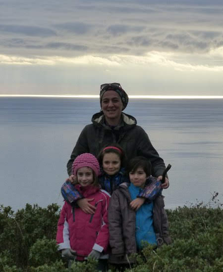
  
  
   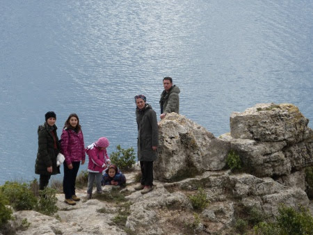
  
  

   
  
  
  
   e poi nella vecchia cava abbandonata
  

   
  
  

   
  
  
  
   ci sono anche i murales :)
  

   
  
  
  
   BUON ANNO A TUTTI!!!
  

   
  
  
 

## La prima neve
*07-01-2014*

 
  
   Andiamo sulla neve a Campo Catino per la Befana!!
  
  
   Matilde scia
  

   
  
  
  
   Margherita gioca nella neve
  

   
  
  
  
   Caterina fa la farfallina
  

   
  
  
  
   M&amp;P chiaccherano e sciano
  

   
  
  
  
   Catia fa le foto
  

   
  
  
  
   zia Betta è fighissima con il suo snowboard
  

   
  
  
  
   e Ray prova gli sci per la prima volta!
  

   
  
  
  
   .... ma il divertimento più grande è sempre con lo slittino!!!
  

   
  
  

   
  
  

   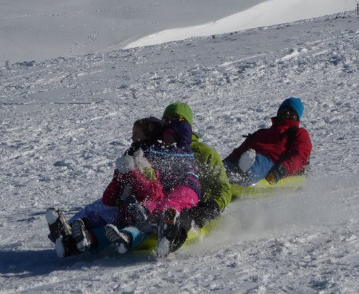
  
  

   
  
  

   
  
  
 

## Influenze e interventi
*20-01-2014*

 
  
   Mati, Meggy e mamma hanno avuto l'influenza e Pimpa e Quit sono state sterilizzate! Un piccolo ospedale la nostra casa in queste settimane!
  
 

## Osservatorio
*25-01-2014*

 
  
   Stasera siamo andati all'osservatorio Astronomico di Roma a Monte Porzio Catone a fare un laboratorio sul sistema solare! Purtroppo il cielo era coperto e non siamo riusciti a vedere le stelle ma ognuno di noi ha fatto il suo pianeta e abbiamo girato tutti intorno al sole!
  

   
  
  

   
  
  
 

## Cose da gatti ...
*03-02-2014*

 
  
   L'inverno è fatto per accucciarsi al calduccio
  

   
  
  
  
   e farsi coccolare
  

   
  
  
  
   ma appena arriva qualche bella giornata ....via ...fuori al sole!!! [
   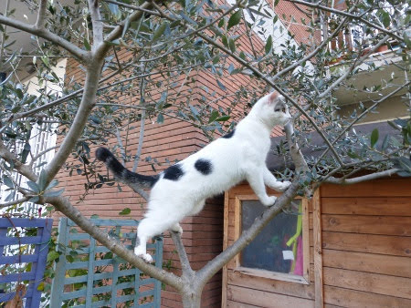
  
  

   
  
  
 

## TEDX Roma
*23-02-2014*

 
  
   Papà partecipa a TedX Roma!
  

   
  
  
  
   Bella esperienza!
  

   
  
  
  
   Come l'ha immaginato Matilde ...
  

   
  
  
 

## Carnevale
*27-02-2014*

 
  
   Questo carnevale piovoso non ci ha permesso di sfoggiare le nostre nuove maschere....ma le abbiamo 'indossate' lo stesso!
  

   
  
  

   
  
  
  
   Però il freddo ci ha fatti tornare a fare una sciatina a Campo Catino!
  

   
  
  

   
  
  
 

## San Martino di Castrozza
*25-03-2014*

 
  
   Quest'anno si va a sciare a San Martino .... e siamo proprio un bel gruppone!
Ci hanno sistemati tutti all'hotel Colfosco ... che invasione di romani!
  
  
   Il primo giorno i bimbi hanno fatto una discesina per l'assegnazione ai vari livelli delle scuole sci
  

   
  
  
  
   ... la cosa difficile è stata assegnare un livello a Morgana!! :D:D
  
  
   E poi tutti sulle piste ...
  

   
  
  

   
  
  

   
  
  
  
   e per festeggiare l'inizio della primavera un bellissimo fiore!!
  
  
  
   infine Luca
  

   
  
  
  <ul>
   <li>
    tanti baci ed effusioni
   </li>
  </ul>

   
  
  
   
  
  
   
  
  
   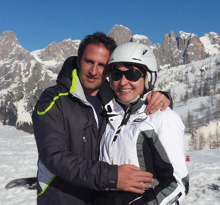
  
  
   
  
  
  <ul>
   <li>
    pupazzi di neve
   </li>
  </ul>

   
  
  

   
  
  

   
  
  
  <ul>
   <li>
    tanto SOLE e relax
   </li>
  </ul>

   
  
  
  
   ma soprattutto belle sciate e bella compagnia!!!!
  

   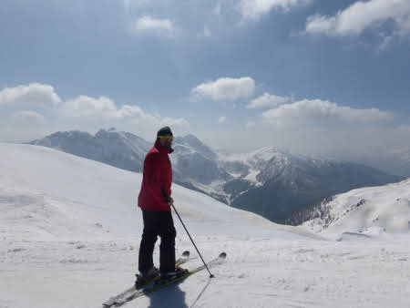
  
  

   
  
  

   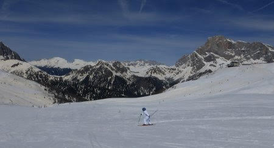
  
  

   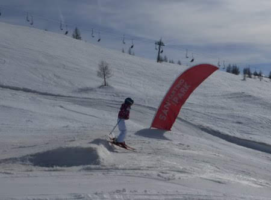
  
  

   
  
  
  
   E poi tanti eventi post sci, la fiaccolata dei bimbi
  

   
  
  
  
   quella degli adulti al tramonto (a cui M&amp;P hanno partecipato ... fortunatamente senza prendere fuoco!!)
  

   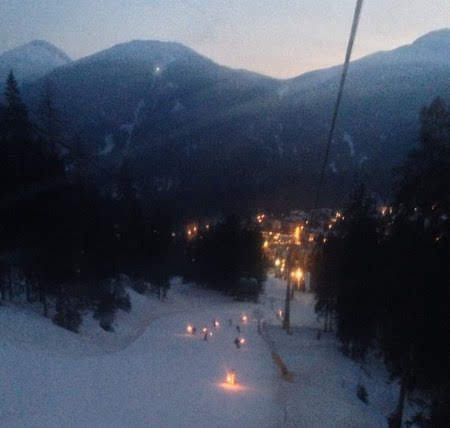
  
  
  
   con il falò finale sulla neve
  

   
  
  
  
   la sciata notturna ...  che bella!!! ( ops... eccetto il volo di marghe ...)
  

   
  
  

   
  
  
  
   la degustazione al rifugio ... con la motoslitta
  

   
  
  
  
   lo spettacolino di Mary Poppins
  

   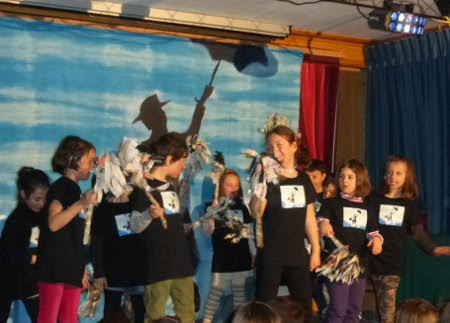
  
  
  
   la birretta (o cioccolata calda per i bimbi)
  
  
   a fine sciata!!
  

   
  
  

   
  
  
  
   e infine la gara ... sotto la neve e nella nebbia fitta!!! Bravissimi tutti i bimbi!
  

   
  
  
  
   Certo che bel panorama queste Pale .... soprattutto al tramonto
  

   
  
  

   
  
  
  
   Arrivederci
  

   
  
  
 

## Auguri M&P&nonno Gianni&nonna Franca
*02-04-2014*

 
  
   Marzo e Aprile ...quanti compleanni!!
  
  
   Auguri a papo con crema e fragoline la mattina
  

   
  
  
  
   e cena dal greco la sera!
  

   
  
  
  
   e a mamish con pranzo in campagna (e shampoo di petali)
  

   
  
  
  
   e bagnetto in notturna alle terme di bagnaccio
  

   
  
  
  
   ... insomma non ci possiamo lamentare!!!
  

   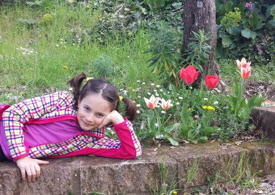
  
  
 

## Pasqua e pasquetta
*22-04-2014*

 
  
   Una bella giornata di pasqua in famiglia...con tante cose buone da mangiare
  

   
  
  
  
   e tanta tanta cioccolata!!!
  

   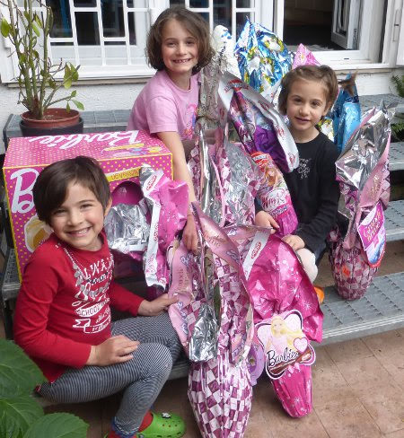
  
  
  
   E a pasquetta giro in bici lungo l'argine del tevere da porta portese a castel sant'angelo
  

   
  
  

   
  
  
  
   Grattachecca ....e pizza di pasqua col salame! Ottimo no??
  

   
  
  

   
  
  
  
   E poi relax a casa!
  

   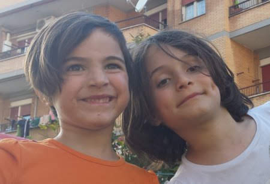
  
  
 

## Istanbul 
*03-05-2014*

 
  
   <strong>
    25 Aprile
   </strong>
   : Il nostro sesto scambio casa è in Turchia, ad Istanbul!
  

   
  
  
  
   Volo e taxi ed eccoci in questa bellissima casa sul mare nella zona asiatica della città, nel quartiere Moda-Kadikoy!
  

   
  
  
  
   Già il benvenuto ci piace tanto ...
  

   
  
  
  
   Ci rilassiamo un pò e poi usciamo per il quartiere
  

   
  
  
  
   dove facciamo subito conoscenza con le persone locali, tutte estremanente gentili ed affettuose con i bambini, e ci incuriosiamo del gioco del Moultezim
  

   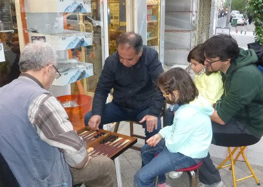
  
  
  
   qui, a detta delle guide, c'è il miglior ristorante della città...e ci trascorriamo la nostra prima serata! Tutto ottimo, kekab al pistacchio, polpettine speziate, carciofi e verdure tipiche!
  
  
   <strong>
    26 Aprile
   </strong>
   : alla stazione dei traghetti prendiamo l'immancabile e ribattezzato da Margherita 'pane ad anello' (simit in turco)
  

   
  
  
  
   poi saliti a bordo beviamo un ottimo thè turco
  

   
  
  
  
   e in 20 minuti siamo nel cuore della città.
  
  
   Aprile è il mese dei tulipani, e Istanbul è invasa da questi bellissimi fiori
  

   
  
  

   
  
  
  
   un giretto tra i negozi di 'delizie turche' .... torroni
  

   
  
  
  
   caramelle caramellosissime
  

   
  
  
  
   spremute di melograno
  

   
  
  
  
   e tanti tappeti
  

   
  
  
  
   e gatti dappertutto ...  anche nelle vetrine!!![
   
  
  
  
   Attraversiamo il grande viale che ci porta alla bellissima moschea blu![
   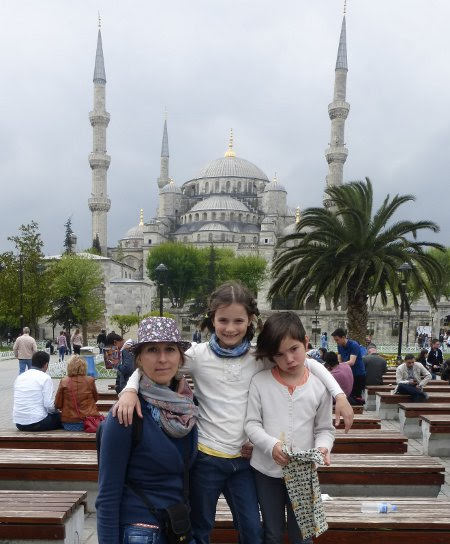
  
  
  
   Aspettiamo che finisca l'ora della preghiera per poter entrare[
   
  
  

   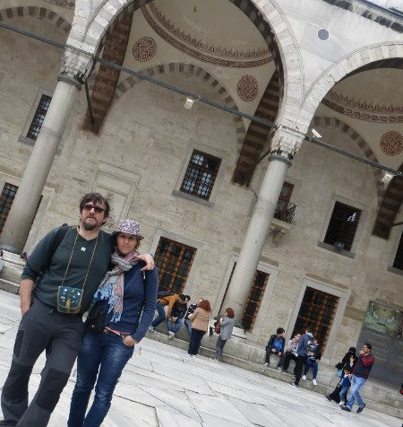
  
  
  
   e poi, levate le scarpe, eccoci in questo enorme e fantastico spazio blu[
   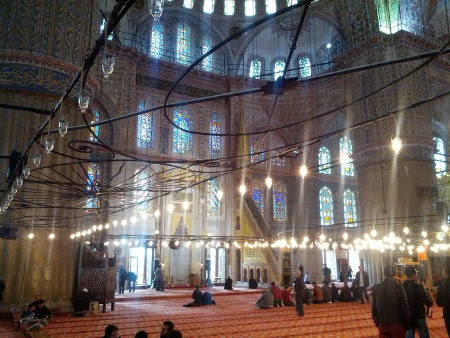
  
  
  
   tutti a capo coperto[
   
  
  
  
   e mati disegna le vetrate[
   
  
  
  
   <strong>
    27 Aprile:
   </strong>
   colazione in un romantico molo davanti alla nostra cas[
   
  
  

   
  
  
  
   e poi al Bazar delle Spezie, dove scopriamo una parte della città meno turistica e più viva:[
   
  
  
  
   passeggiando troviamo anche una delle innumerevoli mosche
  

   
  
  
  
   e poi ....finalmente la 'sorpresa' che ci ha organizzato mamma! Lo show dei delfini e poi....'andiamoci a mettere il costume dai!' ....
  

   
  
  

   
  
  

   
  
  

   
  
  

   
  
  

   
  
  
   
  
  

   
  
  
  
   WOW che emozioneeeee!!!! :D:D
  
  
   e per cena ....pesce!!! Hahahahaha
  
  
   PS: in questo ottimo ristorante mati e papo dimenticano il loro quaderno dei disegni :( :(   che peccato!!
  

   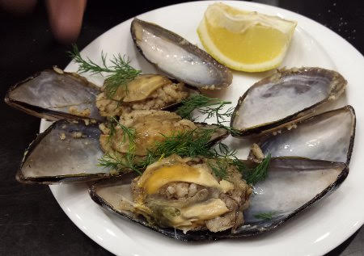
  
  
  
   <strong>
    28 Aprile
   </strong>
   : Oggi pioviggina, andiamo a vedere la Yerebatan Saray, la cisterna Basilica! Si scende 40 metri sotto terra e si torna indietro di un millennio....tra archi e colonne, acqua e carpe!
  

   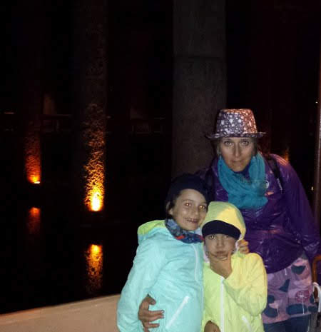
  
  
  
   e c'è anche una colonna con la testa di medusa (di cui margherita conosce tutta la storia)
  

   
  
  
  
   Poi prendiamo il tunnel sotterraneo che porta nel quartiere Beyoglu
  

   
  
  
  
   e percorriamo tutta la _?stiklal Caddesi, _un viale ieno di negozi e attraversato da un trenino storico divertentissimo
  

   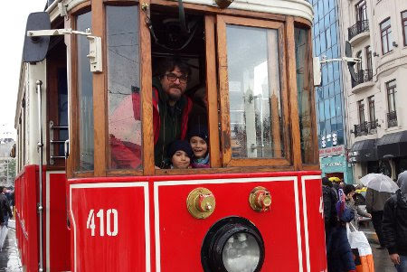
  
  
  
   anche perchè piove....[
   
  
  
  
   E poi saliamo sulla torre di Galata ... con un pò di delusione perchè si sale con l'ascensore e in cima c'è un ristorante... ma si gode un bellissimo panorama sulla città e sul bosforo
  

   
  
  
  
   Tornando a casa mangiamo un panino con il pesce alla piastra cotto da formidabili cuochi sballottati su una barca ormeggiata!!
  

   
  
  
  
   Ma anche la signora seduta a terra a cuocere 'piadine' ci piace tanto ... e passiamo spesso a trovarla!
  

   
  
  
  
   <strong>
    29 Aprile:
   </strong>
   oggi andiamo a vedere Aya Sofia
  

   
  
  
  
   imponente fuori e maestosamente ricca dentro
  

   
  
  
  
   da una finestrella sbirciamo un bellissimo scorcio della moschea blu, che è proprio difronte
  

   
  
  
  
   oggi c'è un bellissimo sole e ce lo godiamo tutto!!
  

   
  
  
  
   Passeggiamo un pò nei dintorni
  

   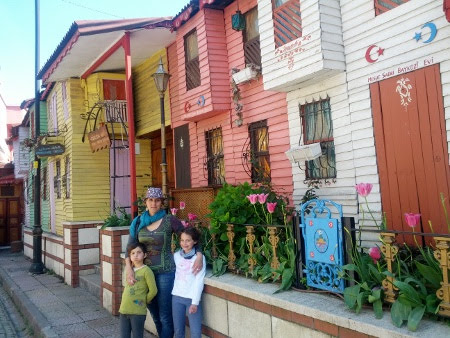
  
  
  
   e poi ci rilassiamo su un bel prato, mentre le bimbe giocano con tutti gli attrezzi da palestra disseminati sul lungo mare. Diamo un'occhiata alle mura terrestri che hanno difeso la città per secoli
  

   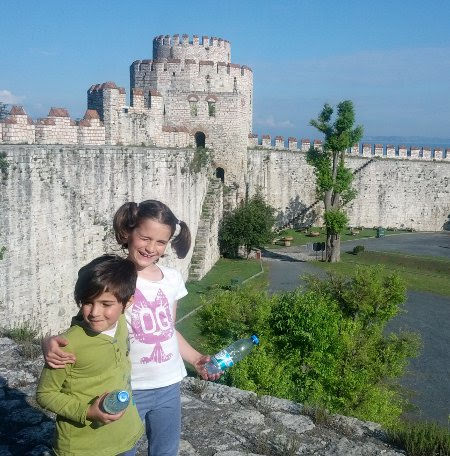
  
  
  
   quante scale!!
  

   
  
  
  
   A fine giornata, nella vecchia stazione di Sirkeci, tappa del famoso treno Orient Express, e allietati da un ottimo thè alla mela, vediamo lo spettacolo dei Dervisci rotanti! Figo!!!
  

   
  
  
  
   <strong>
    30 Aprile
   </strong>
   : oggi visitiamo il Palazzo del TopKapi! Che bello questo ingresso!
  

   
  
  
  
   Proviamo a raccontare alle bimbe storie di sultani, eunuchi e concubine ... un pò complicato ...ma loro erano proprio incuriosite!!
  

   
  
  
  
   poi entriamo anche nell'harem [
   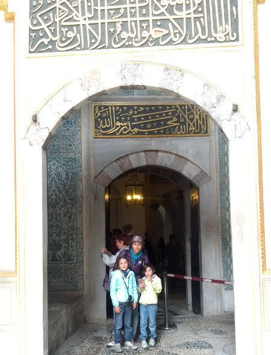
  
  

   
  
  
  
   Certo questi sultani la sapevano proprio lunga....che posto meraviglioso e che panorama da qui!!!
  

   
  
  
  
   Non poteva mancare la passeggiata al Gran Bazar ... ma senza farci abbindolare dai commercianti che, essendo un pò tardi, erano stanchi di assillare i turisti e contrattare!!
  

   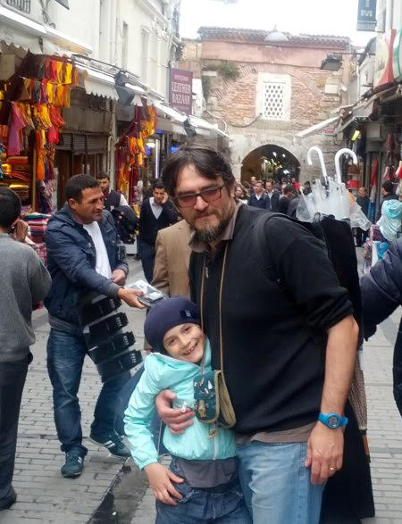
  
  
   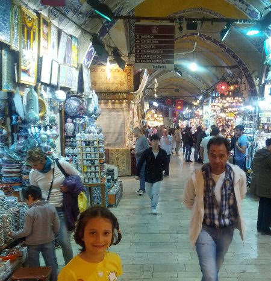
  
  
  
   <strong>
    1 Maggio
   </strong>
   : abbiamo trascorso la giornata ad Adalar, ovvero una delle isole dei principi al largo di Istanbul.
  
  
   Non ci sono macchine ma più di 200 carrozzelle tirate da coppie di cavalli che ti sfrecciano vicino a tutta velocità mentre si arrampicano sui collinotti dell'isola!
  
  
   Noi abbiamo preferito girare in bici!
  
  
   <strong>
    2 Maggio
   </strong>
   : :( si torna a casa ....ciao istanbul ... è stata una vacanza bellissima!!![
   
  
  
 

## zia Giorgia a roma
*06-05-2014*

 
  
   Atterriamo a roma e chi ci viene a prendere all'aereoporto facendoci una bellissima sorpresa?? .... ma certo.....zia!!!
  
  
   Il we lo trascorriamo con lei senza staccarci mai ... Matilde nemmeno per dormire!!! Sabato andiamo a vedere la mostra del National Geographic e domenica andiamo in campagna dai nonni
  

   
  
  

   
  
  

   
  
  

   
  
  
  
   Che bello stare con zia!!!
  

   
  
  
 

## Festa della Mamma!!
*12-05-2014*

 
  
   Mai festa della mamma fù più bella! Auguri, poesie e regalini appena sveglia e poi pic-nic con gli amici al campetto di molara
  

   
  
  
  
   e dopo qualche gonfiaggio con poco vento ....
  

   
  
  
  
   un bel voletto (grazie Mara!!)
  
  
   .... tutti i bimbi affascinati .... 'sembravi una winx!!!' :D:D
  

   
  
  
 

## Race for the cure e festa di Caterina
*19-05-2014*

 
  
   Mattina in rosa al circo massimo per la race for the cure!
  

   
  
  
  
   Passeggiata di 5Km!!! Che bello ... il cuore pieno di emozioni!!
  

   
  
  
  
   E poi ... è tutto pronto per la festa? Le bariste ci sono e i bimbi sono arrivati!
  

   
  
  
  
   Allora al via i giochi: tiro alla fune, bolle di sapone
  

   
  
  
  
   pentolaccia  [
   
  
  
  
   e molti altri .... e infine una magnifica torta ... creazione di mamma Betta!
  

   
  
  
  
   Siete bellissime bimbe!!!
  

   
  
  

## Pizze!!!
*26-05-2014*

 
  
   Una bella giornata ... e allora tutti dai nonni a fare le pizze al forno a legna!
  

   
  
  

   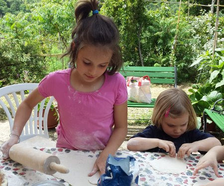
  
  
  
   e dopo una gran mangiata un pò di relax ....
  

   
  
  

   
  
  

   
  
  
  
   per poi dedicarci alla caccia (al serpente!!!)
  
  
   ... muniti di archi, frecce, spade e bastoni...
  

   
  
  

   
  
  

   
  
  
  
   Per fortuna nessuno ha avvistato il serpente....solo Ale (il solito fortunato)
  
  
   !!!!
  
 

## Cuochi
*01-06-2014*

 
  
   La passione dell'anno è la cucina non c'è dubbio .... ma altro che masterchef .... guardate che squadra!!!
  

   
  
  
  
   e come sono abili con le fruste
  

   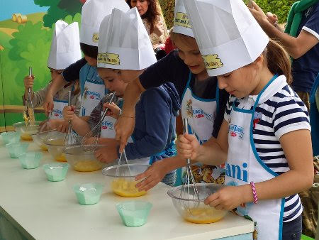
  
  
  
   e i pirottini
  

   
  
  
  
   E infine un ottimo plumcake, bruciacchiato dallo chef, e il diploma di piccolo cuoco!
  

   
  
  
 

## Gita a Orvieto
*02-06-2014*

 
  
   Oggi andiamo a trovare Marco nella sua bellissima casetta alle pendici della rocca di Orvieto!
  

   
  
  
  
   Marghe cuoce le salsicce insieme a Massi ...bandierina alzata quando sono cotte!!
  

   
  
  
  
   poi passeggiata nel bosco a cavallo del tronco di bambù
  

   
  
  

   
  
  
  
   e gelato in centro!
  

   
  
  

   
  
  

   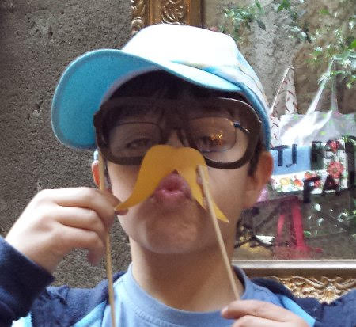
  
  

   
  
  

   
  
  

   
  
  
  
   Proprio una bella giornata!!
  

   
  
  
 

## Giorni di recite, saggi e gare
*12-06-2014*

 
  
   Giugno è sempre così....si raccolgono i frutti delle attività svolte durante l'anno....
  
  
   iniziamo con 'Il Barbiere di siviglia' al teatro Valle
  

   
  
  

   
  
  

   
  
  

   
  
  
  
   .... la lezione aperta di motoria di Marghe
  

   
  
  
  
   .... la lezione aperta di motoria di Mati
  

   
  
  
  
   il saggio di musica di Matilde
  

   
  
  
  
   e le gare di nuoto: Matilde dorso completo in 27.5 secondi nella vasca da 25 metri
  

   
  
  
   
  
  
  
   e Margherita molto aggressive ...
  

   
  
  
  
   .... gambe dorso in vasca piccola!!
  
 

## Tutti al mare!!
*23-06-2014*

 
  
   Finalmente si riprende Ronzi e via al mare! Tutti a santa severa!Ma chi sono quelle 3 scimmie sotto la sabbia?
  

   
  
  
  
   Ahhhh adesso le riconosco!!
  

   
  
  
  
   E Giorgio?? Esce dal mare con una mega spigola
  

   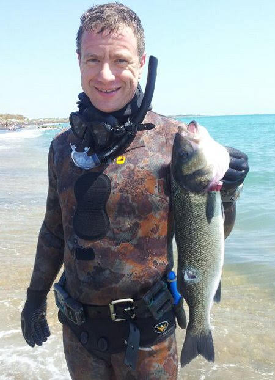
  
  
  
   che finisce tosto tosto su Mr BBQ!!! E anche questa volta risultato perfetto!!
  

   
  
  
 

## 2A: pizza di classe e pagella
*26-06-2014*

 
  
   Pizza di classe con le maestre Giovanna e Simonetta
  

   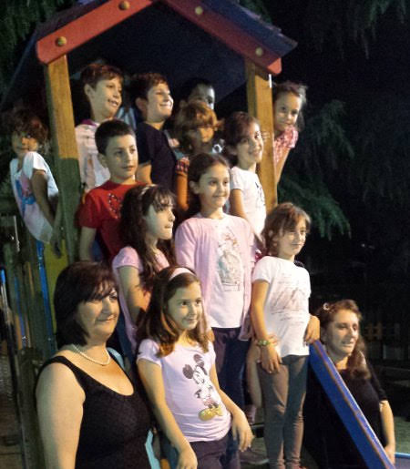
  
  
  
   e la bellissima pagella: tutti 10 e un 9 in italiano ... così si impegna a scrivere meglio! ;)
  
 
 

## Pigiama party
*27-06-2014*

 
  
   Queste bimbe sono proprio cresciute ... e vanno a dormire dalle loro amichette!
  
  
   Mati da Sophie
  

   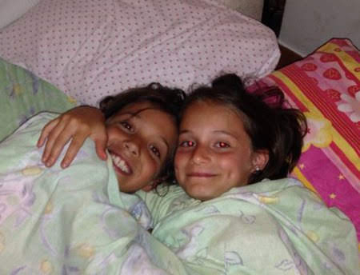
  
  
  
   e Marghe da Alessia
  

   
  
  
 

## 2papà+6bimbi ad Anzio
*16-07-2014*

 
  
   C'è da stare tranquilli ovviamente!! La banda è organizzata: Matteo, Matilde, Caterina,  Margherita[
   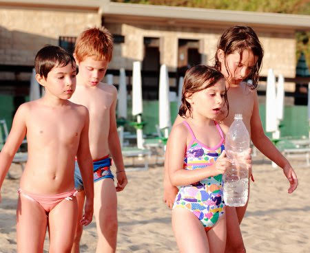
  
  
  
   e le due mascotte Emma e Laura
  

   
  
  
  
   I grandi, Mati e Matti, fanno il corso di vela
  

   
  
  

   
  
  

   
  
  
  
   e si divertono tantissimo.... ma soprattutto stringono un'amicizia forte basata sul calcio!! :D
  

   
  
  

   
  
  

   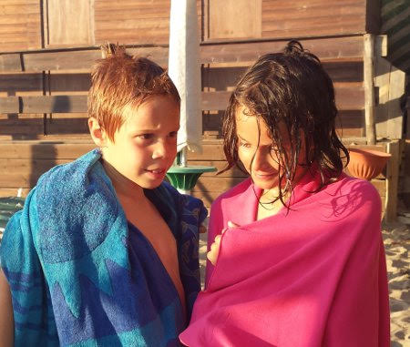
  
  
   
  
  
  
   e tutte le altre si divertono in spiaggia!!
  

   
  
  

   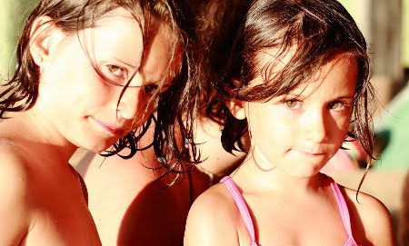
  
  
  
   Mitici papà ... dall'alba
  

   
  
  
  
   al tramonto (birretta inclusa)
  
  
   !!![
   
  
  
 

## Nic-Pic sul Catria
*28-07-2014*

 
  
   Anche se il tempo non è stato dei migliori ci ha permesso di fare un bel pic-nic sul monte Catria
  

   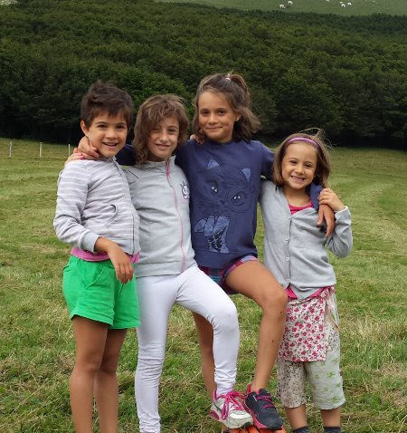
  
  

   
  
  
  
   con noi c'era anche Sara, zia Betta, Caterina e i nonni!
  

   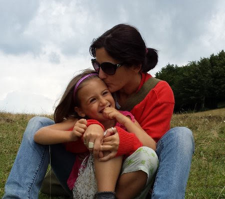
  
  
  
   Ci siamo sbaciucchiati tutti
  

   
  
  

   
  
  
  
   e infine un ottimo panino....pre temporale!
  

   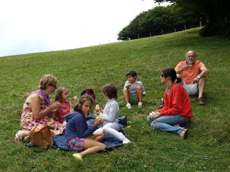
  
  
 

## Abruzzo e Puglia
*18-08-2014*

 
  
   In queste settimane pre-ferie di mamma, le bimbe se ne vanno a zonzo col babbo!
  
  
   Prima in abruzzo al mare
  

   
  
  

   
  
  

   
  
  
  
   vediamo anche la fiaccolata notturna dei sub a Rocca San Giovanni Chietino. Poi direzione Puglia, con tappa allo zoo safari di Fasano ...dormiamo davanti al cancello la notte tra i versi degli animali. E la mattina pronti all'entrata!
  

   
  
  
  
   Quanti animali che si affacciano al nostro finestrino![
   
  
  
  
   il cammello voleva tutto il sacchetto di fette biscottate e ha addentato anche il braccio di mamma
  
  

   
  
  

   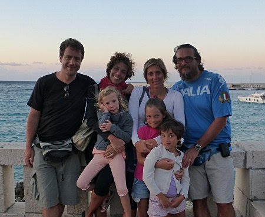
  
  

   
  
  
  
   e ai trulli di Alberobello prima di prendere la nave che ci porterà in Grecia
  

   
  
  

   
  
  

   
  
  

   
  
  

   
  
  
 

## Cefalonia e Lefkada
*07-09-2014*

 
  
   <strong>
    18 agosto:
   </strong>
   prendiamo il traghetto a Brindisi con un bellissimo tramonto! Camping on board stanotte!
  

   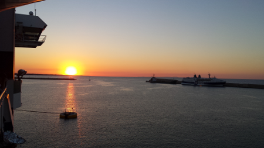
  
  
  
   <strong>
    19 agosto
   </strong>
   : primo bagno nella penisola di Lefkada a Dessimi, una piccola baia immersa nel verde!
  

   
  
  
  
   Gonfiamo la canoa e andiamo in perlustrazione! Avvistiamo una bellissima stella marina nellanostra escursione con maschere e pinne!
  

   
  
  
  
   e approdiamo su un isolotto![
   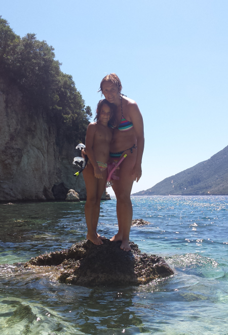
  
  
  
   poi attraversiamo l'isola e a Vassiliki 'cerchiamo' di prendere il traghetto per cefalonia ... ma lo perdiamo perchè qui siamo un'ora avanti.... e mentre il traghetto partiva noi eravamo a spasso per il paese a mangiare il gelato!!! :D Niente male, dormiamo sulla spiaggia!
  
  
   <strong>
    20 agosto:
   </strong>
   la mattina prendiamo il traghetto per Cefalonia, dove raggiungiamo Massimo, Paola, Andrea e Flavio che ci aspettano al porto! Finalmente tutti insieme!! Andiamo a fare un bel bagno nella baia di Antisamos, ciottoli piccoli e bianchi e acqua turchese!
  

   
  
  

   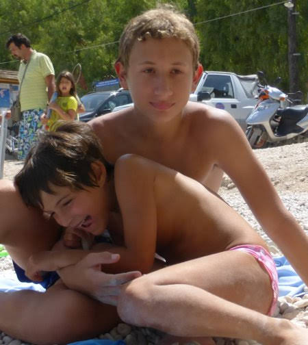
  
  
  
   Nel pomeriggio visita alle grotte di Drogarati, niente di che, ma allietate da una musica bellissima che suonava un tipo molto buffo con il suo disco armonico!
  

   
  
  
  
   La sera prima cena greca in una Taberna a Poros!
  

   
  
  
  
   <strong>
    21 agosto
   </strong>
   : oggi siamo a MOUNDA (o KAMINIA)
  
  
   ...famoso spiaggione delle tartarughe lunghissimo e sabbioso....ma di tartarughe nemmeno l'ombra! :(
  
  
   Però in compenso facciamo un fantastico vulcano fumante!
  

   
  
  

   
  
  
  
   e la sera debutto greco di Mr BBQ in riva al mare! Dormiano qui.
  
  
   <strong>
    22 agosto
   </strong>
   : raggiungiamo il gruppo in una bellissima caletta vicino Pesada dove, dopo aver attraversato un pò di scogli, ci accoglie un cartello che invita a lasciare le ciabatte e a  scendere sulla sabbia a piedi nudi! Che tuffi, che nuotate, che acqua!
  

   
  
  

   
  
  

   
  
  
  
   La sera, non stanchi, tutti in piscina!
  

   
  
  

   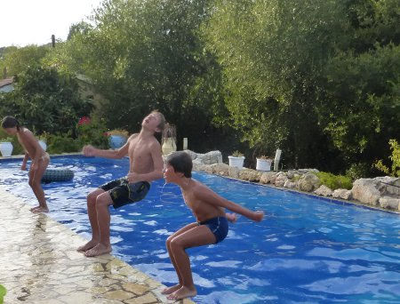
  
  

   
  
  

   
  
  
  
   e poi relax
  

   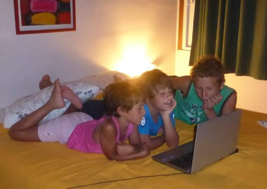
  
  
  
   e infine cena a bordo piscina!!
  

   
  
  
  
   <strong>
    23 agosto
   </strong>
   : altra giornata nei pressi di Pesada. La giornata trascorre con la costruzione di piccole navi con pezzetti di legno e raccolta di lumachine sugli scogli.
  

   
  
  

   
  
  
  
   La sera pasta con le lumachin! Slurp!!
  
  
   <strong>
    24 agosto
   </strong>
   : passeggiata al faro di Argostoli
  

   
  
  
  
   e a Katravothes, dove il mare scompare nel sottosulo e fa girare il mulino. Poi bagnetto a Lassi con gelato e aperitivo....quest'estate tutti il frappè!
  
  

   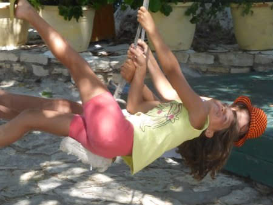
  
  
   
  
  
  
   relax sotto gli eucaliptus (con puntura d'ape alla manina per mati)
  

   
  
  

   
  
  
   
  
  
  
   e poi alla grotta di Melissani, che si attraversa con una barchetta
  

   
  
  

   
  
  
  
   e per finire area archeologica di Sami al tramonto
  

   
  
  

   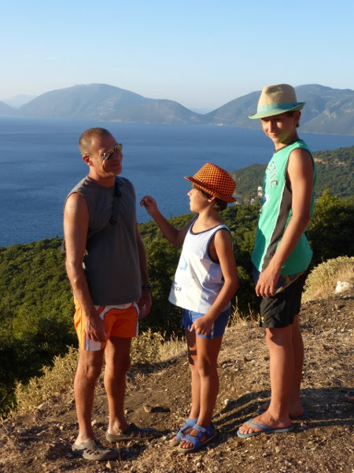
  
  

   
  
  

   
  
  
  
   <strong>
    26 agosto
   </strong>
   : oggi ce andiamo a Myrtos, spiaggione di ciottoli bianchi....in cui è impossibile camminare a piedi scalzi!
  

   
  
  

   
  
  

   
  
  

   
  
  
  
   la sera passeggiata al paesino di Assos con cena al porticciolo (mati ha la manina gongia!)
  

   
  
  

   
  
  

   
  
  

   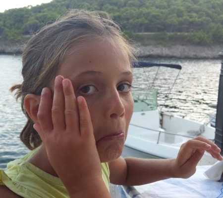
  
  

   
  
  

   
  
  
  
   <strong>
    27 agosto
   </strong>
   : passeggiata (e guardia medica)
  
  
   a Fiskardo e poi ci imbarchiamo per Lefkada.
  
  
   <strong>
    28 agosto
   </strong>
   : Katsima beach ...che dire...rotolarsi tra le onde e i sassolini, mare stupendo, parapendii, tuffi, tramonto....
  

   
  
  

   
  
  

   
  
  

   
  
  

   
  
  

   
  
  

   
  
  

   
  
  
  
   <strong>
    29 agosto
   </strong>
   : Porto Katsiki .... una delle spiagge più belle di Lefkada, a strapiombo sul mare.... ci raggiungono anche Georgia, Yoannis, Vassili e Yorgos!
  

   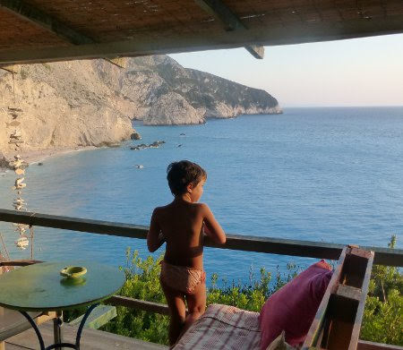
  
  

   
  
  

   
  
  

   
  
  
  
   e poi cena improvvisata nel parcheggio deserto a picco sul mare
  
  
  
   ritorno a Vassiliki e braciolata tutti insieme al campeggio! [
   
  
  
  
   <strong>
    31 agosto
   </strong>
   : relax a Vasiliki con gli amici greci che poi ripartono
  

   
  
  
  
   ciao ragazzi grazie per la compagnia!!!
  

   
  
  
  
   <strong>
    1 settembre
   </strong>
   : giornata in una caletta vicino micros gialos[
   
  
  

   
  
  
  
   e poi cena zingarata[
   
  
  
  
   <strong>
    2 settembre
   </strong>
   : stanotte grande diluvio! Andiamo verso Nidri dove finalmente esce un timido sole
  

   
  
  
  
   e poi tutti alle gole ...con fracicata da temporale inclusa nel biglietto!!
  

   
  
  

   
  
  

   
  
  
  
   <strong>
    3 settembre
   </strong>
   : anche oggi minaccia pioggia, quindi passeggiata con shopping nella cittadina di Lefkada
  

   
  
  
  
   dove troviamo un gioco divertentissimo!!!
  

   
  
  

   
  
  

   
  
  
  
   e poi spiaggione di Aghios Joannis[
   
  
  

   
  
  
  
   e ultima cena tutti insieme!
  
  
   <strong>
    4 settembre
   </strong>
   : soli soletti ci troviamo un posticino meraviglioso dove trascorrere il nostro ultimo giorno sull'isola, poco fuori la cittadina di Lefkada... tra mare e laguna
  

   
  
  

   
  
  
  
   ottimo pranzetto in riva al mare[
   
  
  
  
   passeggiata con polipo che ci insegue sulle rocce...
  

   
  
  
  
   e gelato in paese ...
  

   
  
  

   
  
  
  
   infine tramonto stupendo...
  

   
  
  

   
  
  
  
   arriveduar insalate greche e isole bellissime!!!
  

   
  
  

   
  
  
 

## Compleanni: 8 e 6
*08-09-2014*

 
  
   Appena tornati dalle vacanze si festeggia il compleanno di Matilde! A casa con le sue amichette!
  

   
  
  
   
  
  
  
   con una torta dal sapore greco, pomodoro e feta[
   
  
  
  
   e poi il compleanno di Marghe....prima con una colazione pre-scuola
  

   
  
  
   
  
  
   
  
  
  
   e poi pigiama party con Anna
  

   
  
  
  
   e pranzo al RistoSauro con gli amichetti!
  

   
  
  
  
   con piccolo inconveniente della gomma a terra di zia Betta!!
  

   
  
  
  
   .... e poi è arrivato un nuovo inquilino a casa nostra! Si chiama Spartaco ed è il secondo maschietto di casa!
  

   
  
  

   
  
  
 

## Ritorno a scuola
*12-09-2014*

 
  
   Ricomincia la scuola! Matilde in 3 elementare e Margherita inizia la prima elementare....che emozione!!!
  

   
  
  

   
  
  
 

## We dai nonni
*29-09-2014*

 
  
   Mentre papà è in Corea a tenere alto il nome della ricerca e dell'innovazione italiana noi ce ne andiamo in campagna....dove nonostante sia fine settembre la natura è rimasta ad una primavera inoltrata!
  

   
  
  

   
  
  

   
  
  

   
  
  

   
  
  
  
   e poi sono venuti i colleghi di nonna per un meeting aziendale :)
  
  
   ed era tutto bellissimo!
  

   
  
  

   
  
  

   
  
  
 

## Sabaudia a metà ottobre
*12-10-2014*

 
  
   Incredibile....continua il caldo e andiamo al mare a Sabaudia con i camper! Facciamo anche il bagno....e il giorno dopo ci raggiungono un pò di amici!
  

   
  
  

   
  
  

   
  
  

   
  
  

   
  
  
 

## Il nostro orto urbano
*19-10-2014*

 
  
   L'associazione
   <a href="http://www.terraonlus.it/">
    Terra!
   </a>
  
  
   ci ha assegnato un orto sociale!
  
  
   All'inizio era un pò incolto....
  

   
  
  
  
   ma lavorandoci sodo...
  

   
  
  
  
   e sotto il sole ancora cocente di ottobre
  

   
  
  
  
   siamo riusciti a dissodare il terreno e fare i primi solchi per piantare le nostre piantine
  

   
  
  

   
  
  
  
   E poi alla fine un pò di riposo! Brave!!!
  

   
  
  
 

## Zia Giorgia a Roma
*27-10-2014*

 
  
   Evviva zia e Morgan ci vengono a trovare a Roma dopo essersi fatti tanti Km a piedi per le montagne di mezza italia![
   
  
  
  
   Adesso un pò  di riposo....vero ciccio??[
   
  
  

   
  
  
  
   Andiamo in campagna a raccogliere le castagne
  

   
  
  

   
  
  

   
  
  
  
   e poi anche a pranzo da Eataly!
  

   
  
  

   
  
  
 

## Halloween
*01-11-2014*

 
  
   Merenda a tema a casa
  

   
  
  
  
   e poi in giro a fare 'dolcetto scherzetto'! [
   
  
  
 

## La piccola Anna
*01-12-2014*

 
  
   è nata! Tanti tanti auguri a mamma Daniela e papà Giuseppe!
  

   
  
  
  
   un affettuosissimo pensiero da parte di Matilde[
   
  
  
  
   e di Margherita
  

   
  
  
 

## Novembrate romane
*01-12-2014*

 
  
   Giornate ancora bellissime in cui fare tante cose divertenti....una passeggiata in bici sull'appia antica
  

   
  
  
  
   un pò di esercizio alla Caffa[
   
  
  
  
   una caccia al tesoro ai Fori Imperiali ...con andata
  

   
  
  
  
   e ritorno in metro[
   
  
  

   
  
  

   
  
  

   
  
  
  
   e il premio finale....un baule di caramelle ....[
   
  
  

   
  
  

   
  
  
  
   e una borraccia fantastica del comune di roma....che sete!!! [
   
  
  
  
   poi un bel pranzo sociale all'orto ... seguito da un pò di duro e sano lavoro
  
  
  
   incredibile ... anche Marghe e Cate zappano!
  
  
 

## Big Bambù al Mattatoio
*08-12-2014*

 
  
   Hanno costruito questa bellissima struttura di bambù al mattatoio...peccato non si possa più salire sopra!
  

   
  
  

   
  
  
  
   è altissimaaaaaa
  

   
  
  
  
   allora ci arrampichiamo sugli ex recinti degli animali! [
   
  
  

   
  
  
  
   smorfiosetta![
   
  
  
  
   e 'mastro mati' con panino broccoli e salsiccia al mercato di testaccio! [
   
  
  
 

## Albero e presepe
*09-12-2014*

 
  
   come da tradizione l'8 dicembre si fanno presepe e albero!
  

   
  
  
  
   le bimbe sono all'opera già la mattina presto! L'albero è stato molto gradito...soprattutto dalle micie che si divertono ad intrufolarsi tra i rami e far cadere le palline!!
  

   
  
  
  
   E poi tutti da Mara...doppia coppia vince sempre!!! Quanto siete belle!!!!
  

   
  
  
 

## Buon natale a tutti!
*24-12-2014*

&nbsp;
   
 

