# 2015

## Capodanno ad Amsterdam
*04-01-2015*

 
  
   Il nostro 7 scambio casa è con Amsterdam! Eccoci arrivati, nel quartiere Science Park. Cena in un localino vicino casa con un mega hamburger con le cipolle e lefamosissime patate fritte, grosse e con la buccia....fantastiche....abbiamo capito perchè è il piatto preferito degli olandesi!
  

   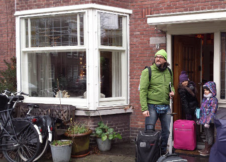
 
  
  
   
    28 dicembre:
   
   prendiamo il treno vicino casa e in 8 minuti siamo alla stazione centrale. Oggi passeggiamo alla scoperta delle stradine e dei canali ....occhio alle bici che sfrecciano incuranti dei passanti!!!
  
 
   
  
  
 
   
  
  
 
   
  
  
   
  
  
 
   
  
  
 
   
  
  
  
   La sera arrivano anche Paola, Massimo e Flavio.
  
  
   
    29 dicembre
   
   :passeggiata in centro con tappa al take away delle patatine fritte
  
 
   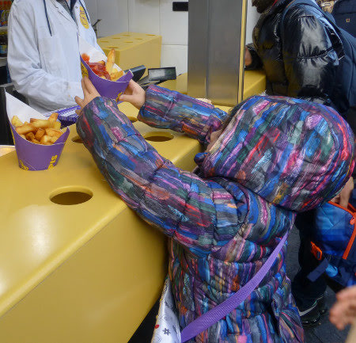
  
  
  
   e assaggi di formaggi
  
 
   
  
  
  
   poi il raccolto 'cortile delle beghine' da cui il nostro gruppetto ha preso il suo nuovo nome: 'gruppo beghini'
  
 
   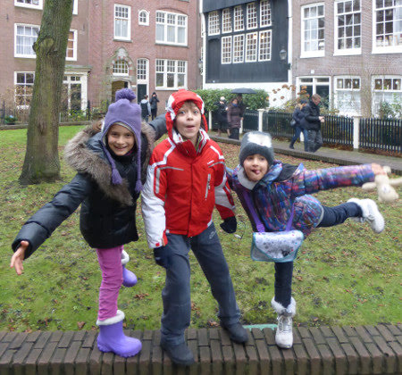
  
  
 
   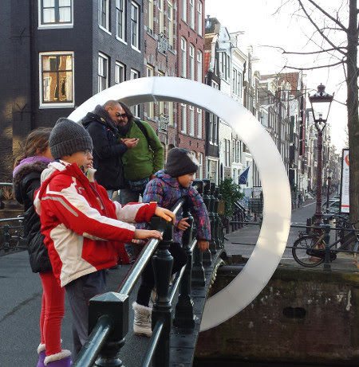
  
  
   
  
  
  
   Giro al mercato galleggiante dei fiori, dove compriamo tantissimi bulbi di tulipani
  
 
   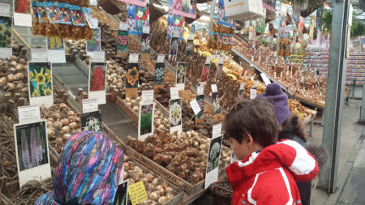
  
  
 
   
  
  
  
   e poi un tè caldo sulla terrazza del Nemo mentre i bimbi giocano con il ghiaccio!
  
 
   
  
  
  
   che bel panorama da qui su!
  
 
   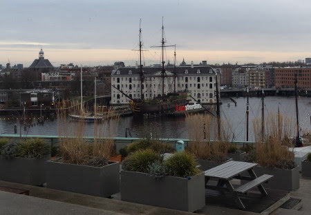
  
  
  
   e infine tutti a cena a casa con torta (viennetta)
  
  
   e candelina per festeggiare il compleanno di Massimo!!! Auguri auguri e un regalo speciale da parte dei bimbi....un bellissimo disegno del Nautilus!
  
 
   
  
  
  
   
    30 dicembre
   
   : tutti al museo NEMO

  
  
   
  
  
   
  
  
  
   a fare esperimenti e giochi di tutti i tipi 
   
  
  
 
   
  
  
 
   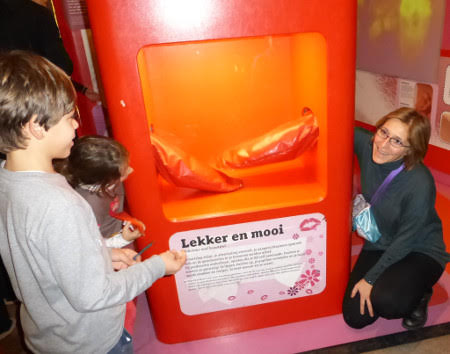
  
  
   
  
  
  
   usciamo che è già buio e prendiamo il battello che fa il giro dei canali tra le bellissime installazioni del Festival delle Luci
  
 
   
  
  
 
   
  
  
 
   
  
  
 
   
  
  
  
   e infine a cena nella pacchianissima pagoda cinese ....in onore di Massimo! (hihihihi)
  
 
   
  
  
  
   
    31 dicembre:
   
   ultimo giorno dell'anno! Ancora a spasso per la città, visitiamo il museo dell'houseboat e il jordaan
   
  
  
 
   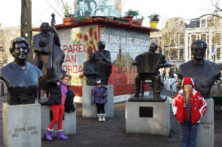
  
  
 
   
  
  
  
   pranzo ottimo ed abbondante nel tipico 'Haesje Claes' con buonissima birra
  
 
   
  
  
  
   e poi cena a casa e dopo tutti fuori a festeggiare ...riusciamo anche a rimediare un passaggio in macchina e ci scaricano nella piazza alle 23.57....giusto in tempo per stappare il nostro spumante, accendere le stelline e vedere lo spettacolo interminabile dei fuochi....
   
    BUON 2015!!!
   
  
 
   
  
  
 
   
  
  
 
   
  
  
  
   
    1 gennaio
   
   : oggi qui è tutto chiuso...così andiamo a visitare Zaanse Schans, la zona dei mulini a vento pochi km fuori città.
   
  
  
 
   
  
  
  
   con un fantastico negozio di zoccoli
   
  
  
 
   
  
  
   
  
  
  
   che freddo però....
   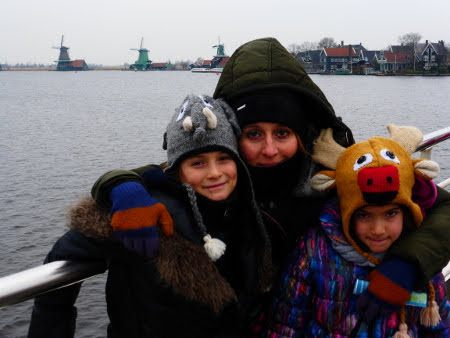
  
  
  
   ...e che beghine!!!!
  
 
   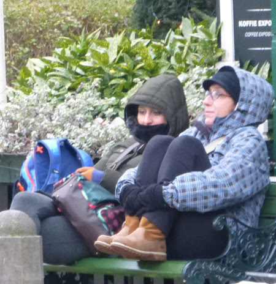
  
  
  
   
    2 gennaio
   
   : ancora in giro per la città ...nella bellissima zona dei musei, con una grande piazza dove arrampicarsi sulla scritta 'I am sterdam'
  
 
   
  
  
 
   
  
  
  
   rilassarsi come tonni nella rete
  
 
   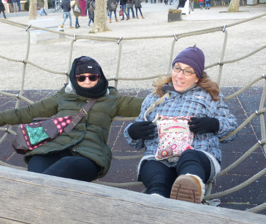
  
  
  
   e fare giochi spericolati sull'half pipe!!
  
  
   Poi al Vondelpark per un pranzetto veloce
  
 
   
  
  
 
   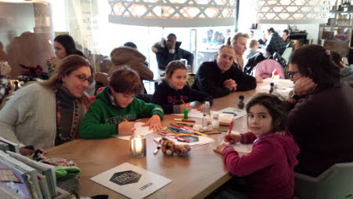
  
  
  
   e infine museo di Van Gogh
  
 
   
  
  
   
  
  
  
   
    3 gennaio
   
   : si riparte! SOB :(
   
  
  
 
   
  
  
 
   
  
  
  
   Ciao Amsterdam....il nostro cuore è rimasto qui ....
  
 
   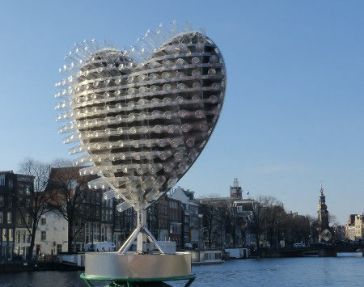
  
  
  
   e anche Teddy :(
   
  
  
 

## Brevetti di nuoto
*27-01-2015*

 
  
   Oggi brevetti di nuoto! 
Abbiamo un 'buon' cavalluccio marino
  
  
   e un buon pesce gatto che nuota ottimamente a rana!!
  
 

## Gennaio
*28-01-2015*

 
  
   Questo 2015 è iniziato con tante cose da fare e delle giornate sempre belle e calde! Siamo andate a pattinare al lago di Castello
   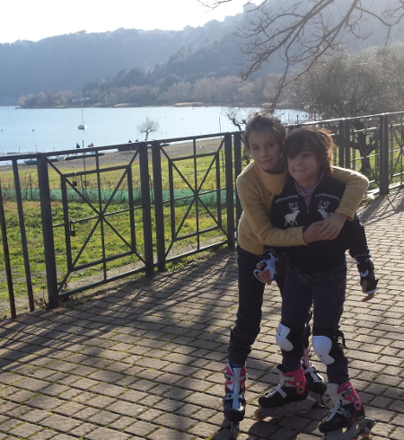
  
  
   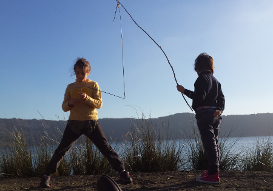
  
  
  
   siamo andate a conoscere Anna
  
 
   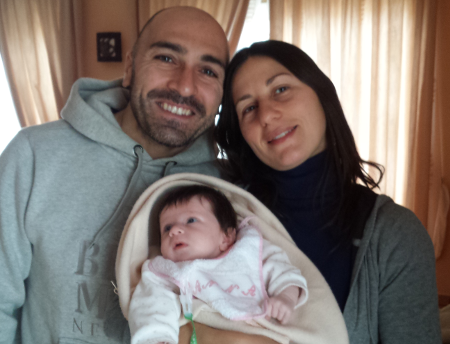
  
  
  
   e a salutare Julian....che tra poco inizierà anche a camminare!
  
 
   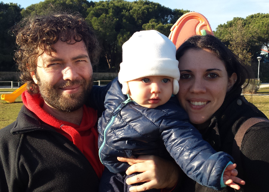
  
  
   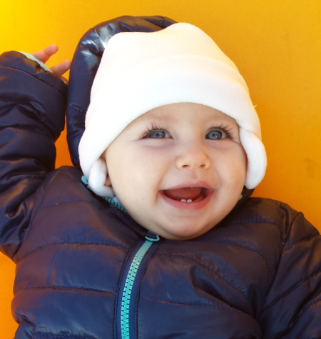
  
  
  
   Mati e mamma sono andate a vedere 'Romeo&amp;Giulietta', mentre mamma e Marghe sono andate a vedere 'Rapunzel'
  
 
   
  
  
  
   Poi abbiamo fatto tante ma tante coccole alle nostre miciotte
  
 
   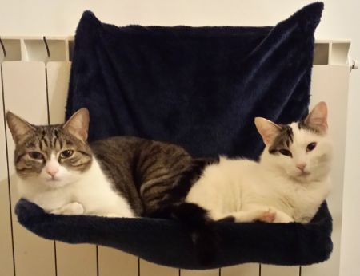
  
  
   
  
  
  
   e siamo anche uscite a cena fuori con Nospa, Fracassa e Nonna Papera!
  
 
   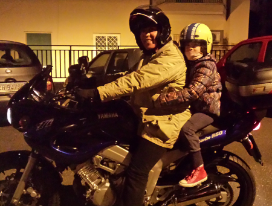
  
  
  
   Siamo andate a Norma e Nospa ci ha fatto provare le sellette del parapendio...che forza!
  
  
   E poi il nostro pensiero è sempre a nonna Franca che in questo mese è stata a Verona a rimettersi in sesto! Forza nonnina torna presto!
  
 

## E' arrivata la neve!!!
*09-02-2015*

 
  
   Ci voleva proprio una bella giornata sulla neve! E quanta ce n'era a Campocatino!
  
 
   
  
  
  
   Abbiamo ripreso confidenza con gli sci e ci siamo fatti una bella sciata in tutte le piste! Anche Margherita ha fatto il canalino!! Bravissima! Matilde e Flavio corrono veloci.... e chi gli sta dietro!!
   
   
  
  
 
   
  
  
 
   
  
  
 
   
  
  
 
   
  
  
  
   Canalino!
  
  
   E poi anche a Campo Staffi tra nebbia e sole....
  
 
   
  
  
 
   
  
  
  
   con un finale da brivido...
  
 

## Pesi e misure
*17-02-2015*

 
  
   All'inizio del 2015 ecco i nostri pesi e misure:
  
  
   margherita 26.3Kg, 124 cm e 31 piede
  
  
   matilde 30.3 Kg, 135 cm e 35 piede
  
 

## Febbraio . . .  freddo
*01-03-2015*

 
  
   Che si fa quando fa freddo? Si sta a casa a cucinare gli gnocchi con nonna nonna
  
 
   
  
  
  
   si fanno i pancake (brava Mati sono proprio belli!)
  
 
   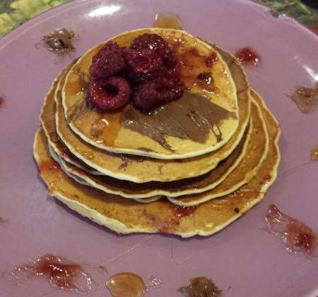
  
  
  
   si costruisce un robot con papà
  
 
   
  
  
  
   si va alle terme con mamma
  
 
   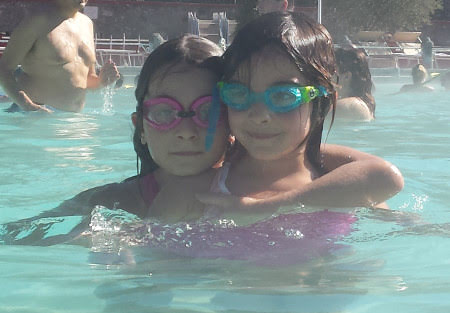
  
  
  
   si festeggia CARNEVALE!!!!!
  
 
   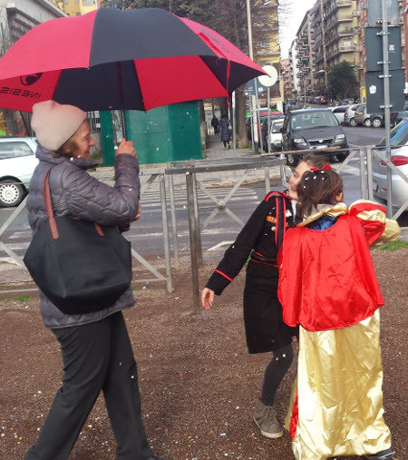
  
  
 
   
  
  
 
   
  
  
  
   .... si si anche noi grandi
  
 
   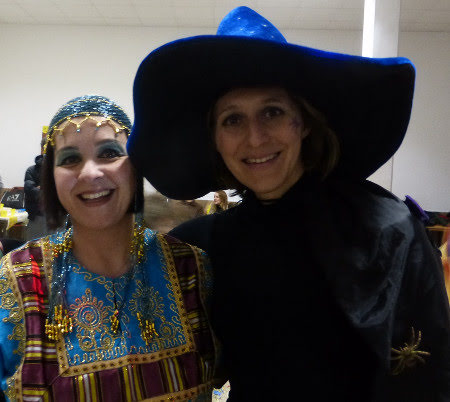
  
  
  
   e si avvisano i vicini che ci siamo stufati di avere sempre il marciapiede sporco di cacche di cani!!!
   
   
  
  
 

## I 70 anni di nonno Mario!
*02-03-2015*

 
  
   Auguri nonnone....e tutti a pranzo al mare a festeggiare!!!
  
 
   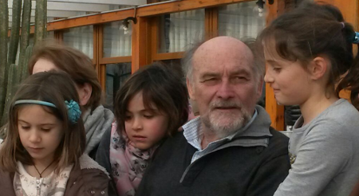
  
  
 
   
  
  
 
   
  
  
  
   Brava zia Betta! Che bellissima torta!
  
 

## Auguri piccolo Julian!!!
*06-03-2015*

 
  
   Un abbraccio grandissimo per il tuo primo compleanno!!!
   
  
  
 

## Pasqua da zia Giorgia
*07-04-2015*

 
  
   Evviva! Finalmente le vacanze di pasqua! Le bimbe vanno con i nonni da zia Giorgia! E noi le raggiungiamo! Da zia non si sta fermi ad oziare....ma si va dalla montagna al mare passando per la campagna!!!
  
  
   Giornata di sci a Monesi, dove zia e Morgan ci accompagnano con le ciaspole
  
 
   
  
  
 
   
  
  
 
   
  
  
  
   poi al mare....una giornata estiva!

  
  
  
   e senza farci mancare una bella potatura di ulivi...

  
  
  
   con passaggio sulla cariola

  
  
  
   e una passeggiata nel bosco
   
  
  
  
   Però veniamo ricompensati da un'ottima e abbondante colazione di pasqua!!!
   
  
  
 
   
  
  
 

## Volare oh oh
*26-04-2015*

 
  
   E' primavera, è tempo di riprendere Ronzinante dopo la lunga inattività invernale! Ci regaliamo due bellissimi we a Norma. Il primo con Mara, Lorenzo, Anita e Alessia ....
  
 
   
  
  
 
   
  
  
 
   
  
  
 
   
  
  
  
   Leggiadrissimo Andrea!!!
   
  
  
  
   e il secondo con Aris e Ray che vengono a provare il volo in biposto!
  
 
   
  
  
   
  
  
 
   
  
  
  
   e poi come da tradizione birra a patatine post volo!
  
 
   
  
  
  
   E anche noi riusciamo a fare due bellissimi voli....sotto l'attenta supervisione di Matilde ... prima il test della selletta
  
 
   
  
  
  
   poi il check allacciature cosciali-pettorale-casco

  
  
  
   e infine per radio segue tutto il mio volo incitandomi con 'bravissima mamma, sei altissima....'

  
  
   
  
  
  
   per finire con l'atterraggio e la chiusura delle vele!
  
 
   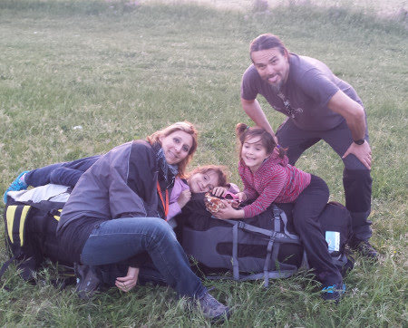
  
  
 
   
  
  
  
   ... e un fantastico tramonto!!

  
  
 

## Compleanni primaverili
*01-05-2015*

 
  
   
    Auguri
   
   a Caterina che ha festeggiato 'al campo'
  
 
   
  
  
 
   
  
  
 
   
  
  
  
   a Sara che ha portato tutta la classe al soft air
  
 
   
  
  
 
   
  
  
  
   ad Alessia con le sue smorfiosissime amiche!!!!!

  
  
  
   e a papone!!!
  
 
   
  
  
 

## WE del 1 maggio
*04-05-2015*

 
  
   
    1 Maggio:
   
   è una bellissima giornata e ci godiamo il sole e il mare di una Sabaudia ancora deserta!
  
 
   
  
  
 
   
  
  
  
   Ci raggiungono un pò di amici .... fave e pecorino come da tradizione e pane pomodoro e  mozzarella di bufala locale ... sulla duna!
  
  
   La sera ci accampiamo in modalità 'castra aestiva', tipico accampamento romano a pianta quadrata (una pernacchia a chi dice che conosco solo 150 vocaboli)
  
  
   , con fine ultimo 'braciolata' !
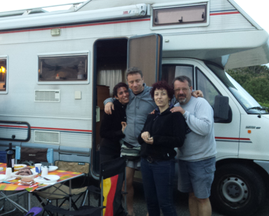
  
  
  
   Putroppo è stata l'ultima notte del mitico e glorioso mr BBQ (portato via dal monnezzaro la mattina presto)
  
  
   ! Lo ricorderemo così .... ardente, stortignaccolo e senza gambe!!!
  
 
   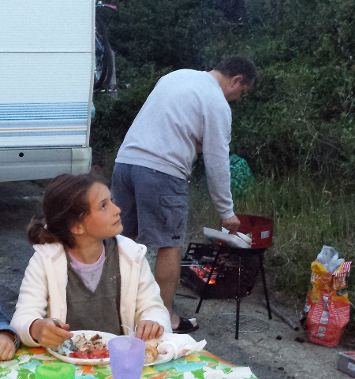
  
  
  
   
    2 maggio
   
   : tiriamo giù tutte le bici dai camper e si va al parco del circeo. Bella passeggiata a due ruote fino al lago di Paola
  
 
   
  
  
 
   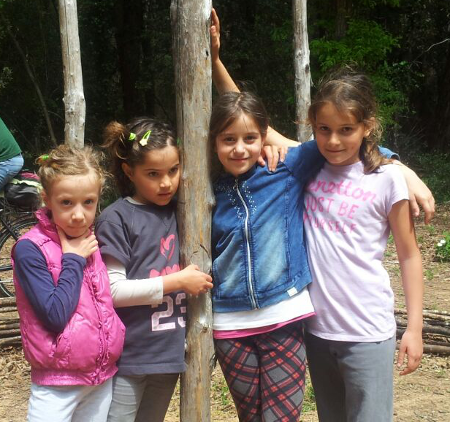
  
  
   
  
  
 
   
  
  
  
   Poi tutti a Norma, passeggiata nell'antica Norba
  
 
   
  
  
  
   e un bel volo con tanto di top per noi!!!
  
 
   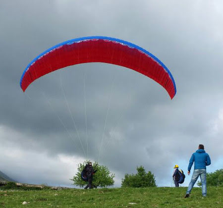
  
  
  
   E anche qui, nel verde parcheggio di Norma, un pò di lavoro per affilare le lance
  
 
   
  
  
  
   e poi pizza 'sugnosa' per tutti!
  
 
   
  
  
  
   le più freddolose in camper!

  
  
  
   
    3 maggio
   
   : passeggiata a Sermoneta
  
 
   
  
  
 
   
  
  
 
   
  
  
 
   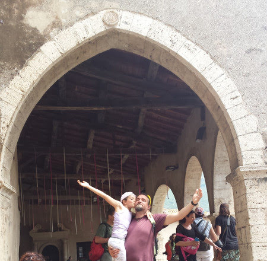
  
  
  
   con tonno e pomodoro amorosamente preparato da Manu!!
  
 
   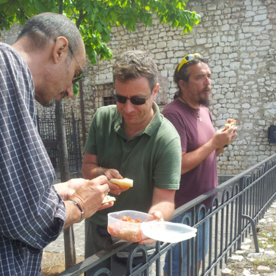
  
  
  
   Ciao a tutti dalle camperiste !!
  
 
   
  
  
 

## Traviata
*13-05-2015*

 
  
   Anche quest'anno la classe di Mati partecipa al progetto di musica lirica. Tutti al teatro Argentina a cantare la Traviata!
  
 
   
  
  
  
   Le bimbe sono tutte zingarelle  (grazie zia Betta per il bellissimo vestito!)
  
 
   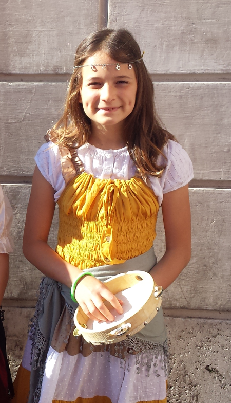
  
  
 
   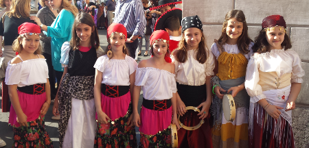
  
  
  
   e i maschietti tutti toreri!!!
   
  
  
  
   Lo spettacolo, come al solito, è colorato, ricco ed emozionante!

  
  
  
   E dopo tutti in giro per roma ...con varie tappe enogastronomiche a campo dei fiori per la pizza con la mortadella, al ghetto per la torta ricotta e visciole e infine al lungotevere per una fresca grattachecca!!
  
 
   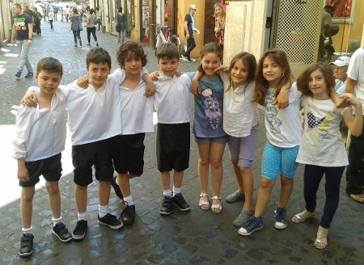
  
  
 
   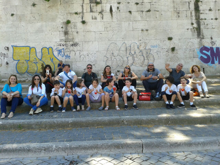
  
  
 
   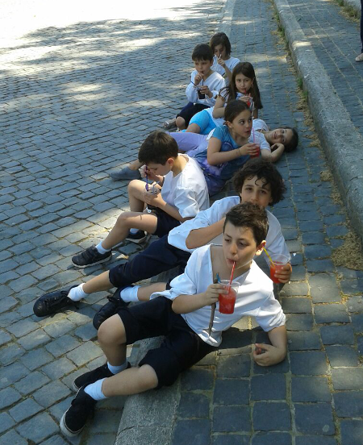
  
  
  
   Non contenti partita di pallavolo in caffarella al tramonto!!!
  
 
   
  
  
 

## Parco avventura a Tarquinia e mare alla 'frasca'
*17-05-2015*

 
  
   La carovana parte per un we vicino Civitavecchia.
  
  
   Parco avventura a tarquinia, dove ci divertiamo tantissimo, soprattutto a fare tutte le carrucoleeeeee.
  
 
   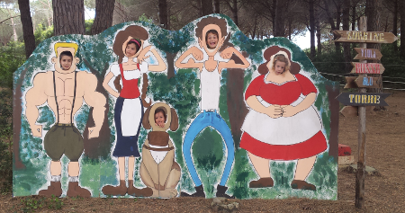
  
  
  
   In serata raggiungiamo la famosa (per chi va a pesca)
  
  
   'fratta'. Posto speciale con mare, stradina sterrata e pratone con pineta alle spalle.
  
 
   
  
  
 
   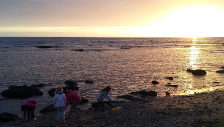
  
  
  
   Il tramonto è stupendo!

  
  
  
   Mettiamo subito alla prova il 'nuovo' bbq, (gemello del mitico Mr BBQ defunto a inizio mese sulle dune di sabaudia e gradito e assolutamente disinteressato regalo di G&amp;M)
  
  
   .
  
  
   La notte si illumina di lucciole e dormiamo nel silenzio più totale in riva al mare.
  
  
   Il giorno dopo gli intrepidi bimbi fanno anche un pò di bagni!
  
 
   
  
  
 

## Nascondigli gattosi
*19-05-2015*

 
  
   Pimpa ama nascondersi ovunque!!!!
  
 
   
  
  
 
   
  
  
 
   
  
  
 
   
  
  
 

## Ennesima cucciolata in campagna
*19-05-2015*

 
  
   La 'micia' ha fatto l'ennesima cucciolata in campagna dai nonni.
  
 
   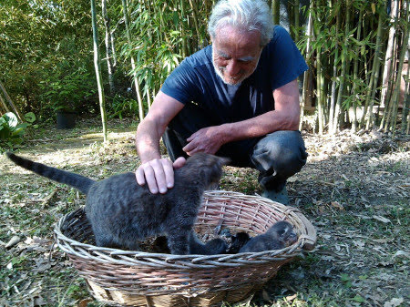
  
  
  
   e questi due sono Scrat e Kiwi!

  
  
 

## La mononucleosi
*23-05-2015*

 
  
   Dopo un anno in cui hanno resistito a qualunque malanno, chiudiamo con la mononucleosi! Povera meggy! :(
  
 
   
  
  
 
 

## Ponte del 2 giugno
*03-06-2015*

 
  
   Un anticipo di vacanza con questo lungo ponte! Andiamo in campagna dai nonni.
  
  
   Passiamo una bella giornata di relax alle terme, e ci raggiunge anche Flavio.
  
 
   
  
  
 
   
  
  
  
   E poi andiamo a visitare il bellissimo Giardino dei Tarocchi insieme alle nostre amichette Alessia e Anita.
  
 
   
  
  
 
   
  
  
 
   
  
  
 
   
  
  
 
   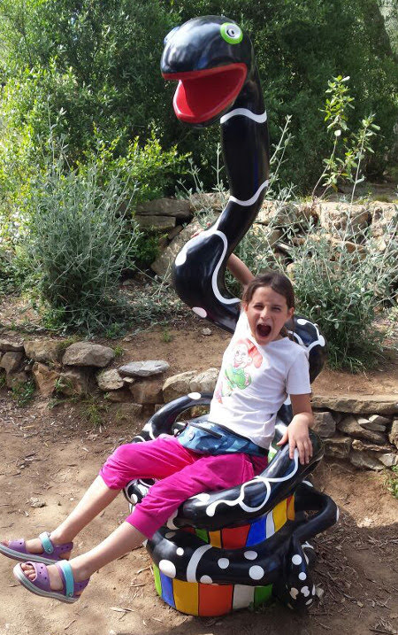
  
  
 
   
  
  
  
   Torniamo a casa con una nuova inquilina.... Athena! Che ne dici Spartaco ... è simpatica??
  
 
   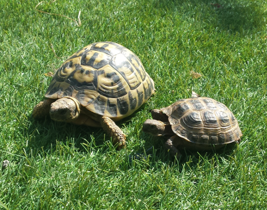
  
  
 

## Fine della scuola! 1B e 3A
*06-06-2015*

 
 
   
  
  
 
   
  
  
 

## Giugno da zia Giorgia!
*29-06-2015*

 
  
   E' finita la scuola!! L'8 giugno partono con i nonni alla volta della liguria. 
   
   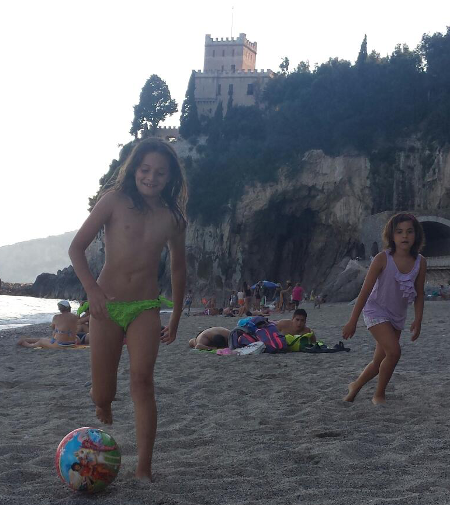
  
  
  
   Sono una bella combriccola di bambini in paese! Sergio e Vieri,Viola, Beniamino...e il divertimento non manca!
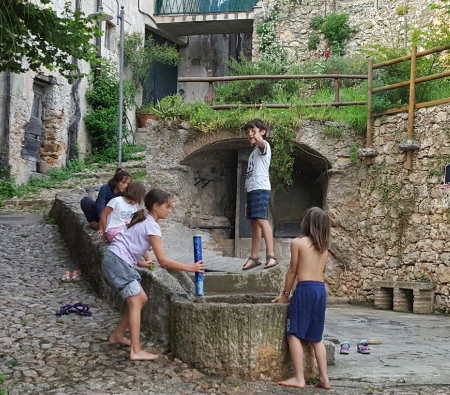
  
  
 
   
  
  
   
  
  
  
   E anche zia le porta a cavallo, ad arrimpicare, in giro per boschi!
   
  
  
 
   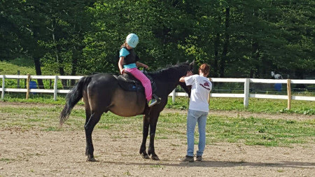
  
  
   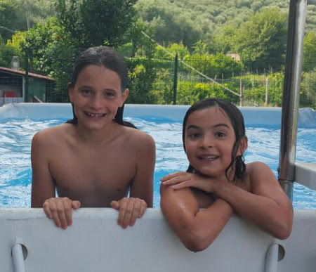
  
  
   
  
  
 
   
  
  
  
   M&amp;P nel frattempo si dedicano a qualche passione .... e affogano il dispiacere nel vino!!!
  
 
   
  
  
 
   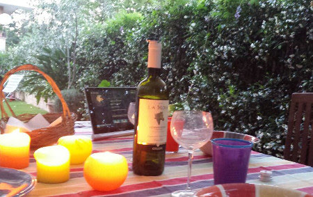
  
  
 
   
  
  
 
   
  
  
  
   Dai che ci rivediamo presto!!!
  
 
   
  
  
 

## La fratta bis
*05-07-2015*

 
  
   Torniamo a campeggiare alla fratta!

  
  
 
   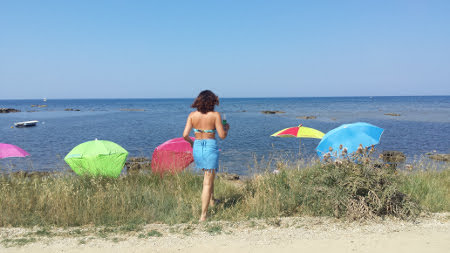
  
  
 
   
  
  
 

## Auguri nonna Lilli!
*17-07-2015*

 
  
   Alla soglia dell'intervento (povera nonna anche lei con l'ernia)
  
  
   andiamo a festeggiare il compleanno!
  
 
   
  
  
 
   
  
  
 

## Eleganti
*19-07-2015*

 
  
   ogni tanto ci tocca!!!
  
 
   
  
  
 
   
  
  
 

## Auguri Paolett
*19-07-2015*

 
  
   Nella calura di luglio..... anche la nostra Paoletta fa gli anni! Augurissimi....un pò bagnati!!
  
 
   
  
  
 
   
  
  
 

## Un pò di sicilia da noi
*29-07-2015*

 
  
   Finalmente arrivano Annagloria, Matteo ed Edoardo!!!
  
  
   Li portiamo subito a Zoomarine, dove trascorriamo una divertentissima giornata tra giochi spericolati e tuffi in piscina!
  
 
   
  
  
 
   
  
  
  
   poi tutti al circeo a fare un pò di mare
  
 
   
  
  
 
   
  
  
  
   e infine passeggiate romane
  
 
   
  
  
 
   
  
  
 
   
  
  
 
   
  
  
 
   
  
  
  
   Hei ragazzi siamo stati benissimo con voi! Tornate presto a trovarci!
  
 

## Sardegnando
*04-09-2015*

 
  
   
    12 agosto
   
   : Finalmente si parte! E guarda un pò chi c'è sul traghetto per Olbia?
  
 
   
  
  
  
   Tantissimi gabbiani ci accolgono all'arrivo!
  
 
   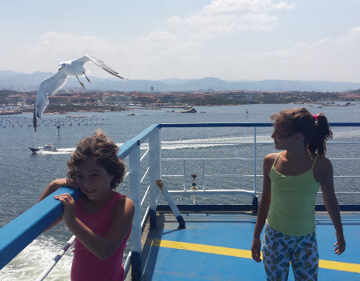
  
  
  
   Appena sbarcati andiamo subito a Posada a fare un tuffo al mare! Acqua bellissima e calda! La sera cena con il gruppo beghini e i sardegnoli acquisiti!
  
 
   
  
  
  
   
    13 agosto
   
   : Giornata di mare bellissima a Berchida. L'acqua è talmente calda e trasparente che non usciresti mai! E al tramonto partitone!
  
 
   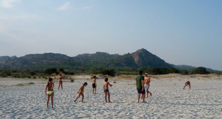
  
  
  
   La sera ci spostiamo e raggiungiamo il gruppo vacanze 'Sardegnando 2015' in un'area di sosta in cima al Supramonte....che freddo qui!
  
  
   
    14 agosto
   
   : sveglia presto e partenza a piedi per le Gole di Su Gorroppu.
  
 
   
  
  
  
   La passeggiata è lunga, impegnativa e sotto il sole.... ma i bimbi sono bravissimi!
  
 
   
  
  
  
   Alla fine arriviamo alla gola, che paesaggio!
  
 
   
  
  
  
   Mati viene anche punta in bocca da un'ape...per fortuna troviamo un antistaminico per bloccare la reazione!
  
 
   
  
  
  
   Ci inoltriamo nella gola tra sassoni sempre più enormi e pareti sempre più strette! E' bellissimo!
  
 
   
  
  
  
   Il rientro è una lunghissima passeggiata lungo il letto del fiume con l'ultimo pezzo di salita con le jeep. La sera siamo tutti esausti!
  
  
   
    15 agosto
   
   : ferragosto lontani dal mare ... ci rifugiamo sull'altopiano del Golgo...tra asinelli e maialini selvatici.

  
  
  
   C'è la piccola chiesina campestre di San Pietro del Golgo che diventa il nostro rifugio dall'improvvisa pioggia.
  
 
   
  
  
 
   
  
  
 
   
  
  
  
   Poi un pò di compiti durante il temporale e la visita alla voragine Su Sterru (Matilde: "mamma perchè in questo buco profondissimo ci buttavano solo quelle della vergine?")
  
  
   .
  
  
   Infine cena in un ristorante tipico a base di pecora e porceddu! Che magnata!!
  
  
   
    16 agosto
   
   : oggi scendiamo dai monti, superiamo Arbatax e ci fermiamo nella bellissima spiaggia di Cea, rocce rosse.
  
 
   
  
  
 
   
  
  
 
   
  
  
  
   Gonfiamo le canoe e facciamo un giro esplorativo intorno ai piccoli faraglioni rossi con tanti tuffi e immersioni con la maschera. La sera ci spostiamo a Su Sirboni in un'area sosta sul mare.
  
  
   
    17 agosto
   
   :  spiaggi di sassi rosa e neri di
   
    Su Sirboni
   
   .
  
 
   
  
  
 
   
  
  
  
   Poi ci spostiamo a
   
    Coccoroci
   
   dove arriviamo al tramonto e Andrea ci prepara un fantastico minestrone (per cui si è pure ustionato un piede!)
  
  
   . Ceniamo seduti sulle coperte su una scomoda spiaggia di sassoni....ma a lume di candela e sotto uno stupendo cielo stellato! Faceva pure freschino!!
  
  
   
    18 agosto:
   
   percorriamo con i tre camper una strada sterrata un pò avventurosa fino ad un parcheggio sperduto. Poi a piedi arriviamo a
   
    Is Piscinas
   
   , delle cascate naturali e pozze di acqua fredda.
   
   
  
 
   
  
  
 
   
  
  
 
   
  
  
 
   
  
  
  
   Le bimbe si divertoni con tuffi e scivoli. Poi si riparte. Attraversiamo per circa 4 ore l'interno della sardegna, attraversando le  foreste del Gennargentu e paesini sperduti. Arriviamo infine a
   
    Barumini
   
   , dove per fortuna troviamo l'ultima visita guidata della giornata, al tramonto, al nuraghe Su Nuraxi.
  
 
   
  
  
  
   La sera accampamento nel parcheggio deserto e BBQ. Infine dolcetti sardi appena fatti, presi al ristorante vicino, annaffiati da un buon mirto!
  
  
   
    19 agosto:
   
   mattina sveglia presto e prendiamo il traghetto per l'isola di Carloforte. Passeggiata nel paesino e spesa al mercato. Ci compriamo anche un piccolo alberello di mirto che ci accompagnerà per tutto il viaggio! Poi relax sulla scogliera nera.
  
 
   
  
  
  
   Le bimbe si scatenano alla ricerca di conchiglie e paguri per la cena! Al tramonto ci spostiamo allo stagno di Sant'Antioco a vedere i fenicotteri rosa e infine accampamento provvisorio con cenone a base di fregola sarda al sughetto di conchiglie! Brave bimbe!
   
   
  
 
   
  
  
  
   
    20 agosto:
   
   sveglia presto e percorriamo una strada stupenda a strapiombo sul mare. Scorci di archeologia industriale, le vecchie città minerarie ormai abbandonate e le fabbriche in disuso. Di passaggio vediamo anche il famoso Pan di zucchero, un collinone tondo sul mare e infine arriviamo a
   
    Buggerru
   
   . Corriamo trafelati per non perdere la visita alla Galleria di Henry. Indossati i caschetti e armati di torce saliamo su un vecchio trenino, ormai elettrico, che attraversa lo strettissimo e buio tunnel che porta fino ad un punto panoramico mozzafiato!
   
  
  
 
   
  
  
 
   
  
  
   
  
  
  
   Il ritorno si fa a piedi, un pò dentro il tunnel e un pò lungo lo stretto passaggio lungo la parete esterna della galleria! Molto suggestivo! Nel pomeriggio ci spostiamo a
   
    Portixeddu
   
   , uno spiaggione di sabbia bianca con dei cavalloni divertentissimi! Passeggiando un pò sulla riva troviamo anche un fiume che sbocca a mare e le bimbe si divertono a costruire le capanne.
   
  
  
 
   
  
  
  
   La sera preparo la cena in camper e ce la mangiamo in spiaggia al tramonto....romanticoni!
  
 
   
  
  
  
   
    21 agosto: Scivu
   
   la spiaggia più bella del nostro viaggio (per me)
  
  
   ! Spiaggione di sabbia con alle spalle una falesia di 15 metri di rocce rosse.
  
 
   
  
  
  
   La giornata trascorre al sole tra giochi e passeggiate lungo la riva, fino alla fine della scogliera, dove ci sono tante calette.
  
  
   La sera, da gran signori, ordianiamo patate fritte, gamberoni e spigole sotto sale alla brace al ristorante vicino e ce le mangiamo nel nostro fantastico accampamento al tramonto! Che vuoi di più dalla vita? :)
  
 
   
  
  
  
   
    22 agosto:
   
   a pochi Km da Scivu un'altra bellissima spiaggia che raggiungiamo in bici
   
    , Piscinas.
   
   Enormi dune di sabbia con una verdissima vegetazione. Qualche matto si avventura nonostante la sabbia bollente!
  
 
   
  
  
   
  
  
  
   La giornata passa tra tuffi e partite a racchettoni.
  
 
   
  
  
 
   
  
  
  
   La sera andiamo a dormire a Porto Palma. Ci accoglie un bel tramonto (con l'ultimo bagliore verde!)
  
 
   
  
  
  
   
    23 agosto:
   
   Porto Palma. Giorgio va a pesca e noi lentamente rotoliamo dai camper sulla spiaggia. Posto domenicale per famiglie locali. Gonfiamo le canoe e andiamo ad esplorare la costa rocciosa. Appena girato il promontorio ci appare la vera "costa verde", vegetazione sulle falesie rocciose che arriva fino al mare! Troviamo anche uno scoglio per i tuffi!
  
 
   
  
  
 
   
  
  
  
   La sera ci spostiamo, attraversando Oristano fino ad arrivare ad un agri camping nella spiaggia famosissima di Is Arutas.
  
  
   
    24 agosto: Is Arutas,
   
   spiaggia bianca famosa per essere fatta di minuscoli sassolini bianchi, tipo chicchi di riso. Peccato che il giorno prima c'era stata una forte mareggiata :(
  
  
   La famosissima spiaggia ci appare piena di alghe e il mare è talmente mosso che è impossibile fare il bagno.
  
 
   
  
  
 
   
  
  
  
   
    25 agosto:
   
   ci spostiano nella penisola del Sinis attraversando paesaggi bellissimi di macchia mediterranea, vegetazione bassa verde e rossa.
  
 
   
  
  
  
   ci fermiamo a
   
    S.Giovanni in Sinis
   
   e dopo aver visitato la sua bellissima chiesetta montiamo in sella ed entriamo nell'area archeologica di
   
    Tharros
   
   .Un posto mistico che lascia senza parole. La salita è impegnativa ma la meta è suggestiva....la torre, e infine il faro di Capo S. Marco dove hanno girato il film "Una piccola impresa meridionale"!
  
  
   
   
  
  
 
   
  
  
  
   **Lo spettacolo è mozzafiato, una stretta lingua di terra tra i due mari morto e vivo. Lasciamo le bici, passeggiamo lungo la scogliera e sgranocchiamo pane carasau, guttiau e formaggio (5Kg in 20 giorni!)
  
  
   .
  
  

   
  
  
  

   
  
  

   
  
  
 
   
  
  
  
   La spericolata discesa in bici ha un fantastico premio.... il bagno in un'acqua cristallina nella parte di mare "morto"!
  
  
   
   
  
  
  
  E infine la visita agli scavi! Che posto! Questi antichi avevano capito tutto!
  
  
   
   
  
  
  
   
    Riprendiamo i camper e ci spostiamo per goderci il tramonto in un posto magico, le bianche scogliere di
   
   Santa Caterina di Pittinuri.**
  
  
   
   
  
  
 
   
  
  
 
   
  
  
  
   
    Cena di pesce all'anonimo ristorante Asterix che ci sorprende con un'ottima fregola, pasta  arselle e bottarga, e attinie fritte!! Dormiamo sulla scogliera.
   
   **
  
  
   
    26 agosto:
   
   Troviamo una bella spiaggia a
   
    Sa Mesa Longa
   
   ben protetta dal vento che soffia un pò forte in questi giorni. La spiaggia è fatta da sabbia mista a micro conchiglie colorate e c'è una barriera di scogli ad una cinquantina di metri dalla riva che è collegata ad un isolotto.
  
 
   
  
  
 
   
  
  
  
   Marghe mette il boccaglio per la prima volta e facciamo tutti una bella nuotata! Vediamo anche le sogliole sul fondale.
  
  
   La sera ci spostiamo per una passeggiata-struscio a
   
    Bosa
   
   , bel paesino sul fiume con il castello in cima e tutte le casette colorate. Ceniamo con un bisteccone di bue "rosso".
  
 
   
  
  
  
   
    27 agosto
   
   : ultimo bagno di prima mattina e poi tutti a fare colazione al bar a Bosa Marina davanti alla stazione del famoso "trenino verde"  che attraversa le montagne sarde! E poi ognuno per la sua strada. Noi ritorniamo sulla costa est e ci fermiamo a Cala Gonone, sulla strada costiera che si interrompe a cala Fuili. Gonfiamo la canoa ed esploriamo un pò le calette e le grotte lungo la scogliera. cena e poi a mangiare un gelato in paese. Ci informiamo per un giro in gommone con un capitano/pirata con i capelli lunghi e l'orecchino.
  
  
   
    28 agosto: Golfo di Orosei.
   
   Sveglia presto, colazione abbondante e tutti sul gommone del capitano Paolo, che si rivela essere proprio la scelta giusta! Simpatico, attento ai dettagli, amante della sua bellissima terra. Passiamo radenti alla falesia esplorando grotte e insenature, vediamo tante specie di uccelli e l'acqua è stupenda. Il giro è un continuo tuffo e risalita sul gommone. Facciamo tante piccole immersioni con le maschere: i fondali sono stupendi, sabbia bianca e massi enormi.
  
 
   
  
  
 
   
  
  
  
   Facciamo una tappa a cala Sisine, con il laghetto alle spalle
  
 
   
  
  
 
   
  
  
  
   poi per pranzo il nostro capitano ci lascia nella bellissima spiagge delle sorgenti, dove immergendosi si vedono le correnti di acqua fredda e dolce che sgorgano dalle montagne. Poi passiamo dalle 'piscine di venere' ...un punto con un'acqua così trasparente da sembrare inesistente! Ci fermiamo a visitare la grotta del Fico, che per decenni nessuno ha mai notato perchè aveva l'entrata nascosta da un enorme fico che è franato in parte con le recenti alluvioni. Qui partorivano le foche monache.
  
 
   
  
  
 
   
  
  
  
   Ritorniamo sul gommone e Paolo mette la quarta e corre veloce tra le onde....il gommone impennato e le bimbe impazzite di gioia! Arriviamo a cala Goloritze, col suo enorme scoglio a punta alto 140m e l'arco naturale. Anche qui facciamo un tuffo.

  
  
  
   Il gommone viaggia veloce e ci porta ad esplorare i fiordi, e il porto di pietra. Qui facciamo una splendida immersione per vedere un relitto, praticamente integro, a pochi metri di profondità. Finora abbiamo percorso 40Km di costa. Il viaggio di ritorno è più veloce ma con una serie di tappe divertenti, l'abbordaggio di una nave per prendere un vassoio di fichi, il passaggio dal gommone del 'pallido' per assaggiare la sua grappa e infine l'ultimo tuffo mentre Paolo getta in acqua pezzi di pane che attirano migliaia di pesci.
  
  
   Infine rientriamo al porto di cala Gonone.....una giornata intensa, stupenda, indimenticabile!
  
 
   
  
  
  
   
    29 agosto
   
   : oggi torniamo in montagna e facciamo una passeggiata ad
   
    Orgosolo
   
   , paesino famoso per i suoi murales, praticamente un libro di storia a cielo aperto.
  
 
   
  
  
 
   
  
  
 
   
  
  
  
   Riesco anche ad andare dal parrucchiere, dove assisto ad una litigata in sardo tra due donne, per una storia di corna (credo!)
  
  
   .
  
  
   Per pranzo ci spostiamo sull'altipiano di
   
    Montes
   
   . Siamo in buona compagnia.
  
 
   
  
  
 
   
  
  
  
   Raccogliamo un pò di more lungo la strada e ci fermiamo a
   
    Mamoiada
   
   a visitare il museo delle Maschere Mediterranee. Il curatore del museo è una persona speciale che ci affascina con i sui racconti sulla storia e filosofia delle maschere.
  
 
   
  
  
  
   Poi assistiamo al torneo di morra (murra sarda)
  
  
   ! Che spettacolo! E' un gioco di velocità impressionante! Ceniamo in un bel ristorante in paese con piatti tipici dell'entroterra.
  
  
   
    30 agosto
   
   : ritorniamo sul mare per un bel bagno nella bellissima spiaggia di
   
    Berchida
   
   . La notte nel parcheggione deserto c'è una luna piena stupenda!
  
  
   
    31 agosto
   
   : ancora mare in una bella spiaggia a ridosso della pineta a S'Ena e Sa Chitta La sera raggiungiamo i 'sardi' a Posada e ceniamo con loro. Andiamo a dormire nella pineta di Orvile.
  
  
   
    1 settembre:
   
   la mattina ultimo bagno ad
   
    Orvile
   
   tutti insieme e poi dritti ad Olbia a prendere il traghetto!
   
  
  
  
   Ciao Sardegna...è stata proprio una bellissima vacanza!!!!
   
  
  
 

## E siamo a 9! Auguri Mati
*08-09-2015*

 
  
   Buon compleanno bimba selvaggia!
  
 
   
  
  
 
   
  
  
 
   
  
  
 

## Terme di Stigliano
*13-09-2015*

 
  
   Oggi, piuttosto increduli, festeggiamo in queste belle terme il compleanno di BruBru ...secondo me non ci crede nemmeno lui che sono 50!!!
  
 
   
  
  
  
   Ma prendiamola a ridere!!!

  
  
 
   
  
  
 

## NON ci possiamo credere!!!!!!!
*16-09-2015*

 
  
   La nostra Athena ha fatto tre piccole cuccioline! Che meraviglia!!!
  
 
   
  
  
  
   Sono minuscole (quello è il dito di mati)
  
 
   
  
  
 

## Meggina compie 7 anni!
*24-09-2015*

 
 
   
  
  
 
   
  
  
 

## Expo2015 - Milano
*13-10-2015*

 
  
   Partiamo in camper con zia Betta e Cate. Prima tappa Bergamo dove troviamo un festival enogastronomico multietnico!
  
 
   
  
  
   
  
  
  
   Prendiamo la funicolare e saliamo nella città alta

  
  
 
   
  
  
   
  
  
  
   Che tipi tosti che ci sono qui! :)
  
 
   
  
  
  
   La sera andiamo a dormire in un rimessaggio sui navigli a milano e la mattina dopo passeggiata per il centro.
  
 
   
  
  
   
  
  
   
  
  
 
   
  
  
 
   
  
  
  
   A pranzo andiamo al Mercato metropolitano
  
 
   
  
  
 
   
  
  
 
   
  
  
 
   
  
  
  
   Che bel posto! Poi passeggiata alla darsena. Compriamo i biglietti per Expo e facciamo l'entrata serale. Vediamo l'inavvicinabile padiglione del Giappone (da fuori), la coloratissima Turchia
  
 
   
  
  
   
  
  
  
   l'alveare dell'inghilterra
  
 
   
  
  
  
   con l'apetta Meggy
  
 
   
  
  
  
   le culture verticali di Israele
  
 
   
  
  
  
   e l'albero della vita
   
  
  
  
   Dormiamo nel parcheggio e la mattina dopo entriamo nuovamente ad Expo.
  
  
   Vediamo la forestra dell'Austria
  
 
   
  
  
  
   la Francia con i suoi animali
  
 
   
  
  
 
   
  
  
   
  
  
  
   e passeggiamo per la 'città'
  
 
   
  
  
 
   
  
  
 
   
  
  
   
  
  
  
   La gente è veramente troppa e non si riesce ad entrare nei padiglioni se non facendo file di ore....peccato! Li vediamo da fuori!
  
 
   
  
  
 
   
  
  
 
   
  
  
 
   
  
  
 

## Maker Faire 2015
*18-10-2015*

 
  
   Quest'anno la fiera degli inventori è nella città universitaria
  
 
   
  
  
  
   Andiamo a fare compagnia a papà nel suo stend e facciamo tanti laboratori divertenti

  
  
 
   
  
  
 

## Halloween Party
*01-11-2015*

 
  
   Quest'anno si fa un mega pigiama party a casa nostra! Mati prepara la zucca e le decorazioni
  
 
   
  
  
  
   e i dolci non mancano! Grazie mamme!
  
 
   
  
  
  
   Si procede con il trucco e il parrucco
  
 
   
  
  
 
   
  
  
 
   
  
  
  
   e dopo tutte in giro per il palazzo a fare "dolcetto o scherzetto?"

  
  
 
   
  
  
  
   Si cena tutte insieme
   
  
  
  
   poi si gioca a "rischia il gusto" e si chiacchera fino a notte fonda....
  
 
   
  
  
  
   Qualcuna avrà dormito? Ma che importa....
  
 
   
  
  
  
   Buon Halloween a tutti!
  
 

## Raccolta olive e kiwi
*09-11-2015*

 
  
   Dopo la disastrosa annata 2014 quest'anno le olive sono bellissime e tante! facciamo tre we dai nonni a raccoglierle...con giornate praticamente estive!
  
 
   
  
  
  
   Come al solito c'è chi sgobba
  
 
   
  
  
  
   e chi no :)
  
 
   
  
  
  
   ma alla fine un bel pranzetto per tutti!
  
 
   
  
  
  
   con qualche scherzetto
  
 
   
  
  
   
  
  
   
  
  
  
   Kiwi, Scrat meglio che vi rifugiate in casa
  
 
   
  
  
  
   Portiamo le olive al frantoio...200L!
  
 
   
  
  
   
  
  
  
   L'olio nuovo è proprio buono....soprattutto sulla bruschetta!

  
  
  
   Il we successivo raccolta kiwi

  
  
 
   
  
  
 
   
  
  
 

## Novembre "estivo"
*16-11-2015*

 
  
   Le belle giornate continuano e ne approfittiamo per provare la bici nuova!
  
 
   
  
  
  
   Che bel giro da casa fino al parco degli acquedotti...

  
  
  
   e poi pausa pranzo al casale del parco con un pò di amici
  
 
   
  
  
 
   
  
  
 

## The Art of the Brick
*22-11-2015*

 
  
   Oggi andiamo a vedere la Lego in mostra, con le opere di Nathan Sawaya
  
 
   
  
  
 
   
  
  
 
   
  
  
 
   
  
  
 

## Ponte dell'8 dicembre
*09-12-2015*

 
  
   Con i nonni, zia e Caterina andiamo nelle marche a trovare nonna nonna e a festeggiare i sui 94 anni! Auguri Maria!
  
 
   
  
  
 
   
  
  
   
  
  
  
   Poi ci vediamo con il gruppo camperisti per una passeggiata a Camerino
  
 
   
  
  
 
   
  
  
  
   e infine tutti ad Ussita, passando per Visso, dove hanno già fatto un bellissimo albero nella piazza

  
  
  
   Il giorno dopo andiamo anche tutti a pattinare sul ghiaccio

  
  
 
   
  
  
 
   
  
  
 
   
  
  
 
   
  
  
 
   
  
  
  
   E infine pic nic rustico con ciauscolo e salsiccette di fegato!
  
 
   
  
  
 

## Welcome Hubel and Evan!
*21-12-2015*

 
  
   Finalmente sono arrivati Hubel e Evan dall'India! Siamo tutti felici di rivederli! Organizziamo una bella festa di benvenuto con tutti gli amici
  
  
   
  
  
   
  
  
   
  
  
   
  
 

## Vacanze di natale
*30-12-2015*

 
  
   Le vacanze di natale sono sempre precedute dalle recite a scuola
  
  
   
  
  
   
  
  
   rigorosamente tutti in rosso e a cantare canzoncine bellissime!!
  
  
   Un saluto alle amiche e iniziano le vacanze!
  
  
   
  
  
   Poi la vigilia di Natale tutti da Cicia&amp;Manu ...
  
  
   
  
  
   wow che elganza la tavola! Nonna Angela non si batte!
   
  
  
   E il 25 da Mara!
   
  
  
   e guardate un pò che ci ha regalo Babbo Natale quest'anno????
  
  
   
  
  
   Poi si passeggia per Roma con gli amici
  
  
   
  
  
   
  
  
   
  
  
   
  
  
   si va in bici....al parco degli acquedotti assistiamo ad un combattimento tra soldati di varie legioni!
  
  
   
  
  
   e non può mancare una sciatina a Campo Felice
  
  
   
  
  
   
  
  
   
  
  
   ...e infine il nostro primo concerto...... Jovanotti!! Che bello!!!
  
  
   
  
  
   
  
  
   
  
 

## Primo dentino di Meggy
*30-12-2015*

 
  
   Finalmente è caduto il primo dentino di Meggy!
  
  
   
  
 

