# 2016

## Capodanno 2016
*05-01-2016*

 
  
   Si parte per la liguria. Facciamo tappa a Manarola nelle 5 terre, dove c'è il presepe più grande d'Italia, occupa tutta la collina ed è fatto con pezzi riciclati.
  
  
   
  
  
   
  
  
   
  
  
   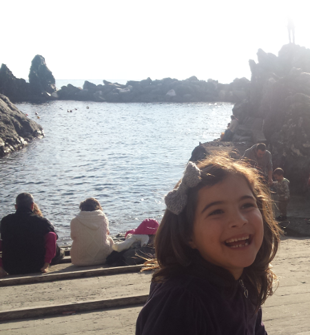
  
  
   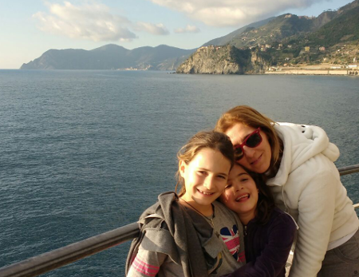
  
  
   La giornata è bellissima e fa caldo. Il sentiero dell'Amore è chiuso perchè c'è stata una frana...peccato! Poi tutti da zia.
  
  
   Quest'anno hanno decorato il paese di Verezzi con tanti presepi originali fatti con i materiali più disparati, dalle noci, ai pon-pon, alle spugnette per lavare i piatti, alle pietre
  
  
   
  
  
   alle zappe...
   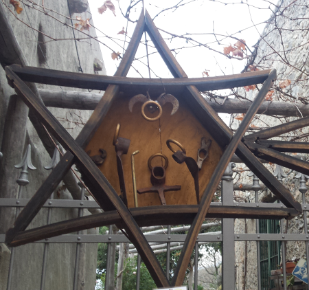
  
  
   e perfino nella grotta
  
  
   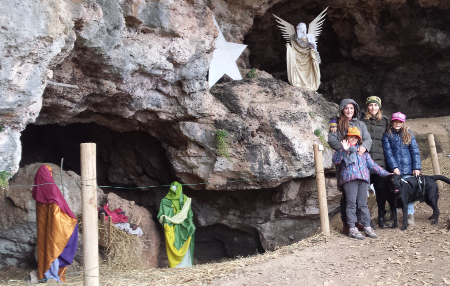
  
  
   La notte di capodanno ceniamo con zia e i nonni e poi andiamo da Sergio e Vieri a sparare i botti!
  
  
   <strong>
    1 gennaio 2016
   </strong>
   : giornata di sole stupendo. Oggi si va ad arrampicare alla Falesia delle 100 corde! Mati comunque si porta la sua!
  
  
   
  
  
   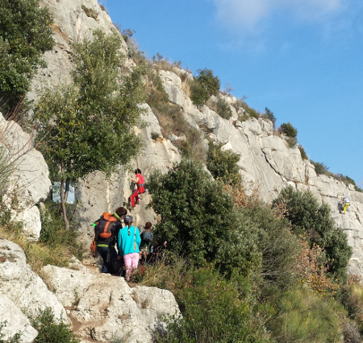
  
  
   Moschettoni, imbrago, grigri ...abbiamo tutto!
   
  
  
   si arrampica la signorina!
   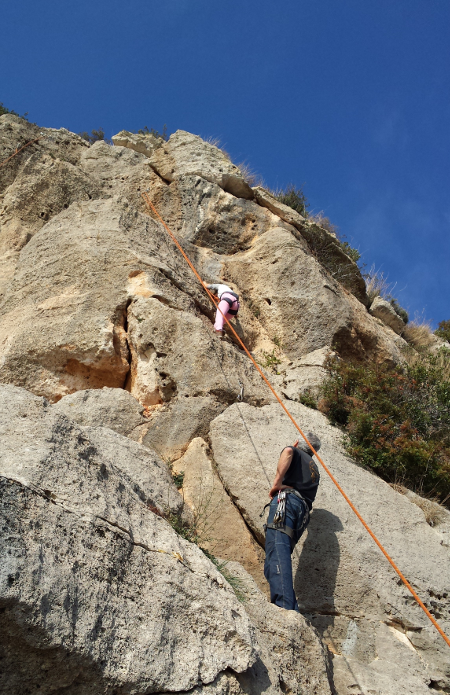
  
  
   poi tocca anche a Margherita
   
  
  
   grande meggy!
   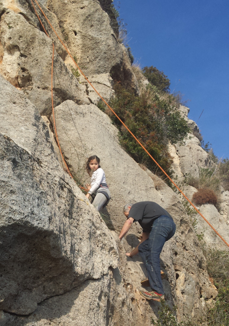
  
  
   e poi il turno di Giorgia e Andrea..... e anche nonna Lilli :D
  
  
   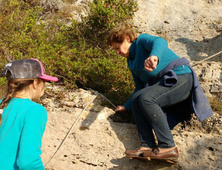
  
  
   Dopo la sudata alla falesia....ci vuole proprio un bel
   <a href="https://youtu.be/kPvgcKwS-1s">
    bagno
   </a>
  
  
   in mare! Ma io scherzavo.....
  
  
   
  
  
   Infine una bella suonata di
   <a href="https://youtu.be/aGnNkjud5Lk">
    djembè
   </a>
  
  
   a 4 mani!
  
  
   Ci fermiamo ancora qualche giorno e facciamo delle bellissime passeggiate. Quella alla cava è spettacolare! Che panorama!
  
  
   
  
  
   
  
  
   
  
  
   Non poteva mancare una pattinata al porto di Loano
  
  
   
  
  
   
  
  
   
  
  
   BUON ANNO A TUTTI!!!
  
 

## Disaster comedy
*10-01-2016*

 
  
   Che divertente questa commedia! Ma sbaglio o ci sono molte facce note??
  
  
   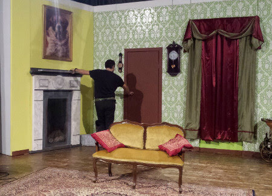
  
  
   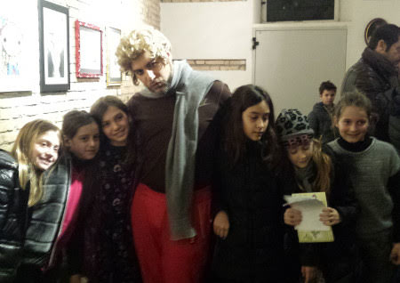
  
 

## Gennaio: mari & monti
*25-01-2016*

 
  
   Il 2016 inizia con un gennaio veramente mite
  
  
   
  
  
   
  
  
   gli unici giorni di freddo li trascorriamo ad Ussita con Alice ed Anna e sciamo nella ridente Frontignano! Ci sorprende anche una bella ed improvvisa nevicata sulle piste
  
  
   
  
  
   
  
  
   
  
  
   
  
  
   ma il giorno successivo uno stupendo sole!
  
  
   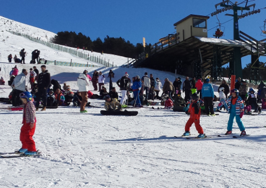
  
  
   
  
  
   e infine il tramonto tutto rosa sul Monte Bove!
  
  
   
  
 

## "Io canto nel coro delle voci bianche di Santa Cecilia...."
*06-02-2016*

 
  
   Meggina si da al canto...e partecipa ad un'iniziativa del Conservatorio di Santa Cecilia!
  
  
   Così il sabato mattina abbiamo la scusa per passeggiare per Roma!
  
  
   
  
  
   
  
  
   
  
  
   
  
  
   
  
  
   
  
 

## Carnevale
*07-02-2016*

 
  
   Biancaneve è pronta per la festa
  
  
   
  
  
   C'è anche la sua amica Minion-Stella
  
  
   
  
  
   ma purtroppo mangia la mela avvelenata e cade in un sonno profondo....
   
  
  
   per fortuna il valoroso principe Matteo la sveglia con un bacio!
   
  
 

## Shhhh .... facciamo una sorpresa ad Anna Gloria ....
*28-02-2016*

 
  
   In assoluto segreto prendiamo un volo per Catania...chi legge e chi ascolta musica!
  
  
   
  
  
   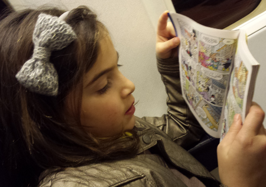
  
  
   La mattina dopo passeggiata di rito alla pescheria e lungo via Etnea
   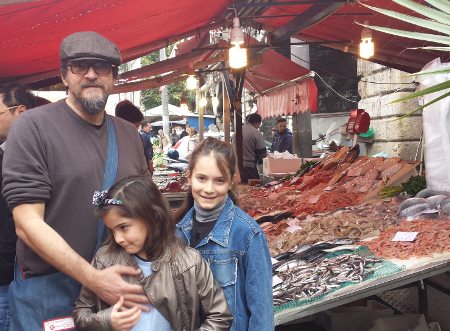
  
  
   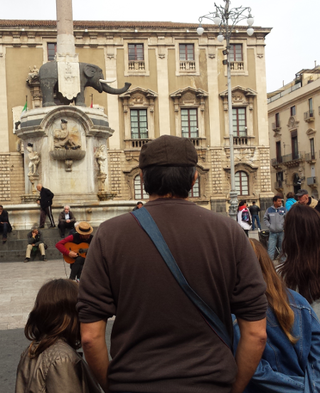
  
  
   e poi tutti a casa di Anny ad aspettare che torni da scuola! Ci siamo nascosti e le abbiamo fatto proprio una bella sorpresa!! I bimbi sono senza parole...contentissimi ...e lei super emozionata! Che bello!! E sono 40 splendidi anni anche per lei!!!
  
  
   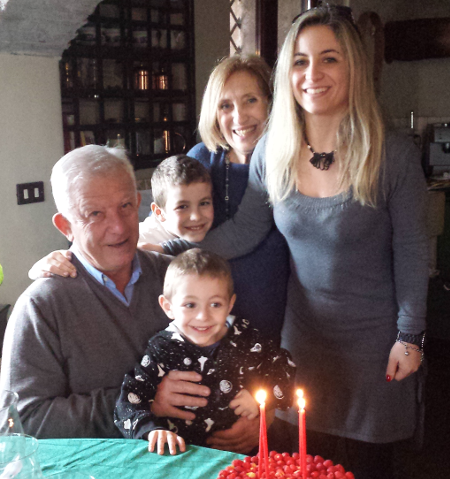
  
  
   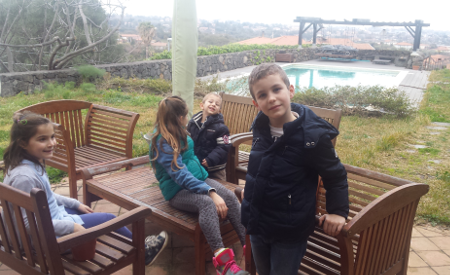
  
  
   Il pomeriggio SPA per le mamme e una super sessione di giochi per i bimbi! Domenica andiamo a fare una passeggiata ad AciCastello...quanti ricordi... che mare stupendo!
  
  
   
  
  
   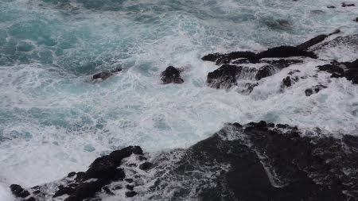
  
  
   
  
  
   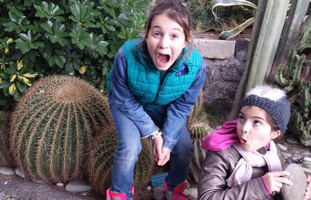
  
  
   
  
  
   
  
  
   
  
  
   Pranzetto tutti insieme!
   
  
 

## Home made
*02-03-2016*

 
  
   Quest'anno iniziamo con una serie di produzioni fatte in casa:
  
  
   <strong>
    i maritozzi
   </strong>
  
  
   
  
  
   <strong>
    il pane
   </strong>
  
  
   
  
  
   
  
  
   <strong>
    la birra
   </strong>
  
  
   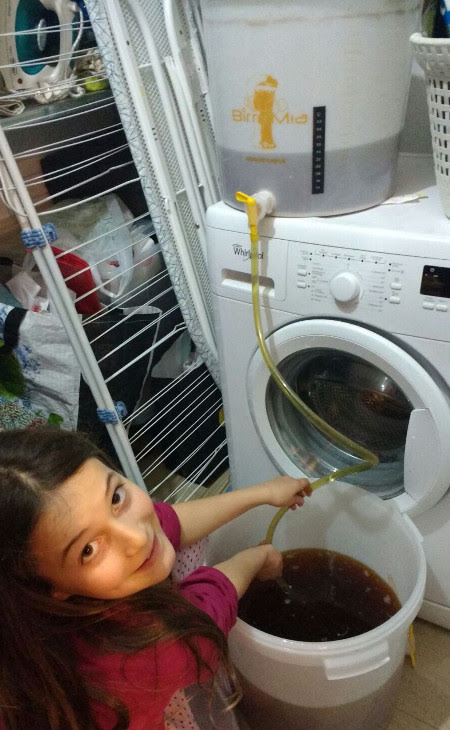
  
  
   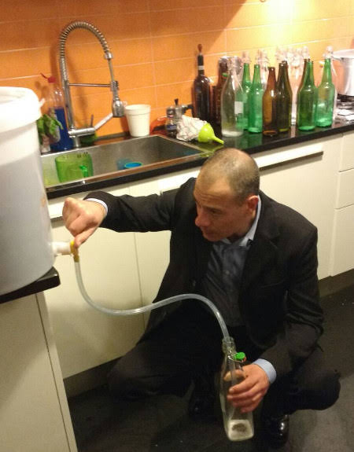
  
  
   
  
  
   
  
  
   
  
 

## Mimose
*09-03-2016*

 
  
   ... un tuffo nel passato ... un marzo di tanti anni fa ... vi ricordano qualcuno?
   
  
 

## Folgarida tour
*14-03-2016*

 
  
   Quest'anno una sparuto gruppetto di 42 persone si avventura tra le nevi di Folgarida. Però solo i veri duri affrontano prima la Roma Ostia
  
  
   
  
  
   
  
  
   e poi si vengono a riposare in montagna!
  
  
   Il gruppo vacanze è allegro e colorato
  
  
   
  
  
   
  
  
   
  
  
   La mattina si prende la cabinovia e si va a sciare
  
  
   
  
  
   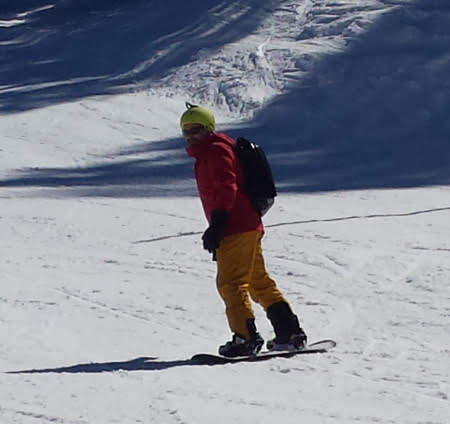
  
  
   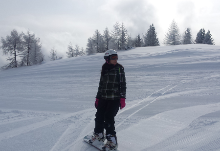
  
  
   
  
  
   
  
  
   poi una bella pausa ristoratrice
  
  
   
  
  
   
  
  
   
  
  
   
  
  
   
  
  
   e di nuovo sugli sci/tavole fino al tramonto
  
  
   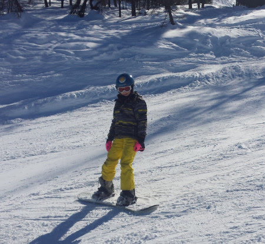
  
  
   ogni tanto una garetta....
   
  
  
   
  
  
   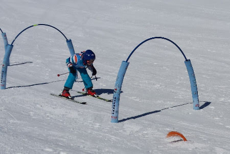
  
  
   e c'è chi vince davvero!!
  
  
   
  
  
   Ma la cosa più divertente è stare tutti insieme!
   
  
  
   
  
  
   A  fine giornata si torna in albergo ... ovviamente, prima di entrare, una battaglia a palle di neve non si nega a nessuno!
  
  
   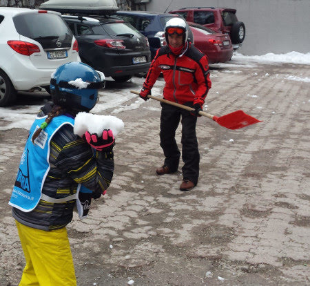
  
  
   .... relax dopo cena ....
   
  
  
   Come ogni anno festeggiamo in montagna il compleanno di Caterina ...
  
  
   
  
  
   e per l'occasione tutti al MUSE, il museo di Trento pieno di animali e di esperimenti!
  
  
   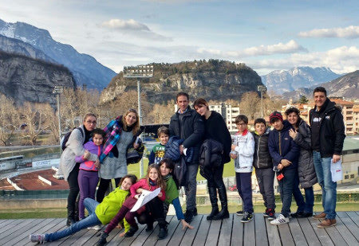
  
  
   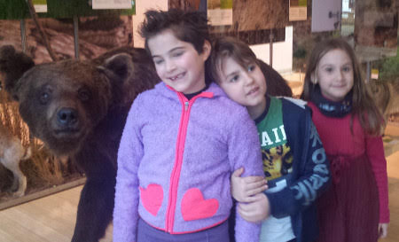
  
  
   
  
  
   
  
  
   
  
  
   
  
  
   
  
  
   Bellissima vacanza! Grazie a tutti gli amici che l'hanno resa tale!
  
  
   
  
 

## Pasqua e compleanno di papà
*28-03-2016*

 
  
   Arriva la zia Maria a anche lo zio Alessandro ...questa Pasqua si festeggia tutti insieme in campagna! La colazione è pronta ...qualcuno ha fame??
  
  
   
  
  
   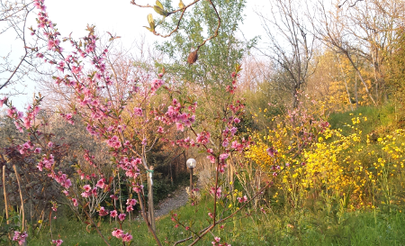
  
  
   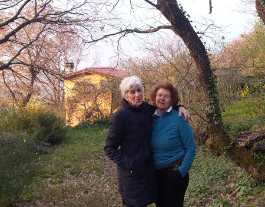
  
  
   E poi anche il pranzo....
  
  
   
  
  
   
  
  
   ... hei ma oggi è anche il compleanno di Papone! Auguri per i tuoi 45 anni!!!
  
  
   (grazie Ray)
  
  
   
  
  
   .. e un regalo adatto all'occasione!
   
  
 

## Zia Maria va in Messico a conoscere Matteo
*31-03-2016*

 
  
   Ciao zia...torna presto! E dai un bacio al nostro cuginetto messicano!
  
  
   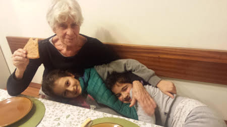
  
  
   Eccoloooo.... quanto è bello ... il giorno del suo battesimo!!!
  
  
   
  
  
   
  
 

## 40 anni e non sentirli ... ma ... se vedono tutti!!!
*02-04-2016*

 
  
   Papà ha organizzato la più bella festa a sorpresa mai vista per i 40 anni di mamma! Quanti complici e amici! Peccato che Marghe ronfava sulla sedia!
   
  
  
   Abbiamo mangiato, spento le candeline, fatto tantissime foto, scartato regali, visto dei video divertententissimi ed emozionanti e ballato fino a trada notte! (noi bimbe però siamo tornate a casa con i nonni!)
  
  
   DJ federico
  
  
   
  
  
   
  
  
   
  
  
   
  
  
   
  
  
   
  
  
   
  
  
   
  
  
   
  
  
   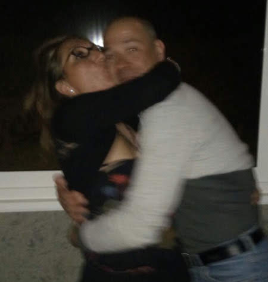
  
  
   
  
  
   .... i reduci ...
  
  
   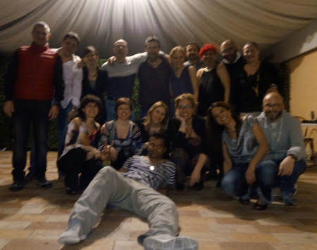
  
  
   Le frasi più gettonate: " Ma tu non avevi capito nulla?", "Andrea marito dell'anno" ....e la mia preferita "Il vero amore esiste!"
  
  
   GRAZIE a tutti!
  
 

## Compleanni di primavera
*08-04-2016*

 
  
   Auguri nonno Mario
  
  
   
  
  
   nonno Gianni
  
  
   
  
  
   
  
  
   e nonna Franca
  
  
   
  
 

## Rome by roller
*17-04-2016*

 
  
   ... non ci si annoia mai ...
  
  
   
  
  
   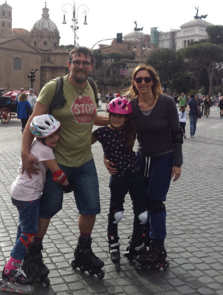
  
 

## Sorpresona di Zia Giorgia a Roma
*11-05-2016*

 
  
   Che sorpresona che ci hanno fatto zia e Morgi! E' venuta all'uscita di scuola e Mati e Marghe non sapevano niente! Ci siamo commossi tutti!
  
  
   Abbiamo giocato un pò in giardino....e poi il we in campagna.
  
  
   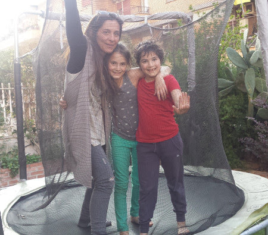
  
  
   
  
  
   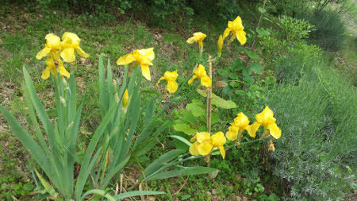
  
  
   Oggi è la festa della mamma e andiao a visitare il centro Mouton delle Peonie
  
  
   
  
  
   
  
  
   
  
  
   
  
  
   
  
  
   Che meraviglia! E poi pranziamo anche lì!
  
  
   
  
  
   
  
  
   (si nonno Gianni....questo albero te lo compriamo!)
  
  
   
  
  
   Il giorno dopo la Faggeta....che atmosfera....
  
  
   
  
  
   
  
  
   
  
  
   
  
  
   E una cenetta per salutarci ... ma dai zia che ci rivediamo presto presto!
  
  
   
  
 

## Amici
*21-05-2016*

 
  
   ... sono sempre il passatempo preferito .. e con loro si condividono tante cose
  
  
   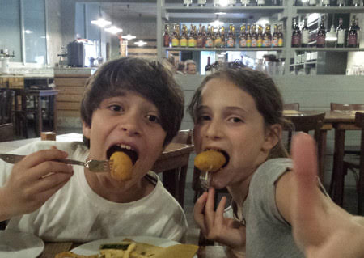
  
  
   
  
  
   
  
  
   
  
  
   
  
  
   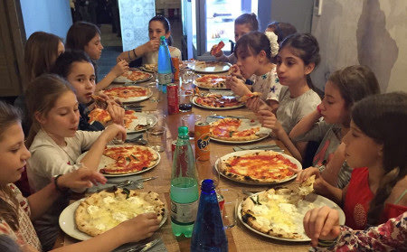
  
  
   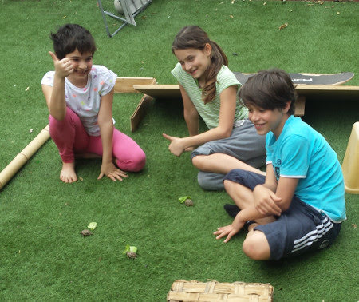
  
 

## Gite, recite, feste, saggi
*26-05-2016*

 
  
   Anche quest'anno la 4A partecipa al progetto Scuola Incanto e preparano la Cenerentola di Rossini (grazie zia Betta per il bellissimo vestito!)
  
  
   
  
  
   
  
  
   
  
  
   Si festeggiano anche un pò di compleanni della classe
  
  
   
  
  
   
  
  
   e si fanno le gite, a Castel Porziano la 4A e ad Agricoltura Nuova a fare il laboratorio 'dalla pecora al maglione' la 2B
  
  
   
  
  
   
  
  
   E poi i saggi di fine anno a scuola: musica
  
  
   
  
  
   
  
  
   e motoria. La classe di Meggy forma la scritta 'umana'  GRAZIE MILLE
  
  
   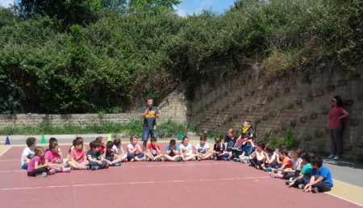
  
  
   
  
  
   
  
  
   e quella di Mati gioca a TRIS
  
  
   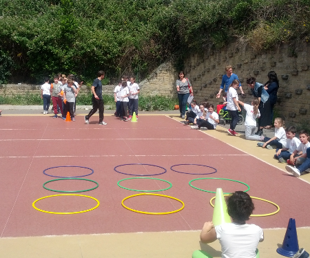
  
  
   
  
  
   e infine ... gavettoni l'ultimo giorno di scuola!!!
  
  
   
  
 

## Ponte del 2 giugno: abruzzo
*03-06-2016*

 
  
   Si parte in 4 camper, 7 bambine (pure Sophie!!)
  
  
   . Prima tappa Santo Stefano di Sessanio, dove dormiamo la notte accanto al laghetto. La mattina dopo passeggiata in paese
  
  
   
  
  
   e poi trekking fino a Rocca Calascio
   
  
  
   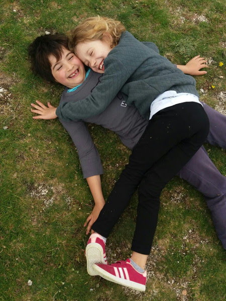
  
  
   
  
  
   Ci rifugiamo in una trattoria alla rocca e ci sfamiamo di arrosticini mentre fuori piove a dirotto. La sera ci spostiamo sull'adriatico a Casalbordino.
  
  
   A dispetto di tutte le previsioni che danno maltempo su tutta l'Italia ....qui c'è il sole!
  
  
   
  
  
   
  
  
   
  
  
   
  
  
   Il giorno dopo ci spostiamo a Fossa Cesia ...dove non può mancare un bbq in spiaggia
  
  
   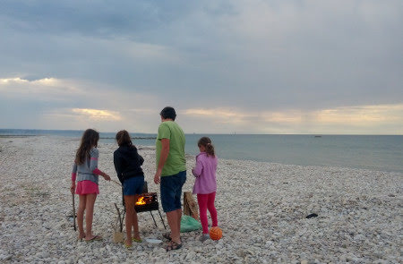
  
  
   
  
  
   
  
  
   e una bella pescata!
  
  
   
  
  
   Insomma come inaugurazione dell'estate ... tutto perfetto!
   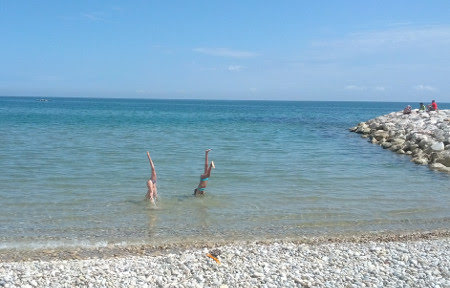
  
 

## Brevetti
*07-06-2016*

 
  
   uno squalo (200 misti)
  
  
   e un pesce rosso (dorso completo e stile)
  
  
   
  
 

## Finalmente è finita la scuola .... evviva le vacanze .... iniziamo da zia e Morghi!
*02-07-2016*

 
  
   La scuola è finita e si parte con i nonni per andare da zia Giorgia e Morgan....finalmente!!!
  
  
   
  
  
   Qui ci sono tanti amici con cui giocare, Sergio, Vieri, Viola, Livia, Isabel e andiamo al mare, a fare belle passeggiate in montagna e facciamo anche il mercatino alla fontana!
  
  
   Poi vengono mamma, papà e Ray a riprenderci. Andiamo a Malpasso
  
  
   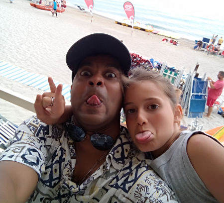
  
  
   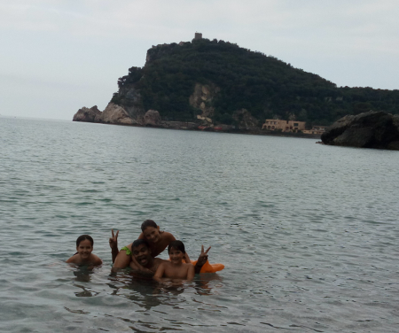
  
  
   
  
  
   
  
  
   e c'è chi l'ha proprio sentita la mancanza di mamma .... e era solo sonno?? :D
  
  
   
  
  
   Ray ci prepara anche una meravigliosa cena indiana ... da gustare al fresco del terrazzo ... con aperitivo!
  
  
   
  
  
   
  
  
   
  
  
   e le bimbe, dato il troppo piccante, si sbafano i ravioli con il sugo di noci
  
  
   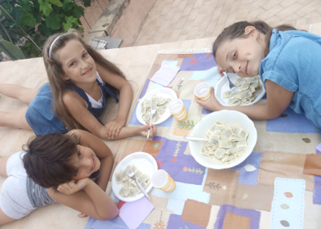
  
  
   Oggi si arrampica con il grande maestro Silva!
  
  
   
  
  
   che pazienza con questo branco di incapaci!!! Però alla fine riusciamo tutti a salire fino in cima! Mati ...che ha anche imparato a scendere
   
  
  
   
  
  
   Meggy che arrivata a metà si spaventa dell'altezza e vuole tornare giù
  
  
   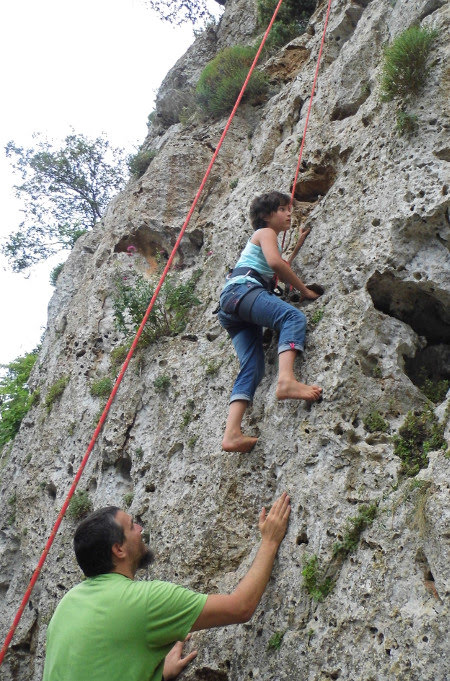
  
  
   papone ...con le scarpe inadatte all'arrampicata ...
  
  
   
  
  
   ray che sale su come uno stambecco
  
  
   
  
  
   zia che ormai è un'esperta ....
  
  
   
  
  
   e mamish che prova per la prima volta!
  
  
   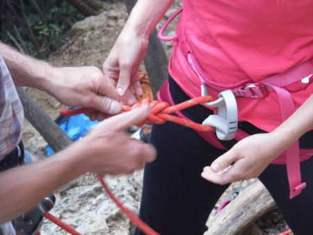
  
  
   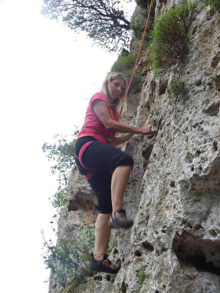
  
  
   ... e poi tutti gli altri ... che pazienza Silvano!!!
  
 

## Patente nautica
*07-07-2016*

 
  
   L'avventura è iniziata quest'inverno con simpatiche serate in cui Nunzio cercava di insegnare qualcosa ad un gruppetto di sfaticati dediti alla birra e allo spaghetto di mezzanotte ....
  
  
   Ma oggi, dopo una brillante prova, diventano "capitani" Andrea, Marco ed Enrico!
  
  
   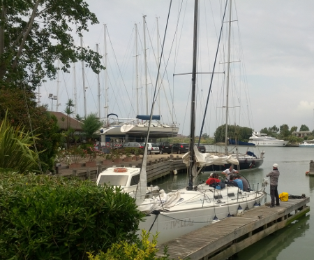
  
 

## Quando i gatti non ci sono....
*11-07-2016*

 
  
   i topi volano ....
  
  
   
  
  
   
  
  
   
  
  
   
  
  
   
  
  
   vanno in piscina
  
  
   
  
  
   giocano a tennis
  
  
   
  
  
   ..... come soffriamo!!!
  
  
   
  
 

## In viaggio con papà - parte 1
*31-07-2016*

 
  
   Dopo tre settimane a Valdolmo con i nonni si parte con papà e Ronzinante!
   
  
  
   Proseguiamo il nostro viaggio con papone. Prima tappa Ravenna, giriamo in bici e visitiamo delle bellissime chiese
   
  
  
   
  
  
   Siamo rimaste impressionate dai mosaici ... e ci ispiriamo nei nostri disegni...
   
  
  
   mmm .... Meggy ha disegnato il tombino veramente!!! :D
   
  
  
   Si va a visitare Chioggia
  
  
   
  
  
   e poi prendiamo il battello per Venezia
   
  
  
   sempre bellissima
   
  
  
   
  
  
   
  
  
   
  
  
   uno spritz ci sta tutto!!!
  
  
   
  
 

## Andalo&friends
*08-08-2016*

 
  
   Mentre M&amp;M e papone si sono avviati in camper, a Roma arrivano Annagloria e i bimbi! Partiamo insieme alla volta del trentino e dopo un lungo viaggio ci aspetta un accampamento perfetto nel camping di Andalo.
  
  
   
  
  
   Siamo accanto ad un bellissimo centro sportivo pieno di giochi e immerso nel verde.
  
  
   <strong>
    31/07
   </strong>
   La mattina ci svegliamo avvolti dalla nebbia e dalla pioggia! Passeggiata per il paese e poi ci incontriamo con la truppa dei rosci per fare una passeggiata a Trento. Pranzo in pizzeria, dove nel frattempo sono arrivati anche Massi, Paola e Flavio e poi visita al castello! E' anche uscito il sole!!
  
  
   
  
  
   
  
  
   <strong>
    1/08
   </strong>
   Oggi passeggiata a piedi che collega Andalo con Molveno, lungo il fiume.
  
  
   
  
  
   
  
  
   
  
  
   all'arrivo il paesaggio è bellissimo
   
  
  
   solo marghe riesce a farsi il bagno!
  
  
   
  
  
   L'acqua è gelida ma il prato verdissimo intorno ispira proprio un bel relax.
   
  
  
   
  
  
   <strong>
    2/08
   </strong>
   Nel frattempo ci hanno raggiunti anche Mara, Lory, Alessia e Anita al campeggio. Prendiamo la cabinovia che da Molveno porta a Monte Pradel. Il panorama è mozzafiato.
   <strong>
   </strong>
  
  
   
  
  
   
  
  
   Andiamo a fare il percorso tra gli alberi, per la gioia di bimbi e adulti ;)
  
  
   
  
  
   e poi una scarpinata ripidissima tutta in salita che ci porta alla Malga Tovre. Qui ci accolgono i simpaticissimi proprietari con una bottiglia di sciroppo di sambuco sul tavolo (Mara ti senti a casa, eh?)
  
  
   . I bambini si perdono nella fattoria....tra cavalli, conigli, maiali e noi ci gustiamo una bella polenta!
  
  
   
  
  
   
  
  
   
  
  
   
  
  
   Al ritorno ci fermiamo all'arrivo della cabinovia....tutto questo verde è stupendo!
  
  
   
  
  
   
  
  
   
  
  
   Spritz e cavalli! Che aperitivo!
   
  
  
   ops....dimenticavo Arturo!
  
  
   
  
  
   <strong>
    3/08
   </strong>
   Prendiamo la cabinovia da Andalo e raggiungiamo Cima Paganella. Giornata di sole bellissima!
  
  
   
  
  
   
  
  
   
  
  
   Dopo una fantastica crema di caffè e/o bombardino si parte per una lunga camminata sulla cresta. Diciamo che ci siamo quasi persi....ma alla fine dopo un paio d'ore abbiamo capito dove eravamo! I bambini sono stati bravissimi.
   
  
  
   
  
  
   
  
  
   
  
  
   e all'arrivo una mega abbuffata alla Malga Terlago!
  
  
   
  
  
   Dimentico sempre Arturo....bhè lui oggi non si è stancato molto!!
  
  
   
  
  
   <strong>
    4/08
   </strong>
   "Oggi una passeggiata tranquilla....il giro del lago di Molveno...partiamo alle 11 e in un paio d'ore siamo a pranzo al rifugio, prenoto subito" .... peccato che di ore ce ne abbiamo messe 4!! Però ne valeva la pena! Grazie Luca ... e comunque "si sta aprendo".
  
  
   
  
  
   Qualcuno fa anche il bagno!
   
  
  
   E infine arriviamo esausti alla baita "Ai fortini di Napoleone" ... i bimbi trovano ancora energie per giocare!!
   
  
  
   e perdersi ... vero Edo?
  
  
   
  
  
   <strong>
    5/08
   </strong>
   Oggi piove! SOB! Ma non ci perdiamo d'animo. Si fa shopping, si va in piscina e poi al cinema a vedere Tarzan!
  
  
   <strong>
    6/08
   </strong>
   Prendiamo la seggiovia di Fai della Paganella e arriviamo al rifugio Meriz. Siamo armati di buone intenzioni ma è troppo allettante l'idea di stiracchiarsi al sole e godersi la bella giornata, l'ultima della nostra splendida vacanza!
  
  
   
  
  
   
  
  
   
  
  
   Arriveduar
  
  
   
  
 

## In viaggio con papà - parte 2
*13-08-2016*

 
  
   Si ritorna in viaggio con papà. Come si sta bene e che ninne in camper!
  
  
   
  
  
   Passeggiata ad Aquileia
  
  
   
  
  
   
  
  
   e poi direzione confine. Parcheggiamo ad Opicina e arriviamo fino a Trieste in bici
  
  
   
  
  
   
  
  
   e ci andiamo anche a prendere un gelato con i nostri cugini, Gabriele e Maria Ginevra
  
  
   
  
  
   
  
  
   Attraversiamo il confine ed eccoci in Croazia. Per la serie a volte si ri-incontrano ... guardate chi c'è a Lussino? Sembrano facce note.....
  
  
   
  
  
   Passiamo un paio di giorni a fare tuffi dagli scogli
   
  
  
   
  
  
   e poi ci separiamo ... i ragazzi disperati affogano il dispiacere nell'alchool!
  
  
   
  
  
   Ci ritroviamo con il gruppo camperisti anonimi e visitiamo le cascate di Plitvice
  
  
   
  
  
   
  
  
   
  
 

## Croazia
*29-08-2016*

 
  
   <strong>
    13/08
   </strong>
   Andiamo a prendere mamish all'areoporto di Zara e finalmente siamo tutti insieme! Piccola sosta alla chiesetta di Nin
  
  
   
  
  
   e poi ci dirigiamo sull'isola di Pag, dove siamo "obbligati" a stare in un enorme campeggio carnaio a Simuni. Però riusciamo a trovarci un posticino niente male!
  
  
   <strong>
    14-08
   </strong>
   Simuni
  
  
   
  
  
   
  
  
   Il tramonto con i fasci di luce verde....non l'avevamo mai visto! Che spettacolo!
   
  
  
   E anche la pizzetta è buonissima
  
  
   
  
  
   Affittiamo due barchette a vela e ci divertiamo per 4 ore
   
  
  
   <strong>
    15/08
   </strong>
   Ripartiamo dall'isola di Pag e ci fermiamo per un giro in bici nel minuscolo paesino di Nin
   
  
  
   e poi arrviamo a Zara. Andiamo a vedere l'organo marino....
  
  
   
  
  
   o meglio a sentire il suono delle canne d'organo riempite dalle onde del mare ...
  
  
   
  
  
   il tramonto qui è veramente magico
  
  
   
  
  
   <strong>
    16/08
   </strong>
   Appuntamento a Zara con l'equipaggio della nostra barca Spotty Dog che ci porterà in giro per la croazia nei prossimi giorni. Lasciamo Ronzinante allo skipper che ce lo porta a Spalato e ci imbarchiamo!
  
  
   
  
  
   l'esterno è bellissimo e anche l'interno è confortevole....i ragazzi sono già a giocare! La notte la passiamo in porto.
  
  
   
  
  
   <strong>
    17/08
   </strong>
   Siamo 17 e partiamo il 17 .... come andrà questo viaggio? Usciamo dal porto di Zara e attraversiamo il lungo canale formato tra la costa e l'isola di Pasman.
  
  
   
  
  
   Arriviamo in una caletta tranquilla sull'isola di
   <strong>
    Zut
   </strong>
   .
  
  
   
  
  
   Andrea si tuffa e va a prenotare per cena alla Konoba Bain. Facciamo il bagno e i bambini si divertono con i tender.
  
  
   
  
  
   Dopo aver fatto la "doccia" con il sapone marino ed esserci agghindati con la divisa della crociera torniamo sulla terra ferma per cena.
  
  
   
  
  
   Posto incantevole, tramonto stupendo e cena di pesce alla brace!
  
  
   
  
  
   
  
  
   <strong>
    18/08
   </strong>
   un pò di navigazione ... in cui si chiacchera, si fanno foto, ci guarda il panorama ..
  
  
   
  
  
   
  
  
   
  
  
   e arriviamo nel
   <strong>
    Parco Naturale di Telašica.
   </strong>
   Scendiamo a terra e facciamo una breve passeggiata fino ad arrivare al lago salato, situato in una posizione splendida, tra la cima dell'isola e la scogliera.
   <strong>
   </strong>
  
  
   
  
  
   Le bimbe fanno il bagno e poi passeggiamo fino all'altra estremità del lago, dove troviamo una foresta di "equilibri" su una scogliera a picco sul mare blu.
  
  
   
  
  
   Tanti tuffi e qualche taglio .... ma ci arrampichiamo anche in cima alla scogliera per ammirare il paesaggio.
  
  
   
  
  
   La sera dormiamo in rada...che bello!
  
  
   <strong>
    19/08
   </strong>
   entriamo nel
   <strong>
    Parco Nazionale delle Incoronate,
   </strong>
   una costellazione di 150 isolette brulle e disabitate. Un paradiso!
  
  
   C'è vento e sembra arrivare il brutto tempo....
  
  
   
  
  
   invece esce il sole e ci fermiamo nel meraviglioso e minuscolo porticciolo di "Aci Marina"
   <strong>
    Piskera.
   </strong>
   Facciamo un bel bagno e ci stiracchiamo al sole sui sassi appuntiti...
  
  
   
  
  
   e poi ai fornelli con Teresa per preparare un nuovo tipo di tiramisù, con la crema impazzita, per il compleanno di Alessandra.
  
  
   Passeggiata/arrampicata sulla cima della collina per ammirare il tramonto....aperitivo incluso!
  
  
   
  
  
   
  
  
   
  
  
   
  
  
   <strong>
    20/08
   </strong>
   Sveglia in mezzo al mare con la fedele Constellation accanto
  
  
   
  
  
   ...stamattina appena svegli bagno alla traina....Nunzio vai pianoooooo ....
  
  
   
  
  
   
  
  
   vita in barca
  
  
   
  
  
   a vele spiegate...passaggio radente al foro
  
  
   
  
  
   
  
  
   <strong>
    21/08
   </strong>
   oggi passiamo nello strettissimo canale Luka che protegge la cittadina di Sibenik. Passiamo sotto il ponte ed entriamo nel fiordo che prosegue per qualche Km fino al paesino di** Scradin (Scardona)
  
  
   **.
   
  
  
   Riusciamo anche ad acquistare al volo un paio di Kg di cozze direttamente dall'allevamento
  
  
   
  
  
   
  
  
   Ci fermiamo in porto e dopo un bel soutè di cozze ci incamminiamo nel Parco Nazionale di Krka per andare a visitare le
   <strong>
    cascate di Skradinski
   </strong>
   .
  
  
   
  
  
   Molto suggestive e un pò affollate! Il ritorno lo facciamo in battello.
  
  
   La sera ci concediamo una cena alla Konoba da Toni dove fanno un piatto tipico, la peka, di agnello e polipo! Fantastica!
  
  
   
  
  
   
  
  
   <strong>
    22/08
   </strong>
   Durante la notte si alza una forte bora, gli alberi delle barche sibilano e le cime sbattono contro lo scafo. Ripartiamo in giornata diretti verso sud....ma il vento non accenna a diminuire, 30 nodi e raffiche forti.
  
  
   Al timone Andrea e Nunzio si alternano tra le onde....ma tranquilli stiamo tutti bene!
  
  
   
  
  
   
  
  
   
  
  
   Niente bagni oggi....fa freddino...lo dice anche Meggy! Dormiamo attaccati ad un gavitello in una baia  ridossata e protetta dal vento, ma la notte le raffiche non finiscono mai!
  
  
   <strong>
    23/08
   </strong>
   Giornata di navigazione, proviamo a fermarci alla laguna Blu ma c'è molto vento. **
   
  
  
   
  
  
   **
  
  
   <strong>
    24/08
   </strong>
   Finalmente finisce la bora e ritorna il sole.
  
  
   
  
  
   Bagnetto e poi un pò di navigazione fino ad una bellissima caletta dove ci immergiamo e facciamo i tuffi. Vedo anche una murena!!!
  
  
   
  
  
   
  
  
   
  
  
   Nel pomeriggio arriviamo a **Hvar (Lesina)
  
  
   ** e ormeggiamo al porto di Palmizana, affollatissimo di barche piene di ragazzi...le famose sailing week....ahhhh ad avere 20 anni di meno...vero Teresa??? :D:D
  
  
   Dal porticciolo prendiamo il gommone-taxi che ci porta a Hvar
  
  
   
  
  
   La cittadina è bellissima. Facciamo la salita fino al castello da cui si gode un panorama stupendo sul golfo e sulle isolette di fronte. Poi shopping (negozio di magliette da svaligiare!)
  
  
   , cena con hamburger su una terrazzina tipica e passeggiata notturna.
   
  
  
   
  
  
   
  
  
   <strong>
    25/08
   </strong>
   Oggi arriviamo a
   <strong>
    Trogir
   </strong>
   .
  
  
   
  
  
   
  
  
   Anche questo paesino è molto caratteristico con i suoi vicoletti e il forte sul mare. Le bimbe trovano come divertirsi
  
  
   
  
  
   e noi adulti ci consoliamo con un raffinato e squisito ristorante di pesce!  Il dopo cena prevede treccine per tutti!!!
  
  
   
  
  
   Dormiamo in porto. All'alba la luce e l'atmosfera sono stupende
  
  
   
  
  
   facciamo una passeggiata solitaria e romantica con Andrea.
  
  
   Si riparte, dopo aver fatto benzina ovviamente
  
  
   
  
  
   Che tristezza.....siamo in vista di
   <strong>
    Spalato
   </strong>
   ....l'umore si legge dalle nostre facce...
  
  
   
  
  
   e per di più Constellation ci supera !!! Che smacco!!
  
  
   
  
  
   <strong>
    27/08
   </strong>
   Sbarco :(
  
  
   Parte dell'equipaggio riprende il volo per Roma, mentre noi facciamo prima una passeggiata con tuffo sul lungomare di Spalato, dove visitiamo anche la casa museo dell'artista Ivan Mestrovic
   
  
  
   e poi una passeggiata per la città (con qualche disavventura, caduta e furto del portafoglio al nostro skipper)
  
  
   
  
  
   
  
  
   
  
  
   Insomma.....cosa dire ....vacanza unica, persone speciali ....
  
  
   
  
  
   .... viva Spotty Dog!!!!
  
  
   
  
 

## e per Matilde sono 10 !!!
*08-09-2016*

 
  
   Rientrati dalle vacanze nonna Lilli dice "ma che stanno a fare a casa, me le riporto in Liguria!".Viaggio con i gattini, ne "salvano" tre.
  
  
   
  
  
   Il 7 settembre Matilde compie 10 anni! AUGURI cucciola! Zia Giorgia le porta ad un corso di falegnameria
  
  
   
  
  
   e poi a pranzo al Melogno
   
  
  
   Arrivati M&amp;P facciamo una festona con tutti i bimbi di Verezzi! Un grazie speciale a Ber che ci ha permesso di usare il suo orto (in cambio le abbiamo regalato Nero, il gattino della campagna!)
  
  
   
  
  
   
  
  
   e a Carolina che ha organizzato i divertentissimi giochi: mangia la ciambella
  
  
   
  
  
   metti le m&amp;m nel bicchiere con la cannuccia
  
  
   
  
  
   scoppia i palloncini con le freccette
  
  
   
  
  
   tanti tanti gavettoni alla fontana
  
  
   
  
  
   e la pentolaccia fatta a mano da papone e le bimbe
  
  
   
  
  
   Alla fine le torte, di zia e di Silvano
  
  
   
  
  
   Grazie a tutti è stata una bellissima festa!
  
  
   
  
 

## e per Margherita sono 8!!
*24-09-2016*

 
  
   Prima di andare a scuola spegniamo la candelina....auguri Meggy!!!
  
  
   
  
  
   Poi invitiamo un pò di amichette a giocare
  
  
   
  
  
   
  
  
   poi cena e torta
  
  
   
  
  
   e infine pigiama party! Film alle 23.30 e poi chiacchere fino a notte inoltrata! Alle 7.30 erano tutti svegli!!!
  
  
   
  
 

## New outfit
*02-10-2016*

 
  
   Piccole bimbe crescono....e tirano fuori la loro personalità...
  
  
   romantica e coccolona
  
  
   
  
  
   
  
  
   urban e sportiva
  
  
   
  
  
   
  
  
   
  
 

## Solidarietà con Amatrice - sagra della patata a Leonessa
*10-10-2016*

 
  
   Il 24 agosto in queste zone c'è stato un fortissimo terremoto di magnitudo 6.0 che ha distrutto la città di Amatrice e tanti comuni limitrofi. Per dare una mano a queste persone andiamo alla sagra della patata di Leonessa.
  
  
   In mattinata prendiamo la seggiovia che parte dal paese e arriva sul monte Tilia.
  
  
   
  
  
   qui sù il paesaggio è molto suggestivo e la camminata facile, lungo il fianco della montagna
   
  
  
   
  
  
   arriviamo fino alla torre che sovrasta il paese
  
  
   
  
  
   
  
  
   e poi tutta discesa ripidissima nel bosco .... (un pò incoscenti....)
  
  
   In paese ci aspettano gli amici camperisti che ci hanno raggiunti. Passeggiata per le tantissime bancarelle della sagra, dove non possiamo non comprare 5Kg di patate!
  
  
   La sera inizia a piovere....ma non ci scoraggiamo....a noi basta un buon panino con la salsiccia e qualche ballo sfrenato per scaldarci!!
  
  
   La mattina successiva c'è un sole stupendo, facciamo colazione in paese, con cornetto alla patata ovviamente, e un pò di spesa girovagando per le bancarelle. Poi data la folla che inizia ad arrivare scappiamo al lago di Piediluco.
  
  
   
  
  
   Pic nic al sole bordo lago!
  
  
   
  
  
   Bellissimo we!!
  
 

## Terre di Marfisa a Farnese
*16-10-2016*

 
  
   Vi ricordate il terreno di Nathalie a
   <a href="http://pilde.net/blog/?p=2737">
    Farnese
   </a>
  
  
   , 5 anni fa ? Una collina con piccole piantine di ulivo e di vite appena piantate .... bhè ci siamo tornati oggi .... ed è un'azienda agricola avviata dove si produce ottimo vino e con grandi progetti per il futuro
  
  
   
  
  
   
  
  
   
  
  
   (adoro questo logo!!)
  
  
   Bravissima Nath! Noi ti rendiamo omaggio con il TUO ottimo Zamathi :)
  
  
   
  
  
   
  
  
   
  
  
   E poi tutti a pranzo al caseificio e agriristoro Radichino, con mungitura delle pecore compresa!
  
  
   
  
  
   Matilde e Sophie coppia perfetta!
   
  
 

## Halloween party
*01-11-2016*

 
  
   Nonostante qualche piccola incomprensione tra le bimbe...anche quest'anno si festeggia Halloween con la classe di Matilde.
  
  
   La casa è pronta, la porta "mummia" aspetta le streghette...
  
  
   
  
  
   e sulla tavola tante cose mostruose... funghi velenosi
  
  
   
  
  
   mele affamate
   
  
  
   ragnetti puzzolenti
   
  
  
   dita insanguinate
  
  
   
  
  
   e mummie imbavagliate
   
  
  
   .. . eccoleeeeee!
  
  
   
  
  
   Dopo un pò di "dolcetto scherzetto" in giro per i palazzi,  tutte a cena
  
  
   
  
  
   e poi a dormire ...si fa per dire!!
  
  
   
  
 

## Gli Addams al castello di Bracciano
*14-11-2016*

 
  
   Giornata grigia e piovosa, ma non ci scoraggiamo e andiamo a Bracciano, vestiti pure in maschera
  
  
   
  
  
   
  
  
   Aderiamo a questa bella iniziativa del teatro Helios che propone la visita del castello accompagnati, o meglio continuamente interrotti, dai membri della famiglia Addams che si aggirano per le stanze.... Morticia che cerca Mercoledì e Pugsley, la nonna che si nasconde dietro le tende, Gomez e zio Fester che duellano nel salone delle armi....insomma veramente divertente!
  
  
   
  
  
   
  
  
   E alla fine il laboratorio per creare il maggiordomo Lurch ("chiamato??")
  
  
   con tanto di ballo finale!
  
  
   
  
  
   
  
  
   Poi tutti a mangiare a bordo lago!
  
  
   
  
 

## Gare nuoto
*05-12-2016*

 
  
   Oggi le gare di nuoto!
   
  
  
   
  
  
   
  
 

## Ponte 8 dicembre in Liguria
*12-12-2016*

 
  
   Questo lungo ponte andiamo da zia in treno con i nonni. Poi ci raggiungono anche M&amp;P. Rivediamo i nostri amici: Isabel, Sergio, Vieri, Viola. Le giornate sono bellissime e facciamo un pò di passeggiate, tra la montagna e il mare
  
  
   
  
  
   Al sole si sta benissimo....sembra estate!
   
  
  
   A Finale c'è il mercato e anche le giostre...impossibile resistere
  
  
   
  
  
   
  
  
   siamo anche salite sulla ruota panoramica!
   
  
  
   Papà impara l'arte della panificazione dal paziente Silvano ..
  
  
   
  
  
   la focaccia è il suo forte!
   
  
  
   e le crostate mitiche....da sempre!
   
  
  
   Poi un pò di relax al mare ... sti due matti, Meggy e Silva, fanno anche il bagno!!
  
  
   
  
  
   
  
  
   
  
  
   E nel pomeriggio tutti a mangiare i "fugassin" da Lina e Federico!
  
  
   
  
  
   
  
  
   Anche la micina partecipa!
  
  
   
  
  
   L'ultimo giorno andiamo a Genova tutti insieme
  
  
   
  
  
   i nonni e zia vanno a vedere una mostra e noi all'acquario
  
  
   
  
  
   
  
  
   Bellissimi i delfini
   
  
  
   
  
  
   
  
  
   Marghe aveva paura di toccare le razze, ma Mati l'ha convinta!
  
  
   
  
  
   Un pò di bolle di sapone ...
   
  
  
   e si ritorna tristemente tutti a casa, dopo questo bellissimo ponte!
  
 

## Recite di Natale
*23-12-2016*

 
  
   Da Meggy hanno organizzato un lavoretto tutti insieme per fare la calza della befana! Mamme, papà e bimbi al lavoro! Il risultato è originale e colorato!
  
  
   
  
  
   
  
  
   
  
  
   
  
  
   Mentre da Mati hanno preparato la rappresentazione teatrale di Canto di Natale (lei faceva il presentatore e il muratore :)
  
  
   )
  
  
   e poi una canzone cantata nel linguaggio dei segni!Bravissimi!
  
  
   
  
  
   
  
 

