# 2017

## Neues Jahr von Berlin
*03-01-2017*

 
  
   <strong>
    27-dic
   </strong>
   : Partenza per Berlino! (cosa hanno contro gli unicorni che non me lo fanno passare al metal detector??)
  
  
   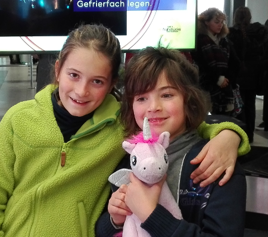
  
  
   Appena arriviamo andiamo subito a casa. E' nel quartiere di Kreuzberg e rimaniamo scioccati dall'ascensore che arriva direttamente dentro casa e dalla quantità di stanze! E' bellissima! Usciamo e andiamo a cercare un mercatino di Natale nel quartiere di Spandau ... peccato che l'hanno smontato ieri :( ... e allora ci mangiamo un ottimo currywurst e poi passeggiata in centro alla Porta di Brandeburgo e Postdamer Platz.
   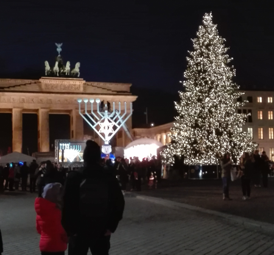
  
  
   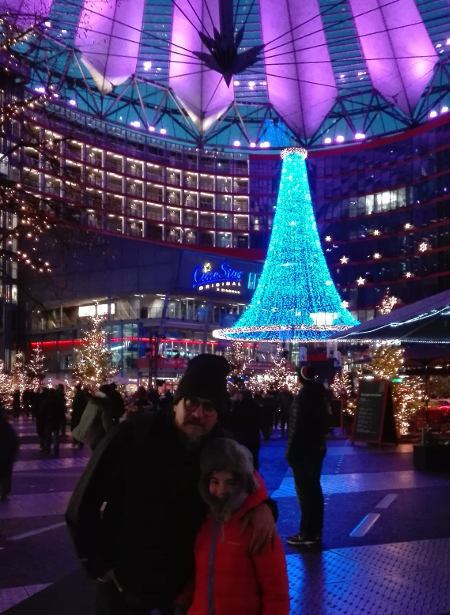
  
  
   Stanotte arrivano anche Paolett, Massi e Flaflly!!!
  
  
   <strong>
    28-dic
   </strong>
   : risveglio tutti insieme. La giornata è uggiosa.. pioggerellina....ma non ci perdiamo d'animo. A piedi ci avviamo verso il famoso e un pò troppo turistico Check Point Charlie, il posto di blocco tra la Berlino sovietica e quella americana.
  
  
   
  
  
   
  
  
   
  
  
   due passi tra le vecchie Trabant e poi
   
  
  
   cerchiamo di spiegare ai ragazzi il "muro" e il nazismo ...
   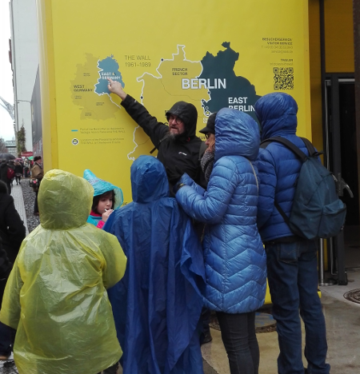
  
  
   
  
  
   ma solo visitando il museo "Topografia del Terrore" riescono a intuire gli orrori di questa funesta pagina della storia
  
  
   
  
  
   Piove e siamo tristi....continuiamo a farci del male al memoriale dellOlocausto, un labirinto di blocchi di cemento all'interno del quale è facile perdersi fisicamente ma soprattuto emotivamente...
  
  
   
  
  
   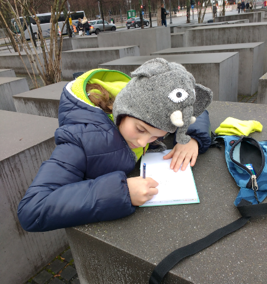
  
  
   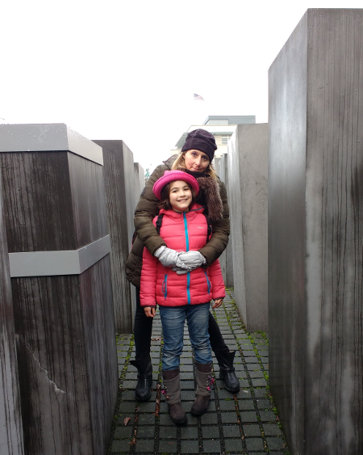
  
  
   Ci facciamo tornare il sorriso a Postdamer Platz con un hot dog caldo caldo ai mercatini e una scivolata sui gommoni...
  
  
   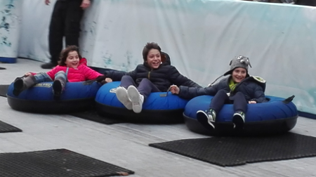
  
  
   e ci innamoriamo del semaforo di Berlino
  
  
   
  
  
   :D:D
  
  
   
  
  
   <strong>
    29-dic: AUGURI MASSI!!!
   </strong>
   Oggi siamo di cultura. Passeggiata verso l'isola dei musei
  
  
   
  
  
   
  
  
   con tappa immancabile al Neues Museum dove vediamo dei pezzi unici tra cui la testa verde del IV secolo a.C.
   <strong>
   </strong>
  
  
   
  
  
   il busto della regina Nefertiti da cui è impossibile distogliere lo sguardo per l'incredibile bellezza
  
  
   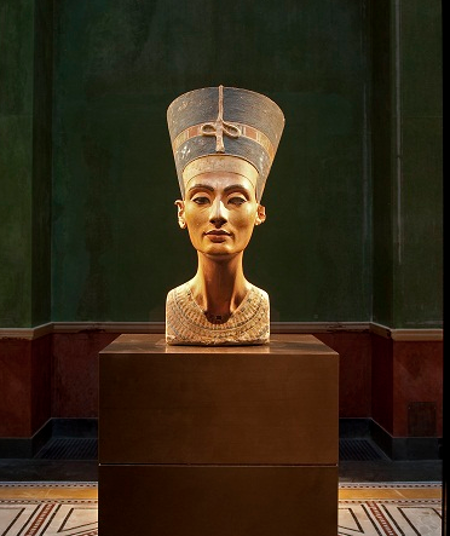
  
  
   un fantastico "calendario" dell'epoca del bronzo, il cappello d'oro
  
  
   
  
  
   e infine il famosissimo cappello rosa berlinese.... (hihihihi)
  
  
   .
  
  
   
  
  
   Pranzo in un locale tipico a base di stinco e patate! Poi passeggiata lungo il fiume
  
  
   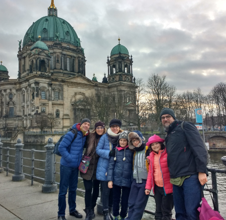
  
  
   
  
  
   
  
  
   
  
  
   <strong>
    30-dic:
   </strong>
   oggi è uscito un timido sole. Da casa a piedi attraversiamo il quartiere in direzione est
   <strong>
   </strong>
  
  
   
  
  
   passando per Gorlitzer, un parchetto molto amato dai Berlinesi ... e dalle beghine
   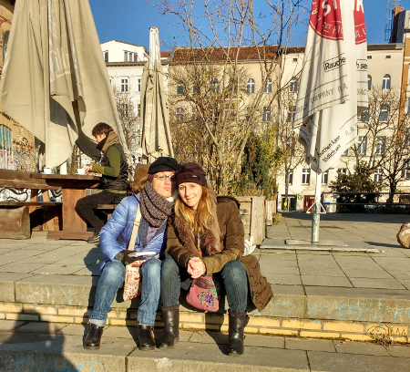
  
  
   
  
  
   attraversiamo il fiume Sprea
  
  
   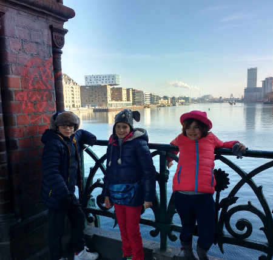
  
  
   fino ad arrivare all' East Side Gallery, un lungo tratto di muro decorato da famosi artisti
  
  
   
  
  
   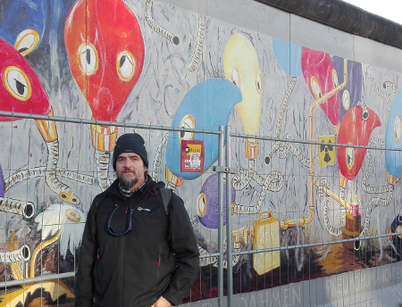
  
  
   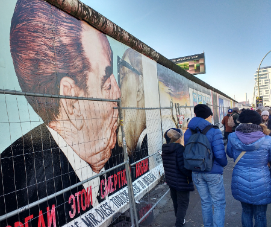
  
  
   
  
  
   
  
  
   
  
  
   
  
  
   
  
  
   e infine passeggiata per i vialoni della berlino est
  
  
   
  
  
   Nel pomeriggio visitiamo un museo importantissimo, il Pergamon. Peccato che l'altare di Pergamo è chiuso per restauro, ma la porta di Babilonia toglie il fiato
   <strong>
   </strong>
  
  
   
  
  
   
  
  
   e non scherza nemmeno la porta del mercato di Mileto ..
   
  
  
   
  
  
   Che bella quest'isola della cultura!
   
  
  
   Torniamo a casa esausti! Cena al ristorante greco!
  
  
   <strong>
    31-dic
   </strong>
   : ultimo giorno dell'anno! Andiamo a visitare il castello di Charlottensburg, ma prima una abbondante colazione super dolce nel regno del “Pfannkuchen” (bombolone)
  
  
   che a Berlino si chiama così, ma in tutta la Germania viene chiamata “Berliner”. Le proviamo tutte...per la gioia del cameriere....molto interessato ai maschietti italici.
  
  
   
  
  
   
  
  
   Sfarzosi gli interni
   
  
  
   e bellissima la collezione di porcellane e ornamenti per la tavola!
  
  
   
  
  
   
  
  
   Pomeriggio torniamo in centro. Papà e bimbi al museo della Lego
  
  
   
  
  
   
  
  
   e le mamme a spasso ...ovviamente con i negozi chiusi!
  
  
   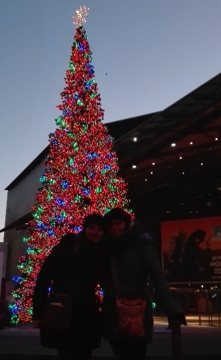
  
  
   Torniamo a casa ma tutti i negozi sono chiusi ... niente cenone ... pizza da asporto per i bambini e cena improvvisata da Andrea....ma che importa!!!
  
  
   
  
  
   dopo cena giochiamo a scarabeo (con le lettere tedesche!)
  
  
   e poi tutti in strada a fare i botti!! Qui sparano peggio che a Napoli!  BUON 2017 A TUTTI!!
  
  
   <strong>
    1-genn
   </strong>
   : illusi di poter fare le visita al Parlamento ci alziamo presto....ma purtroppo non ci riusciamo, però incrociamo la corsa stracittadina!
  
  
   
  
  
   
  
  
   Decidiamo infine di concludere la nostra settimana con una passeggiata nella zona est
  
  
   
  
  
   
  
  
   
  
  
   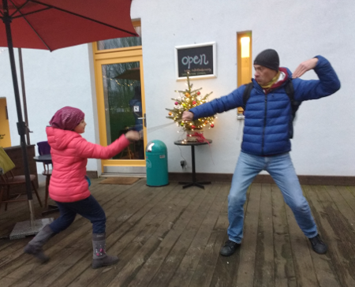
  
  
   percorrendo la linea del muro e addentrandoci anche nel mercato di Mauerpark con tanto di bidone con il fuoco dentro per riscaldarsi
  
  
   
  
  
   Torniamo a casa infreddoliti e stanchi! Che bella settimana!
  
  
   <strong>
    Auf Wiedersehen Berlin
   </strong>
  
  
   
  
 
## Skate ... che passione!
*04-01-2017*

 
  
   ... la nuova passione di Matilde ... lo skateboard ... e non solo!!!! Andiamo allo skate park ad Anagnina...pieno di ragazzi che saltano e fanno i trick e anche lei non se la cava affatto male!!
  
  
   [video width="1920" height="1080" mp4="{{baseurl}}/uploads/2017/01/skate_bolla.mp4"][/video]
  
  
   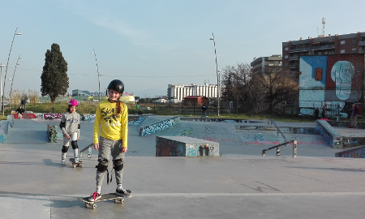
  
  
   
  
  
   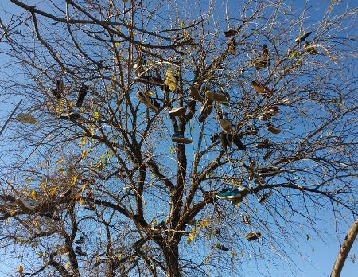
  
  
   sempre insieme a Dany
  
  
   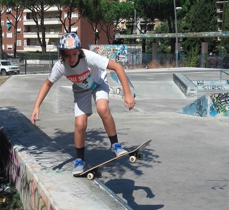
  
  
   e poi dopo che fame!!
  
  
   
  
  
   A casa si è anche costruita il porta skate!
  
  
   
  
 

## Sole invernale
*21-01-2017*

 
  
   il bello di Roma è che all'improvviso scappa fuori una giornata stupenda anche in pieno inverno....
  
  
   
  
  
   
  
  
   e anche al lago di castel Gandolfo non è niente male
  
  
   
  
  
   
  
 

## Romantico we a Pistoia e Abetone
*21-02-2017*

 
  
   Festeggiamo i nostri 15 anni insieme. Prima a Pistoia, dove visitiamo il centro, il vecchio ospedale del ceppo con la più picola sala anatomica del mondo e i sotterranei
  
  
   
  
  
   
  
  
   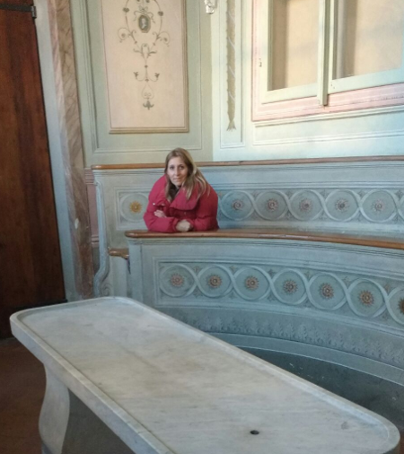
  
  
   
  
  
   Poi due giorni bellissimi in Val di Luce sull'Abetone a sciare
  
  
   
  
  
   
  
  
   
  
 

## Carnevale di Frascati
*27-02-2017*

 
  
   Tutti in maschera oggi!! Andiamo a vedere la sfilata di carri a Frascati
  
  
   
  
  
   
  
  
   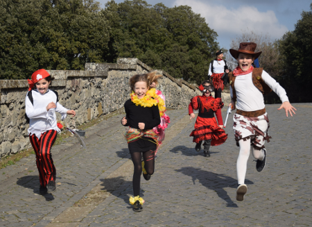
  
  
   
  
  
   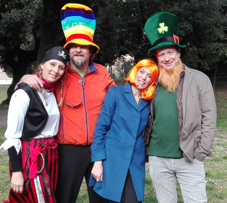
  
  
   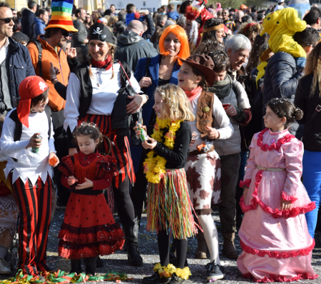
  
  
   
  
  
   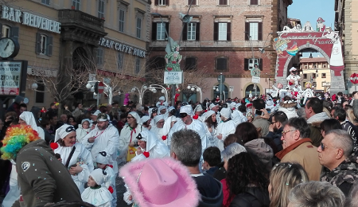
  
  
   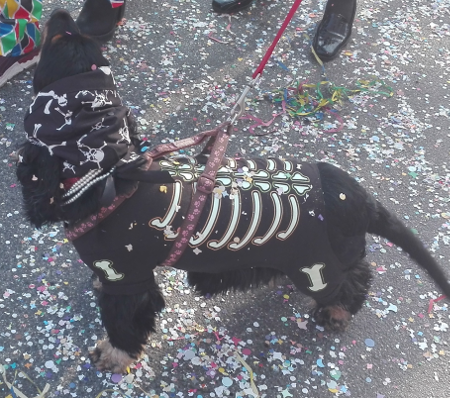
  
 

## Friends
*14-03-2017*

 
  
   Auguri a tutte le amiche :)
  
  
   
  
 

## Folgarida bis
*19-03-2017*

 
  
   Anche quest'anno torniamo a Folgarida all'Hotel Gran Baita ... la signora Enza ci aspettava con ansia .... e siamo i soliti matti ....con qualche defezione ... ma è rimasto lo scoglio duro!! Giornate di sole si alternano con giornate di nevicate (per fortuna....altrimenti altro che prati fioriti!!)
  
  
   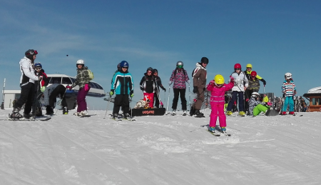
  
  
   Luca si deve sempre distinguere....quest'anno una nuova tecnica di discesa delle nere con lo snow ... a pelle di leopardo!!!
  
  
   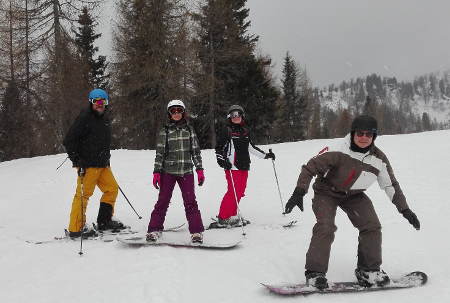
  
  
   
  
  
   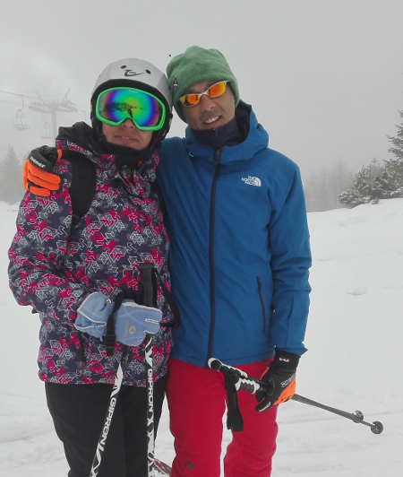
  
  
   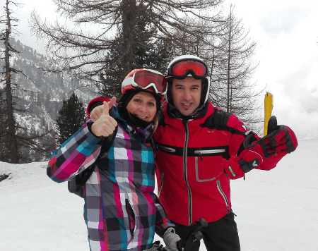
  
  
   
  
  
   
  
  
   E i bambini alternano sci e snow
  
  
   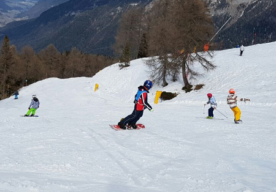
  
  
   
  
  
   
  
  
   relax in bianco e nero
   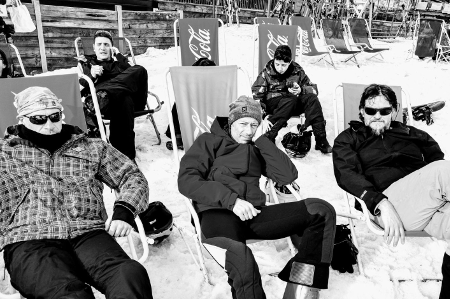
  
  
   Vita di albergo ... e gli immancabili compleanni (Caterina, Betta e quest'anno anche Simona! )
  
  
   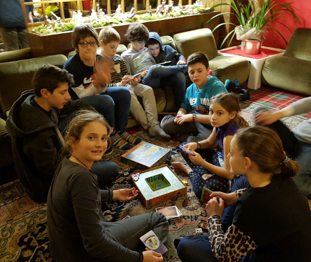
  
  
   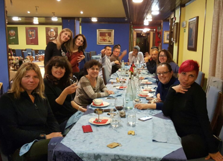
  
  
   
  
  
   e le premiazioni a fine gara
  
  
   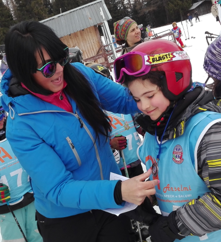
  
  
   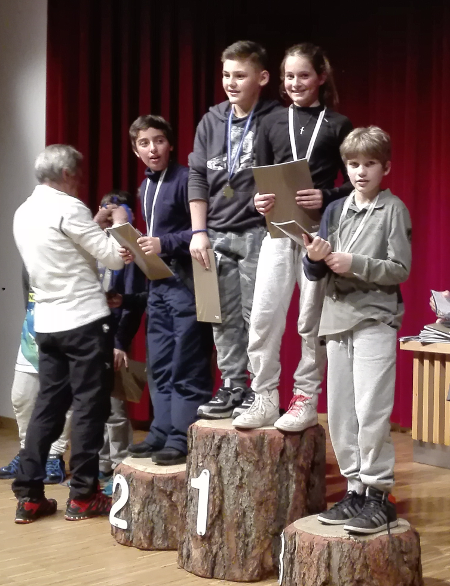
  
  
   
  
  
   Arriveduar
  
  
   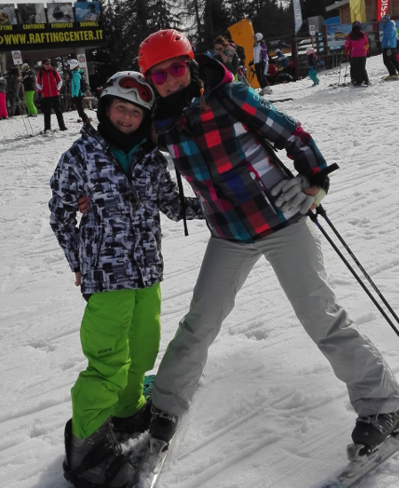
  
 

## Compleanni
*02-04-2017*

 
  
   Festeggiamo i compleanni di M (1 arile)
  
  
   , P (27 marzo)
  
  
   e il pezzo da 50 di Lorenzo (24 marzo)
  
  
   !!!
  
  
   
  
  
   un bel BBQ in giardino con gli amici
  
  
   
  
  
   
  
  
   
  
  
   
  
  
   e lo "scambio" di regali :)
  
  
   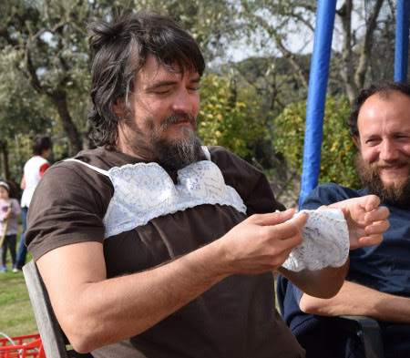
  
  
   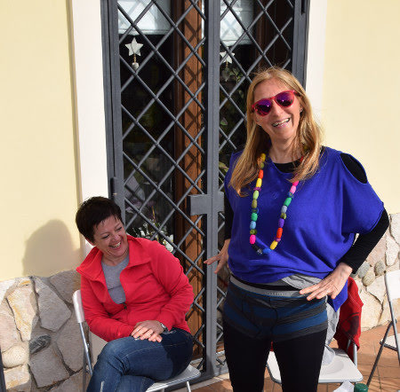
  
 

## Roma fun run
*03-04-2017*

 
  
   Appuntamento a via dei fori imperiali e poi partenza per la maratona stracittadina di 5Km....
  
  
   
  
  
   tutta sotto la pioggia ....
   
  
  
   grandi i ragazzi che non si sono mai fermati insieme a Federica e Andrea !!!! (mamma e meggy hanno barato un pochino)
  
  
   [video width="1920" height="1088" mp4="{{baseurl}}/uploads/2017/05/VID_20170402_092218.mp4"][/video]
  
 

## 429 anni
*10-04-2017*

 
  
   Festeggiamo tutti insieme i nostri 429 anni (Mario, Erino, Caterina, Betta, Andrea, Carlotta, Gianni, Franca)
  
  
   !!
  
  
   
  
  
   
  
  
   
  
  
   
  
  
   
  
 

## Pasqua in liguria
*17-04-2017*

 
  
   Paese in fiore per festeggiare la pasqua
  
  
   
  
  
   
  
  
   
  
  
   Le bimbe ritrovano i loro amici e giocano ore e ore alla fontana
  
  
   
  
  
   Il giorno di pasqua facciamo un bel pranzo tra gli ulivi insieme alla famiglia di Silvano. Tenete il cancello chiuso che scappa Silvano .... soprattutto perchè festeggiamo anche il suo compleanno (ma non si deve dire!)
  
  
   ... hhihihihih
  
  
   
  
  
   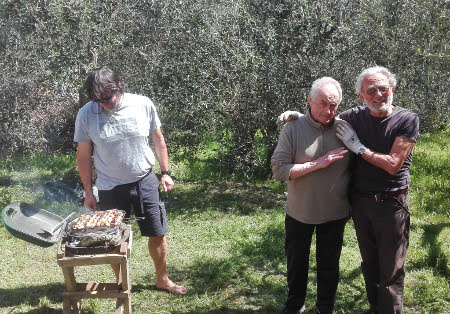
  
  
   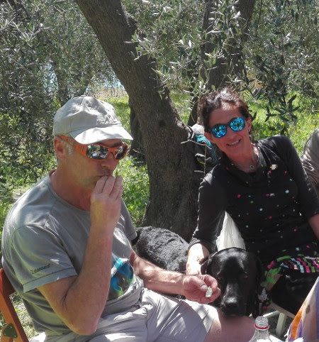
  
  
   Pasquetta al mare ... non poteva mancare il primo bagno dell'anno!
  
  
   
  
 

## Ponti di aprile
*02-05-2017*

 
  
   Riprendiamo Ronzinante dopo il lungo inverno alla volta della frasca. Al nostro gruppetto si aggiungono anche Gianni, Sharon e Stella camperisti freschi freschi.... ma abitudinari della zona! Tre giorni di vento forte ... ma sbraciolate continue nella pinetina!
  
  
   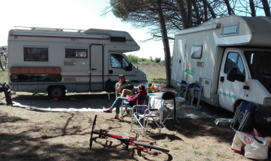
  
  
   
  
  
   
  
  
   Andiamo a pranzo in uno stabilimento sulla spiaggia e le bimbe hanno anche il coraggio di farsi il bagno ... brrrrrr
  
  
   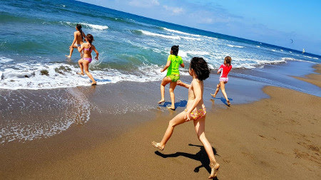
  
  
   
  
  
   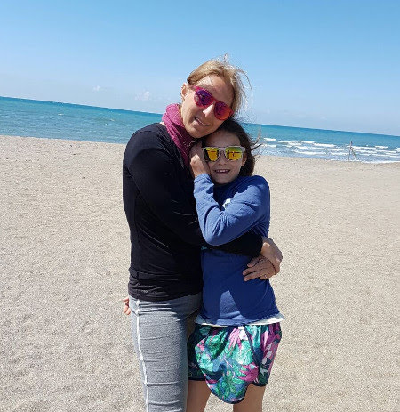
  
  
   Il ponte del 1 maggio invece andiamo tutti a Santa Severa e facciamo il battesimo della barchetta! Si monta ..
  
  
   
  
  
   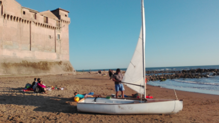
  
  
   
  
  
   si mette in acqua ..
   
  
  
   e poi via a gonfie vele ...
  
  
   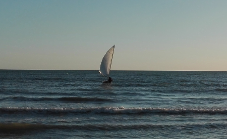
  
  
   
  
  
   noi invece il tramonto ce lo godiamo dalla spiaggia!
  
  
   
  
  
   La domenica ci raggiungono Marie&amp;family, Ioannis&amp;family ed Enrico&amp;Sophie. Bella giornata sulla spiaggia nera con bagno e vele al vento!
  
  
   
  
 

## 40 anni di zia Giorgia!
*12-05-2017*

 
  
   Zia ci fa una sorpresa e viene a Roma per festeggiare i suoi 40 anni!
  
  
   Con mamma e nonna vanno a vedere lo spettacolo AmaLuna del Cirque du Soleil.
  
  
   
  
  
   Poi tutti a Bomarzo a visitare il sacro bosco, anche detto parco dei mostri. Il ciccio non può entrare e così lui e nonno se ne vanno a spasso per il paese, mentre noi femmine ci addentriamo nel fitto bosco in cui sono immerse queste mostruose creature di pietra .. Ercole e Caco
  
  
   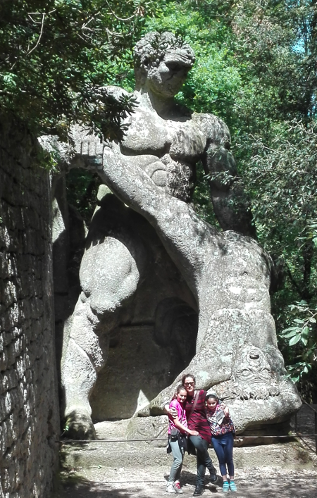
  
  
   enormi e spaventosi pescioni
   
  
  
   la casa pendente
   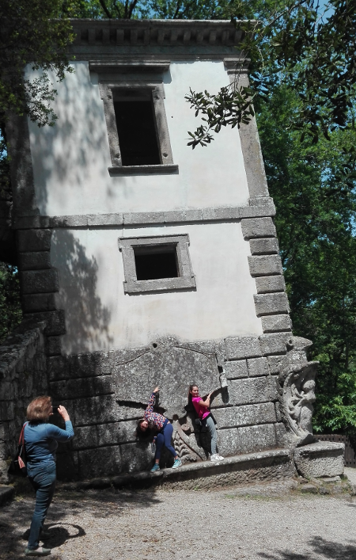
  
  
   l'orco
   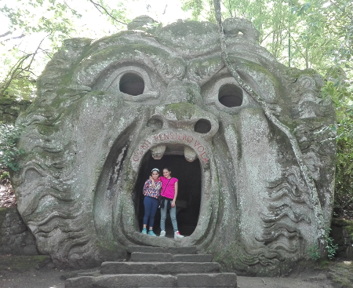
  
  
   e infine la piazza delle pigne
  
  
   
  
  
   Andiamo a pranzo al Centro Botanico Moutan, posto incantevole e fuori dal mondo, immerso nel profumo delle peonie
  
  
   
  
  
   
  
  
   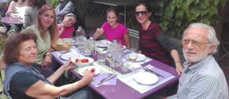
  
  
   
  
  
   E infine a casa in campagna, dove il sole regala a zia uno splendido tramonto
  
  
   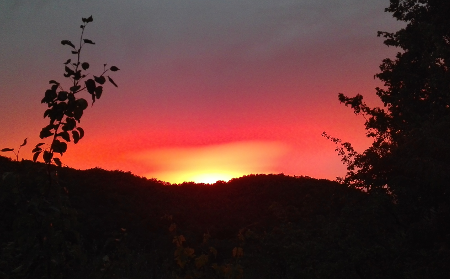
  
  
   AUGURI :)
  
  
   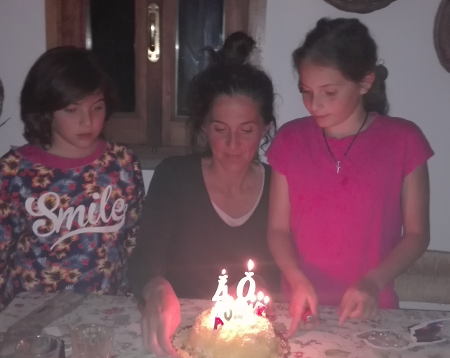
  
 

## Festa della mamma
*15-05-2017*

 
  
   Chissà perchè i fiori più belli sbocciano proprio per questa festa ....
  
  
   
  
  
   
  
  
   
  
  
   . . . forse per rendere omaggio, nel modo più semplice, alle nostre meravigliose mamme!
  
  
   
  
  
   
  
 

## Saggi di motoria
*20-05-2017*

 
  
   La classe di Margherita si cimenta in un percorso difficilissimo ....
  
  
   [video width="1920" height="1088" mp4="{{baseurl}}/uploads/2017/05/marghe_motoria.mp4"][/video]
  
  
   che bravi! Soprattutto la maestra Alessandra :D:D
  
  
   
  
  
   Mentre la classe di Matilde in un terneo di palla avvelenata tra QUINTE ....
  
  
   
  
  
   che grinta
  
  
   [video width="1920" height="1088" mp4="{{baseurl}}/uploads/2017/05/palla_avvelenata_2.mp4"][/video]
  
  
   ... e con l'aiuto del caloroso tifo della VD . . . si qualificano primi!!!
  
  
   
  
 

## Il flauto magico di Mozart
*23-05-2017*

 
  
   Anche quest'anno, per la 5 volta, partecipiamo al progetto Europa Incanto imparando tutte le arie del Flauto magico di Mozart!
  
  
   
  
  
   Quest'anno impersoniamo Papageno, l'uccellatore ricoperto di piume.Questo il mio vestito! Le piume le ho incollate tutte io con la colla a caldo e M le ha cucite sulla maglietta e il cerchietto.
  
  
   
  
  
   Davanti al teatro Argentina, tutti insieme eravamo un tripudio di colori!
  
  
   
  
  
   Abbiamo cantato e spiumato tutto il teatro! :)
  
  
   
  
  
   
  
  
   e poi, come da tradizione, passeggiata in centro bambini e genitori!
  
  
   [video width="1920" height="1088" mp4="{{baseurl}}/uploads/2017/05/argentina_walk.mp4"][/video]
  
  
   
  
  
   
  
 

## Campo scuola!
*27-05-2017*

 
  
   Finalmente in 5 elementare ci portano al campo scuola! Gita di tre giorni in Campania.
  
  
   Siamo tre classi, partenza la mattina presto ... noi femmine siamo sempre le più organizzate!
  
  
   
  
  
   
  
  
   Sull'autobus .... partiti ... tra le lacrime dei genitori (non M&amp;P che sanno che mi divertirò tantissimo e sono contenti per me....Marghe un pò meno)
  
  
   .
  
  
   
  
  
   Eccoci tutti insieme ... la mitica 5A
  
  
   
  
  
   femminucce
  
  
   
  
  
   e maschietti ... è venuto anche Danielino ... che esperienza fantastica! Grazie maestra Rosita
  
  
   
  
  
   Prima fermata la reggia di Caserta! La maestra Giovanna dice che siamo stati bravissimi! E poi alla solfatara
  
  
   
  
  
   
  
  
   
  
  
   Infine in albergo, dove, dopo un piccolo relax ceniamo, festeggiamo il compleanno di Valerio
  
  
   
  
  
   e poi in discoteca a ballare!!
  
  
   La mattina dopo visita ad Ercolano, pranzo con la "vera" pizza napoletana
  
  
   
  
  
   e passeggiata per Napoli.
  
  
   La mattina dopo tutti pronti per fare colazione insieme ... un pò addormentati e forse anche tristi perchè è l'ultimo giorno!
  
  
   
  
  
   Visita al Planetario e alla città della scienza
  
  
   
  
  
   
  
  
   Rientro a Roma alle 22.....siamo distrutti ma felici della bellissima avventura!
  
  
   Grazie maestre!
  
  
   
  
 

## Campo scuola!
*27-05-2017*

 
  
   Finalmente in 5 elementare ci portano al campo scuola! Gita di tre giorni in Campania.
  
  
   Siamo tre classi, partenza la mattina presto ... noi femmine siamo sempre le più organizzate!
  
  
   
  
  
   
  
  
   Sull'autobus .... partiti ... tra le lacrime dei genitori (non M&amp;P che sanno che mi divertirò tantissimo e sono contenti per me....Marghe un pò meno)
  
  
   .
  
  
   
  
  
   Eccoci tutti insieme ... la mitica 5A
  
  
   
  
  
   femminucce
  
  
   
  
  
   e maschietti ... è venuto anche Danielino ... che esperienza fantastica! Grazie maestra Rosita
  
  
   
  
  
   Prima fermata la reggia di Caserta! La maestra Giovanna dice che siamo stati bravissimi! E poi alla solfatara
  
  
   
  
  
   
  
  
   
  
  
   Infine in albergo, dove, dopo un piccolo relax ceniamo, festeggiamo il compleanno di Valerio
  
  
   
  
  
   e poi in discoteca a ballare!!
  
  
   La mattina dopo visita ad Ercolano, pranzo con la "vera" pizza napoletana
  
  
   
  
  
   e passeggiata per Napoli.
  
  
   La mattina dopo tutti pronti per fare colazione insieme ... un pò addormentati e forse anche tristi perchè è l'ultimo giorno!
  
  
   
  
  
   Visita al Planetario e alla città della scienza
  
  
   
  
  
   
  
  
   Rientro a Roma alle 22.....siamo distrutti ma felici della bellissima avventura!
  
  
   Grazie maestre!
  
  
   
  
 

## La 5 malattia
*03-06-2017*

 
  
   Tanto ha girato a scuola che alla fine sia Mati che mamma se la sono presa :(
  
 

## Ponte del 2 giugno alla frasca
*04-06-2017*

 
  
   Questo we lungo si va alla frasca. Arriviamo a notte fonda, dopo la festa di zio Marco e cerchiamo l'accampamento a tre camper dei nostri "nuovi" amici....li troviamo e ci aggiungiamo alla C nottetempo....speriamo siano loro!!! La mattina ci svegliamo e man mano arrivano altri amici, siamo 5 ....
  
  
   
  
  
   no 6, no 7 .... alla fine 9 camper! C'è mezzo quartiere qui alla frasca!!! Che figata!
  
  
   
  
  
   Tre giorni all'insegna di lunghi bagni con snorkeling (abbiamo trovato una roba viscida e trasparente non ben definita....sarà una mutazione dovuta alla centrale elettrica??)
  
  
   giri con le canoe
  
  
   
  
  
   
  
  
   e qui i papà ci hanno sfidati con il loro "scatamarrano" improbabile... mezzo canoa e mezzo uomo a mare .... sono unici!!!
  
  
   
  
  
   Ma a fine giornata, al tramonto, questo posto è impagabile
  
  
   
  
  
   soprattutto se i papà armeggiano al bbq!
  
  
   
  
  
   
  
  
   e noi mangiamo :)
  
  
   
  
  
   
  
  
   La sera si gioca fino a che fa buio
  
  
   
  
  
   e poi andiamo a caccia di lucciole (liberandole dopo ovviamente!)
  
  
   .
  
  
   Insomma un bellissimo we con tanti nuovi e vecchi amici!
  
 

## Recite e gite della 3B
*08-06-2017*

 
  
   Gita al castello di Bracciano
  
  
   
  
  
   
  
  
   poi saggio di musica con i metallofoni
  
  
   
  
  
   e infine qualche bella canzone cantata con il linguaggio dei segni, la LIS. Questo è l'applauso.
  
  
   
  
  
   E poi tutti in palestra a vedere i nostri lavoretti del progetto delle emozioni. Abbiamo un murales tutto nostro
  
  
   
  
  
   con le di maschere di Elmer
  
  
   
  
  
   i disegni in cui abbiamo espresso la nostra diversità
  
  
   
  
  
   e il "barattolo delle emozioni": 50% allegria, 20% tenerezza, 10% amore, 10% tristezza, 5% paura e 5% rabbia! Mi rispecchia???
  
  
   
  
 

## Fine della 5 elementare!
*09-06-2017*

 
  
   La nostra classe ha organzzato una bellissima recita di fine anno molto emozionante, mancava poco che la palestra si allagasse per le lacrime delle mamme!!! Però in effetti siamo stati proprio bravi, tra dialoghi, canzoni, LIS, balli, strappo del grembiule e magliette handmade .... davvero originale!
  
  
   
  
  
   Poi insieme alle altre classi abbiamo cantato le canzoni (a rischio insolazione)
  
  
   
  
  
   ed esposto i nostri lavori del progetto delle emozioni .... l'amore
  
  
   
  
  
   e la rabbia
   
  
  
   L'ultimo giorno di scuola abbiamo anche piantato un albero di melograno, per augurare tanta fortuna ai bambini che, dopo di noi, trascorreranno 5 anni in questa scuola
  
  
   
  
  
   E poi si esceeeeee ......... per l'ultima volta!
  
  
   
  
  
   e lanciamo i palloncini con i nostri nomi!
  
  
   [video width="1920" height="1080" mp4="{{baseurl}}/uploads/2017/06/balloons.mp4"][/video]
  
  
   e adesso.....che guerra sia!!! Fucile carico e bustone di bombe d'acqua preparato da Ray e M (sono peggio di me!!)
  
  
   
  
  
   e si continua in Caffa fino alle 6!! Nessuna pietà per gli ascitti, bambini o genitori che siano!
   
  
 

## Partite!
*13-06-2017*

 
  
   Stamattina si parte con i nonni per andare da zia Giorgia e Morgan! Ciao M&amp;P fate i bravi!
  
  
   
  
 

## Pimpa&Quit
*17-06-2017*

 
  
   Black&amp;Wite
  
  
   
  
  
   Colors
  
  
   
  
 

## M&P in giro da soli
*19-06-2017*

 
  
   .... bhe non proprio soli, con Vale&amp;Vale! Partenza venerdì sera e tappa per cena a Celano, troviamo un posto delizioso, la "Locanda Madonna delle Vigne" . Ottima cena!
  
  
   La mattina si riparte diretti sulla costa adriatica. Colazione in piazza a Rocca S.Giovanni, con il pitale di te freddo :)
  
  
   
  
  
   passeggiata per il paesino
   
  
  
   e poi ci affacciamo sulla bellissima costa dei trabocchi
  
  
   
  
  
   Passeggiata in acqua
  
  
   
  
  
   bagno (!!!)
  
  
   e poi a pranzo al trabocco di Punta Punciosa.
  
  
   Arriviamo presto e per più di un'oretta è tutto per noi, ombra, venticello teso, rumore del mare, tante chiacchere e buon vino...che meraviglia!
  
  
   
  
  
   Il pranzo è ottimo e abbondante, pienamente soddisfatti, nonostante la confraternita (dei magnoni)
  
  
   che declamava poesie e inni.
  
  
   
  
  
   Ultimo tuffo (non dal trabocco)
  
  
   e poi andiamo a Punta Aderci, un promontorio stupendo da cui ci godiamo il tramonto sul mare .... peccato che nel frattempo ci hanno aperto i camper scassinando le serrature e che a V&amp;V hanno rubato i portafogli :(
   
  
  
   
  
  
   
  
  
   Serata a Vasto. Dormiamo in paese per poter andare dai carabinieri la mattina dopo. Insomma decidiamo di non rovinarci questo bellissimo we e così torniamo nella riserva naturale di punta Aderci, che di giorno e con un bel ventone è ancora più suggestiva! Facciamo un bel tratto in bici, lungo la vecchia ferrovia, che porta fino a Casalbordino
  
  
   
  
  
   
  
  
   
  
  
   E poi al mare a rilassarci!
  
  
   
  
  
   Giornata bellissima che concludiamo con una cenetta nella fresca Sulmona.
  
  
   Arriveduar
  
  
   
  
 

## Che belle pagelle!!!
*22-06-2017*

 
  
   Brave bimbe, che belle pagelle!
  
  
   
  
  
   
  
 

## Fuga da zia Giorgia
*27-06-2017*

 
  
   Finita la scuola e subito scappiamo da zia Giorgia! Qui i nostri amici ci aspettano per giocare al lavatoio
  
  
   
  
  
   fare qualche partita alla wii quando fa troppo caldo
  
  
   
  
  
   e darsi una rinfrescata in piscina sotto lo sguardo attento di cani e gatti :)
  
  
   
  
  
   Poi ci viene a trovare per qualche giorno la piccola Meg con mamma Francesca e papà Federico. Ce la portiamo ovunque, una piccola mascotte, anche a fare belle passeggiate nel bosco!
  
  
   
  
  
   
  
  
   
  
  
   Le due Margherite sono troppo carine!
  
  
   
  
 

## Ponte del 29 giugno + incidente :(
*03-07-2017*

 
  
   M&amp;P arrivano da Roma insieme a Paolet e Flavio. La mattina del 29 mentre siamo nel parcheggio Morgan viene aggredito da Joy che era libero e la paladina Mati per provare a difendere il suo cane si becca un bel morso con lacerazione sull'avambraccio :(
  
  
   Corsa al pronto soccorso e una lunga fila di punti di sutura (più di 20 dice il chirurgo plastico)
  
  
   . Tra M che sviene e P che sembra un cadavere, la più serena e forte è prorio Mati! Sei una roccia amore mio!
  
  
   
  
  
   Flavio e Meggy ti mandano questo dalla spiaggia
  
  
   
  
  
   Nonostante tutto ci siamo goduti questo bel ponte con passeggiate panoramiche
  
  
   
  
  
   
  
  
   
  
  
   una visita all'acquario con Flavio, Matteo, Andrea, Emma e Laura....
  
  
   
  
  
   
  
  
   
  
  
   e qui P ha scoperto il lavoro che vorrebbe fare da grande .. "il pulitore di lamantini" !!!
  
  
   
  
  
   Le cene sul terrazzo sono sempre bellissime!
  
  
   
  
  
   
  
  
   
  
 

## Auguri nonna Lilly
*17-07-2017*

 
  
   Per il compleanno di nonna siamo tutti insieme a Sassoferrato!
  
  
   
  
  
   
  
 

## Punti rimossi!
*18-07-2017*

 
  
   Finalmente dopo 18 giorni il chirurgo ha detto che sono guarita! Ho tolto tutti i punti e devo stare attenta a non prendere il sole.
  
  
   Adesso posso giocare con il mio pulcino Jack!
  
  
   
  
  
   
  
 

## Auguri Paolet
*19-07-2017*

 
  
   Un bel tramonto sul mare dedicato ad un'amica speciale!
  
  
   
  
 

## Sulle tracce dell'orso ....
*31-07-2017*

 
  
   Papone ha una bellissima idea, portarci sulle montagne abruzzesi nel parco nazionale a vedere l'orso marsicano. Partiamo con Caterina alla volta dell'Abruzzo.
  
  
   Prima tappa a Gioia dei Marsi con cena al Cantone!
  
  
   
  
  
   La mattina saliamo fino al paese abbandonato di Sperone (papà è assorto nei sui ricordi....qui venivano a fare delle feste-rave e a volare tanti anni fa con mamma)
  
  
   
  
  
   Bhè il panorama sulla piana del Fucino merita!
   
  
  
   Poi ci spostiamo a Pescasseroli. Qui ci attende una guida che ci porterà a fare un trekking alla ricerca dell'orso.
  
  
   
  
  
   Una lunga passeggiata fino alla vetta....fa anche freddino
   
  
  
   
  
  
   
  
  
   Peccato che l'orso non si è fatto vedere....ma in compenso ci è passato vicino vicino un enorme cervo!
  
  
   
  
  
   e il rientro in notturna...con le torce!
  
  
   
  
  
   Che giornata!
  
  
   Dopo tanta fatica ci andiamo a rilassare al lago di Barrea nel camping Colle Ciglio
  
  
   
  
  
   con tanto di canoa....e bagno!!
   
  
  
   
  
  
   La sera ci raggiungono le mamme con l'altro camper e ne approfittiamo per un buon BBQ!
  
  
   
  
  
   Il giorno dopo tutti a cavallo nella riserva della Camosciara.
  
  
   
  
  
   
  
  
   una bella passeggiata nella radura ...sembra far west!!
   
  
  
   
  
  
   e alla fine le cascate!
   
  
  
   La sera ci spostiamo in un'area sosto molto carina lungo la via Marsicana, "il vecchio mulino"..... e non può mancare l'arrosticino!!!
   
  
  
   Sulla via del rientro ci fermiamo a Veroli, dove hanno luogo i "fasti verolani", un festival di artisti di strada. Il centro della cittadina è chiuso e in ogni piazza ci sono artisti che presentano le loro attrazioni. Guidati dai padroni di casa Pierluigi, Tina e Francesca prima ci acculturiamo scoprendo la storia di Veroli, poi ci rifocilliamo in cima al vecchio convento
  
  
   
  
  
   e infine ci godiamo gli spettacoli delle marionette russe, degli acrobati africani, dei trampolieri ....e tanti altri! Che bella serata!
  
  
   
  
 

## Peloponneso tour
*30-08-2017*

 
  
   <strong>
    4/08
   </strong>
   : Si parte! Tappa intermedia a Casalbordino. Fa caldissimo....passiamo la giornata in acqua. La sera mini-sagra con arrosticini e pasta casareccia con il sugo di pecora.
  
  
   
  
  
   
  
  
   <strong>
    6/08
   </strong>
   : Si parte per Bari. Ci raggiungono Manu&amp;Gio&amp;Anna e Max&amp;Lu&amp;Ali.Traghetto la sera per Igoumenitsa
  
  
   
  
  
   <strong>
    7-8/08
   </strong>
   Arrivati in grecia il caldo non ci molla. Ci fermiamo a Lefkada, nella nostra spiaggetta preferita.
  
  
   
  
  
   Le bimbe pescano i ricci e la sera spaghettino niente male!
  
  
   
  
  
   <strong>
    9/08
   </strong>
   Ci spostiamo nella parte nord del Peloponneso sperando di poter fare il percorso in trenino a cremagliera tra Diakopto e Kalavryta...ma purtroppo nessun posto disponibile. Così lo facciamo con i camper e ci fermiamo a visitare la grotta dei Laghi, molto profonda e con delle stalattiti mai viste a forma di cavolfiore e di lenzuoli immacolati stesi al sole. La sera ci spostiamo nella bellissima cittadina di Nauplia, ex capitale della Grecia. Passeggiata per le stradine colorate e piene di vita e cena in un ottimo ristorantino di carne.
  
  
   
  
  
   <strong>
    10/08
   </strong>
   : Oggi la mitica Micene con la sua famosissima porta dei leoni
  
  
   
  
  
   la tomba di Atreo
   
  
  
   e la bellissima maschera di Agamennone
   
  
  
   <strong>
    11/08
   </strong>
   Epidauro, famosa per il suo teatro dall'acustica eccezionale, ma ancora più famoso nell'antichità per il tempo di Asclepio, Esculapio, dio della medicina, dove tutti venivano a farsi curare....un pò tipo la Lourdes di oggi!
  
  
   
  
  
   
  
  
   La sera ci spostiamo vicino Leonidio, guadando anche un fiume con i camper (inaffidabile Google maps)
  
  
   !
  
  
   <strong>
    12-13/08
   </strong>
   Sostiamo al camping Semeli, piccolino ma bello. Spiaggione di ciottoli e bar rilassante dove passare le ore calde giocando a tavlì. Poco distante a piedi il micro paesino di Plaka dove andiamo a cena nella taberna della signora Margherita che ci spaccia le sue origini italiane. Cena ottima con sardine, polpo, mussaka, tzatziki e saganaki! Il 13 arrivano anche Shaaron&amp;Gianni&amp;Stella! Siamo al completo!
  
  
   <strong>
    14-15/08
   </strong>
   Raggiungiamo Ioannis e Georgia vicino Tripoli, nella casa in campagna dei genitori. Che relax, che mangiate pazzesche con la fantastica cucina di Penelopì.
  
  
   
  
  
   i bambini stanno bene e si divertono
   
  
  
   
  
  
   e noi ci sentiamo davvero in famiglia
   
  
  
   La sera andiamo alla festa che raccoglie mezza arcadia... il panigiri, la festa della vergine Maria .... tra il sacro e il profano
  
  
   
  
  
   
  
  
   Qui hanno questo gusto di mischiare le cose...
  
  
   
  
  
   
  
  
   <strong>
    16-17/08
   </strong>
   Raggiungiamo gli altri camperisti sull'isola di Elafonisson. Il campeggio è affollatissimo e sporco, ma la spiaggia è forse davvero la più bella del mediterraneo
   
  
  
   
  
  
   
  
  
   un mare cristallino, una piscina praticamente
  
  
   
  
  
   
  
  
   
  
  
   
  
  
   
  
  
   Ci fermiamo a dormire su una spiaggia dietro il paesino di Archangelos (tipo frasca!)
  
  
   .
  
  
   <strong>
    18/08
   </strong>
   Ci spostiamo a Gityo per spesa al mercato del paese e poi bagno nella spiaggia con il relitto della nave Dimitrios
  
  
   
  
  
   Arriviamo e invadiamo una caletta piccola e popolata solo da locali con un piccolissimo porticciolo. C'è chi pesca, chi mette a mollo la nassa, chi fa i tuffi dagli scogli. Dormiamo qui.
  
  
   <strong>
    19/08
   </strong>
   Allarme pidocchi! Passiamo da Aeropoli per comprare lo shampoo e ci fermiamo a Stoupa al campeggio Kalogria. Il paesino è molto turistico ma carino. Spidocchiamento e bbq serale con il pesce (?)
  
  
   comprato al porticciolo ieri.
  
  
   <strong>
    20/08
   </strong>
   Stamattina ci separiamo, gli architetti (perdonami Giò)
  
  
   scendono lungo la penisola del Mani e noi proseguiamo verso Kalamata, superando questa parte di costa iper turistica. cerchiamo di fermarci a Koroni ma non troviamo parcheggio e dirottiamo per una spiaggiona poco distante da Foinikounta. Bagno rilassante, wind surf e poi campeggio Thines, spartano, nella sabbia.
  
  
   <strong>
    21/08
   </strong>
   Relax al mare del campeggio e in serata ci spostiamo a Methoni. Qui, al tramonto, rimaniamo affascinati da un castello ed una fortezza veneziana stupendi.
  
  
   
  
  
   La sera cena in un posto consigliato dalla guida, la taberna Kalimataria, dove sotto un pergolato di uva non ti portano il menù ma vai direttamente in cucina a scegliere cosa mangiare! Abbuffatta clamorosa! Poi relax sui lettini sulla spiaggia. Dormiamo in paese.
  
  
   <strong>
    22/08
   </strong>
   Colazione nella piazzetta e appena apre entriamo a visitare la fortezza. E' un posto magico. Potrei mettere centinaia di foto!!!
  
  
   
  
  
   
  
  
   
  
  
   
  
  
   
  
  
   Ci spostiamo nella bellissima Voidokilia, la spiaggia a forma di omega con le fortezze su entrambe le punte. Mare mosso e onde divertentissime! Ci raggiungono anche gli amici greci.
  
  
   
  
  
   La sera il parcheggione si svuota e dormiamo qui, con la laguna alle spalle e gli aironi e i fenicotteri che volano al tramonto.
  
  
   
  
  
   <strong>
    23/08
   </strong>
   Visitiamo il paesino di Pylos famoso perchè nel 1827, nel suo enorme golfo, ci fu la battaglia di Navarino che diede ai greci l'indipendenza dai turchi! La fortezza ospita un piccolo museo di archeologia subacquea, molto interessante, e una sala con la proiezione su dei multischermi della battaglia! La vista sul golfo è spettacolare!
  
  
   
  
  
   Pomeriggio relax nuovamente nello spiaggione di Voidokilia, con tanto di vulcano fumante!
  
  
   
  
  
   <strong>
    24/08
   </strong>
   Ci spostiamo verso l'interno, nella verdissima e montuosa Arcadia. Primo paesino da visitare è Karytaina. Prima di arrampicarci fino al castello diroccato facciamo un'abbondante colazione
  
  
   
  
  
   e poi la salita.....
   
  
  
   fino a conquistare la cima!
   
  
  
   Dopo questa salita ci vuole un buon pranzo!
  
  
   Proviamo a raggiungere le gole di Lousios per un bagnetto rinfrescante ma dopo una decina di Km in montagna Maps ci porta su uno sterrato in discesa che termina con un ponticello sul fiume chiuso da grossi massi ! Panic! Solo l'abilità e la pazienza dei papà riesce a tirarci fuori da lì!
  
  
   Torniamo indietro e ci fermiamo a Stemnitsa. In una piccola piazzetta troviamo una taberna fantastica, piena di gente alle 3 del pomeriggio.....come dargli torto....la carne è ottima!
  
  
   
  
  
   
  
  
   e infine serata a passeggio per Dimitsana
  
  
   
  
  
   
  
  
   <strong>
    25/08
   </strong>
   Ci avventuriamo, stavolta a piedi, lungo il Menalon Trail, un percorso naturalistico che scende dal paese di Stemnitsa fino alla gola di Lousios, per risalire fino a Dimitsana. La passeggiata, all'inizio tranquilla
  
  
   
  
  
   si rivela essere molto più lunga del previsto e piuttosto impegnativa. La prima tappa è la minuscola chiesetta di San Nikolaos, dal cui terrazzino c'è una vista pazzesca su tutta la vallata. Siamo altissimi!
  
  
   
  
  
   Poi si scende fino al Prodromos Monastery, una struttura pazzesca costruita sulla roccia, ancora oggi abitato.
  
  
   
  
  
   
  
  
   Qui Shaaron ci lascia! Noi proseguiamo fino al fiume, dove ci scappa un tuffetto nell'acqua gelida!
  
  
   
  
  
   Seconda tappa il vecchio monastero della filosofia....e giusto quello potevano fare qui....lontani da tutto e da tutti!!!! Anche questa costruzione è particolarissima, a poco più di un paio di metri dalla parete rocciosa
  
  
   
  
  
   
  
  
   Le bimbe sono state bravissime ma adesso sono esauste....sono solo 5 ore che camminiamo!! Ci fermiamo al nuovo monastero, dove un prete ortodosso ci offre acqua e biscotti e soprattutto ci chiama un taxi per tornare a Dimitsana! Solo Andrea se la fa a piedi!
  
  
   Ci vediamo con gli amici greci al museo all'aperto del "water power" dove hanno riscostruito alcuni dei vecchi mestieri che sfruttavano la forza dell'acqua e l'ingegno dell'uomo. Qui c'è la prima lavatrice, un enorme catino di legno in cui l'acqua arrivava velocissima convogliata da un tubo ed imprimeva il movimento rotatorio ai panni! Fantastico!
  
  
   
  
  
   
  
  
   C'è la lavorazione delle pelli, la macina, la produzione di polvere da sparo! Qui ci vediamo con Georgia e Ioannis e i bimbi per una bella cena a Dimitsana.
  
  
   <strong>
    26/08
   </strong>
   Olimpia. Oggi ci rivediamo con il gruppo dei camperisti e visitiamo il museo archeologico e lo scavo. Le bimbe corrono sulla pista dei 120m!
  
  
   
  
  
   
  
  
   una premio anche per loro
  
  
   
  
  
   
  
  
   E poi ultimo bagno a Lefkada e ritono a casa! Ariveduar
  
  
   
  
 

## Auguri Matilde
*08-09-2017*

 
  
   I festeggiamenti iniziano la sera del 6! Un pò di amiche a cena ... lume di candela e hamburger...
  
  
   
  
  
   l'immancabile "dab"
  
  
   
  
  
   e dopo aver giocato un pò ... un divertente filmetto comico ("Scusate se esisto")
  
  
   ... e poi chiacchere fino a notte fonda...
   
  
  
   La mattina tutti in piscina ... praticamente una festa privata perchè ci siamo solo noi!!!
   
  
  
   
  
  
   break per pranzo!
   
  
  
   e prima di andare via un bel tuffo a "cannellone"!! :D
  
  
   [video width="1280" height="720" mp4="{{baseurl}}/uploads/2017/09/cannellone.mp4"][/video]
  
  
   Poi a casa ad aspettare altri amici. Il terrazzo si trasforma in un centro estivo con biliardino, skate, trampolino e ping-pong!!!
  
  
   
  
  
   Una pausa salutare con tanta frutta...
   
  
  
   e infine la torta!
  
  
   
  
  
   
  
  
   Grazie a tutti gli amici che hanno contribuito a rendere questa giornata bellissima!
  
  
   
  
 

## La 1 media!
*15-09-2017*

 
  
   Sveglia prestissimo con lo stomaco che brontola....che sarà... forse emozione!
  
  
   Accompagnamo Marghe a scuola, oggi è il suo primo giorno di 4 elementare!
  
  
   
  
  
   e poi nella mia nuova scuola. Aspettiamo la lettura delle classi.
  
  
   
  
  
   Mi scappa una lacrima quando realizzo che nessuna delle mie amiche sarà in classe con me....ma alla fine va bene così...farò nuove amicizie! E imparerò a suonare il violino!
  
  
   In bocca al lupo a tutte!
  
 

## La 1 media!
*15-09-2017*

 
  
   Sveglia prestissimo con lo stomaco che brontola....che sarà... forse emozione!
  
  
   Accompagnamo Marghe a scuola, oggi è il suo primo giorno di 4 elementare!
  
  
   
  
  
   e poi nella mia nuova scuola. Aspettiamo la lettura delle classi.
  
  
   
  
  
   Mi scappa una lacrima quando realizzo che nessuna delle mie amiche sarà in classe con me....ma alla fine va bene così...farò nuove amicizie! E imparerò a suonare il violino!
  
  
   In bocca al lupo a tutte!
  
 

## VALE&VALE
*17-09-2017*

 
  
   Partenza venerdì sera con i camper alla volta del campeggio di Capalbio. Bella braciolata tra amici. La notte tanto vento e la mattina alle 8 pioggia e tromba d'aria
  
  
   
  
  
   Poi, come per miracolo, esce il primo raggio di sole....questo matrimonio s'ha da fare!!!! Tutti diamo una mano.... altare pronto
  
  
   
  
  
   location pronta
  
  
   
  
  
   catering ... quasi pronto
  
  
   
  
  
   damigelle prontissime!!!
  
  
   
  
  
   Tutti a cambiarci.... noi siamo bellissimi...metà eleganti ... metà look da spiaggia
  
  
   
  
  
   e pronti ad accogliere lo sposo, che ballando a ritmo di musica arriva insieme a Caterina
  
  
   
  
  
   e poi la sposa stupenda ed emozionatissima insieme a Sebastiano sulle note della marcia nuziale suonata da Caterina al violino
  
  
   
  
  
   Il sindaco di Tor Fiscale celebra le nozze, emozianato al punto di bloccarsi e poi scoppiare a ridere....grande Marci! Poi le promesse, il rito della sabbia e le dediche degli amici
  
  
   
  
  
   e finalmente lo sposo può baciare la sposa!!!!
  
  
   
  
  
   Ragazzi..... che la vita vi conservi così, allegri, spensierati, incasinati!!!! Siete meravigliosi!
Asciugate le lacrime la giornata prosegue a suon di gnocco fritto e tigelle, di buffe foto polaroid
  
  
   
  
  
   di bagno in mare e ruba bandiera sulla siaggia
  
  
   
  
  
   di dolcetti in barattolo con i Vales sopra!
  
  
   
  
  
   
  
  
   di vasche idromassaggio e pigiama party nelle roulottine....insomma tutto divertentissimo.
  
  
   La domenica ci fermiamo ancora in campeggio. Giornata di sole con bagni e partita a beach volley....chi perde fa la brace!!!
  
  
   Un we stupendo! Grazie a tutti!
  
  
   
  
 

## Auguri Meggy
*24-09-2017*

 
  
   Per il compleanno di Meggy iniziamo con una sorpresa....zia Giorgia a Roma!
  
  
   
  
  
   poi una bella festa a casa con tutti i miei amici
  
  
   
  
  
   con tanti regali, tra cui un serpentone gigante dentro una scatola piena di palloncini con delle bellissime dediche
  
  
   
  
  
   e i draghi della lego.
  
  
   Dopo la festa un pò di amichette si fermano a dormire....siamo 11....anzi 12 (trova l'intruso)
  
  
   . Un bel film e poi tutti sui materassini a chiaccherare fino a notte fonda!
  
  
   
  
  
   
  
  
   
  
 

## Novità
*03-10-2017*

 
  
   Mi sono fatta i buchi alle orecchie, senza fare nemmeno un fiato! E poi nuovo taglio! Come sto? (a parte la faccia da fessacchiona)
  
  
   
  
 

## Festa dell'Autunno
*07-10-2017*

 
  
   Camperata autunnale ad Abbadia san Salvatore.
  
  
   Passeggiata in paese con le contrade addobbate a festa
  
  
   
  
  
   
  
  
   e poi visita all'abbazia, con una bellissima cripta
   
  
  
   
  
  
   
  
  
   Poi pranzo ai camper ... con vista sul campo da calcio!
  
  
   
  
  
   La sera passeggiata alla sagra con cena tipica e caldarroste....e giro ai "calci in culo"! Che freddo!!!
  
  
   La mattina dopo visita guidata alle miniere di mercurio
  
  
   
  
  
   
  
  
   
  
  
   ciao ciao
  
  
   
  
 

## Raccolta olive 2017
*30-10-2017*

 
  
   Mati e mamma sfruttano il bel we di sole per raccogliere le olive. Sabato ci vengono ad aiutare anche Carolina e Massimo e nonna Lilly da il meglio di se cucinando delle cose buonissime, la zuppa di ceci e castagne, la parmigiana della mamma di Aldo, una frittatona di patate degna della nonna Maria....gnam!
  
  
   
  
  
   
  
  
   
  
  
   Alla fine 280Kg di olive e 40l di olio! Niente male!
  
 

## Meggy loves Judo
*30-10-2017*

 
  
   Quest'anno ho deciso di fare Judo! E mi piace tantissimo!
  
  
   
  
  
   Nel we ho fatto anche uno stage di tre giorni con una squadra di corsi....chissà se a maggio andrò in Corsica a trovarli....
  
  
   
  
 

## Halloween
*01-11-2017*

 
  
   Quest'anno due feste a tema....Maggy è un vampiro/teschio
  
  
   
  
  
   e la sua classe è "terrificanteeeee"
  
  
   
  
  
   mentre Mati è la cattivissima Harley Qinn
  
  
   
  
  
   e insieme all'inquietante IT (Cate)
  
  
   fanno davvero paura!!! (ehi ma non dovete ridere!)
  
  
   
  
 

## E' arrivatooooo
*05-11-2017*

 
  
   finalmente il nostro i'cookin :)
  
  
   
  
  
   Maggy si mette subito all'opera....prima cosa una bella cioccolata calda!
   
  
  
   
  
 

## Corsa campestre
*10-11-2017*

 
  
   Grande Mati che arriva seconda alla corsa campestre categoria "ragazze"
  
  
   
  
  
   e bravissimo Flavio che arriva 1 nella categoria "cadetti".
  
 

## We a Todi
*13-11-2017*

 
  
   A sorpresa Laura si libera dal suo giornale e ci ospita tutti a Todi!
  
  
   Siamo un bel gruppone della classe di Meggy!!
  
  
   Noi andiamo con Ronzinante e arriviamo presto....dai sbrigatevi che il fuoco è già acceso e si duella con le cibarie
  
  
   
  
  
   Pranzo con una leggerissima amatriciana fatta da Marco (ma perchè fai ancora l'avvocato?)
  
  
   
  
  
   e poi passeggiata per questa meravigliosa cittadina.
  
  
   Bimbi a zonzo
  
  
   
  
  
   e genitori
   
  
  
   
  
  
   La sera col freddo ci rintaniamo in casa e tra braciole e bruschette e un fiume di vino la serata passa in un baleno! I bimbi giocano e noi grazie a Iannis4DJ balliamo come matti! Poi a mezzanotte....che non te la fai una partita a Trivial maschi contro femmine? E nonostante i disturbatori (vedi Fabrizio)
  
  
   e l'elevato tasso alcolico ... le femmine vincono!!!
  
  
   Poi tutti a dormire ... un accampamento colorato e divertente. Noi torniamo al camper sbagliando più volte strada....saremo mica ubriachi??
  
  
   La mattina dopo colazione nella piazza del duomo finalmente libera dalle bancarelle di San Martino, in un bel bar con i tavolini di Domiziani....come essere a casa!
  
  
   
  
  
   Passeggiata tutti insieme nei giardini lungo le mura con una vista mozzafiato sulle montagne intorno ... e a sorpresa ... shopping tudertino!
  
  
   
  
  
   Grazie a tutti per il bellissimo we!
  
 

## DEEJAY TEN - per noi FIVE
*20-11-2017*

 
  
   Oggi il centro di Roma è chiuso per questa manifestazione podistica, la DJ 10, dieci Km di corsa per le vie del centro. Noi che siamo poco competitivi, ci facciamo la stracittadina da 5Km, che parte da circo massimo e attraversa i posti più belli: tempio di vesta, piazza venezia, via dei fori imperiali, colosseo.
  
  
   Pronti alla partenza....tutti con le magliette "corallo"
  
  
   
  
  
   
  
  
   C'è chi la fa veramente di corsa....grandissime Mati e Meggy
   
  
  
   e chi si fa la passeggiata con pausa cappuccino e cornetto all'info point
  
  
   
  
  
   Ma alla fine all'arrivo ci ritroviamo tutti....pure con le medaglie!
  
  
   
  
 

## Vigilia di Natale da Cicetta
*26-12-2017*

 
  
   Come da tradizione....
  
  
   
  
  
   
  
  
   
  
  
   
  
  
   
  
  
   
  
  
   e quest'anno per la prima volta siamo anche riusciti ad arrivare al dolce senza esplodere!!!
  
 

## Vacanze natalizie liguri
*31-12-2017*

 
  
   Dopo i bagordi della vigilia si parte la mattina di natale direzione liguria!
  
  
   Finalmente rivediamo zia e Morghi!
  
  
   
  
  
   Le giornate sono belle ma freddine....Meggy non fa nemmeno il consueto bagno!
   
  
  
   
  
  
   
  
  
   Insieme a zia facciamo una scappata a Torino in giornata. In autostrada fa -10....e la città è circondata dalle catene montuose tutte innevate! Le decorazioni di natale sono molto belle, l'albero originalissimo e il gigante calendario dell'avvento di Luzzati rendono magica la grandissima piazza.
   
  
  
   Una passeggiata nei giardini del castello, un pò ghiacciati
   
  
  
   e due passi tra i mercatini
   
  
  
   epoi tutti al museo egizio. La nostra guida è fantastica, più di due ore di storia e miti sfatati! Lo sapevate che è il museo egizio più importante al mondo dopo quello del Cairo, che espongono pochissime mummie e ne hanno un grande rispetto, non le sbendano nè privano dei gioielli e che in realtà gli egiziani non avevano gli schiavi ma lavoratori con diritto di sciopero! C'erano anche le mummie dei gatti in restauro.
   
  
  
   Con la mente affaticata da tutte queste informazioni ci catapultimao in una "piola" torinese, una trattoria tipica.
   
  
  
   Arriviamo fino alla Mole, ma la fila per entrare al museo del cinema è troppo lunga....peccato...ma sarà la scusa per tornare!
   
  
  
   La sera la città è stupenda!
   
  
  
   
  
  
   Nelle nostre passeggiate con zia e Silvano arriviamo fino al santuariodi Nostra Signora della Guardia ....e abbiamo anche un ospite....ma si è quel cucciolone di Leo, 5 mesi di rotolo di Labrador!!!
   
  
  
   
  
  
   impossibile non affezionarsi a Leo....ha conquistato tutti! E il povero Morghi lo sopporta!
  
  
   
  
  
   
  
  
   Andiamo anche a trovare Karcun....immerso nella nebbia!
   
  
  
   La sera di capodanno nel giardino della Ber spariamo i botti!
   
  
  
   E' iniziato il nuovo anno!
   
  
  
   Come fa questo paesaggio stupendo a non riempire un posto speciale nei nostri cuori?
   
  
  
   
  
 

