# 2018

## Befana da Alessia e Anita
*07-01-2018*

 
  
   Mentre papà va a fare il maiale con Gianni (certo sono un pò inquietanti)
  
  
   
  
  
   
  
  
   noi andiamo a trovare le nostre amiche Alessia e Anita! Ed incredibilmente mangiamo anche fuori....pazzesco siamo a gennaio...che sole!!!
  
  
   
  
 

## Biciclettando
*14-01-2018*

 
  
   Approfittiamo delle giornate incredibili di questo gennaio per andare a salutare i cugini brasiliani di passaggio a Roma. Partiamo da casa in bici, passiamo per Caracalla
  
  
   
  
  
   l'isola Tiberina e la pista ciclabile sul lungo tevere
   
  
  
   fino al ponte della musica
   
  
  
   e infine al Guido Reni district dove ci ritroviamo con i cuginetti!
  
  
   
  
  
   Il ristorantino qui dentro, Les Marionettes Bio Art, è un spazio originale con la serra di orchidee e l'orto urbano
  
  
   
  
  
   
  
  
   Poi ci scateniamo tutti a visitare le esposizioni, noi andiamo a Brickmania, dove c'è il Titanic della Lego
  
  
   
  
  
   e una piscina piena di mattoncini!!!
   
  
  
   E poi si torna a casa! Grandi cicliste!!!
  
  
   
  
 

## Primo torneo di tennis
*22-01-2018*

 
  
   Oggi finalmente gioco il mio primo torneo di tennis. L'emozione mi fa tremare come una foglia!
  
  
   
  
  
   Entro in campo per due partite di seguito e alla fine mi manca il fiato! Fortuna che c'era il raccattapalle Flachen!! :D
  
  
   Le altre bambine sono davvero carine, Giorgia e Margherita.
  
  
   
  
  
   Alla fine ho vinto tutte e due le partite e anche il girone e porto a casa 20 punti!!
  
  
   
  
  
   "Grazie Andrea è tutto merito tuo"
  
 

## Auguri Cate
*07-02-2018*

 
  
   Oggi è iniziata la settimana di festeggiamenti per il compleanno di Caterina! Uno slime party, una partita a paintball e la pizza di classe!!
  
  
   
  
  
   
  
  
   Evviva le feste!
   
  
 

## San Valentino sulla neve
*15-02-2018*

 
  
   Oggi sfidiamo il freddo e ce ne andiamo a Ovindoli. Nel parcheggio ci sono -10 gradi! Però le piste sono tutte vuote e c'è tantissima neve! Avevamo tutti una gran voglia di sciare!
  
  
   
  
  
   
  
  
   
  
  
   
  
  
   Ci scaldiamo in baita con una bella cioccolata calda e un panorama incredibilmente innevato!
  
  
   
  
  
   Una bellissima giornata in famiglia!
  
 

## ENJOY. L'arte incontra il divertimento
*20-02-2018*

 
  
   "Talvolta infrangere le regole non significa trasgredire, ma ampliarne i confini"
  
  
   Questa mostra di arte contemporanea è divertentissima!
  
  
   
  
  
   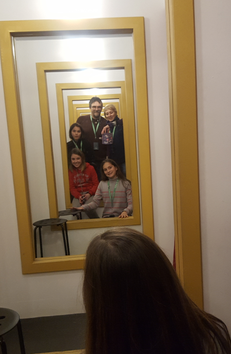
  
  
   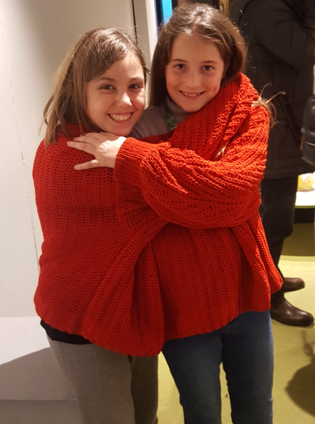
  
  
   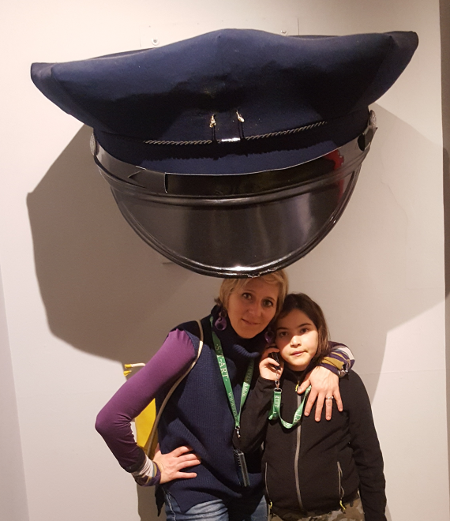
  
  
   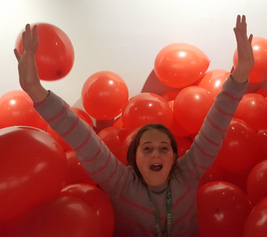
  
  
   
  
 

## Caparezza a Perugia
*26-02-2018*

 
  
   Con Lalli e Bea prepariamo lo striscione per il concerto di domani di Caparezza! "Nella notte ti guidano le stelle". Brave ragazze!
  
  
   
  
  
   La mattina si parte alla volta di Perugia. Saliamo con la minimetro in centro.
  
  
   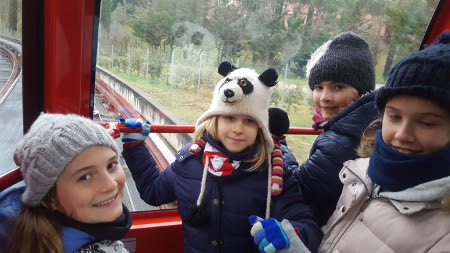
  
  
   Fa freddissimo e inizia pure a nevicareeee ... passiamo il pomeriggio tra cioccolateria e pizzeria
  
  
   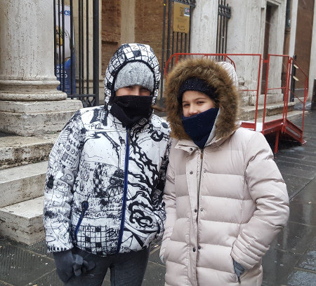
  
  
   
  
  
   
  
  
   e alle 8 siamo al palazzetto dello sport. Qui fa un bel calduccio e svaligiamo il negozio dei gadget....la felpa con il capoccione di Caparezza non potevamo farcela scappare!!
  
  
   
  
  
   Il nostro striscione è bellissimo...e anche l'unico!
   
  
  
   Il concerto è divertente, emozionante, con belle scenografie e lui è fantastico!
  
  
   
  
  
   
  
  
   Che serata!!!
  
  
   
  
  
   Fuori ci attende la bufera di neve!!! Dopo qualche peripezia, salite innevate e ghiaccio alla fine arriviamo in albergo alle 2 di notte!
  
  
   La mattina ci svegliamo ed è tutto bianco! Un bella colazione e si torna a casa.
  
  
   
  
  
   Grande avventura questo we!!!
  
 

## La neve a Roma
*27-02-2018*

 
  
   E per la seconda volta da quando siamo nate....la neve a Roma!! Il nostro giardino sembra magico
  
  
   
  
  
   E la caffarella è tutta innevata
   
  
  
   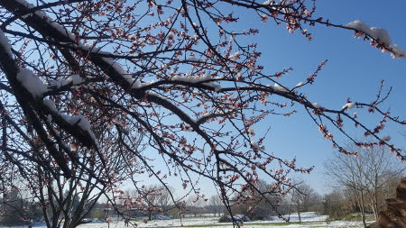
  
  
   
  
  
   La cosa più bella? La scuola chiusa per due giorni!!!!
  
 

## Auguri nonno Mario....per te un regalo speciale!!
*02-03-2018*

 
  
   Quest'anno un compleanno con sorpresa....cosa dice il bigliettino?
  
  
   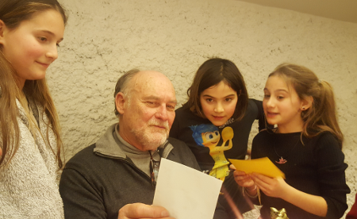
  
  
   un cucciolo in arrivo per te da parte di nonna! Si chiamerà "Trippa" o "Bandito"?
  
  
   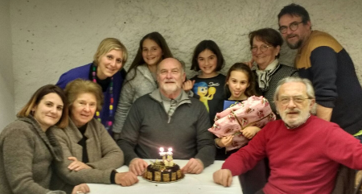
  
  
   
  
  
   Non è stupendo??
  
  
   
  
 
## Quanta neve a Campo Felice
*10-03-2018*

 
  
   Dopo le nevicate e il freddo ... finalmente una giornata stupenda di sole e ne approfittiamo per andare a sciare a Campo Felice.
  
  
   
  
  
   
  
  
   
  
  
   [video width="854" height="480" mp4="{{baseurl}}/uploads/2018/03/campo_felice.mp4"][/video]
  
  
   E per concludere la bellissima giornata .... tutti a cena da Pina e Gianluca e la fantistica tribù dei Dalton .... hihihihi
  
  
   
  
 

## Continua il torneo di tennis ....
*12-03-2018*

 
  
   ... dopo l'ennesimo annullamento per pioggia oggi si gioca.... nella bufera di vento ... e poi la pioggia.....niente...annullata! Ma io non mi scoraggio mai!!!
  
  
   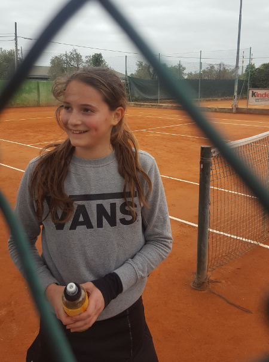
  
 

## Mostra e mare
*26-03-2018*

 
  
   Questo we andiamo a vedere la mostra Egizi&amp;Etruschi, un'interessante parallelo tra due cviltà apparentemente molto diverse, nella bellissima location della centrale Montemartini
  
  
   
  
  
   
  
  
   
  
  
   Mati, ti serve una mano?
  
  
   
  
  
   e poi domenica tutti al mare al Lido di Latina a festeggiare Lorenzo! Una frittura di pesce, qualche mozzarella di bufala, tanta voglia di rivedersi e stare insieme e non da ultime ...
  
  
   
  
  
   le candeline sulla pastiera!!!
   
  
 

## Auguri a Cate, zia Betta e papà
*28-03-2018*

 
  
   <strong>
    16 Marzo
   </strong>
   : Slime&amp;pigiama party per il compleanno di Cate.
  
  
   Sotto l'attenta guida di Mati....si producono slime di tutti i tipi
  
  
   
  
  
   e poi una torta di marschmallow
   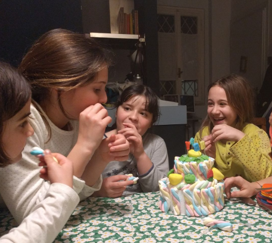
  
  
   <strong>
    21 marzo
   </strong>
   : compleanno di zia Betta....ma lei povera era un pò influenzata!
  
  
   
  
  
   <strong>
    27 marzo
   </strong>
   : colazione a sorpresa per papone con un pò di amici (che facce addormentate!!!)
  
  
   
  
  
   
  
 

## Risvegli
*30-03-2018*

 
  
   Hei ragazzi eccoci qui dopo il nostro primo vero letargo alle intemperie!
  
  
   
  
  
   E siamo uscite anche prima di mamma Athena che quest'anno se l'è presa comoda!!!
  
  
   
  
 

## Paesqua a Paestum
*04-04-2018*

 
  
   Nonostante le previsioni non proprio favorevoli per questo bel ponte paquale abbiamo deciso di partire e siamo una bella carovana di 7 camper!
  
  
   <strong>
    30-03
   </strong>
   : Si parte il pomeriggio alla volta di Salerno. Parcheggiamo in città, sul lungo mare e facciamo una passeggiata in centro con cena in pizzeria (iniziamo con la "zizzona" e le pizze fritte....)
  
  
   <strong>
    31-03
   </strong>
   : La mattina, grazie ai volontari alla spasmodica ricerca di sfogliatelle, il risveglio è stupendo!
  
  
   
  
  
   Ci muoviamo verso Paestum dove ci fermiamo al camping Ulisse, proprio sul mare. Necessaria la tappa al caseificio Torricelle a prendere 5Kg di mozzarella!
  
  
   
  
  
   Pranzo tutti insieme con brindisi per il compleanno di Marci!
  
  
   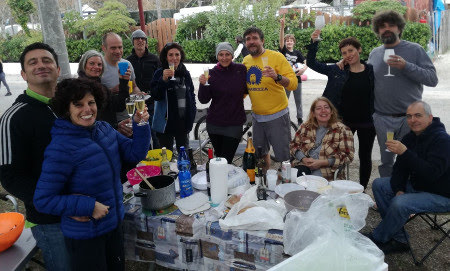
  
  
   Il pomeriggio si alza un ventone forte e freddo.
  
  
   <strong>
    1-04:
   </strong>
   Oggi è Pasqua, Pesce d'Aprile e il compleanno di Mamish!
  
  
   
  
  
   Con tanta fantasia e un pò di aiutino da parte di Vale, allestiamo una meravigliosa tavola per la colazione di Pasqua!
  
  
   
  
  
   
  
  
   Organizziamo un egg lab
  
  
   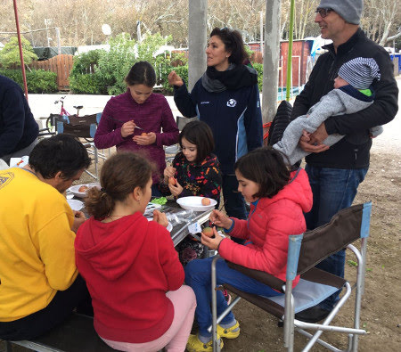
  
  
   
  
  
   E la caccia al tesoro dei bambini. Hanno cercato le uova di pasqua per tutto il campeggio e pure sotto la pioggia....ma alla fine le hanno scovate... e mangiate !!!
  
  
   
  
  
   E poi finalmente esce il sole e facciamo una passeggiata fino agli scavi.
  
  
   Un pò di cultura nel museo archeologico, dove conservano anche l'ambigua tomba del tuffatore
  
  
   
  
  
   e un pò di magia tra gli antichi templi
  
  
   
  
  
   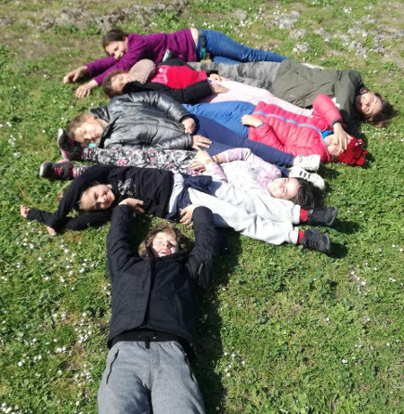
  
  
   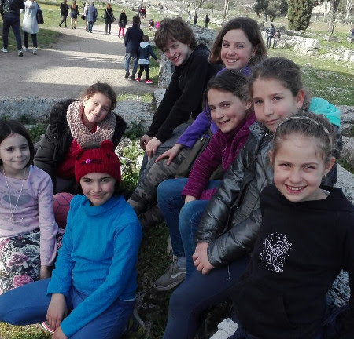
  
  
   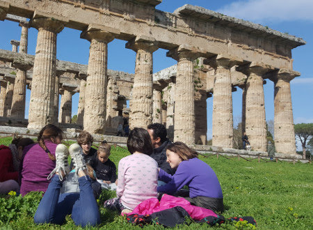
  
  
   
  
  
   La serata si conclude in musica
  
  
   
  
  
   <strong>
    2-04
   </strong>
   : Pasquetta. Lo spirito goliardico non manca
  
  
   
  
  
   Oggi andiamo a visitare il paesino di Castellabate, diventato famoso perchè qui hanno girato il film "Benvenuti al SUD".
  
  
   
  
  
   E' affollatissimo e riusciamo a danneggiare tre camper su 6 per fare manovra....quindi ci spostiamo sul mare a S.Maria di Castellabate. La giornata è davvero estiva.
  
  
   
  
  
   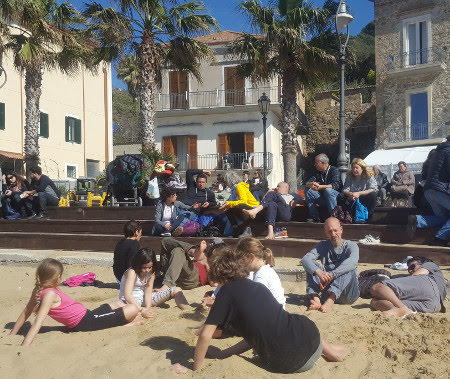
  
  
   
  
  
   La sera rientriamo verso Paestum e ci fermiamo all'area di sosta "Gli Eucalipti".
  
  
   <strong>
    3-04
   </strong>
   : Relax totale. Un pò di compiti per i ragazzi (era ora!)
  
  
   
  
  
   un tuffo
  
  
   
  
  
   e un giro in canoa
   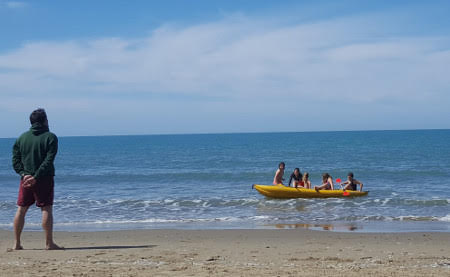
  
  
   e si torna a casa! Viaggio di rientro infinito per il traffico (7 ore!!!)
  
  
   .
  
  
   Però è stata una bellissima vacanza, la prima uscita in camper dell'anno!
  
  
   
  
 

## Maestri ... e pure laureati
*18-04-2018*

 
  
   Oggi i nostri specialissimi maestri di tennis si laureano!
  
  
   Emozionati prima della discussione...
  
  
   
  
  
   e che gioia dopo!!!
   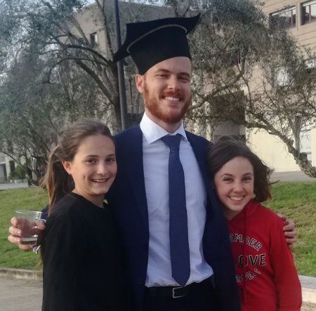
  
  
   
  
  
   Tanti auguri Anna e Andrea!
  
 

## Il mese dei cagnolini!
*22-04-2018*

 
  
   In questo mese conosciamo due deliziosi cagnolini!
  
  
   <strong>
    Cloe
   </strong>
   la cucciolina di Flavio
  
  
   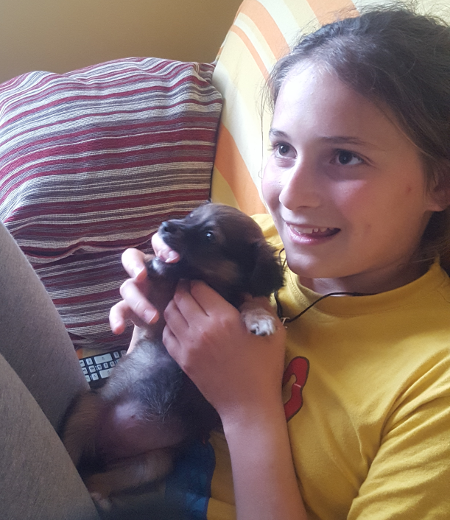
  
  
   e
   <strong>
    Olmo
   </strong>
   il cagnetto di nonno Mario
  
  
   
  
  
   
  
  
   ha conquistato subito anche papà!
   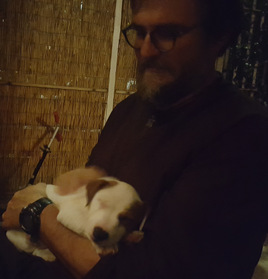
  
  
   sono STUPENDI!!!!
  
  
   Olmetto ce lo siamo anche portato al mare insieme a Cate!
  
  
   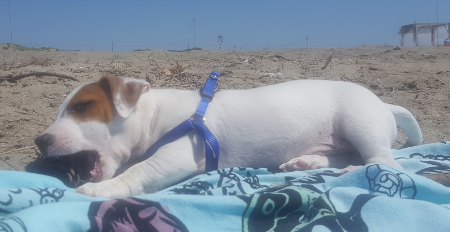
  
  
   
  
 
## Incidente per Athena
*24-04-2018*

 
  
   La nostra cucciola Athena nelle sue ardite esplorazioni è caduta :(
  
  
   ma il veterianario ce l'ha "aggiustata" per bene! E dopo 3 settimane ha anche ripreso a mangiare. Forza Athena che ce la fai!
  
  
   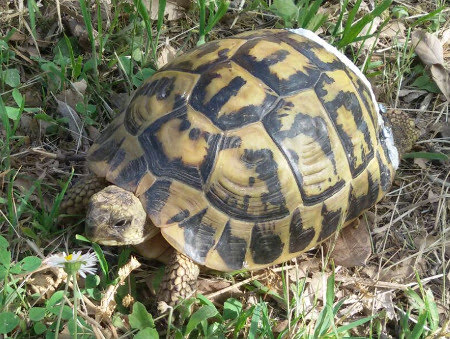
  
 

## 25 aprile al parco degli acquedotti
*26-04-2018*

 
  
   Bellissima e affollata giornata al paro degli acquedotti
  
  
   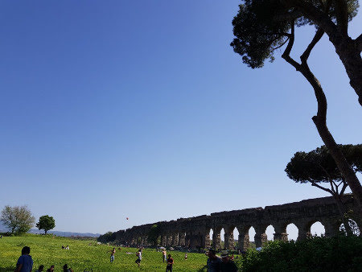
  
  
   Passeggiata in bici.....mitica Anita nonostante la bici!
   
  
  
   vecchi e nuovi amici...
   
  
 

## Ponte del 1 maggio - Punta Aderci e Tirino
*02-05-2018*

 
  
   M&amp;P si sono innamorati di questo posto e per il ponte ci andiamo tutti insieme!
  
  
   Raduno di camperisti, gli Architetti+1 in rientro dal Molise e la banda della Caffarella quasi al completo! :D
  
  
   29 aprile: passeggiata nella riserva naturale di Punta Aderci, chi in bici
  
  
   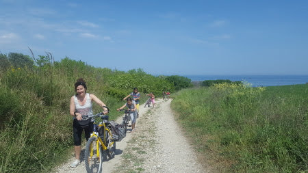
  
  
   
  
  
   
  
  
   chi in canoa
   
  
  
   e chi a piedi
   
  
  
   alla fine arriviamo tutti. Il mare è bellissimo, e anche se un pò freddo non scoraggia grandi e bambini a farsi il bagno!
   
  
  
   
  
  
   
  
  
   
  
  
   
  
  
   E la sera tutti al locale trendy a fare l'aperitivo cenato a colpi di mojito, cocktail analcolici per i bambini e alette di pollo!
  
  
   30 aprile: la mattina ancora mare e ... la solita zingarata!
  
  
   
  
  
   
  
  
   Nel pomeriggio ci spostiamo a Bossi, lungo il fiume Tirino. Troviamo un centro sportivo in disuso e ci scateniamo in partite di tennis e basket tra grandi e piccoli!
  
  
   La sera BBQ nel piazzale!
  
  
   1 maggio
   <strong>
    :
   </strong>
   le previsioni davano pioggia e invece esce una timida giornata di sole che ci permette di fare una bella passeggiata lungo il fiume (ma 'ndo sta sto fiume??)
  
  
   
  
  
   
  
 

## Eventi e compleanni di maggio
*21-05-2018*

 
  
   Iniziamo con una bella festa a sorpresa per i 50 anni di Nunzio! Con postazione per suonare e cantare!
  
  
   
  
  
   
  
  
   poi Mojito e Spritz fatti in casa per festeggiare la spumeggiante Cristina
  
  
   
  
  
   
  
  
   bello il tavolo nuovo vero? :)
  
  
   
  
  
   e poi la comunione di Andrea ed Eleonora
  
  
   
  
  
   ... famiglia in tiro
  
  
   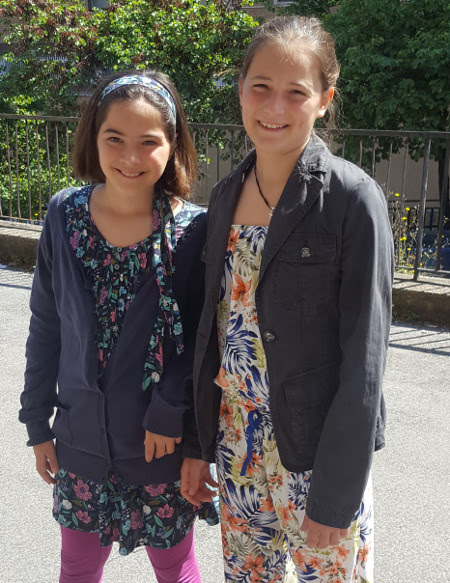
  
  
   
  
  
   e infine il 24 abbiamo festeggiato il compleanno di Evan!!! 10 anni!! TANTI AUGURI
  
  
   
  
  
   
  
  
   
  
 

## Torneo tennis vintage
*24-05-2018*

 
  
   Per concludere questo bellissimo anno di scuola tennis i maestri organizzano un torneo "vintage".
  
  
   Ovviamente i più fashion sono i Vales :)
  
  
   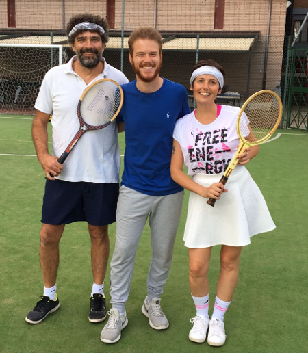
  
  
   ma alla fine ci siamo divertiti tutti con quelle buffe racchette di legno!!
  
  
   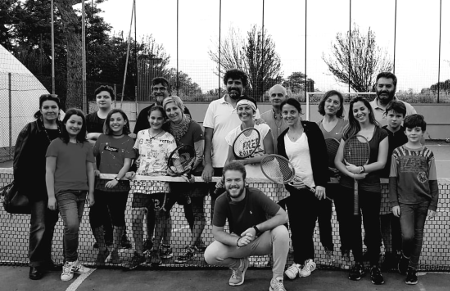
  
  
   Il torneo lo vince la coppia Valerio-Mati!!!
  
  
   E poi tutti a cena
   
  
  
   BBQ con i fantstici arrosticini abruzzesi portati dalla maestra Anna!!!
   
  
  
   Arrivederci a settembre! Buona estate a tutti!
  
 

## School on the beach
*28-05-2018*

 
  
   Questo (finalmente!!)
  
  
   bel we di fine maggio il solito gruppetto della classe di Meggy si trasferisce a Sabaudia. Tutti al B&amp;B e noi con Ronzinante!
  
  
   La mattina M si fa delle belle camminate nella riserva della Bufalara
  
  
   
  
  
   
  
  
   poi tutti in spiaggia ... e niente ha potuto fermare i bambini dal trascorrere tutto il we in acqua (forse qualche ustione)
  
  
   !!
  
  
   
  
  
   
  
  
   La sera di sabato ci acchittiamo
  
  
   
  
  
   e tutti a cena a Terracina da Sara! Si accende il BBQ e gli hamburger sono strepitosi!
  
  
   
  
  
   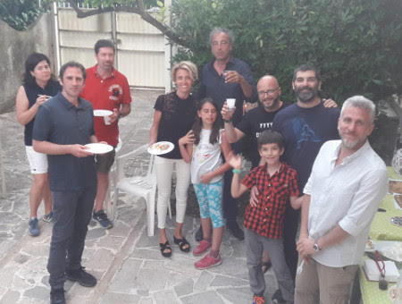
  
  
   e infine la torta! Auguri Marco!!!
   
  
  
   La domenica un pò di delta fanno su e giù sulla riva mentre Meggy legge imperterrita il suo libro!
  
  
   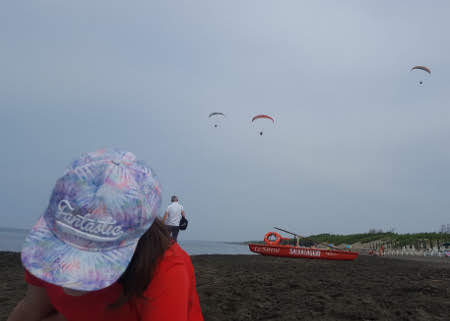
  
  
   Arriveduar!
  
  
   
  
 

## 10 anni dopo....
*01-06-2018*

 
  
   Per festeggiare i 10 anni di matrimonio di M&amp;P torniamo a Catania ...però questa volta tutti e 4 insieme! Arriviamo il 29 maggio e .... prima di ogni cosa....un mandarino al limone!!
  
  
   
  
  
   ci sistemiamo nel B&amp;B nel cortile della casa di zia Maria. Nonna Lilly ci prepara una meravigliosa cenetta siciliana a base di pasta alla norma ed involtini di melanzane! Iniziamo bene!!!
  
  
   Il 30 mattina passeggiata per Catania, prima la pescheria
  
  
   
  
  
   e poi un giro per il centro
   
  
  
   
  
  
   che è un tripudio di colori e fioriture
  
  
   
  
  
   
  
  
   fino al riservato e silenzioso porticciolo Rossi, dove ci fermiamo a mangiare arancini e pizzette!
  
  
   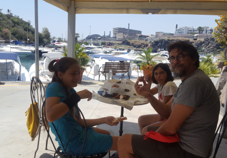
  
  
   e a fare due passi tra gli scogli.... attente a non cader... troppo tardi!!! hahaha
   
  
  
   
  
  
   Nel pomeriggio andiamo a trovare Annagloria, Gaetano e i bimbi
  
  
   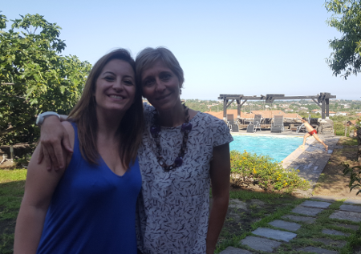
  
  
   e tutti in piscinaaaa
   
  
  
   
  
  
   31 Maggio, ci spostiamo a Rondè e con grande piacere ritroviamo Roberto e la simpaticissima Monica ad accoglierci. Qui è tutto bellissimo come 10 anni fa ... e come 30 anni fa (dice M)
  
  
   ...
   
  
  
   ecco la piscinetta dove giocavano mamma e zia Giorgia
  
  
   
  
  
   gli animali di terracotta (che non puzzano e non sporcano)
  
  
   
  
  
   il magazzino delle arance
  
  
   
  
  
   
  
  
   ... dove si sono sposati M&amp;P
  
  
   
  
  
   ... però questa volta ci sono anche io!!!
  
  
   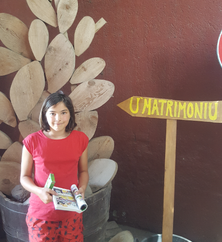
  
  
   Staremo nella casetta che un tempo era la camera da letto dei bisnonni e che ora il tocco magico di Michela ha reso deliziosa
  
  
   
  
  
   
  
  
   E poi tutti al Gelsomineto a fare un bel bagno! La spiaggia è sempre mozzafiato anche se il mare oggi è mosso
  
  
   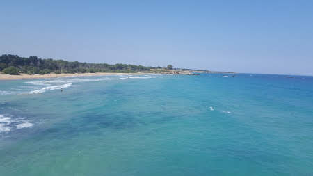
  
  
   
  
  
   e la scogliera affascinante
   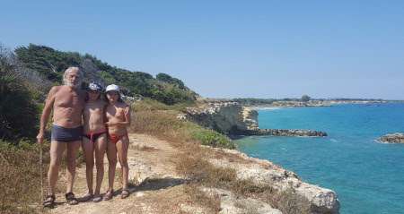
  
  
   io e Meggy facciamo i tuffi!
   
  
  
   
  
  
   
  
  
   La gioia più grande è essere qui noi 4!
  
  
   La sera andiamo a cena a Sirausa in un ottimo ristorante di pesce! Auguri M&amp;P!
  
  
   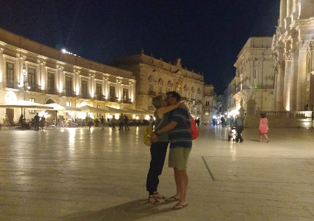
  
  
   1 giugno: colazione squisita sul tavolone di pietra e con il miele e le marmellate fatte in casa
  
  
   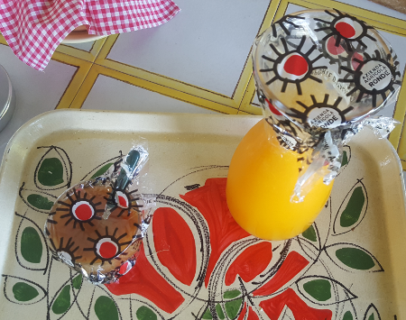
  
  
   ..un pò addormentati
  
  
   
  
  
   Poi passeggiata a Marzamemi per una granita al pistacchio! Stiamo sempre a magnà!!! Ma come si fa a resistere!
  
  
   
  
  
   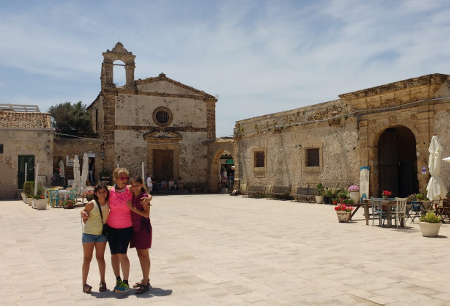
  
  
   Poi andiamo a visitare l'oasi di Vendicari
  
  
   
  
  
   con i resti della tonnara sulla spiaggia
  
  
   
  
  
   e una bellissima passeggiata nella riserva
  
  
   
  
  
   Peccato che ci sia tanta poseidonia. Alla fine gelatone a Siracusa
  
  
   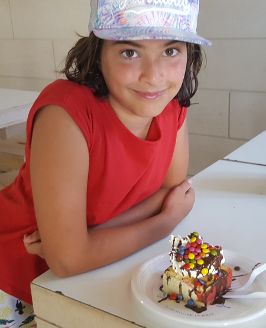
  
  
   e torniamo a Lentini.
  
  
   2 giugno: oggi invece bagno al Plemmirio con i nonni e papone
  
  
   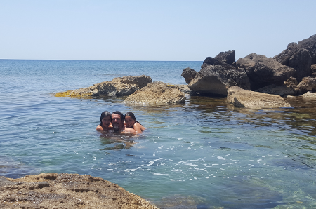
  
  
   e poi torniamo a Catania....in tempo in tempo per andare a cena con Annagloria&amp;family ad Acireale....che mangiata di pesce! Da scoppiare!
  
  
   3 giugno: colazione in via Etnea con cannoli, raviole e aracini e poi tristi tristi ce ne torniamo a Roma. Ma nel cuore la felicità di aver trascorso un'indimenticabile vacanza in famiglia .... e nella valigia due alberelli che ci ricorderanno Lentini, un limone e un melograno!
  
  
   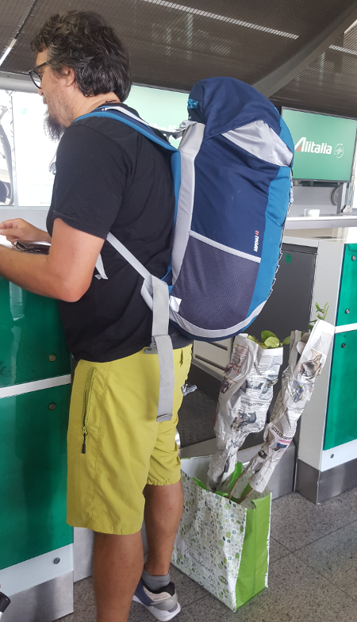
  
  
   Arrivederci a presto meravigliosa Sicilia
  
  
   
  
 

## Ultimo giorno di scuola della 1 media
*09-06-2018*

 
  
   La 1N FOREVER dovrà cambiare nome!!
  
  
   
  
  
   Finalmente è finita la scuola....e tutti a mangiare da Mc Donald's....anzi "mamma possiamo venire a mangiare a casa che qui non c'è posto?"
  
  
   
  
  
   e poi tutti in Caffarella a farsi i gavettoni
   
  
  
   ma da noi è più divertente però!! :)
  
 

## Roma Pride 2018
*10-06-2018*

 
  
   M e Meggy si unisono alla brigata arcobaleno per sostenere la libertà di amare
  
  
   
  
  
   
  
  
   
  
  
   Ci piace questa manifestazione.....qualche eccesso...ma va bene così!
   
  
 

## Settima al Brallo, centro FIT in Lombardia
*17-06-2018*

 
  
   Quest'anno mi sono proprio meritata una settimana al Brallo, uno dei centri della federazione italiana di tennis. Andiamo io e Caterina da Roma, più Isabel e altri amici da Borgio.
  
  
   Partenza in treno con P .... adolescenti telefono-dipendenti
  
  
   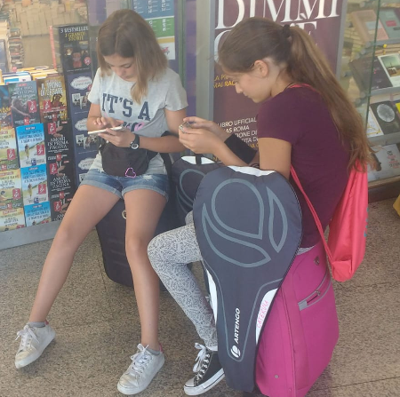
  
  
   e arrivo da Isabel! Iniziamo la disintossicazione da famiglia e telefono!!!
   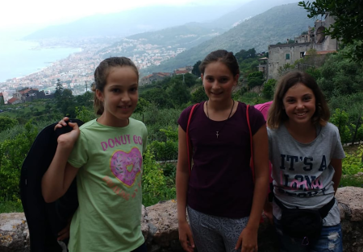
  
  
   Eccoci finalmente a Brallo
  
  
   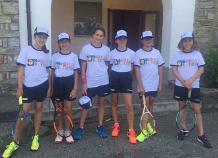
  
  
   ci sono tantissimi campi e per fortuna, tranne un pomeriggio, sempre sole!
   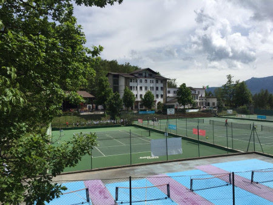
  
  
   Giochiamo e giochiamo e sono migliorata tantissimo! Adesso "spazzolo" pure!
  
  
   
  
  
   
  
  
   e abbiamo sempre l'occhio attento e vigile della "Vero" che ci rassicura ...
   
  
  
   Insomma una settimana di tennis, amicizie ed indipendenza!
  
  
   
  
 

## Stage Nazionale di Arti Marziali a Montesilvano
*18-06-2018*

 
  
   
  
  
   Finalmente si parte! Ho aspettato tanto questo stage di Judo e questa mini vacanza da sola con M&amp;P e i miei amici di Judo!
  
  
   Appena arrivati ci registriamo e di corsa a mettere il judogi per il primo allenamento.
  
  
   
  
  
   Poi un pò di relax sul mare, anche se tira un forte vento e fa quasi freschino!
  
  
   Cena....quanto è bello il buffet.. scelgo solo le cose che mi piacciono e poi ci sediamo al tavolo tutti insieme.
  
  
   
  
  
   La mattina dopo di nuovo sul tatami ... per fortuna l'albergo è a 1 minuto a piedi dal plazzetto dello sport
  
  
   
  
  
   riesco anche a farmi firmare la cintura dalla mitica maestra di judo 93enne!!
   
  
  
   Bella vero?
   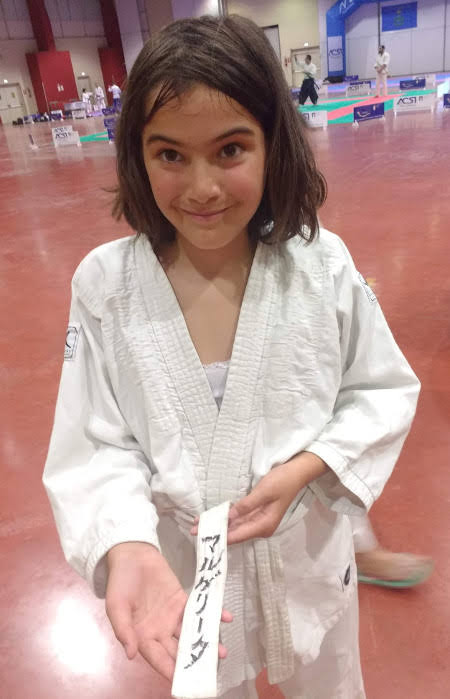
  
  
   
  
  
   E dopo questa fatica tutti in piscina a tuffarsi dal trampolino di 3 metri!!
  
  
   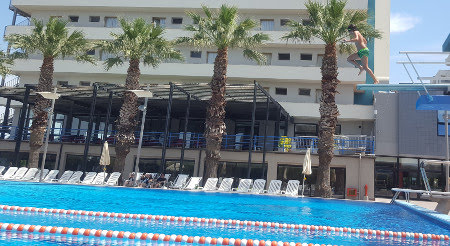
  
  
   Pomeriggio allenamento e foto di gruppo....siamo proprio tantissimi!
  
  
   
  
  
   L'ultima giornata riceviamo anche l'attestato dal grande maestro corso Fernand Capizzi ... che chiama tutte le bambine Margherita....finalmente ne ha trovata una!
  
  
   
  
  
   Peccato che il mare non l'abbiamo proprio visto....solo mamma è riuscita a farsi qualche passeggiata la mattina presto...poi si alzava sempre il vento.
  
  
   Ciao Montesilvano....ci vediamo l'anno prossimo!
  
  
   
  
 

## Amici romani a Verezzi
*03-07-2018*

 
  
   M&amp;P vengono a riprenderci....e ci fanno una bella sorpresa con Cristina Damiano e Prisca! Ci vediamo il 28 sera all'osteria del Melogno per festeggiare il compleanno di Federico! Che bel fresco che fa qui!!
  
  
   <strong>
    29-06
   </strong>
   Oggi andiamo al mare a Malpasso e le gnomette si fanno le treccine! BELLE :D
  
  
   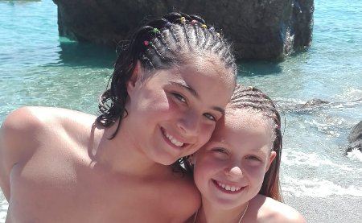
  
  
   Cena in terrazza con cous-cous di pesce fatto da papone!
  
  
   
  
  
   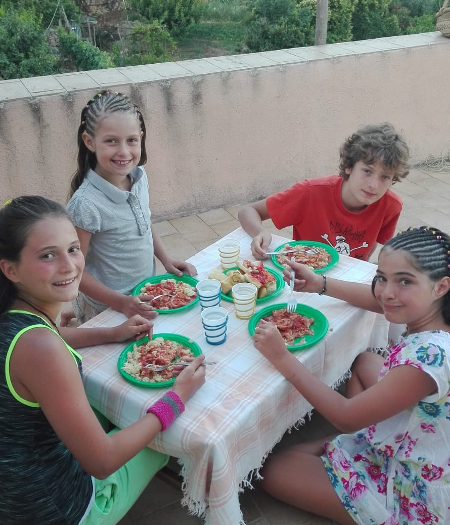
  
  
   Arriva anche Giuliano da Venezia.
  
  
   <strong>
    30-06
   </strong>
   Passeggiata a piedi fino a Finale e bagno rinfrescante!
  
  
   
  
  
   La sera festeggiamo il compleanno di Damiano! Auguri!
  
  
   
  
  
   
  
  
   <strong>
    1-07
   </strong>
   Oggi invece facciamo un pò di slackline nel bosco. Caspita come è difficile, ci aiutiamo con i bastoni
  
  
   
  
  
   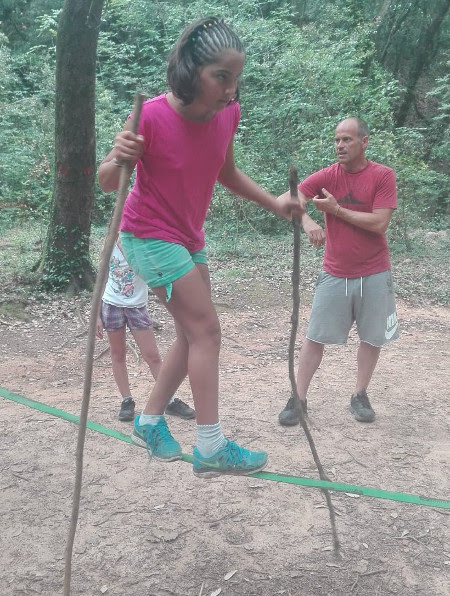
  
  
   ... mamma esagera sempre ....
   
  
  
   e poi ci incamminiamo per il sentiero che passa dalla vecchia cava e scende a Borgio. Il panorama qui è sempre mozzafiato!
  
  
   
  
  
   
  
  
   
  
  
   
  
  
   ... per chi soffre di vertigini poi.... è il massimo!!!
  
  
   
  
  
   
  
  
   La sera cenetta romantica delle M e dei P al ristorante su alle chiesette
   
  
  
   
  
  
   Arriveduar meravigliosa Liguria e grazie amici per il bel we!
  
  
   
  
 

## Valdolmo
*09-07-2018*

 
  
   Anche quest'anno una scappata a Valdolmo con Caterina non poteva mancare... per di più adesso che c'è anche Olmo che tormentiamo dalla mattina alla sera!
  
  
   
  
  
   
  
  
   
  
  
   E siamo anche andatre a trovare la bisnonna Maria
   
  
 

## Corsica ... che passione!
*01-08-2018*

 
  
   <strong>
    16 LUGLIO
   </strong>
   : finalmente si parte! Traghetto la mattina alle 8, un pò di ritardo ma alla fine arriviamo all'ora di pranzo a Bastia.
  
  
   
  
  
   Ci arrampichiamo subito per montagne per tagliare il dito e arrivare a Saint-Florant, dove ci aspettano Gianni, Shaaron e Stella al campeggio Acqua Dolce.
  
  
   Primo e unico temporale durante la notte.
  
  
   <strong>
    17
   </strong>
   : oggi c'è un pò di mare e partono solo le barche più grandi per la spiaggia di Lotu.
  
  
   
  
  
   ... però ne valeva la pena! Sembra di essere ai caraibi ....
  
  
   
  
  
   
  
  
   però con le mucche!
   
  
  
   Poi prendiamo le jeep (l'autista è matto!)
  
  
   e ci facciamo portare a Saleccia.
   
  
  
   Anche qui bellissima spiaggia e mare mosso. Ci divertiamo tra le onde.
   
  
  
   Decidiamo di tornare a piedi fino a Lotu, una passeggiata sulla scogliera di un'oretta.
   
  
  
   E la sera bbq in campeggio con un festeggiamento importante ... i 25 anni di matrimonio di Gianni e Shaaron!!
   
  
  
   <strong>
    18:
   </strong>
   iniziamo a salire per la costa ovest del dito. Incontriamo Nonza, ma non riusciamo a parcheggiare lungo la strada e ci fermiamo nella stupenda spiaggia nera sotto il paese.
   <strong>
   </strong>
  
  
   
  
  
   Anche qui mare mosso e bimbi che rotolano tra i sassi neri e la schiuma bianchissima
   
  
  
   
  
  
   Nel pomeriggio ci spostiamo nel paesino di Centuri, dove allevano le aragoste
   
  
  
   
  
  
   
  
  
   e, grazie a Nunzio per il suggerimento, ci facciamo una spettacolare mangiata di pesce al tramonto, aragoste comprese!
   
  
  
   La notte dormiamo lungo la strada a Centuri ...
   
  
  
   <strong>
    19:
   </strong>
   e la mattina questo è il panorama dalla finestra
  
  
   
  
  
   
  
  
   bagnetto con le maschere
   
  
  
   Ci avviamo verso la punta del Cap Corse, passando per il bellissimo mulino Mattei, con un panorama mozzafiato!
   
  
  
   Troviamo un'area di sosta semivuota a Tollare, davanti all'isola della Giraglia che si affaccia sulla punta del dito. Ci concediamo anche un aperitivo molto elegante e romantico ma anche salato nel porticciolo di Barcaggio.
  
  
   
  
  
   
  
  
   Cena e partitone di calcio tra bambini!
  
  
   
  
  
   <strong>
    20:
   </strong>
   colazione al baretto con questa vista stupenda**
   
  
  
   **
  
  
   e poi la carovana si sposta con tutti i natanti a disposizione per esplorare la bellissima punta di capo corso: canoe, materssini, pinne e maschere
   <strong>
   </strong>
  
  
   
  
  
   
  
  
   
  
  
   e anche oggetti poco raccomandabili....
   
  
  
   Troviamo anche le stelle marine!
   
  
  
   La sera cena a base di cozze a Macinaggio.
  
  
   <strong>
    21:
   </strong>
   oggi seguiamo il sentiero dei doganieri dalla spiaggia di Tamarone fino alla baia di S. Maria per andare a visitare una torre genovese diroccata
  
  
   
  
  
   
  
  
   
  
  
   
  
  
   
  
  
   Il nostro gruppone si separa, i Vales vanno verso Agriates e Calanche e noi verso la Castagniccia e l'interno.
  
  
   Tappa a Orezza, dove ci sono le fonti d'acqua, e Piedicroce. Lungo la strada tanti recinti di maiali.
  
  
   
  
  
   Ci fermiamo a dormire in mezzo ai monti e improvvisiamo una pasta al sugo di murena (pescata da Gianni)
  
  
   !
  
  
   <strong>
    22:
   </strong>
   passaggio per Ponte Leccia e non poteva mancare una visita all'oasi delle tartarughe a Moltifao
  
  
   
  
  
   
  
  
   prima di imboccare la stretta vallata che segue il fiume Asco. Qui il canyon è profondo e con questi massi bianchi enormi. Ci fermiamo per un pranzo al sacco e un tuffo nell'acqua gelida!
   
  
  
   e anche qualche coccola!
   
  
  
   Arriviamo alla fine della strada al Plateau de Stagnu, Haut-Asco, dove c'è il rifugio del GR20, la partenza dello skylift e la casa del muflone. Qui d'inverno fa molta neve. Facciamo una passeggiata verso la cima del monte Cinto. Il panorama è incredibile, i colori vanno dal verde fluo al giallo dei muschi, e dal rossastro al viola delle rocce di granito....
   
  
  
   
  
  
   
  
  
   
  
  
   
  
  
   
  
  
   Cena al rifugio Le Chalet e notte nel parcheggio a 1400. Fa freschetto!!
  
  
   <strong>
    23
   </strong>
   : Sveglia alle 6 e discesa per evitare di incontrare altre macchine, la strada è stretta! Ci fermiamo nella bellissima Corte.
  
  
   
  
  
   
  
  
   
  
  
   
  
  
   e poi bagno alla Ghisonaccia, spiaggione di sabbia con acqua caldissima. Ci informiamo a Solenzara per il canyoning e poi iniziamo a salire per il colle di Bavella. Strada larga e panoramica con vista sulle famose guglie, rosse imponenti e frastagliate.
  
  
   Arriviamo con i camper alla Madonna delle Nevi e ci incamminiamo, quasi al tramonto, nel bosco. Rimaniamo senza parole....
  
  
   
  
  
   una coppia di mufloni ... che emozione vederli così in libertà!
   
  
  
   
  
  
   Altra notte in montagna al fresco.
  
  
   <strong>
    24
   </strong>
   : Adrenalina a mille stamattina....abbiamo appuntamento con la guida Thomas che ci porterà a fare canyoning nella gola di Pulischellu!! Gianni si chiede chi gliel'ha fatto fare....e ha pure pagato!!
  
  
   Si inizia con un una cosa tranquilla ....  scivolo con tuffo finale tutti legati insieme....
  
  
   
  
  
   
  
  
   si prosegue lungo il fiume tra tuffi sempre più alti
  
  
   
  
  
   
  
  
   
  
  
   
  
  
   e scivoli....
  
  
   
  
  
   
  
  
   
  
  
   una piccola pausa
   
  
  
   e poi il gran finale con lo scivolo a testa in giu!!! Pronti??
  
  
   
  
  
   Viaaaaaaa
  
  
   
  
  
   
  
  
   
  
  
   Che figataaaaa
  
  
   
  
  
   
  
  
   Nel pomeriggio ci ritroviamo con i Vales e ci fermiamo per un bagno nella spiaggia di Pinarello, bella ma piena di poseidonia. Poi nel campeggio "U Stabiacciu" vicino Porto Vecchio.
  
  
   
  
  
   <strong>
    25:
   </strong>
   con un solo camper andiamo a Palombaggia, una delle spiagge più gettonate della costa est ... molto bella
  
  
   
  
  
   
  
  
   
  
  
   
  
  
   ... fino a che non viene invasa di gente e a quel punto scappiamo!
  
  
   La sera passeggiata in bici, solo adulti, nel centro di PortoVecchio, molto chic e carissimo! Cena in campeggio con BBQ.
  
  
   <strong>
    26:
   </strong>
   non potevamo non fermarci sulla stupenda scogliera di Bonifacio. Andando verso il faro di Pertusato troviamo un piccolo sentiero, Tre Punti, e la vista man mano che scendiamo è unica!**
   
  
  
   
  
  
   
  
  
   
  
  
   
  
  
   <strong>
    Trascorriamo la giornata a tuffarci dagli scogli di un bianco abbagliante in un mare cristallino e pieno di pesci!
   </strong>
   **
  
  
   
  
  
   **
   
  
  
   **Nel pomeriggio passeggiata in paese con crepes, gouffres e dolcetti di ogni tipo :)
  
  
   <strong>
   </strong>
  
  
   
  
  
   
  
  
   
  
  
   La sera apericena seduti per terra e pernotto nella plage de la Tonnara.
  
  
   <strong>
    27
   </strong>
   : Risveglio artistico con barchette di legno da costruire e clacson da riparare
  
  
   
  
  
   andiamo via giusto in tempo perchè sta arrivando la Gendarmerie e ci addentriamo per visitare la più corsa delle città corse Sartena. Qui fanno un'inquietante processione dell'incatenato...che per fortuna non abbiamo visto!
  
  
   
  
  
   poi ci spostiamo lungo la costa fino ad arrivare a Belvedere e la lunghissima spiaggia sabbiosa di Portigliolo, con i paracadutisti che si lanciano alle nostre spalle.
  
  
   
  
  
   La sera torniamo verso sud con tappa al tramonto per vedere il leone di Roccapina
  
  
   
  
  
   
  
  
   e dormiano lungo la strada per il porticciolo di Piantarella. Cena in camper e passeggiata al piccolo molo dove ci sdraiamo e vediamo l'eclissi di luna e le stelle cadendi. Moscato al baretto trendy dei surfisti!
  
  
   <strong>
    28:
   </strong>
   oggi per la gioia di papone affittiamo la barca a vela! Il nostro skipper (uguale a Kevin Bacon)
  
  
   sembra un pò troppo giovane, ma si rivela molto preparato e affidabile.... anche quando molla il timone e va in cabina mentre la barca va di bolina sbandata!! Trascorriamo una giornata stupenda!
  
  
   
  
  
   
  
  
   
  
  
   Prima tappa Capu Bianco, scogliera bianchissima dove ci immergiamo con le maschere. Mitica Vale che ha fatto la foto dal mare!
  
  
   
  
  
   
  
  
   Poi Isola Cavallo, privata con ville pazzesche....dove poggiamo solo i piedi sulla spiaggia!
   
  
  
   e infine ventone nelle bocche di bonifacio e in rada all'isola di Lavezzi. Arriviamo quando tutti i barconi di turisti vanno via e ci godiamo una pagaiata in SUP e una passeggiata per l'isola, con visita al minuscolo cimitero e alla piramide commemorativa. Che pace, che posto!
  
  
   
  
  
   
  
  
   
  
  
   
  
  
   Notte lungo la strada in un'area pic-nic con i tavoli di pietra.
  
  
   <strong>
    29
   </strong>
   : tappa culturale per visitare i menhir antropomorfi di Filitosa
  
  
   
  
  
   
  
  
   e infine ultimo bagno in una bella spiaggia vicino Porticcio. La sera ci fermiamo lungo la costa a sud di Ajaccio per un pic-nic in spiaggia e bagno di notte a chiusura delle vacanze.
  
  
   
  
  
   
  
  
   <strong>
    30
   </strong>
   : risveglio davanti alle Isole Sanguinarie...peccato non poter fare una passeggiata
  
  
   
  
  
   perchè dobbiamo andare a Bastia dove parte il traghetto. Arrivederci a presto meravigliosa Corsica!
  
  
   
  
 

## Verezzi
*10-08-2018*

 
  
   Con papone ci fermiamo un pò da zia mentre mamma è a casa a lavorare. Certo qui stiamo proprio bene, in mezzo alla natura e agli animali.
  
  
   Morghi prima di tutti ovviamente!
  
  
   
  
  
   
  
  
   Poi Karkun e Tina al melogno
   
  
  
   
  
  
   
  
  
   e poi gli asini di Asinolla
  
  
   
  
  
   Andiamo anche a fare il bagno al fiume con Isa e Vero .... che tuffi!
  
  
   
  
  
   
  
  
   
  
  
   e non poteva mancare Fiona!
  
  
   
  
  
   E poi al mare con il nostro nuovo cupcake
  
  
   
  
  
   e per chiudere la vacanza facciamo anche il pic-nic in spiaggia al Castelletto con bagno di notte
  
  
   
  
 

## Trekking&bici da Carnino al rifugio Don Barbera
*13-08-2018*

 
  
   Questo we insieme a zia e Silvo, Ester e Ivo andiamo a Carnino. Facciamo un piccolo accampamento in una piazzola poco prima del paese. Ci scaldiamo con un pò di arrampicata liberae proviamo le bici elettriche
  
  
   
  
  
   e poi cena alla foresteria del paese..... che magnata!
  
  
   La mattina sveglia presto e partiamo: Mati, Silvo, Ivo ed Ester in bici e M&amp;P, Meggy, zia e Morghia piedi. Si parte da Carnino a quota 1390 e si sale ....
  
  
   
  
  
   
  
  
   
  
  
   si attraversa un altipiano stupendo dove pascolano le mucche e si vede la vetta del Marguareis
  
  
   
  
  
   
  
  
   e infine si arriva al Rifugio Don Barbera a 2079m! E anche Morghino ce l'ha fatta! Grande!Dopo un pò arriva anche il gruppo dei ciclisti!
  
  
   Ci meritiamo tutti una bella polenta!
  
  
   
  
  
   Per la discesa invece c'è un cambio: zia, Silvo, Morghi, Mati e Meggy scendono a piedi e M&amp;P, Ivo ed Ester in bici.
  
  
   Il percorso in bici è meraviglioso, prima un tratto della Monesi-Limone
  
  
   
  
  
   e poi tutta discesa attraversando il Bosco delle Navette
  
  
   
  
  
   
  
  
   e il paesino di Upega fino a tornare a Carnino.
  
  
   Che giornata ragazzi!!!
  
 

## Colle di Tenda e Casterino
*22-08-2018*

 
  
   Anche questo we andiamo con zia, Silvano, Ivo ed Ester a fare una camperata/furgonata. Passando per Limone Piemonte saliamo per la bellissima strada che porta in cima al Colle di Tenda. Qui alla fine del 1800 Umberto I di Savoia temendo l'invasione francese dalla Val Roja, fece costruire delle imponenti fortificazioni. Oggi sono tornate in territorio francese, anche se a pochi metri dal confine!
  
  
   Ci fermiamo a 1908m dentro il maestoso Forte Centrale!
   
  
  
   Grazie ad Ivo riusciamo anche ad accendere un bellissimo fuoco
   
  
  
   
  
  
   e a mangiare tutti insieme
   
  
  
   La notte fa freddissimo! Domenica mattina colazione e pronti a partire. Gli alpinisti salgono fino alla rocca dell'Abisso, mentre noi facciamo un bel giro dei forti, dal Forte Alto
  
  
   
  
  
   passando per il forte Tabourde
   
  
  
   
  
  
   
  
  
   
  
  
   e poi scendendo in mezzo ai pratoni fino al Forte Margheria
  
  
   
  
  
   
  
  
   
  
  
   Che bella passeggiata! Adesso ci vuole proprio una sostanziosa merenda!
   
  
  
   
  
  
   Ciao zia .... ci vediamo tra un paio di giorni!
  
  
   
  
  
   La sera attraversiamo il tunnel e ci ritroviamo in Francia nel coloratissimo paesino di Tenda. Ceniamo in un piccolo ristorante a conduzione familiare.
  
  
   
  
  
   
  
  
   
  
  
   
  
  
   La mattina visitiamo Briga Marittima e poi percorriamo la bellissima e stretta valle che porta a Casterino. Passeggiata solo con Meggy nel Vallon de Fontanalba, fino ad un piccolo rifugio in ristrutturazione. Sullo sfondo le montagne della valle delle Meraviglie (ci dobbiamo andare la prossima volta!!)
  
  
   
  
  
   Dormiano a Casterino e la mattina dopo un bel parco avventura!
  
  
   
  
  
   
  
  
   
  
  
   
  
  
   
  
 

## Le 5 terre
*23-08-2018*

 
  
   Ripartiamo da Verezzi e sulla strada di casa ci fermiamo a La Spezia. Prendiamo il trenino che percorre le 5 terre. Prima tappa Monterosso. Cerchiamo subio una tratto di scogliera per fare un bel bagno ... facile trovarlo!
  
  
   
  
  
   
  
  
   e poi passeggiata per il paesino
   
  
  
   Riprendiamo il treno per fermarci a Riomaggiore. Qui il paesino è più arrocato, tutto un sali e scendi e con le casette colorate
  
  
   
  
  
   e facciamo un pò di bagni e tuffi
  
  
   
  
  
   
  
  
   terza tappa è Vernazza, dove ci siamo rilassati su una spiaggetta affollatissima nel paese, a cui si accede tramite una grotta. Abbiamo anche fatto un pò di equilibri
  
  
   
  
  
   ci sorprende uno scroscio d'acqua... ma passa subito
   
  
  
   e infine visitiamo Corniglia! Per arrivarci c'è una scalinata lunghissimaaaaa
  
  
   
  
  
   ma ne valeva la pena ... il panorama su tutto il golfo è stupendo ...si vede anche Manarola, che non visitiamo perchè è l'unico paesino che già conoscevamo.
  
  
   
  
  
   
  
  
   Torniamo esausti dalla giornata e ci rifocilliamo al giapponese :D
  
  
   
  
 

## Populonia e i cugini triestini
*24-08-2018*

 
  
   Sempre lungo la strada di casa ci fermiamo per trascorrere una giornata con zio Michele e la sua famiglia nella bella spiaggia di Baratti. La sera li raggiungiamo nel minuscolo ma meraviglioso borghetto di Populonia
  
  
   
  
  
   la loro casetta è in un posto magico
   
  
  
   
  
 

## Buon compleanno Matilde!
*08-09-2018*

 
  
   Un temporale alle 5 del mattino ci sveglia e quasi distrugge il nostro programma.... per fortuna il bacino di Quit rimette tutto a posto ...
  
  
   
  
  
   esce un timido sole....e alle 10 siamo all'ingresso di Hydromania! Non c'è nessuno, gli scivoli sono tutti per noi!!!
  
  
   
  
  
   
  
  
   facciamo anche il K2!
   
  
  
   e tutti gli scivoli con i gommoni
   
  
  
   poi pranzo con gli amici
   
  
  
   e prima torta di compleanno
   
  
  
   
  
  
   La sera ci raggiungono un pò di amiche per la cena cinese-giapponese
  
  
   
  
  
   e pigiama party! Il giorno dopo, risveglio soft, chiacchere, passeggiata da Happio e poi festa in giardino con tutti gli amici
  
  
   
  
  
   i nonni
   
  
  
   M&amp;P e Meggy
   
  
  
   e la BFF
  
  
   
  
 

## La nuova inquilina
*15-09-2018*

 
  
   La minuscola Stella è stata trovata da Matteo Emma e Laura mentre vagava in un parcheggio e adesso la ospitiamo un pò a casa nostra. E' una piccola peste ma tenerissimaaaaa
  
  
   
  
  
   Invece QTP (quelle tre patate)
  
  
   continuano a crescere a vista d'occhio!
  
  
   
  
  
   Meno male che Quit tiene tutto sotto controllo ...mentre Pimpa mangia!!!
   
  
 

## Buon compleanno Margherita
*24-09-2018*

 
  
   E anche per Meggy la prima doppia cifra!
  
  
   Facciamo una bella festa in giardino con gli amici, prima si gioca
  
  
   
  
  
   
  
  
   
  
  
   e poi la torta ...versione seria
   
  
  
   e versione buffa
  
  
   
  
  
   La sera cena con le schifezze del Mc Donald's e poi pigiama party!
  
  
   
  
  
   A mezzanotte le amiche improvvisano una torta fatta di caramelle per Meggy e poi stiamo sveglie fino alle 5 per vedere l'alba!!!
  
  
   La domenica invece andiamo a pranzo da Mara, così festeggiamo tutte due!
  
  
   
  
  
   insomma pensandoci bene ... sto proprio diventando grande!
  
  
   
  
 

## Scacco
*26-09-2018*

 
  
   Cate ha finalmente il suo tanto desiderato serpentello! Si chiama Scacco!
  
  
   
  
 

## Ultimo mare
*01-10-2018*

 
  
   E' proprio la fine di settembre, ma ancora riusciamo a passare una giornata al mare....facendo anche il bagno, un pò di acrobazie....brava Prischina!
  
  
   
  
  
   e una veleggiata
   
  
  
   .... ancora stanca il mare!!! :)
  
  
   
  
  
   un pò di relax a fine giornata ci sta tutto!
   
  
 

## Matrimonio di Francesco e Michela
*07-10-2018*

 
  
   Per la serie piccoli dottorandi crescono ... e anche Francesco alla fine si è sposato! E mica in un posto qualunque....nella bellissima abbazia di Fossanova
  
  
   
  
  
   
  
  
   
  
  
   TANTISSIMI AUGURI ragazzi!!!!
  
  
   
  
  
   
  
 

## Festa dell'autunno
*14-10-2018*

 
  
   Grande raduno a Vitorchiano per la festa dell'autunno.
  
  
   Si preparano le tradizionali pizze "autunnali" .... c'è chi impasta e stende
  
  
   
  
  
   chi guarnisce
   
  
  
   chi inforna
   
  
  
   e chi mangia!!
   
  
  
   C'è chi si coccola
  
  
   
  
  
   chi chiacchera
  
  
   
  
  
   chi scherza
  
  
   
  
  
   
  
  
   chi fa foto artistiche
  
  
   
  
  
   chi si rilassa
  
  
   
  
  
   ma soprattutto ci godiamo questa splendida giornata di ottobre insieme!
  
  
   
  
  
   .....c'è anche chi invece oggi va a vela.... e vede i delfini!
  
  
   
  
  
   
  
 

## Biciclettando
*15-10-2018*

 
  
   Domenica sulle due ruote! Bella biciclettata tra Caffarella
  
  
   
  
  
   Catacombe di San Callisto
  
  
   
  
  
   
  
  
   Appia Antica e Parco degli Acquedotti!
  
 

## Notte brava (adult only)
*20-10-2018*

 
  
   Serata di musica ai Pini Spettinati con la fantastica band degli FM3! Balli scatenati fino a tarda ora!
  
  
   
  
  
   
  
  
   
  
  
   e tornata a casa a notte fonda con una busta di cornetti ..... i ragazzini affamati mi assalgono (erano tutti svegli !!)
  
  
   .
  
 

## Festeggiamenti al porto di Ostia
*22-10-2018*

 
  
   Oggi si festeggia al porto di Ostia! Anniversario dei nonni!!!
  
  
   
  
  
   
  
  
   e papone che porta il suo primo equipaggio da istruttore!!!
  
  
   
  
  
   
  
  
   Rientro in porto
   
  
  
   
  
  
   Arriveduar
  
  
   
  
 

## Halloween parties
*01-11-2018*

 
  
   Quest'anno ben tre feste di Halloween in contemporanea....e non potevamo perdercene nemmeno una!!
  
  
   Il pomeriggio inzia a casa con la festa delle piccole
  
  
   
  
  
   la "terrificante" merenda è pronta.....con qualche novità ...
  
  
   
  
  
   
  
  
   
  
  
   prosegue con dolcetto scherzetto in giro per il quartiere e la festa dei grandi da Vale
  
  
   
  
  
   
  
  
   
  
  
   ...e anche da loro "orribili" manicaretti
  
  
   
  
  
   
  
  
   poi un passaggio alla festa per adulti
  
  
   
  
  
   
  
  
   e infine tutti a casa per i giochi .... organizzati da Mati per le amiche di Meggy!
  
  
   Si inizia con la pesca dei ragni nella ragnatela
  
  
   
  
  
   poi la vestizione della mummia
  
  
   
  
  
   le mele da prendere nella bacinella
  
  
   
  
  
   ... puzzle, indovinelli....e tanti altri! Infine proiezione del film Coco e tutte a ninna!!
  
  
   La mattina sveglia presto e colazione insieme
  
  
   
  
  
   BUON HALLOWEEN A TUTTI !!!
   
  
 
## We umbro-marchigiano
*05-11-2018*

 
  
   Si parte per andare a trovare la bisnonna. Tappa a Spoleto!
  
  
   L'autunno è iniziato e i colori sono bellissimi
  
  
   
  
  
   
  
  
   e questo duomo ha sempre un fascino incredibile!
   
  
  
   
  
  
   
  
  
   Arrivati a Valdolmo zia Fiorella ci invita a cena ... polentata per tutti! GNAM!
  
  
   
  
  
   mentre Olmo si coccola con la sua mamma Penelope! Che carini!
  
  
   
  
  
   Stamattina andiamo a trovare Maria! E' sorridente e in gran forma
  
  
   
  
  
   e felice di vederci! Tra poco compirà 97 anni ... grande bisnonna!
   
  
  
   Poi con i nonni ci avventuriamo sul mare a Marotta, nonostante la pioggia. Speriamo di trovare un posto carino per fare un leggero brunch e invece, purtroppo, dobbiamo accontentarci di una mangiata pazzesca di pesce al Garagol!!
  
  
   Pomeriggio passeggiata alla scoperta della rocca di Offagna
  
  
   
  
  
   Siamo immersi nella nebbia....pare che il panorama sulle colline marchigiane da qui sia spettacolare .... ma a stento si vede a un paio di metri!
  
  
   
  
  
   E vabbhè torneremo la prossima volta!
  
  
   La sera a casa, camino e coccole a Olmo....niente di più rilassante!
  
  
   
  
  
   
  
 

## Auguri Giuliano!
*10-11-2018*

 
  
   Ogni tanto riusciamo a vederti ... bhè almeno per festeggiarti! Polentata e torta....che vuoi di più?
  
  
   
  
  
   
  
 

## Dogsitting
*12-11-2018*

 
  
   I nonni ci lasciano Olmo per il weekend per la prima volta! Sabato mattina ce lo portiamo in Caffarella e si diverte nelle pozze d'acqua e a correre con gli altri cani
  
  
   
  
  
   ci vediamo anche con Cloe per un gelato
  
  
   
  
  
   la sera è talmente stanco che non riesce ad alzarsi dal divano!!
  
  
   
  
  
   Domenica altra passeggiatona, meno country però, al centro commerciale Happio per provare il nuovo ristorante KFC, ma al sole sulla terrazza!
  
  
   
  
  
   
  
  
   Tranquilli nonni, a Olmo non abbiamo dato il pollo fritto!
  
  
   Insomma l'abbiamo proprio stancato questi due giorni, però lui sembrava molto felice....al contrario di Pimpa e Quit che sono state nell'armadio terrorizzate per due giorni!!!
  
 

## Ci sono o non ci sono quest'anno?
*19-11-2018*

 
  
   Sembra proprio che qualche olivetta alla fine ci sia!
  
  
   12 litri d'olio....pensavamo 0!!!
  
  
   
  
  
   e tanti cachi
  
  
   
  
 

## Fashion brunch (adults only)
*23-11-2018*

 
  
   Compleanno spumeggiante e trendy al Mò Mò Republic! Posto dall'atmosfera calda e chic con un buffet strepitoso .... ma il vero tesoro della giornata sono le amiche!
  
  
   Auguri Vale ...la nostra regina dell'aperitivo!
  
  
   
  
  
   
  
  
   L'esterno è già decorato da meravigliosi addobbi natalizi ... ma siamo a Roma o a Copenhagen?
  
  
   
  
  
   
  
 

## Domenica romana
*02-12-2018*

 
  
   Oggi passeggiata in centro con M&amp;P.... anzi in vespa :)
  
  
   
  
  
   Passiamo per lo studio del famosissimo artigiano del legno Codognotto ... che ci regala le noci
  
  
   
  
  
   poi piazza Navona, ahimè senza bancarelle nè mela caramellata ...SOB :( ma sempre stupenda
  
  
   
  
  
   
  
  
   andamo a vedere la mostra DREAM al Chiostro del Bramante
  
  
   
  
  
   
  
  
   
  
  
   e poi sempre passeggiando arriviamo a via Nazionale a vedere la mostra della Pixar
  
  
   
  
  
   
  
  
   Oggi ci sono i musei in musica e assistiamo anche ad un divertente concerto di musiche dei cartoni animati.
  
 

## La nuvola e Zero Calcare
*10-12-2018*

 
  
   M&amp;P vanno alla fiera della piccola editoria da soli....infatti Mati sta male da una settimana...si è presa questa brutta influenza che sta girando ed è fiacchissima!
  
  
   Quest'anno la fiera la fanno dentro la Nuvola di Fuxas! Entriamo insieme all'attore Riccardo Rossi, a cui compriamo il biglietto online mentre siamo in fila....simpatico!
  
  
   
  
  
   
  
  
   E conosciamo anche Michele, un tipo figo, bravo fumettista a quanto pare :D
  
  
   
  
  
   ci autografa i libri per Mati&amp;Meggy!
  
 

