# 2019

## Capodanno in Liguria

_04-01-2019_

**25/12** : Anche quest'anno si va da zia e Morghy per Natale e Capodanno!

Andiamo subito a vedere il terreno a Bastia! Che posto meraviglioso!

La sera apericena dalla Lina per festeggiare il Natale!

**26/12** : mentre M&P si fanno una bella camminata sul lungomare fino a Loano

noi facciamo da dog sitter a Mirtilla e il suo super cucciolo Flash (sarà mica
il cucciolo di Morgan??)

**27/12** : passeggiate con Flash 

**28/12:** oggi andiamo in Francia a Roquebrune Cap Martin. Lasciamo la
macchina e facciamo il sentiero dei doganieri a piedi fino a Monte Carlo

La sera passeggiata per Nizza, dove ci sono i mercatini di Natale

una bellissima fontana

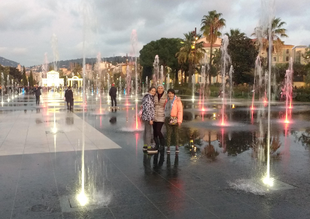

e un tramonto meraviglioso 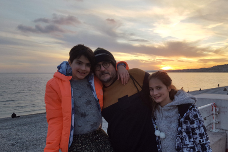

**29/12** : le giornate continuano ad essere magnifiche e noi ne approfittiamo
per fare delle belle passeggiate e mangiare al mare

Ci raggiungono anche i Vales con il camper e trascorriamo un paio di giorni
insieme!

la sera di Capodanno cenone da noi insieme a Costanza e Saverio e dei loro
amici e poi tutti a sparare i botti dalla Ber

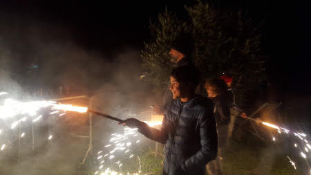

**01/01/2019** : Inizia il nuovo anno con una giornata di sole

e non può mancare un tuffo (temerari!!!!)

Passeggiata a Varigotti che al tramonto è ancora più affascinante!

**2/1** : oggi le ragazze vanno al Melogno con la zia e noi ci facciamo il
trekking da Varigotti a Noli. Si parte dalla chiesetta di San Lorenzo, un
affaccio stupendo sul mare e poi si prosegue sul sentiero del Pellegrino

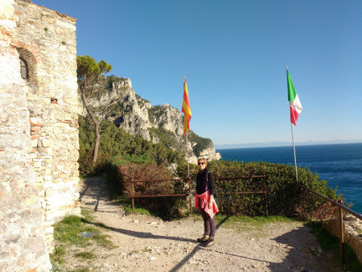

con paesaggi a strapiombo sul mare

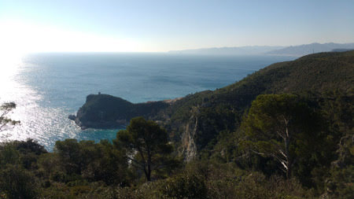

fino alla grotta dei Briganti

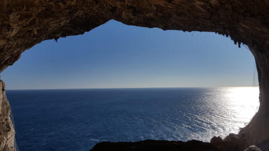

alla fine si arriva a Noli, con i suoi carruggi e il lungomare

Au revoir splendida liguria!

## Cintura gialla

_12-01-2019_

Oggi facciamo il passaggio di cintura!

Evviva ho la mia nuova cintura gialla! (che è quella di zia Giorgia quando
faceva Judo!)

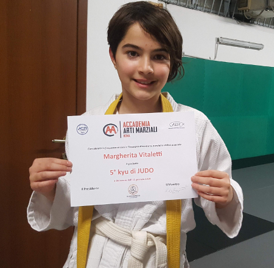

## Relax

_15-01-2019_

Chi sulla poltrona massaggiante

chi ovunque

## Torneo di tennis Roma1

_27-01-2019_

Siamo alla 4 tappa del torneo di tennis PIA Roma1, e con la vittoria del
girone di oggi passo in 12 posizione nella graduatoria!

## Fuitina per il compleanno di Massimo

_11-02-2019_

Ci hanno messo più di un mesetto ma alla fine M&P sono riusciti ad organizzare
un we a sorpresa con Paola & Massimo per festeggiare i 50 anni di Massi!

Prima tappa Civita di bagnoregio, la città che muore .... starà pure per
sgretolarsi ma è bellissima!

Passeggiata per il paesino e poi ci fermiamo in una trattoria, pranzo ottimo e
seduti fuori al sole!

Nel pomeriggio andiamo al Podere di Marfisa

dove ci accolgono con spumante ghiacciato e fragole! (Grazie Nath!)

. Tutti nella SPA a rilassarci

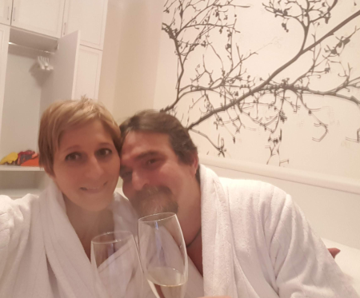

e poi un tocco di eleganza per la cena "afrodisiaca"

e non poteva mancare la torta! Auguri MASSI!!!!
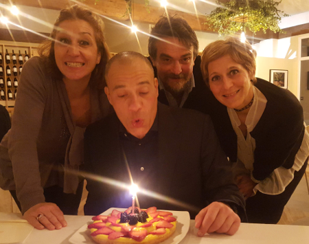

La mattina abbondante colazione e andiamo a visitare il parco naturalistico
archeologico di Vulci, la città etrusco-romana con il suo basolato, la domus
del criptoportio con l'inaspettato sotterraneo, il mitreo, e infine il
belissimo laghetto del Pellicone

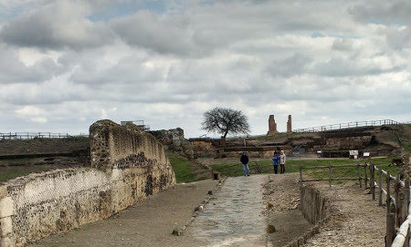

non manca nemmeno l'archeo-comunismo!!!!

E in questo bel posto c'è anche un ristorantino niente male con una vetrata
panoramica sul parco!

Grazie ragazzi, sempre bello stare con voi!

## San Valentino

_15-02-2019_

... e poi realizzi che l'amore più grande è quello che i figli hanno per te!

## Tennis e lago di Martignano

_18-02-2019_

Oggi torneo di tennis all'Olgiata, anche se solo due giorni fa stavo con la
febbre a 39.5!! E nonostante la fiacca sono riuscita a portare a casa 12
puntarelli!

Però stavolta ho la mascotte Olmetto che fa anche invasione di campo attirato
dalle palline!

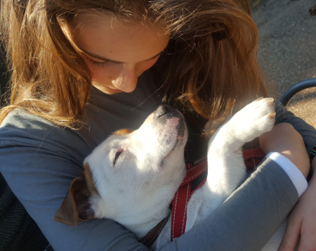

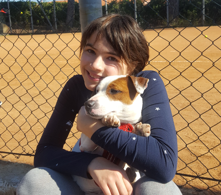

Già che siamo qui andiamo a fare due passi al Casale di Martignano, un posto
bellissimo a bordo lago

Io gioco con Olmo, che si fa anche il bagno

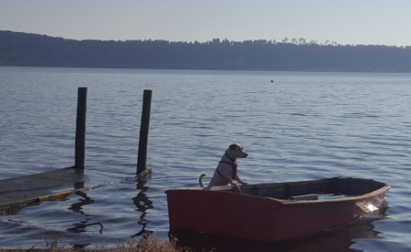

mentre Meggy va a cavallo

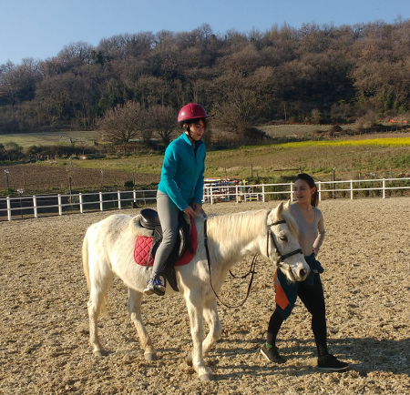

## E sono 17

_21-02-2019_

Auguri M&P per i vostri 17 anni insieme!

## Non avrete il mare ma...

_25-02-2019_

disse la nostra amica in quel di Verezzi.... e in effetti ...

passeggiata al mercato di Porta Portese e poi pranzo sul lungo Tevere...

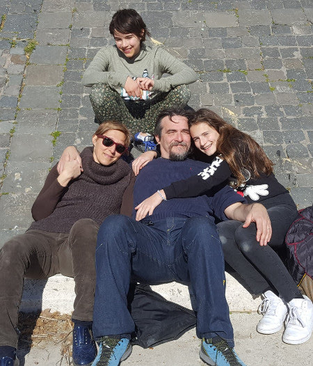

## Auguri nonno Mario

_04-03-2019_

Per il compleanno di nonno Mario una bella festa in campagna con un pò di
amici e il primo tentativo di peka di agnello!!

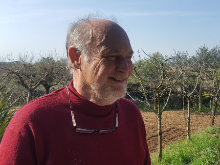

le ragazze giocano e torturano Olmo 

e raccolgono i finocchi

un ottimo e abbondante pranzo 

e infine la torta! 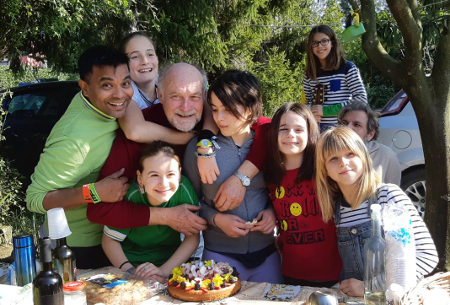

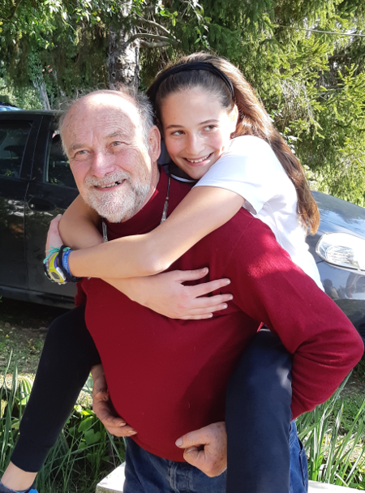

## Torneo tennis: 6 tappa

_17-03-2019_

Oggi gioco alla giustiniana. Due partite e due belle vittorie combattute!

E con questi 20 punti sono 8 in classifica (a parimerito con la 6 e 7)

.

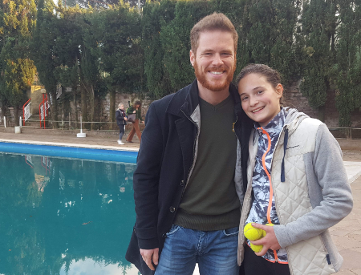

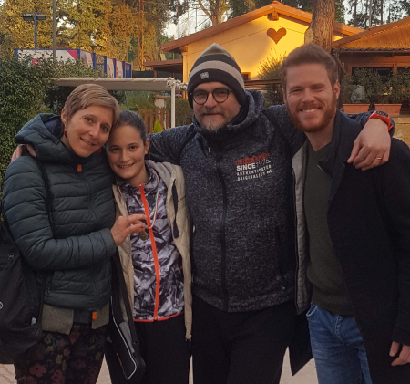

## Il risveglio di primavera

_21-03-2019_  
Si risvegliano le tartarughe e le peonie....come tutti gli anni!  
  

  

  

## Cervinia

_25-03-2019_

**17/03** ore 00.00 finalmente si parte per la montagna! Viaggio di notte per
essere a Cervinia alle 8 del mattino....con una bella sorpresa.... ziaaaaaa

Noleggiamo tutto e prendiamo la cabinovia per Plain Maison insieme a Morghi e
zia 

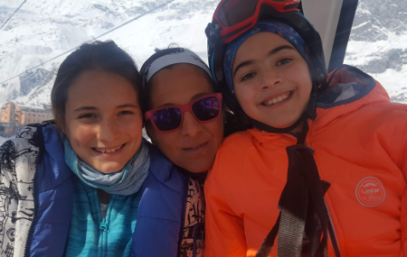

Facciamo la nostra prima sciata insieme a Silvano a Cervinia, la mitica pista
7, la Ventina, lunga 11km!

e guarda un pò .... ecco anche i Bianchin sulle piste!!!

**18/03** oggi invece c'è molto vento e le piste di Cervinia e Zermatt sono
chiuse. Così prendiamo la macchina e andiamo a Valtournanche insieme a Prisca
(ECCOI)

. Qui essendo protetto dal vento si scia! Giornata alla scoperta delle piste,
con pranzo in baita! ****

**19/03** finalmente siamo tutti insieme oggi! Che bel gruppone! ****

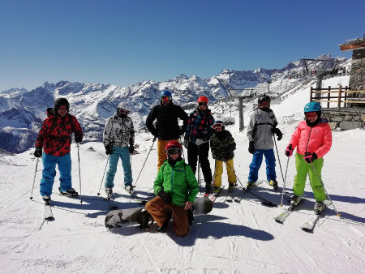

il sole, niente vento, niente nuvole, freddo (-12)

.... le piste sono tutte nostreeee

con il maestoso Cervino (4478m)

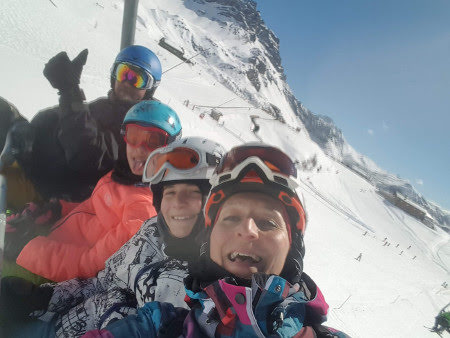

e lo splendente Plateau Rosa (3500m)

stop per panino e bombardino

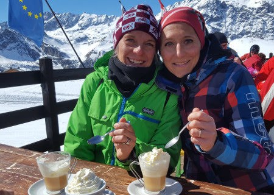

e si riparte

**20-21/03** : : la nostra vacanza procede alla grande con tanto sole, sciate,
baite, relax pomeridiani dopo-sci e serate tranquille a casa!

anche qualche birretta!!! :D 

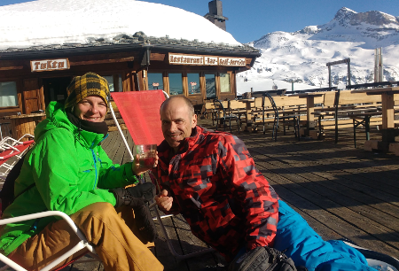

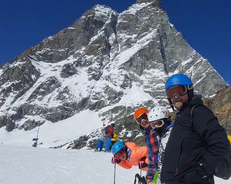

come stanca questa vacanza!! 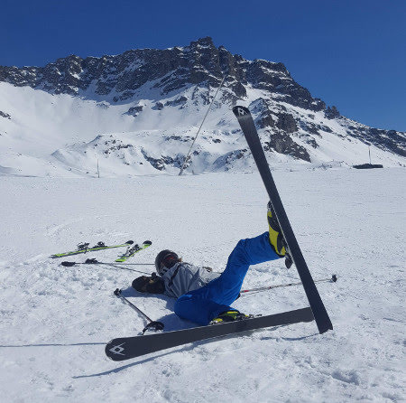

**22/03** : i Bianchin ripartono (sob)

e mati e papo prendono lo snowboard!

a pranzo ci fermiamo nella baita super chic di Plan Torrette, per una polenta
e un pò di belle foto

**23/03** : il nostro ultimo giorno....si va a Zermatt, in Svizzera!

Il cervino visto da qui è ancora più bello!

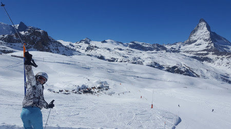

le piste sono larghissime e poco affollate, arriviamo fino agli chalet in
legno

e non può mancare la sosta al villaggio di Igloo

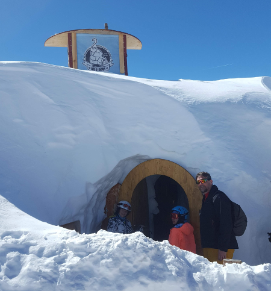

e il bar fashion con i cuscinoni!

prendiamo anche il trenino a cremagliera della fine dell'800 che porta in cima
al Gornergrat (3130m)

, la seconda più alta d'Europa

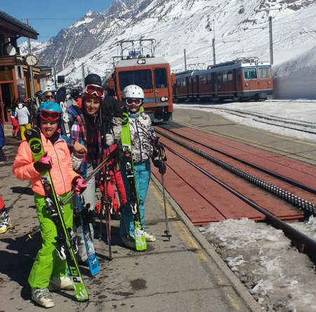

Aurevoir bellissime montagne! 

## Compleanni di M&P

_27-03-2019_

  
Auguri papà :)  
  
E finalmente un bel sole che ci porta dritti dritti al mare!  
  

  

  

  
e poi il compleanno di Mamish  
  

  

## Auguri nonno Gianni!

_07-04-2019_  
Un augurio speciale da Meggy per nonno  
  

  
  
e poi tutti a pranzo in un bellissimo locale molto fashion per il
brunch....Momo Republic!  
  

  

  

## Roma in bici

_14-04-2019_ Bellissima giornata di primavera e ce ne andiamo in giro in bici
con Meggy  
  
Da casa, Caracalla, Giardino degli Aranci, Colosseo e ritorno!  
  

  

  
  

  

  

  

  
  
  

## Pasqua con zia e Morgan

_22-04-2019_ Eccoli....finalmente a Roma!  
  
Andiamo tutti insieme a fare una gita al castello di Torre Alfina  
  

  
e poi il bosco del Sasseto con una bravissima guida  
  

  

  
e poi Pasqua tutti insieme in campagna  
  

  
ci sono anche Olmo e Chloe  
  

  
E Pasquetta al lago di Martignano  
  

  

  
  

## Ponte del 25 aprile a Sabaudia

_27-04-2019_ Le previsioni sono stupende e allora si carica Ronzinante e si
scappa a Sabaudia!  
  
**25** \- Con un pò di pazienza montiamo il catamarano gonfiabile....l'ultimo
giochino di papà!  
  

  
.... un paio d'ore dopo ....  
  
  

  
..... il varo!!!! Anvedi come va con il vento!!!  
  

  
Esausti dalla giornata dormiamo in riva al mare.  
**26** \- Mentre pigramente facciamo colazione in camper ...sorpresa.....lo
zio Nospa....passava da queste parti!!!  
  

  

  
Qualche altra veleggiata ... anche se il tempo è un pò peggiorato!  
  
  
  
  

  
**27** \- Il sole splende e abbiamo deciso di fare il trekking sul monte
Circeo!  
  
Si parte la mattina  
  

  
il panorama è stupendo a 360 gradi!  
  

  

  

  

  
e finalmente raggiungiamo la cima! Bravissimi tutti!  
  

  
Pausa panino e poi discesa.....ripidissima fino a Torre Paola .... daje de
quadricipiti!!!  
  

  
Bellissimo we!  

  
  

## Festival d'Oriente

_05-05-2019_ Un salto a vedere questa colorata e divertente manifestazione!  
  
Si passa dall'ovest  

  

  
all' est passando per il centro america per bere una pinacolada  
  

  

  

  

  
E infine un bel tatuaggio per tutte!  

  

  

  

  

  

  

## Gare di Atletica

_10-05-2019_ La scuola Mommsen si qualifica alle regionali dei giochi della
gioventù.  
Mati partecipa per il salto in alto e Flavio per la staffetta!  
  

  
(un paio di salti di allenamento)  
  
e poi alle gare a Ostia  
  

  

  

  

## Auguri Nunzietto!

_11-05-2019_ Per festeggiare Nunzio andiamo tutti in campagna dai genitori di
Teresa  
  
Che bella giornata nel verde e nella pace, ottimo cibo e musica!  
  

  

## Paintball per il compleanno di Evan

_24-05-2019_ Una festa a sorpresa per gli 11 anni di Evan .... andiamo al
paintball! La vestizione....e che guerra di palline colorate sia!!!  
  

  

  
E poi tutti insieme per la torta  
  

## Females

_27-05-2019_ Una famiglia di femmine :)  
  

  

  

  
  

  
  

## Saggio di violino

_03-06-2019_ Maty e il saggio di violino della 2 media  
  

  

  

  

## Meggy e la fine della 5 elementare

_06-06-2019_ Siamo a giugno.... la 5 elementare sta finendo... e nonostante il
campo scuola non l'abbiano fatto sono più uniti che mai!  
  

  
  
Si fanno le ultime gite  
  

  

  
le ultime ricerche con le compagne  
  

  

  
il saggio di fine anno ... super emozionante per i ragazzi e super commovente
per genitori e maestre!  
  

  
  
  

  
  
  
e infine una stupenda recita "La nostra Odissea". Grande Meggy che interpreta
la maga Circe con i maialini  
  

  
ma bravi tutti! Bellissimi costumi, scenografie e dialoghi divertenti!  
  

  

  
e poi tutti in Caffa a festeggiare e salutare le maestre Alessandra, Francesca
e Roberta.  
  

  

  
  
E l'ultimo giorno di scuola tutti in Caffa a farci i gavettoni!  
  
  

  

La classe di Mati li fa nel nostro giardino ... ancora in fase di ripristino
dopo i lavori ai balconi!

  

  

  

  

## Isa a Roma

_09-06-2019_  
Finita la scuola ci raggiungono Isa, Carolina e Codi per stare qualche giorno
insieme.  
  
Qualche passeggiata romana  
  
  

  

  

  
  

  
e poi ..... sorpresa ....a ZOOMarine  
  

  
una bella giornata nel parco tra animali  
  

  

  

  

  

  

  
giochi e scivoli!  
  

  
  

  
Davvero una bella giornata!  
  

## Weekend in moto M&P

_17-06-2019_ Le ragazze sono partite e noi ... bhè ci facciamo prestare una
signora moto e si parte per un bel giro sulla costa del basso lazio.  
  

  

  
Spiaggia dei 100 scalini o dell'Arenauta ... con tappa al baretto prima delle
scale "Ristoro Arenauta" a rifocillarci di tielle e mozzarella di bufala!  
  
C'è anche il campionato di dragon boat e visitiamo una grotta.  
  

  

La sera passeggiata per Gaeta vecchia

  

  

e cena da "Mare fritto e isole comprese"... consiglio ottimo!  
  

  
Troviamo un B&B per dormire nell'entroterra, ad . Che relax!  
  

  
  
Si riparte alla volta del mare .... il tratto a nord di Gaeta è tutto
insenature ....  
  

  
ci fermiamo per un bagno nella spiaggia di Fontania con le vasche romane che
affiorano.  
  

  
Poi ci spostiamo verso Sperlonga. Pranzo di pesce al ristorante
"L'angolo"...anche questo consigliato, sobito sotto la rocca. Passeggiata fino
al paese per smaltire il pranzo!  
  

  

  

  
Bellissimo we ... grazie a Giò per i consigli e a Fede per la moto!  
  

## C'è da spostare una barca ....

_23-06-2019_ Da bravo skipper papo si offre di aiutare a spostare una barca da
Anzio ad Ostia.  
  

  

Bellissimo stare in mare al tramonto

  

  
Poi si alza vento forte e cala la notte ..... mamma stecchita!  
  

  
  
  

## Un saluto a nonna nonna

_06-07-2019_ Qualche giorno nelle Marche e un saluto alla mitica nonna nonna
Maria!  
  

  

  

## Timoniere Flavio :)

_06-07-2019_ Oggi usciamo con la barca di Roberta insieme a Flavio e Paola  
  

  

  

## 50 volte Paolett in Sicilia

_20-07-2019_  
La nostra Paoletta compie 50 anni e ci regala una bellissima settimana in
Sicilia insieme a "Li Tuzzi".  
  
**13/07** : Noi partiamo in aereo e appena atterrati un arancino, una granita
e una scappata a salutare Annagloria  
  

  

un tuffo in piscina  
  

  

  

  
e poi andiamo al villino di Fontane Bianche.  
  
**14/07** : Eccoci tutti insieme... partita a carte e poi bagno...  
  
  

  
e per iniziare non c'è spiaggia più bella di quella del Gelsomineto  
  

  

  

  
  
tornati a casa però ci attende una brutta sorpresa .... sono entrati i ladri e
ci hanno rubato computer, macchine fotografiche e qualche gioiello :(  
Ma non ci facciamo scoraggiare ... siamo solo all'inizio della nostra
bellissima vacanza!  
  
**15/07:** oggi visitiamo la splendida città barocca di Noto.  
  
La cattedrale, i balconcini, il riverbero della luce sulla pietra bianca ....
la briosche con il gelato :D  
  

  

  

  

  

  
  

  

  

per pranzo ci spostiamo nel delizioso paesino di Marzamemi, famoso per la
tonnara

  

  

fritturina di pesce e relax

  

  

  

  

  
**16/07** : Riserva di Vendicari. Bagno e tartaruga di sabbia alla spiaggia
della tonnara  
  

  
e poi passeggiata per la riserva lungo la costa  
  

  

  

  
dove ci aspettano i cavalloni di Cala Mosche ...e un inizio di temporale!!  
  

  

  

  
  
per fortuna troviamo riparo in un ristoro tra le piante di arance e finalmente
torna il sole ...in attesa che i papà ci recuperino!  
  

  

La serata la passiamo a Siracusa, con una passeggiata all'isola di Ortigia

  

  

  
**17/07** : Oggi brutto tempo. Rimaniamo nei dintorni di casa.  
  
**18/07:** Auguri Paola!!! Per il tuo compleanno una stupenda escursione
sull'Etna con l'associazione EtnaExcursion e le nostre bravissime guide, la
bella e la bestia, Piera e Paolo. Prima però abbondante colazione!  
Si sale verso il cordone di crateri spenti della colata di 18 anni fa.  
  

  

  

  

  

  

  
E la discesa? Un ghiaione di pietruzze e polvere lavica ... tutto di
corsa...che figata!  
  
Tappa per la visita alle grotte di scorrimento lavico  
  

  

  

e infine la torta e le candeline ....

  

  

e un tuffo in piscina ... a casa di Annagloria

  

  
**19/07** Spiaggia del Gelsomineto....scogliera e tuffi!  
  

  

  

  

  

  

  
Bellissima vacanza, grazie Paola per la scelta e a tutti per la compagnia!!  
  
Per concludere.... il pane cunzato al curvone....  
  

  

  

## Brallo e mare

_21-07-2019_ C'è chi va ad allenarsi al centro federale di tennis al Brallo e
chi se la spassa al mare!  
  

  

  

  

## Torre Astura

_27-07-2019_ Per un weekend da soli in camper scegliamo la nostra amata
Sabaudia...nonostante il tempo non sia bellissimo  

  

  

e poi una biciclettata nella splendita torre Astura

  

  

  

  
  
  

## Uomini e lupi in val Gesso

_08-08-2019_ Siccome ci stavamo rilassando troppo ....  
  

  

  
papà ha deciso di portarci sulle Alpi Marittime, in val Gesso, a trovare la
Becchettys family!  
  

  
Abbiamo visitato il centro "Uomini e Lupi" che in un grande recinto ospita
alcuni lupi non più in grado di vivere in natura  
  
  

  

  
  
Ci siamo divertiti con delle bellissime passeggiate  
  

  
  

  

  

  

  

## Amici e famiglia

_10-08-2019_

## Loire a velò

_28-08-2019_

**17/08** si parte dalla Liguria verso la Francia. Prima tappa a Lione per
sgranchirci le gambe e le zampe!

  

  

**18/08** In serata arriviamo a Orleans per incontrarci con Michele e iniziare
il nostro viaggio.

  
  
  

  

**19/08 Orleans - Meung-sur-Loire (23Km)**

Parcheggio di macchina e camper, noleggio e montaggio bici (con imprevisto
perdita del bullone della ruota) ma alla fine si parte! Iniziamo subito con
l'attraversamento delle Loira per andare sulla sponda sud e iniziare la nostra
ciclabile "Loire a Velò"

  
  
  

  

  

Acclimatazione....pochi Km ma birretta e ralax alla meta!

  

  

**  
**

**20/08 Meung - Chambord - Blois (54Km)**

Si pedala lungo il fiume enorme e silenzioso

  

  

  

incontrando posti buffi come questo punto ristoro con delle sculture
originalissime

  

  

... e si fanno anche cose buffe :)

  

  

con una piccola deviazione arriviamo al maestoso castello di Chambord

  

  

  
  
  

  

infine al tramonto raggiungiamo Blois ...con il suo ponte sul fiume

  

  

  

e ci concediamo una ottima cena con buon vino!

  

  

**21/08 Blois - Chaumont-sur-Loire-Amboise (36km)**

Passeggiata per Blois con il suo bel castello e la terrazza panoramica sul
fiume

  
  
  
  

## Baratti e Populonia

_28-08-2019_

Tornando verso casa passiamo a trovare i cugini a Populonia

  

e ci godiamo il tramonto nella spiaggia di Baratti

  
  

  

## Cervia

_07-09-2019_

Le ragazze partono per una settimana di atletica a Cervia!

Tra allenamenti mattina e pomeriggio, serate dancing, parco acquatico, bagni
Bea e David hanno proprio saputo come farli divertire!

E Mati festeggia il suo primo compleanno lontana da M&P :( ..... ma insieme a
tanti amici e a Meggy!

  

  

  

  

e al ritorno.....tortina di compleanno a casa!

  

  

## Torre Astura .... ultimo mare prima dell'inizio della scuola

_14-09-2019_

Ci regaliamo un bellissimo we con gli amici a Torre Astura prima della ripresa
della routine!

  

  

  

  

## Scuola 2019-2020

_16-09-2019_

Si ritorna a scuola, 1 e 3 media!

  

  

## 11 anni di Meggy!

_23-09-2019_

Festona in giardino con gli amici

  

  

  

  

  

  

un super salamone di cioccolata

  

e giochi ..... apprezzatissimo quello delle ciambelle!

  

  
  

## Nuovi e vecchi sport

_01-10-2019_

Mati ricomincia con il tennis e i tornei

  

  

mentre Meggy inizia il basket

> > > >
> ]

  

## Romix

_05-10-2019_

Una volta ci si deve andare .... e pure mascherati!

  

  

  

## WE di ottobre

_13-10-2019_

Questo ottobre ha fatto delle giornate stupende....e mentre papà va a vela noi
ci godiamo il mare

  

scoattando un pò in spiaggia ....che cringe!

  

  

  

E festeggiamo anche l'anniversario dei nonni!

  

  

## Halloween 2019

_31-10-2019_

  

Come sempre non possiamo non festeggiare Halloween!! Si prepara la casa

  

e i dolcetti mostruosi  

  

  

  

e infine le streghette pronte ad andare in giro a fare "trick or treat"

  

... e anche le mamme!!!

  
  

## Passeggiate romane

_02-11-2019_

Roma è sempre bellissima e passeggiare tutti insieme non ha prezzo!

  

  

  

  

## Gli artigiani

_10-11-2019_

.... e con un amico falegname....vuoi che papà non imparasse anche a lavorare
il legno!!

LA CHITARRA

  

LA SCRIVANIA DI MATI  

  

  

## Impariamo a cucinare siciliano

_08-12-2019_

.... grazie a nonna Lilli che ci insegna a fare gli involtini di pesce spada

  

e le scacciate

  

  

  

## Mercatino di Natale al castello di S. Severa

_15-12-2019_

Una passeggiata al mare per vedere il mercatino nel castello

  

  

  

## La vigilia di Natale

_24-12-2019_

.... siamo tutti a casa di Cicetta e Manu!

  
  

  

  

  

## Passeggiata al centro

_27-12-2019_

La passeggiata a piazza Navona sotto Natale non può mancare e soprattutto la
mela caramellata.

  

  

  

Stavolta abbiamo anche Chloe.

  

## Nonno Mario in ospedale

_29-12-2019_

Siamo abituate a questi 4 nonni forti e in salute....ma ogni tanto succede
qualcosa :(

Nonno Mario è stato ricoverato nelle Marche per una brutta
polmonite/pleurite....ma dopo due interventi è tornato in forma come sempre!

  

  

  

Grande nonno! Ti vogliamo bene!

1

​

