# 2020

## London

_06-01-2020_

**1/01** \- Un capodanno strano questo! Papà nelle Marche da nonno Mario e noi
in partenza per Londra...fino all'ultimo indecise se partire. Ma avevamo
organizzato tutto....e così partiamo la notte di Capodanno

  

Arriviamo a Londra la mattina prestissimo e andiamo subito in centro a vedere
la sfilata di Capodanno, la New Year's Day Parade nel West End

insieme gli immancabili Beghini e i Tuzi

  

  

Pranzetto al pub e poi a casa stanchi per la levataccia

  

  

  

**2-01** Passeggiata in centro, nei negozi più commerciali ed esagerati di
Londra

  

  

  

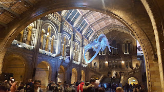

  
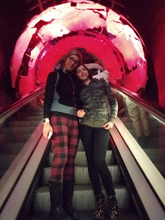

  

  

  

  

Bellissima Londra con i suoi contrasti antico e moderno

  

  

**6-01** Altro bel mercato e poi si ritorna a casa ....sob....ciao Londra

  

  

  

  

  

  

  

  

  

  

## Inizio anno bucolico

_10-01-2020_

Questo anno inizia con tante passeggiate in Cafferella e agli Acquedotti

  

  

  

  

## 18 anni insieme

_20-02-2020_

dopo un bel s. valentino....

  
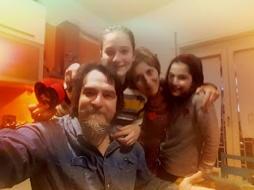

  

festeggiamo i nostri 20 anni insieme....una giornata di relax a Viterbo alla
Therma Oasi

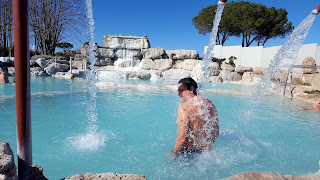

  

  

e poi a teatro a vedere i Momix

  

  

## Compleanno di Matilde....con 6 mesi di ritardo

_22-02-2020_

> Una bella festa a casa con tema Cena con delitto

  
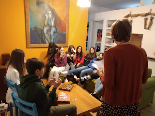

  

  

ovviamente l’ha capito solo Bea chi era l’assassino....hahahaha

## Nonno Mario torna a casa

_25-02-2020_

Eccolo nonno finalmente a casa per la gioia di noi tutti ..... ma soprattutto
di Olmo

  

  

## Camerette separate

_28-02-2020_

Deciso... è ora di avere camere separate. Meggy prende la nostra ex camera e
io una cameretta tutta nuova.....Valentino inizia i lavori...e noi dormiamo
per terra

  

chiudiamo le mensole

  

chiudiamo la porta comunicante

  

dipingiamo le pareti di blu e di viola

  

e troviamo anche un posto al pianoforte

  

  
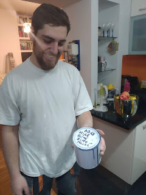

  

  

  

  

## Auguri nonno Mario

_01-03-2020_

Un compleanno speciale insieme alle tue splendide nipotine

  

  

## Settimana bianca a Campitello di Fassa .....bhè mezza settimana....

_10-03-2020_

7 marzo - Si parte per Campitello di Fassa, un bel gruppone misto di vecchi e
nuovi amici.

Il periodo è un pò particolare perchè sta dilagando un terribile virus, il
COVID-19. Ma noi decidiamo di tentare la sorte e partire.

L’albergo è bellissimo e c’è tanta neve

  

8 marzo - Poca gente, piste semi vuote, sole ....ne approfittiamo per una
splendida sciata

  
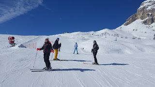

  
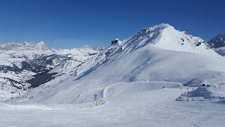

  
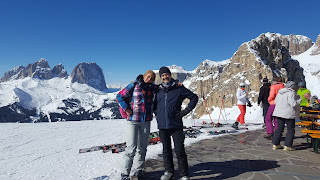

  

  

9 marzo - Oggi si tenta il giro del Sella Ronda, partenza da Campitello

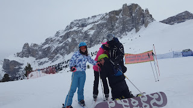

  

  

  

  

  

  
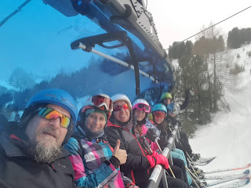

  

sciata sulle bellissime piste di Selva di Val Gardena ... poi inizia a
nevicare e siamo costretti a rientrare.

La sera in albergo la tensione è alta, il presidente della repubblica dichiara
che tutta l’Italia è in zona rossa e dobbiamo tutti tornare a casa. Inizia il
lockdown.

## Si balla ai tempi del coronavirus

_19-03-2020_

Non scriviamo da parecchio per mille motivi, e ricominciamo in un momento
particolare della nostra vita. Il mondo intero sta fronteggiando il
CORONAVIRUS e siamo costretti a rimanere a casa.

  

Però non ci perdiamo d'animo ed in attesa del più grande ballo collettivo di
tutti i tempi, ci alleniamo ...

  

  

## COVID-19 - Il lockdown

_09-05-2020_

Incredibile pensare ad una pandemia nel 2020, eppure questo virus terribile
sta dilagando a macchia d’olio facendo migliaia di vittime.

Siamo chiusi in casa, in smart working e DAD - didattica a distanza.

Ci stiamo reinventando una vita con ritmi diversi, in isolamento sociale.
Emotivamente e fisicamente difficile.

Per due mesi e mezzo abbiamo vissuto in casa e in giardino, una gran fortuna a
dire il vero.

Lavorando e studiando

  

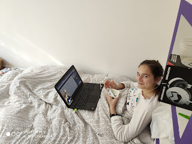

  

  

suonando e imparando a programmare

  

  

coccolando le micie e Olmo, che ogni tanto stava con noi

  

  

  

  

  

  

  

  

cucinandoci cose buone - tra cui ravioli cinesi, gnocchi e pesce di tonno - e
facendo ottimi aperitivi ....

  

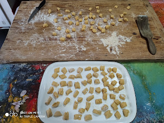

  

  

  

  

  

e tante partite a ping pong e biliardino

  

ma anche allenandoci a casa con le app di fitness e la bici da spinning

facendo lavoretti di bricolage, dipingendo di rosso l’armadio e montando tutti
i mobili che man mano ci consegnavano ...tranne i letti....

  

  

curando il nostro giardino e raccogliendo i conquat per fare la marmellata

  

  

  

  

abbiamo anche fatto l’orto in cassetta ...con grandi soddisfazioni

  
  
  

  

e poi ....abbiamo festeggiato .... il compleanno di Cate e zia Betta in video
conference con i nonni

  

  
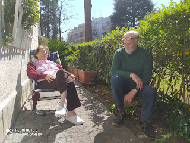

  

la festa del papà con degli ottimi bignè fatti da mamma

  

  
  

il compleanno di papà

  

  
  
  

  

il compleanno di mamma

  

  

Pasqua

  

  
  
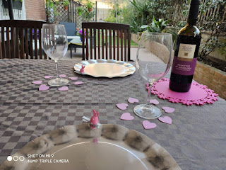  
  
il compleanno di nonno

  

  

  

  

il 25 Aprile con il BBQ

  

  

insomma due mesi....che alla fine sono passati....

  

  

  

## Prime uscite .... in bici

_17-05-2020_

**9-05** Siamo ancora in zona rossa ma si può andare in bici, cosi decidiamo
di percorrere la ciclovia del Tevere, nel tratto ciclabile che da casa ci
porta fino a Labaro, passando per circo massimo, lungotevere, ponte della
musica, ponte milvio, parco di tor di quinto, castel giubileo

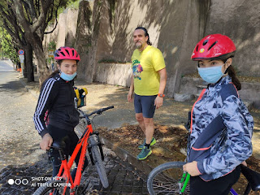

  

  
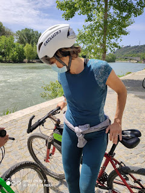

  

  
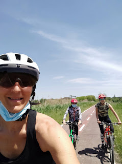

  

ci sono anche le tartarughe nel laghetto del Parco di Tor di Quinto

  

insomma più di 50Km ....ci voleva proprio

  

**17-05** Stavolta altro pezzo di ciclabile, da casa verso sud fino a
Fiumicino ...si parte in tanti ....

  

  

**  
**

  

  

ma si arriva in pochi

  

  

Stavolta però torniamo in treno....solo ad andare abbiamo fatto più di 60km

  

  

  

## Esame di 3 media per Mati

_19-06-2020_

Lo stravolgimento di questo anno si riflette anche sul temutissimo esame di
terza media....che per Matilde invece diventa una tesina orale
multidisciplinare .... il suo tema?....la musica ovviamente ...dopo aver
passato mesi a guardare la serie Glee ....eccola al suo esame....un pò agitata
all’inizio ma poi prende il via e ripete benissimo e tutto d’un fiato

I proff si complimentano per i sui tre anni di medie e le fanno tanti auguri
per il suo futuro....chiusa la connessione....un bel pianto

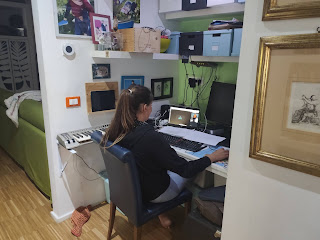

  

e due coccole con mamma

.... e finalmente libera

  

  

## Giugno al Circeo

_30-06-2020_

Siamo appena usciti dal lockdown e decidiamo di trascorrere il mese di giugno
a casa di zia Aldina al Circeo. Smart working e ultimi giorni di DAD, e
preparazione della tesina di 3 media di Matilde

  

  

  

  

  

e festeggiamo anche il nostro 12esimo anniversario di matrimonio

  
  

Si fanno tante cose.....si prepara la tesina ....con Olmo

  

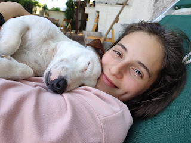

  

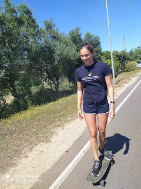

si va a vela  

  

  

  

si fanno lunghe passeggiate e ci godiamo la spiaggia anche con le giornate più
fredde

  

  

  

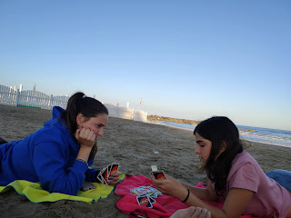

si fanno nuove amicizie  

e ci vengono a trovare i nonni e gli amici

  

  

  

  

  

  

  

  

  

  

  

  

  

  

E poi abbiamo scoperto la parte del faro.....bellissima

  

  
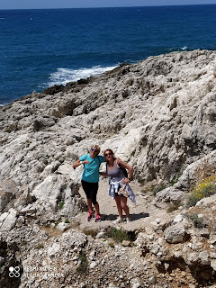

  

  

Arriveduar Sabaudia....splendida spiaggia dal tramonto indimenticabile  

  

## Estate ligure

_15-07-2020_

E dopo il Circeo si va in Liguria, sempre in smart ....

  

con mare a pausa pranzo o serale

  

  

  

  

  

uscite in barca con Stefano

>
>   
>
>   
>

aperitivi serali e relax in terrazza

  
  
  
  

  

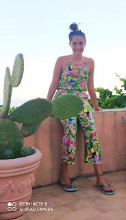  

  

  

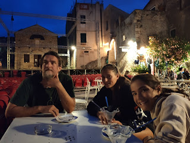

  

e serate con Carolina, Isa e Claudio

  

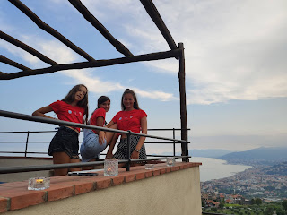

  

  

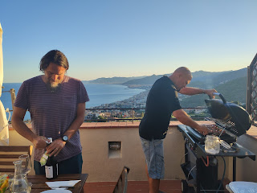  

  

e si impara anche a curare le arnie con Fabio

  

  

  

e serate a Bastia con zia Giorgia e Silvano

  

  
  

  

  

con
notte in tenda

  

  

  

e uscite in canoa a Bergeggi

  

  
  
  
  
  
  
  

e picnic in spiaggia

  

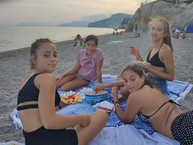  

  

  

e poi vengono anche zia Betta e Cate  

  

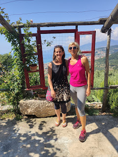

  

  

  

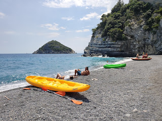

  

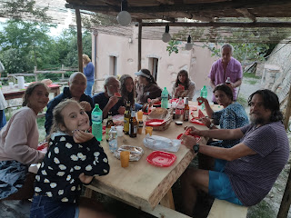

  

  
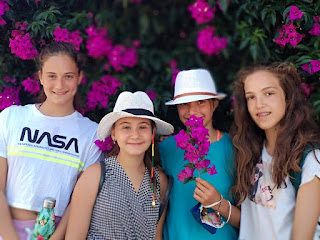  
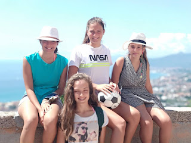

  

e nel frattempo il povero Morghi è stato anche operato ad una brutta ciste
alla zampa

  

  

e il povero Silvano festeggia 80 anni delle S di Gorra

  

  

  

  

## Compleanno di nonna Lilli

_16-07-2020_

Tanti auguri nonna

  
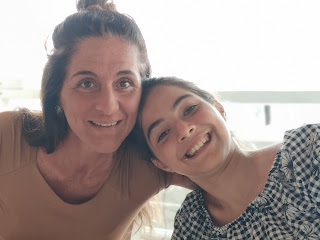

  
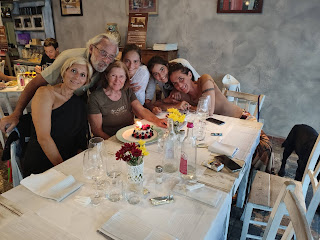

  

## Val Maira con nonni e zia

_28-07-2020_

Finalemente siamo in Val Maira, una valle del cuneese rinomata per la sua
bellezza...e in effetti!

Prendiamo una casetta a San Michele di Prazzo insieme a zia Giorgia, Morghi e
i nonni

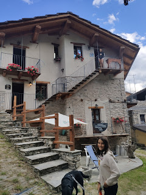

25/07 Stamattina saliamo per i tornanti di Marmora per arrivare alla Gardetta  

  

  

M&P salgono al colle del Mulo  

  

  

e alla statua di Pantani a 2500m del colle della Fauniera  

poi sosta al laghetto di Resile  

  

  

26/07 Oggi affrontiamo una salitona che da San Michele ci porta verso la vetta
del Chersogno.  

  
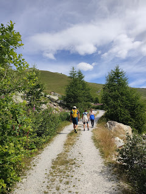

  

  

  
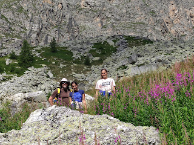

  

Non arriviamo in cima ma facciamo la deviazione per il Lago Camoscere  

  

  

  

Che camminata oggi!

27/07 Passeggiata a Chiappera, dove la valle finisce con montagne stupende e
le cascate di Stroppia  

  

Ci portiamo nonno fino alla base delle cascate! Grande!  

  
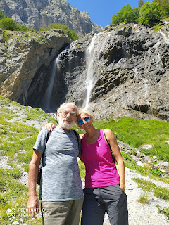

  

  

e poi tutti a pranzo al Campo Base  

  

Torniamo alla casetta e nel pomeriggio facciamo, sempre con nonno, il sentiero
Remo Einaudi, detto anche il sentiero degli Gnomi, dove gufi, volpi, civette e
gnomi ci accompagnano  

  
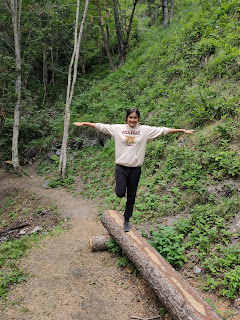

  

  

  

28/07 Stamattina Parco avventura

  

  

e poi passeggiata alle sorgenti del Maira....dove l'acqua è gelida!  

  

  

  
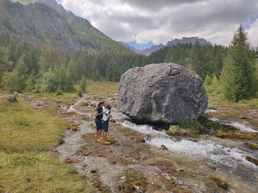

  
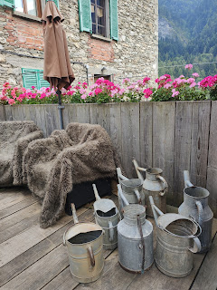

  

Ponte del diavolo a Dronero  

  

e apericena a Cuneo in un localino gourmet!

  

  

  

  

## WE nelle Langhe per M&P

_13-08-2020_

Dopo tutti questi mesi insieme M&P si prendono un we da soli e se ne vanno
nelle Langhe.

Barolo e il suo particolare museo del vino

  

  

  

curarsi con il vino  

  

vigneti a perdita d'occhio...  

  

  

  
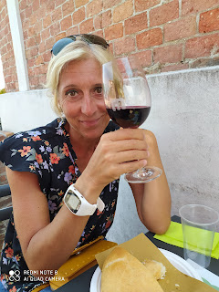

primo bicchiere della giornata.... poi passiamo nella Cantina del Glicine a
Nieve e facciamo un'ottima degustazione...con Arneis, Nebbiolo, Barbaresco,
Barbera e Moscato!  

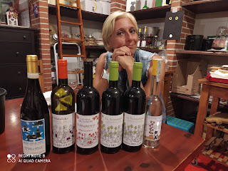

  

Poi relax alla Rosa Gialla e cena in un ottimo ristorante a Monforte d'Alba,
le Case dellaSaracca.

  

  

La mattina super colazione in albergo e si riparte

alla ricerca delle chiesette di Tremlett, la cappella de La Morra  

  

  

poi il castello di Castiglione Falletto  

  

  
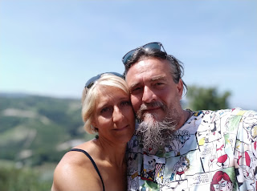

  

e quello di Grinzane Cavour

  

le panchine giganti

la chiesetta di Coazzolo

  

e poi relax nella piscina dell'albergo Castiglione Langhe .... con aperitivo
all'Arneis  

  

  

Cena tipica nel bellissimo agriturismo I tre poggi  

Visita interessantissima alla cantina Coppo a Canelli, con la sua cattedrale
sotterranea.  

  

  

e immancabile degustazione!  

  

  

si torna verso casa passando per Alba ....bellissimo we!!!

  

## Un passaggio a Valdolmo

_17-08-2020_

Un passaggio a salutare i nonni e Olmo

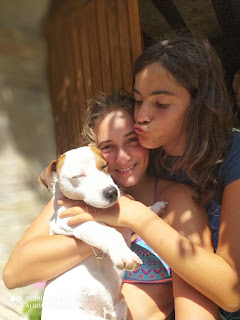

  

  

  

con passeggiata a cavallo  

  

  

  

  

  
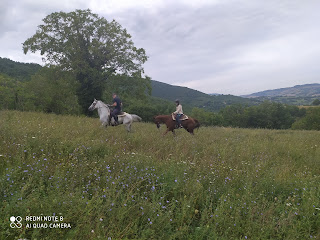

  
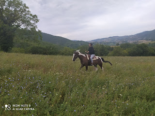

  

e corso di cucina da zia Fiorella

  

  

  

## Sardegna

_01-09-2020_ In questa strana estate riusciamo anche a finalizzare lo scambio
casa che avevamo concordato a dicembre con la simpatica Iside. La sua casetta
in Sardegna, accanto al porticciolo di Marina di Capitana, vicino Cagliari ci
sta aspettando! Eccoci finalmente!

  
  
23/08
Noleggiamo gli scooter al porto di Capitana (meravigliosamente gentili e
disponibili i ragazzi di Cagliari Rent!) e siamo pronti a girare!

  
  

  

Cala Regina il nostro primo bagno, acqua bellissima

  

  

Seratina a Cagliari a fare due passi sul bastione di Saint Remì e prenderci un
aperitivo lungo le mura e cenare in una trattoria tipica con malloreddus,
pesce alla griglia e seadas

  

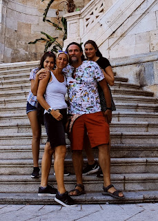  
  

  

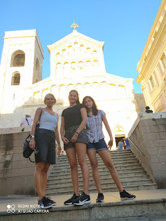

  

24/08 Spiaggia di porto Giunco. Tanto vento ma acqua meravigliosa.

  
  
  
  
  
  

25/08 Passaggio radente con ventone al Poetto, solo i fenicotteri posso stare
...

  

  

proviamo Cala mosche ma è super affollata, invece poco più avanti ci fermiamo
in una spiaggetta minuscola con stabilimento privato, Le Paillote per fare un
bagno ..

  

  

  

e dopo scendiamo per l'impervio sentiero che porta a cala Fighera. Una caletta
rocciosa stupenda, un pò calda e di dominio nudista....ma ne vale la pena!

  
  

  

Nel pomeriggio andiamo a visitare il giardino sonoro di Pinuccio Sciola, un
artista di campagna che ha saputo tirare fuori l'anima dalle rocce facendole
risuonare meravigliosamente

  
  
  
  
  
  

26/08 Relax a casa la mattina e poi ci spostiamo verso Punta Molentis, dove
l'ingresso a numero chiuso ci convince subito a girare dietro il promontorio e
scendere sul latoB....ovviamente deserto!

  

  
nel
tardo pomeriggio ci riaffacciamo....e bhè ne vale proprio la pena....spiaggia
di sabbia bianchissima con tipiche rocce bianche

  
  

  

aperitivo in attesa del tramonto

  
  
  
  
  

.... tramonto che da qui ha tutto un altro colore

  

  

27/08 Vicino casa abbiamo un spiaggia dai colori incredibili, chiamata appunto
Mari Pintau

  

  

Nel pomeriggio sia papo che Meggy non si sentono bene, febbre e
raffreddore....così a cavallo nelle saline del parco naturale del Molentargius
ci andiamo solo io e mamma  
  
  

28/08 Colazione al Poetto e poi tappona fino alla spiaggia di Su Giudeu

  

  
  
  
  
con
escursione sul divano!  
  
  
  

  

Bellissima la zona di Chia  
  
  

  

29/08 Mattina nella spiaggia di Is Canaleddus, sassi e compiti! Papo è ancora
un pò malaticcio!

  

  

In serata facciamo un pic-nic a Mari Pintau e ci godiamo uno splendido
tramonto

  
  
  

30/08 Giornata nuvolosa, visitiamo l'antichissima città di Nora, fenicia,
punica, romana!

  

  
  
  
  
  
  

serata a Cagliari ....ultima seadas :)

  
  
  

31/08 Il temporale non ci scoraggia, andiamo a vedere la bellissima spiaggia
di Santa Giusta, costa Rei

  

  
  
  
  

  

e poi esce il sole!

  

  
  
  

  

  

## Compleanno di Mati 14

_07-09-2020_

Quest'anno si festeggia con poche amiche. Si va a pranzo in centro...

  

poi una bella passeggiata e la torta con nonni, zia, cugina e i beghini

  

## Passeggiata a monte Livata

_19-09-2020_

Un piccolo trekking sulla cima del monte Autore

  

  

e poi sbraciolata con i colleghi

  

  

  

e la piccola Flaminia

  

##

_23-09-2020_ Esperienza indimenticabile e da ripetere....

## Compleanno di Meggy 12

_24-09-2020_ Prime candeline alle 7 di mattina con la crostata fatta da Mati

  

il pomeriggio alla mostra di Banksy  

  

  

irriverenti....

e
candeline anche la sera

  

e poi si festeggia con le amiche

  
  
  

  

## Raccolta olive 2020

_07-11-2020_

Sembravano poche.... e invece ... 4 we a raccogliere le olive

  

  

  

  

  

con questi meravigliosi colori autunnali

  

  

  

  

e tramonti speciali

  

e poi al frantoio

  

  

  

  

## Padel love

_22-11-2020_

Nato per gioco, diventato una passione

  

  

e c’e anche chi festeggia il compleanno giocando un torneo

  

  

  

  

## Visita all’antica Monterano

_29-11-2020_

## Christmas mood

_08-12-2020_

Quest’anno nuovo albero di Natale e nuove decorazioni

  

  

  

ma stesse micie appassionate

  

  

e un tocco di eleganza

  

## Monte Livata e le ciaspole

_20-12-2020_

Che scoperta queste ciaspole e le passeggiate a Monte Livata!

La prima volta il 20 dicembre

  

  

  

  

  

  

e poi bissiamo e trissiamo a gennaio, con le amiche e in famiglia

  

  

  

  

  

  

  

## Buon Natale 2020

_25-12-2020_

I preparativi fervono....si fanno i ravioli con i nonni e il tronchetto

  

  

  

  

e poi si festeggia ....quest'anno da soli ....

  

  

  

e arriva un regalo assolutamente inaspettato.....la promessa di una cucciola
:D

OLIVIA

